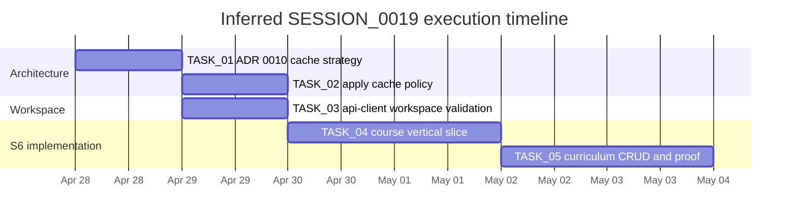
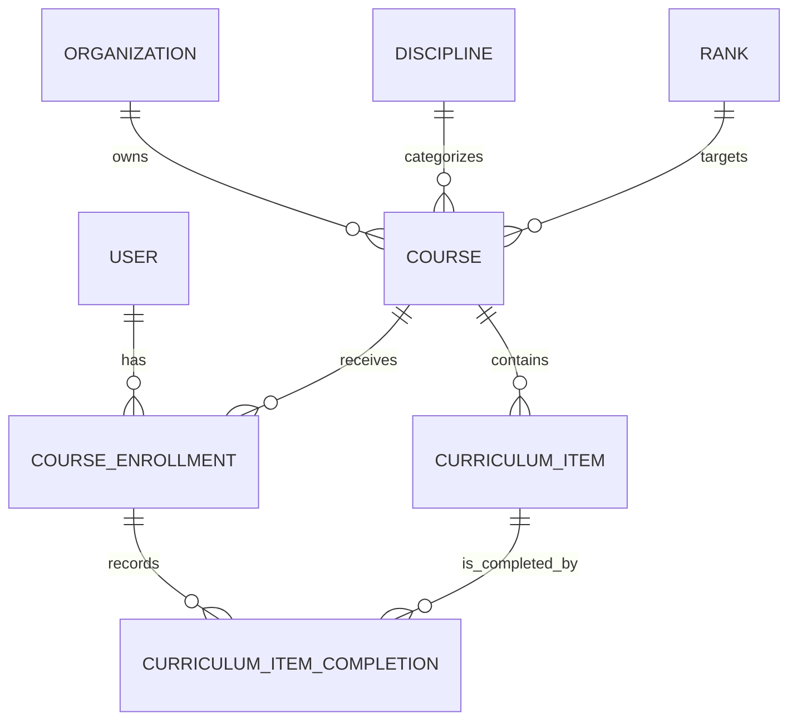

# Implementing SESSION_0019 for Ronin Dojo Baseline

## Executive summary

I did **not** locate a `SESSION_0019.md` file or explicit `TASK_01` through `TASK_05` artifacts in the repo materials I could inspect through the GitHub connector. The latest directly inspectable session artifact was `SESSION_0017`, and it says the **next session goal** should be deep research on a safe cache strategy for auth-scoped queries, produce **ADR 0010**, and then begin **S6 Courses** if that cache strategy is resolved. fileciteturn48file0L1-L1

On that basis, the most defensible interpretation is that **SESSION_0019 should be inferred**, not recovered verbatim. The highest-confidence inferred scope is:

1. close the open architectural blocker around **auth-scoped caching**,
2. apply that policy conservatively to the existing S2–S4 reads,
3. clear the open workspace/mobile-scaffold item around `packages/api-client`,
4. implement the **S6 Course vertical slice** in Dirstarter style,
5. implement **CurriculumItem CRUD plus smoke-proof and docs closure**. fileciteturn46file0L1-L1 fileciteturn45file0L1-L1 fileciteturn12file0L1-L1

That interpretation fits all of the repo evidence. The program plan marks **S1–S5 effectively complete** and identifies **S6** as `Course + CurriculumItem CRUD`. The schema already contains `Course`, `CurriculumItem`, `CourseEnrollment`, and `CurriculumItemCompletion`, so this next step is mostly an **implementation problem**, not a schema-design problem. fileciteturn12file0L1-L1 fileciteturn19file0L1-L1

Dirstarter should remain the **primary architectural reference** because it defines the repo’s preferred slice structure: App Router pages, `server/web/<entity>/payloads.ts`, typed `select` payloads, action/procedure wiring, Prisma/Postgres, Better Auth, and content/media patterns. The official docs confirm that Dirstarter is built around **Next.js App Router**, **Prisma/PostgreSQL**, **Better Auth**, and a modular folder structure that already maps well onto the Ronin Baseline repo. citeturn7search2turn1search0turn1search2turn2search4

My recommendation, acting as **Petey**, is to treat SESSION_0019 as a **two-gate execution session**:

- **Gate A**: approve ADR 0010 and classify queries into `public-cacheable`, `brand-cacheable`, `viewer-sensitive`, and `admin-sensitive`.
- **Gate B**: once cache policy is explicit, execute the S6 Course/Curriculum vertical slice using Dirstarter’s payload/query/action/page conventions. fileciteturn48file0L1-L1 fileciteturn45file0L1-L1

## Research basis and current repo state

Dirstarter’s documented structure is stable and highly relevant here. Its core directories are `app`, `components`, `config`, `content`, `lib`, `prisma`, `server`, and `services`, and the documented pattern is to build feature slices under `server/web/<entity>/` with payloads, schemas, queries, and actions. citeturn7search2 The Ronin Baseline repo has already formalized that mapping in `docs/architecture/dirstarter-architecture-map.md`, which treats Dirstarter as the **L1 source of truth** for structural patterns and explicitly maps future Ronin entities like `Course` and `Tournament` onto the Dirstarter `Tool`-style vertical slice. fileciteturn45file0L1-L1

The repo’s current stack is also aligned with the latest Dirstarter direction. In `apps/web/package.json`, the app uses **Next 16**, **React 19**, **Prisma 7**, **Better Auth 1.4**, **Bun**, S3, Resend, Stripe, and Content Collections. The Dirstarter docs describe the same foundational architecture: Next.js App Router, Prisma with PostgreSQL, Better Auth, Content Collections for MDX, and media/storage integrations. fileciteturn20file0L1-L1 citeturn7search3turn1search0turn1search2turn5search0turn5search1

The program plan says:

- **S1** schema rev is done,
- **S2** Better-Auth + Passport bootstrap is done,
- **S3** Organization create/join is done,
- **S4** Directory search with privacy is done,
- **S5** rank seed work is effectively done,
- **S6** is the next major sprint: `Course + CurriculumItem CRUD`. fileciteturn12file0L1-L1

The latest inspectable session, `SESSION_0017`, confirms that:

- S4 was browser-verified and closed,
- payload files were added for Passport, Organization, and Directory,
- query refactors from `include` to payload-based `select` landed,
- but the cache alignment issue remained **open** because Dirstarter’s public-data caching pattern does not directly answer Ronin’s auth-scoped privacy problem. fileciteturn48file0L1-L1

That open issue is also registered as drift item **D-005**: “Cache pattern not applied to read queries … needs research — auth-scoped data risk.” The same session also left **D-006** open because `packages/api-client` had not yet been installed into the workspace. fileciteturn48file0L1-L1

## Requirement mapping

Because `SESSION_0019.md` is not present, the table below maps the **most plausible inferred requirements** to concrete implementation steps.

| Inferred SESSION_0019 requirement | Why it is the right inference | Concrete implementation step | Done when |
|---|---|---|---|
| Resolve auth-scoped cache strategy | SESSION_0017 explicitly names this as the next-session goal and ties it to a future ADR 0010. fileciteturn48file0L1-L1 | Write `docs/architecture/decisions/0010-cache-strategy-for-auth-scoped-queries.md` with a query-classification matrix and coding rules. | ADR accepted and referenced by drift register / next session docs. |
| Apply cache policy to S2–S4 reads | The repo’s pattern audit originally wanted Dirstarter-style cache directives, but SESSION_0017 deferred them because of privacy risk. fileciteturn46file0L1-L1 fileciteturn48file0L1-L1 | Add persistent caching **only** to public or viewer-independent reads; leave self/profile or privacy-filtered reads on request-bound or memoized reads. | No viewer-sensitive query uses global persistent caching. |
| Clear `packages/api-client` workspace blocker | `D-006` remains open after SESSION_0017. fileciteturn48file0L1-L1 | Run workspace install, validate lockfile/workspace wiring, and smoke the mobile-auth scaffold introduced in SESSION_0016. | Package installs cleanly and type-check/build passes. |
| Start S6 Course vertical slice | Program plan makes S6 the next product milestone, and the schema already supports it. fileciteturn12file0L1-L1 fileciteturn19file0L1-L1 | Implement `courses/` payloads, schemas, queries, actions, components, pages, and admin table using the Dirstarter vertical-slice playbook. | Instructors can create, edit, list, and view courses. |
| Complete CurriculumItem CRUD and proof | S6 is explicitly “Course + CurriculumItem CRUD,” and schema support already exists. fileciteturn12file0L1-L1 fileciteturn19file0L1-L1 | Add item CRUD, ordering, enrollment-ready completion hooks, smoke scripts, seed data, docs/session close artifacts. | Course CRUD is usable end-to-end and documented with proof. |

## TASK_01 through TASK_05 plan

The following plan is an **inferred execution plan**, not a recovered canonical task list. It is synthesized from `SESSION_0017`, the drift register, the Dirstarter architecture map, the S2–S4 audit, the program plan, and Dirstarter’s official docs. fileciteturn48file0L1-L1 fileciteturn45file0L1-L1 fileciteturn46file0L1-L1 fileciteturn12file0L1-L1 citeturn7search2turn1search0turn1search2turn5search0turn5search1

| Task | Inferred deliverable | Timeline | Dependencies | Required resources | Primary risks | Mitigation |
|---|---|---|---|---|---|---|
| **TASK_01** | **ADR 0010**: cache strategy for auth-scoped queries. Include a matrix: `public`, `brand-public`, `viewer-sensitive`, `admin-sensitive`; define when `use cache`/tags are allowed; define when only request-time dedupe is allowed. | Half day | SESSION_0017 open drift D-005. fileciteturn48file0L1-L1 | Petey research time; Next.js/App Router context; Dirstarter query conventions. citeturn2search4turn7search2 | Data leakage through persistent shared caches. | Default to **no persistent caching** for viewer-sensitive reads; only whitelist safe query classes. |
| **TASK_02** | Apply the approved cache policy to **existing Passport, Organization, and Directory queries**. Add tags only where data is viewer-independent; add explicit “do not persist-cache” comments where data is self/private. | Half to one day | TASK_01 | Cody implementation pass; Doug review; query inventory from existing `passport`, `organization`, `directory` slices. fileciteturn48file0L1-L1 | Overapplying Dirstarter’s public-data cache idiom to private data. | Separate cacheable filter-option queries from privacy-filtered result queries; review by query class, not by file. |
| **TASK_03** | Install and validate `packages/api-client`; confirm the mobile-auth scaffold from SESSION_0016 is actually consumable by the workspace. | Half day | none beyond current repo state | `pnpm install`/workspace health; package exports; Better Auth mobile direction from SESSION_0016. fileciteturn48file0L1-L1 | Hidden package drift or workspace breakage. | Treat as an isolated commit with build/typecheck gate before feature work. |
| **TASK_04** | Implement **Course vertical slice**: `payloads.ts`, `schema.ts`, `queries.ts`, `create-course.ts`, edit/delete actions, list/detail pages, admin table, intro/section shell, route protection. | One to two days | TASK_01 policy approved; TASK_03 ideal but not strictly blocking | Existing schema already has `Course`, `Organization`, `Discipline`, `Rank`; Dirstarter app/server/component conventions; Better Auth route protection. fileciteturn19file0L1-L1 fileciteturn45file0L1-L1 citeturn1search2turn7search2 | Scope creep into curriculum, gamification, or publication workflows. | Keep TASK_04 limited to course metadata and ownership/authz; defer progress/awards to TASK_05 or later sprints. |
| **TASK_05** | Implement **CurriculumItem CRUD and proof**: item create/edit/delete/reorder, optional media fields, smoke script, seed data, session closure docs, and a small “completion-ready” hook surface without triggering S7 promotion logic. | One to two days | TASK_04 | Existing `CurriculumItem`, `CourseEnrollment`, and `CurriculumItemCompletion` models; S3 envs if media is enabled. fileciteturn19file0L1-L1 fileciteturn31file0L1-L1 | Accidental spill into S7 rank-awarding and gamification logic. | Only expose CRUD plus completion plumbing; keep award/ledger flows explicitly out of scope. |

A realistic cadence is **five working blocks** rather than a single uninterrupted coding burst. The repo’s own current state supports that sequence: architectural decision first, implementation second, proof and closure last. fileciteturn48file0L1-L1

## Petey orchestration blueprint

Petey should orchestrate this as a **gated execution loop**, not as one undifferentiated build sprint. That is consistent with the repo’s own “Open Brain” doctrine, drift register, and Dirstarter-architecture execution contract. fileciteturn48file0L1-L1 fileciteturn45file0L1-L1



The most important orchestration rule is simple: **do not let Cody start Course/Curriculum feature work until Petey has frozen the cache policy**. SESSION_0017 already established that this is the live architectural blocker. fileciteturn48file0L1-L1



That ER view is already supported by the current Prisma schema, which means SESSION_0019 should not spend time redesigning the data model unless a real implementation gap is discovered. fileciteturn19file0L1-L1

A prioritized Petey checklist follows.

- [ ] Load `SESSION_0017`, the drift register, the Dirstarter architecture map, the S2–S4 audit, and the program plan before any coding. fileciteturn48file0L1-L1 fileciteturn45file0L1-L1 fileciteturn46file0L1-L1 fileciteturn12file0L1-L1
- [ ] Write ADR 0010 first. If the decision is “viewer-sensitive reads remain request-time only,” say so explicitly and codify it. fileciteturn48file0L1-L1
- [ ] Have Cody implement TASK_02 and TASK_03 in isolated commits, each with typecheck/build proof.
- [ ] Start TASK_04 only after the repo has a stable cache policy and a clean workspace.
- [ ] Build `courses/` exactly in Dirstarter slice form: payloads, schema, queries, actions, components, pages, admin. fileciteturn45file0L1-L1 citeturn7search2
- [ ] Keep TASK_05 inside S6 boundaries: CRUD, reordering, smoke proof, docs. Do **not** fold in S7 rank-award automation yet. fileciteturn12file0L1-L1
- [ ] Bow out with proof artifacts: smoke script, seed notes, session doc, wiki/log/index updates, and drift register updates if anything remains unresolved. fileciteturn48file0L1-L1

## Repo-grounded code and configuration notes

The repo already contains the right primitives for this work. The key is to **reuse them consistently**.

### Existing identity bootstrap pattern

The existing auth hook already extends Better Auth sign-up by creating `Passport` and `DirectoryProfile` records inside a transaction. That pattern is the right template for any multi-write flow in SESSION_0019, including curriculum-item batch creation, future rank-award writes, and any enrollment/bootstrap actions. fileciteturn22file0L1-L1 citeturn4search0turn1search2turn2search1

```ts
// existing pattern in apps/web/lib/auth.ts
await db.$transaction([
  db.passport.create({
    data: { userId: newUserId, displayName: context.body?.user?.name ?? null },
  }),
  db.directoryProfile.create({
    data: { userId: newUserId },
  }),
])
```

### Existing brand-resolution pattern

The repo’s `proxy.ts` already resolves a request host into a `Brand`, pushes that into the request header, and stores a `brand` cookie. That means Course and Curriculum pages should remain **brand-derived**, not brand-selected from arbitrary client input. fileciteturn24file0L1-L1

```ts
// existing pattern in apps/web/proxy.ts
const brand = resolveBrand(req.headers.get("host"))
requestHeaders.set("x-brand", brand)

res.cookies.set("brand", brand, {
  httpOnly: false,
  sameSite: "lax",
  path: "/",
  secure: process.env.NODE_ENV === "production",
})
```

### Existing schema support means no new Phase-1 migration is required

The Prisma schema already has the full nucleus needed for S6:

- `Course`
- `CurriculumItem`
- `CourseEnrollment`
- `CurriculumItemCompletion` fileciteturn19file0L1-L1

That means TASK_04 and TASK_05 should be implemented as **vertical slices**, not as another schema-design session.

A minimal proposed file layout, aligned to the Dirstarter architecture map, is:

```text
apps/web/server/web/courses/payloads.ts
apps/web/server/web/courses/schema.ts
apps/web/server/web/courses/queries.ts
apps/web/server/web/actions/create-course.ts
apps/web/server/web/actions/update-course.ts
apps/web/server/web/actions/delete-course.ts
apps/web/server/web/actions/create-curriculum-item.ts
apps/web/server/web/actions/reorder-curriculum-items.ts
apps/web/components/web/course-card.tsx
apps/web/components/web/course-list.tsx
apps/web/components/web/course-editor.tsx
apps/web/components/web/curriculum-item-editor.tsx
apps/web/app/(web)/courses/page.tsx
apps/web/app/(web)/courses/[slug]/page.tsx
apps/web/app/admin/courses/page.tsx
```

That file layout is directly consistent with the repo’s own Dirstarter execution contract and Dirstarter’s published project structure guidance. fileciteturn45file0L1-L1 citeturn7search2

### Proposed course action skeleton

The following is a **proposed** Dirstarter-style action skeleton for `apps/web/server/web/actions/create-course.ts`. It is consistent with the repo’s architecture map, the existing Better Auth + Prisma wiring, and Dirstarter’s documented action/procedure conventions. fileciteturn45file0L1-L1 citeturn6search0turn1search2

```ts
"use server"

import { userActionClient } from "~/lib/safe-actions"
import { createCourseSchema } from "~/server/web/courses/schema"

export const createCourse = userActionClient
  .inputSchema(createCourseSchema)
  .action(async ({ parsedInput, ctx: { db, user, revalidate } }) => {
    const course = await db.course.create({
      data: {
        brand: parsedInput.brand,
        organizationId: parsedInput.organizationId,
        disciplineId: parsedInput.disciplineId ?? null,
        rankId: parsedInput.rankId ?? null,
        title: parsedInput.title,
        slug: parsedInput.slug,
        description: parsedInput.description ?? null,
        certificationType: parsedInput.certificationType,
        isPublished: false,
      },
    })

    revalidate({ tags: ["courses", `organization:${parsedInput.organizationId}`] })

    return { courseId: course.id }
  })
```

### Proposed curriculum-item transaction boundary

Where TASK_05 needs multi-item create or re-order operations, a Prisma transaction is the correct primitive. Prisma’s official guidance distinguishes dependent writes, batch writes, and interactive transactions; in this case, reordering or bulk item creation belongs in a transaction so the course does not end up with broken ordering. citeturn4search0

```ts
await db.$transaction([
  db.curriculumItem.update({
    where: { id: itemA },
    data: { order: 1 },
  }),
  db.curriculumItem.update({
    where: { id: itemB },
    data: { order: 2 },
  }),
  db.curriculumItem.update({
    where: { id: itemC },
    data: { order: 3 },
  }),
])
```

### Practical content decision for S6

Dirstarter uses **Content Collections** for MDX-based blog and static pages, and its content docs are aimed at article/documentation flows. Ronin’s S6 program row says “MDX or rich-text notes” for courses. The better implementation choice for **mutable instructor-authored course content** is:

- store canonical course metadata and editable curriculum data in **Prisma**,
- reserve **MDX** for public-learning or marketing pages that benefit from content-collection build-time publishing. fileciteturn12file0L1-L1 citeturn5search0turn5search2

This keeps Course/Curriculum CRUD inside the authenticated app and avoids forcing instructor workflows into a static-content pipeline.

### Required environment and runtime resources

The repo’s `.env.example` already identifies the likely SESSION_0019 resource envelope:

- `DATABASE_URL`
- `BETTER_AUTH_SECRET`, `BETTER_AUTH_URL`
- Google OAuth keys if social auth is used
- `S3_BUCKET`, `S3_REGION`, `S3_ACCESS_KEY`, `S3_SECRET_ACCESS_KEY`
- `RESEND_API_KEY` and sender settings
- Stripe keys for later tournament/payment work. fileciteturn31file0L1-L1

For S6 specifically, the minimum truly required set is **database + Better Auth**; S3 is only required if CurriculumItem media uploads are enabled in TASK_05. fileciteturn31file0L1-L1

## Assumptions, limitations, and source links

### Assumptions I had to make

Because `SESSION_0019.md` and explicit `TASK_01`–`TASK_05` documents were not found, I assumed the following:

- the latest reliable “next work” signal is `SESSION_0017`, which points to **cache-strategy research first** and **S6 Courses second**; fileciteturn48file0L1-L1
- `SESSION_0018` either did not land, was not accessible, or was intended to cover ADR 0010 before S6 coding;
- `SESSION_0019` should therefore be interpreted as the first practical execution session after S4 closure and S6-prep;
- `TASK_01`–`TASK_05` are best inferred from the open drift items plus the next sprint row in the program plan, rather than invented wholesale. fileciteturn48file0L1-L1 fileciteturn12file0L1-L1

### Open questions and limitations

The main unresolved questions are short and important.

- I could not inspect a canonical `SESSION_0019.md`; this report is therefore an **inference-driven implementation brief**, not a literal reverse-engineering of a missing file.
- The repo itself says the local `dirstarter_template/` is not accessible to remote agents, and that remains an open drift item. fileciteturn48file0L1-L1
- I did not find a committed ADR 0010 file, so the cache policy remains an open architectural decision in the inspected materials.
- I did not inspect staging/deploy workflow runs, so this report is execution-focused, not deployment-proof-focused.

### Source links used

**Primary repo artifacts**

- `docs/architecture/program-plan.md` fileciteturn12file0L1-L1
- `docs/architecture/plan-vs-current.md` fileciteturn17file0L1-L1
- `docs/architecture/s1-schema-design.md` fileciteturn35file0L1-L1
- `docs/architecture/dirstarter-architecture-map.md` fileciteturn45file0L1-L1
- `docs/architecture/s2-s4-pattern-audit.md` fileciteturn46file0L1-L1
- `docs/knowledge/wiki/manual-boundary-registry.md` fileciteturn18file0L1-L1
- `apps/web/prisma/schema.prisma` fileciteturn19file0L1-L1
- `apps/web/package.json` fileciteturn20file0L1-L1
- `apps/web/lib/auth.ts` fileciteturn22file0L1-L1
- `apps/web/proxy.ts` fileciteturn24file0L1-L1
- `apps/web/services/db.ts` fileciteturn30file0L1-L1
- `apps/web/.env.example` fileciteturn31file0L1-L1
- `apps/web/scripts/smoke-passport.ts` fileciteturn28file0L1-L1
- `SESSION_0017` content via latest inspectable commit/diff context fileciteturn48file0L1-L1

**Priority website and official docs**

- Dirstarter introduction and architecture overview citeturn7search3turn6search1
- Dirstarter project structure citeturn7search2turn1search1
- Dirstarter authentication guide citeturn1search2turn6search0
- Dirstarter Prisma setup citeturn1search0
- Dirstarter blog/static pages and content collections citeturn5search0
- Dirstarter content-management workflow citeturn5search2turn6search3
- Dirstarter media/S3 integration guide citeturn5search1
- Dirstarter environment setup and update process citeturn5search5turn7search0
- Next.js App Router docs citeturn2search4
- Next.js Route Handlers docs citeturn2search3
- Prisma transactions docs citeturn4search0
- Prisma relation queries docs citeturn3search1
- Prisma referential actions docs citeturn3search0
- Prisma seeding docs citeturn3search3
- Better Auth magic-link docs citeturn2search1
- Better Auth admin plugin docs citeturn2search2