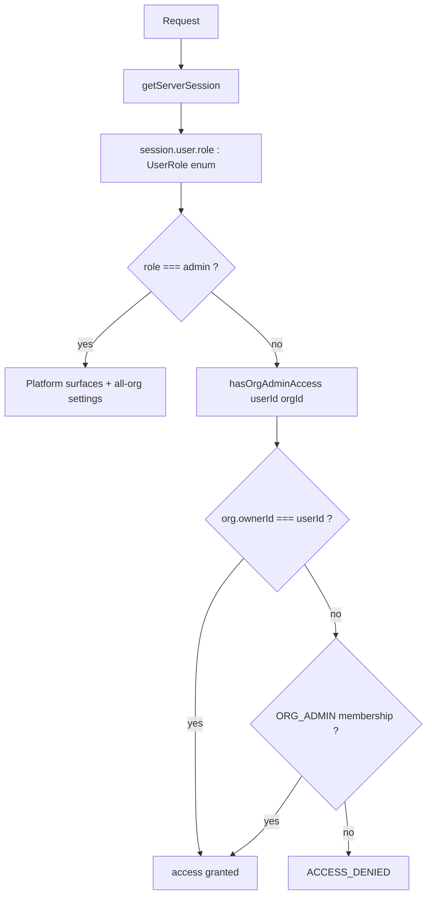

# Auth

## Stack

**Better-Auth** (shipped in Dirstarter at `apps/web/lib/auth.ts` + `apps/web/app/api/auth/[...all]/route.ts`).
The `admin()` plugin (`lib/auth.ts`) owns the `User.role` field (defaults: `defaultRole: "user"`, `adminRoles: ["admin"]`).

## Web flow

1. User signs up / signs in via Dirstarter's auth pages.
1. Better-Auth issues a session cookie (HTTP-only, SameSite=Lax).
1. Server components and route handlers call `auth.getSession()` to authenticate.
1. Authorization checks live in `apps/web/lib/authz.ts` — pure functions like `canEditSchool(user, school)`, `isAdmin(user)`. Org-settings access resolves through `apps/web/server/web/organization/org-admin-access.ts`. Every API route / server action imports one.

## Mobile flow

Two viable approaches (decide once Better-Auth's mobile SDK maturity is verified):

### A. Better-Auth mobile SDK (preferred if mature)

Expo app uses the Better-Auth client; same session contract as web; native cookie/storage handling.

### B. JWT bridge (fallback)

Web `app/api/v1/mobile-token` mints a short-lived JWT signed with the same secret. Mobile stores the JWT in `expo-secure-store`; refreshes on 401.

## Roles

Four distinct role axes — do not conflate them:

1. **Platform role — `User.role`** — a typed Prisma `enum UserRole { user, admin, tournament_director }` (`@default(user)`), owned by the Better-Auth `admin()` plugin. Type-hardened from a free-text `String` at **SESSION_0449** (PR #164) so a typo like `"Admin"` can no longer silently bypass an authz gate — Postgres now rejects an out-of-set value.
   - `user` — the default; an ordinary account.
   - `admin` — the platform super-user. Validated by `authz.isAdmin(session)` (`lib/authz.ts` → `user.role === "admin"`) and `server/orpc/roles.ts roleOf()`. There are **2** platform admins in prod (Brian, Tony Hua).
   - `tournament_director` — a platform role used by the tournament surfaces + `LINEAGE_RESOURCE_GRANTS`; reachable via the `/app/users` role editor.
2. **Org-scoped membership role** — the `Role` / `RoleAssignment` reference tables on `Membership` (e.g. code `ORG_ADMIN`, `INSTRUCTOR`, `OWNER`). A user can hold a different org role per org (instructor at school A, student at school B). This is NOT `User.role`.
3. **Synthetic UI label `lineage_tree_admin`** — derived at read-time from the `LineageTreeAccess` table (`TREE_ADMIN` / `TREE_EDITOR` / `BRANCH_EDITOR` / `NODE_EDITOR`); passed as the `userRole` Shell prop. **Never stored** on `User.role` and intentionally excluded from the `UserRole` enum.
4. **`guest`** — the deny-by-default fallback `server/orpc/roles.ts roleOf()` returns for anonymous / unknown-role callers. Also never stored.

## Org admin scope (platform admin manages all orgs)

**SESSION_0448:** `hasOrgAdminAccess(userId, organizationId)` (`server/web/organization/org-admin-access.ts`) grants org-settings **read + write** to:

- a **platform admin** (`User.role === "admin"`) — for **every** org, OR
- the org `ownerId`, OR
- a member with an `ORG_ADMIN` role assignment in that org.

`assertOrgAdminAccess` throws `ACCESS_DENIED` otherwise. The platform-admin short-circuit is the load-bearing change: WP-imported orgs have `ownerId: null` and no `ORG_ADMIN`, so without it a platform admin was locked out of self-service org settings. **Consequence: platform admins are super-users over every org's settings/members/invites/theme.** Keep the platform-admin set minimal (2 today). One carve-out remains stricter: only the org **owner** can grant `ORG_ADMIN` (`membership-actions.ts assignOrgRole` re-checks `ownerId` directly — fail-safe).

### Authorization decision path



## Role assignment (write path)

`User.role` is only ever written through the app's own zod-gated server actions — **not** through Better-Auth's `admin.setRole` (which is unused here; its array form would emit `"a,b"`, invalid for the enum). Keep roles single-valued.

```mermaid
flowchart LR
  ui[/app/users user-form / user-actions] --> action[updateUser / updateUserRole]
  action --> gate[adminActionClient platform-admin gate]
  gate --> zod[z.enum user admin tournament_director]
  zod --> write[db.user.update role]
  write --> rev[revalidate /app/users]
```

`server/admin/users/schema.ts` (`z.enum(["admin","tournament_director","user"])`) is the hand-maintained mirror of the `UserRole` enum — keep them in lockstep if the enum gains a value. `deleteUsers` guards `role: { not: "admin" }`.

## Public org resolution

**SESSION_0448:** `getOrganizationBySlug(_brand, slug)` (`server/web/organization/queries.ts`) is now **brand-agnostic** — `findFirst({ where: { slug }, orderBy: { createdAt: "asc" } })`. The `_brand` arg is ignored (vestigial, dropped in the Stage-2 brand-column prune). The public `/organizations/[slug]` route resolves **any** org by slug regardless of brand; the previous brand-scoping was the *de-facto* visibility fence, so there is now **no positive visibility gate** — "an org has a slug" implies "publicly resolvable." Legacy `BASELINE_MARTIAL_ARTS` orgs that previously 404'd now render.

- **Follow-up (open):** the public `organizationDetailPayload` selects `owner.email`, and the page renders `owner.name ?? owner.email` — a null-name owner's email can appear publicly. Drop `owner.email` from the public payload / fix the fallback.
- **Stage-2:** add a positive `Organization.published` / visibility flag when `slug` becomes globally unique, so a draft/imported org can't auto-publish by merely having a slug.

## Brand context (historical — single-brand collapse)

> **SESSION_0447 / ADR 0034: single-brand collapse to BBL.** The multi-brand model below is **historical**. `activeBrandId`, the brand switcher, and the brand-scope Prisma extension are retired (`activeBrandId` has 0 hits in `apps/web/` code). The `Brand` enum survives as a schema vestige pending the gated Stage-2 column drop. **KEEP-FOREVER:** the host→brand origin gate — `resolveBrand` / `BRAND_TRUSTED_ORIGINS` / `HOST_TO_BRAND` in `lib/brand-context.ts` (MB-002), used by `stripe-webhook` + `lib/auth`.

Two distinct concepts (see [ADR 0006](decisions/0006-multi-domain-hosting.md), [ADR 0008](decisions/0008-brand-switcher.md), superseded by [ADR 0034](decisions/0034-monorepo-platform-and-per-product-deploys.md)):

- **`brand` (host-derived)** — set from `request.headers.host` via `resolveBrand` (`lib/brand-context.ts`). This is the surviving, load-bearing path (the MB-002 security gate).
- **`session.user.activeBrandId`** *(retired)* — which brand's app data a user worked in. Multi-brand-only; gone with the collapse.

## Cross-brand isolation (historical)

> Superseded by the single-brand collapse (ADR 0034). Retained for history. The brand-scope Prisma extension described here is no longer wired in `apps/web/services/db.ts` (only `uniqueSlugsExtension`).

Belt-and-suspenders strategy (multi-brand era):

1. **Application layer:** authenticated queries passed through `authz` helpers checking `isInSameBrand` against `activeBrandId`.
1. **Data layer:** a Prisma client extension required brand-scoped models include `where: { brand }`.

## Brand switcher (retired)

> Removed with the single-brand collapse. `lastActiveBrandId` persists on `User` but is inert.

## Cookie scoping (forward-looking)

If brands later live on subdomains (`bbl.ronindojo.com`, etc.), set `cookieDomain: '.ronindojo.com'` on Better-Auth from day one. Retrofitting after launch invalidates all sessions.

## Admin lockdown

There's no `wp-admin` to lock down — that whole concept goes away. The admin surface is the **`apps/web/app/app/*`** dashboard (the `app/admin/*` route tree is retired → redirect-shadowed to `/app`; `task-board` + shell are the only live remnants). Server-side gating is `requirePermission(APP_AREA_PERMISSIONS.<area>)` (`server/orpc/roles.ts`) + `assertOrgAdminAccess` for org surfaces; `authz.isAdmin` for platform surfaces. **Middleware cookie checks are UX-only, never the authz boundary** — the gate is enforced server-side per page/action.
