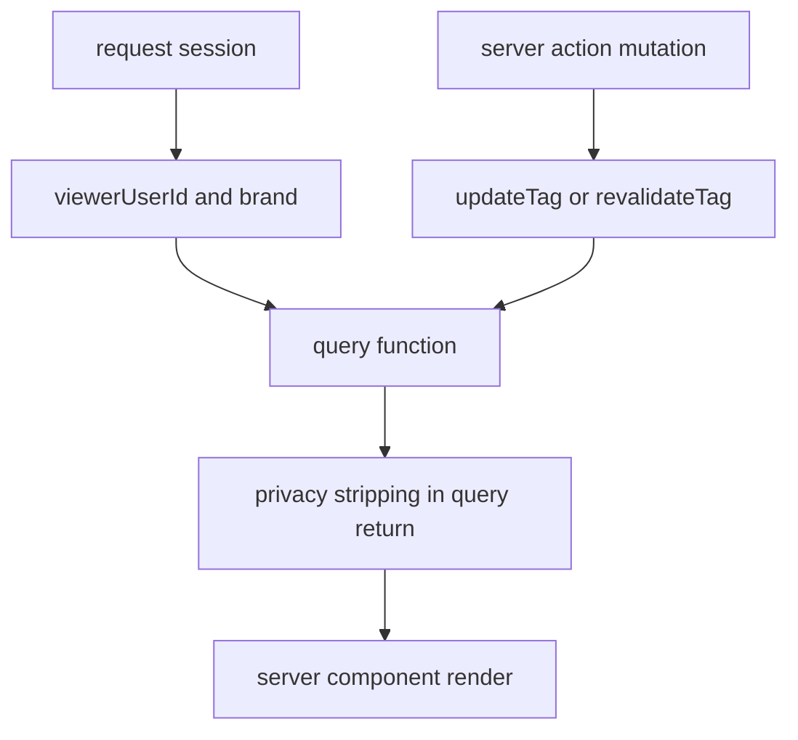

# Cache Risk Register

## Summary

Security review for auth-scoped caching in the Ronin baseline repo. This page exists to decide whether ADR 0010 is safe, unsafe, or safe only in a narrower form.

## Status

Active. Current recommendation: public-only caching may proceed later; auth-variant and private caching stay conservative for now.

## Intent

Prevent cross-user, cross-brand, or stale-privacy leakage while the repo is still aligning to current Dirstarter and Next.js guidance.

## Architecture

## Risk buckets

- **T1 — Public shared data:** Same for all viewers within a brand. Safe for `use cache` with brand in key.
- **T2 — Auth-variant data:** Result depends on viewer identity/role. Risky for shared cache without isolation tests.
- **T3 — Private per-user data:** Belongs to one user. Shared caching is the wrong tool.

## Wiring

- `apps/web/lib/auth.ts`
- `apps/web/lib/safe-actions.ts`
- `apps/web/server/web/directory/queries.ts`
- `apps/web/server/web/organization/queries.ts`
- `docs/architecture/decisions/0010-cache-strategy.md`

## Health

Functional as a decision artifact; not yet backed by automated cache-isolation tests. Health: 6/10.

## Teachable explanation

The safe default is simple:

- if everyone can see the same data, shared caching is possible
- if the viewer changes the result, shared caching is risky
- if the data belongs to one user, shared caching is the wrong tool

## Risk table

| Vector | Severity | Mitigation | Current status |
| --- | --- | --- | --- |
| Cache key collision | High | Include brand + viewer identity in cache identity | Not approved — no `use cache` deployed |
| Stale auth state | High | Keep auth-sensitive reads on `React.cache()`; invalidate on mutation | Not approved |
| `React.cache` isolation | Medium | Treat `React.cache` and `use cache` as separate systems; no mixed assumptions | Understood but untested |
| Brand leakage | High | Brand must be both query predicate and cache dimension | Partially covered — queries filter by brand |
| Visibility leakage | Medium | Filter returned rows by visibility before return | Partially covered — directory query does this |
| Per-field privacy leakage | Medium | Return already-stripped payloads only | Covered — directory query strips before return |
| Membership/instructor-only future data | Critical | Do not use shared cache for these yet | Open — courses/tournaments not built |
| Preview vs production confusion | Medium | Separate preview/prod DB and env vars | Open — not yet confirmed |
| Misuse of `updateTag` | Medium | Server Actions only (current `safe-actions.ts` is correct) | Open test gap |
| SSR vs client cache (`use cache: private`) | Medium | Do not use `use cache: private` for MVP — experimental, browser-memory only | Policy set |

## Interim policy (pending ADR 0010 rewrite)

1. **T1 public data** may adopt `use cache` after config/API recheck against current Next.js docs.
2. **T2 auth-variant data** stays on `React.cache()` until isolation tests are written and passed.
3. **T3 private per-user data** stays on request-scoped dedupe only.
4. **`use cache: private`** is out for MVP.
5. Any later T2 rollout requires: doc-version pinning, explicit cache-key tests, and mutation invalidation tests.

## Revisit conditions

Revisit only after:

- ADR 0010 status is corrected to `proposed`
- Cache-isolation tests exist
- Preview/prod DB separation is confirmed
- Auth route behavior is locked (404 vs redirect decided)
- Current Next.js `use cache` API is re-verified against live docs
