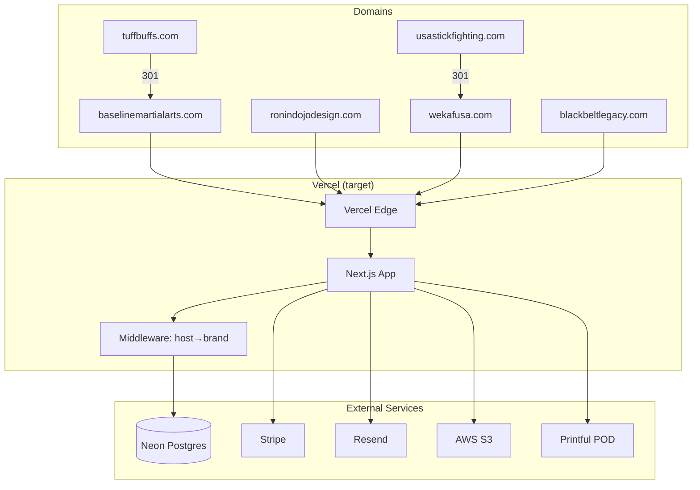

# Hosting Data Flow

End-to-end request flow diagrams for the Ronin Dojo multi-brand platform.

## Current State (legacy)

```
┌─────────────────────────────────────────────────────────────────────────┐
│                     CURRENT STATE — LEGACY HOSTING                      │
├─────────────────────────────────────────────────────────────────────────┤
│                                                                         │
│  baselinemartialarts.com ──┐                                            │
│  tuffbuffs.com ────────────┤                                            │
│  ronindojodesign.com ──────┼──▶ Bluehost Shared Hosting ──▶ WordPress   │
│  wekafusa.com ─────────────┤                                            │
│  usastickfighting.com ─────┘                                            │
│                                                                         │
│  blackbeltlegacy.com ──────────▶ Flywheel Managed WP ──▶ WordPress      │
│                                                                         │
│  (No shared database. Each site is independent WordPress.)              │
└─────────────────────────────────────────────────────────────────────────┘
```

## Target State (new stack)

```
┌─────────────────────────────────────────────────────────────────────────┐
│                    TARGET STATE — VERCEL + NEON                          │
├─────────────────────────────────────────────────────────────────────────┤
│                                                                         │
│  baselinemartialarts.com ──┐                                            │
│  ronindojodesign.com ──────┤     ┌─────────────┐    ┌───────────────┐   │
│  wekafusa.com ─────────────┼────▶│ Vercel Edge  │───▶│ Next.js App   │   │
│  blackbeltlegacy.com ──────┘     │             │    │               │   │
│                                  │ SSL auto    │    │ middleware:   │   │
│  tuffbuffs.com ──▶ 301 to BMA    │ per domain  │    │ host→brand    │   │
│  usastickfighting.com ──▶ 301    └─────────────┘    └───────┬───────┘   │
│    to wekafusa.com                                          │           │
│                                                             ▼           │
│                                                    ┌───────────────┐    │
│                                                    │ Neon Postgres │    │
│                                                    │ (shared DB)   │    │
│                                                    │               │    │
│                                                    │ brand column  │    │
│                                                    │ scopes all    │    │
│                                                    │ tenant data   │    │
│                                                    └───────────────┘    │
│                                                                         │
│  External services (all brands share):                                  │
│    • Stripe (payments)                                                  │
│    • Resend (email)                                                     │
│    • S3 (media)                                                         │
│    • Mux/Cloudflare (video)                                             │
│    • Printful (POD merch)                                               │
└─────────────────────────────────────────────────────────────────────────┘
```

## Request Flow — Detailed

```
User browser
    │
    │ GET https://baselinemartialarts.com/merch
    ▼
DNS Resolver
    │ A record → 76.76.21.21
    ▼
Vercel Edge Network
    │ TLS termination (auto-provisioned cert)
    │ Route to Next.js app
    ▼
Next.js Middleware (middleware.ts)
    │ Read Host header: "baselinemartialarts.com"
    │ Map to Brand: BASELINE_MARTIAL_ARTS
    │ Set cookie: brand=BASELINE_MARTIAL_ARTS
    │ Set header: x-brand=BASELINE_MARTIAL_ARTS
    ▼
App Router
    │ Match route: /merch → app/(web)/merch/page.tsx
    ▼
Server Component
    │ Read brand from cookie/header
    │ Prisma query: WHERE brand = 'BASELINE_MARTIAL_ARTS'
    │ Render with brand-specific theme tokens
    ▼
HTML Response → Browser
```

## Migration Transition Flow

During the migration period, each domain transitions independently:

```
Phase 1                          Phase 2+
─────────                        ────────
BMA → Vercel ✅                  RDD → Vercel
tuffbuffs → 301 to BMA ✅       WEKAF → Vercel
RDD → Bluehost (legacy WP)      BBL → Vercel (post data migration)
WEKAF → Bluehost (legacy WP)
BBL → Flywheel (legacy WP)

DNS cutover per domain:
┌──────────────────┐     ┌──────────────────┐
│ Bluehost A record│     │ Vercel A record  │
│ → Bluehost IP    │ ──▶ │ → 76.76.21.21   │
└──────────────────┘     └──────────────────┘
  (old)                    (new)
```

## Mermaid: Full Infrastructure Topology


