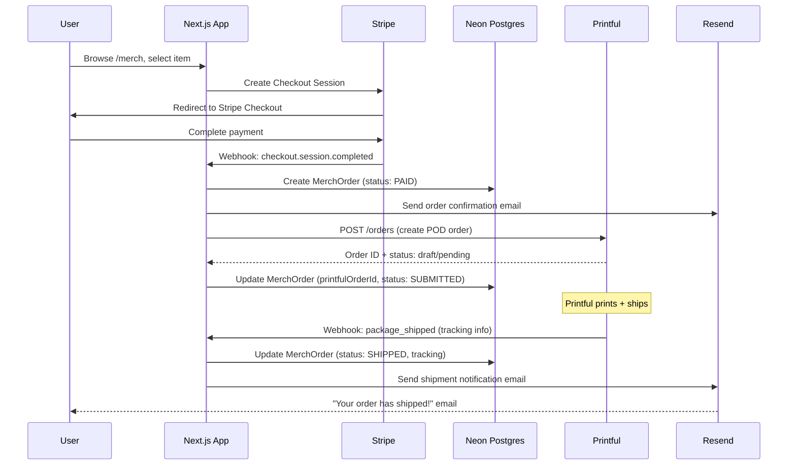

# Printful POD Integration Spec

Print-on-demand fulfillment for TuffBuffs merch via [Printful](https://www.printful.com).

## Context

Brian already uses Printful for WEKAF Team USA uniforms and TuffBuffs/Baseline/BBL/WEKAF apparel. The current merch checkout flow (SESSION_0112–0113) handles Stripe payment but does **not** create a Printful order — fulfillment is manual. This spec designs the automated Printful integration.

## Current State

```
┌──────────────────────────────────────────────────────────────────┐
│                 CURRENT MERCH FLOW (manual fulfillment)          │
├──────────────────────────────────────────────────────────────────┤
│                                                                  │
│  User                                                            │
│   │                                                              │
│   ▼                                                              │
│  /merch (browse) ──▶ /merch/[slug] (detail) ──▶ Stripe Checkout │
│                                                                  │
│  Stripe Webhook                                                  │
│   │                                                              │
│   ▼                                                              │
│  POST /api/stripe/webhooks                                       │
│   ├── checkout.session.completed                                 │
│   │   └── merch_purchase handler                                 │
│   │       ├── Create MerchOrder row in DB                        │
│   │       ├── after() → notifyCustomerOfMerchOrder() 📧          │
│   │       └── ❌ NO Printful order created                       │
│   │                                                              │
│   └── Brian manually creates order in Printful dashboard         │
│                                                                  │
└──────────────────────────────────────────────────────────────────┘
```

## Target State

```
┌──────────────────────────────────────────────────────────────────┐
│                 TARGET MERCH FLOW (automated POD)                │
├──────────────────────────────────────────────────────────────────┤
│                                                                  │
│  User                                                            │
│   │                                                              │
│   ▼                                                              │
│  /merch (browse) ──▶ /merch/[slug] (detail) ──▶ Stripe Checkout │
│                                                                  │
│  Stripe Webhook                                                  │
│   │                                                              │
│   ▼                                                              │
│  POST /api/stripe/webhooks                                       │
│   └── checkout.session.completed                                 │
│       └── merch_purchase handler                                 │
│           ├── Create MerchOrder row in DB                        │
│           ├── after() → notifyCustomerOfMerchOrder() 📧          │
│           └── after() → createPrintfulOrder() 🖨️                │
│               │                                                  │
│               ▼                                                  │
│           ┌──────────────┐                                       │
│           │ Printful API │                                       │
│           │ POST /orders │                                       │
│           └──────┬───────┘                                       │
│                  │                                                │
│                  ▼                                                │
│           Printful prints + ships                                 │
│                  │                                                │
│                  ▼                                                │
│           Printful webhook → tracking info                        │
│                  │                                                │
│                  ▼                                                │
│           Update MerchOrder.fulfillmentStatus                     │
│           Notify customer with tracking 📧                        │
│                                                                  │
└──────────────────────────────────────────────────────────────────┘
```

## Printful API Overview

```
┌─────────────────────────────────────────────────────────────────────┐
│                      PRINTFUL API ENDPOINTS                         │
├─────────────────────────────────────────────────────────────────────┤
│                                                                     │
│  Auth: API key (Bearer token)                                       │
│  Base URL: https://api.printful.com                                 │
│                                                                     │
│  Key endpoints:                                                     │
│  ┌────────────────────────────────────────────────────────────────┐ │
│  │ POST /orders           Create a new order                      │ │
│  │ GET  /orders/{id}      Get order status                        │ │
│  │ GET  /orders           List orders                             │ │
│  │ POST /orders/estimate  Get shipping/cost estimate              │ │
│  │ GET  /store/products   List synced products                    │ │
│  │ GET  /products/{id}    Get product catalog info                │ │
│  │ GET  /shipping/rates   Calculate shipping rates                │ │
│  └────────────────────────────────────────────────────────────────┘ │
│                                                                     │
│  Webhooks (Printful → us):                                          │
│  ┌────────────────────────────────────────────────────────────────┐ │
│  │ package_shipped     Tracking number available                  │ │
│  │ package_returned    Package returned to sender                 │ │
│  │ order_failed        Order could not be fulfilled               │ │
│  │ order_canceled      Order was canceled                         │ │
│  │ product_synced      Product sync complete                      │ │
│  └────────────────────────────────────────────────────────────────┘ │
│                                                                     │
│  Test mode: Use API key from test store (no real prints)            │
│                                                                     │
└─────────────────────────────────────────────────────────────────────┘
```

## Product Mapping

Map DB `PricingPlan` merch products to Printful catalog variants.

```
┌──────────────────────────────────────────────────────────────────────┐
│                    PRODUCT MAPPING TABLE                              │
├──────────────────────────────────────────────────────────────────────┤
│                                                                      │
│  DB PricingPlan                    Printful                          │
│  ┌─────────────────────────┐       ┌───────────────────────────┐    │
│  │ id: cuid                │       │ sync_product_id: number   │    │
│  │ name: "TuffBuffs Tee"   │──────▶│ sync_variant_id: number   │    │
│  │ metadata.size: "L"      │       │ external_id: plan.id      │    │
│  │ metadata.color: "Gold"  │       │ variant_id: catalog ref   │    │
│  │ metadata.adr0014_name   │       │                           │    │
│  │ stripeProductId         │       │ files[]: print file URLs   │    │
│  │ stripePriceId           │       └───────────────────────────┘    │
│  └─────────────────────────┘                                        │
│                                                                      │
│  Mapping storage options:                                            │
│  A) metadata.printfulVariantId on PricingPlan (preferred — no       │
│     schema change, uses existing JSON metadata field)                │
│  B) New PrintfulProductMapping table (overkill for 24 products)     │
│                                                                      │
│  Recommendation: Option A — store printfulVariantId in metadata     │
│                                                                      │
└──────────────────────────────────────────────────────────────────────┘
```

## Order Creation Flow

```
┌─────────────────────────────────────────────────────────────────────┐
│                  PRINTFUL ORDER CREATION FLOW                        │
├─────────────────────────────────────────────────────────────────────┤
│                                                                     │
│  Stripe webhook: checkout.session.completed                         │
│   │                                                                 │
│   │ Extract from Stripe session:                                    │
│   │  • customer_details.name                                        │
│   │  • customer_details.email                                       │
│   │  • shipping_details.address (street, city, state, zip, country) │
│   │  • line_items[].price.product (Stripe product ID)               │
│   │  • line_items[].quantity                                        │
│   │  • metadata.size, metadata.color                                │
│   │                                                                 │
│   ▼                                                                 │
│  Look up PricingPlan by stripeProductId                              │
│   │                                                                 │
│   ▼                                                                 │
│  Read metadata.printfulVariantId                                     │
│   │                                                                 │
│   ▼                                                                 │
│  POST https://api.printful.com/orders                                │
│  {                                                                   │
│    "external_id": merchOrder.id,                                     │
│    "recipient": {                                                    │
│      "name": shipping.name,                                         │
│      "address1": shipping.line1,                                     │
│      "city": shipping.city,                                         │
│      "state_code": shipping.state,                                  │
│      "country_code": shipping.country,                              │
│      "zip": shipping.postal_code,                                   │
│      "email": customer.email                                        │
│    },                                                                │
│    "items": [{                                                       │
│      "sync_variant_id": plan.metadata.printfulVariantId,             │
│      "quantity": lineItem.quantity,                                   │
│      "files": [{ "url": "https://..." }]                             │
│    }]                                                                │
│  }                                                                   │
│   │                                                                 │
│   ▼                                                                 │
│  Save printfulOrderId on MerchOrder                                  │
│  Set fulfillmentStatus = "SUBMITTED"                                 │
│                                                                     │
└─────────────────────────────────────────────────────────────────────┘
```

## Fulfillment Webhook Flow

```
┌─────────────────────────────────────────────────────────────────────┐
│              PRINTFUL WEBHOOK → FULFILLMENT TRACKING                 │
├─────────────────────────────────────────────────────────────────────┤
│                                                                     │
│  Printful                                                           │
│   │ POST https://baselinemartialarts.com/api/printful/webhooks      │
│   │                                                                 │
│   ▼                                                                 │
│  app/api/printful/webhooks/route.ts                                  │
│   │                                                                 │
│   ├── Event: package_shipped                                        │
│   │    ├── Extract tracking_number, tracking_url, carrier            │
│   │    ├── Update MerchOrder:                                        │
│   │    │    fulfillmentStatus = "SHIPPED"                             │
│   │    │    trackingNumber = tracking_number                          │
│   │    │    trackingUrl = tracking_url                                │
│   │    │    carrier = carrier                                        │
│   │    └── after() → notifyCustomerOfShipment() 📧                  │
│   │                                                                 │
│   ├── Event: order_failed                                           │
│   │    ├── Update MerchOrder: fulfillmentStatus = "FAILED"           │
│   │    └── after() → notifyAdminOfPrintfulFailure() 📧              │
│   │                                                                 │
│   └── Event: package_returned                                       │
│        ├── Update MerchOrder: fulfillmentStatus = "RETURNED"         │
│        └── after() → notifyAdminOfReturn() 📧                       │
│                                                                     │
└─────────────────────────────────────────────────────────────────────┘
```

## File Structure

```
apps/web/
├── services/
│   └── printful.ts ──────────── Printful API client wrapper
├── server/web/merch/
│   └── printful-actions.ts ──── createPrintfulOrder() server action
├── app/api/
│   ├── stripe/webhooks/
│   │   └── route.ts ─────────── Extend merch_purchase handler
│   └── printful/webhooks/
│       └── route.ts ─────────── NEW: Printful webhook handler
├── emails/
│   └── merch-shipment-notification.tsx ── NEW: shipping email
└── lib/
    └── notifications.ts ─────── Add notifyCustomerOfShipment()
```

## Environment Variables

```bash
# .env
PRINTFUL_API_KEY=xxxxxxxxxxxxxxxxxxxx     # From Printful Dashboard → Settings → API
PRINTFUL_WEBHOOK_SECRET=xxxx              # Optional: for webhook signature verification
```

Add to `env.ts`:

```typescript
// apps/web/env.ts
PRINTFUL_API_KEY: z.string().optional(),
PRINTFUL_WEBHOOK_SECRET: z.string().optional(),
```

## Open Decisions

```
┌─────────────────────────────────────────────────────────────────────┐
│                       OPEN DECISIONS                                 │
├──────┬──────────────────────────────────┬───────────────────────────┤
│  #   │ Decision                         │ Leaning                   │
├──────┼──────────────────────────────────┼───────────────────────────┤
│  1   │ Auth model: OAuth vs API key?    │ API key (server-to-server │
│      │                                  │ only, simpler)            │
├──────┼──────────────────────────────────┼───────────────────────────┤
│  2   │ Product sync: Printful → DB or   │ DB → Printful (push      │
│      │ DB → Printful?                   │ orders only; products     │
│      │                                  │ already in DB from ADR    │
│      │                                  │ 0014 seed)                │
├──────┼──────────────────────────────────┼───────────────────────────┤
│  3   │ Fulfillment webhook: Printful    │ Webhook (Printful pushes  │
│      │ pushes to us or we poll?         │ events; matches Stripe    │
│      │                                  │ pattern)                  │
├──────┼──────────────────────────────────┼───────────────────────────┤
│  4   │ Multi-brand: same Printful       │ Single account, use       │
│      │ account or per-brand?            │ external_id prefix per    │
│      │                                  │ brand                     │
├──────┼──────────────────────────────────┼───────────────────────────┤
│  5   │ Confirm mode: auto-confirm       │ Draft mode in dev/test,   │
│      │ orders or use draft mode?        │ auto-confirm in prod      │
│      │                                  │ (with kill switch env)    │
├──────┼──────────────────────────────────┼───────────────────────────┤
│  6   │ Print file hosting: S3 or        │ S3 (already have bucket   │
│      │ Printful media library?          │ for media uploads)        │
├──────┼──────────────────────────────────┼───────────────────────────┤
│  7   │ Shipping cost: baked into        │ Baked in for now (merch   │
│      │ product price or calculated?     │ prices include shipping)  │
└──────┴──────────────────────────────────┴───────────────────────────┘
```

## Mermaid: End-to-End Merch + POD Flow



## Implementation Priority

```
Phase 1 (this sprint):
  ✅ Spec doc (this file)
  → services/printful.ts client
  → createPrintfulOrder() in webhook
  → Product mapping (metadata.printfulVariantId)
  → Test with Printful sandbox

Phase 2 (next sprint):
  → Printful webhook handler (fulfillment tracking)
  → Shipment notification email template
  → MerchOrder status lifecycle UI

Phase 3 (future):
  → Multi-brand POD (RDD/BBL/WEKAF merch)
  → Shipping calculator integration
  → Returns/refund flow
```

## Related

- [ADR 0014 — Stripe Product Policy](../decisions/0014-stripe-product-policy.md)
- [Stripe Setup Runbook](../../runbooks/stripe-setup-runbook.md)
- [Email Delivery Spec](infrastructure/email-delivery-spec.md)
- [Resend Setup Runbook](../../runbooks/resend-setup-runbook.md)
