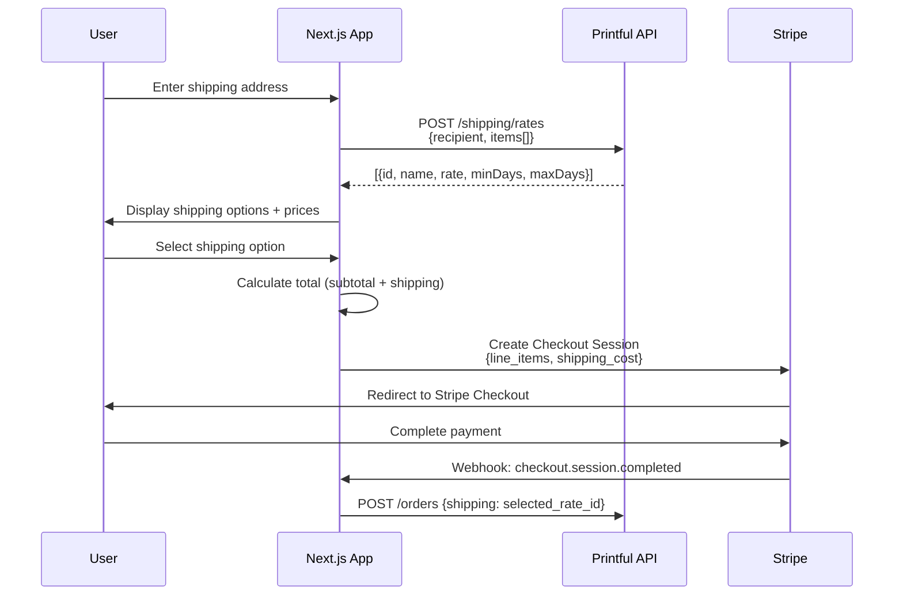
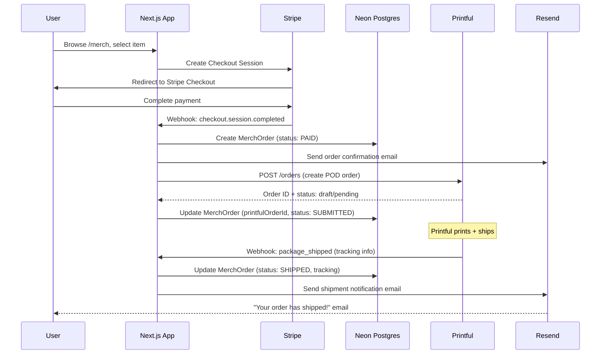

# Printful POD Integration Spec

Print-on-demand fulfillment for TuffBuffs merch via [Printful](https://www.printful.com).

## Context

Brian already uses Printful for WEKAF Team USA uniforms and TuffBuffs/Baseline/BBL/WEKAF apparel. The current merch checkout flow (SESSION_0112–0113) handles Stripe payment but does **not** create a Printful order — fulfillment is manual. This spec designs the automated Printful integration.

## Current State

```
┌──────────────────────────────────────────────────────────────────┐
│                 CURRENT MERCH FLOW (manual fulfillment)          │
├──────────────────────────────────────────────────────────────────┤
│                                                                  │
│  User                                                            │
│   │                                                              │
│   ▼                                                              │
│  /merch (browse) ──▶ /merch/[slug] (detail) ──▶ Stripe Checkout │
│                                                                  │
│  Stripe Webhook                                                  │
│   │                                                              │
│   ▼                                                              │
│  POST /api/stripe/webhooks                                       │
│   ├── checkout.session.completed                                 │
│   │   └── merch_purchase handler                                 │
│   │       ├── Create MerchOrder row in DB                        │
│   │       ├── after() → notifyCustomerOfMerchOrder() 📧          │
│   │       └── ❌ NO Printful order created                       │
│   │                                                              │
│   └── Brian manually creates order in Printful dashboard         │
│                                                                  │
└──────────────────────────────────────────────────────────────────┘
```

## Target State

```
┌──────────────────────────────────────────────────────────────────┐
│                 TARGET MERCH FLOW (automated POD)                │
├──────────────────────────────────────────────────────────────────┤
│                                                                  │
│  User                                                            │
│   │                                                              │
│   ▼                                                              │
│  /merch (browse) ──▶ /merch/[slug] (detail) ──▶ Stripe Checkout │
│                                                                  │
│  Stripe Webhook                                                  │
│   │                                                              │
│   ▼                                                              │
│  POST /api/stripe/webhooks                                       │
│   └── checkout.session.completed                                 │
│       └── merch_purchase handler                                 │
│           ├── Create MerchOrder row in DB                        │
│           ├── after() → notifyCustomerOfMerchOrder() 📧          │
│           └── after() → createPrintfulOrder() 🖨️                │
│               │                                                  │
│               ▼                                                  │
│           ┌──────────────┐                                       │
│           │ Printful API │                                       │
│           │ POST /orders │                                       │
│           └──────┬───────┘                                       │
│                  │                                                │
│                  ▼                                                │
│           Printful prints + ships                                 │
│                  │                                                │
│                  ▼                                                │
│           Printful webhook → tracking info                        │
│                  │                                                │
│                  ▼                                                │
│           Update MerchOrder.fulfillmentStatus                     │
│           Notify customer with tracking 📧                        │
│                                                                  │
└──────────────────────────────────────────────────────────────────┘
```

## Lo-Fi Wireframes

### Customer: Merch Browse → Checkout → Confirmation

```text
┌─────────────────────────────────────────────────────────────────────┐
│                        /merch                                        │
│  ┌──────────────────────────────────────────────────────────────┐   │
│  │  BASELINE MARTIAL ARTS — MERCH                               │   │
│  └──────────────────────────────────────────────────────────────┘   │
│                                                                     │
│  ┌─────────────┐  ┌─────────────┐  ┌─────────────┐                │
│  │ ┌─────────┐ │  │ ┌─────────┐ │  │ ┌─────────┐ │                │
│  │ │  📷     │ │  │ │  📷     │ │  │ │  📷     │ │                │
│  │ │ product │ │  │ │ product │ │  │ │ product │ │                │
│  │ │  image  │ │  │ │  image  │ │  │ │  image  │ │                │
│  │ └─────────┘ │  │ └─────────┘ │  │ └─────────┘ │                │
│  │ TuffBuffs   │  │ Baseline    │  │ WEKAF Team  │                │
│  │ Gold Tee    │  │ Rashguard   │  │ USA Hoodie  │                │
│  │ $32.00      │  │ $55.00      │  │ $65.00      │                │
│  │ [View →]    │  │ [View →]    │  │ [View →]    │                │
│  └─────────────┘  └─────────────┘  └─────────────┘                │
│                                                                     │
│  Filter: [All ▾]  [Brand ▾]  [Category ▾]                         │
└─────────────────────────────────────────────────────────────────────┘

┌─────────────────────────────────────────────────────────────────────┐
│                    /merch/tuffbuffs-gold-tee                         │
│  ┌──────────────────────┐  ┌──────────────────────────────────┐    │
│  │                      │  │ TuffBuffs Gold Tee               │    │
│  │                      │  │                                  │    │
│  │     📷 product       │  │ $32.00                           │    │
│  │       image          │  │                                  │    │
│  │     (large)          │  │ Size:   [S] [M] [L●] [XL] [2XL] │    │
│  │                      │  │ Color:  [Gold●] [Black] [White]  │    │
│  │                      │  │                                  │    │
│  │                      │  │ Qty:    [1 ▾]                    │    │
│  │                      │  │                                  │    │
│  │                      │  │ Shipping: Calculated at checkout │    │
│  │                      │  │                                  │    │
│  │                      │  │ [  🛒 ADD TO CART  ]             │    │
│  └──────────────────────┘  └──────────────────────────────────┘    │
│                                                                     │
│  📦 Print-on-demand — made to order. Ships in 3–7 business days.   │
└─────────────────────────────────────────────────────────────────────┘

┌─────────────────────────────────────────────────────────────────────┐
│                    /merch/checkout (Stripe-hosted)                    │
│  ┌──────────────────────────────────────────────────────────────┐   │
│  │  ORDER SUMMARY                                               │   │
│  │  ┌──────────────────────────────────────────────────────┐   │   │
│  │  │ TuffBuffs Gold Tee — L / Gold         $32.00 × 1    │   │   │
│  │  └──────────────────────────────────────────────────────┘   │   │
│  │                                                              │   │
│  │  SHIPPING ADDRESS                                            │   │
│  │  ┌──────────────────────────────────────────────────────┐   │   │
│  │  │ Name:    [ John Doe                    ]             │   │   │
│  │  │ Address: [ 123 Main St                 ]             │   │   │
│  │  │ City:    [ Portland    ] State: [ OR ]               │   │   │
│  │  │ Zip:     [ 97201      ] Country: [ US ▾]            │   │   │
│  │  └──────────────────────────────────────────────────────┘   │   │
│  │                                                              │   │
│  │  ──────────────────────────────────────────                  │   │
│  │  SHIPPING OPTIONS (fetched via Printful API)                 │   │
│  │  ┌──────────────────────────────────────────────────────┐   │   │
│  │  │ ◉ Standard (5–7 days)              $4.99             │   │   │
│  │  │ ○ Express  (2–3 days)              $12.99            │   │   │
│  │  └──────────────────────────────────────────────────────┘   │   │
│  │                                                              │   │
│  │  Subtotal:    $32.00                                         │   │
│  │  Shipping:     $4.99                                         │   │
│  │  ────────────────────                                        │   │
│  │  Total:       $36.99                                         │   │
│  │                                                              │   │
│  │  PAYMENT                                                     │   │
│  │  [ 💳 Stripe Checkout ... ]                                  │   │
│  │                                                              │   │
│  │  [  PAY $36.99  ]                                            │   │
│  └──────────────────────────────────────────────────────────────┘   │
└─────────────────────────────────────────────────────────────────────┘

┌─────────────────────────────────────────────────────────────────────┐
│                    /merch/success?session_id=cs_xxx                   │
│  ┌──────────────────────────────────────────────────────────────┐   │
│  │  ✅ ORDER CONFIRMED                                          │   │
│  │                                                              │   │
│  │  Thank you, John! Your order is being prepared.              │   │
│  │                                                              │   │
│  │  ┌──────────────────────────────────────────────────────┐   │   │
│  │  │ Order #MO_clxyz...                                   │   │   │
│  │  │ TuffBuffs Gold Tee — L / Gold         $32.00 × 1    │   │   │
│  │  │ Shipping (Standard)                    $4.99         │   │   │
│  │  │ ────────────────────────────────────────             │   │   │
│  │  │ Total:                                $36.99         │   │   │
│  │  └──────────────────────────────────────────────────────┘   │   │
│  │                                                              │   │
│  │  📦 Ships to: 123 Main St, Portland, OR 97201               │   │
│  │  📧 Confirmation sent to john@example.com                    │   │
│  │  🖨️ Printful status: SUBMITTED                              │   │
│  │                                                              │   │
│  │  [  ← BACK TO MERCH  ]    [  VIEW ORDER STATUS  ]           │   │
│  └──────────────────────────────────────────────────────────────┘   │
└─────────────────────────────────────────────────────────────────────┘
```

### Customer: Order Tracking

```text
┌─────────────────────────────────────────────────────────────────────┐
│                    /account/orders/MO_clxyz                          │
│  ┌──────────────────────────────────────────────────────────────┐   │
│  │  ORDER STATUS                                                │   │
│  │                                                              │   │
│  │  ●───────●───────●───────○───────○                           │   │
│  │  Paid   Submitted Printing Shipped Delivered                 │   │
│  │                    ▲                                          │   │
│  │                    └── current                                │   │
│  │                                                              │   │
│  │  ┌──────────────────────────────────────────────────────┐   │   │
│  │  │ TuffBuffs Gold Tee — L / Gold         $32.00 × 1    │   │   │
│  │  │ Shipping (Standard)                    $4.99         │   │   │
│  │  │ Total:                                $36.99         │   │   │
│  │  └──────────────────────────────────────────────────────┘   │   │
│  │                                                              │   │
│  │  📦 Tracking: (available once shipped)                       │   │
│  │  📧 Updates sent to john@example.com                         │   │
│  └──────────────────────────────────────────────────────────────┘   │
└─────────────────────────────────────────────────────────────────────┘

┌─────────────────────────────────────────────────────────────────────┐
│  (after shipment webhook)                                            │
│  ┌──────────────────────────────────────────────────────────────┐   │
│  │  ORDER STATUS                                                │   │
│  │                                                              │   │
│  │  ●───────●───────●───────●───────○                           │   │
│  │  Paid   Submitted Printing Shipped Delivered                 │   │
│  │                            ▲                                  │   │
│  │                            └── current                        │   │
│  │                                                              │   │
│  │  📦 Tracking: 1Z999AA10123456784                              │   │
│  │     Carrier: UPS                                              │   │
│  │     [ Track Package → ]                                       │   │
│  └──────────────────────────────────────────────────────────────┘   │
└─────────────────────────────────────────────────────────────────────┘
```

### Admin: Merch Order Dashboard

```text
┌─────────────────────────────────────────────────────────────────────┐
│                    /admin/merch/orders                                │
│  ┌──────────────────────────────────────────────────────────────┐   │
│  │  MERCH ORDERS                                 [Export CSV ▾] │   │
│  │                                                              │   │
│  │  Filter: [All Statuses ▾] [All Brands ▾] [Date Range ▾]    │   │
│  │  Search: [_________________________] 🔍                     │   │
│  │                                                              │   │
│  │  ┌────────────────────────────────────────────────────────┐ │   │
│  │  │ Order         Customer     Items  Total  Status   Date │ │   │
│  │  ├────────────────────────────────────────────────────────┤ │   │
│  │  │ MO_clxyz...  John Doe     1      $36.99 🟢 SHIPPED 5/10│ │   │
│  │  │ MO_clabc...  Jane Smith   2      $87.00 🟡 PRINTING 5/9│ │   │
│  │  │ MO_cldef...  Bob Lee      1      $55.99 🔵 SUBMITTED5/8│ │   │
│  │  │ MO_clghi...  Amy Chen     3     $142.97 🔴 FAILED   5/7│ │   │
│  │  └────────────────────────────────────────────────────────┘ │   │
│  │                                                              │   │
│  │  Showing 1–4 of 4       [← Prev]  [Next →]                 │   │
│  └──────────────────────────────────────────────────────────────┘   │
└─────────────────────────────────────────────────────────────────────┘

┌─────────────────────────────────────────────────────────────────────┐
│                    /admin/merch/orders/MO_clxyz                      │
│  ┌──────────────────────────────────────────────────────────────┐   │
│  │  ORDER DETAIL — MO_clxyz                                     │   │
│  │                                                              │   │
│  │  ┌─────────────────────┐  ┌─────────────────────────────┐   │   │
│  │  │ CUSTOMER             │  │ PRINTFUL                     │   │   │
│  │  │ John Doe             │  │ Order #PF-12345678           │   │   │
│  │  │ john@example.com     │  │ Status: shipped              │   │   │
│  │  │                      │  │ Tracking: 1Z999AA1012345..   │   │   │
│  │  │ SHIPPING             │  │ Carrier: UPS                 │   │   │
│  │  │ 123 Main St          │  │ Ship date: 2026-05-12        │   │   │
│  │  │ Portland, OR 97201   │  │                              │   │   │
│  │  │ US                   │  │ [View in Printful →]         │   │   │
│  │  └─────────────────────┘  └─────────────────────────────┘   │   │
│  │                                                              │   │
│  │  LINE ITEMS                                                  │   │
│  │  ┌──────────────────────────────────────────────────────┐   │   │
│  │  │ Product              Size  Color  Qty  Price         │   │   │
│  │  ├──────────────────────────────────────────────────────┤   │   │
│  │  │ TuffBuffs Gold Tee   L     Gold   1    $32.00        │   │   │
│  │  └──────────────────────────────────────────────────────┘   │   │
│  │  Shipping:  $4.99 (Standard)                                │   │
│  │  Total:    $36.99                                            │   │
│  │                                                              │   │
│  │  TIMELINE                                                    │   │
│  │  ┌──────────────────────────────────────────────────────┐   │   │
│  │  │ 5/10 1:05pm  Stripe payment received       💳       │   │   │
│  │  │ 5/10 1:06pm  MerchOrder created             📝       │   │   │
│  │  │ 5/10 1:06pm  Confirmation email sent         📧       │   │   │
│  │  │ 5/10 1:07pm  Printful order submitted        🖨️       │   │   │
│  │  │ 5/11 9:30am  Printful: printing              🎨       │   │   │
│  │  │ 5/12 2:15pm  Printful: shipped (UPS)         📦       │   │   │
│  │  │ 5/12 2:16pm  Shipment email sent             📧       │   │   │
│  │  └──────────────────────────────────────────────────────┘   │   │
│  │                                                              │   │
│  │  ACTIONS                                                     │   │
│  │  [Resend Confirmation] [Resend Tracking] [Cancel Order]     │   │
│  └──────────────────────────────────────────────────────────────┘   │
└─────────────────────────────────────────────────────────────────────┘
```

### Admin: Print File / Media Management

```text
┌─────────────────────────────────────────────────────────────────────┐
│                    /admin/merch/media                                 │
│  ┌──────────────────────────────────────────────────────────────┐   │
│  │  PRINT FILES                           [Upload New File ▾]   │   │
│  │                                                              │   │
│  │  Source: [All ▾]  ○ S3 Bucket  ○ Printful Media Library      │   │
│  │                                                              │   │
│  │  ┌────────┐ ┌────────┐ ┌────────┐ ┌────────┐               │   │
│  │  │ 📷     │ │ 📷     │ │ 📷     │ │ 📷     │               │   │
│  │  │ front  │ │ back   │ │ front  │ │ sleeve │               │   │
│  │  │        │ │        │ │        │ │        │               │   │
│  │  │ tuff-  │ │ tuff-  │ │ base-  │ │ wekaf- │               │   │
│  │  │ buffs  │ │ buffs  │ │ line   │ │ team   │               │   │
│  │  │ -front │ │ -back  │ │ -rash  │ │ -sleeve│               │   │
│  │  │ .png   │ │ .png   │ │ .png   │ │ .png   │               │   │
│  │  │ S3 ☁️  │ │ S3 ☁️  │ │ S3 ☁️  │ │ PF 📎 │               │   │
│  │  └────────┘ └────────┘ └────────┘ └────────┘               │   │
│  │                                                              │   │
│  │  [Select for Product Mapping]                                │   │
│  └──────────────────────────────────────────────────────────────┘   │
└─────────────────────────────────────────────────────────────────────┘
```

## User Flows

### Flow 1: Customer Purchase (happy path)

```text
┌─────────┐     ┌──────────┐     ┌──────────┐     ┌──────────┐
│ Browse   │────▶│ Product  │────▶│ Enter    │────▶│ Select   │
│ /merch   │     │ Detail   │     │ Shipping │     │ Shipping │
│          │     │ Size/Clr │     │ Address  │     │ Option   │
└─────────┘     └──────────┘     └──────────┘     └────┬─────┘
                                                        │
    ┌───────────────────────────────────────────────────┘
    ▼
┌──────────┐     ┌──────────┐     ┌──────────┐     ┌──────────┐
│ Stripe   │────▶│ Success  │────▶│ 📧 Conf  │────▶│ 📧 Ship  │
│ Payment  │     │ Page     │     │ Email    │     │ Email +  │
│          │     │ + Status │     │          │     │ Tracking │
└──────────┘     └──────────┘     └──────────┘     └──────────┘
```

### Flow 2: Order Fulfillment (system)

```text
┌──────────┐     ┌──────────┐     ┌──────────┐     ┌──────────┐
│ Stripe   │────▶│ Create   │────▶│ Submit   │────▶│ Printful │
│ Webhook  │     │ Merch    │     │ to       │     │ Prints + │
│ checkout │     │ Order    │     │ Printful │     │ Ships    │
│ .complete│     │ in DB    │     │ API      │     │          │
└──────────┘     └──────────┘     └──────────┘     └────┬─────┘
                                                        │
    ┌───────────────────────────────────────────────────┘
    ▼
┌──────────┐     ┌──────────┐     ┌──────────┐
│ Printful │────▶│ Update   │────▶│ Send     │
│ Webhook  │     │ Order    │     │ Tracking │
│ shipped  │     │ Status + │     │ Email    │
│          │     │ Tracking │     │          │
└──────────┘     └──────────┘     └──────────┘
```

### Flow 3: Admin Order Management

```text
┌──────────┐     ┌──────────┐     ┌──────────┐
│ View     │────▶│ Order    │────▶│ Actions: │
│ Order    │     │ Detail + │     │ Resend   │
│ List     │     │ Timeline │     │ Cancel   │
│ /admin/  │     │ Printful │     │ Refund   │
│ merch/   │     │ Status   │     │ View PF  │
│ orders   │     │          │     │          │
└──────────┘     └──────────┘     └──────────┘
```

### Flow 4: Failed Order Recovery (admin)

```text
┌──────────┐     ┌──────────┐     ┌──────────┐     ┌──────────┐
│ Printful │────▶│ Admin    │────▶│ Admin    │────▶│ Resubmit │
│ Webhook  │     │ Notified │     │ Reviews  │     │ OR       │
│ order_   │     │ 📧       │     │ Failure  │     │ Refund   │
│ failed   │     │          │     │ Reason   │     │ Customer │
└──────────┘     └──────────┘     └──────────┘     └──────────┘
```

## Data Lifecycle: MerchOrder State Machine

```text
┌─────────────────────────────────────────────────────────────────────┐
│                    MERCH ORDER STATE MACHINE                         │
├─────────────────────────────────────────────────────────────────────┤
│                                                                     │
│                    ┌───────────┐                                    │
│                    │   PAID    │ ← Stripe checkout.session.completed│
│                    └─────┬─────┘                                    │
│                          │                                          │
│                          │ createPrintfulOrder()                    │
│                          ▼                                          │
│                    ┌───────────┐                                    │
│               ┌────│ SUBMITTED │ ← Printful API accepted            │
│               │    └─────┬─────┘                                    │
│               │          │                                          │
│               │          │ Printful internal                        │
│               │          ▼                                          │
│               │    ┌───────────┐                                    │
│               │    │ PRINTING  │ ← Printful status update           │
│               │    └─────┬─────┘                                    │
│               │          │                                          │
│               │          │ package_shipped webhook                   │
│               │          ▼                                          │
│               │    ┌───────────┐                                    │
│               │    │  SHIPPED  │ ← tracking number available        │
│               │    └─────┬─────┘                                    │
│               │          │                                          │
│               │          │ carrier delivery confirmation             │
│               │          ▼                                          │
│               │    ┌───────────┐                                    │
│               │    │ DELIVERED │ ← terminal state (happy path)      │
│               │    └───────────┘                                    │
│               │                                                     │
│               │    ── Error paths ──────────────────                │
│               │                                                     │
│               │    ┌───────────┐                                    │
│               ├───▶│  FAILED   │ ← order_failed webhook             │
│               │    └─────┬─────┘   (print error, out of stock)     │
│               │          │                                          │
│               │          ├──▶ Resubmit → SUBMITTED                  │
│               │          └──▶ Refund → REFUNDED                     │
│               │                                                     │
│               │    ┌───────────┐                                    │
│               ├───▶│ CANCELED  │ ← admin action or order_canceled   │
│               │    └───────────┘                                    │
│               │                                                     │
│               │    ┌───────────┐                                    │
│               └───▶│ RETURNED  │ ← package_returned webhook         │
│                    └─────┬─────┘                                    │
│                          │                                          │
│                          ├──▶ Reship → SUBMITTED                    │
│                          └──▶ Refund → REFUNDED                     │
│                                                                     │
│                    ┌───────────┐                                    │
│                    │ REFUNDED  │ ← terminal state (Stripe refund)   │
│                    └───────────┘                                    │
│                                                                     │
└─────────────────────────────────────────────────────────────────────┘
```

## Mermaid: Complete Data + User Flow

```mermaid
flowchart TD
    subgraph Customer["👤 Customer Flow"]
        A[Browse /merch] --> B[Product Detail]
        B --> C[Select Size/Color/Qty]
        C --> D[Enter Shipping Address]
        D --> E[Fetch Shipping Rates]
        E --> F[Select Shipping Option]
        F --> G[Stripe Checkout Payment]
    end

    subgraph System["⚙️ System — Order Processing"]
        G --> H[Stripe Webhook: checkout.session.completed]
        H --> I[Create MerchOrder in DB — status: PAID]
        I --> J[Send Confirmation Email via Resend 📧]
        I --> K[POST /orders to Printful API]
        K --> L{Printful Accepted?}
        L -->|Yes| M[Update MerchOrder — status: SUBMITTED]
        L -->|No| N[Update MerchOrder — status: FAILED]
        N --> O[Notify Admin of Failure 📧]
    end

    subgraph Printful["🖨️ Printful — Fulfillment"]
        M --> P[Printful Prints Order]
        P --> Q[Printful Ships Package]
        Q --> R[Webhook: package_shipped]
    end

    subgraph Tracking["📦 Shipment Tracking"]
        R --> S[Update MerchOrder — status: SHIPPED + tracking]
        S --> T[Send Tracking Email via Resend 📧]
        T --> U[Customer Tracks Package]
        U --> V[Delivered — terminal state ✅]
    end

    subgraph ErrorPaths["⚠️ Error Paths"]
        O --> W{Admin Decision}
        W -->|Resubmit| K
        W -->|Refund| X[Stripe Refund → status: REFUNDED]
        Q --> Y[Webhook: package_returned]
        Y --> Z{Admin Decision}
        Z -->|Reship| K
        Z -->|Refund| X
    end

    subgraph Admin["🔧 Admin Dashboard"]
        AA[/admin/merch/orders] --> AB[Order List — filter/search]
        AB --> AC[Order Detail + Timeline]
        AC --> AD[Actions: Resend Email / Cancel / Refund]
        AC --> AE[View in Printful Dashboard]
        AF[/admin/merch/media] --> AG[Print File Management]
        AG --> AH[S3 Upload / Printful Media Library]
        AH --> AI[Map Files to Products]
    end

    style Customer fill:#e8f5e9,stroke:#2e7d32
    style System fill:#e3f2fd,stroke:#1565c0
    style Printful fill:#fff3e0,stroke:#e65100
    style Tracking fill:#f3e5f5,stroke:#7b1fa2
    style ErrorPaths fill:#ffebee,stroke:#c62828
    style Admin fill:#fce4ec,stroke:#880e4f
```

## Mermaid: Shipping Rate Calculation Sequence



## Printful API Overview

```
┌─────────────────────────────────────────────────────────────────────┐
│                      PRINTFUL API ENDPOINTS                         │
├─────────────────────────────────────────────────────────────────────┤
│                                                                     │
│  Auth: API key (Bearer token)                                       │
│  Base URL: https://api.printful.com                                 │
│                                                                     │
│  Key endpoints:                                                     │
│  ┌────────────────────────────────────────────────────────────────┐ │
│  │ POST /orders           Create a new order                      │ │
│  │ GET  /orders/{id}      Get order status                        │ │
│  │ GET  /orders           List orders                             │ │
│  │ POST /orders/estimate  Get shipping/cost estimate              │ │
│  │ GET  /store/products   List synced products                    │ │
│  │ GET  /products/{id}    Get product catalog info                │ │
│  │ GET  /shipping/rates   Calculate shipping rates                │ │
│  └────────────────────────────────────────────────────────────────┘ │
│                                                                     │
│  Webhooks (Printful → us):                                          │
│  ┌────────────────────────────────────────────────────────────────┐ │
│  │ package_shipped     Tracking number available                  │ │
│  │ package_returned    Package returned to sender                 │ │
│  │ order_failed        Order could not be fulfilled               │ │
│  │ order_canceled      Order was canceled                         │ │
│  │ product_synced      Product sync complete                      │ │
│  └────────────────────────────────────────────────────────────────┘ │
│                                                                     │
│  Test mode: Use API key from test store (no real prints)            │
│                                                                     │
└─────────────────────────────────────────────────────────────────────┘
```

## Product Mapping

Map DB `PricingPlan` merch products to Printful catalog variants.

```
┌──────────────────────────────────────────────────────────────────────┐
│                    PRODUCT MAPPING TABLE                              │
├──────────────────────────────────────────────────────────────────────┤
│                                                                      │
│  DB PricingPlan                    Printful                          │
│  ┌─────────────────────────┐       ┌───────────────────────────┐    │
│  │ id: cuid                │       │ sync_product_id: number   │    │
│  │ name: "TuffBuffs Tee"   │──────▶│ sync_variant_id: number   │    │
│  │ metadata.size: "L"      │       │ external_id: plan.id      │    │
│  │ metadata.color: "Gold"  │       │ variant_id: catalog ref   │    │
│  │ metadata.adr0014_name   │       │                           │    │
│  │ stripeProductId         │       │ files[]: print file URLs   │    │
│  │ stripePriceId           │       └───────────────────────────┘    │
│  └─────────────────────────┘                                        │
│                                                                      │
│  Mapping storage options:                                            │
│  A) metadata.printfulVariantId on PricingPlan (preferred — no       │
│     schema change, uses existing JSON metadata field)                │
│  B) New PrintfulProductMapping table (overkill for 24 products)     │
│                                                                      │
│  Recommendation: Option A — store printfulVariantId in metadata     │
│                                                                      │
└──────────────────────────────────────────────────────────────────────┘
```

## Order Creation Flow

```
┌─────────────────────────────────────────────────────────────────────┐
│                  PRINTFUL ORDER CREATION FLOW                        │
├─────────────────────────────────────────────────────────────────────┤
│                                                                     │
│  Stripe webhook: checkout.session.completed                         │
│   │                                                                 │
│   │ Extract from Stripe session:                                    │
│   │  • customer_details.name                                        │
│   │  • customer_details.email                                       │
│   │  • shipping_details.address (street, city, state, zip, country) │
│   │  • line_items[].price.product (Stripe product ID)               │
│   │  • line_items[].quantity                                        │
│   │  • metadata.size, metadata.color                                │
│   │                                                                 │
│   ▼                                                                 │
│  Look up PricingPlan by stripeProductId                              │
│   │                                                                 │
│   ▼                                                                 │
│  Read metadata.printfulVariantId                                     │
│   │                                                                 │
│   ▼                                                                 │
│  POST https://api.printful.com/orders                                │
│  {                                                                   │
│    "external_id": merchOrder.id,                                     │
│    "recipient": {                                                    │
│      "name": shipping.name,                                         │
│      "address1": shipping.line1,                                     │
│      "city": shipping.city,                                         │
│      "state_code": shipping.state,                                  │
│      "country_code": shipping.country,                              │
│      "zip": shipping.postal_code,                                   │
│      "email": customer.email                                        │
│    },                                                                │
│    "items": [{                                                       │
│      "sync_variant_id": plan.metadata.printfulVariantId,             │
│      "quantity": lineItem.quantity,                                   │
│      "files": [{ "url": "https://..." }]                             │
│    }]                                                                │
│  }                                                                   │
│   │                                                                 │
│   ▼                                                                 │
│  Save printfulOrderId on MerchOrder                                  │
│  Set fulfillmentStatus = "SUBMITTED"                                 │
│                                                                     │
└─────────────────────────────────────────────────────────────────────┘
```

## Fulfillment Webhook Flow

```
┌─────────────────────────────────────────────────────────────────────┐
│              PRINTFUL WEBHOOK → FULFILLMENT TRACKING                 │
├─────────────────────────────────────────────────────────────────────┤
│                                                                     │
│  Printful                                                           │
│   │ POST https://baselinemartialarts.com/api/printful/webhooks      │
│   │                                                                 │
│   ▼                                                                 │
│  app/api/printful/webhooks/route.ts                                  │
│   │                                                                 │
│   ├── Event: package_shipped                                        │
│   │    ├── Extract tracking_number, tracking_url, carrier            │
│   │    ├── Update MerchOrder:                                        │
│   │    │    fulfillmentStatus = "SHIPPED"                             │
│   │    │    trackingNumber = tracking_number                          │
│   │    │    trackingUrl = tracking_url                                │
│   │    │    carrier = carrier                                        │
│   │    └── after() → notifyCustomerOfShipment() 📧                  │
│   │                                                                 │
│   ├── Event: order_failed                                           │
│   │    ├── Update MerchOrder: fulfillmentStatus = "FAILED"           │
│   │    └── after() → notifyAdminOfPrintfulFailure() 📧              │
│   │                                                                 │
│   └── Event: package_returned                                       │
│        ├── Update MerchOrder: fulfillmentStatus = "RETURNED"         │
│        └── after() → notifyAdminOfReturn() 📧                       │
│                                                                     │
└─────────────────────────────────────────────────────────────────────┘
```

## File Structure

```
apps/web/
├── services/
│   └── printful.ts ──────────── Printful API client wrapper
├── server/web/merch/
│   └── printful-actions.ts ──── createPrintfulOrder() server action
├── app/api/
│   ├── stripe/webhooks/
│   │   └── route.ts ─────────── Extend merch_purchase handler
│   └── printful/webhooks/
│       └── route.ts ─────────── NEW: Printful webhook handler
├── emails/
│   └── merch-shipment-notification.tsx ── NEW: shipping email
└── lib/
    └── notifications.ts ─────── Add notifyCustomerOfShipment()
```

## Environment Variables

```bash
# .env
PRINTFUL_API_KEY=xxxxxxxxxxxxxxxxxxxx     # From Printful Dashboard → Settings → API
PRINTFUL_WEBHOOK_SECRET=xxxx              # Optional: for webhook signature verification
```

Add to `env.ts`:

```typescript
// apps/web/env.ts
PRINTFUL_API_KEY: z.string().optional(),
PRINTFUL_WEBHOOK_SECRET: z.string().optional(),
```

## Decisions (Resolved SESSION_0115)

```
┌──────┬──────────────────────────────────┬───────────────────────────┬──────────┐
│  #   │ Decision                         │ Resolution                │ Status   │
├──────┼──────────────────────────────────┼───────────────────────────┼──────────┤
│  1   │ Auth model: OAuth vs API key?    │ API key (server-to-server │ RESOLVED │
│      │                                  │ only, simpler)            │          │
├──────┼──────────────────────────────────┼───────────────────────────┼──────────┤
│  2   │ Product sync direction?          │ DB → Printful (push       │ RESOLVED │
│      │                                  │ orders). Future: also     │          │
│      │                                  │ pull order status for     │          │
│      │                                  │ admin dashboard tracking. │          │
│      │                                  │ (Plan in future session)  │          │
├──────┼──────────────────────────────────┼───────────────────────────┼──────────┤
│  3   │ Fulfillment updates?             │ Webhook (Printful pushes  │ RESOLVED │
│      │                                  │ events; matches Stripe    │          │
│      │                                  │ pattern)                  │          │
├──────┼──────────────────────────────────┼───────────────────────────┼──────────┤
│  4   │ Multi-brand Printful accounts?   │ Single account for now,   │ RESOLVED │
│      │                                  │ external_id prefix per    │          │
│      │                                  │ brand. Architect for      │          │
│      │                                  │ per-brand option later.   │          │
├──────┼──────────────────────────────────┼───────────────────────────┼──────────┤
│  5   │ Confirm mode?                    │ Draft in dev/test, auto-  │ RESOLVED │
│      │                                  │ confirm in prod (with     │          │
│      │                                  │ kill switch env var)      │          │
├──────┼──────────────────────────────────┼───────────────────────────┼──────────┤
│  6   │ Print file hosting?              │ S3 primary (already have  │ RESOLVED │
│      │                                  │ bucket). Printful media   │          │
│      │                                  │ library as secondary.     │          │
│      │                                  │ Admin dashboard UI for    │          │
│      │                                  │ media management needed.  │          │
├──────┼──────────────────────────────────┼───────────────────────────┼──────────┤
│  7   │ Shipping cost?                   │ Calculated at checkout    │ RESOLVED │
│      │                                  │ via Printful shipping     │          │
│      │                                  │ rates API. User enters    │          │
│      │                                  │ address → fetch rates →   │          │
│      │                                  │ show total before payment │          │
└──────┴──────────────────────────────────┴───────────────────────────┴──────────┘
```

### Future work flagged during decision review

- **Order pull/sync for admin dashboard** — Pull Printful order status into DB so admin can track, edit, manage fulfillment. Plan in dedicated session.
- **Per-brand Printful accounts** — Architect the single-account approach to allow per-brand split later.
- **Admin media management UI** — S3 + Printful media library browsing/upload from admin dashboard.
- **Shipping rates UX** — Address entry step before checkout, Printful `POST /shipping/rates` integration, rate display in cart.

## Mermaid: End-to-End Merch + POD Flow



## Implementation Priority

```
Phase 1 (this sprint):
  ✅ Spec doc (this file)
  → services/printful.ts client
  → createPrintfulOrder() in webhook
  → Product mapping (metadata.printfulVariantId)
  → Test with Printful sandbox

Phase 2 (next sprint):
  → Printful webhook handler (fulfillment tracking)
  → Shipment notification email template
  → MerchOrder status lifecycle UI

Phase 3 (future):
  → Multi-brand POD (RDD/BBL/WEKAF merch)
  → Shipping calculator integration
  → Returns/refund flow
```

## Related

- [ADR 0014 — Stripe Product Policy](../decisions/0014-stripe-product-policy.md)
- [Stripe Setup Runbook](../../runbooks/stripe-setup-runbook.md)
- [Email Delivery Spec](infrastructure/email-delivery-spec.md)
- [Resend Setup Runbook](../../runbooks/resend-setup-runbook.md)
