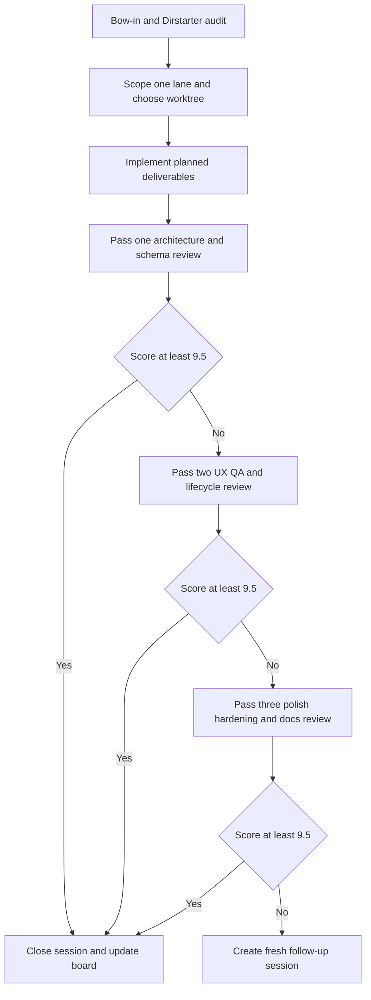
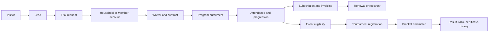

# Launch Operating System for Baseline Martial Arts and Sister Brands

## Executive Direction

The repo’s current planning artifacts already point in the same strategic direction: use Dirstarter as the baseline, prioritize backend and schema work over front-end polish, and hit a fixed all-brand launch on **May 18, 2026**. `SESSION_0019.md` explicitly starts with deep research on **dirstarter.com/docs** and then calls for TASK_01 through TASK_05 plus a structured repo comparison and wiki knowledge capture. `SESSION_0020.md` narrows the focus even further: Dirstarter first, then school-management and tournament competitors, with **backend schema and data logic as the main focus** because the front end is “already done essentially” from the old MVPs. The launch-plan document then hardens that into a no-exceptions all-brand target date. fileciteturn13file0L1-L1 fileciteturn14file0L1-L1 fileciteturn11file0L1-L1

The most important planning change is this: **the existing repo has moved beyond the older Baseline-first-only draft plan**. The older `program-plan.md` was still framing the work as an S1–S10 Baseline track with Petey, Cody, and Doug as the primary execution loop and with Giddy, Desi, and Brandon mostly deferred. The newer launch plan supersedes that by forcing parallel readiness across **Baseline Martial Arts, Black Belt Legacy, WEKAF, and Ronin Dojo Design** by May 18. In other words, the repo’s documents now justify an “all hands on deck” operating model, but the process document that formalizes that model still does not exist. That is the gap `WORKFLOW_5.0.md` should close. fileciteturn20file0L1-L1 fileciteturn11file0L1-L1

My topline recommendation is to make `WORKFLOW_5.0.md` the **governing operating system** for every session from `SESSION_0021.md` forward, with five hard rules. First, each session begins with a Dirstarter-baseline check. Second, each session is scoped to a single primary lane and at most three tightly related deliverables. Third, each deliverable is scored out of ten against a shared rubric. Fourth, each deliverable gets at most three review passes in the same session. Fifth, anything that cannot reach **9.5/10** by pass three becomes a fresh follow-up session rather than hidden debt. That rule is fully consistent with the repo’s existing “recommend, don’t decide” and structured review habits, but it raises them into a launch-grade operating procedure. fileciteturn19file0L1-L1

## Dirstarter as the Baseline

Dirstarter gives you the correct baseline architecture to build from because it already assumes the kind of SaaS foundation you need: a modern Next.js application, authentication, organizations and roles, database patterns built around Prisma, payments, storage, MDX-driven content surfaces, SEO, theming, and internationalization. Its docs also emphasize environment setup, database configuration, auth integrations, storage, monetization, and content-related features rather than ad hoc feature sprawl. That matters here because the repo was originally bootstrapped as a Dirstarter-derived web app, so the shortest path to May 18 is not to invent a new platform pattern; it is to extend the Dirstarter baseline in a disciplined vertical way for martial arts schools, tournaments, athlete workflows, and white-label launches. citeturn0search0turn3view2turn4view0turn4view1turn4view3turn4view4turn4view7turn4view8 fileciteturn21file0L1-L1

The practical implication is that every implementation decision should be forced through a **Dirstarter-first question**: “Is this an extension of an existing Dirstarter capability, or are we bypassing the framework?” In your case, most of the needed work is extension, not replacement. Authentication and tenancy should remain in the Dirstarter/Better Auth lane. Member uploads, waivers, promo assets, certificates, and event media should ride the existing storage abstractions. Public marketing pages, curriculum pages, black-belt history pages, event pages, and announcement flows should reuse Dirstarter’s content and SEO posture instead of becoming a separate CMS island. Payments should be treated as an adapter boundary: the Dirstarter monetization concepts are correct, but the martial-arts domain will likely require a richer recurring-billing and dunning model than a basic starter template. citeturn4view0turn4view3turn4view4turn4view7turn4view8

That baseline also tells you what **not** to do. Do not split auth, content, monetization, and storage into disconnected bespoke services before launch. Do not build one-off brand sites with separate logic when Dirstarter already gives you theming, i18n, and content primitives that can support brand-specific presentation on a shared platform. And do not let schema design drift away from the product layers that Dirstarter expects to power. The right move is a shared core platform with brand overlays and domain extensions, not four separate systems wearing similar styles. citeturn3view0turn3view1turn4view0turn4view1turn4view8

A useful way to encode that in `WORKFLOW_5.0.md` is with a mandatory “Dirstarter alignment” block in every session brief:

| Session brief field | What it must answer |
|---|---|
| Dirstarter baseline touched | Auth, DB, storage, monetization, content, theming, i18n, or deployment |
| Extension or replacement | State whether the session extends an existing Dirstarter layer or intentionally replaces part of it |
| Why that is justified | Short rationale tied to launch needs |
| Risk if bypassed | Migration risk, inconsistency risk, or downstream maintenance risk |

That table is a recommendation, but it is directly grounded in the fact that the repo’s research sessions explicitly require Dirstarter-first thinking. fileciteturn13file0L1-L1 fileciteturn14file0L1-L1

## What the Repo Already Tells Us

The repo already contains three planning layers that can be reconciled into one operating truth.

The first layer is the **earlier program draft**. That draft centered Baseline first, staged work in many sprints, and treated Giddy, Desi, and Brandon as largely deferred compared with Petey, Cody, and Doug. That was reasonable when the question was “how do we progress carefully?” but it is no longer the governing reality. fileciteturn20file0L1-L1

The second layer is the **launch-plan override**, which says the platform has roughly twenty days from the planning moment to an all-brand May 18 launch, that Baseline remains first among priorities, and that the old sequence must be compressed and partly parallelized. That launch doc also says quite plainly that important platform layers were still absent or underdeveloped, including deeper data modeling and launch-critical platform concerns. fileciteturn11file0L1-L1

The third layer is the **schema and session work**. `SCHEMA_NEEDS_MANIFEST.md` lays out a very broad domain footprint across organizations, events, tournaments, commerce, notifications, certifications, and more, while `SESSION_0020.md` shifts attention to school-management and tournament competitors and says backend data logic is the main concern. The `s2-schema-additions.md` file then adds a large set of models and enums, which is a substantial advance, but it does not eliminate every structural gap implied by the manifest and launch requirements. fileciteturn12file0L1-L1 fileciteturn14file0L1-L1 fileciteturn15file0L1-L1

The result is a clear planning conclusion: **the repo is past the point where it needs another broad strategy memo**. It needs one controlling execution workflow that reconciles the older draft, the newer launch constraint, and the current schema work into a fixed session cadence.

The highest-confidence gaps I would call out from the documents I reviewed are these:

| Area | Why it still looks incomplete |
|---|---|
| Lead pipeline and intake orchestration | School-management competition implies this is important, but the current planning artifacts focus much more heavily on memberships, events, and operations than on a first-class lead-to-trial-to-member CRM lane. This is an inference from the planning documents and the schema direction, not a code-level sweep. fileciteturn14file0L1-L1 fileciteturn12file0L1-L1 |
| Tournament rules, scoring, and operational detail | The schema manifest explicitly calls out rule-set association, scoring systems, weight classes, and bracket types. The additions doc advances tournaments materially, but the planning documents still support a dedicated rules-and-scoring session rather than assuming the job is finished. fileciteturn12file0L1-L1 fileciteturn15file0L1-L1 |
| Cross-brand launch enablement | The new launch plan makes every brand part of the May 18 promise, but the older operating draft still reflects a more sequential model. That mismatch needs to be resolved procedurally. fileciteturn20file0L1-L1 fileciteturn11file0L1-L1 |
| Formalized QA escalation | The repo has clear review and recommendation habits, but it does not yet have the exact launch-grade scoring loop the new schedule requires. fileciteturn19file0L1-L1 |

This is also where I would clarify one ambiguity from the competitor list: for the **school-management** comparison, I would treat the target set as **Wodify, PushPress, and Zen Planner–style capabilities**, not Zendesk-style support software. Zendesk’s own official positioning is customer service software, not dojo-operations software, so if “Zendesk” was literal rather than shorthand, it belongs in the support workflow lane instead of the core competitor matrix. citeturn13search0turn11search2

## Workflow Operating Model

`WORKFLOW_5.0.md` should define one standard session lifecycle used without exception from bow-in to bow-out.

### Core operating shape

Petey remains the orchestrator. Giddy becomes architecture and Git strategy lead. Cody remains the coding and code-review lens. Doug owns QA planning and release readiness. Desi owns UX and design consistency review. Brandon owns rollout messaging, social sequencing, and brand-positioning review. In this model, the personas do not need to write code themselves in order to be useful; they function as **specialized review gates** that keep each session honest. That is the right extension of the repo’s earlier persona structure now that the launch plan has made the work multi-brand and parallel. fileciteturn20file0L1-L1 fileciteturn11file0L1-L1

Every session should include exactly these blocks:

| Block | Purpose | Owner |
|---|---|---|
| Bow-in audit | Read opening ritual, confirm session scope, confirm Dirstarter baseline, confirm previous session carryover | Petey |
| Lane selection | Choose one primary lane and optional one dependent sub-lane | Petey + Giddy |
| Worktree plan | Name worktree, branch intent, PR target, and merge dependency | Giddy |
| Deliverables | No more than three concrete outputs | Petey |
| Review pass loop | Up to three passes with score and fix list | Cody, Doug, Desi, Brandon, Giddy |
| Closure | Record score, debt, next-session intent, and launch-board state | Petey |

That formalizes what the repo is already doing informally in rituals and planning docs, while adding the score-based launch discipline you asked for. fileciteturn16file0L1-L1 fileciteturn17file0L1-L1 fileciteturn18file0L1-L1 fileciteturn19file0L1-L1

### Score rubric

The cleanest scorecard is a weighted ten-point model:

| Category | Weight | Failure condition |
|---|---:|---|
| Dirstarter alignment | 2.5 | Session bypasses an existing baseline capability without justification |
| Data and architecture integrity | 2.0 | Schema, migration, or tenancy logic is incomplete or contradicts prior decisions |
| Lifecycle coverage | 1.5 | Core user journey for that lane is not demonstrably served |
| Test evidence | 2.0 | No credible unit, integration, e2e, or QA plan for the change |
| Merge and docs readiness | 1.0 | PR notes, ADR notes, or session notes are missing |
| Launch usefulness | 1.0 | Work does not materially move a May 18 launch deliverable |

Two hard rules should sit under that rubric. If a session fails **Dirstarter alignment** or **data integrity**, the total score is capped at **8.9** even if the rest looks good. If the deliverable is still under **9.5** after pass three, it must roll into a new session with a fresh plan rather than absorb silent debt.

### Pass loop



### Worktree model

To keep parallel work safe, use a fixed worktree map rather than improvising branches:

| Worktree | Responsibility |
|---|---|
| `wt-core-platform` | auth, tenancy, schema, migrations, shared DAL |
| `wt-school-ops` | memberships, schedules, attendance, billing, family workflows |
| `wt-tournaments` | events, registration, brackets, scoring, rankings |
| `wt-brand-launch` | content, theming, SEO, landing pages, launch assets |
| `wt-qa-hardening` | test harness, fixtures, seeds, release checks |

This is the minimum worktree set that matches the launch-plan reality without scattering changes across too many branches. The repo’s older planning was more sequential; this structure is what makes the compressed schedule credible. fileciteturn20file0L1-L1 fileciteturn11file0L1-L1

## Brand Lanes and Launch Calendar

The right lane model is **shared core first, then brand-specific overlays**.

| Lane | What it owns | Brand impact | Lead review lenses |
|---|---|---|---|
| Core platform | tenancy, authz, schema, migrations, shared services | all brands | Petey, Giddy, Cody |
| School operations | leads, members, households, programs, attendance, billing, waivers | Baseline first, then BBL | Cody, Doug |
| Tournament operations | events, registrations, brackets, scoring, officials, results | WEKAF first, then Baseline events | Giddy, Doug |
| Content and curriculum | articles, curriculum, certifications, media, SEO pages | BBL and Baseline first | Desi, Brandon |
| White-label and brand operations | themes, org setup, demos, launch pages, sales collateral | Ronin Dojo Design first | Brandon, Desi |
| Launch and support | analytics, release checklists, incident handling, social cadence | all brands | Brandon, Doug, Petey |

What changes from the older repo draft is the order. The older plan made Baseline the clear first implementation stream and delayed more of the others. The new launch-plan doc makes that insufficient. The correct compromise is **Baseline-first in core dependencies, all-brands-included in launch preparation**. fileciteturn20file0L1-L1 fileciteturn11file0L1-L1

### Session calendar

Below is the session cadence I would put into `WORKFLOW_5.0.md` and then materialize as `SESSION_0021.md` through `SESSION_0040.md`. April 28, 2026 is the planning day already in progress; execution starts on April 29.

| Date | Session | Primary lane | Main outcome |
|---|---|---|---|
| Apr 29 | `SESSION_0021` | Core platform | Ratify Dirstarter baseline, repo gap log, and launch rules |
| Apr 30 | `SESSION_0022` | Core platform | Finalize tenancy, roles, permissions, locations, and org settings |
| May 1 | `SESSION_0023` | School operations | Programs, schedules, attendance, trial flow, family accounts |
| May 2 | `SESSION_0024` | School operations | Subscriptions, invoices, dunning, waivers, contracts, refunds |
| May 3 | `SESSION_0025` | School operations | Lead intake, trial conversion, CRM states, support handoff |
| May 4 | `SESSION_0026` | Content and curriculum | Curriculum, promotions, certifications, media, content publishing |
| May 5 | `SESSION_0027` | Tournament operations | Rulesets, weight classes, divisions, eligibility, seeding |
| May 6 | `SESSION_0028` | Tournament operations | Registration checkout, rosters, teams, refunds, check-in |
| May 7 | `SESSION_0029` | Tournament operations | Brackets, match operations, scoring, mat assignment, live results |
| May 8 | `SESSION_0030` | School operations | Athlete-facing app contracts to beat the current BJJ-buddy-style baseline |
| May 9 | `SESSION_0031` | Baseline brand | Baseline onboarding, pricing, public pages, sample org, seed data |
| May 10 | `SESSION_0032` | BBL brand | Black Belt Legacy lineage, curriculum, history, certification surfaces |
| May 11 | `SESSION_0033` | WEKAF brand | Event discovery, tournament admin, rankings/result publishing |
| May 12 | `SESSION_0034` | Ronin Dojo Design | White-label org provisioning, theme packs, demo flows, sales handoff |
| May 13 | `SESSION_0035` | QA hardening | End-to-end lifecycle tests, fixtures, seeds, migration rehearsal |
| May 14 | `SESSION_0036` | Launch and support | Email, analytics, storage, payments, ops rehearsal |
| May 15 | `SESSION_0037` | Buffer and remediation | Mandatory debt burn-down for anything under 9.5 |
| May 16 | `SESSION_0038` | Cross-brand QA | UAT, accessibility, performance, content verification |
| May 17 | `SESSION_0039` | Launch readiness | Freeze, rollback drill, support playbook, launch calendar lock |
| May 18 | `SESSION_0040` | Launch day | Release execution, monitoring, support, post-launch triage |

This schedule compresses roughly thirty to forty days of normal work into twenty by doing three things on purpose: keeping Baseline first in dependency order, making brands consume shared platform outputs instead of inventing their own logic, and reserving the last four days for hardening and remediation rather than pretending every build will be perfect on first pass. That is the only honest way to make the deadline credible. fileciteturn11file0L1-L1 fileciteturn14file0L1-L1

### Launch board

```text
BACKLOG
[Core authz] [Leads] [Billing] [Curriculum] [Rulesets] [Brackets] [Athlete app]
[Baseline pages] [BBL lineage] [WEKAF results] [RDD themes] [QA harness]

IN FLIGHT
[Current session primary lane only]
[One dependent sub-lane max]

REVIEW
[Pass 1 architecture]
[Pass 2 lifecycle and UX]
[Pass 3 hardening and docs]

DONE
[Score >= 9.5]
[Session notes closed]
[Next-session intent recorded]
```

The key control is simple: **only one primary lane is allowed to be “In Flight” per session**. Everything else is either blocked, queued, or already done.

## Lifecycles, Data Flow, and Test Gates

The platform needs four complete user lifecycles planned before implementation continues, because they are the fastest way to discover whether the schema and workflow are actually sufficient.

The first is the **prospect-to-member** lifecycle. A visitor becomes a lead, a lead books or requests a trial, the household or individual account is created, waivers and contracts are signed, the person is enrolled into a program, attendance is tracked, billing starts, renewal and failed-payment recovery are handled, and promotion history becomes part of the member record. The current repo documents clearly support the need for this depth even if every sub-step is not yet formalized. fileciteturn14file0L1-L1 fileciteturn12file0L1-L1

The second is the **coach-and-admin** lifecycle. A staff member needs permissions, assigned locations or organizations, programs/classes they control, attendance and promotion authority, access to member and household data within allowed scope, and clean audit trails. That should stay anchored in the Dirstarter auth-and-organizations layer rather than a custom permission island. citeturn4view0turn4view1

The third is the **athlete-to-event** lifecycle. An athlete discovers an event, verifies eligibility, registers, pays, checks in, gets assigned into a bracket or pool, competes, receives scored results, and then sees rankings, medals, certificates, or historical results. The schema manifest and current planning documents make this a first-class requirement, and they are why I would not treat tournament work as a cosmetic post-launch feature. fileciteturn12file0L1-L1 fileciteturn14file0L1-L1

The fourth is the **white-label client onboarding** lifecycle for Ronin Dojo Design. A prospect organization is qualified, converted into a tenant, assigned a theme package, seeded with content and configuration, reviewed in a branded demo state, and handed off to support and launch operations. Dirstarter’s theming, content, auth, and storage primitives make that feasible on one codebase, which is why Ronin Dojo Design should be treated as a productized provisioning layer, not a separate bespoke build. citeturn3view0turn4view0turn4view4turn4view8

### Core lifecycle flow



### Data-input plan

| Input point | Data created or changed | Hard test gate |
|---|---|---|
| Lead form or contact CTA | lead, source, consent, follow-up state | dedupe and source attribution |
| Trial booking | lead status, schedule slot, household pre-record | capacity and no-double-booking |
| Signup and waiver | member, household, agreement, audit | role scoping and document storage |
| Membership checkout | subscription, invoice, payment, coupon, refund state | retry, cancellation, and failure recovery |
| Attendance check-in | attendance record, streak/progress stats | idempotent repeat handling |
| Promotion or belt event | progression record, certificate, content link | approvals and audit trail |
| Tournament registration | athlete eligibility, division choice, payment linkage | weight, age, rank, duplication checks |
| Bracket execution | match, score, winner, advancement | scoring consistency and rollback |
| White-label org setup | organization, theme, domain settings, seed content | preview and publish separation |

This is the data-flow layer most likely to make or break the launch, because it is where school management, tournament management, white-label provisioning, and athlete experience all converge.

### Test model

The most useful test plan is not a long generic QA checklist. It is a **lifecycle-gated** plan.

| Test layer | What must be proven before score can exceed 9.5 |
|---|---|
| Schema and migration tests | New models migrate cleanly, seed data works, rollback path exists |
| Permission tests | Org, role, household, coach, admin, and staff scopes are enforced |
| Billing tests | trial-to-paid, failed payment, refund, cancellation, and resubscribe paths work |
| Event tests | registration, eligibility, bracket creation, score submission, result publication work |
| Content tests | public pages render correctly by brand, SEO metadata is present, drafts stay private |
| Cross-brand UAT | Baseline, BBL, WEKAF, and Ronin Dojo Design all complete a core journey |
| Release ops tests | storage, emails, analytics, monitoring, and support playbooks are operational |

Doug should own the pass/fail call on those gates, but Petey should refuse to close a session above 9.5 without explicit evidence. That is how the scoring loop becomes real rather than ornamental.

## Open Questions and Limitations

I reviewed the repo’s planning and protocol artifacts plus Dirstarter’s public docs, and that is enough to produce a strong operating plan. What I did **not** do here is a complete line-by-line audit of every code file in the private repo. The GitHub connector evidence I had access to was strongest on the planning documents and commit-level summaries, so the implementation guidance above should be treated as a **high-confidence planning and architecture report**, not a claim that every existing code path has already been exhaustively verified. fileciteturn11file0L1-L1 fileciteturn12file0L1-L1 fileciteturn13file0L1-L1 fileciteturn14file0L1-L1

The most important open question to settle in `SESSION_0021.md` is whether the current schema additions fully cover **lead CRM**, **dunning and contract recovery**, **tournament rules/scoring abstractions**, and **cross-brand provisioning state**. My reading of the current documents is that those are still the highest-risk areas, and they should be the first items checked against actual code before any new broad implementation wave begins. fileciteturn12file0L1-L1 fileciteturn15file0L1-L1

If you want the single-sentence summary: **build from Dirstarter first, centralize the data model before polishing anything else, run one scored session per day from `SESSION_0021` to `SESSION_0040`, and make anything under 9.5 earn its own remediation session instead of contaminating launch week**.