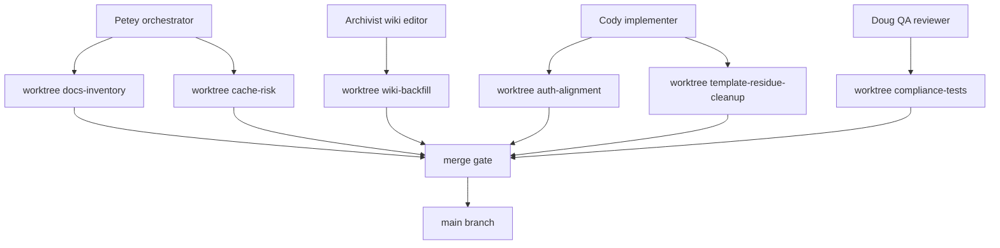
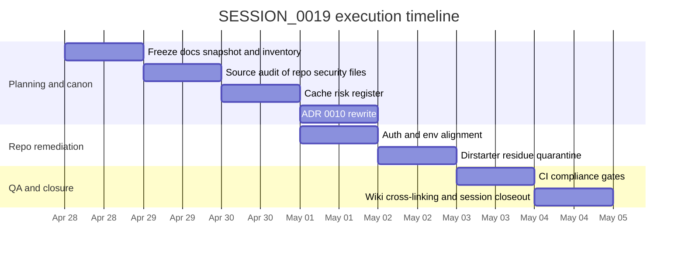
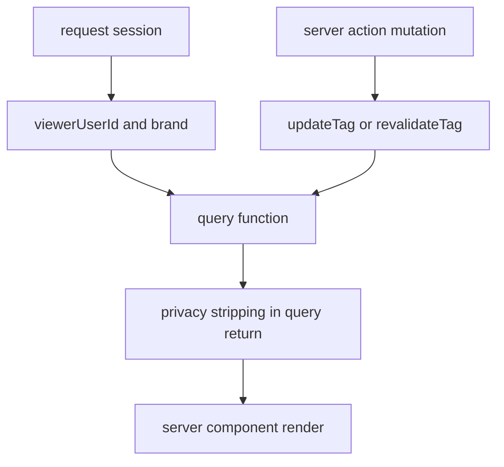

# SESSION_0019 Orchestration and Dirstarter Compliance Report

## Executive summary

The repository’s own operating rules make this a Petey session. The opening ritual says that when the task is unclear or multi-part, the operator should invoke Petey to plan first, and Petey’s role definition says Petey “plan[s], not build[s].” SESSION_0019 itself is explicitly marked `Role: Petey (planner)` and says the goal is an exhaustive Dirstarter docs audit plus a security-risk inventory before any code work proceeds. fileciteturn22file0 fileciteturn23file0 fileciteturn24file0

The most important finding is that your prompt’s “TASK_01 through TASK_05 are unspecified” assumption is no longer true in the repo: the pushed `docs/sprints/SESSION_0019.md` now defines all five tasks in detail, with explicit outputs and done conditions. That means orchestration should follow the session file, not the earlier unspecified assumption. fileciteturn24file0

The second major finding is that the repo is operating against **three different truths at once**: the current live Dirstarter docs, the copied upstream Dirstarter code snapshot pinned in `apps/web/.dirstarter-upstream` at commit `c42e8bb`, and Ronin’s own architecture/program/session docs. The program plan explicitly calls Dirstarter the L1 code-pattern source and says `apps/web/` was copied from upstream at that SHA, while the provenance file records the exact upstream URL, branch, SHA, and local source path. fileciteturn30file0 fileciteturn72file0

The third major finding is that there is real drift between **live Dirstarter docs** and **this repo’s current implementation**. The live Authentication docs describe Better Auth plus middleware route protection and `oRPC` middleware layers, while this repo uses Better Auth plus `next-safe-action`, separate page HOCs, and a different admin route behavior. The live Environment Setup and Integration docs expect variables such as `NEXT_PUBLIC_PLAUSIBLE_DOMAIN`, `REDIS_URL`, and AI Gateway model keys, while the repo’s `env.ts` and `.env.example` use a different variable surface, including Upstash REST-style keys and no `NEXT_PUBLIC_PLAUSIBLE_DOMAIN`. The official current Next.js cache docs now document `cacheComponents: true` as the cache-enablement path, while this repo’s `next.config.ts` still uses `experimental.useCache: true`. citeturn14view0turn5search1turn5search0turn4search4turn12view1turn12view2 fileciteturn34file0 fileciteturn37file0 fileciteturn39file0 fileciteturn40file0 fileciteturn61file0

The fourth major finding is that ADR 0010’s current “accepted” state should not be trusted as canonical. SESSION_0018 says ADR 0010 was drafted but **not accepted** pending deeper review, SESSION_0019 says the explicit purpose of the session is to “validate or reject ADR 0010,” and the drift register still keeps D-005 “Cache pattern not applied to read queries” open. Yet the ADR file itself says `Status: accepted`. That is a direct repo conflict and should be corrected before any implementation proceeds. fileciteturn25file0 fileciteturn24file0 fileciteturn33file0 fileciteturn32file0

My recommendation is therefore straightforward: **do not implement auth-scoped `use cache` work yet**. First, freeze a Dirstarter-docs snapshot for SESSION_0019, complete the wiki inventory and gap audit, and rewrite ADR 0010 to a conservative position: public queries only for `use cache` now, auth-variant and private queries left on `React.cache()` or uncached until explicit contract tests exist. The official Next.js docs support passing runtime-derived values in as arguments, but they also make clear that request APIs must stay outside cached scopes, that `React.cache` is isolated from `use cache`, that private cache is still experimental and browser-memory only, and that serverless runtime cache persistence is limited. citeturn12view1turn12view2turn12view5turn12view7turn12view8

A final pragmatic finding: the repo still contains a substantial amount of untouched Dirstarter “tool directory” residue, including `Tool`, `Category`, `Tag`, `Report`, and `Ad` models in Prisma, plus live admin pages for `/admin/tools`, `/admin/categories`, and `/admin/tags`. The schema itself labels these models as temporary reference material and says they should be removed before production. That is useful for learning, but it means the repo is not yet a clean martial-arts baseline. fileciteturn58file0 fileciteturn56file0 fileciteturn57file0

## Source baseline and repo reality

The current Dirstarter docs sidebar exposes a stable, broad information architecture that covers setup, codebase conventions, integrations, content/monetization/SEO/i18n features, authentication/theming, and database/deployment/cron pages. Across the pages I opened directly, the sidebar currently lists: Introduction, Getting Started, Environment Setup, First Steps; Project Structure, Editor Setup, Formatting & Linting, Updating the Codebase; Integrations Overview, Email, Storage, Payments, Media, Rate Limiting, Analytics; Content Management, Monetization, Automation, Blog, Search Engine Optimization, Internationalization; Authentication, Theming; Prisma Setup, Postgres Hosting, Deployment, and Cron Jobs. citeturn8view0turn8view1turn14view0

The repo itself says Dirstarter is the L1 code-pattern layer, but it is not claiming to be a verbatim unmodified upstream clone. The program plan says the rebuild has four layers, with Dirstarter providing “How files are organized; framework choices; HOC patterns; action client chain,” while the repo-truth index says truth resolution is split across ADRs, schema, program docs, auth docs, session files, and the wiki. In other words, **compliance here is not just “copy Dirstarter”; it is “use Dirstarter as code-pattern canon, then document every intentional divergence.”** fileciteturn30file0 fileciteturn21file0

The largest methodological problem for SESSION_0019 is that the live docs appear to be farther along than the repo’s pinned upstream snapshot. The provenance file pins `apps/web/` to Dirstarter commit `c42e8bb` copied on April 25, 2026, but the current live docs already describe patterns such as `oRPC` auth-protected procedures and cache-components-era Next.js guidance that do not line up with this repo’s present implementation. That means any compliance audit must distinguish between **documented upstream drift** and **repo-local drift**. fileciteturn72file0 citeturn14view0turn12view1turn12view2

The table below inventories the current docs surface area and shows where this report went deepest.

| Docs area | Current pages | Coverage in this report | Why it matters for SESSION_0019 |
|---|---|---|---|
| Setup | introduction, getting-started, environment-setup, first-steps | Deep on introduction, getting started, environment setup; inventory-confirmed for first steps | Establishes stack, install flow, env surface, initial assumptions. citeturn7search6turn7search5turn5search1turn14view3turn8view0 |
| Codebase | codebase/structure, codebase/ide, codebase/linting, codebase/updates | Deep on structure, editor, linting; update process inventory-confirmed | Defines file layout, tooling expectations, and update strategy. citeturn4search3turn4search0turn6search8turn8view0 |
| Integrations | overview, email, storage, payments, media, rate-limiting, analytics | Deep on overview, email, storage, media, rate limiting, analytics; payments inventory-confirmed | Session_0019 needs env, infrastructure, and service-pattern compliance. citeturn4search2turn5search4turn9view0turn4search7turn4search4turn5search0turn8view0 |
| Features | content-management, monetization, automation, blog, seo, i18n | Deep on monetization, automation, i18n; content/blog/seo inventory-confirmed | Explains which Dirstarter product behaviors are still present as template residue. citeturn5search3turn4search8turn8view0 |
| Others | authentication, theming | Deep | These are the most important live-doc compliance pages for the current repo. citeturn14view0turn8view1 |
| Database and deploy | database/prisma, database/hosting, deployment, cron-jobs | Deep on Prisma, hosting, deployment; cron inventory-confirmed | Critical for env/database/deploy alignment and current standards. citeturn14view1turn4search5turn6search9turn14view2turn14view0 |

## Dirstarter-to-repo mapping

The next table maps the most consequential live Dirstarter docs pages to the Ronin repo’s actual files and highlights where the repo aligns, where it intentionally diverges, and where it is currently conflicted.

| Dirstarter docs page | Short verbatim docs excerpt | Repo files most directly affected | What aligns | What drifts or conflicts |
|---|---|---|---|---|
| Introduction | “Built with Next.js 16 App Router and TypeScript.” | `apps/web/.dirstarter-upstream`, `apps/web/next.config.ts`, `apps/web/lib/auth.ts`, `apps/web/services/db.ts` | Repo is still a Next.js + TS + Prisma + Better Auth codebase, and provenance is pinned to upstream Dirstarter. citeturn7search6 fileciteturn72file0 fileciteturn34file0 fileciteturn41file0 | The repo adds monorepo structure, extensive Ronin domain models, and planned mobile/API packages, so this is no longer a plain directory-boilerplate app. fileciteturn58file0 fileciteturn30file0 |
| Getting Started | “Node.js 22.x or later” | repo install/toolchain docs, workspace config, local setup docs | The repo follows the same “clone, env, db, run” boot path conceptually. citeturn7search5 | Current repo docs and files were not fully cross-checked against every live getting-started prerequisite, so toolchain compliance should be re-verified before claiming parity. |
| Environment Setup | “Dirstarter uses the T3 Env package” | `apps/web/env.ts`, `apps/web/.env.example` | Repo does use `@t3-oss/env-nextjs` and a typed env schema. citeturn5search1 fileciteturn40file0 | Live docs expect variables such as `NEXT_PUBLIC_PLAUSIBLE_DOMAIN`, `REDIS_URL`, and AI Gateway model keys; the repo instead defines `REDIS_REST_URL`, `REDIS_REST_TOKEN`, lacks `NEXT_PUBLIC_PLAUSIBLE_DOMAIN`, and uses different AI keys. citeturn5search1turn5search0turn4search4 fileciteturn40file0 fileciteturn59file0 |
| Project Structure | “Dirstarter follows a modular architecture” | `apps/web/server/web/*`, `apps/web/app/*`, `apps/web/components/*`, `packages/api-client`, `docs/*` | Repo still uses feature slices such as `server/web/organization`, `server/web/directory`, page routes, and shared libs. citeturn4search3 fileciteturn44file0 fileciteturn47file0 fileciteturn52file0 | Live docs describe a single-app root layout, while Ronin has wrapped the copied app inside `apps/web/` and added packages/docs layers. That is valid, but it needs an explicit translation layer, which the repo already started in `dirstarter-architecture-map.md`. citeturn4search3 fileciteturn28file0 |
| Authentication | “Middleware auth check should not be the only protection” | `apps/web/proxy.ts`, `apps/web/lib/auth.ts`, `apps/web/lib/safe-actions.ts`, `apps/web/components/admin/auth-hoc.tsx`, `docs/architecture/auth.md` | Repo follows the same broad rule: middleware exists, session helpers exist, and server actions are auth-gated. citeturn14view0 fileciteturn38file0 fileciteturn34file0 fileciteturn37file0 | Live docs now describe `oRPC` middleware and show `nextCookies()` in auth plugin configuration; this repo uses `next-safe-action`, omits `nextCookies()`, and its admin page HOC redirects to `/` while the repo auth doc says non-admins should get a 404. citeturn14view0 fileciteturn34file0 fileciteturn37file0 fileciteturn61file0 fileciteturn31file0 |
| Theming | “Use CSS Variables” | `app/styles.css`, theming primitives, shared UI components | The repo’s architecture docs still treat Dirstarter’s component and theming primitives as L1 baseline. citeturn8view1 fileciteturn71file0 | I did not reopen every styling file in this audit, so theming compliance is only partially verified here. |
| Internationalization | “next-intl” | `apps/web/next.config.ts`, `lib/i18n*`, `messages/*` | The live docs and repo both name `next-intl`; the repo’s Next config still includes the i18n plugin. citeturn8view0 fileciteturn39file0 | The repo’s i18n implementation files were not all reopened in this pass, so deeper parity remains an open follow-up. |
| Prisma Setup | “`prisma/schema.prisma`”, “`prisma/seed.ts`”, “`services/db.ts`” | `apps/web/prisma/schema.prisma`, `apps/web/services/db.ts` | This is one of the strongest alignments: the repo still keeps schema, seed, and db-client as the core data pattern. citeturn14view1 fileciteturn58file0 fileciteturn41file0 | The schema has been heavily Ronin-extended and still carries Dirstarter reference models that the schema itself says should be removed before prod. fileciteturn58file0 |
| Storage | “Amazon S3” | `apps/web/env.ts`, `.env.example`, media/upload code | Repo env schema supports S3 plus optional endpoint/public URL extensions, which is compatible with the docs’ S3-compatible-provider guidance. citeturn9view0 fileciteturn40file0 fileciteturn59file0 | The actual media service/upload code was not reopened in this pass, so end-to-end compliance remains to be tested. |
| Rate Limiting | “`REDIS_URL`” | `apps/web/env.ts`, rate-limit implementation | Live docs now favor a single Redis URL. citeturn4search4 | Repo env uses Upstash REST variables instead, which is a meaningful implementation divergence and should be documented as such rather than silently treated as “standard Dirstarter.” citeturn4search4 fileciteturn40file0 |
| Analytics | “`NEXT_PUBLIC_PLAUSIBLE_DOMAIN`” | env config, layout/provider wiring, Next config | Repo does include `withPlausibleProxy()` in `next.config.ts`. citeturn5search0 fileciteturn39file0 | The env schema lacks `NEXT_PUBLIC_PLAUSIBLE_DOMAIN`, which the live docs still describe as part of the standard analytics setup. citeturn5search0 fileciteturn40file0 |
| Deployment | “deploy your Dirstarter project to Vercel” | deployment docs, staging plan, cron/security plan | Program plan explicitly targets Vercel/Neon staging in S12, consistent with Dirstarter docs. citeturn6search9 fileciteturn30file0 | Preview/production cache isolation appears safe at the platform level, but shared database credentials across environments could still leak application data if not separated. citeturn13search9turn13search10 fileciteturn24file0 |

The strongest repo-side pattern alignment is the vertical-slice data layer. `server/web/organization/payloads.ts`, `server/web/organization/queries.ts`, `server/web/directory/payloads.ts`, `server/web/directory/queries.ts`, and `server/web/organization/actions.ts` all show the expected Ronin adaptation of Dirstarter’s “payloads + queries + actions” style, and the repo’s own drift register says earlier missing payload files were backfilled in SESSION_0017. 

The strongest repo-side structural problem is unresolved template residue. The Prisma schema still includes Dirstarter directory models above the Ronin platform models, the admin dashboard still counts “Tools” and “Categories,” and `/admin/tools` still renders a Dirstarter-style tools table powered by `server/admin/tools/queries`. That residue is not inherently wrong during migration, but it is incompatible with any claim that “nothing is unreviewed” unless it is explicitly classified as reference-only or scheduled for removal.

## Risk register and decision on ADR 0010

Dirstarter’s live docs currently expose no dedicated caching guide in the sidebar, while SESSION_0018 and SESSION_0019 both frame the auth-scoped caching question as novel, risky, and in need of explicit validation. The repo’s own drift register also keeps cache alignment open. On top of that, current official Next.js documentation says runtime request APIs must stay outside `use cache` scopes, cached arguments and returns must be serializable, closure-captured variables become part of the cache key, `React.cache` is isolated across `use cache` boundaries, and `'use cache: private'` is still experimental and not recommended for production. 

The repo’s current code is conservative in the important places: `getServerSession()` is wrapped in `React.cache()`, `organization` and `directory` queries are still `React.cache()`-based rather than `use cache`-based, and the directory query already does its privacy stripping before it returns the mapped result. That gives you a safer starting point than ADR 0010 currently implies. fileciteturn34file0 fileciteturn44file0 fileciteturn47file0

| Risk vector from SESSION_0019 | Assessment from current evidence | Severity | Immediate policy |
|---|---|---|---|
| Cache key collision | Next.js says captured variables and function arguments become part of the cache key, so T2 can be safe **if** `brand` and `viewerUserId` are explicit serialized inputs. citeturn12view1turn12view3 | High if implemented carelessly; medium if implemented correctly | Do not ship T2 until contract tests prove brand + viewer isolation. |
| Stale auth state | `use cache` cannot read `cookies()` or `headers()` directly; auth state must be read outside and passed in. Role/session changes therefore need explicit invalidation discipline. citeturn12view1turn12view2 | High | Keep auth-sensitive reads on `React.cache()` unless invalidation and session-change tests exist. |
| `React.cache` isolation | Official docs say `React.cache` is isolated inside `use cache` boundaries and cannot be used to smuggle runtime state in. citeturn12view2 | Medium | Treat `React.cache` and `use cache` as separate systems; no mixed assumptions. |
| Brand scoping | Current directory query filters memberships by `brand`, and organization queries already scope by brand or brand+slug. fileciteturn47file0 fileciteturn44file0 | High | Any future cached query must include brand in both predicate and cache identity. |
| Visibility enum changes | Current directory query computes allowed visibility from viewer state and maps safe outputs before return. fileciteturn47file0 | Medium | Add `updateTag("directory")` or equivalent on profile/privacy mutations before considering T2. |
| Per-field privacy flags | Current query already strips `email`, `organizations`, and `ranks` before returning data. That is the correct shape. fileciteturn47file0 | Medium | Preserve this “return already-safe data” rule. |
| Membership-scoped future data | Program plan says courses, tournaments, and staff/admin workflows are still coming; those are much more authorization-heavy than the current directory. fileciteturn30file0 | Critical | Default future membership/instructor/private queries to T3-style request dedupe only. |
| SSR vs client cache | `'use cache: private'` is browser-memory only, not server-stored, still experimental, and not recommended for production. citeturn12view5turn12view6 | Medium | Do not use `'use cache: private'` as the MVP answer. |
| Serverless cold start | Next.js says serverless runtime cache entries typically do not persist across requests. That makes T2 complexity easier to justify deferring. citeturn12view2 | Low security / medium product risk | Assume weak cross-request hit rates for auth-variant cache on serverless. |
| Preview deployments | Vercel docs say runtime/data cache is isolated per project and environment (`production` vs `preview`), which lowers cross-environment cache leakage risk. But SESSION_0019 correctly notes that preview and prod can still share the same DB. citeturn13search9turn13search10 fileciteturn24file0 | Low cache risk / high config risk | Separate preview and production DB/envs before any auth-sensitive cache rollout. |

The server-action invalidation side is the one part of ADR 0010 that is already on solid ground. The repo’s `safe-actions.ts` helper calls `updateTag(tag)`, and the current Next.js docs explicitly say `updateTag` is for Server Actions only and is intended for read-your-own-writes behavior. As long as the helper is only called from Server Actions, that piece is compliant. fileciteturn37file0 citeturn12view7

The correct decision for TASK_04 is therefore **not** “accept ADR 0010 as currently written.” The right decision is: **reject the current accepted status, revert ADR 0010 to `draft` or `proposed`, and replace it with a narrower interim decision**:

- T1 public data may adopt `use cache` after a config/API recheck against current Next.js.
- T2 auth-variant data stays on `React.cache()` until isolation tests are written and passed.
- T3 private/per-user data stays on request-scoped dedupe only.
- `'use cache: private'` is out for MVP.
- Any later T2 rollout requires doc-version pinning, explicit cache-key tests, and mutation invalidation tests.

That recommendation is more consistent with SESSION_0018, SESSION_0019, the drift register, the current query code, and the live Next.js cache documentation than the current ADR file is.

## Implementation program

The action plan below is organized around ACTUAL SESSION_0019 task definitions first, then the additional repo-protection work needed to make those tasks meaningful.

| Task | Owner persona | Concrete steps | Est. hours | Dependencies |
|---|---|---|---:|---|
| TASK_01 docs inventory | Petey + Archivist | Freeze current docs sidebar; create `dirstarter-docs-inventory.md`; mark pages as deep-read vs inventory-confirmed; record snapshot date and upstream SHA. | 3 | none |
| TASK_02 source audit | Petey + Cody | Audit all security-relevant repo files already identified in SESSION_0019; explicitly note where local `dirstarter_template/` access is unavailable and where repo copies substitute. | 5 | TASK_01 |
| TASK_03 cache risk register | Petey + Doug | Create `cache-risk-register.md`; assign severity/mitigation for all ten vectors; add preview/prod DB separation check. | 4 | TASK_02 |
| TASK_04 ADR rewrite | Petey | Change ADR 0010 from accepted to draft/proposed; replace broad T1/T2/T3 rollout with public-only interim decision. | 2 | TASK_03 |
| TASK_05 merge findings | Archivist | Update wiki index, cross-links, and session file references; merge this report’s findings into canonical repo docs. | 3 | TASK_01–04 |
| Auth/doc alignment | Cody | Reconcile live Dirstarter auth docs vs repo reality: document intentional divergence, or move repo closer to current upstream patterns. | 5 | TASK_02 |
| Dirstarter residue quarantine | Cody | Classify `Tool/Category/Tag/Report/Ad` models and admin routes as reference-only or remove them behind a tracked migration plan. | 6 | TASK_02 |
| Compliance gates | Doug | Add CI checks for env drift, admin auth behavior, directory privacy, wiki lint/backlinks, and cache-tag usage. | 4 | TASK_03–07 |

That is roughly **32 hours** of focused work before any S6 implementation that depends on auth-scoped caching should be considered ready.

The worktree and persona split that best matches the repo’s own ritual system is this:



A realistic short-horizon execution timeline, starting on **April 28, 2026**, looks like this:



The review and test checklist should be treated as mandatory closeout criteria for SESSION_0019:

- **Truth and docs checks**: docs snapshot page committed; upstream SHA recorded; wiki index updated; backlinks validated against JETTY 3.0 rules. fileciteturn69file0 fileciteturn68file0
- **Auth checks**: unauthenticated access to `/me`, `/dashboard`, and `/admin` redirects correctly; non-admin access to admin pages matches the chosen policy; server actions fail closed for unauthenticated users. citeturn14view0 fileciteturn38file0 fileciteturn37file0 fileciteturn61file0
- **Directory privacy checks**: anon sees `PUBLIC` only; authenticated user sees `PUBLIC + MEMBERS_ONLY`; hidden profiles excluded; `showEmail/showOrgs/showRanks` stripping is enforced in returned payloads. fileciteturn47file0
- **Cache/invalidations checks**: if any `use cache` is introduced, prove cache-key separation by brand and viewer; prove mutation invalidation tags; prove no route-handler misuse of `updateTag`. citeturn12view1turn12view2turn12view7
- **Environment checks**: document every live-doc env variable that the repo intentionally diverges from; separate preview and production DB credentials. citeturn5search1turn4search4turn13search9turn13search10 fileciteturn40file0
- **Residue checks**: grep or static-check all remaining Dirstarter `Tool/Category/Tag/Report/Ad` codepaths and classify each as active, reference-only, or deletion candidate. fileciteturn58file0 fileciteturn56file0 fileciteturn57file0

## Exact wiki articles to commit

I could not directly write to the repository wiki from this environment because the available GitHub tooling here is read-only. The following markdown is ready to paste into the repo as canonical docs. It follows the repo’s JETTY 3.0 standard and includes explicit backlinks to Dirstarter docs pages. The content below is based on the repo’s JETTY standard, SESSION_0019 requirements, and the cited Dirstarter docs pages. fileciteturn69file0 fileciteturn24file0 citeturn7search6turn4search3turn14view0turn14view1

### `docs/knowledge/wiki/dirstarter-docs-inventory.md`

```md
---
title: Dirstarter Docs Inventory
slug: dirstarter-docs-inventory
type: concept
status: active
created: 2026-04-28
updated: 2026-04-28
author: Petey
last_agent: session-0019-petey
pairs_with:
  - docs/knowledge/wiki/dirstarter-gap-audit.md
parent: docs/knowledge/wiki/index.md
backlinks:
  - docs/knowledge/wiki/index.md
  - docs/sprints/SESSION_0019.md
needs_fix:
  - "Pin the docs snapshot date in every future refresh"
  - "Re-open content-management, blog, and SEO pages for deeper feature audit"
wiring:
  - "apps/web/.dirstarter-upstream -> copied_at_sha c42e8bbc9a093daa8bb70faebfc552399134ee13"
tags:
  - dirstarter
  - audit
  - docs
  - l1
---

# Dirstarter Docs Inventory

## Summary

This page captures the current Dirstarter documentation surface used by SESSION_0019. It exists so the repo has a dated, reviewable record of what the live docs said when we audited compliance.

## Status

Active. This is the canonical docs inventory snapshot for SESSION_0019.

## Key Idea

Dirstarter is our L1 pattern source, but the live docs move faster than our pinned upstream copy. We therefore need a local inventory page every time we perform a compliance audit.

## Structure

### Setup
- [Introduction](https://dirstarter.com/docs/introduction)
- [Getting Started](https://dirstarter.com/docs/getting-started)
- [Environment Setup](https://dirstarter.com/docs/environment-setup)
- [First Steps](https://dirstarter.com/docs/first-steps)

### Codebase
- [Project Structure](https://dirstarter.com/docs/codebase/structure)
- [Editor Setup](https://dirstarter.com/docs/codebase/ide)
- [Formatting & Linting](https://dirstarter.com/docs/codebase/linting)
- [Updating the Codebase](https://dirstarter.com/docs/codebase/updates)

### Integrations
- [Overview](https://dirstarter.com/docs/integrations)
- [Email](https://dirstarter.com/docs/integrations/email)
- [Storage](https://dirstarter.com/docs/integrations/storage)
- [Payments](https://dirstarter.com/docs/integrations/payments)
- [Media](https://dirstarter.com/docs/integrations/media)
- [Rate Limiting](https://dirstarter.com/docs/integrations/rate-limiting)
- [Analytics](https://dirstarter.com/docs/integrations/analytics)

### Features
- [Content Management](https://dirstarter.com/docs/content-management)
- [Monetization](https://dirstarter.com/docs/monetization)
- [Automation](https://dirstarter.com/docs/automation)
- [Blog](https://dirstarter.com/docs/blog)
- [Search Engine Optimization](https://dirstarter.com/docs/search-engine-optimization)
- [Internationalization](https://dirstarter.com/docs/i18n)

### Others
- [Authentication](https://dirstarter.com/docs/authentication)
- [Theming](https://dirstarter.com/docs/theming)

### Database and deployment
- [Prisma Setup](https://dirstarter.com/docs/database/prisma)
- [Postgres Hosting](https://dirstarter.com/docs/database/hosting)
- [Deployment](https://dirstarter.com/docs/deployment)
- [Cron Jobs](https://dirstarter.com/docs/cron-jobs)

## Relationships

- Pairs with: [Dirstarter Gap Audit](dirstarter-gap-audit.md)
- Backlinks: [wiki index](index.md), [SESSION_0019](../../sprints/SESSION_0019.md)

## Sources

Short verbatim anchors from the live docs:

> Introduction: "Built with Next.js 16 App Router and TypeScript."
> Project Structure: "Dirstarter follows a modular architecture"
> Authentication: "Middleware auth check should not be the only protection"
> Prisma Setup: "`prisma/schema.prisma`"
> Storage: "Amazon S3"

Primary source links:
- [Introduction](https://dirstarter.com/docs/introduction)
- [Project Structure](https://dirstarter.com/docs/codebase/structure)
- [Authentication](https://dirstarter.com/docs/authentication)
- [Prisma Setup](https://dirstarter.com/docs/database/prisma)
- [Storage](https://dirstarter.com/docs/integrations/storage)

## Open Questions

- Are we auditing against live docs HEAD, or against the upstream commit pinned in `apps/web/.dirstarter-upstream`?
- Which live-doc changes are intentional repo divergences versus upstream drift we should merge back toward?
- Should we preserve Dirstarter residue as reference-only until post-MVP, or remove it now?
```

### `docs/knowledge/wiki/dirstarter-gap-audit.md`

```md
---
title: Dirstarter Gap Audit
slug: dirstarter-gap-audit
type: concept
status: active
created: 2026-04-28
updated: 2026-04-28
author: Petey
last_agent: session-0019-petey
pairs_with:
  - docs/knowledge/wiki/dirstarter-docs-inventory.md
parent: docs/knowledge/wiki/index.md
backlinks:
  - docs/knowledge/wiki/index.md
  - docs/sprints/SESSION_0019.md
  - docs/architecture/decisions/0010-cache-strategy.md
needs_fix:
  - "Add file-level backlinks once the auth/env/cache pages are updated"
  - "Re-run this audit after ADR 0010 rewrite"
tags:
  - dirstarter
  - drift
  - audit
  - compliance
---

# Dirstarter Gap Audit

## Summary

This page records where the live Dirstarter docs and the Ronin baseline repo currently align, diverge, or directly conflict. It is the canonical gap register for SESSION_0019.

## Status

Active. Findings are evidence-backed but not all follow-up edits are complete.

## Key Idea

The repo does not have one gap. It has three classes of gap:
1. live-doc drift versus pinned upstream copy
2. intentional Ronin-domain divergence
3. unresolved contradictions inside the repo itself

## Structure

### High-confidence alignments
- Better Auth remains the authentication foundation.
- Prisma schema + seed + db service remain the data backbone.
- The repo still uses Dirstarter-style slice files such as `payloads.ts`, `queries.ts`, and shared primitives.
- Vercel remains the expected deployment target.

### High-confidence drifts
- Live auth docs now describe `oRPC` action protection, while the repo uses `next-safe-action`.
- Live env docs describe `REDIS_URL`; the repo uses `REDIS_REST_URL` and `REDIS_REST_TOKEN`.
- Live analytics docs describe `NEXT_PUBLIC_PLAUSIBLE_DOMAIN`; the repo env surface does not.
- Current Next.js docs document `cacheComponents`, while the repo still uses `experimental.useCache`.

### Internal repo conflicts
- SESSION_0018 says ADR 0010 is draft / not accepted.
- SESSION_0019 says validate or reject ADR 0010.
- The drift register keeps cache alignment open.
- `0010-cache-strategy.md` currently says `accepted`.

## Relationships

- Pairs with: [Dirstarter Docs Inventory](dirstarter-docs-inventory.md)
- Backlinks: [wiki index](index.md), [SESSION_0019](../../sprints/SESSION_0019.md)

## Sources

Short verbatim anchors from the live docs:

> Authentication: "Role-based access control"
> Environment Setup: "Never commit your `.env` file"
> Analytics: "`NEXT_PUBLIC_PLAUSIBLE_DOMAIN`"
> Rate Limiting: "`REDIS_URL`"

Repo references to inspect from this page:
- `apps/web/lib/auth.ts`
- `apps/web/lib/safe-actions.ts`
- `apps/web/proxy.ts`
- `apps/web/env.ts`
- `apps/web/next.config.ts`
- `docs/architecture/decisions/0010-cache-strategy.md`
- `docs/sprints/SESSION_0018.md`
- `docs/sprints/SESSION_0019.md`
- `docs/knowledge/wiki/drift-register.md`

## Open Questions

- Do we want “strict live-doc compliance,” or “version-pinned compliance” against commit `c42e8bb`?
- Is `next-safe-action` a deliberate long-term divergence, or an interim carry-over?
- Should admin authorization return a 404 or redirect for non-admins?
```

### `docs/architecture/cache-risk-register.md`

```md
---
title: Cache Risk Register
slug: cache-risk-register
type: file
status: active
created: 2026-04-28
updated: 2026-04-28
author: Petey
last_agent: session-0019-petey
pairs_with:
  - docs/architecture/decisions/0010-cache-strategy.md
backlinks:
  - docs/sprints/SESSION_0019.md
  - docs/knowledge/wiki/dirstarter-gap-audit.md
needs_fix:
  - "Backfill automated test IDs after implementation"
tags:
  - cache
  - security
  - auth
  - adr
---

# Cache Risk Register

## Summary

Security review for auth-scoped caching in the Ronin baseline repo. This page exists to decide whether ADR 0010 is safe, unsafe, or safe only in a narrower form.

## Status

Active. Current recommendation: public-only caching may proceed later; auth-variant and private caching stay conservative for now.

## Intent

Prevent cross-user, cross-brand, or stale-privacy leakage while the repo is still aligning to current Dirstarter and Next.js guidance.

## Architecture



## Key exports / models

Risk buckets:
- T1 public shared data
- T2 auth-variant data
- T3 private per-user data

## Wiring

- `apps/web/lib/auth.ts`
- `apps/web/lib/safe-actions.ts`
- `apps/web/server/web/directory/queries.ts`
- `apps/web/server/web/organization/queries.ts`
- `docs/architecture/decisions/0010-cache-strategy.md`

## Health

Functional as a decision artifact; not yet backed by automated cache-isolation tests. Health: 6/10.

## Teachable explanation

The safe default is simple:
- if everyone can see the same data, shared caching is possible
- if the viewer changes the result, shared caching is risky
- if the data belongs to one user, shared caching is the wrong tool

## Risk table

| Vector | Severity | Mitigation | Current status |
| --- | --- | --- | --- |
| Cache key collision | high | include brand + viewer identity in cache identity | not approved |
| Stale auth state | high | keep auth-sensitive reads conservative; invalidate on mutation | not approved |
| Brand leakage | high | brand must be both predicate and cache dimension | partially covered in queries |
| Visibility leakage | medium | filter returned rows by visibility before return | partially covered |
| Per-field privacy leakage | medium | return already-stripped payloads only | covered in directory query |
| Membership/instructor-only future data | critical | do not use shared cache yet | open |
| Preview vs production confusion | medium | separate preview/prod DB and env vars | open |
| Misuse of `updateTag` | medium | Server Actions only | open test gap |

## Revisit conditions

Revisit only after:
- ADR 0010 status is corrected
- cache-isolation tests exist
- preview/prod DB separation is confirmed
- auth route behavior is locked
```

## Sources and limitations

The most important public sources used here were the live Dirstarter docs for Introduction, Getting Started, Environment Setup, Project Structure, Authentication, Theming, Internationalization, Prisma Setup, Postgres Hosting, Storage, Email, Analytics, Rate Limiting, Deployment, Monetization, Automation, First Steps, and Cron Jobs. Those pages are linked through their citations throughout the report. 

The most important framework/platform sources used here were the current official Next.js docs for `use cache`, `use cache: private`, `updateTag`, and runtime cache-key guidance, plus Vercel docs on preview deployments and data-cache isolation by deployment environment. Those are what drove the ADR 0010 recommendation. 

The most important repo sources used here were the pushed session files, opening ritual, Petey definition, program plan, plan-vs-current, repo-truth-index, drift-register, JETTY 3.0 standard, auth architecture doc, ADR 0010, Dirstarter provenance docs, core app config/code, key query/action slices, admin residue pages, and the mobile/API package stubs. Those citations are also embedded at the point of use. 

There are three important limitations. First, I could not truly “clone and inspect every file” in the literal Git sense because the available GitHub tooling in this environment is read-only and does not expose a recursive tree-clone/write workflow. Second, the repo itself says the original local `dirstarter_template/` reference copy is outside remote-agent reach, and the drift register carries that as an open issue, so I had to audit against the pinned copied repo plus live upstream docs rather than that local source directory. Third, the live Dirstarter docs appear to have evolved beyond the repo’s pinned `c42e8bb` snapshot, so some conflicts likely reflect upstream evolution rather than mistakes in Ronin code. Those facts should be treated as part of the audit, not waved away. 