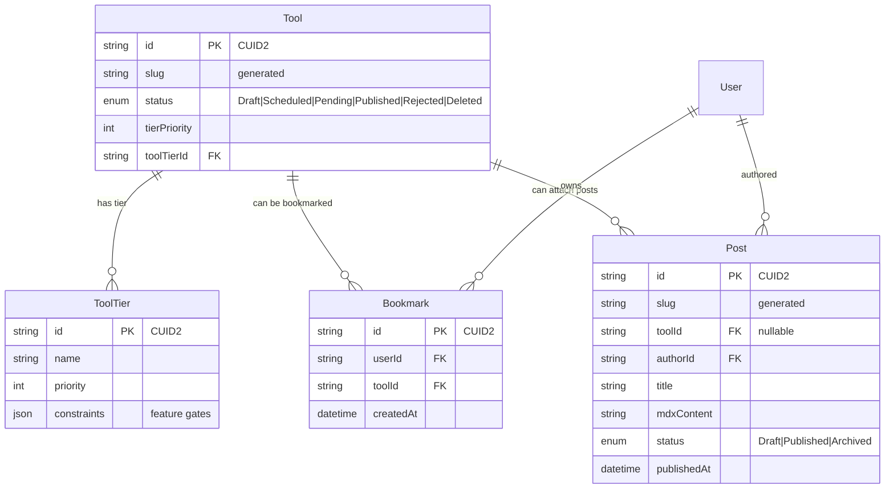

# Dirstarter Upstream Uplift Epic — 2026-05-19

## Purpose

Single-source plan for bringing Ronin from upstream Dirstarter `c42e8bb` (the original copy SHA in `apps/web/.dirstarter-upstream`) up to upstream `7e724b6` (captured 2026-05-14), via 15 sequential lane-based porting sessions. Each session = 1 Codex bow-in with 3 tasks. Per-lane SHA bump on `apps/web/.dirstarter-upstream` + entry in `docs/architecture/uplift/lane-ledger.md`.

This doc is Tier-1 reading at every uplift session bow-in. It is **the** authority on what Codex does next.

## Locks (resolved during SESSION_0203 grill-me)

| Decision | Lock | Rationale |
| --- | --- | --- |
| Scope | All 8 upstream-sync lanes + reconcile 11 historical easy wins | One epic, clean end-state. Easy wins collapse into the matching upstream lanes wherever upstream replaced the pattern. |
| oRPC stance | ADR_0019 + lineage canvas pilot (3 sessions) | Pilot validates oRPC + TanStack Query against real Ronin domain shape (lineage canvas is already real-time-shaped). |
| Toolchain bumps | Late, bundled (1 session) | Late so all lanes verify on the current toolchain; bundled so build/deploy churn happens once. |
| Vendor SDKs (Stripe + Resend) | Mid-epic, dedicated session | High production blast radius; needs isolated test coverage. |
| `.dirstarter-upstream` cadence | Per-lane bump + new `docs/architecture/uplift/lane-ledger.md` | Drift between lanes is self-auditing; final lane bumps to `7e724b6`. |
| Schema/content deltas | Aggressive single wave (no users to preserve) | One Prisma migration wave for ToolTier + Rejected/Deleted + bookmarks + posts + CUID2 + tierPriority + report enum + slug generators. |
| Epic doc location | `docs/architecture/uplift/epic-2026-05-19.md` (this doc) | New `uplift/` folder owns the epic + ledger + any lane-specific deep-dive subdocs. |
| Codex chaining | One Codex session per lane, fresh context | Clean context per lane, matches SESSION_0200 parallel-branch-leakage lesson. |

## Lane index (jump table)

| Session | Lane | Type | Depends on |
| --- | --- | --- | --- |
| SESSION_0204 | L1 — Baseline map refresh + lane-ledger init + env/deploy diff report (doc-only, complete) | Doc | — |
| SESSION_0205 | L2 — Env/deploy implementation (complete) | Code (env/runtime) | L1 |
| SESSION_0206 | L3 — Schema port wave (aggressive, complete) | Prisma/migration | L1 |
| SESSION_0207 | L4 — Baseline listings relabel + tier flow (complete) | Code (feature) | L3 |
| SESSION_0208 | L5 — UI primitives Part 1 (upstream-derived) | Code (UI) | L1 |
| SESSION_0209 | L6 — UI primitives Part 2 (reconciled easy wins) | Code (UI) | L5 |
| SESSION_0210 | L7 — Vendor SDK lane (Stripe + Resend) | Code (vendor) | L2 |
| SESSION_0211 | L8 — Content/SEO lane (DB blog + sitemap + RSS + MDX + OG) | Code (content/SEO) | L3 |
| SESSION_0212 | L9 — Admin routing pattern (ID routes + shared table) | Code (admin) | L5 |
| SESSION_0213 | L10 — oRPC ADR_0019 (decision-only) | ADR | L1 |
| SESSION_0214 | L11 — oRPC pilot Part 1 (lineage reads) | Code (API) | L10 |
| SESSION_0215 | L12 — oRPC pilot Part 2 (lineage mutations) | Code (API) | L11 |
| SESSION_0216 | L13 — oRPC pilot Part 3 (Playwright + cache invalidation + cleanup) | Code (API/QA) | L12 |
| SESSION_0217 | L14 — Toolchain bundled bump (Next 16, React 19, Bun 1.3, TS 6, Prisma 7, oxlint/oxfmt) | Toolchain | All prior |
| SESSION_0218 | L15 — Final reconciliation + SHA bump to `7e724b6` + epic hostile review | Governance | All prior |

## Per-session protocol (applies to every lane)

Every Codex session in this epic follows the same 3-task template:

```
TASK_01 — <lane action> — Cody (or Petey for ADRs/docs)
TASK_02 — Verification (Doug — typecheck, lint, tests, browser/SQL/HTTP proof as relevant)
TASK_03 — Lane-ledger update + per-lane `.dirstarter-upstream` partial-port note + project-log + close
```

Per-session bow-in must:

1. Read this epic doc + the prior session's SESSION file + `docs/architecture/uplift/lane-ledger.md`.
2. Read the specific lane block below for its session.
3. Run `graphify query` for the lane's nouns.
4. Confirm `vercel ls` shows the most recent prod/preview = `Ready` before running TASK_01.

Per-session bow-out must (per `docs/rituals/closing.md` + this epic's per-lane gate):

1. Doug hostile-close review.
2. Lane-ledger row appended with `lane`, `upstream_commits_ported`, `ronin_commit`, `dirstarter_upstream_marker_before`, `dirstarter_upstream_marker_after`, `verification_proof`.
3. `apps/web/.dirstarter-upstream` partial-port note bumped (full SHA bump to `7e724b6` only happens in SESSION_0218).
4. `vercel ls` Ready check (FS-0023 lesson).
5. Graphify refresh.
6. Commit + push `main`.

## ASCII — full epic control plane

```
                              docs/architecture/uplift/
                              ├── epic-2026-05-19.md  (THIS DOC, plan)
                              └── lane-ledger.md      (audit ledger, append-only)
                                          │
                                          ▼
            ┌──────────────────────────────────────────────────────────────┐
            │  Ronin main @ ee359c4 (SESSION_0202 close)                   │
            │  apps/web/.dirstarter-upstream copied_at_sha = c42e8bb       │
            └──────────────────────────────────────────────────────────────┘
                                          │
            ┌─────────────────────────────┼─────────────────────────────┐
            │             DOC + FOUNDATION LANES                        │
            │                             │                             │
   SESSION_0204 L1 ──► baseline refresh + lane-ledger init + env diff  │
   SESSION_0205 L2 ──► env/deploy impl  (REDIS_URL? DATABASE_PUBLIC_URL?
                                         AI Gateway? Plausible? Resend?)
   SESSION_0206 L3 ──► schema port wave (ToolTier, Rejected/Deleted,
                                         bookmarks, posts, CUID2,
                                         tierPriority, slug gen)
            │                             │                             │
            ├─────────────────────────────┼─────────────────────────────┤
            │             FEATURE + UI LANES                            │
            │                             │                             │
   SESSION_0207 L4 ──► listings relabel + tier flow UI
   SESSION_0208 L5 ──► UI primitives Part 1 (Field, ButtonGroup,
                                          tool-status, dt helpers, tv)
   SESSION_0209 L6 ──► UI primitives Part 2 (skeleton, empty-list,
                                          tooltip, toast, dialog, cmd-k)
            │                             │                             │
            ├─────────────────────────────┼─────────────────────────────┤
            │             VENDOR + CONTENT LANES                        │
            │                             │                             │
   SESSION_0210 L7 ──► Stripe 2026-04-22.dahlia + Resend contact shape
   SESSION_0211 L8 ──► DB blog + native sitemap + RSS + MDX + OG
   SESSION_0212 L9 ──► admin ID routes + shared router/table
            │                             │                             │
            ├─────────────────────────────┼─────────────────────────────┤
            │             oRPC ADR + PILOT LANES                        │
            │                             │                             │
   SESSION_0213 L10 ─► ADR_0019 oRPC stance (decision, no code)
   SESSION_0214 L11 ─► oRPC pilot reads (lineage canvas → /api/rpc)
   SESSION_0215 L12 ─► oRPC pilot mutations (lineage editor)
   SESSION_0216 L13 ─► oRPC pilot Playwright + cache invalidation
            │                             │                             │
            ├─────────────────────────────┼─────────────────────────────┤
            │             TOOLCHAIN + RECONCILE                         │
            │                             │                             │
   SESSION_0217 L14 ─► Next 16 + React 19 + Bun 1.3 + TS 6 +
                         Prisma 7 + oxlint/oxfmt
   SESSION_0218 L15 ─► .dirstarter-upstream → 7e724b6
                         + uplift-backlog archived
                         + epic hostile review + close epic
            │                             │                             │
            └─────────────────────────────┼─────────────────────────────┘
                                          ▼
                              Ronin upstream-aligned @ 7e724b6
                              (mobile-ready for oRPC follow-up epic)
```

---

# LANES

## L1 — SESSION_0204 — Baseline map refresh + lane-ledger init + env/deploy diff report (doc-only)

**Goal:** Refresh `dirstarter-baseline-index.md` against upstream `7e724b6`, initialize `lane-ledger.md`, and produce a doc-only env/deploy delta report so SESSION_0205 has zero ambiguity.

**Source upstream files (for comparison only — no copy this session):**

```
dirstarter_template/.env.example
dirstarter_template/env.ts
dirstarter_template/services/db.ts
dirstarter_template/next.config.ts
dirstarter_template/vercel.json
dirstarter_template/services/redis.ts          (if present)
dirstarter_template/services/ai.ts             (if present)
dirstarter_template/services/email.ts          (Resend shape)
dirstarter_template/middleware.ts              (if env-touching)
```

**Ronin target files:**

```
docs/architecture/dirstarter-baseline-index.md           (refresh)
docs/architecture/uplift/lane-ledger.md                  (create)
docs/architecture/uplift/L1-env-deploy-diff-report.md    (create, doc-only)
docs/knowledge/wiki/dirstarter-uplift-backlog.md         (mark easy-wins reconciled or carried)
```

**No runtime code changes this session.**

### Data wiring — env/deploy diff report schema

The L1 diff report must include this exact table for each env var category:

```
| Var | Upstream 7e724b6 | Ronin today | Decision (L2) | Risk if changed |
|-----|------------------|-------------|---------------|------------------|
```

Categories to enumerate:

- Database (`DATABASE_URL`, `DATABASE_PUBLIC_URL`, `DIRECT_URL`)
- Auth (Better Auth, Google/Apple/Discord OAuth)
- Email (Resend — `RESEND_API_KEY`, `RESEND_AUDIENCE_ID` removed upstream, `RESEND_FROM`)
- Storage (Cloudflare R2 / S3-compatible)
- Payments (Stripe — secret key, webhook, publishable)
- Caching (Upstash → maybe `REDIS_URL` in upstream)
- Analytics (`NEXT_PUBLIC_PLAUSIBLE_DOMAIN` added upstream)
- AI (AI Gateway vars added upstream; Google Generative AI removed upstream)
- Vercel-only (preview/prod URL, deployment URL)

### Tasks

#### SESSION_0204_TASK_01 — Refresh baseline-index against `7e724b6`

- **Agent:** Petey
- **What:** Walk `dirstarter-baseline-index.md`'s "Current Sources" + "Dirstarter Alignment Snapshot" + "Port Packages" tables. For each row, confirm the upstream side still matches `7e724b6` (it should — the snapshot is from the same `7e724b6`). Update any drift, add a "Last refreshed: 2026-05-NN" footer. Reconcile `dirstarter-uplift-backlog.md`: mark each of the 11 easy wins as one of: `reconciled-into-L5`, `reconciled-into-L6`, `reconciled-into-L8`, `replaced-by-upstream` (e.g., data-table column features → L5 data-table helpers), or `carried-as-domain-work` (e.g., MDX → L8).
- **Done means:**
  - `dirstarter-baseline-index.md` has a "Last refreshed: 2026-05-NN" footer.
  - `dirstarter-uplift-backlog.md` has each of the 11 items annotated with its disposition, and a banner: *"This backlog is closed as of SESSION_0204; see [docs/architecture/uplift/epic-2026-05-19.md]"*.
- **Depends on:** nothing.

#### SESSION_0204_TASK_02 — Initialize `lane-ledger.md` and write L1 env/deploy diff report

- **Agent:** Petey
- **What:** Create `docs/architecture/uplift/lane-ledger.md` with frontmatter + the append-only row format. Append the first row (L1, doc-only, no SHA marker change, verification = doc review). Then write `L1-env-deploy-diff-report.md` enumerating every env var per the categories above, marking Ronin's current value, upstream's value, and a *proposed* L2 decision for each.
- **Done means:**
  - Both docs exist with JETTY frontmatter.
  - The env-diff report has at least one row per category, and every row has a "Decision (L2)" column filled with a `keep | add | remove | rename | rescope` keyword.
- **Depends on:** TASK_01.

#### SESSION_0204_TASK_03 — Wire docs into wiki index + project-log + close

- **Agent:** Doug + Petey
- **What:** Doug hostile-reviews the three new/updated docs. Petey adds them to `docs/knowledge/wiki/index.md`, project-log SESSION_0204 rows, and updates this epic doc's L1 row in the lane index to `complete`. Bow-out per closing.md.
- **Done means:** SESSION_0204 closes-full; ledger has the L1 row; next-session prompt for SESSION_0205 is paste-ready.
- **Depends on:** TASK_02.

### Verification gate (L1)

- Doc-only. No build/test changes expected.
- Manual: every env var row in the diff report has a non-blank "Decision (L2)" cell.
- `vercel ls` Ready check (production stability).

---

## L2 — SESSION_0205 — Env/deploy implementation

**Goal:** Apply env/deploy changes per L1 diff report decisions, preserving SESSION_0161/0163 production stability.

**Source upstream files:**

```
dirstarter_template/.env.example
dirstarter_template/env.ts
dirstarter_template/services/db.ts
dirstarter_template/next.config.ts
dirstarter_template/vercel.json
```

**Ronin target files:**

```
apps/web/.env.example
apps/web/env.ts
apps/web/services/db.ts
apps/web/next.config.ts
apps/web/vercel.json
apps/web/middleware.ts                              (if env-gated)
docs/runbooks/dev-environment.md                    (update)
docs/runbooks/vercel-deploy.md                      (update if exists, otherwise create)
docs/runbooks/neon-advisory-lock-recovery.md        (link if env touches PG)
docs/architecture/uplift/lane-ledger.md             (append L2 row)
apps/web/.dirstarter-upstream                       (partial-port note: "L2 env applied")
```

### ASCII — env flow before/after

```
BEFORE (Ronin today, copied_at_sha=c42e8bb):
   .env.example ─► env.ts (Zod) ─► services/{db,redis,email,stripe}.ts
       │              │
       │              └─► t3-env validation at module-load time
       │
       └─► Vercel env (Production + Preview scoped per FS-0022 lesson)

   Auth:  Better Auth + Google/Apple/Discord OAuth
   DB:    Neon (DATABASE_URL pooled + DIRECT_URL direct for migrations)
   Email: Resend (RESEND_API_KEY, RESEND_AUDIENCE_ID, RESEND_FROM)
   Cache: Upstash REST (REDIS_REST_URL + REDIS_REST_TOKEN)
   AI:    Google Generative AI key
   SEO:   next-sitemap @ build time

AFTER (upstream 7e724b6):
   + DATABASE_PUBLIC_URL    (used by edge/non-pooled reads)
   + REDIS_URL              (Upstash REST→standard Redis URL; needs careful migration)
   + AI Gateway vars        (vendor-agnostic AI; replaces Google Generative AI key)
   + NEXT_PUBLIC_PLAUSIBLE_DOMAIN (analytics)
   - RESEND_AUDIENCE_ID     (removed — contact API shape changed)
   - REDIS_REST_*           (replaced by REDIS_URL or kept depending on hosting choice)
   - Google Generative AI key (replaced by AI Gateway)

   SEO: native sitemap routes (handled in L8)
```

### Tasks

#### SESSION_0205_TASK_01 — Apply env var additions + removals

- **Agent:** Cody
- **What:** Per L1 diff decisions: add `DATABASE_PUBLIC_URL`, `NEXT_PUBLIC_PLAUSIBLE_DOMAIN`, AI Gateway vars to `apps/web/.env.example` + `env.ts` (Zod). Decide `REDIS_URL` vs keep `REDIS_REST_*` (Ronin's current Upstash REST setup is production-stable; L1 should decide). Remove `RESEND_AUDIENCE_ID` from validation if unused. Update Vercel dashboard for **both Production AND Preview** per FS-0022 lesson.
- **Done means:**
  - `.env.example` + `env.ts` reflect L1 decisions exactly.
  - Vercel dashboard shows all new vars scoped Production + Preview.
  - Local `bun run dev` boots; t3-env shape-check passes on first request.
- **Depends on:** L1.

#### SESSION_0205_TASK_02 — Update `services/db.ts`, `next.config.ts`, `vercel.json`

- **Agent:** Cody
- **What:** Apply upstream `services/db.ts` changes (likely a `DATABASE_PUBLIC_URL` reader for non-migration reads), upstream `next.config.ts` changes (server/external packages, image patterns, env exposures), and upstream `vercel.json` if anything aligns with Ronin's brand-domain setup. **Do NOT touch `apps/web` as Vercel root setting unless L1 explicitly decided to.**
- **Done means:**
  - `pnpm --filter dirstarter typecheck` passes.
  - `bun biome check .` passes.
  - Local Prisma `migrate deploy` still works (advisory-lock recovery runbook still applies).
- **Depends on:** TASK_01.

#### SESSION_0205_TASK_03 — Vercel preview Ready proof + ledger + close

- **Agent:** Doug + Petey
- **What:** Push a feature branch, watch Vercel preview build. Per FS-0022 lesson: PR-green ≠ deploy-green; `vercel ls` must show `Ready`. Update lane-ledger with L2 row; partial-port note on `apps/web/.dirstarter-upstream`. Bow-out.
- **Done means:**
  - `vercel ls` Ready for the L2 preview deploy.
  - Lane-ledger has L2 row with `upstream_commits_ported`, `ronin_commit`, `verification_proof = vercel ls Ready @ <url>`.
  - SESSION_0205 closes-full.
- **Depends on:** TASK_02.

### Verification gate (L2)

- Local: `pnpm --filter dirstarter typecheck`, `bun biome check .`, `bun test`.
- Preview: `vercel ls` shows the L2 deploy = Ready.
- Manual: hit a brand-domain on preview and verify auth + DB queries work.

### L2 risks

- Removing `REDIS_REST_*` without replacing rate-limit / cache callers breaks `services/redis.ts`. L1 must decide.
- Adding `AI Gateway` without removing Google Generative AI key may leave dead code paths.
- Changing `DATABASE_URL` vs `DATABASE_PUBLIC_URL` routing risks advisory-lock leaks (FS-0024 Neon recovery).

---

## L3 — SESSION_0206 — Schema port wave (aggressive)

**Goal:** Single Prisma migration wave adding all upstream schema/content deltas. No users to preserve (owner confirmed SESSION_0202).

**Source upstream files:**

```
dirstarter_template/prisma/schema.prisma
dirstarter_template/prisma/migrations/<252-commit window>
dirstarter_template/lib/cuid2.ts          (or wherever upstream put the CUID2 helper)
dirstarter_template/lib/slug.ts           (slug generator)
dirstarter_template/services/db.ts        (any model-touching changes)
```

**Ronin target files:**

```
apps/web/prisma/schema.prisma
apps/web/prisma/migrations/<new wave migration folder>
apps/web/lib/cuid2.ts                                                (port)
apps/web/lib/slug.ts                                                 (port; harmonize with existing)
apps/web/server/web/tools/queries.ts                                 (align to ToolTier + new statuses)
apps/web/server/web/tools/payloads.ts                                (extend)
apps/web/server/web/tools/actions.ts                                 (extend status transitions)
apps/web/server/web/bookmarks/                                       (NEW slice)
apps/web/server/web/posts/                                           (NEW slice — wire to L8)
apps/web/server/web/.../audit-log.ts                                 (extend if status enum changes)
docs/architecture/decisions/                                         (no new ADR — covered by upstream-sync stance)
docs/architecture/uplift/lane-ledger.md                              (append L3 row)
apps/web/.dirstarter-upstream                                        (partial-port note: "L3 schema wave applied")
```

### Mermaid — new + extended schema entities



### ASCII — Tool status transition state machine (post-port)

```
                     ┌─────────┐
            ┌───────►│  Draft  │◄────────┐
            │        └────┬────┘         │
            │             │              │
        admin reject  submit          author edit
            │             ▼              │
            │       ┌───────────┐        │
            └───────┤  Pending  ├────────┘
                    └─────┬─────┘
                          │
              admin approve / schedule
                          │
                ┌─────────┴─────────┐
                ▼                   ▼
         ┌───────────┐       ┌────────────┐
         │ Scheduled ├──────►│  Published │
         └─────┬─────┘       └──────┬─────┘
               │                    │
        admin reject        admin reject/unpublish
               │                    │
               ▼                    ▼
         ┌──────────┐         ┌──────────┐
         │ Rejected │         │ Deleted  │
         └──────────┘         └──────────┘
```

`Rejected` and `Deleted` are the new upstream `7e724b6` statuses (Ronin already has these on `main` per recent commits 7e724b6 was already locally pulled; verify before re-adding).

### Tasks

#### SESSION_0206_TASK_01 — Schema additions + CUID2/slug helpers

- **Agent:** Cody
- **What:** Add `ToolTier` model, `Bookmark` model, `Post` model. Add `Rejected` and `Deleted` to Tool status enum **only if not already present on Ronin main** (recent commit 7e724b6 in chore/enable-pnpm-pre-post-scripts already names these — verify first). Add `tierPriority Int @default(0)` to Tool. Port `lib/cuid2.ts` + `lib/slug.ts`. Add `@default(cuid2())` to new ID fields. Generate migration. Owner confirmed no-users → destructive migrations OK.
- **Done means:**
  - `apps/web/prisma/schema.prisma` reflects all upstream additions.
  - Migration file generated under `apps/web/prisma/migrations/<timestamp>_uplift_L3_schema_wave/`.
  - `pnpm --filter dirstarter prisma generate` clean.
  - `pnpm --filter dirstarter prisma migrate dev` clean against local DB.
- **Depends on:** L1 (lane-ledger exists).

#### SESSION_0206_TASK_02 — Query/payload/action alignment + new server slices

- **Agent:** Cody
- **What:** Extend `server/web/tools/queries.ts` + `payloads.ts` to include ToolTier and new statuses. Create `server/web/bookmarks/` slice (CRUD queries + actions). Create `server/web/posts/` slice (read queries; admin CRUD deferred to L8 for blog wiring). Update audit log if status enum changed. Do not change any existing public route shapes.
- **Done means:**
  - `bun test server/web/tools server/web/bookmarks server/web/posts` passes.
  - `pnpm --filter dirstarter typecheck` clean.
  - No existing tests regress.
- **Depends on:** TASK_01.

#### SESSION_0206_TASK_03 — Migration smoke + ledger + close

- **Agent:** Doug + Petey
- **What:** Deploy migration to Neon dev/staging; verify advisory-lock not leaked (`pg_locks` query from FS-0024). Update lane-ledger. Bow-out.
- **Done means:**
  - `pnpm --filter dirstarter prisma migrate deploy` to dev DB returns clean.
  - No advisory lock leak in `pg_locks` post-migration.
  - SESSION_0206 closes-full.
- **Depends on:** TASK_02.

### Verification gate (L3)

- Local typecheck + bun tests.
- `prisma migrate dev` clean.
- `prisma migrate deploy` to staging clean.
- Neon `pg_locks` shows no lingering `pg_advisory_lock(72707369)` (FS-0024 mitigation).

### L3 risks

- Slug generator collision with existing Ronin slug code → audit before porting.
- CUID2 vs existing `cuid()` (v1) on new tables only; do **not** rewrite existing IDs.
- Bookmark + Post tables: ensure brand-scoping if Ronin makes them brand-aware (decide in TASK_01).

---

## L4 — SESSION_0207 — Baseline listings relabel + tier flow

**Goal:** Implement tier flow + public "Listing" relabel using the new schema. Defended by `baseline-listings-runbook.md`: no Prisma rename, no route rename, public copy only.

**Source upstream files:**

```
dirstarter_template/app/(web)/tools/                  (tier UI patterns)
dirstarter_template/components/tool-status.tsx        (handled in L5; reused here)
dirstarter_template/components/tool-tier-badge.tsx    (if present)
dirstarter_template/server/tools/actions.ts           (status transitions)
```

**Ronin target files:**

```
apps/web/app/(web)/<listings public routes>/page.tsx                 (public relabel)
apps/web/components/web/listings/                                    (NEW or extend)
apps/web/server/web/tools/actions.ts                                 (tier transitions, not status renames)
apps/web/server/web/tools/queries.ts                                 (tier ordering for public lists)
docs/runbooks/baseline-listings-runbook.md                           (mark step landed)
docs/architecture/uplift/lane-ledger.md                              (append L4 row)
apps/web/.dirstarter-upstream                                        (partial-port note: "L4 tier flow + relabel")
```

### Low-fi wireframe — public listing card (post-L4)

```
┌────────────────────────────────────────────────────────────┐
│  ┌────────┐    Listing Name                  ┌─────────┐  │
│  │  IMG   │    ─────────────────             │ Tier 1  │  │  ← ToolTier badge
│  │ 80x80  │    Tagline / one-liner           └─────────┘  │
│  └────────┘    ───────────────────────────                │
│                Category · Location · Members              │
│                                                            │
│                ★ Featured · Verified · Premium             │  ← tierPriority-derived
│                                                            │
│                              [ View Listing ]  [ ♥ Save ] │  ← Save = bookmark from L3
└────────────────────────────────────────────────────────────┘
```

### Low-fi wireframe — admin tier transition panel

```
ADMIN > Listings > <listing-slug> > Status panel
─────────────────────────────────────────────────────
Current status:   Pending           (since 2026-05-NN)
Current tier:     Tier 2 (Verified)

  Status transition:
   [ Approve & Publish ]   [ Schedule for ▾ ]   [ Reject (reason) ]

  Tier change:
   ( ) Tier 0 — Unverified
   ( ) Tier 1 — Listed
   (●) Tier 2 — Verified
   ( ) Tier 3 — Premium

  Audit:
   - 2026-05-NN  admin@dojo.com  Pending  ◄  Draft
   - 2026-05-NN  admin@dojo.com  Tier 2   ◄  Tier 1
─────────────────────────────────────────────────────
```

### Tasks

#### SESSION_0207_TASK_01 — Public listing card with ToolTier + status surfacing

- **Agent:** Cody
- **What:** Extend existing public Tool listing pages to show ToolTier badge + tierPriority-derived sort. Add the Save (bookmark) affordance — only authenticated users can save; unauthenticated shows a login redirect.
- **Done means:** Public listing pages render tier badges; saved-bookmark toggle works against L3 schema.
- **SESSION_0207 result:** Complete. Public cards/detail pages show listing tier/status badges and Save controls; tier-aware CTAs now use `tiersConfig` capabilities.
- **Depends on:** L3.

#### SESSION_0207_TASK_02 — Admin tier transition panel + audit

- **Agent:** Cody
- **What:** Build the admin tier-transition panel per wireframe. Wire into the existing admin Tool action path with audit-log entries for every transition.
- **Done means:** Admin can change tier; audit log captures actor/before/after.
- **SESSION_0207 result:** Complete. `/admin/tools` remains the route, is relabeled to Listings, has tier filter/column/form controls, and writes `TIER_TRANSITION` audit logs through admin safe actions.
- **Depends on:** TASK_01.

#### SESSION_0207_TASK_03 — Browser smoke + ledger + close

- **Agent:** Doug + Petey
- **What:** Playwright (or curl-equivalent) smoke: public list shows tiers; admin can transition; audit log row present. Update lane-ledger. Bow-out.
- **Done means:** SESSION_0207 closes-full with verification evidence.
- **SESSION_0207 result:** Complete. Focused tests, full isolated app suite, typecheck, production build, curl smoke, Vercel readiness, and full-close artifacts passed.
- **Depends on:** TASK_02.

### Verification gate (L4)

- Public listing route renders tiered ordering.
- Admin tier transition writes audit log row.
- No Prisma rename: `Tool` model name unchanged; `baseline-listings-runbook.md` still defends substrate.

---

## L5 — SESSION_0208 — UI primitives Part 1 (upstream-derived)

> **Status: complete (2026-05-20).** See lane-ledger L5 row, `docs/sprints/SESSION_0208.md`, and `SESSION_0208_REVIEW_01` in `docs/protocols/project-log.md`. Petey reconciliation found the epic's source-file list approximate vs upstream `7e724b6`; the actual port covered `components/common/{field,button-group,tool-status}.tsx`; `tailwind-variants` was a no-op because Ronin's `cva` object-form API is signature-compatible with upstream's `tv`-aliased calls; data-table helpers already matched upstream behavior aside from a deferred `render={…}` vs `asChild` Popover API drift.

**Goal:** Port upstream UI primitives: `Field`, `ButtonGroup`, `tool-status`, `data-required` labels, `tailwind-variants`, data-table helpers (column visibility / faceted filters / date range).

**Source upstream files:**

```
dirstarter_template/components/common/field.tsx
dirstarter_template/components/common/button-group.tsx
dirstarter_template/components/common/tool-status.tsx
dirstarter_template/components/data-table/column-visibility.tsx
dirstarter_template/components/data-table/faceted-filter.tsx
dirstarter_template/components/data-table/date-range-filter.tsx
dirstarter_template/lib/tv.ts                              (tailwind-variants helper)
```

**Ronin target files:**

```
apps/web/components/common/field.tsx                            (port)
apps/web/components/common/button-group.tsx                     (port)
apps/web/components/common/tool-status.tsx                      (port)
apps/web/components/data-table/column-visibility.tsx            (port)
apps/web/components/data-table/faceted-filter.tsx               (port)
apps/web/components/data-table/date-range-filter.tsx            (port)
apps/web/lib/tv.ts                                              (port if not present)
apps/web/components/admin/<one chosen surface>/data-table.tsx   (apply helpers to ONE admin table as proof)
docs/knowledge/wiki/custom-component-inventory.md               (document each new primitive)
docs/architecture/uplift/lane-ledger.md                         (append L5 row)
apps/web/.dirstarter-upstream                                   (partial-port note: "L5 UI primitives part 1")
```

### Low-fi wireframe — Field primitive shape

```
<Field name="email" label="Email" description="We'll never share">
  <Input type="email" />
  <FieldMessage />     ← error/validation
</Field>

renders as:

  Email                              ← <FieldLabel> from render-prop
  ┌──────────────────────────────┐
  │ user@dojo.com                │   ← <FieldControl> children
  └──────────────────────────────┘
  We'll never share                  ← <FieldDescription>
  ⚠ Invalid email                    ← <FieldMessage> (only on error)
```

### Low-fi wireframe — data-table helpers

```
┌─────────────────────────────────────────────────────────────────────┐
│  [ Filter ▼ ]  [ Status: All ▼ ]  [ Date: 2026-05-01 → 2026-05-NN ]│  ← faceted + date-range
│                                              [ Columns ▼ ]          │  ← column-visibility
├────────────────┬──────────┬───────────┬──────────┬──────────────────┤
│ Name           │ Status   │ Tier      │ Updated  │ Actions          │
├────────────────┼──────────┼───────────┼──────────┼──────────────────┤
│ Acme Dojo      │ Active   │ Verified  │ 2d ago   │ [ … ]            │
│ Beta School    │ Pending  │ —         │ 1h ago   │ [ … ]            │
└────────────────┴──────────┴───────────┴──────────┴──────────────────┘
```

### Tasks

#### SESSION_0208_TASK_01 — Port `Field`, `ButtonGroup`, `tool-status`, `tailwind-variants`, `data-required`

- **Agent:** Cody
- **What:** Source from upstream; adapt to Ronin's existing Tailwind/Radix base. Document each in `custom-component-inventory.md`.
- **Done means:** Components compile + render in Storybook-style demo route (or stand-alone test).
- **Depends on:** L1.

#### SESSION_0208_TASK_02 — Port data-table helpers + apply to one admin table

- **Agent:** Cody
- **What:** Port `column-visibility`, `faceted-filter`, `date-range-filter`. Apply to one admin table (e.g., `apps/web/components/admin/tools/data-table.tsx`) as proof.
- **Done means:** Chosen admin table shows new helpers; filters work; no regression on other admin tables.
- **Depends on:** TASK_01.

#### SESSION_0208_TASK_03 — Playwright proof + ledger + close

- **Agent:** Doug + Petey
- **What:** Playwright smoke on the chosen admin table: filter, date-range, column-visibility. Update lane-ledger. Bow-out.
- **Done means:** SESSION_0208 closes-full with Playwright proof.
- **Depends on:** TASK_02.

### Verification gate (L5)

- Browser proof of the new primitives on a real admin surface.
- No biome/oxlint failures.
- No regression on existing admin tables (they should still work even without the new helpers).

---

## L6 — SESSION_0209 — UI primitives Part 2 (reconciled easy wins)

> **Status update (SESSION_0209 bow-out, 2026-05-20):** Phase 1 complete. The L6 "easy wins" list below turned out to be ~95% already shipped in Ronin (skeleton composites widely wired via Suspense, EmptyList consumed across 11+ list components, sonner toast wired across all mutation forms, web Cmd-K via `components/common/search.tsx`, shared `components/admin/dialogs/delete-dialog.tsx` with 18 per-entity wrappers, tooltips widely wired). The substantive missing work was (a) Radix→Base UI migration to match upstream's primitive runtime, and (b) a new admin Cmd+K palette. Both are now tracked as the multi-session **D-016** lane per [petey-plan-0083](../../sprints/petey-plan-0083.md). Phase 1 (this session) shipped: deps install (`@base-ui/react ^1.3.0`, `cmdk-base ^1.0.0`, `tailwind-variants ^3.2.2`), `lib/slot.ts` port, `toaster.tsx` reconcile, `empty-list.tsx` relocated to `components/common/` (10 import sites repathed), and `separator.tsx` + `avatar.tsx` migrated. Phases 2–8 carry the remaining primitives + admin Cmd+K palette + dep cleanup.

**Goal:** Land the reconciled easy wins from `dirstarter-uplift-backlog.md` — now that L5 provides the upstream primitives, these can layer on top.

**Reconciled scope (from the historical 11):**

| Easy win | Disposition in epic |
| --- | --- |
| 1. Skeleton loading states | L6 — port `components/common/skeleton.tsx` composites to listing pages |
| 2. Tooltips on dashboard/admin | L6 — wire `Tooltip` to icon-only buttons |
| 3. Command palette (Cmd+K) | L6 — admin layout cmdk integration |
| 4. Toast/Sonner on actions | L6 — wire to all mutation paths |
| 5. EmptyList for zero-state | L6 — port `components/common/empty-list.tsx` |
| 6. Dialog/Sheet ConfirmDelete | L6 — extract reusable `ConfirmDeleteDialog` |
| 7. MDX content | L8 (content lane) |
| 8. OG image generation | L8 |
| 9. Sitemap generation | L8 |
| 10. Data-table column features | L5 (landed) |
| 11. Blog/newsletter scaffolding | L8 |

**Ronin target files:**

```
apps/web/components/common/skeleton.tsx           (port + composites)
apps/web/components/common/tooltip.tsx            (port if not present)
apps/web/components/common/command.tsx            (port — cmdk)
apps/web/components/common/toast.tsx              (port — sonner)
apps/web/components/common/empty-list.tsx         (port)
apps/web/components/common/confirm-delete.tsx     (NEW reusable from tournaments-delete-dialog pattern)
apps/web/app/(web)/<listings>/page.tsx            (apply skeleton + empty-list)
apps/web/app/(web)/dashboard/                     (apply tooltips)
apps/web/app/(admin)/layout.tsx                   (wire cmd-k)
apps/web/server/<*>/actions.ts                    (wire toast feedback via action client)
docs/knowledge/wiki/custom-component-inventory.md (update)
docs/architecture/uplift/lane-ledger.md           (append L6 row)
apps/web/.dirstarter-upstream                     (partial-port note: "L6 UI primitives part 2")
```

### Low-fi wireframe — Command palette (Cmd+K)

```
   ┌─────────────────────────────────────────────────────────────┐
   │ ⌕  Type a command or search…                                │
   ├─────────────────────────────────────────────────────────────┤
   │ NAVIGATE                                                    │
   │   ↪  Dashboard                                              │
   │   ↪  Listings                                               │
   │   ↪  Tournaments                                            │
   │ ACTIONS                                                     │
   │   +  Create listing                                         │
   │   +  Invite member                                          │
   │ ENTITIES (live search)                                      │
   │   👤 Acme Dojo  •  School                                   │
   │   👤 Black Belt Legacy  •  Brand                            │
   └─────────────────────────────────────────────────────────────┘
```

### Low-fi wireframe — Skeleton on listing page

```
┌──────────────────────────────────────────────────────────┐
│  ░░░░░░  ▓▓▓▓▓▓▓▓▓▓▓▓▓▓▓                       ░░░░░░  │
│  ░░░░░░  ▓▓▓▓▓▓▓▓▓▓▓                           ░░░░░░  │  ← Skeleton card
│          ▓▓▓▓▓▓▓ · ▓▓▓▓▓ · ▓▓▓▓                         │
└──────────────────────────────────────────────────────────┘
┌──────────────────────────────────────────────────────────┐
│  ░░░░░░  ▓▓▓▓▓▓▓▓▓▓▓▓▓▓                        ░░░░░░  │
│  ...                                                     │
└──────────────────────────────────────────────────────────┘
```

### Tasks

#### SESSION_0209_TASK_01 — Skeleton, EmptyList, Tooltip

- **Agent:** Cody
- **What:** Port skeleton composites for each listing route. Port EmptyList; wire to listings + admin tables zero-states. Wire Tooltip to dashboard tab triggers + admin row-action icons.
- **Done means:** All listing pages have skeleton state during load + empty state when no rows; icon-only buttons have tooltip labels.
- **Depends on:** L5.

#### SESSION_0209_TASK_02 — Toast, Dialog/Sheet ConfirmDelete, Command palette

- **Agent:** Cody
- **What:** Wire Toast/Sonner provider; instrument all `server/<*>/actions.ts` mutation paths to toast on success/failure. Extract `ConfirmDeleteDialog` from `tournaments-delete-dialog.tsx`; replicate to all admin delete flows. Wire admin Cmd+K Command palette with route list + entity search.
- **Done means:** All admin mutations toast; all destructive admin actions go through `ConfirmDeleteDialog`; Cmd+K works in admin layout.
- **Depends on:** TASK_01.

#### SESSION_0209_TASK_03 — Playwright proof + ledger + close

- **Agent:** Doug + Petey
- **What:** Playwright: load a listing route, see skeleton → content; trigger an admin delete, see confirm dialog → toast on success; Cmd+K navigates. Update lane-ledger. Bow-out.
- **Done means:** SESSION_0209 closes-full with Playwright proof of all 6 reconciled easy wins.
- **Depends on:** TASK_02.

### Verification gate (L6)

- Playwright proof per primitive.
- Accessibility: tooltips have aria-labels; toast announces to screen readers.

---

## L7 — SESSION_0210 — Vendor SDK lane (Stripe + Resend)

**Goal:** Upgrade Stripe to `2026-04-22.dahlia` and update Resend contact-shape, isolated from other lanes due to production blast radius.

**Source upstream files:**

```
dirstarter_template/services/stripe.ts
dirstarter_template/services/email.ts
dirstarter_template/app/api/stripe/webhook/route.ts
dirstarter_template/services/email-templates/
```

**Ronin target files:**

```
apps/web/services/stripe.ts                                      (upgrade SDK + API version)
apps/web/services/email.ts                                       (Resend contact-shape)
apps/web/app/api/stripe/webhook/route.ts                         (re-verify event types under new API)
apps/web/services/email-templates/                               (Resend payload shape)
apps/web/server/web/membership/actions.ts                        (Stripe call sites)
apps/web/server/web/merch/actions.ts                             (Stripe call sites)
apps/web/server/web/auth/magic-link.ts                           (Resend call sites)
apps/web/.../tests/stripe-webhook.test.ts                        (refresh fixtures)
apps/web/.../tests/resend-contact.test.ts                        (refresh fixtures)
docs/runbooks/stripe-webhook-runbook.md                          (update — if exists)
docs/runbooks/resend-magic-link-runbook.md                       (update — if exists)
docs/architecture/uplift/lane-ledger.md                          (append L7 row)
apps/web/.dirstarter-upstream                                    (partial-port note: "L7 vendor SDK")
```

### ASCII — Stripe webhook flow (post-L7)

```
Stripe (API 2026-04-22.dahlia) ──HTTPS──► apps/web/app/api/stripe/webhook/route.ts
                                                       │
                                                       │ verify signature (STRIPE_WEBHOOK_SECRET)
                                                       ▼
                                            switch on event.type
                                            ├─ checkout.session.completed   ─► Membership entitlement grant
                                            ├─ invoice.paid                  ─► Renewal audit row
                                            ├─ invoice.payment_failed        ─► Dunning state machine
                                            ├─ customer.subscription.updated ─► Tier change → entitlement
                                            └─ charge.refunded               ─► Refund audit row
                                                       │
                                                       ▼
                                            audit log + brand-scoped service notify
```

### ASCII — Resend magic-link flow (post-L7)

```
User signs in → Better Auth → server/web/auth/magic-link.ts
                                       │
                            new Resend contact shape:
                              { from, to, subject, react: <MagicLinkEmail /> }
                                       │
                                       ▼
                            Resend SDK 2026-04 → email delivered
                                       │
                                       └─► event hook (no RESEND_AUDIENCE_ID anymore)
```

### Tasks

#### SESSION_0210_TASK_01 — Stripe SDK + API version bump

- **Agent:** Cody
- **What:** Upgrade `stripe` package; set API version `2026-04-22.dahlia`. Re-verify event types in webhook handler (Stripe may have renamed/added types). Update test fixtures.
- **Done means:** Local `bun test` for stripe webhook tests passes; manual webhook smoke via `stripe trigger checkout.session.completed` against local handler succeeds.
- **Depends on:** L2 (env vars stable).

#### SESSION_0210_TASK_02 — Resend contact-shape update

- **Agent:** Cody
- **What:** Update `services/email.ts` to new contact shape. Remove `RESEND_AUDIENCE_ID` references (already env-removed in L2). Update magic-link + transactional email templates to new SDK payload format. Refresh fixtures.
- **Done means:** `bun test` for resend-related tests passes; manual magic-link test delivers email.
- **Depends on:** TASK_01.

#### SESSION_0210_TASK_03 — Webhook + email smoke proof + ledger + close

- **Agent:** Doug + Petey
- **What:** End-to-end smoke: trigger a Stripe test checkout → entitlement grant lands in DB → audit row exists. Trigger a magic-link → email delivered → token works. Update lane-ledger. Bow-out.
- **Done means:** SESSION_0210 closes-full with both smokes evidenced; `vercel ls` Ready on preview.
- **Depends on:** TASK_02.

### Verification gate (L7)

- Stripe webhook fixtures + manual `stripe trigger` smoke.
- Resend magic-link manual smoke.
- `vercel ls` Ready on preview (production-sensitive lane).

### L7 risks

- API version bumps can break webhook payload parsing → fixture refresh is mandatory.
- Resend contact-shape change may break audience-management calls that Ronin still uses → audit before removing.

---

## L8 — SESSION_0211 — Content/SEO lane (DB blog + sitemap + RSS + MDX + OG)

**Goal:** Adopt upstream's DB-driven blog, native sitemap routes, native RSS route, MDX rendering for program/school/technique, and OG image generation per dynamic route. Remove `next-sitemap`.

**Source upstream files:**

```
dirstarter_template/app/(web)/blog/                       (DB blog routes)
dirstarter_template/app/sitemap.ts                        (native sitemap)
dirstarter_template/app/feed.xml/route.ts                 (or rss.xml)
dirstarter_template/app/og/<route>/route.tsx              (OG image)
dirstarter_template/components/mdx/                       (MDX components)
dirstarter_template/server/posts/                         (already added in L3)
```

**Ronin target files:**

```
apps/web/app/(web)/blog/page.tsx                                 (list)
apps/web/app/(web)/blog/[slug]/page.tsx                          (post)
apps/web/app/sitemap.ts                                          (NEW native)
apps/web/app/rss.xml/route.ts                                    (NEW)
apps/web/app/og/<entity>/[slug]/route.tsx                        (dynamic OG)
apps/web/components/mdx/                                         (NEW — Heading, CodeBlock, Callout, etc.)
apps/web/server/web/posts/queries.ts                             (extend from L3)
apps/web/server/web/posts/actions.ts                             (admin CRUD)
apps/web/app/(admin)/blog/                                       (admin CRUD pages)
apps/web/next.config.ts                                          (remove next-sitemap, configure MDX if needed)
apps/web/package.json                                            (remove next-sitemap dep)
docs/runbooks/content-seo.md                                     (NEW or extend)
docs/architecture/uplift/lane-ledger.md                          (append L8 row)
apps/web/.dirstarter-upstream                                    (partial-port note: "L8 content/SEO")
```

### ASCII — content/SEO architecture (post-L8)

```
                ┌────────────────────────────────────────────────────┐
                │  Post model (L3)  ◄── admin CRUD (L8)              │
                └─────────┬──────────────────────────────────────────┘
                          │ MDX content
                          ▼
        ┌──────────────────────────────┐       ┌──────────────────────────┐
        │ /blog               (list)   │       │ /blog/[slug] (post page) │
        └──────────────┬───────────────┘       └────────────┬─────────────┘
                       │ generateMetadata                    │
                       ▼                                     ▼
            ┌─────────────────────┐              ┌────────────────────────┐
            │ /og/blog/[slug]     │              │ <MDXContent />         │
            │  dynamic OG image   │              │  components/mdx/*      │
            └─────────────────────┘              └────────────────────────┘

        Public discovery:
          /sitemap.xml   ─► app/sitemap.ts   ─► dynamic routes from DB
          /rss.xml       ─► app/rss.xml/route.ts ─► published posts feed
```

### Low-fi wireframe — blog post page

```
┌──────────────────────────────────────────────────────────────────┐
│  ◄ Back to blog                                                  │
│                                                                  │
│   ###################                                            │
│   #     OG IMAGE     #     (auto-generated /og/blog/<slug>)      │
│   ###################                                            │
│                                                                  │
│   Title of the Post                                              │
│   By Author · 2026-05-NN · 6 min read                            │
│                                                                  │
│   ────────────────────────────────────────────────────           │
│                                                                  │
│   MDX body…                                                      │
│   ┌─────────────────┐                                            │
│   │  <Callout>      │   ← MDX component                          │
│   └─────────────────┘                                            │
│                                                                  │
│   ```ts                  ← <CodeBlock> MDX component             │
│   …                                                              │
│   ```                                                            │
│                                                                  │
│   Related Listings: [ … ] [ … ]   ← Post.toolId join (L3)        │
└──────────────────────────────────────────────────────────────────┘
```

### Tasks

#### SESSION_0211_TASK_01 — DB blog routes + admin CRUD + MDX components

- **Agent:** Cody
- **What:** Build `/blog` + `/blog/[slug]`. Port MDX component library. Build admin `/admin/blog` CRUD using L5 data-table helpers. Wire `Post.toolId` join for related listings.
- **Done means:** Authenticated admin can create a Post → public `/blog/[slug]` renders MDX.
- **Depends on:** L3 (Post model), L5 (data-table helpers).

#### SESSION_0211_TASK_02 — Native sitemap + RSS + OG generation + remove next-sitemap

- **Agent:** Cody
- **What:** Write `app/sitemap.ts` aggregating brand-scoped public routes from DB (listings, blog posts, programs, members, etc.). Write `app/rss.xml/route.ts` for published posts. Build dynamic OG handler for blog + listings + programs + members + tournaments. Remove `next-sitemap` dep + script.
- **Done means:** `curl /sitemap.xml` returns valid XML; `curl /rss.xml` returns valid feed; OG images render with proper dimensions for each dynamic route.
- **Depends on:** TASK_01.

#### SESSION_0211_TASK_03 — SEO smoke + ledger + close

- **Agent:** Doug + Petey
- **What:** SEO smoke: `curl -I` on sitemap + rss + a /og/blog/<slug> + a /og/listings/<slug>. Verify metadata via View Source on /blog/<slug>. Update lane-ledger. Bow-out.
- **Done means:** SESSION_0211 closes-full with SEO smoke proof.
- **Depends on:** TASK_02.

### Verification gate (L8)

- `curl /sitemap.xml` valid.
- `curl /rss.xml` valid.
- OG image renders for each dynamic route family.
- `next-sitemap` removed from `package.json`.

---

## L9 — SESSION_0212 — Admin routing pattern (ID routes + shared router/table)

**Goal:** Port upstream's admin ID-route pattern + shared router/table primitives to extend ADR_0012.

**Source upstream files:**

```
dirstarter_template/app/(admin)/<entity>/[id]/                (ID-route pattern)
dirstarter_template/components/admin/router/                  (shared router primitives)
```

**Ronin target files:**

```
apps/web/app/(admin)/                                                 (apply pattern)
apps/web/components/admin/router/                                     (NEW shared)
docs/architecture/decisions/0012-admin-crud-routing-pattern.md        (update — minor amendment)
docs/architecture/uplift/lane-ledger.md                               (append L9 row)
apps/web/.dirstarter-upstream                                         (partial-port note: "L9 admin routing")
```

### ASCII — admin route tree before/after

```
BEFORE (Ronin per ADR_0012):
  app/(admin)/tournaments/[slug]/edit
  app/(admin)/listings/[slug]/edit
  app/(admin)/programs/[id]/edit              ← mixed slug vs id

AFTER (upstream ID-route pattern):
  app/(admin)/tournaments/[id]/(view|edit)
  app/(admin)/listings/[id]/(view|edit)
  app/(admin)/programs/[id]/(view|edit)        ← uniform id routes
        │
        ├── view  →  read-only detail
        └── edit  →  form via Field/ButtonGroup (L5)
```

### Tasks

#### SESSION_0212_TASK_01 — Port shared admin router/table primitives

- **Agent:** Cody
- **What:** Port the shared admin router/table components from upstream into `apps/web/components/admin/router/`. Document in `custom-component-inventory.md`.
- **Done means:** Primitives importable and used by at least one admin surface.
- **Depends on:** L5.

#### SESSION_0212_TASK_02 — Apply ID-route pattern to one admin surface as proof

- **Agent:** Cody
- **What:** Pick one admin surface (tournaments or listings) and refactor to upstream ID-route pattern. Update ADR_0012 with the addendum note ("ID routes adopted in L9; pattern uniform across admin going forward").
- **Done means:** Chosen surface uses ID routes; ADR_0012 has L9 amendment.
- **Depends on:** TASK_01.

#### SESSION_0212_TASK_03 — Playwright proof + ledger + close

- **Agent:** Doug + Petey
- **What:** Playwright on refactored admin surface. Update lane-ledger. Bow-out.
- **Done means:** SESSION_0212 closes-full.
- **Depends on:** TASK_02.

### Verification gate (L9)

- Refactored admin surface works end-to-end via Playwright.
- ADR_0012 amendment merged.

### L9 scope guard

- Do NOT refactor every admin surface in L9 — only one as proof. Remaining surfaces are domain work outside this epic.

---

## L10 — SESSION_0213 — oRPC ADR_0019 (decision-only)

**Goal:** Write and resolve ADR_0019 "oRPC adoption stance" with three options (A reject, B full migration, C hybrid). No code changes this session.

**Source inputs:**

```
docs/architecture/dirstarter-upstream-sync-2026-05-14.md     (oRPC mention)
docs/architecture/decisions/0002-expo-for-mobile.md          (mobile alignment)
docs/architecture/decisions/0010-cache-strategy.md           (caching interaction)
This epic's grill-me brief in SESSION_0203                   (the oRPC vs next-safe-action writeup)
```

**Ronin target files:**

```
docs/architecture/decisions/0019-orpc-adoption-stance.md     (NEW ADR)
docs/architecture/uplift/lane-ledger.md                      (append L10 row — no SHA change)
```

### Tasks

#### SESSION_0213_TASK_01 — ADR_0019 draft

- **Agent:** Petey
- **What:** Draft ADR_0019 following Ronin ADR template (status: proposed). Sections: context, three options (A reject, B full migration, C hybrid), consequences for each, blast radius estimate, mobile alignment, caching interaction, decision recommendation.
- **Done means:** ADR_0019 in `proposed` state.
- **Depends on:** L1.

#### SESSION_0213_TASK_02 — Owner decision + ADR resolution

- **Agent:** Petey (with owner)
- **What:** Owner picks A/B/C in chat. Petey moves ADR_0019 to `accepted` with the chosen option as the decision. Records consequence chain.
- **Done means:** ADR_0019 status = `accepted`; decision section names exactly one of A/B/C.
- **Depends on:** TASK_01.

#### SESSION_0213_TASK_03 — Update epic doc + ledger + close

- **Agent:** Petey
- **What:** If ADR is option A (reject): L11–L13 (oRPC pilot lanes) are skipped, the epic doc is amended, and SESSION_0214 jumps to L14 (toolchain). If option B (full migration): the pilot is a stepping stone, not a one-off. If option C (hybrid): the pilot stays as planned. Update this epic doc's L11–L13 blocks with any required changes. Update lane-ledger. Bow-out.
- **Done means:** SESSION_0213 closes-full; epic doc reflects ADR_0019 decision; next-session prompt is paste-ready.
- **Depends on:** TASK_02.

### Verification gate (L10)

- ADR_0019 exists with status = `accepted`.
- Epic doc amended if ADR decision changes downstream lanes.

---

## L11 — SESSION_0214 — oRPC pilot Part 1 (lineage canvas reads → /api/rpc + TanStack Query)

**Goal:** Pilot oRPC + TanStack Query on the lineage canvas read surface. No mutations this session.

**Skip condition:** If ADR_0019 = option A (reject), this lane is cancelled.

**Source upstream files:**

```
dirstarter_template/app/api/rpc/[[...rpc]]/route.ts          (oRPC entry)
dirstarter_template/server/rpc/                              (router/procedure shape)
dirstarter_template/lib/rpc-client.ts                        (typed client)
dirstarter_template/providers/query-provider.tsx             (TanStack Query)
```

**Ronin target files:**

```
apps/web/app/api/rpc/[[...rpc]]/route.ts                              (NEW)
apps/web/server/rpc/router.ts                                          (NEW)
apps/web/server/rpc/procedures/lineage.ts                              (NEW — read procedures only)
apps/web/lib/rpc-client.ts                                             (NEW)
apps/web/app/providers/query-provider.tsx                              (NEW or extend)
apps/web/components/web/lineage/lineage-tree-board.tsx                 (swap useQuery for direct fetch)
apps/web/server/web/lineage/queries.ts                                 (keep as fallback; oRPC procedure wraps it)
docs/architecture/uplift/lane-ledger.md                                (append L11 row)
apps/web/.dirstarter-upstream                                          (partial-port note: "L11 oRPC pilot reads")
```

### ASCII — oRPC pilot read flow

```
                LineageTreeBoard (client component)
                            │
                            ▼
                   useQuery({ key, queryFn })
                            │
                            ▼
                rpc.lineage.publicTree.query({ slug })
                            │
                            ▼  HTTP POST /api/rpc/lineage.publicTree
                            │
                  apps/web/app/api/rpc/[[...rpc]]/route.ts
                            │
                            ▼
                  server/rpc/router.ts
                            │
                            ▼
                  server/rpc/procedures/lineage.ts
                            │  delegates to (or replaces) →
                            ▼
                  server/web/lineage/queries.ts
                            │
                            ▼
                  Prisma → public-cached read (auth-scoped reads not in this pilot)
```

### Tasks

#### SESSION_0214_TASK_01 — oRPC scaffolding + TanStack Query provider

- **Agent:** Cody
- **What:** Set up `/api/rpc` entry, router, lineage procedures (reads only), typed client, query provider in the public lineage segment. Pilot does NOT touch auth-scoped lineage editor (that's the existing Server Action path until ADR option B says otherwise).
- **Done means:** Pilot procedures callable via typed client; public lineage canvas reads via oRPC.
- **Depends on:** L10 (ADR accepted with option B or C).

#### SESSION_0214_TASK_02 — Migrate lineage canvas reads to useQuery

- **Agent:** Cody
- **What:** Swap `lineage-tree-board.tsx`'s read path from current Server Component fetch to oRPC + `useQuery`. Preserve existing cache tags / cache life behavior (ADR_0010 interaction).
- **Done means:** Public lineage page still renders; React Query devtools show queries firing.
- **Depends on:** TASK_01.

#### SESSION_0214_TASK_03 — Smoke + ledger + close

- **Agent:** Doug + Petey
- **What:** Playwright smoke on public lineage. Compare network panel pre/post to confirm `/api/rpc` is hit. Update lane-ledger. Bow-out.
- **Done means:** SESSION_0214 closes-full.
- **Depends on:** TASK_02.

### Verification gate (L11)

- Public lineage canvas renders.
- Network panel shows `/api/rpc/lineage.publicTree` requests.
- No regression in cache invalidation behavior.

---

## L12 — SESSION_0215 — oRPC pilot Part 2 (lineage canvas mutations)

**Goal:** Pilot oRPC mutations for the lineage editor (auth-scoped). Validates Ronin's audit-log + optimistic-locking patterns against oRPC middleware.

**Skip condition:** ADR_0019 = option A.

**Source upstream files:**

```
dirstarter_template/server/rpc/middleware.ts                (auth/audit/rate-limit middleware)
dirstarter_template/server/rpc/procedures/<editor>.ts       (mutation patterns)
```

**Ronin target files:**

```
apps/web/server/rpc/middleware/                                        (NEW)
apps/web/server/rpc/middleware/auth.ts                                 (NEW — getServerSession bridge)
apps/web/server/rpc/middleware/audit-log.ts                            (NEW — Ronin audit chain)
apps/web/server/rpc/middleware/rate-limit.ts                           (NEW — Upstash/Redis)
apps/web/server/rpc/middleware/optimistic-lock.ts                      (NEW — version-check helper)
apps/web/server/rpc/procedures/lineage.ts                              (extend with mutations)
apps/web/components/web/lineage/lineage-editor-controls.tsx            (NEW or extend — useMutation)
docs/architecture/uplift/lane-ledger.md                                (append L12 row)
apps/web/.dirstarter-upstream                                          (partial-port note: "L12 oRPC pilot mutations")
```

### ASCII — oRPC mutation flow

```
                LineageEditorControls (client)
                            │
                            ▼
                  useMutation({ mutationFn })
                            │
                            ▼
              rpc.lineage.updateNode.mutate(input)
                            │
                            ▼  HTTP POST /api/rpc/lineage.updateNode
                            │
                  /api/rpc handler  → router  → procedure
                            │
                            ▼   middleware chain (oRPC):
                            │     1. auth (getServerSession + ACL resolver from SESSION_0202)
                            │     2. rate-limit (Upstash)
                            │     3. optimistic-lock (version check)
                            │     4. audit-log (before)
                            ▼
                  Prisma write (transactional)
                            │
                            ▼
                  audit-log (after) + invalidate `lineage:tree:${id}` tag
                            │
                            ▼
                  React Query cache invalidation on client
```

### Tasks

#### SESSION_0215_TASK_01 — Port oRPC middleware chain (auth + audit + rate-limit + optimistic-lock)

- **Agent:** Cody
- **What:** Bridge Ronin's existing next-safe-action middleware patterns (brand → session → audit → rate-limit → optimistic-lock) into oRPC middleware. Reuse helpers from `server/web/<feature>/*` where possible.
- **Done means:** Middleware unit-tested in isolation; same behavior as Server Action chain for one representative case (lineage node update).
- **Depends on:** L11.

#### SESSION_0215_TASK_02 — Migrate lineage editor mutations to useMutation

- **Agent:** Cody
- **What:** Move lineage editor mutations (add/update/delete node, add/update/delete edge) to oRPC. Client uses `useMutation` + cache invalidation via tag. Keep ACL behavior from SESSION_0202.
- **Done means:** Authenticated editor can mutate via oRPC; audit-log rows match Server Action behavior; optimistic locking still fail-closes on stale version.
- **Depends on:** TASK_01.

#### SESSION_0215_TASK_03 — Behavior parity tests + ledger + close

- **Agent:** Doug + Petey
- **What:** Targeted tests proving oRPC mutation parity with Server Action mutation (audit row equivalence, optimistic-lock 409 on stale version, ACL deny path). Update lane-ledger. Bow-out.
- **Done means:** SESSION_0215 closes-full with parity test evidence.
- **Depends on:** TASK_02.

### Verification gate (L12)

- Bun tests for middleware + procedures pass.
- Manual: editor mutation writes audit row + invalidates cache.
- Manual: stale-version mutation returns 409.

---

## L13 — SESSION_0216 — oRPC pilot Part 3 (Playwright proof + cache invalidation polish + cleanup)

**Goal:** End-to-end Playwright proof of the lineage canvas pilot; polish cache invalidation; finalize pilot decision (graduate, extend, or revert).

**Skip condition:** ADR_0019 = option A.

**Ronin target files:**

```
apps/web/tests/e2e/lineage-orpc-pilot.spec.ts                          (NEW)
apps/web/components/web/lineage/*.tsx                                  (polish)
apps/web/server/rpc/procedures/lineage.ts                              (cache tag polish)
docs/architecture/lineage/lineage-orpc-pilot-report.md                 (NEW — pilot retrospective)
docs/architecture/decisions/0019-orpc-adoption-stance.md               (amendment: pilot report)
docs/architecture/uplift/lane-ledger.md                                (append L13 row)
apps/web/.dirstarter-upstream                                          (partial-port note: "L13 oRPC pilot complete")
```

### Tasks

#### SESSION_0216_TASK_01 — Playwright E2E coverage for lineage canvas pilot

- **Agent:** Doug
- **What:** Full E2E: public lineage renders, authenticated editor opens, mutations land, cache invalidates, optimistic UI works, ACL denies unauthorized user.
- **Done means:** Playwright suite passes 100%.
- **Depends on:** L12.

#### SESSION_0216_TASK_02 — Cache invalidation polish + pilot retrospective

- **Agent:** Cody + Petey
- **What:** Tune TanStack Query staleTime / cacheTime / invalidation hooks to match Ronin's existing `"use cache"` + `cacheTag` behavior (ADR_0010). Write pilot retrospective doc (what worked, what didn't, recommend graduate/extend/revert).
- **Done means:** Cache behavior matches pre-pilot; retrospective doc written.
- **Depends on:** TASK_01.

#### SESSION_0216_TASK_03 — ADR_0019 amendment + ledger + close

- **Agent:** Petey
- **What:** Amend ADR_0019 with pilot outcome. Owner makes final call: graduate (next epic = full migration), extend (more surfaces in follow-up epic), or revert (keep next-safe-action). Update lane-ledger. Bow-out.
- **Done means:** SESSION_0216 closes-full; ADR_0019 has pilot amendment; next-step decision recorded.
- **Depends on:** TASK_02.

### Verification gate (L13)

- Playwright pilot suite green.
- Pilot retrospective doc exists.
- ADR_0019 amended.

---

## L14 — SESSION_0217 — Toolchain bundled bump

**Goal:** Bump all toolchain pieces together. Next 16.2.3 + React 19.2.5 + Bun 1.3.11 + TypeScript 6.0.2 + Prisma 7.7.0 + Biome → oxlint/oxfmt.

**Source upstream files:**

```
dirstarter_template/package.json
dirstarter_template/tsconfig.json
dirstarter_template/next.config.ts
dirstarter_template/.oxlintrc.json
dirstarter_template/.oxfmt.json
dirstarter_template/biome.json                         (removed upstream)
```

**Ronin target files:**

```
apps/web/package.json                                             (deps + scripts)
apps/web/tsconfig.json                                            (TS 6 changes)
apps/web/next.config.ts                                           (Next 16 changes)
apps/web/.oxlintrc.json                                           (NEW)
apps/web/.oxfmt.json                                              (NEW)
apps/web/biome.json                                               (remove)
package.json                                                      (monorepo root — bun + workspace scripts)
.github/workflows/                                                (CI step swap if biome referenced)
docs/runbooks/dev-environment.md                                  (update lint/format commands)
docs/architecture/decisions/                                      (no new ADR; covered by sync stance)
docs/architecture/uplift/lane-ledger.md                           (append L14 row)
apps/web/.dirstarter-upstream                                     (partial-port note: "L14 toolchain bundled")
```

### ASCII — toolchain before/after

```
BEFORE (Ronin today):
   Next 15.x · React 18.x · Bun 1.2.x · TS 5.x · Prisma 6.x
   Biome (check + format)
   Vercel build: standard

AFTER (upstream 7e724b6):
   Next 16.2.3 · React 19.2.5 · Bun 1.3.11 · TS 6.0.2 · Prisma 7.7.0
   oxlint + oxfmt (replaces Biome)
   Vercel build: re-verify after Next 16 cache directive churn
```

### Tasks

#### SESSION_0217_TASK_01 — Dep bumps + lint/format swap

- **Agent:** Cody
- **What:** Bump Next/React/Bun/TS/Prisma simultaneously. Migrate Biome config → `.oxlintrc.json` + `.oxfmt.json`. Replace `bun biome check .` script with `bunx oxlint . && bunx oxfmt --check .`. Update `.github/workflows` if CI references Biome.
- **Done means:** `bun install` clean; `pnpm --filter dirstarter typecheck` passes; `bunx oxlint .` passes; `bunx oxfmt --check .` clean.
- **Depends on:** All prior lanes (so each lane verifies on the *old* toolchain first).

#### SESSION_0217_TASK_02 — Build + test green on new toolchain

- **Agent:** Cody
- **What:** Full `bun run build` succeeds. `bun test` green across all server slices. Migrate any deprecated Next 16 / React 19 / Prisma 7 API call-sites surfaced by the bump (Next directives, React server components, Prisma `previewFeatures`).
- **Done means:** Build green; tests green; no React 19 deprecation warnings; no Prisma 7 schema validation warnings.
- **Depends on:** TASK_01.

#### SESSION_0217_TASK_03 — Vercel preview Ready + ledger + close

- **Agent:** Doug + Petey
- **What:** Push branch, wait for preview, `vercel ls` Ready check. Update lane-ledger. Bow-out.
- **Done means:** SESSION_0217 closes-full; `vercel ls` Ready evidence captured.
- **Depends on:** TASK_02.

### Verification gate (L14)

- Local build + typecheck + lint + test green.
- Preview `vercel ls` Ready.
- No production-stability regressions.

### L14 risks

- Next 16 cache directive changes interact with ADR_0010 + L11–L13 pilot cache work. Mitigation: read upstream Next 16 release notes before TASK_01.
- React 19 may surface deprecation warnings in existing components. Mitigation: triage warnings in TASK_02 in scope.
- Prisma 7 schema validator is stricter; pre-existing migrations may need `--include-introspection` style fixups.
- oxlint may flag different things than Biome did. Mitigation: triage in TASK_01, do not silence rules without justification.

---

## L15 — SESSION_0218 — Final reconciliation + SHA bump to `7e724b6` + epic hostile review

**Goal:** Bump `apps/web/.dirstarter-upstream` `copied_at_sha` to `7e724b6` (or the lane-rebased SHA if upstream has moved since); archive `dirstarter-uplift-backlog.md`; run epic-wide hostile review; close the epic.

**Ronin target files:**

```
apps/web/.dirstarter-upstream                                          (copied_at_sha → 7e724b6)
docs/knowledge/wiki/dirstarter-uplift-backlog.md                       (mark status: archived)
docs/architecture/dirstarter-baseline-index.md                         (mark all P-priorities landed)
docs/architecture/uplift/epic-2026-05-19.md                            (mark status: closed)
docs/architecture/uplift/lane-ledger.md                                (final L15 row + epic summary)
docs/architecture/program-plan.md                                      (note Dirstarter upstream-aligned)
docs/knowledge/wiki/custom-component-inventory.md                      (verify all L5/L6/L9 primitives present)
docs/protocols/project-log.md                                          (epic close evidence)
```

### Tasks

#### SESSION_0218_TASK_01 — Bump `.dirstarter-upstream` + archive uplift-backlog

- **Agent:** Cody
- **What:** Move `copied_at_sha` from c42e8bb to `7e724b6` (or current upstream head — recapture if upstream moved). Mark `dirstarter-uplift-backlog.md` `status: archived` with a banner pointing to the epic. Mark `dirstarter-baseline-index.md` port packages landed.
- **Done means:** All three files reflect upstream-aligned end-state.
- **Depends on:** L14 + all prior lanes.

#### SESSION_0218_TASK_02 — Epic-wide hostile review

- **Agent:** Doug
- **What:** Read the lane-ledger end-to-end; verify every lane has a `verification_proof`. Re-run Stripe webhook smoke, magic-link smoke, lineage E2E, `vercel ls` Ready, Neon `pg_locks` clean. Flag any P0/P1.
- **Done means:** Doug verdict: pass (or list of items that need a follow-up session).
- **Depends on:** TASK_01.

#### SESSION_0218_TASK_03 — Epic close + program-plan update + ledger final row + close

- **Agent:** Petey
- **What:** Mark epic doc `status: closed`. Append final L15 row to lane-ledger with `epic_summary`. Update `program-plan.md` to note Dirstarter upstream-aligned. Bow-out.
- **Done means:** SESSION_0218 closes-full; epic doc closed; lane-ledger ends with a summary row; program-plan updated.
- **Depends on:** TASK_02.

### Verification gate (L15)

- `apps/web/.dirstarter-upstream` reflects `7e724b6` or current head.
- All prior lane verifications still hold (no regression).
- Doug hostile-close pass.

---

# Cross-lane risks (epic-wide)

| Risk | Affected lanes | Mitigation |
| --- | --- | --- |
| Production deploy stability (SESSION_0161/0163 lessons) | L2, L7, L8, L14 | `vercel ls` Ready gate in every production-sensitive lane. |
| Neon advisory-lock leak (FS-0024) | L3, L14 | `pg_locks` check post-migration; never SIGKILL Vercel builds mid-migration. |
| Vercel env var Production-only default (FS-0022) | L2, L7 | Always tick Preview + Production when adding env vars in Vercel dashboard. |
| Biome --unsafe JSX blindspot (FS-0023) | L5, L6, L14 | Don't run `--unsafe` blind; always tsc-check after a batch. |
| pnpm pre/post scripts opt-in (ADR_0001) | L14 | `.npmrc enable-pre-post-scripts=true` already in place; don't regress in dependency churn. |
| Cross-lane API surface coupling | L11–L13 (oRPC) vs L7 (vendor) vs L14 (toolchain) | Pilot oRPC AFTER vendor SDK lane lands; toolchain bump AFTER pilot completes. Order in this epic enforces this. |

# Parallelism within a session

- **TASK_01 + TASK_02 generally sequential** (same author, same files).
- **TASK_02 (Doug verification) can start while TASK_01 (Cody implementation) finalizes** if the implementation touches a disjoint set of files from the verification targets (rare in single-lane sessions).
- **No cross-lane parallelism.** Each lane is its own Codex session.

# Epic exit criteria

- All 15 lanes landed (or L11–L13 explicitly skipped if ADR_0019 = option A).
- `apps/web/.dirstarter-upstream` `copied_at_sha = 7e724b6` (or current upstream head).
- `dirstarter-uplift-backlog.md` archived.
- `dirstarter-baseline-index.md` shows all port packages landed.
- Lane-ledger has 15 rows + summary.
- Doug epic-wide hostile review = pass.
- `vercel ls` Ready on production at epic close.
