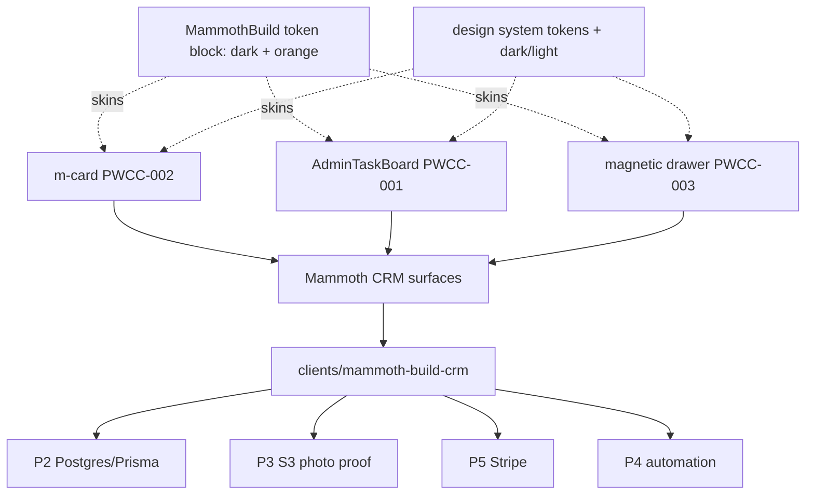

# Mammoth-Rebuild CRM — HubSpot replacement

## Summary

Replace HubSpot for Mammoth Metal Buildings with a purpose-built CRM **assembled from the shared,
brand-agnostic component library** specced in this batch — not bespoke one-offs. The CRM is the proof
that the library pays off: the same `m-card`, task board, magnetic drawer, and design tokens that
serve BBL also stand up a HubSpot-class CRM by **swapping a token block (MammothBuild dark + orange)
and a DTO slice**. Existing MVP: [`clients/mammoth-build-crm/`](../business/leads/project-mammoth-build-crm.md)
(Next.js 16, dark/orange, localStorage, SESSION_0425). This epic carries it from frontend MVP to a
component-driven, persistence-backed CRM.

> **The thesis:** a CRM is *records + lists + detail panels + tasks + pipeline* — which is exactly
> `m-card` (records/lists) + magnetic drawer (detail/explorer) + AdminTaskBoard (tasks/activities) +
> design system (chrome). Brand-agnostic by construction → Mammoth is just another token block.

## HubSpot object/surface → component map

| HubSpot piece | CRM surface | Built from | PWCC |
| --- | --- | --- | --- |
| Contacts / Companies | roster lists + cards | `m-card` `kind=roster` | PWCC-002 |
| Deals / Pipeline | pipeline board (Lead→Order) | AdminTaskBoard column model + `m-card` `kind=task` | PWCC-001 |
| Tasks / Activities | task/activity board | AdminTaskBoard (QF/HF, status taxonomy) | PWCC-001 |
| Record detail (contact/deal/project) | record drawer (peek/half/full) | three-level magnetic drawer hosting `m-card`s | PWCC-003 |
| Build proof (before/during/after photos) | project record + photo carousel | magnetic drawer (full = cinematic) + in-drawer carousel | PWCC-003 |
| Lists / search / filters | filterable card grid | `m-card` grid + existing list wrapper | PWCC-002 |
| Theme / chrome | dark + orange Mammoth skin | design system token block + dark/light | (design system) |

## Component-driven architecture (ASCII)

```text
            ┌──────────────────── Mammoth token block (dark + orange) ───────────────────┐
            │                         (brand = swap tokens only)                          │
            ▼                                                                              ▼
  ┌───────────────┐    ┌────────────────────┐    ┌───────────────────────┐    ┌────────────────────┐
  │  m-card        │    │  AdminTaskBoard     │    │  magnetic drawer       │    │  design system     │
  │  PWCC-002      │    │  PWCC-001           │    │  PWCC-003              │    │  tokens + dark/light│
  │  contacts ·    │    │  pipeline · tasks · │    │  record detail ·      │    │  + 1-2-3 step       │
  │  companies ·   │    │  activities (QF/HF) │    │  build-proof explorer │    │                    │
  │  deals (cards) │    │                     │    │  (hosts m-cards)      │    │                    │
  └───────┬────────┘    └─────────┬───────────┘    └───────────┬───────────┘    └─────────┬──────────┘
          └───────────────┬───────┴────────────────────────────┴───────────────────────────┘
                          ▼
              clients/mammoth-build-crm/  (Next.js app)
                  /app  pipeline · /app/project/[id] record+proof · contacts/companies lists
                          │
                  P2: Postgres + Prisma · P3: S3 photo proof · P5: Stripe · P4: automation
```

## Component-driven architecture (mermaid)



## PWCC port register (this batch)

The clean PWCC-NNN series for the design-system component batch (distinct from the SESSION_0337
`PORTMAP-NNNN` lineage epic). These ports are the CRM building blocks; Mammoth-specific bindings
extend the series.

| PWCC | Component | Spec | Lifecycle | CRM role |
| --- | --- | --- | --- | --- |
| PWCC-001 | AdminTaskBoard (Todoist model) | [spec](../product/black-belt-legacy/page-specs/bbl-admin-task-board.md) | PLANNED | pipeline + tasks/activities |
| PWCC-002 | m-card (roster/rank/task/loop) | [spec](../knowledge/wiki/files/m-card-pattern.md) | PLANNED | contact/company/deal cards + lists |
| PWCC-003 | three-level magnetic drawer | [spec](../knowledge/wiki/files/three-level-magnetic-drawer.md) | PLANNED | record detail + build-proof explorer |
| PWCC-007 | AdminKanban (reusable column board + intake + automations) | [spec](../knowledge/wiki/files/admin-kanban-board.md) | PLANNED | the CRM pipeline engine (any project) |
| PWCC-004 | Mammoth pipeline board binding | [bindings](../knowledge/wiki/files/mammoth-crm-bindings.md) | PLANNED | Lead→Order on **AdminKanban (PWCC-007)** + Flores intake |
| PWCC-005 | Mammoth record drawer binding | [bindings](../knowledge/wiki/files/mammoth-crm-bindings.md) | PLANNED | contact/deal/project drawer on PWCC-003 |
| PWCC-006 | Build-proof photo carousel | [bindings](../knowledge/wiki/files/mammoth-crm-bindings.md) | PLANNED | before/during/after in the full detent |

## Phased roadmap (aligns components to the existing P1–P6)

| Phase | Project-plan milestone | Component work |
| --- | --- | --- |
| P1 ✅ | Frontend MVP (SESSION_0425) | bespoke MVP — to be re-based on the library |
| P2 | Backend + persistence + auth | m-card mappers read Postgres DTOs; AdminTaskBoard sync endpoint |
| P3 | Photo proof (S3) | PWCC-006 build-proof carousel in the magnetic drawer full detent |
| P4 | Automation | task/activity rules feed AdminTaskBoard (at-risk = `broken`/HF lane) |
| P5 | Payments (Stripe) | deal cards (`m-card`) show order/deposit status badges |
| P6 | Marketing / site | design-system chrome + dark/orange polish |

## Re-base note (MVP → library)

The SESSION_0425 MVP (`clients/mammoth-build-crm/`) was built bespoke under time pressure. This epic
**does not throw it away** — it re-bases each surface onto the shared components as they land:
pipeline → AdminTaskBoard (PWCC-001), record detail → magnetic drawer (PWCC-003), cards → m-card
(PWCC-002). The Mammoth token block (dark + orange) becomes one entry in the design system, proving
brand-agnosticism with a non-BBL brand.

## Open decisions

1. Re-base order: pipeline-first (PWCC-001) or record-drawer-first (PWCC-003)?
2. Where does the shared library physically live for a *client* app — copy into `clients/`,
   a workspace package, or git submodule of baseline primitives? (Affects PWCC-004/5/6 paths.)
3. MammothBuild real brand hex (orange provisional) — needed to finalize the token block.
4. Carries forward §6 of the [project plan](../business/leads/project-mammoth-build-crm.md):
   go/no-go, hosting/stack, paid-engagement scope.

## Provenance

Epic opened SESSION_0428 per Brian's "integrate this into Mammoth-Rebuild CRM HubSpot replacement
epic" — folding the design-system component batch (PWCC-001/002/003 + design system) into the
existing [Mammoth Build CRM](../business/leads/project-mammoth-build-crm.md) (SESSION_0425, Sunday
2026-06-21 review). The CRM is the cross-brand proof of the brand-agnostic library.
