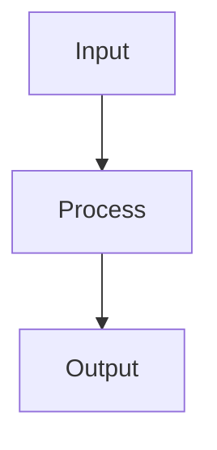

# TITLE

## Summary

What this file is and why it exists.

## Intent

The problem this file solves. Why it was created.

## Architecture

Or use bullets for simpler flows.

## Key exports / models

- `exportName` — what it does
- `ModelName` — what it represents

## Wiring

| Direction | File | What |
| --- | --- | --- |
| imports | `path/to/dep` | description |
| imported by | `path/to/consumer` | description |

## Health

- Compiles: yes/no
- Tested: yes/no
- Known bugs: none / list
- Score: X/10

## Teachable explanation

Explain this file as if the next developer or agent is seeing it for the first time.
