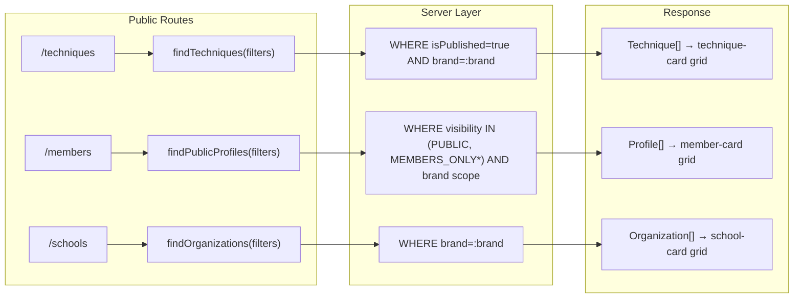
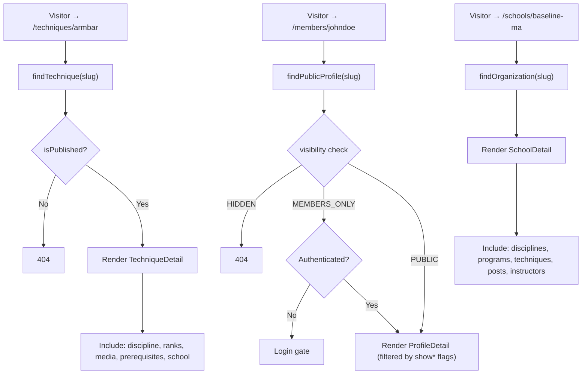
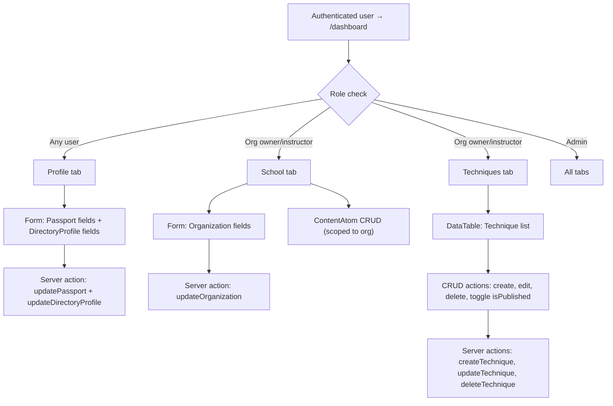

# Listing Pattern Repurposing — Tool → Technique / Profile / School

## Summary

This document explains how the Dirstarter `Tool` directory listing pattern is repurposed into three Ronin Dojo domain listing types: **Technique**, **Public Profile**, and **School**. It covers data flow, privacy model, authorization, component mapping, wireframes, and implementation tasks.

Governing decision: [ADR 0013](../../../architecture/decisions/0013-tool-listing-repurposing.md).
Planning session: [SESSION_0066](../../../sprints/SESSION_0066.md).

---

## 1. The Dirstarter Tool Pattern (L1 Baseline)

Dirstarter is a "tool directory" template. Its core listing pattern provides:

| Layer | Files | What it does |
| --- | --- | --- |
| Data | `prisma/schema.prisma` → `Tool` model | Name, slug, description, content, status, categories, tags, owner |
| Server | `server/web/tools/queries.ts` | `findTool()`, `findTools()`, `findToolSlugs()` |
| Route (public) | `app/(web)/[slug]/page.tsx` | Detail page with structured data, SEO, breadcrumbs |
| Route (list) | `app/(web)/(home)/page.tsx` | Homepage tool listing with query/filter |
| Route (dashboard) | `app/(web)/dashboard/` | Owner's listing management with DataTable |
| Route (submit) | `app/(web)/submit/` | Submit new tool listing |
| Components | `components/web/tools/` | `tool-card`, `tool-list`, `tool-listing`, `tool-query`, `tool-search`, `tool-filters`, `tool-actions`, `tool-button`, `tool-hover-card`, `tool-entry` |
| Components | `components/web/listings/` | `featured-tools`, `featured-tools-icons`, `related-tools` |

This pattern handles: slug-based routing, static generation, SEO metadata, structured data, card grid layout, search/filter, pagination, dashboard CRUD, and owner authorization.

---

## 2. Three Ronin Dojo Listing Types

### 2a. Technique Listing

**Data source:** `Technique` model + `Discipline`, `Rank`, `MediaAttachment`, `TechniquePrerequisite`, `TechniqueProgress`

**Routes:**

- `/techniques` — public listing (filterable by discipline, position, category, difficulty, belt range)
- `/techniques/[slug]` — technique detail page
- `/dashboard/techniques` — owner/instructor CRUD via DataTable

**Visibility:** `Technique.isPublished` (boolean). Unpublished = draft, only visible to org owner/instructors.

**Key fields rendered:** name, description, discipline badge, rank range badges, position, category, difficulty dots, teaching cues, common errors, safety notes, media gallery, prerequisite chain, school attribution.

### 2b. Public User Profile

**Data source:** `Passport` + `DirectoryProfile` + `RankAward[]` + `Membership[]` + `TechniqueProgress[]`

**Routes:**

- `/members` — member directory (filterable by location, discipline, rank)
- `/members/[slug]` — public profile page
- `/dashboard/profile` — edit own Passport + DirectoryProfile

**Visibility:** Three-tier via `DirectoryProfile.visibility`:

| Value | Meaning |
| --- | --- |
| `HIDDEN` | Not in directory, not searchable |
| `MEMBERS_ONLY` | Visible to authenticated users only |
| `PUBLIC` | Visible to everyone |

Per-field toggles (`showEmail`, `showPhone`, `showOrgs`, `showRanks`) filter what appears on the public profile. These are enforced at the **server query layer**, not the component.

### 2c. School/Organization Page

**Data source:** `Organization` + `OrganizationDiscipline[]` + `Program[]` + `Technique[]` (published) + `ContentAtom[]` (published) + `Membership[]` (for instructors)

**Routes:**

- `/schools` — school directory (filterable by type, discipline, location)
- `/schools/[slug]` — school detail page
- `/dashboard/school` — org owner management (edit details, manage content)

**Visibility:** Organizations are always public. Content posts follow the `ContentAtom.status` workflow. Membership roster is members-only (future).

---

## 3. Data Flow Diagrams

### 3a. Public Listing Flow



*`MEMBERS_ONLY` requires authenticated session check.

### 3b. Detail Page Flow



### 3c. Dashboard Management Flow



---

## 4. Privacy & Authorization

### 4a. Privacy Control Flow

```
User edits DirectoryProfile
         │
         ▼
┌─────────────────────────┐
│ visibility = ?          │
├─────────────────────────┤
│ HIDDEN      → excluded  │
│             from all    │
│             queries     │
│                         │
│ MEMBERS_ONLY → included │
│             only when   │
│             session     │
│             exists      │
│                         │
│ PUBLIC      → included  │
│             always      │
└─────────────────────────┘
         │
         ▼ (if not HIDDEN)
┌─────────────────────────┐
│ Per-field filters:      │
│ showEmail  → email      │
│ showPhone  → phone      │
│ showOrgs   → memberships│
│ showRanks  → rank awards│
└─────────────────────────┘
         │
         ▼
  Server query returns
  only permitted fields
```

**Critical rule:** Privacy filtering happens in the **server query**, not the component. The component renders whatever the query returns. This prevents accidental data leakage from client-side filtering bugs.

### 4b. Authorization Matrix

| Action | Self | Org Owner | Instructor | Admin |
| --- | --- | --- | --- | --- |
| Edit own Passport | ✅ | — | — | ✅ |
| Edit own DirectoryProfile | ✅ | — | — | ✅ |
| Edit Organization details | — | ✅ | — | ✅ |
| CRUD Techniques (own org) | — | ✅ | ✅ | ✅ |
| Publish Technique | — | ✅ | ✅ | ✅ |
| Create/edit content posts | — | ✅ | ✅ | ✅ |
| View membership roster | — | ✅ | ✅ | ✅ |
| Edit other user's profile | — | — | — | ✅ |

---

## 5. Component Mapping (L1 Compliance)

| Dirstarter Tool Component | Technique | Profile | School |
| --- | --- | --- | --- |
| `tool-card.tsx` | `technique-card.tsx` | `member-card.tsx` | `school-card.tsx` |
| `tool-list.tsx` | `technique-list.tsx` | `member-list.tsx` | `school-list.tsx` |
| `tool-query.tsx` | `technique-query.tsx` | `member-query.tsx` | `school-query.tsx` |
| `tool-filters.tsx` | `technique-filters.tsx` | `member-filters.tsx` | `school-filters.tsx` |
| `tool-search.tsx` | (shared `Search`) | (shared `Search`) | (shared `Search`) |
| `tool-actions.tsx` | — (dashboard only) | — | — |
| `related-tools.tsx` | `related-techniques.tsx` | — | — |

All new components use exclusively L1 primitives from the component inventory:

- `Card`, `CardHeader`, `CardDescription` — card layout
- `Badge` — discipline, rank, type tags
- `Avatar` — profile pictures
- `Grid` — card grids
- `Stack` — vertical stacking
- `H3`, `H4` — section headings (NEVER raw `<h3>`)
- `Intro`, `IntroTitle`, `IntroDescription` — page intros
- `Button` — actions
- `Search` — search inputs
- `Form` system — all dashboard forms
- `Switch` — privacy toggles
- `DataTable` system — dashboard listing management
- `Dialog` — confirmations

---

## 6. Route Structure

```
app/(web)/
├── techniques/
│   ├── page.tsx              # Technique directory listing
│   └── [slug]/
│       └── page.tsx          # Technique detail
├── members/
│   ├── page.tsx              # Member directory listing
│   └── [slug]/
│       └── page.tsx          # Public profile detail
├── schools/
│   ├── page.tsx              # School directory listing
│   └── [slug]/
│       └── page.tsx          # School detail
└── dashboard/
    ├── page.tsx              # Dashboard home (existing, add tabs)
    ├── profile/
    │   └── page.tsx          # Edit Passport + DirectoryProfile
    ├── school/
    │   └── page.tsx          # Edit Organization + content
    └── techniques/
        ├── page.tsx          # Technique DataTable
        └── [id]/
            └── page.tsx      # Edit technique form
```

---

## 7. Server Query Design

### Technique queries (`server/web/techniques/queries.ts`)

```typescript
// Pattern follows server/web/tools/queries.ts
findTechnique(where: { slug, brand, organizationId? })
findTechniques(params: TableParams, where?: Prisma.TechniqueWhereInput)
findTechniqueSlugs(where: { brand })
```

### Profile queries (`server/web/profiles/queries.ts`)

```typescript
findPublicProfile(where: { slug, brand? })
findPublicProfiles(params: TableParams, where?: { visibility, brand })
// Privacy: SELECT only show*-permitted fields
```

### Organization queries (`server/web/schools/queries.ts`)

```typescript
findOrganization(where: { slug, brand })
findOrganizations(params: TableParams, where?: { brand, type? })
```

---

## 8. Schema Migrations Needed

| Migration | Model | Change | Why |
| --- | --- | --- | --- |
| Add profile slug | `DirectoryProfile` | Add `slug String? @unique` | Needed for `/members/[slug]` routing |
| Org slug uniqueness | `Organization` | Add `@@unique([brand, slug])` | Prevent cross-brand slug collisions |
| Content org scope | `ContentAtom` | Add `organizationId String?` + relation | Scope content posts to a school |

All three are additive (no data loss risk). Can be done in a single Prisma migration.

---

## 9. Implementation Tasks (Cody Assignments)

Full task breakdown in [SESSION_0066](../../../sprints/SESSION_0066.md) § Task Decomposition.

**Execution order:**

1. **SESSION_0067** — Schema migrations + server queries + public listing routes
2. **SESSION_0068** — Dashboard tabs (profile, school, techniques)
3. **SESSION_0069** — Card components, filter components, i18n keys

---

## 10. Open Decisions

| # | Question | Options | Recommendation |
| --- | --- | --- | --- |
| 1 | Profile slug source | (a) Add `slug` to DirectoryProfile, (b) Use `User.id`, (c) Derive from displayName | (a) — **accepted** |
| 2 | ContentAtom org scope | (a) Add `organizationId` to ContentAtom, (b) Join table | (a) — **accepted** |
| 3 | Dashboard tab nav | (a) URL-based tabs (`/dashboard/profile`, `/dashboard/school`), (b) Client-side tabs | (b) — **accepted** — better mobile/app feel |

---

## Cross-references

- [ADR 0013 — Tool→Listing Pattern Repurposing](../../../architecture/decisions/0013-tool-listing-repurposing.md)
- [SESSION 0066](../../../sprints/SESSION_0066.md) — planning session
- [Dirstarter Component Inventory](../dirstarter-component-inventory.md) — L1 component pre-flight
- [Dirstarter Docs Inventory](../dirstarter-docs-inventory.md) — L1 docs reference
- [ADR 0004 — Multi-brand as column](../../../architecture/decisions/0004-multi-brand-as-column.md) — brand scoping
