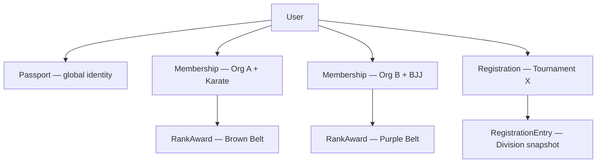

# Passport and Shells

## Summary

The Ronin Dojo platform is built on a single global identity (Passport) and multiple context-specific identities (Shells). This prevents rank, organization status, and tournament history from leaking across contexts.

## Key Idea

One person → many contexts. Identity is global; roles are contextual.

## Structure

- **Passport** = global identity (name, DOB, avatar, emergency contact)
- **Shells** = context-specific identities:
  - **Membership** = User × Organization × Discipline (owns status, roles, rank reference)
  - **Registration** = User × Tournament (owns division entries with immutable snapshots)
- **DirectoryProfile** = presentation/privacy layer (separate from Passport)

## Why it matters

Without shells, systems mix identity and context:

- rank becomes global when it is contextual
- organization identity leaks across contexts
- tournament history becomes mutable

The shell pattern ensures that a user's brown belt in Karate at Org A doesn't interfere with their purple belt in BJJ at Org B, and that tournament records are frozen at time of registration.

## Relationships

- [Passport](../../architecture/ubiquitous-language.md#passport) → User (1:1)
- [Membership](../../architecture/ubiquitous-language.md#membership) → User × Organization × Discipline
- [Registration](../../architecture/ubiquitous-language.md#registration) → User × Tournament
- [RegistrationEntry](../../architecture/ubiquitous-language.md#registrationentry) → Division snapshot (immutable)
- [RankAward](../../architecture/ubiquitous-language.md#rankaward) → User × Rank (promotion record)

## Sources

- SESSION_0002 — schema design discussions
- SESSION_0003 — Q1–Q8 sign-off, shell pattern confirmed
- [s1-schema-design.md](../../architecture/s1-schema-design.md) — full model definitions

## Open Questions

- Should RankAward always attach to Membership? (Currently RankAward links to User + Rank; Membership links to User + Org + Discipline + Rank. The connection is indirect via the user.) *Flagged 2026-04-26*
