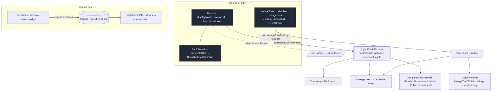

# `files/` — annotated code-file & data-wiring spec catalog

The per-file / per-flow knowledge layer. Each page documents one code file, component, or
**data-wiring flow** with a machine-readable `wiring:` frontmatter list plus skimmable
**ASCII + mermaid** charts. New flows are authored from
[`_template/SPEC_TEMPLATE.md`](_template/SPEC_TEMPLATE.md) and cataloged below.

> **Why both ASCII and mermaid:** ASCII reads in any terminal/diff/PR; mermaid renders as a
> graphic on GitHub. Keep both. A rendered PNG export (à la
> [`content-engine/iggy-video-workflow.png`](../content-engine/iggy-video-workflow.png)) can be
> dropped beside a spec when a richer graphic is wanted — the mermaid below is the source of truth.

## System overview — BBL public data wiring

How public identity + lineage data reaches every read surface. **Passport is the identity
source of truth (ADR 0025);** the canonical projection is the single redaction gate.



```text
Passport (SoT) ──publicPassportPayload──> projectPublicPassport ──> Directory · Lineage · Galaxy · Disciplines · Family · Promotions · Tournaments
LineageTree ──getLineageTreeBySlug(PUBLIC)──> materialize+redact ──> Lineage drawer · Galaxy graph (verified-only)
Feedback widget ──reportFeedback──> Report(type=Feedback) ──> notifyAdminOfFeedback → operator inbox
owner/admin ──bypass gate──> /me · Admin (unredacted)
```

## Flow specs (data-wiring)

| Spec | Flow | Lifecycle |
| --- | --- | --- |
| [public-passport-dto](public-passport-dto.md) | Passport → `projectPublicPassport` → all public surfaces (one redaction gate) | WIP — #134 / #135 |
| [bbl-galaxy-data-flow](../../../product/black-belt-legacy/page-specs/bbl-galaxy-data-flow.md) | published lineage → galaxy graph → R3F viewer + real drawer | WIP — #133 |
| [feature-request-dialog](feature-request-dialog.md) | feedback/feature widget → `Report(Feedback)` → operator notify | MVP_LIVE |

## Component / page / query specs

| Area | Pages |
| --- | --- |
| Identity / Passport | [bbl-current-user-avatar](../../../product/black-belt-legacy/page-specs/bbl-current-user-avatar.md) · [bbl-type-system](../../../product/black-belt-legacy/page-specs/bbl-type-system.md) |
| Directory | [directory-page](directory-page.md) · [directory-queries](directory-queries.md) · [directory-schema](directory-schema.md) · [directory-list-component](directory-list-component.md) · [directory-listing-component](directory-listing-component.md) · [directory-query-component](directory-query-component.md) |
| Disciplines | [discipline-detail-page](discipline-detail-page.md) · [discipline-queries](discipline-queries.md) |
| Schools / Orgs | [schools-detail-page](schools-detail-page.md) · [schools-queries](schools-queries.md) · [organizations-list-page](organizations-list-page.md) · [organization-detail-page](organization-detail-page.md) · [organization-new-page](organization-new-page.md) · [create-organization-form](create-organization-form.md) · [join-organization-button](join-organization-button.md) |
| Courses | [courses-listing-page](courses-listing-page.md) |
| BBL surfaces | [bbl-home-landing](../../../product/black-belt-legacy/page-specs/bbl-home-landing.md) · [bbl-join-landing-composition](../../../product/black-belt-legacy/page-specs/bbl-join-landing-composition.md) · [bbl-join-form-wizard](../../../product/black-belt-legacy/page-specs/bbl-join-form-wizard.md) · [bbl-nav-sheet](../../../product/black-belt-legacy/page-specs/bbl-nav-sheet.md) · [bbl-footer](../../../product/black-belt-legacy/page-specs/bbl-footer.md) |
| Data / baseline | [schema-prisma](schema-prisma.md) · [seed-ts](seed-ts.md) · [dirstarter-l1-baseline](dirstarter-l1-baseline.md) |

## Add a new spec

```bash
cp docs/knowledge/wiki/files/_template/SPEC_TEMPLATE.md docs/knowledge/wiki/files/<slug>.md
```

Fill the frontmatter `wiring:` list (the surface map), keep an ASCII **and** a mermaid chart,
add a row above, and link it from the relevant [SOP](../../../runbooks/sops/) or
[domain hub](../../../runbooks/domain-features/). Run `bun run wiki:lint` before committing.
