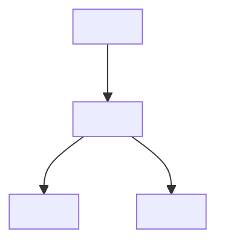

<!--
_TEMPLATE — spec/flow file for docs/knowledge/wiki/files/. Copy, fill every <placeholder>,
delete this comment. Keep it LIGHTWEIGHT: the value is the wiring map + the charts, not prose.

How to use:
1. cp docs/knowledge/wiki/files/_template/SPEC_TEMPLATE.md docs/knowledge/wiki/files/<slug>.md
2. Fill frontmatter (the `wiring:` list is the machine-readable surface map — keep it accurate).
3. Keep BOTH an ASCII chart (skim in any terminal/diff) AND a mermaid chart (renders on GitHub).
4. Catalog it: add a row to docs/epics/post-launch-clean-repo-001.md and link from the
   relevant SOP / domain hub.
-->

# <Title>

## Summary

<2–4 sentences: what this file/feature is, why it exists, and the one rule that matters most.>

## Data wiring flow (ASCII)

```text
<low-fi box/arrow flow — source → projection → consumers. Mirror the
docs/runbooks/sops/lineage-data-wiring-flow.md style.>
```

## Data wiring flow (mermaid)



## Logic / decision chart

```mermaid
flowchart TD
  IN[<input>] -->|<condition>| Y[<branch>]
  IN -->|<else>| N[<branch>]
```



## Where it lives (field / surface map)

| Field or surface | Source | Notes / redaction |
| --- | --- | --- |
| `<field>` | `<model.field>` | <public-safe? gate?> |

## Security / redaction gates

- <visibility scope, per-field flags, owner/admin bypass — the boundaries that must hold.>

## Provenance

<Session / PR / ADR that created or changed this. Keep to 1–3 lines.>
