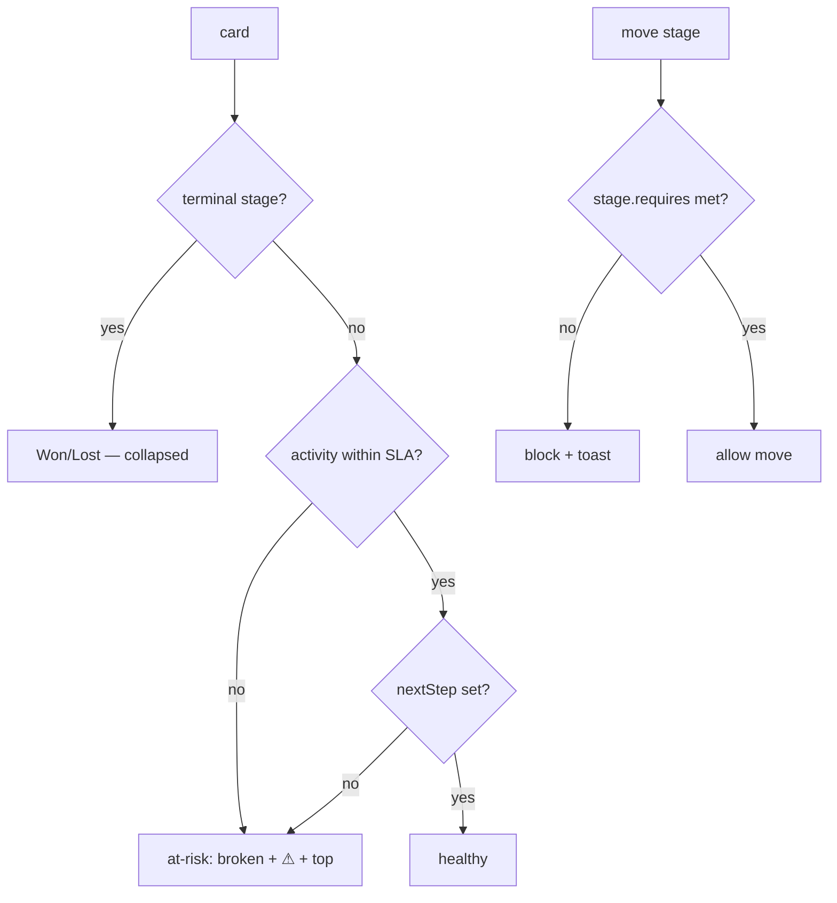
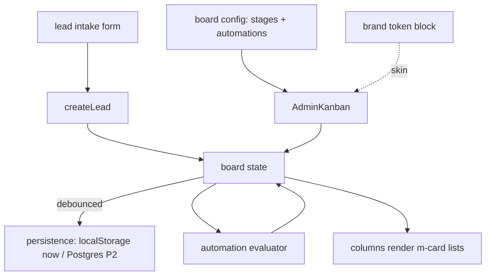

<!-- LIGHTWEIGHT spec. Light · simple · effective. Value = the reusable column contract + intake +
     automation rules + the Desi pass + the Cody build-loop prompt. Reusable for ANY project. -->

# AdminKanban — PWCC-007

## Summary

A **light, simple, reusable** column/stage Kanban board for project management & CRM pipelines —
the column sibling of the Todoist-style [AdminTaskBoard](bbl-admin-task-board.md) (PWCC-001). Cards are
[`m-card`s](m-card-pattern.md) (PWCC-002); columns are **config-driven stages**, so the same board is
a sales pipeline, a project tracker, or a content calendar by swapping a stage config. Adds two CRM
essentials: **lead intake** (form → card in column 1) and **follow-up automations** (rotting/at-risk
detection, next-step reminders, stage SLAs). **One rule:** the board is config + data — zero
per-project code; brand = token swap (design system). First consumer: Mammoth CRM for Michael Flores
([PWCC-004](mammoth-crm-bindings.md)).

## Low-fi wireframe — board (desktop, dark)

```text
┌──────────────────────────────────────────────────────────────────────────────┐
│  ◐  PROJECT · Pipeline            [ + New lead ]      🔍   ⚙ stages   ◱ board │
├───────────────┬───────────────┬───────────────┬───────────────┬──────────────┤
│ NEW LEAD   4  │ CONTACTED  3  │ QUOTED     2  │ ORDER ✓    5  │ WON / LOST   │
│ ───────────   │ ───────────   │ ───────────   │ ───────────   │ ───────────  │
│ ◍ Flores job  │ ◍ Acme barn   │ ◍ Smith shed  │ ◍ #1042 Doe   │ ◍ Won  $42k  │
│   ● new  HF   │   ● 2d  ⚠at-risk│  ● quote sent│   ● deposit ✓ │   ◍ Lost (px)│
│ ◍ Web inquiry │ ◍ Ridge co.   │               │ ◍ #1043 Lee   │              │
│   ● new       │   ● follow-up │               │   ● milestone │              │
│ [ + quick add]│ [ + ]         │ [ + ]         │ [ + ]         │              │
└───────────────┴───────────────┴───────────────┴───────────────┴──────────────┘
   columns = stage config        cards = m-card(kind=task|deal)      ⚠ = automation flag
   mobile (390px): columns become horizontal scroll-snap; one column ≈ 86vw
```

## Reusable config (light)

```jsonc
// board config — the ONLY thing that changes per project
{ "id": "mammoth-pipeline",
  "title": "Mammoth · Pipeline",
  "brand": "mammoth",                 // token block (design system) — never hex
  "cardKind": "task",                 // m-card kind
  "stages": [
    { "id": "new",       "name": "New Lead",  "intake": true },   // intake drops here
    { "id": "contacted", "name": "Contacted", "sla": 2 },          // SLA days → at-risk
    { "id": "quoted",    "name": "Quoted",    "sla": 5 },
    { "id": "order",     "name": "Order",     "requires": "orderConfirmed" },
    { "id": "closed",    "name": "Won / Lost","terminal": true, "reasonOnLost": true }
  ],
  "automations": ["rotting", "next-step-reminder", "stage-sla"] }
```

```jsonc
// card (reuses AdminTaskBoard task shape + CRM fields, omit empty)
{ "id": "c_1a2b", "stage": "new", "title": "Flores metal building",
  "lane": "HF", "status": "active", "owner": "michael",
  "due": "2026-06-25", "nextStep": "Send quote", "value": 42000,
  "contact": { "name": "Michael Flores", "phone": "…", "email": "…" },
  "createdAt": "2026-06-21T08:16:00Z" }
```

## Lead intake flow

```text
 inquiry source (web form · manual · email)        Michael Flores intake brief:
        │                                            docs/business/leads/mammoth-build-michael-flores.md
        ▼
 ┌─────────────┐  validate + dedupe   ┌──────────────┐  card in stage[0]   ┌───────────────┐
 │ intake form │ ───────────────────▶ │ createLead() │ ──────────────────▶ │ NEW LEAD col  │
 │ (m-card new)│                      │ stamp source │                     │ (m-card kind) │
 └─────────────┘                      └──────┬───────┘                     └───────────────┘
                                             │ no next-step set?
                                             ▼ → automation flags at-risk immediately
```

- Intake = one short form (name, contact, source, note) → `createLead()` → card in the `intake:true`
  stage. Dedupe by phone/email. Source stamped for reporting.

## Follow-up automations (lightweight rules)

| Rule | Trigger | Effect |
| --- | --- | --- |
| `rotting` | card in non-terminal stage with no activity > stage `sla` days | flag `at-risk` (→ `broken` lifecycle, accent ⚠), bump to top |
| `next-step-reminder` | open card with empty `nextStep` | flag at-risk; reminder to owner |
| `stage-sla` | card exceeds stage SLA | reminder + escalate (HF lane) |
| `order-guard` | move to a `requires` stage without that field | block move + toast (e.g. `orderConfirmed`) |
| `lost-reason` | move to terminal as Lost | require a reason |

Engine is a small pure evaluator over the card list (client now; cron/job-queue in CRM P4). No
heavyweight workflow builder — just these rules, config-toggled per board.

## Logic / decision chart



## Data wiring flow (mermaid)



## Desi pass — branding consistency · UI/UX · ease of use

**Branding consistency**

- One token set (design system): accent from the brand block (BBL `#E52421`, Mammoth orange), **never
  gold** `#d7a74c`; Poppins/Inter; 4px spacing scale; `rounded-xl` cards; dark/light inherited.
- Cards = `m-card` only — identical card language across pipeline, tasks, roster (no bespoke card).
- Column header = the eyebrow treatment (11px, tracked, uppercase, muted) + count chip; accent rail
  on at-risk cards only (restraint — color = meaning).

**UI/UX optimization**

- Mobile 390px: columns become **horizontal scroll-snap** (one ≈86vw), sticky column headers; the
  "+ New lead" stays a thumb-reachable MAB (bottom nav pattern). FAB never covers a card CTA.
- Drag affordance: grab cursor + lift shadow on drag; drop zones highlight; blocked moves shake +
  toast (order-guard). Keyboard: move card with menu (no drag required) for a11y.
- Empty column = friendly `EmptyState` ("No leads yet — add one"), not a blank void.
- At-risk is the only loud signal; everything else calm — the board reads at a glance.

**Ease of use**

- Quick-add inline at each column foot (title only → enter); full fields in the record drawer
  (PWCC-005). Inline rename. One-click stage move via card menu. Minimal chrome, max signal.
- Counts + at-risk totals in headers = instant status. "Light, simple, effective."

## Where it lives (surface map)

| Surface | Path | Action |
| --- | --- | --- |
| board | `apps/web/components/web/kanban/admin-kanban.tsx` (lib) or client mirror | new; config-driven columns |
| cards | `m-card` (PWCC-002) | reuse |
| task model/status | AdminTaskBoard (PWCC-001) | reuse taxonomy (active/inactive/deprecated/broken + QF/HF) |
| intake | `createLead()` + intake form (`m-card` new) | new |
| automations | pure evaluator `lib/kanban/automations.ts` | new; cron in CRM P4 |
| tokens | design system block per brand | reuse |
| first consumer | `clients/mammoth-build-crm/app/page.tsx` (PWCC-004 binds this) | bind |

## Security / redaction gates

- Admin/owner-internal; capability-gated. Presentation cards are `m-card`s (redaction upstream).
  Intake validates + dedupes server-side before persisting. No public surface.

## PWCC port spec + cloud handoff

```text
 DISCOVERY ✓        →  OBSERVED PRODUCT TRUTH ✓  →  PORT SPEC (this doc) →  REPO MEMORY CHECK ✓
 TaskBoard.jsx +       3-col kanban + AdminTask      config columns +        m-card + task model +
 Mammoth pipeline      taxonomy + Mammoth automation  intake + automations    design system exist
        └──────────────────────────────┬───────────────────────────────────────────┘
                                        v
                          IMPLEMENT SMALLEST SLICE  →  PROOF  →  PROOF GATE
                          (config columns + m-card    Vitest +  green → bind Mammoth (PWCC-004)
                           + drag + quick-add)         Playwright
```

### Cody build loop prompt (reusable for ANY project)

```text
Build AdminKanban (PWCC-007) per docs/knowledge/wiki/files/admin-kanban-board.md.

REUSABLE: the board is driven ENTIRELY by a board-config JSON (stages + automations + brand +
cardKind). No project-specific code in the component. To target a new project, you only write its
config + token block.

Read: this spec, m-card (PWCC-002), AdminTaskBoard (PWCC-001) for the shared task model/status
taxonomy, and component-design-system (tokens, dark/light, Desi pass).

Cody build loop (repeat until proof-gate green):
1. BUILD smallest slice: render config stages as columns; cards = m-card(kind=config.cardKind);
   drag between columns; quick-add at column foot. Theme via the brand token block (no hex).
2. ADD intake: createLead(form) → card in the intake stage; dedupe by phone/email; stamp source.
3. ADD automations: pure evaluator (rotting/next-step/stage-sla/order-guard/lost-reason),
   config-toggled; at-risk → broken lifecycle + HF lane + ⚠ rail.
4. DESI PASS each slice: 4px scale, rounded-xl, accent-only-on-meaning, 390px horizontal scroll-snap
   columns, EmptyState per column, keyboard move + a11y, calm chrome.
5. TEST: Vitest (stage move rules, requires/guard, automation flags, intake dedupe) +
   Playwright (390px + desktop, drag, blocked-move toast, dark/light, brand swap).
6. If a gate fails → diagnose, fix, re-run (loop). Green → open draft PR + register in the
   design-system library + custom-component-inventory.

Hard stops: presentation-only cards (redaction upstream); no heavyweight workflow engine — just the
listed rules; no Prisma unless the consuming project is past P2.

First binding to ship after green: Mammoth pipeline (PWCC-004) — Michael Flores intake, Lead→Order
stages, dark/orange token block.
```

## Provenance

Spec authored SESSION_0428 (PWCC-007; Petey plan / Desi branding+UX pass / reusable Cody build-loop
prompt) per Brian's "light simple effective AdminKanban for CRM + lead intake + follow-up automations
for Michael Flores, reusable for any project." Generalizes the Mammoth pipeline
([PWCC-004](mammoth-crm-bindings.md)) into a config-driven library board; reuses
[m-card](m-card-pattern.md) + [AdminTaskBoard](bbl-admin-task-board.md) taxonomy + the
[design system](../component-design-system.md). Grounded in TuffBuffs `TaskBoard.jsx` + the Mammoth
intake brief.
