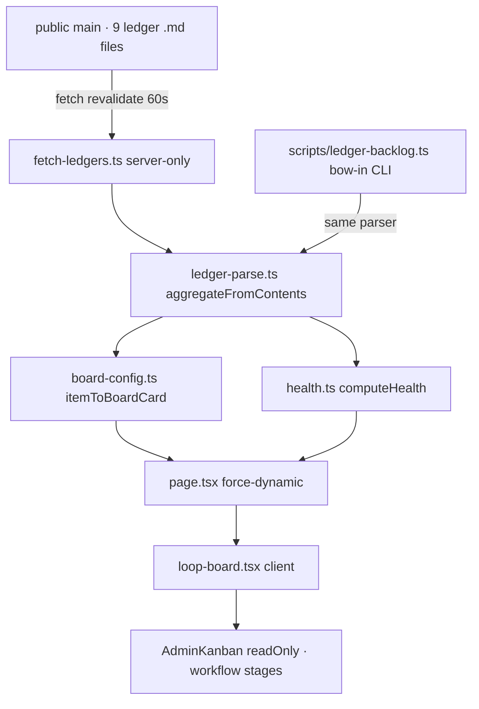
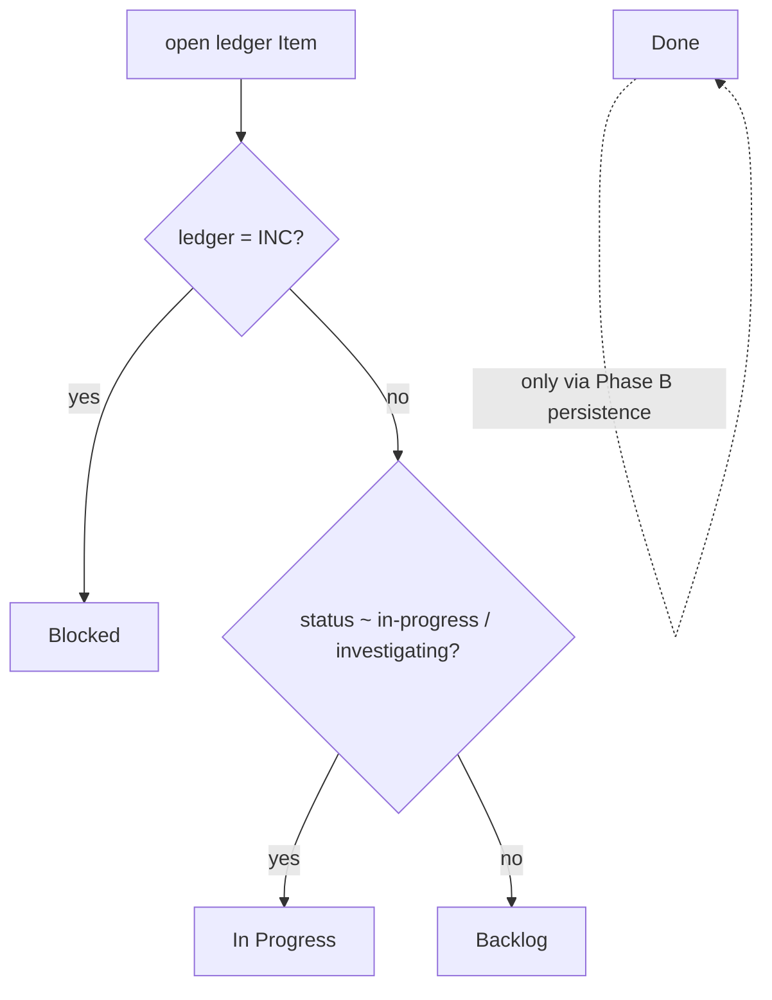

# Loop Board — `/app/loop-board`

## Summary

A **shared, admin-gated, mobile-first** board that gives Brian + Tony Hua near-realtime visibility
into the open governance backlog. It **projects** the 9 governance ledgers (FS · D · WL · FI · MB ·
TFF · INC · RISK · TD) — read **live from the public `main` branch** at request time — onto the
shared `AdminKanban` kernel (PWCC-007) as cards on a workflow axis. This is the
Loop-of-Loops **P3** target ([loop-of-loops-ledger-driven-sessions](../../../protocols/loop-of-loops-ledger-driven-sessions.md)).
**Phase B (SESSION_0461) makes it editable + DB-backed.** A `KanbanCard` model on BBL's own DB
(ADR 0038 Phase 1) is now the **single source of truth**; the live-ledger projection is demoted to a
**one-way, insert-only importer** that auto-adds new backlog items on each load but never overwrites an
edit (drag/add/done persist). The Todoist `AdminTaskBoard` is **retired** — `/admin/task-board` redirects
here, and the operator's per-browser localStorage tasks migrate into `KanbanCard` once (one board, one
engine). See learning record [0004](../../../learning/ddd/learning-records/0004-projection-to-stored-table-without-drift.md)
for the anti-drift discipline (insert-only importer + upsert-only save). The health strip still reads the
live `main` ledgers (one fetch, reused) so the backlog totals never go stale.

## Low-fi wireframe — mobile carousel (390px)

```text
┌─────────────────────────────────────┐
│ 47 open · P0 2 · P1 11 · P2 20 …     │  ← health strip (counts by priority + ledger)
│ Live from …@main · ~60s · editable   │
│ LOOP OF LOOPS · LEDGER BACKLOG  47   │
│ [Backlog 45][In Progress 2][Block… ‹ ›]│ ← tappable column pager + prev/next arrows
│ ┌─ BACKLOG ────────────────────45─┐▏ │  ← snap-mandatory rail; next column peeks (▏)
│ │ ◻ No global security headers     │▏ │
│ │   [RISK #2] [P0]                 │▏ │  ← m-card; badges = ledger id + priority
│ │ ◻ Lifecycle-email copy audit     │▏ │
│ │   [FI-002] [P1]                  │▏ │
│ └──────────────────────────────────┘▏ │
└─────────────────────────────────────┘
  swipe ↔ or tap a pager chip / arrow to move columns; desktop shows all 4 side-by-side
```

## Data wiring flow (ASCII)

```text
 public main (raw.githubusercontent)         request time, revalidate ~60s
   docs/**/<9 ledgers>.md
        │ fetch (graceful per-file failure)
        ▼
 ┌───────────────────┐   aggregateFromContents   ┌──────────────────┐
 │ fetch-ledgers.ts  │ ────────────────────────▶ │ ledger-parse.ts  │  open Item[] (ranked)
 │ (server-only)     │                           │ (pure, shared w/ │
 └─────────┬─────────┘                           │  the bow-in CLI) │
           │                                      └────────┬─────────┘
           │ itemToBoardCard / computeHealth               │
           ▼                                               ▼
 ┌───────────────────┐                          health strip (by priority + ledger)
 │ page.tsx (server) │ ── BoardCard[] + health ─▶ loop-board.tsx (client)
 └───────────────────┘                                     │
                                                            ▼
                                          <AdminKanban readOnly> (PWCC-007 kernel)
                                          columns = Backlog · In Progress · Blocked · Done
```

## Data wiring flow (mermaid)



## Logic / decision chart — stage for an open item



## Where it lives (field / surface map)

| Field or surface | Source | Notes / redaction |
| --- | --- | --- |
| card title | `Item.summary` | already-clean one-liner (md stripped) — public-safe governance text |
| ledger badge | `Item.ledger` + `Item.id` | e.g. `WL-P2-21`, `RISK #2`, `INC`; toned (RISK warning / INC critical) |
| priority badge | `Item.priority` | P0 critical · P1 warning · P2 neutral · `—` omitted |
| stage / column | derived from `Item.ledger` + `Item.status` | INC→Blocked · in-progress→In Progress · else Backlog |
| health strip | `computeHealth(items)` | totals by priority + ledger |
| route gate | `requirePermission(APP_AREA_PERMISSIONS.loopBoard)` | `loop-board.manage`; `admin:["*"]` passes (Brian + Tony) |

## Security / redaction gates

- **Admin-only** operator surface — gated at `layout.tsx` by `loop-board.manage`; never a public DTO.
- The board reads only **already-public governance markdown** from the public repo; no private data,
  no secrets, no per-user state. A failed ledger fetch contributes 0 items (logged), never an error page.
- **Editable (Phase B)** but every mutation is gated: both the route `layout.tsx` and each `board-store`
  server action re-assert `loop-board.manage` (defense-in-depth), so a direct action POST from an
  unauthorized caller is blocked. The board persists only the task slice — no contact PII surface.

## Provenance

SESSION_0458 (Loop-of-Loops P3, Phase A). Petey-grilled forks: realtime-from-`main` (repo is public →
free + never stale) over deploy-time fs; `readOnly` projection over a bespoke renderer; workflow-stage
columns over ledger columns; generic mobile carousel added to the kernel. Phase B (editable DB overlay +
`AdminTaskBoard` consolidation) deferred to the DB-separation lane (lands on BBL's own DB). Reuses the
PWCC-007 [AdminKanban](admin-kanban-board.md) kernel + the m-card; AdminTaskForge is already absorbed
(see [bbl-admin-task-board](../../../product/black-belt-legacy/page-specs/bbl-admin-task-board.md)).
