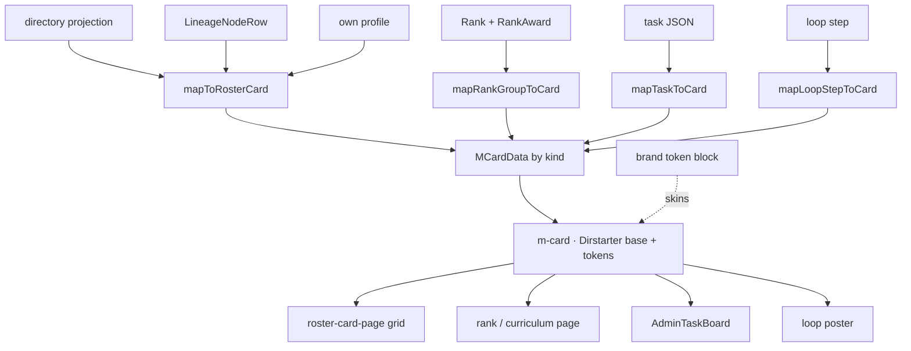
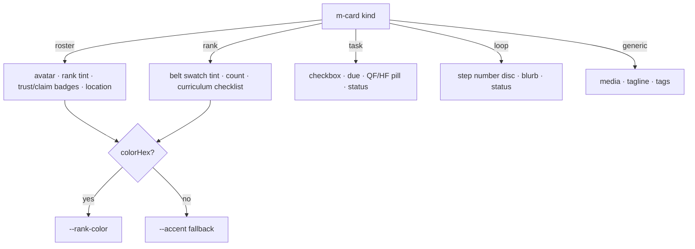

<!-- LIGHTWEIGHT spec. Value = the ONE card contract + the kind→DTO bindings + brand token swap. -->

# m-card — the one card contract

> **⚠ Superseded in part by [ADR 0040](../../../architecture/decisions/0040-design-system-doctrine-and-card-architecture.md)
> + the [Design-System Doctrine](../design-system-doctrine.md) §5.** m-card is **no longer "the one card"** —
> it is demoted to the **record/person card**, one of a small set of named cards on the single L1 `Card`
> surface (alongside `ListingCard` = catalog, `BoardCard` = kernel boards). The `kind="generic"` plan is
> **dropped** (catalog content uses `ListingCard`, not a generic m-card kind), and the `kind` god-union is to
> be split into named cards. Read the doctrine §5 first; the `roster`/`rank` slices below are still valid as
> the record-card render paths.

## Summary

**One card, two axes of agnosticism.** `m-card` is a single template that renders any roster, rank
group, task, or loop step. It is **content-agnostic** (a `kind` discriminator selects the DTO slice
it binds to) and **brand-agnostic** (built on the pure **Dirstarter L1 base primitive**
`components/common/card.tsx`, skinned only through design tokens — so it serves Ronin Dojo, BBL,
MammothBuild, Tuff Buffs, Baseline, WEKAF, or any future brand/site/app with **zero per-brand card
code**). **One rule:** nothing brand- or content-specific lives in the card — brands inject a token
block, surfaces inject a DTO slice.

This collapses today's **parity problem** — `BjjPassportCard`, `FacetResultCard`, `LineageNodeCard`,
`ListingCard`, `SchoolCard` (4 shapes / 3 components / scattered mappers) — into one contract + a few
mappers, sharing the DTO surface from [`public-passport-dto`](public-passport-dto.md) and the design
system from [`component-design-system`](../component-design-system.md).

## The contract

```ts
type MCardKind = "roster" | "rank" | "task" | "loop" | "generic"

// content-agnostic presentation DTO — surfaces map their native query output to ONE of these
type MCardData = {
  roster: { id; name; avatarUrl; rank?: { name; colorHex?; disciplineCode? };
            schoolLabel?; locationLine?; trustStatus?; claimStatus?; tier? }
  rank:   { id; name; colorHex?; disciplineCode?; count?; items?: { id; label; done? }[] }  // belt group / curriculum
  task:   { id; title; due?; lane?: "QF" | "HF"; status: LifecycleStatus; priority?; project? }
  loop:   { id; num?; title; blurb?; status?: LifecycleStatus }
  generic:{ id; title; media?; tagline?; categories?; badges? }
}

type MCardProps<K extends MCardKind> = {
  kind: K
  data: MCardData[K]
  href?: string                 // deep-link (roster/generic) — omit for inline task/loop
  density?: "comfortable" | "compact"
  selected?: boolean
  onSelect?: (id: string) => void
  actions?: ReactNode           // overflow menu / save slot — surface-supplied
}

type LifecycleStatus = "active" | "inactive" | "deprecated" | "broken"  // shared with AdminTaskBoard
```

The card renders **one skeleton** for every kind — eyebrow → title → accent tint → meta → badges →
actions — and only the *binding* differs:

```text
 ┌───────────────────────────────────────────┐
 │ ◤ accent tint rail (--accent or --rank-color)
 │  EYEBROW            (kind label · discipline · project)
 │  ◍  TITLE                               [ ⋯ actions ]
 │      meta line      (school · location · due · blurb)
 │      [badge] [badge] [QF|HF | trust | status]
 └───────────────────────────────────────────┘
```

## kind → DTO binding (content-agnostic)

| kind | Source DTO | Mapper | Use cases |
| --- | --- | --- | --- |
| `roster` | `projectDirectoryProfileListItem` / `LineageNodeRow` / `projectOwnProfile` | `mapToRosterCard()` | members, instructors, schools, lineage nodes — tree / passport / directory / detail |
| `rank` | `Rank` + grouped `RankAward` / curriculum | `mapRankGroupToCard()` | **belt-by-belt groupings**, rank curriculum cards, per-belt technique checklists |
| `task` | AdminTaskBoard task JSON ([spec](bbl-admin-task-board.md)) | `mapTaskToCard()` | **list-maker / task-maker** cards, the operator board rows |
| `loop` | orchestration loop step (`docs/protocols/*`, `docs/rituals/*`) | `mapLoopStepToCard()` | **PR-review→score→fix** loop cards, bow-in/out steps |
| `generic` | any `{ title, media, tags }` | passthrough | listings, catalog, fallback |

> The same card powers a **directory roster page**, a **belt-by-belt curriculum page**, the
> **AdminTaskBoard**, and a **PR-review loop poster** — swap `kind`, nothing else.

## Brand theming (brand-agnostic)

The card references **only tokens** — never a brand. Theming = swap the token block (the
[`bbl-doc-theme`](../component-design-system.md) model). Belt tint stays **data-driven**
(`--rank-color` from `Rank.colorHex`, ADR 0022), falling back to the brand accent.

| Brand | accent token (`--color-primary` / `--accent`) | base |
| --- | --- | --- |
| Ronin Dojo | brand red | Dirstarter |
| Black Belt Legacy | `#E52421` | Dirstarter |
| MammothBuild | (brand token) | Dirstarter |
| Tuff Buffs | gold `#CFB87C` | Dirstarter |
| Baseline | neutral default | **pure Dirstarter (the base)** |
| WEKAF | yellow `#FACC15` | Dirstarter |

Dark/light is automatic — the card inherits `prefers-color-scheme` / `data-theme` from the token
layer (already shipped in the design system). No per-brand, per-mode card code.

## Data wiring flow (ASCII)

```text
 native query output (per surface / brand)
   directory projection ─┐
   LineageNodeRow ───────┤   mapToRosterCard()
   own profile ──────────┘            │
   Rank + RankAward ──── mapRankGroupToCard()   ┐
   task JSON ─────────── mapTaskToCard()        ├──▶  MCardData[kind]  ──▶  <m-card kind=… data=… />
   loop step ─────────── mapLoopStepToCard()    ┘                                   │
                                                                    Dirstarter Card base + tokens
                                                                                    │
                              ┌─────────────────────────────────────────────┬──────┴───────────┐
                              ▼                                              ▼                  ▼
                        roster-card-page (grid)                       rank/curriculum page    task board / loop poster
                        components/web/ui/grid.tsx                    (belt groups)           (AdminTaskBoard, posters)
```

## Data wiring flow (mermaid)



## Logic / decision chart — render branch by kind



## Low-fi wireframe — *-card-page (grid, brand-skinned, dark/light)

```text
 roster-card-page                         rank/curriculum-card-page
 ┌──────────┬──────────┬──────────┐       ┌──────────┬──────────┬──────────┐
 │ ◍ Name   │ ◍ Name   │ ◍ Name   │       │ ▰ White  │ ▰ Blue   │ ▰ Purple │  ← belt tint rail
 │ BJJ·Blue │ BJJ·Brwn │ Judo·Blk │       │ 12 techs │ 18 techs │ 9 techs  │
 │ School   │ School   │ School   │       │ □ guard  │ □ sweep  │ □ pass   │
 │ [trust]  │ [claim]  │ [trust]  │       │ □ mount  │ □ choke  │ □ …      │
 └──────────┴──────────┴──────────┘       └──────────┴──────────┴──────────┘
   one m-card, kind=roster                  same m-card, kind=rank
   grid = components/web/ui/grid.tsx        grid = same wrapper
```

## Where it lives (surface map)

| Surface | Path | Action |
| --- | --- | --- |
| m-card | `apps/web/components/web/m-card/m-card.tsx` (new) | one contract, kind-switched render |
| base primitive | `apps/web/components/common/card.tsx` | **reuse** (Dirstarter L1) |
| grid | `apps/web/components/web/ui/grid.tsx` | reuse for *-card-pages |
| roster mapper | `apps/web/lib/m-card/map-roster.ts` (new) | from directory/lineage/own-profile |
| rank mapper | `apps/web/lib/m-card/map-rank.ts` (new) | belt group / curriculum |
| task mapper | `apps/web/lib/m-card/map-task.ts` (new) | AdminTaskBoard JSON |
| loop mapper | `apps/web/lib/m-card/map-loop.ts` (new) | orchestration step |
| tokens | `apps/web/app/styles.css` + `scripts/lib/bbl-doc-theme.ts` | brand block swap; no card edits |
| replaced | `facet-result-card.tsx`, `bjj-passport-card.tsx`, `listing-card.tsx`; wrap `lineage-node-card.tsx` | migrate to m-card |

## Security / redaction gates

- The card is **presentation-only** — it renders whatever the mapper passes. **All redaction stays
  upstream** in the projection ([`public-passport-dto`](public-passport-dto.md): `showRanks`,
  `showEmail`, visibility, tier). The card never fetches and must never receive a non-public field
  for a public surface. Mappers consume already-projected, already-gated DTOs.

## PWCC port spec + cloud handoff

Streamlined for the [PWCC pipeline](../component-porting/plawywright-component-conversion-method/PWCC-ASCII-flow-component-port-pipeline.md)
plus the cloud-sweep handoff (mirrors `codex-cloud-bbl-waves-2-4.md`). Cloud agent owns the build.

```text
 DISCOVERY ✓          →  OBSERVED PRODUCT TRUTH ✓  →  PORT SPEC (this doc) →  REPO MEMORY CHECK ✓
 apps/web card +         5 cards / 4 shapes /          one contract +          base primitive +
 DTO sweep (cited)       3 components (parity gap)     kind→DTO + tokens       grid + tokens exist
        └──────────────────────────────┬───────────────────────────────────────────┘
                                        v
                          IMPLEMENT SMALLEST SLICE  →  PLAYWRIGHT PROOF  →  PROOF GATE
                          (m-card + kind=roster +      desktop + 390px +    green → migrate next
                           map-roster, /directory)     dark/light + 1 brand  surface + PR
```

### File transfer work

| Action | Path | Note |
| --- | --- | --- |
| **create** | `apps/web/components/web/m-card/m-card.tsx` | the contract; kind switch on Dirstarter base |
| **create** | `apps/web/lib/m-card/{map-roster,map-rank,map-task,map-loop}.ts` | one mapper per kind |
| **edit** | `apps/web/components/web/directory/directory-facet-results.tsx` | `FacetResultCard` → `m-card(kind=roster)` |
| **edit** | `apps/web/app/(web)/directory/[slug]/.../profile-sidebar.tsx` | `BjjPassportCard` → `m-card` |
| **edit** | `apps/web/app/(web)/me/.../profile-sidebar.tsx` | `BjjPassportCard` → `m-card` |
| **wrap** | `apps/web/components/web/lineage/lineage-node-card.tsx` | wrap or refactor onto m-card |
| **reuse** | `components/common/card.tsx`, `components/web/ui/grid.tsx`, `app/styles.css` tokens | do not rebuild |
| **deprecate** | `facet-result-card.tsx`, `bjj-passport-card.tsx`, `listing-card.tsx` | re-export 1 release → `deprecated` |
| **monorepo** | AdminTaskBoard + curriculum pages consume `m-card(kind=task\|rank)` | cross-brand reuse |

### Needs

- Mappers consume **already-projected, gated** DTOs — no new queries, no redaction in the card.
- Token blocks already exist per brand (`styles.css` @theme + `bbl-doc-theme.ts`) — consume by name.
- No Prisma / migration work. No new endpoints (roster reads existing directory projections).
- Belt tint is data-driven (`Rank.colorHex`, ADR 0022) — fall back to `--accent`.

### TODOs (cloud agent checklist)

```text
[ ] 1. Scaffold m-card.tsx on components/common/card.tsx with the kind switch + density
[ ] 2. map-roster.ts from projectDirectoryProfileListItem; render eyebrow/title/tint/meta/badges
[ ] 3. Swap /directory/profiles (FacetResultCard → m-card) behind a parity test
[x] 4. map-rank.ts (belt group + curriculum checklist); a rank/curriculum-card-page  // slice 2 — /disciplines/[slug]/ranks
[ ] 5. map-task.ts + map-loop.ts; wire AdminTaskBoard rows + loop posters to m-card
[ ] 6. Migrate /me + /directory/[slug] sidebars; wrap lineage-node-card; deprecate old cards
[ ] 7. Brand proof: render the same grid under 2 brand token blocks (e.g. BBL + Baseline)
[ ] 8. Vitest: each mapper's output shape; redaction stays upstream (no leaked fields)
[ ] 9. Playwright: desktop + 390px + dark/light + belt-tint + brand swap
[ ] 10. Proof gate green → catalog entry + draft PR + update health table
```

### Cloud prompt (paste-ready)

```text
Work in Ronin-Dojo-Design/ronin-dojo-baseline (apps/web). Build the m-card per
docs/knowledge/wiki/files/m-card-pattern.md (this spec).

Read first: the contract, kind→DTO bindings, brand theming, and the File transfer work table.
Build on the Dirstarter base components/common/card.tsx and the grid wrapper — do not rebuild
primitives. The card is presentation-only: all redaction stays in the projection
(public-passport-dto.md); mappers receive already-gated DTOs.

Smallest slice first: m-card + kind=roster + map-roster on /directory/profiles, behind a parity
test against FacetResultCard. Then rank/task/loop kinds and the remaining surfaces; deprecate the
old cards as re-exports for one release. Theme only via tokens (accent/--rank-color, dark/light) —
never reference a brand in the card.

Proof gate: Vitest (mapper shapes + no leaked fields) + Playwright (desktop, 390px, dark/light,
belt tint, two-brand token swap). Green → register catalog entry, open a draft PR, update health.
```

## Provenance

Spec authored SESSION_0428 (PWCC: Petey plan / Cody build target / Desi parity pass) per Brian's
"roster-card-pages / list m-card, DTO-surface-consistent, content-agnostic, any brand, pure
Dirstarter base" request plus the belt/curriculum/task/loop use-case set. Grounded in the apps/web
card and DTO sweep (directory payloads/projection, the 5 existing cards, `components/common/card.tsx`
base, the four public surfaces). Unifies the [public Passport DTO](public-passport-dto.md),
[AdminTaskBoard](bbl-admin-task-board.md), and [design system](../component-design-system.md).
Implementation handed to the cloud lightweight coding agent.
