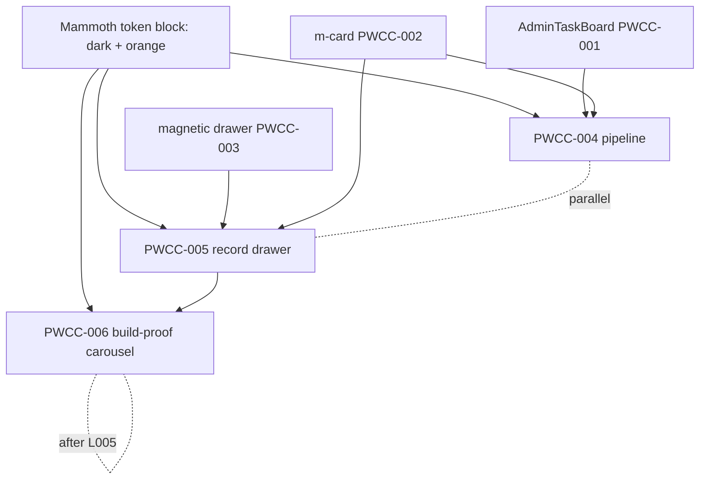

<!-- LIGHTWEIGHT bindings spec. Value = the 3 surface→component bindings + the 3 cloud-agent prompts.
     These are THIN: they bind already-specced components (PWCC-001/002/003) to Mammoth surfaces.
     They do not redefine the components. -->

# Mammoth CRM bindings — PWCC-004/005/006

## Summary

Three **thin bindings** that wire the shared library (AdminTaskBoard / m-card / magnetic drawer)
onto the existing Mammoth Build CRM (`clients/mammoth-build-crm/`, SESSION_0425). Each binding =
*a Mammoth surface* + *which component* + *the DTO slice* + *the token block*. No new components;
the Mammoth dark/orange token block proves the library is brand-agnostic. Petey orchestration: each
binding is an independent, parallelizable lane with its own cloud-agent prompt.

```text
 PWCC-004  pipeline board     → AdminTaskBoard (PWCC-001)  · deal DTO   · /app
 PWCC-005  record drawer      → magnetic drawer (PWCC-003) · record DTO · /app/project/[id] + lists
 PWCC-006  build-proof carousel→ drawer full-detent + carousel · photo DTO · /app/project/[id]
```

## Petey orchestration (lanes + sequencing)



- **Lane A — PWCC-004** (pipeline) and **Lane B — PWCC-005** (record drawer) are **disjoint** → run
  in parallel (separate cloud agents / sub-agents).
- **PWCC-006** (build-proof carousel) **depends on PWCC-005** (it lives in the drawer's full detent) →
  sequence after Lane B's drawer shell lands.
- Gate: each lane's component (PWCC-001/002/003) must reach at least its smallest-slice build first.
  Until then, lanes target the spec contracts (mappers + token block can proceed in parallel).

---

## PWCC-004 — Mammoth pipeline board

**Surface:** `clients/mammoth-build-crm/app/page.tsx` (`/app`) — Lead → Order pipeline.
**Component:** AdminTaskBoard column model (PWCC-001) + `m-card kind=task` rows.
**DTO slice (from `lib/store.ts`):** deal/project → `{ id, title, stage, orderConfirmed, orderNumber, atRisk, nextStep, value }`.
**Binding:** columns = pipeline stages (Lead→…→Order→Complete); `atRisk` → `broken` lifecycle + HF
lane (jumps top); "no next-step" guardrail = the at-risk rule. Deposit-stage crossing stamps the
order badge on the card. Tokens = Mammoth dark/orange.

```text
Build the Mammoth pipeline board (PWCC-004) in clients/mammoth-build-crm/app/page.tsx.
Read: docs/knowledge/wiki/files/mammoth-crm-bindings.md (PWCC-004), the AdminTaskBoard spec
(PWCC-001), and lib/store.ts. Bind the AdminTaskBoard column model to the existing deal/project
store: columns = pipeline stages, cards = m-card kind=task. Map atRisk→broken+HF lane; preserve the
"can't reach Complete without orderConfirmed" and "open project with no next-step = at-risk" rules.
Theme via the Mammoth token block (dark + orange) — no hardcoded hex. Smallest slice: render stages
+ cards from store, then drag-between-stages. Proof: Vitest (stage rules, at-risk) + Playwright
(390px + desktop, dark). Green → PR.
```

## PWCC-005 — Mammoth record drawer

**Surface:** record detail for contact / deal / project — `clients/mammoth-build-crm/app/project/[id]/page.tsx`
and the list surfaces.
**Component:** three-level magnetic drawer (PWCC-003) hosting `m-card` sections.
**DTO slice:** record → `{ id, kind: "contact"|"deal"|"project", header, fields[], relatedCards[] }`.
**Binding:** peek = header + stage; half = fields + related (tasks, contacts); full = cinematic
record explorer. Related items render as `m-card`s; recursive `onSelectItem` drills contact↔deal↔project.
Tokens = Mammoth dark/orange.

```text
Build the Mammoth record drawer (PWCC-005) in clients/mammoth-build-crm/.
Read: mammoth-crm-bindings.md (PWCC-005), the magnetic drawer spec (PWCC-003), m-card spec (PWCC-002).
Use the 3-detent magnetic drawer as the record detail surface: peek=header/stage, half=fields+related
m-cards, full=cinematic explorer. Related records are m-cards; onSelectItem drills between
contact/deal/project. Presentation-only — read the store DTO, no fetch logic in the drawer. Theme via
Mammoth token block (dark/orange), dark/light. Smallest slice: open project record at half detent with
fields + related tasks. Proof: Vitest (detent machine, related mapping) + Playwright (peek/half/full
snaps, 390px, dark). Green → PR. NOTE: leaves room in the full detent for PWCC-006.
```

## PWCC-006 — Build-proof photo carousel

**Surface:** project record, full detent — before/during/after build documentation (the CRM's
centerpiece differentiator).
**Component:** magnetic drawer full detent + the Embla carousel (PORTMAP-0004) / photo-carousel
chrome from the monorepo parity sweep.
**DTO slice:** `{ projectId, stages: { before|during|after: { photos: {url, thumb, caption, takenAt}[] } } }`.
**Binding:** three labelled stage rails (before/during/after), swipeable, counter + dots, favorite;
"public proof link" per stage (P3 roadmap). Full-res from S3 (P3), thumbnails cached. Tokens = Mammoth.

```text
Build the build-proof photo carousel (PWCC-006) in the Mammoth record drawer's full detent.
Read: mammoth-crm-bindings.md (PWCC-006) and the magnetic drawer spec (PWCC-003). Depends on PWCC-005
(the drawer shell). Render 3 labelled stage rails (before/during/after) using the Embla carousel
primitive; swipe + counter + dots + favorite; per-stage "public proof link". Photos from the store
DTO now (S3 in P3). Theme via Mammoth token block. Smallest slice: 3 rails from fixture photos in the
full detent. Proof: Playwright (swipe, 390px + desktop, dark) + a11y labels. Green → PR.
```

## Where it lives (surface map)

| PWCC | Surface (client app) | Component | Status |
| --- | --- | --- | --- |
| PWCC-004 | `app/page.tsx` (`/app`) | AdminTaskBoard + m-card task | PLANNED |
| PWCC-005 | `app/project/[id]/page.tsx` + lists | magnetic drawer + m-card | PLANNED |
| PWCC-006 | `app/project/[id]` full detent | drawer + Embla carousel | PLANNED (after 005) |

## Security / redaction gates

- Client CRM is operator/owner-internal — admin-gated; no public surface except the explicit
  per-stage "public proof link" (PWCC-006, opt-in, P3). Components stay presentation-only; the store
  (later Postgres) owns access.

## Provenance

Petey orchestration, SESSION_0428, per Brian's "spec Mammoth bindings, act as Petey, assign
lightweight agent prompts to cloud or sub agents." Binds PWCC-001/002/003 to the
[Mammoth-Rebuild CRM epic](../../../epics/mammoth-rebuild-crm-001.md) surfaces
(`clients/mammoth-build-crm/`, SESSION_0425). Three parallelizable lanes, each with a ready
cloud-agent prompt; PWCC-006 sequenced after PWCC-005.
