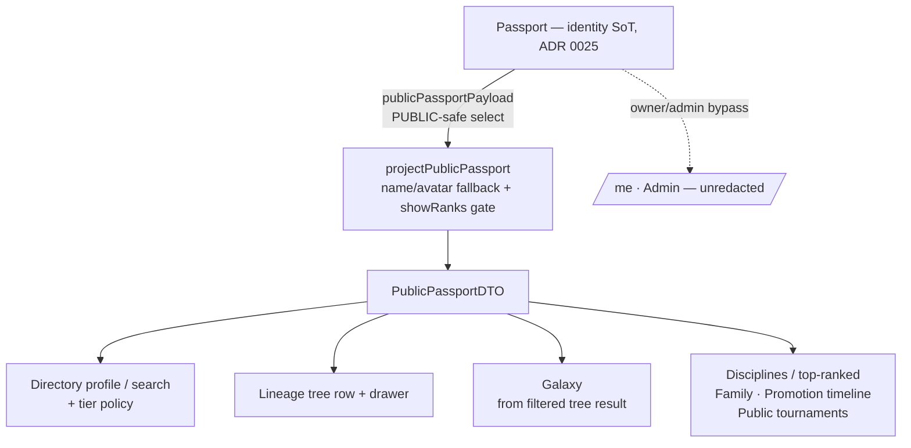
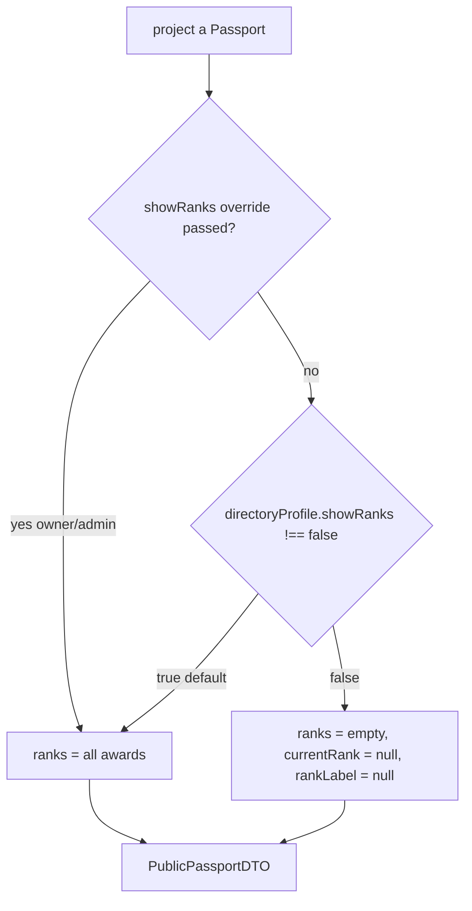

# Public Passport DTO (canonical public identity projection)

## Summary

The **single** public-facing identity projection every public surface should view-model from
(ADR 0025 — Passport is the identity source of truth). Replaces the per-surface re-select +
re-redact found in the SESSION_0428 parity audit (3 parallel Prisma selects, 2 redactors). One
select (`publicPassportPayload`) + one projector (`projectPublicPassport`) = **one redaction
audit point**. The rule that matters: a public surface never hand-rolls the identity select —
it consumes this.

## Data wiring flow (ASCII)

```text
Passport (identity SoT, ADR 0025)
  |  publicPassportPayload  (PUBLIC-safe select: NO email/phone/legal/DOB)
  v
projectPublicPassport(passport, { brand?, showRanks? })   <-- the ONE gate
  |   - name:   passport.displayName -> user.name
  |   - avatar: passport.avatarUrl  -> user.image -> brand default
  |   - ranks:  showRanks===false ? [] : rankAwardsEarned  (colorHex from Rank.colorHex)
  v
PublicPassportDTO  { id, displayName, avatarUrl, bio, slug, ranks[], currentRank, rankLabel }
  |
  +--> Directory profile/search   (+ tier policy on top)
  +--> Lineage tree row + drawer   (+ tree-fact context)
  +--> Galaxy                      (consumes the already-filtered tree result, then projects)
  +--> Disciplines / top-ranked, Family tree, Promotion timeline, Public tournaments
  |
  x--  Self (/me), Admin  -> bypass the public gate (owner/admin see unredacted; { showRanks: true })
```

## Data wiring flow (mermaid)



## Logic / decision chart (the rank gate)



## Where it lives (field / surface map)

| DTO field | Source | Notes / redaction |
| --- | --- | --- |
| `displayName` | `Passport.displayName` → `user.name` | fallback chain |
| `avatarUrl` | `Passport.avatarUrl` → `user.image` → brand default | `resolveDisplayAvatar` |
| `slug` | `Passport.directoryProfile.slug` | null when no directory profile |
| `ranks[]` / `currentRank` / `rankLabel` | `Passport.rankAwardsEarned → rank` | **gated by `showRanks`** (single audit point) |
| `colorHex` (per rank) | `Rank.colorHex` | never hardcoded |
| `disciplineName` | `rank.rankSystem.discipline.name` | — |
| visibility scope | query layer | PUBLIC-only enforced before projection |

## Security / redaction gates

- **Never selected:** email, phone, legal name, DOB, emergency contact (not in `publicPassportPayload`).
- **Rank gate:** `directoryProfile.showRanks` (default `true`); honored uniformly across public
  surfaces. Owner/admin contexts pass `{ showRanks: true }` to bypass. **One** place applies it.
- **Visibility:** PUBLIC scope is enforced at the query layer (per surface) *before* projection;
  the projector assumes its input is already visibility-filtered.

## Provenance

Parity audit + base landed SESSION_0428 (PR #135, issue #134 ADR + per-surface migration plan).
Galaxy verified-only consumer pattern: PR #133. Per-surface migration is tracked in
[post-launch-clean-repo-001](../../../epics/post-launch-clean-repo-001.md).
