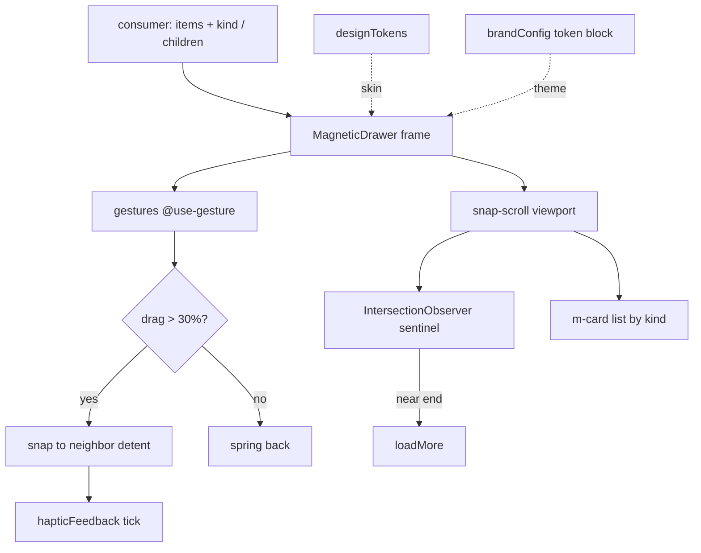

<!-- LIGHTWEIGHT spec. Value = the 3 detents + the content-agnostic canvas contract + the chrome parity table. -->

# three-level magnetic drawer — PWCC-003

## Summary

A **content-agnostic canvas** drawer with **three magnetic detents** (peek / half / full) that hosts
an **infinitely scrollable list of [`m-cards`](m-card-pattern.md)** — roster cards, lineage nodes,
rank groups, tasks, anything. You attach/import a card list; the drawer owns the detents, gestures,
chrome, and a11y. It is **brand-agnostic** (built on the Dirstarter base `common/drawer.tsx`, skinned
only via tokens) and consumes the simplified Todoist/BBLApp chrome at peek/half and escalates to
**cinematic explorer chrome** at full. **One rule:** the drawer is a *frame* — it never knows what a
card is; it renders `children` (or an `m-card` list) inside a snap-scroll viewport.

Replaces the parity sprawl found in the old monorepo — `LineageProfileDrawer` (2158 lines),
`LineageExplorerDrawer`, Daylio `MoodDrawer`/`MoodSessionDrawer`, `MemberCarousel` — all single-level
CSS drawers — with one 3-detent canvas. Goes in [`custom-component-inventory`](../custom-component-inventory.md)
(baseline) and the monorepo **design-system-library** (`DesignSystem` panel).

## The three detents (magnetic)

| Detent | Height | Chrome | Backdrop | Radius | Enter easing | Haptic on snap |
| --- | --- | --- | --- | --- | --- | --- |
| **peek** | `25vh` | Todoist-simple: handle + title + count | none / `bg-black/40` | `rounded-t-2xl` | `beltFlow` `cubic-bezier(.22,1,.36,1)` 300ms | `haptics.light()` |
| **half** | `60vh` | list + in-drawer carousels | `bg-black/60 backdrop-blur-sm` | `rounded-t-2xl` | `spring` `cubic-bezier(.34,1.56,.64,1)` 400ms | `haptics.medium()` |
| **full** | `90vh` | **cinematic explorer** (deep black, layered shadow, hide handle) | `bg-black/70 backdrop-blur-sm` | `rounded-t-3xl` | `bounce` `cubic-bezier(.68,-.55,.265,1.55)` 500ms | `haptics.heavy()` |

- **Magnetic snap:** drag past **30%** toward a neighbor → snap to it (momentum-aware), else spring
  back. Each settle fires the matching `hapticFeedback` tick (from the design-system-library) — the
  "magnetic" feel. Gestures via `@use-gesture/react` (already in monorepo deps).
- Handle bar `w-12 h-1.5 bg-muted` shows at peek/half, **hidden at full**.
- `prefers-reduced-motion`: no keyframes — jump to resting detent (inherits `common/drawer.tsx` rule).
- Safe-area: `pb-[env(safe-area-inset-bottom)]`.

## Content-agnostic canvas contract

```ts
type Detent = "peek" | "half" | "full"

type MagneticDrawerProps = {
  open: boolean
  onOpenChange: (open: boolean) => void
  detent?: Detent                 // controlled
  defaultDetent?: Detent          // uncontrolled (default "half")
  onDetentChange?: (d: Detent) => void
  title?: ReactNode               // peek header
  count?: number                  // peek badge
  contentClassName?: string       // brand font/token threading (no brand tokens inside the drawer)
  children: ReactNode             // ANY content — typically an <m-card> list
}

// Convenience for the common case: an infinite roster of m-cards
type MagneticRosterDrawerProps = Omit<MagneticDrawerProps, "children"> & {
  items: unknown[]                // already-projected DTO slices
  kind: "roster" | "rank" | "task" | "loop"   // → m-card binding
  loadMore?: () => void           // infinite scroll (IntersectionObserver sentinel)
  hasMore?: boolean
  onSelectItem?: (id: string) => void          // recursive drill-down (student carousel pattern)
}
```

The drawer renders a **snap-scroll viewport** (`overflow-y-auto overscroll-contain`,
`[scrollbar-width:none]`) and an IntersectionObserver sentinel for infinite load. Cards are
`m-card`s — so the *same* drawer shows a roster, a belt-group list, a task list, or loop steps by
swapping `kind`. Recursive `onSelectItem` reproduces the lineage student-carousel drill-down.

## Data wiring flow (ASCII)

```text
  consumer (any surface / brand)
        │ attach: items[] + kind  (or arbitrary children)
        ▼
  ┌───────────────────────────────────────────────┐
  │ MagneticDrawer  (frame — detents · gestures · a11y)
  │   peek 25vh ──drag▲──▶ half 60vh ──drag▲──▶ full 90vh
  │      │ haptic.light      │ haptic.medium     │ haptic.heavy
  │      └───────────────────┴───────────────────┘
  │   viewport: snap-scroll + IntersectionObserver sentinel
  │      │                                   │ near end → loadMore()
  │      ▼ renders                           ▼
  │   <m-card kind=… data=…/> · <m-card …/>  …infinite…
  └───────────────┬───────────────────────────────┘
                  │ tokens + haptics
        ┌─────────┴──────────┐
   design tokens          hapticFeedback
   (radii/shadow/ease)    (snap ticks)   ← monorepo DesignSystem library
```

## Data wiring flow (mermaid)



## Chrome parity table (old monorepo → standardized)

| Source (monorepo) | What we keep | What we drop |
| --- | --- | --- |
| `LineageProfileDrawer.jsx` (2158 ln) | belt-pill carousel, photo/video carousel, rank-history | the single-level right-slide; 2158-line monolith |
| `LineageExplorerDrawer.jsx` | cinematic chrome (deep black, `shadow-2xl shadow-black/50`, `backdrop-blur-sm`, `will-change-transform`) → **full detent** | left-slide-only, z-70/80 special-casing |
| Daylio `MoodDrawer` / `MoodSessionDrawer` | handle bar `w-12`, `rounded-t-2xl`, stepper for multi-stage | teal accent (use token), bespoke modal frame |
| `MemberCarousel.jsx` | snap-mandatory rail, 75%-viewport scroll step, hover nav reveal (320ms) | per-brand gold hardcode |
| `PageTransition.jsx` | `beltFlow` / `spring` / `bounce` easings (mapped to detents above) | full page-transition machinery |

## Branding (simplified Todoist/BBLApp → cinematic)

- **peek/half** = simplified Todoist/BBLApp chrome: flat surface, single accent, the 1-2-3 step
  rhythm, calm 4px scale (from [`component-design-system`](../component-design-system.md)).
- **full** = cinematic explorer: deep black canvas, layered shadow, subtle backdrop blur — the
  immersive parity from `LineageExplorerDrawer`.
- All values are **tokens** (`--accent`, radii, shadow, `designTokens.animations.easing`) — brand =
  swap the token block (`brandConfig`); dark/light inherited. **No brand or content code in the drawer.**

## Where it lives (surface map)

| Surface | Path | Action |
| --- | --- | --- |
| drawer (baseline) | `apps/web/components/common/magnetic-drawer.tsx` (new) | extend `drawer.tsx` with detents |
| roster convenience | `apps/web/components/web/m-card/magnetic-roster-drawer.tsx` (new) | items+kind → m-card list + infinite scroll |
| base | `apps/web/components/common/drawer.tsx` | **reuse** (Base UI, a11y, swipe) |
| in-drawer rail | `apps/web/components/common/carousel.tsx` | reuse Embla (PORTMAP-0004) |
| consumer migrate | `apps/web/components/web/lineage/lineage-profile-drawer/*` | host on the magnetic canvas |
| drawer (monorepo) | `src/components/DesignSystem/` + register in panel | **design-system-library** entry |
| tokens + haptics | `src/components/DesignSystem/index.jsx` (`designTokens`, `hapticFeedback`) | consume |
| inventory | `docs/knowledge/wiki/custom-component-inventory.md` | add row |

## Security / redaction gates

- Presentation-only frame. Hosts `m-card`s, which are themselves presentation-only — **all redaction
  stays upstream** in the projection ([`public-passport-dto`](public-passport-dto.md)). The drawer
  receives already-projected, already-gated DTO slices; it must never fetch or hold a non-public field.

## PWCC port spec + cloud handoff

Streamlined for the [PWCC pipeline](../component-porting/plawywright-component-conversion-method/PWCC-ASCII-flow-component-port-pipeline.md)
plus the cloud-sweep handoff (mirrors `codex-cloud-bbl-waves-2-4.md`). PWCC-003.

```text
 DISCOVERY ✓          →  OBSERVED PRODUCT TRUTH ✓  →  PORT SPEC (this doc) →  REPO MEMORY CHECK ✓
 monorepo drawer +       6 single-level drawers /      3 detents + canvas +    common/drawer.tsx +
 Daylio + carousel       carousels (chrome values)     m-card host + chrome    carousel + tokens exist
 sweep (cited)                                         parity                  (extend, not rebuild)
        └──────────────────────────────┬───────────────────────────────────────────┘
                                        v
                          IMPLEMENT SMALLEST SLICE  →  PLAYWRIGHT PROOF  →  PROOF GATE
                          (magnetic-drawer + half     desktop + 390px +    green → migrate lineage
                           detent + m-card roster)    detent snaps + a11y   drawer + register library
```

### File transfer work

| Action | Path | Note |
| --- | --- | --- |
| **create** | `apps/web/components/common/magnetic-drawer.tsx` | detents + gestures on `drawer.tsx` |
| **create** | `apps/web/components/web/m-card/magnetic-roster-drawer.tsx` | items+kind + infinite scroll |
| **edit** | `apps/web/components/web/lineage/lineage-profile-drawer/*` | host on magnetic canvas |
| **reuse** | `components/common/{drawer,carousel}.tsx` | do not rebuild |
| **register (monorepo)** | `src/components/DesignSystem/` Components+Templates+Preview panels | design-system-library |
| **deprecate (monorepo)** | `LineageProfileDrawer.jsx`, `LineageExplorerDrawer.jsx`, Daylio drawers | fold onto the canvas over time |
| **doc** | `custom-component-inventory.md` row + `component-design-system.md` link | inventory + library |

### Needs

- `@use-gesture/react` (monorepo has it; add to baseline if absent) for drag/detent.
- `designTokens` + `hapticFeedback` from the monorepo DesignSystem library; baseline mirrors tokens
  via `app/styles.css` + `scripts/lib/bbl-doc-theme.ts`.
- IntersectionObserver for infinite scroll (no virtualization needed for v1; add windowing if a
  roster exceeds ~200 cards).
- No Prisma / migration / endpoint work — pure presentation.

### TODOs (cloud agent checklist)

```text
[ ] 1. magnetic-drawer.tsx: 3 detents on common/drawer.tsx; @use-gesture drag + 30% snap threshold
[ ] 2. Detent easings (beltFlow/spring/bounce) + hapticFeedback tick on each settle
[ ] 3. peek/half = Todoist-simple chrome; full = cinematic (token-driven, dark/light)
[ ] 4. magnetic-roster-drawer.tsx: items+kind → m-card list + IntersectionObserver loadMore
[ ] 5. Recursive onSelectItem drill-down (student-carousel parity)
[ ] 6. Migrate lineage-profile-drawer onto the canvas; keep tabs + carousels
[ ] 7. Register in monorepo DesignSystem (Components/Templates/Preview); add inventory row
[ ] 8. Vitest: detent state machine, snap threshold, loadMore trigger
[ ] 9. Playwright: 390px + desktop, peek↔half↔full snaps, reduced-motion, dark/light, brand swap
[ ] 10. Proof gate green → catalog + draft PR + update health
```

### Cloud prompt (paste-ready)

```text
Build the three-level magnetic drawer (PWCC-003) per
docs/knowledge/wiki/files/three-level-magnetic-drawer.md.

Read first: the detent table, canvas contract, chrome parity table, and File transfer work.
Extend the Dirstarter base components/common/drawer.tsx — do not rebuild. The drawer is a frame:
it renders an m-card list (m-card-pattern.md) and owns detents/gestures/a11y only. Presentation-only:
redaction stays upstream; receive already-gated DTO slices.

Smallest slice first: magnetic-drawer + half detent + m-card roster + infinite scroll, behind a
detent state-machine test. Then peek/full chrome, haptics, recursive drill-down, and migrate the
lineage profile drawer. Theme only via tokens (designTokens + brandConfig, dark/light) — never a
brand in the drawer. Register in the DesignSystem library.

Proof gate: Vitest (detent machine, snap threshold, loadMore) + Playwright (390px + desktop,
peek↔half↔full snaps, reduced-motion, dark/light, two-brand token swap). Green → catalog + draft PR.
```

## Provenance

Spec authored SESSION_0428 (PWCC-003; Petey plan / Cody build target / Desi cinematic-chrome parity
pass) per Brian's "three-level magnetic content-agnostic canvas drawer for roster cards / lineage
nodes, simplified Todoist/BBLApp → cinematic explorer chrome, reusable, design-system-library"
request. Grounded in the monorepo drawer/Daylio/carousel sweep (chrome values cited inline) and the
baseline `common/drawer.tsx` + `lineage-profile-drawer`. Hosts [`m-card`](m-card-pattern.md)
(PWCC-002); consumes the [design system](../component-design-system.md). Cloud agent owns the build.
