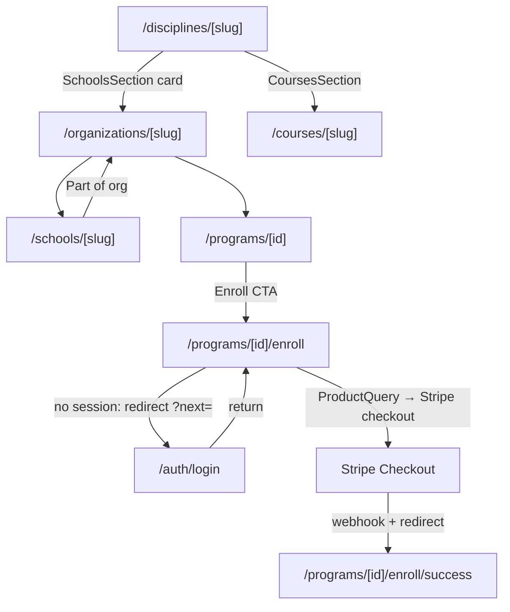
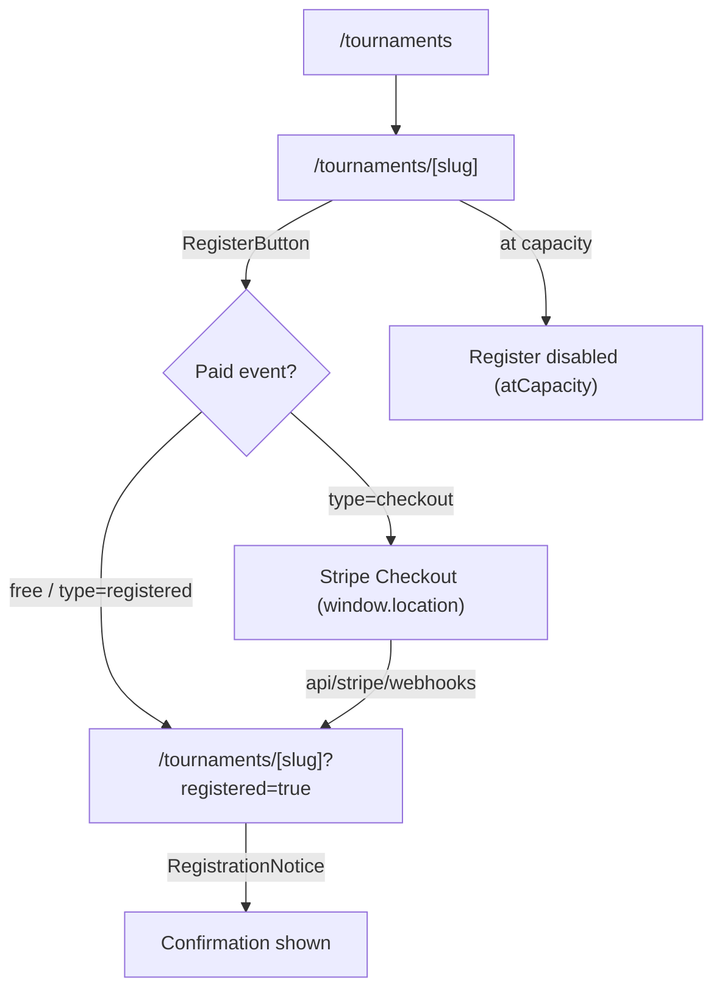

# Wiring Ledger — not-done, gaps, and handroll slips

## Summary

**This is the repo's canonical running P0/P1/P2 ledger.** Sessions *append* findings (stable IDs
`WL-P0-N` / `WL-P1-N` / `WL-P2-N`) and *resolve* rows here rather than duplicating a severity list into
every SESSION file — that pattern rots (see how `wiki/log.md` drifted). Per-session findings still live
in each SESSION file's `### Findings (severity ≥ medium)` block, which should backlink here. The closing
ritual's optional items include updating this ledger when a session surfaces or clears wiring debt.

A living ledger of incomplete wiring, storage gaps, and raw handrolled components that slipped the
FS-0001 primitive-composition rule across the Baseline Martial Arts public surfaces. Created at
SESSION_0304 from a Desi audit of `apps/web/app/(web)` + `apps/web/components/web`. **Headline:
zero P0s** — the public surfaces are genuinely well-wired (discipline → school → program → enroll and
tournament register flows all resolve through real routes / Stripe checkout). This is a consistency
ledger, not a stub farm. Items marked ✅ were resolved during SESSION_0304; the rest are tracked
follow-ups, not silent nulls.

## Key Ideas

- The codebase is honest: every public CTA audited resolves to a real route or server action.
- The remaining debt is **structural/cosmetic** (FS-0001 handroll slips, one "coming soon" stub),
  not broken wiring.
- `localStorage`/`sessionStorage` usage is SSR-safe and read/write-paired — no orphan persistence.

## P0 — broken / dead public wiring

**None found.** Traced CTAs all resolve:

- Program enroll: `app/(web)/programs/[id]/page.tsx:184` → `enroll/page.tsx` → `ProductQuery` checkout
  (auth-gated redirect at `enroll/page.tsx:50`).
- Tournament register: `components/web/tournaments/register-button.tsx:66` → `createRegistrationCheckout`
  → Stripe URL.
- Discipline/school cross-links resolve to real slugs (`disciplines/[slug]/page.tsx:181,285`,
  `schools/[slug]/page.tsx:138,354`).

## P1 — should-fix

| ID | File:line | Category | Finding | Status |
| --- | --- | --- | --- | --- |
| WL-P1-1 | `app/(web)/certificates/verify/[code]/page.tsx:31` | Handroll (FS-0001) | Public cert-verify result card was a raw `
`, not `Card`. A public trust surface diverging from every branded card. | ✅ Fixed — swapped to `~/components/common/card::Card` |
| WL-P1-2 | `app/(web)/programs/[id]/schedules/[scheduleId]/page.tsx:121` | Handroll (empty state) | Empty session list used a raw `
` instead of `EmptyList`. | ✅ Fixed — swapped to `~/components/common/empty-list::EmptyList` |
| WL-P1-3 | `components/admin/tournaments/registration-actions.tsx`; `app/admin/{leads,tools,tags,categories,users}/_components/*-actions.tsx` | Dead handler (Base UI semantics) | `DropdownMenuItem onSelect={…}` without `onClick` — Base UI `Menu.Item` activates on `onClick` and has no `onSelect` (it resolves to the `
` text-selection event). D-016 migration gap (scanned imports, not Menu.Item semantics). Tournament Approve/Waitlist, lead Nurture/Lost, tool/tag/category Duplicate, user Ban/Unban/Revoke likely silently no-op. | ✅ Fixed — SESSION_0334 swept all 11 instances across 6 files (`user-actions.tsx` was beyond the original list) to `onClick`-only + added a `bun test` regression guard (`components/common/dropdown-menu.guard.test.ts`) anchored to `DropdownMenuItem`. Drift D-016 closed. |
| WL-P1-4 | `apps/web/components/web/lineage/lineage-search-bar.tsx`; `apps/web/lib/lineage/rank-progression.ts` | Test coverage (privacy) | No dedicated test that the public lineage search can't surface non-PUBLIC members, nor that rank-progression on a public node leaks no PII. Implied by the payload allowlist (`queries.visibility.test.ts`) but unasserted for these SESSION_0331/0332 surfaces. | ✅ Fixed — SESSION_0334 added `lib/lineage/search.privacy.test.ts` (real materializer → extracted `lib/lineage/search.ts` matcher; PRIVATE/RESTRICTED unsearchable) and `lib/lineage/rank-progression.privacy.test.ts` (adversarial-PII allowlist proof — caught + hardened a whole-`discipline`-object passthrough in `buildBeltProgressions`). |
| WL-P1-5 | `.github/workflows/` | CI enforcement gap | `bun test` (incl. the invariant guards) + `biome` ran on **no** automated gate — only `playwright.yml` (e2e) + Vercel's build typecheck existed, and there are no git hooks. So the SESSION_0333/0334 guards didn't actually gate, and SESSION_0334 called the dropdown guard "CI-verified" inaccurately. | ✅ Fixed & **green** — SESSION_0335 added `.github/workflows/ci.yml` (Biome `biome ci` + typecheck + unit tests against a Postgres service, least-privilege perms), hardened `playwright.yml` perms, cleared 8 latent `biome ci` errors. Getting the unit job green also required: workflow-level dummy `DATABASE_URL` (apps/web postinstall runs `prisma generate`), `bun run test` (not `bun test`, to honor `--path-ignore-patterns='e2e/**'`), an email no-op guard (`lib/email.ts` crashed when Resend unconfigured — also quiets e2e), and a `prisma db seed` step. All 3 jobs pass (run `26889391880`). See [verification-and-testing](../../runbooks/dev-environment/verification-and-testing.md). |
| WL-P1-6 | `apps/web/server/admin/entitlements/actions.ts` | Audit gap (entitlements) | `grantUserEntitlement` / `revokeUserEntitlement` were admin-gated but wrote `UserEntitlement` rows directly with no `AuditLog`. Because the schema accepted any `entitlementKey`, that path could mint or revoke `LINEAGE_PREMIUM` / `LINEAGE_ELITE` outside the audited comp spine. | ✅ Fixed — SESSION_0347 routes the generic admin path through `server/entitlements/admin-grants.ts`, writing `entitlement.admin.granted` / `entitlement.admin.revoked` before mutation while preserving the S3-upload toggle. Regression proof: `server/admin/entitlements/actions.safe-action.test.ts` covers unauth/non-admin/admin wrappers plus audit-before-mutation for grant/revoke. |
| WL-P1-7 | `apps/web/components/common/select.tsx`; ~17 id-valued consumers | Bug (Base UI label) | Base UI `Select` renders the raw `value` (a cuid/slug) in the trigger when a value is preset from DB/URL and the popup hasn't mounted — because the item labels aren't registered until open. Affects every id-valued Select (rank "select for display", org/user/tier/technique/discipline/mat/fight/schedule/program/content selects). Surfaced SESSION_0353 from an operator report of rank dropdowns showing cuids. | ✅ Resolved (SESSION_0354) — added `components/common/data-select.tsx` (`DataSelect` wrapper + `buildSelectItems`) with a render test asserting the trigger shows the label not the id. `school-filters`/`technique-filters` converted to `DataSelect`; the new claim form dogfoods it; the remaining ~30 id/enum `Select.Root` consumers received the inline `items` fix (FormControl-wrapped / sentinel-item cases where the flat wrapper doesn't fit). `tool-filters` documented exception (option labels are `ReactNode`). Go-forward: use `DataSelect` for id/slug Selects. Follow-up enhancement → WL-P2-12. |

## P2 — nice-to-have / follow-up (deferred, tracked here)

| ID | File:line | Category | Finding | Action |
| --- | --- | --- | --- | --- |
| WL-P2-1 | `components/web/lineage/lineage-profile-drawer.tsx:352-355` | Stub | "Manage verification (coming soon)" `disabled` dropdown item — correctly inert, but a visible unfinished promise on a public profile drawer. | Gate behind an admin flag so non-admins never see it, or track in a lineage roadmap so it doesn't ship as permanent "coming soon". |
| WL-P2-2 | `app/admin/tools/_components/tool-actions.tsx:44` | TODO (admin) | `// TODO: Think about how to handle unique website URLs or remove this feature` — handler is fully wired; design-debt comment, not dead code. No public risk. | Resolve or convert to a tracked backlog item. |
| WL-P2-3 | `app/(web)/programs/[id]/schedules/[scheduleId]/page.tsx:130`, `components/web/schedules/schedule-instructor-list.tsx:81`, `components/web/lineage/lineage-rank-history-tab.tsx:97` | Handroll (row) | Repeated `rounded-md border p-3` list-row blocks (3+ instances). These are *rows*, not cards — acceptable today. | Extract a `ListRow` atom only if a 4th instance appears (YAGNI until then). |
| WL-P2-4 | `app/(web)/disciplines/_components/black-belt-rail.tsx` | Schema follow-up | Belt-color now renders from `Rank.colorHex` (added SESSION_0304). Rows fall back to a muted token when `colorHex` is null — ranks without a seeded color show no belt color. | Seed `Rank.colorHex` for all system rank sets (data task, not schema). Surface as a note per LLM Wiki rule 8 — do not change schema from this ledger. |
| WL-P2-5 | `components/web/lineage/lineage-profile-drawer.tsx:177` | Dead wiring (incomplete refactor) | `DrawerBody` destructures + types `treeId?: string` but never reads it — biome `noUnusedFunctionParameters` warning. Almost certainly plumbing threaded in for the unfinished "Manage verification (coming soon)" feature in the **same file** (WL-P2-1). Not a bug; dead wiring for a planned feature. | ✅ Resolved (SESSION_0454) — removed the dead `treeId?: string`. The ledger path is stale: the single-file `DrawerBody` was since split into `lineage-profile-drawer/`, so `treeId` survived only as an optional prop on `LineageProfileDrawerProps` (`drawer-types.ts:52`) + one never-read pass-through (`lineage-tree-board.tsx:240`). Confirmed never consumed anywhere (whole-app grep + typecheck). WL-P2-1's "Manage verification (coming soon)" is a parked `disabled` stub, not in-flight work, and `treeId` is in scope at the call site → trivially re-threadable if the feature ever lands. Removed type field + pass-through; typecheck/oxlint/oxfmt clean, behavior unchanged. |
| WL-P2-6 | `docs/knowledge/wiki/concepts/enter-the-dojo-schema-intake.md`; `apps/web/prisma/schema.prisma` | Schema/product follow-up | Legacy `ENTER_THE_DOJO.md` recommends a tournament public content shell. Current schema has tournament transactional truth plus `ContentAtom`/`ContentVariant` and generic `Event`, but no explicit decision on whether public tournament content belongs in content variants, events, or a one-to-one `TournamentContent` model. | Run a tournament-content decision session before adding schema. Do not add a quick table until ownership, publish status, and query payload exposure are decided. |
| WL-P2-7 | `docs/knowledge/wiki/concepts/enter-the-dojo-schema-intake.md`; `LineageTreeMember` / `Membership` / `Role` | Schema/product follow-up | Legacy `org_chart_nodes` idea is still useful, but current lineage trees, memberships, and roles each own part of the concept. A staff authority chart needs a product decision before schema. | Decide whether the desired chart is staff authority, lineage, affiliation, or admin permission visualization. Reuse existing lineage/member/role data where possible. |
| WL-P2-8 | `docs/architecture/repo-alignment-report.md`; `/admin/billing/monitoring`; `/admin/storage/monitoring` | Automation/pulse follow-up | Existing monitors are admin pages/on-demand queries. There is no durable Vercel Cron/pulse layer that sends owner-readable app/site/security/storage/docs health digests. | After Brian supplies the pulse summary, design the first pulse route: secret guard, recipients, cadence, failure policy, and whether it wraps billing/storage/wiki/Graphify/site smoke checks. |
| WL-P2-9 | `docs/architecture/decisions/0008-brand-switcher.md`; `docs/knowledge/wiki/manual-boundary-registry.md#mb-003` | Runtime proof follow-up | ADR 0008 is accepted and `User.lastActiveBrandId` exists, but the visible admin/multi-brand switcher flow and reload persistence proof are still open. | Implement as a focused admin/app-shell session or keep MB-003 open; do not conflate host-derived brand chrome (ADR 0022) with active app-data brand switching. |
| WL-P2-10 | `apps/web/package.json`; `apps/web/components/admin/sidebar.tsx`; `scripts/fix-architecture-markdownlint.ts` | Fallow cleanup follow-up | `npx fallow audit --changed-since HEAD` reports 4 dependency-hygiene candidates (`@ai-sdk/google`, `github-slugger`, `tailwind-merge`, `@react-email/preview-server`) and complexity hotspots in the admin sidebar plus the markdownlint fixer. This is broader than the repo-alignment/doc-admin slice. | **Triaged SESSION_0353:** `tailwind-merge` = **KEEP** (runtime peer of `tailwind-variants` used in `lib/utils.ts` `cx`; shipped in `.next` chunks — fallow false-positive). `@react-email/preview-server` = **KEEP** (runtime dep of the `email dev` script, `package.json:13` — false-positive). `@ai-sdk/google` + `github-slugger` = **confirmed unused** (no source/script/config/dynamic refs) → removable. **Removal deferred:** three lockfiles (`apps/web/bun.lock`, `apps/web/package-lock.json`, root `pnpm-lock.yaml`) must be regenerated together or the Vercel/pnpm deploy breaks — do it in a dedicated deps session. Sidebar/markdownlint-fixer complexity still deferred. **✅ Deps resolved (SESSION_0354):** removed `@ai-sdk/google` + `github-slugger`; regenerated all 3 lockfiles together; `pnpm install --frozen-lockfile` (Vercel install) verified green; 0 refs remain in any lockfile. `tailwind-merge`/`@react-email/preview-server` left as confirmed false-positives; sidebar/markdownlint complexity still deferred. **Re-verified SESSION_0454 (Slice 3 = no-op):** the only remaining fallow direct-dep flags are `react-email` (backs the `email dev` script) + `react-dom` (core React renderer) — documented false-positives; nothing provably-unused remains to remove. |
| WL-P2-12 | `apps/web/components/common/data-select.tsx`; rank/school/instructor selects; `tool-filters.tsx` | Enhancement (operator-requested, SESSION_0354) | `DataSelect` currently takes a string-only `label`. Rich dropdown-row labels would add real signal: belt-color swatches on rank selects (`Rank.colorHex`), school logos on school/org selects, instructor avatars (`passport.avatarUrl ?? user.image`) on instructor/user selects, and the per-option `count` (already fetched by `findFilterOptions`) on the filters. | **Next session (operator-requested):** extend `DataSelect` with an optional ReactNode dropdown-row label (e.g. `renderLabel?(option)⇒ReactNode` or `option.content?`) while keeping the required `label: string` for the collapsed trigger + a11y + typeahead; add a render test (trigger shows string, row shows ReactNode); ship belt swatches first, then logos/avatars/counts; move `tool-filters` back onto `DataSelect` (its ReactNode exception disappears). |
| WL-P2-13 | `apps/web/server/admin/claims/*`; `app/(web)/organizations/[slug]`, `schools/[slug]` | Claim feature follow-up (SESSION_0354) | The generic claim system shipped but: (a) no `/directory`/`/organizations`/`/schools` "Claim this organization" CTA for owner-less orgs yet (only placeholder persons get the teaser); (b) person-claim approval is a flagged manual placeholder→account merge (not automated); (c) UI paths are typecheck/test-green but **not browser-verified** (unattended session). | Next: dev-login Playwright smoke (teaser → claim → admin approve → org `ownerId` set); add the org-claim CTA banner; optionally build the person placeholder→account merge reusing the lineage placeholder-transfer logic. See `SESSION_0354_FINDING_01`. |
| WL-P2-11 | `apps/web/components/web/directory/*`; `apps/web/components/common/combobox-selector.tsx` | Polish (Desi defer) | Desi SESSION_0353 review deferred (budget = 3 fixes, spent on combobox parity + accessible clear + reduced-motion): combobox popover wider than trigger on desktop (`min-w-72` vs `sm:w-56`); facet-tab active-pill `layoutId` slide motion; result-card hover lift + grid load stagger (motion-system.md:110-111); Region/City normalization at the `filter-options` server layer; org-facet label drift ("Schools & Orgs" vs "schools & organizations"); active-filter chip affordance. | Pick up in a directory-polish/motion session; all reduced-motion-guarded per motion-system.md. |
| WL-P2-14 | `apps/web/server/web/directory/queries.ts:205`; `apps/web/app/(web)/directory/[slug]/_components/directory-profile/index.tsx`; `apps/web/components/web/profile/profile-hero.tsx` | Feature gap (render not wired) | `DirectoryProfile.coverPhotoUrl` is correctly stored (upload → `uploadMedia` → S3 → `updateDirectoryProfile` → DB), in the read model (`directoryProfileDetailPayload` + DTO line 205), and editable in the profile form. But no public-facing component renders it — `ProfileHero` has no `coverPhotoUrl` prop, and the `/directory/[slug]` page doesn't render a cover image. Logged in SESSION_0431 FI-007 Track B. | ✅ Fixed (SESSION_0434) — `ProfileHero` gained a `coverPhotoUrl?: string \| null` prop (background image + legibility scrim), threaded through the placeholder teaser (`ProfileClaimTeaser`) and the owner live-preview (`passport-editor`). The **claimed** public profile renders via `ListingDetail` (NOT `ProfileHero`), so a new page-local `ProfileCoverBanner` renders the cover above the hero there. Browser-verified: dev-login as admin owner → `/directory/brian-scott` (full profile) shows the cover. |
| WL-P2-15 | `apps/web/server/web/directory/queries.ts:206`; `apps/web/app/(web)/directory/[slug]/_components/directory-profile/index.tsx` | Feature gap (render not wired) | `DirectoryProfile.videoIntroUrl` follows the same pattern as WL-P2-14: stored in DB, editable in form, in the DTO, but never rendered in the public profile page. The form's non-upload path shows a `type="url"` `Input` for a YouTube/Vimeo URL, but the profile page has no video embed section. Logged in SESSION_0431 FI-007 Track B. | ✅ Fixed (SESSION_0434) — new `VideoIntroSection` on the `/directory/[slug]` claimed full-profile body renders a responsive 16:9 YouTube/Vimeo iframe via a new `lib/video-embed.ts::toVideoEmbedUrl` watch→embed normalizer (10 unit tests; handles youtu.be / watch / embed / shorts / vimeo, returns null for unrecognized so the section hides). Browser-verified: the YouTube embed loaded on Brian's profile. |
| WL-P2-16 ✅ | `apps/web/server/admin/leads/lineage-selections.ts` (resolver); `apps/web/app/app/leads/[id]/page.tsx` + `_components/lead-lineage-selections.tsx` (card) | **RESOLVED — SESSION_0442 (Slice B)** | The free/Tool `lead.meta` refs (`currentRankId`/`schoolOrgId`/`trainedUnderNodeId`/`representTreeId`) now resolve server-side and render as a "Lineage selections" card on `/app/leads/[id]` — registered = link + badge, custom = text — mirroring Slice A's claim-path card. **Surface decision:** lead detail only; the Pending Tool carries no FK to the Lead (refs live on `lead.meta`), so `/app/tools` is a deliberate non-target. 7 parser unit tests; browser-verified (registered links + custom text, console clean). |
| WL-P2-17 ✅ | `apps/web/server/admin/*/queries.ts` (~24 files; e.g. `age-groups`, `categories`, `entitlements`, `users/queries.ts:8-33`) | **RESOLVED — SESSION_0456 (Slice 5)** | The fallow target clones `dup:16999900` (31-line block × 24 instances) + `dup:c3bcb118` (26-line × 12) are gone from the audit. Extracted `server/admin/list-query.ts` for admin-list offset/order/date/operator where composition plus transaction/parallel list+count wrappers, then migrated the duplicated paginated admin query call sites while preserving each query's domain filters, base brand/access scopes, include/select shape, result keys, and `$transaction` vs `Promise.all` behavior. Remaining fallow clone groups are smaller inherited/domain-shape or schema duplicates, not the original query-builder scaffold. | Gates: typecheck 0; focused admin-query tests 13 pass across 5 files; fallow audit exit 0 with original WL-P2-17 clone IDs absent; Oxc/build/wiki gates recorded in SESSION_0456. |
| WL-P2-18 ✅ | `server/admin/tournaments/actions.ts` (`upsertDivision`, `scoreMatch`, bracket `seedable` branch); `server/admin/users/queries.ts` (`AddPersonOptions`) | **RESOLVED — SESSION_0455 (Slice 4)** | Extracted nullable-division FK normalization, bracket shape/round creation, seedable-entry assembly, BYE marking/advancement, and score+advance transaction helpers without changing the `tournamentAdminActionClient` contract. Removed the confirmed-dead `updateTournamentStatus` action plus its orphan schema and the dead `AddPersonOptions` type after zero-ref grep. `server/web/media/actions.ts:revalidateForTarget` was a lower-priority candidate in the original row, intentionally not part of the locked tournament-admin slice. | Gates: typecheck 0; focused tournament tests 26 pass; headless scoring Playwright 1 pass; `next build` exit 0; fallow attribution `dead_code_introduced: 0`, `complexity_introduced: 0`, `duplication_introduced: 0`. |
| WL-P2-19 | `apps/web/server/web/entitlements/queries.ts:40` (`canUploadMedia`); `lib/safe-actions.ts:101` (`mediaUploadActionClient`); `app/app/users/_components/user-actions.tsx:37` | RBAC gap (capability gate + discoverability) | **Operator-reported (SESSION_0452):** platform admins (Brian, Tony Hua) can't upload media from in-editor surfaces — `canUploadMedia` ORs S3_UPLOAD-entitlement / org-role / org-ownership but **never `User.role`**, so admins without those signals fail `mediaUploadActionClient` (`uploadMedia`/`fetchMedia`); the admin media *library* works (it's `adminActionClient`). Also the user role editor hardcodes `["admin","user"]` — `tournament_director` not selectable though the enum + `updateUserRole` support it. Per-user grant CRUD ALREADY exists (audited `grantUserEntitlement` + `UploadGrantToggle` on `/app/users/[id]`) → the gap is discoverability + role-honoring gates, **not** a missing system. ⚠ watch: `uploadMedia` passes a caller-controlled `path` to `uploadToS3Storage` (could target `certificates/`/`claim-evidence/` — ties to risk #6). Petey+Giddy research-review in SESSION_0452. | ✅ **Fixed** (PR #168, merged `8029657e` SESSION_0453): `canUploadMedia` routed through `can(user,"media.manage")` (admins auto-covered) + `tournament_director` added to the role editor. Orig plan: (1) unblock now — grant the seeded `S3_UPLOAD` entitlement to the 2 admins via the existing audited UI (zero code, reversible); (2) durable — route `canUploadMedia` through `can(user,"media.manage")` (admin already `["*"]`) so future admins auto-covered (mind the 60s `user-entitlements-*` cache tag on role change); (3) add `tournament_director` to the role editor; (4) consolidate a per-user capabilities panel only if discoverability needs it. **Do NOT** add a new per-user permission table (5th authz system). PR route (authz). |
| WL-P2-20 | `apps/web/server/admin/users/actions.ts:15` (`updateUser`), `:153` (`updateUserRole`) | Audit gap + self-escalation (security) | **SESSION_0452 RBAC review (Giddy):** both write `User.role` with **no `AuditLog`** and **no self-escalation guard** — any platform admin can silently promote anyone (incl. themselves) to `admin` (a risk #11 cross-org super-user). `deleteUsers` self-protects (`role:{not:"admin"}`) but the role-grant path doesn't. Directly unmet mitigation for security-register **#11** ("alert on unexpected `role:admin` grants"). Contrast: the entitlement-grant path (`grantUserEntitlement`→`admin-grants.ts`) IS audited (WL-P1-6) — the model to copy. | ✅ **Fixed** (PR #168, merged `8029657e` SESSION_0453): `updateUser`/`updateUserRole` now write an `AuditLog` (before/after + acting admin) before mutation and block self-role-change; 6 real-DB tests. Orig plan: audit role changes before mutation (clone the `admin-grants.ts` pattern); block self-role-elevation; consider alerting on a new `role:admin`. PR route (authz). |
| WL-P2-21 | `LineageTree` rows (prod) `rigan-machado-bjj-lineage` (2× unpublished clones, ~16–17 members each); no admin UI for tree topology | Data cruft + missing admin chrome (lineage) | **SESSION_0453 FI-001 surfaced:** Brian Truelson's node belongs to THREE trees — the published canonical `rigan-machado-lineage` (77m, correct) **plus two leftover UNPUBLISHED `rigan-machado-bjj-lineage` clone trees** (same slug, brand-distinct per `@@unique[brand,slug]`) — residue of the PR #162 consolidation (the "extra clone rows" `[[lineage-branch-heads-and-tree-consolidation]]` warned about). The `send-bbl-truelson-thankyou.ts --verify` false-negatived on these (now fixed to prefer the published membership). There is **no admin CRUD/chrome for managing tree branches/subtrees**, so cleanup is hand-SQL today. | Audit FULL prod published-trees; remove/merge the duplicate unpublished `rigan-machado-bjj-lineage` clones + Brian's redundant memberships (verify against PROD, not the snapshot). Build **admin branch/subtree CRUD + chrome** so tree topology is operator-manageable. **Blocks the FI-001 send** (operator: ledger debt → ≈zero so Brian lands on a bug-free MVP). → **Clone-membership cleanup ✅ RESOLVED (SESSION_0457, SURGICAL):** removed Brian's 2 redundant clone memberships (`scripts/remove-brian-clone-memberships.ts`, guarded + JSON-backup + reversible; applied to PROD); `--verify` → CLAIMED. **Clone TREES KEPT** — coverage audit proved each is the sole home of 4 founders missing from canonical → drift **D-034**. **Remaining (still open):** admin branch/subtree CRUD + chrome → Phase B (petey-plan-0457 B2). |
| WL-P2-22 | `apps/web/components/web/lineage/lineage-tree-board.tsx:90` (`LineageTreeBoard`) | Complexity hotspot (fallow) | **SESSION_0454 fallow-fix-loop surfaced (not introduced):** `LineageTreeBoard` is **CRAP 1190 · cyclomatic 34 · cognitive 18 · 159 LOC (CRITICAL)** — the largest function fallow flags in the changed set; `descendantMemberIds:70` (CRAP 90, HIGH) is a secondary hotspot in the same file. The WL-P2-5 dead-`treeId` removal merely sits in it (took it 160→159 LOC); the bloat is pre-existing. | Extract the oversized branches into named helpers / sub-components (behavior-preserving) in a dedicated lineage-complexity session; verify the drawer open/select/edit render flows are unchanged and judge vs the `code-quality-matrix`. **NOT an autonomous paydown slice** — real refactor with behavior risk; operator-gated. |

## localStorage / sessionStorage gaps

**Clean.** Only one storage consumer in public code: `components/web/feedback-widget.tsx`.

- `localStorage` via Mantine `useLocalStorage` (`:149`) — SSR-safe, dismiss state read (`:179`) + written.
- `sessionStorage` page-view counter (`:161-162`) has the SSR guard (`typeof sessionStorage === "undefined"`
  at `:157`); write (`:162`) is read back (`:161`/`:185`). No orphan read/write, no hydration risk.

No other `localStorage`/`sessionStorage` usage exists under `apps/web/app` or `apps/web/components`.

## Handrolled components (FS-0001)

Only two genuine slips on public surfaces — both fixed this session (WL-P1-1, WL-P1-2). For contrast,
`components/web/disciplines/_components/schools-section.tsx:52` correctly composes `Card`/`CardHeader`/
`Stack`/`Badge`/`Link`, and the (now-enhanced) `black-belt-rail` composes `Card`/`H4`/`EmptyList`/`Badge`.
The discipline-area components are the good template; cert-verify was the outlier.

## black-belt-rail verdict

**KEEP + ENHANCE — done this session.** It was a correct, well-built server component (filters
`status: ACTIVE`, `rank.sortOrder >= 10`, ordered desc, `take: 10`) but rendered as an undifferentiated
text list with a generic soft badge — the flattest, highest-delity-opportunity element on the discipline
page. SESSION_0304 enhancement (flagship motion surface):

- Belt-color indicator driven by `Rank.colorHex` data (no name-parsing — brand-safe), fallback to a
  muted token when null (see WL-P2-4).
- Member avatars (`Avatar` primitive, initials fallback) — `user.image` added to the query select.
- Top entry (`#1`) emphasized (heavier weight, soft badge vs outline for the rest).
- Restrained staggered fade-in-up reveal via `motion/react`, gated on `useReducedMotion` (reduced-motion
  renders the final static list — identical to the pre-0304 behavior).
- Heading unified to "Top Ranked" across populated + empty branches.

Deliberately NOT added: filtering, pagination, "view all" — that's the members directory's job. The
sibling `member-carousel-by-rank.tsx` stays the browse surface; the rail stays a glanceable honor strip.

## Wire-flows

Built only from routes verified under `app/(web)`.

### Flow 1 — Discipline → School → Program → Enroll → Checkout

### Flow 2 — Tournament → Register → Checkout/Confirm

## Relationships

- [Motion System](../../runbooks/design/motion-system.md) — black-belt-rail is the flagship motion surface here.
- [Baseline Design System Hub](../../runbooks/design/baseline-design-system.md) — primitive set the handroll slips should have used.
- [Custom Component Inventory](custom-component-inventory.md) — where enhanced components are re-documented at close.
- [Test Fail Fix Ledger](test-fail-fix-ledger.md) — companion ledger for clustered failing-test pointers.
- [SESSION_0304](../../sprints/SESSION_0304.md) — session that produced this ledger + the fixes.
- [SESSION_0347](../../sprints/SESSION_0347.md) — session that closed the unaudited admin entitlement path.

## Sources

- Desi audit of `apps/web/app/(web)` + `apps/web/components/web` (SESSION_0304).

## Open Questions

- Should `Rank.colorHex` be seeded for all system rank sets so belt colors always render (WL-P2-4)?
- Should the lineage "coming soon" verification item (WL-P2-1) be admin-gated or roadmapped?
