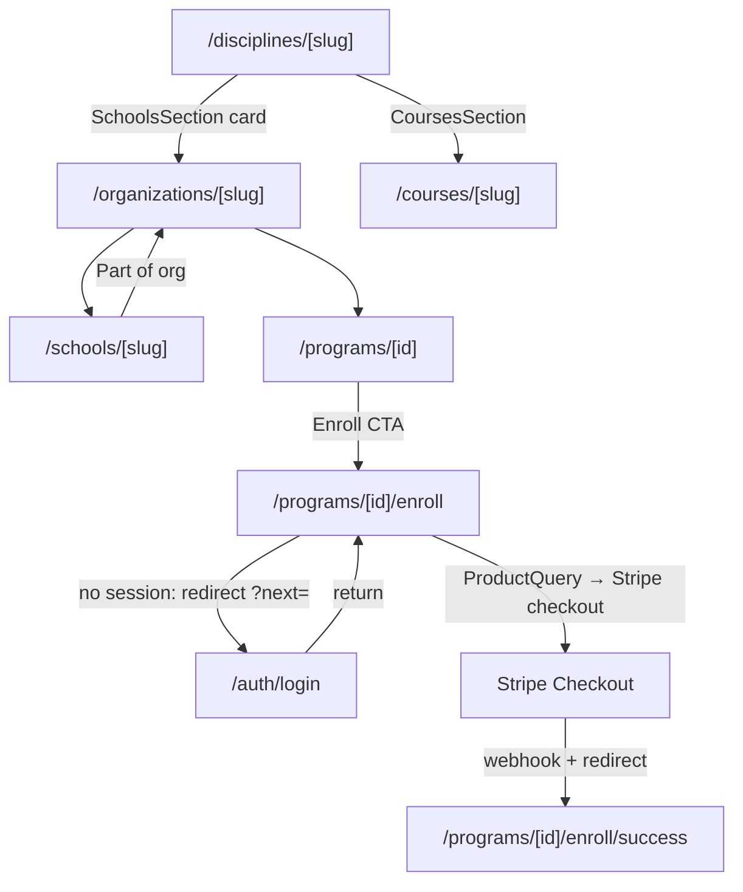
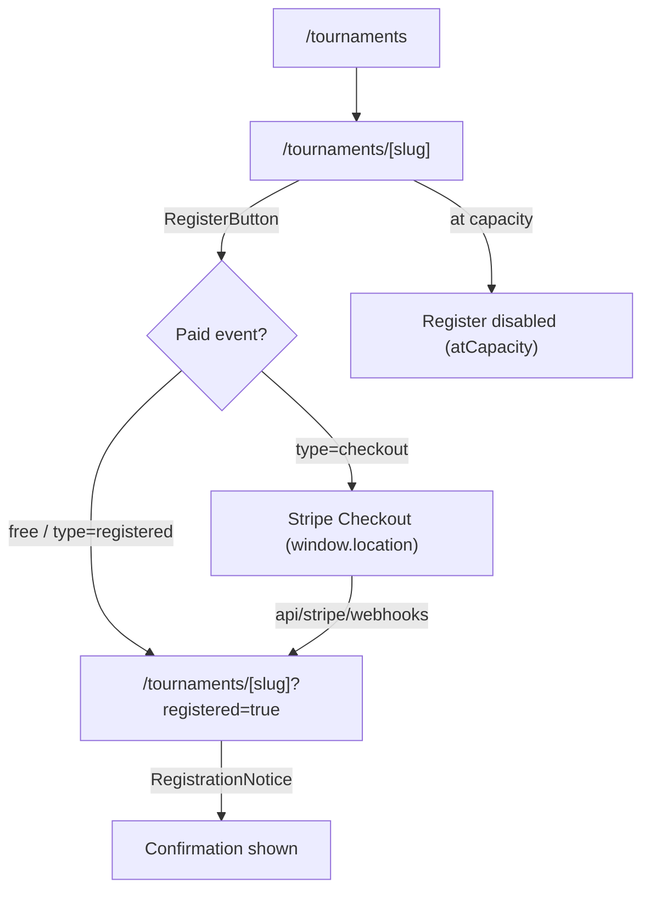

# Wiring Ledger — not-done, gaps, and handroll slips

## Summary

**This is the repo's canonical running P0/P1/P2 ledger.** Sessions _append_ findings (stable IDs
`WL-P0-N` / `WL-P1-N` / `WL-P2-N`) and _resolve_ rows here rather than duplicating a severity list into
every SESSION file — that pattern rots (see how `wiki/log.md` drifted). Per-session findings still live
in each SESSION file's `### Findings (severity ≥ medium)` block, which should backlink here. The closing
ritual's optional items include updating this ledger when a session surfaces or clears wiring debt.

A living ledger of incomplete wiring, storage gaps, and raw handrolled components that slipped the
FS-0001 primitive-composition rule across the Baseline Martial Arts public surfaces. Created at
SESSION_0304 from a Desi audit of `apps/web/app/(web)` + `apps/web/components/web`. **Headline:
zero P0s** — the public surfaces are genuinely well-wired (discipline → school → program → enroll and
tournament register flows all resolve through real routes / Stripe checkout). This is a consistency
ledger, not a stub farm. Items marked ✅ were resolved during SESSION_0304; the rest are tracked
follow-ups, not silent nulls.

## Key Ideas

- The codebase is honest: every public CTA audited resolves to a real route or server action.
- The remaining debt is **structural/cosmetic** (FS-0001 handroll slips, one "coming soon" stub),
  not broken wiring.
- `localStorage`/`sessionStorage` usage is SSR-safe and read/write-paired — no orphan persistence.

## P0 — broken / dead public wiring

**None found.** Traced CTAs all resolve:

- Program enroll: `app/(web)/programs/[id]/page.tsx:184` → `enroll/page.tsx` → `ProductQuery` checkout
  (auth-gated redirect at `enroll/page.tsx:50`).
- Tournament register: `components/web/tournaments/register-button.tsx:66` → `createRegistrationCheckout`
  → Stripe URL.
- Discipline/school cross-links resolve to real slugs (`disciplines/[slug]/page.tsx:181,285`,
  `schools/[slug]/page.tsx:138,354`).

## P1 — should-fix

| ID      | File:line                                                                                                                          | Category                         | Finding                                                                                                                                                                                                                                                                                                                                                                                                                 | Status                                                                                                                                                                                                                                                                                                                                                                                                                                                                                                                                                                                                                                                                                                     |
| ------- | ---------------------------------------------------------------------------------------------------------------------------------- | -------------------------------- | ----------------------------------------------------------------------------------------------------------------------------------------------------------------------------------------------------------------------------------------------------------------------------------------------------------------------------------------------------------------------------------------------------------------------- | ---------------------------------------------------------------------------------------------------------------------------------------------------------------------------------------------------------------------------------------------------------------------------------------------------------------------------------------------------------------------------------------------------------------------------------------------------------------------------------------------------------------------------------------------------------------------------------------------------------------------------------------------------------------------------------------------------------- |
| WL-P1-1 | `app/(web)/certificates/verify/[code]/page.tsx:31`                                                                                 | Handroll (FS-0001)               | Public cert-verify result card was a raw `
`, not `Card`. A public trust surface diverging from every branded card.                                                                                                                                                                                                                                                                  | ✅ Fixed — swapped to `~/components/common/card::Card`                                                                                                                                                                                                                                                                                                                                                                                                                                                                                                                                                                                                                                                     |
| WL-P1-2 | `app/(web)/programs/[id]/schedules/[scheduleId]/page.tsx:121`                                                                      | Handroll (empty state)           | Empty session list used a raw `
` instead of `EmptyList`.                                                                                                                                                                                                                                                                                                                       | ✅ Fixed — swapped to `~/components/common/empty-list::EmptyList`                                                                                                                                                                                                                                                                                                                                                                                                                                                                                                                                                                                                                                          |
| WL-P1-3 | `components/admin/tournaments/registration-actions.tsx`; `app/admin/{leads,tools,tags,categories,users}/_components/*-actions.tsx` | Dead handler (Base UI semantics) | `DropdownMenuItem onSelect={…}` without `onClick` — Base UI `Menu.Item` activates on `onClick` and has no `onSelect` (it resolves to the `
` text-selection event). D-016 migration gap (scanned imports, not Menu.Item semantics). Tournament Approve/Waitlist, lead Nurture/Lost, tool/tag/category Duplicate, user Ban/Unban/Revoke likely silently no-op.                                                       | ✅ Fixed — SESSION_0334 swept all 11 instances across 6 files (`user-actions.tsx` was beyond the original list) to `onClick`-only + added a `bun test` regression guard (`components/common/dropdown-menu.guard.test.ts`) anchored to `DropdownMenuItem`. Drift D-016 closed.                                                                                                                                                                                                                                                                                                                                                                                                                              |
| WL-P1-4 | `apps/web/components/web/lineage/lineage-search-bar.tsx`; `apps/web/lib/lineage/rank-progression.ts`                               | Test coverage (privacy)          | No dedicated test that the public lineage search can't surface non-PUBLIC members, nor that rank-progression on a public node leaks no PII. Implied by the payload allowlist (`queries.visibility.test.ts`) but unasserted for these SESSION_0331/0332 surfaces.                                                                                                                                                        | ✅ Fixed — SESSION_0334 added `lib/lineage/search.privacy.test.ts` (real materializer → extracted `lib/lineage/search.ts` matcher; PRIVATE/RESTRICTED unsearchable) and `lib/lineage/rank-progression.privacy.test.ts` (adversarial-PII allowlist proof — caught + hardened a whole-`discipline`-object passthrough in `buildBeltProgressions`).                                                                                                                                                                                                                                                                                                                                                           |
| WL-P1-5 | `.github/workflows/`                                                                                                               | CI enforcement gap               | `bun test` (incl. the invariant guards) + `biome` ran on **no** automated gate — only `playwright.yml` (e2e) + Vercel's build typecheck existed, and there are no git hooks. So the SESSION_0333/0334 guards didn't actually gate, and SESSION_0334 called the dropdown guard "CI-verified" inaccurately.                                                                                                               | ✅ Fixed & **green** — SESSION_0335 added `.github/workflows/ci.yml` (Biome `biome ci` + typecheck + unit tests against a Postgres service, least-privilege perms), hardened `playwright.yml` perms, cleared 8 latent `biome ci` errors. Getting the unit job green also required: workflow-level dummy `DATABASE_URL` (apps/web postinstall runs `prisma generate`), `bun run test` (not `bun test`, to honor `--path-ignore-patterns='e2e/**'`), an email no-op guard (`lib/email.ts` crashed when Resend unconfigured — also quiets e2e), and a `prisma db seed` step. All 3 jobs pass (run `26889391880`). See [verification-and-testing](../../runbooks/dev-environment/verification-and-testing.md). |
| WL-P1-6 | `apps/web/server/admin/entitlements/actions.ts`                                                                                    | Audit gap (entitlements)         | `grantUserEntitlement` / `revokeUserEntitlement` were admin-gated but wrote `UserEntitlement` rows directly with no `AuditLog`. Because the schema accepted any `entitlementKey`, that path could mint or revoke `LINEAGE_PREMIUM` / `LINEAGE_ELITE` outside the audited comp spine.                                                                                                                                    | ✅ Fixed — SESSION_0347 routes the generic admin path through `server/entitlements/admin-grants.ts`, writing `entitlement.admin.granted` / `entitlement.admin.revoked` before mutation while preserving the S3-upload toggle. Regression proof: `server/admin/entitlements/actions.safe-action.test.ts` covers unauth/non-admin/admin wrappers plus audit-before-mutation for grant/revoke.                                                                                                                                                                                                                                                                                                                |
| WL-P1-7 | `apps/web/components/common/select.tsx`; ~17 id-valued consumers                                                                   | Bug (Base UI label)              | Base UI `Select` renders the raw `value` (a cuid/slug) in the trigger when a value is preset from DB/URL and the popup hasn't mounted — because the item labels aren't registered until open. Affects every id-valued Select (rank "select for display", org/user/tier/technique/discipline/mat/fight/schedule/program/content selects). Surfaced SESSION_0353 from an operator report of rank dropdowns showing cuids. | ✅ Resolved (SESSION_0354) — added `components/common/data-select.tsx` (`DataSelect` wrapper + `buildSelectItems`) with a render test asserting the trigger shows the label not the id. `school-filters`/`technique-filters` converted to `DataSelect`; the new claim form dogfoods it; the remaining ~30 id/enum `Select.Root` consumers received the inline `items` fix (FormControl-wrapped / sentinel-item cases where the flat wrapper doesn't fit). `tool-filters` documented exception (option labels are `ReactNode`). Go-forward: use `DataSelect` for id/slug Selects. Follow-up enhancement → WL-P2-12.                                                                                         |

## P2 — nice-to-have / follow-up (deferred, tracked here)

| ID             | File:line                                                                                                                                                                                                                                                                                                                                                                                                                                                                                                                                                                                                                                                                                                                         | Category                                                                                                                                                                                                       | Finding                                                                                                                                                                                                                                                                                                                                                                                                                                                                                                                                                                                                                                                                                                                                                                                                                                                                                                                    | Action                                                                                                                                                                                                                                                                                                                                                                                                                                                                                                                                                                                                                                                                                                                                                                                                                                                                                                                                                                                                                                                                                                                                                                                                                                                                                                                                                                                                                                                                                                                                                                |
| -------------- | --------------------------------------------------------------------------------------------------------------------------------------------------------------------------------------------------------------------------------------------------------------------------------------------------------------------------------------------------------------------------------------------------------------------------------------------------------------------------------------------------------------------------------------------------------------------------------------------------------------------------------------------------------------------------------------------------------------------------------- | -------------------------------------------------------------------------------------------------------------------------------------------------------------------------------------------------------------- | -------------------------------------------------------------------------------------------------------------------------------------------------------------------------------------------------------------------------------------------------------------------------------------------------------------------------------------------------------------------------------------------------------------------------------------------------------------------------------------------------------------------------------------------------------------------------------------------------------------------------------------------------------------------------------------------------------------------------------------------------------------------------------------------------------------------------------------------------------------------------------------------------------------------------- | --------------------------------------------------------------------------------------------------------------------------------------------------------------------------------------------------------------------------------------------------------------------------------------------------------------------------------------------------------------------------------------------------------------------------------------------------------------------------------------------------------------------------------------------------------------------------------------------------------------------------------------------------------------------------------------------------------------------------------------------------------------------------------------------------------------------------------------------------------------------------------------------------------------------------------------------------------------------------------------------------------------------------------------------------------------------------------------------------------------------------------------------------------------------------------------------------------------------------------------------------------------------------------------------------------------------------------------------------------------------------------------------------------------------------------------------------------------------------------------------------------------------------------------------------------------------- |
| WL-P2-1        | `lineage-profile-drawer/drawer-header.tsx` (was `lineage-profile-drawer.tsx:352-355`, pre-split)                                                                                                                                                                                                                                                                                                                                                                                                                                                                                                                                                                                                                                  | Stub                                                                                                                                                                                                           | "Manage verification (coming soon)" `disabled` dropdown item — correctly inert, but a visible unfinished promise on a public profile drawer.                                                                                                                                                                                                                                                                                                                                                                                                                                                                                                                                                                                                                                                                                                                                                                               | ✅ Resolved (SESSION*0506) — **removed** the item + orphaned separator + unused imports (operator chose \_remove* over admin-gate/roadmap: inert, no-ETA "coming soon" is UI debt). No e2e asserted it; menu is admin-gated regardless.                                                                                                                                                                                                                                                                                                                                                                                                                                                                                                                                                                                                                                                                                                                                                                                                                                                                                                                                                                                                                                                                                                                                                                                                                                                                                                                               |
| WL-P2-2        | `app/admin/tools/_components/tool-actions.tsx:44`                                                                                                                                                                                                                                                                                                                                                                                                                                                                                                                                                                                                                                                                                 | TODO (admin)                                                                                                                                                                                                   | `// TODO: Think about how to handle unique website URLs or remove this feature` — handler is fully wired; design-debt comment, not dead code. No public risk.                                                                                                                                                                                                                                                                                                                                                                                                                                                                                                                                                                                                                                                                                                                                                              | Resolve or convert to a tracked backlog item.                                                                                                                                                                                                                                                                                                                                                                                                                                                                                                                                                                                                                                                                                                                                                                                                                                                                                                                                                                                                                                                                                                                                                                                                                                                                                                                                                                                                                                                                                                                         |
| WL-P2-3        | `app/(web)/programs/[id]/schedules/[scheduleId]/page.tsx:130`, `components/web/schedules/schedule-instructor-list.tsx:81`, `components/web/lineage/lineage-rank-history-tab.tsx:97`                                                                                                                                                                                                                                                                                                                                                                                                                                                                                                                                               | Handroll (row)                                                                                                                                                                                                 | Repeated `rounded-md border p-3` list-row blocks (3+ instances). These are _rows_, not cards — acceptable today.                                                                                                                                                                                                                                                                                                                                                                                                                                                                                                                                                                                                                                                                                                                                                                                                           | Extract a `ListRow` atom only if a 4th instance appears (YAGNI until then).                                                                                                                                                                                                                                                                                                                                                                                                                                                                                                                                                                                                                                                                                                                                                                                                                                                                                                                                                                                                                                                                                                                                                                                                                                                                                                                                                                                                                                                                                           |
| WL-P2-4        | `app/(web)/disciplines/_components/black-belt-rail.tsx`                                                                                                                                                                                                                                                                                                                                                                                                                                                                                                                                                                                                                                                                           | Schema follow-up                                                                                                                                                                                               | Belt-color now renders from `Rank.colorHex` (added SESSION_0304). Rows fall back to a muted token when `colorHex` is null — ranks without a seeded color show no belt color.                                                                                                                                                                                                                                                                                                                                                                                                                                                                                                                                                                                                                                                                                                                                               | Seed `Rank.colorHex` for all system rank sets (data task, not schema). Surface as a note per LLM Wiki rule 8 — do not change schema from this ledger.                                                                                                                                                                                                                                                                                                                                                                                                                                                                                                                                                                                                                                                                                                                                                                                                                                                                                                                                                                                                                                                                                                                                                                                                                                                                                                                                                                                                                 |
| WL-P2-5        | `components/web/lineage/lineage-profile-drawer.tsx:177`                                                                                                                                                                                                                                                                                                                                                                                                                                                                                                                                                                                                                                                                           | Dead wiring (incomplete refactor)                                                                                                                                                                              | `DrawerBody` destructures + types `treeId?: string` but never reads it — biome `noUnusedFunctionParameters` warning. Almost certainly plumbing threaded in for the unfinished "Manage verification (coming soon)" feature in the **same file** (WL-P2-1). Not a bug; dead wiring for a planned feature.                                                                                                                                                                                                                                                                                                                                                                                                                                                                                                                                                                                                                    | ✅ Resolved (SESSION_0454) — removed the dead `treeId?: string`. The ledger path is stale: the single-file `DrawerBody` was since split into `lineage-profile-drawer/`, so `treeId` survived only as an optional prop on `LineageProfileDrawerProps` (`drawer-types.ts:52`) + one never-read pass-through (`lineage-tree-board.tsx:240`). Confirmed never consumed anywhere (whole-app grep + typecheck). WL-P2-1's "Manage verification (coming soon)" is a parked `disabled` stub, not in-flight work, and `treeId` is in scope at the call site → trivially re-threadable if the feature ever lands. Removed type field + pass-through; typecheck/oxlint/oxfmt clean, behavior unchanged.                                                                                                                                                                                                                                                                                                                                                                                                                                                                                                                                                                                                                                                                                                                                                                                                                                                                          |
| WL-P2-6        | `docs/knowledge/wiki/concepts/enter-the-dojo-schema-intake.md`; `apps/web/prisma/schema.prisma`                                                                                                                                                                                                                                                                                                                                                                                                                                                                                                                                                                                                                                   | Schema/product follow-up                                                                                                                                                                                       | Legacy `ENTER_THE_DOJO.md` recommends a tournament public content shell. Current schema has tournament transactional truth plus `ContentAtom`/`ContentVariant` and generic `Event`, but no explicit decision on whether public tournament content belongs in content variants, events, or a one-to-one `TournamentContent` model.                                                                                                                                                                                                                                                                                                                                                                                                                                                                                                                                                                                          | ✅ Resolved — SESSION_0574 (operator MC grill): direction = public tournament content lives in the existing **ContentAtom/ContentVariant** system, linked by reference to transactional `Tournament` truth; no `TournamentContent` model, no Event folding. Schema lands only with the first consuming feature (likely the WEKAF lane). Decided-direction, no table added — exactly per this row's own corrective note.                                                                                                                                                                                                                                                                                                                                                                                                                                                                                                                                                                                                                                                                                                                                                                                                                                                                                                                                                                                                                                                                                                                                                                                                                                                                                                                                                                                                     |
| WL-P2-7        | `docs/knowledge/wiki/concepts/enter-the-dojo-schema-intake.md`; `LineageTreeMember` / `Membership` / `Role`                                                                                                                                                                                                                                                                                                                                                                                                                                                                                                                                                                                                                       | Schema/product follow-up                                                                                                                                                                                       | Legacy `org_chart_nodes` idea is still useful, but current lineage trees, memberships, and roles each own part of the concept. A staff authority chart needs a product decision before schema.                                                                                                                                                                                                                                                                                                                                                                                                                                                                                                                                                                                                                                                                                                                             | ✅ Resolved — SESSION_0574 (operator MC grill): direction = **derive, don't model** — staff-authority display composes existing `Membership.role` + `Affiliation` (+ `Rank` where relevant); no `OrgChartNode` model, no LineageTree conflation (lineage ≠ staff authority; BBL school linkage stays Affiliation-based). Revisit only if a product story needs arbitrary chart shapes.                                                                                                                                                                                                                                                                                                                                                                                                                                                                                                                                                                                                                                                                                                                                                                                                                                                                                                                                                                                                                                                                                                                                                                                                                                                                                                                                                                                                 |
| WL-P2-8        | `docs/architecture/repo-alignment-report.md`; `/app/billing/monitoring`; `/app/storage/monitoring` (paths conformed SESSION_0575 — `/admin/*` retired)                                                                                                                                                                                                                                                                                                                                                                                                                                                                                                                                                                                                                            | Automation/pulse follow-up                                                                                                                                                                                     | Existing monitors are admin pages/on-demand queries. There is no durable Vercel Cron/pulse layer that sends owner-readable app/site/security/storage/docs health digests.                                                                                                                                                                                                                                                                                                                                                                                                                                                                                                                                                                                                                                                                                                                                                  | After Brian supplies the pulse summary, design the first pulse route: secret guard, recipients, cadence, failure policy, and whether it wraps billing/storage/wiki/Graphify/site smoke checks.                                                                                                                                                                                                                                                                                                                                                                                                                                                                                                                                                                                                                                                                                                                                                                                                                                                                                                                                                                                                                                                                                                                                                                                                                                                                                                                                                                        |
| WL-P2-9        | `docs/architecture/decisions/0008-brand-switcher.md`; `docs/knowledge/wiki/manual-boundary-registry.md#mb-003`                                                                                                                                                                                                                                                                                                                                                                                                                                                                                                                                                                                                                    | Runtime proof follow-up                                                                                                                                                                                        | ADR 0008 is accepted and `User.lastActiveBrandId` exists, but the visible admin/multi-brand switcher flow and reload persistence proof are still open.                                                                                                                                                                                                                                                                                                                                                                                                                                                                                                                                                                                                                                                                                                                                                                     | ✅ Resolved — SESSION_0575: superseded by the single-brand collapse (ADR 0034). Multi-brand switching is dead, so the switcher/`activeBrandId` proof can never land; ADR 0008 marked superseded, MB-003 closed. (Historical caution kept: host-derived brand chrome (ADR 0022) was never the same thing as app-data brand switching.)                                                                                                                                                                                                                                                                                                                                                                                                                                                                                                                                                                                                                                                                                                                                                                                                                                                                                                                                                                                                                                                                                                                                                                                                                                                                                                                                                                                                        |
| WL-P2-10       | `apps/web/package.json`; `apps/web/components/admin/sidebar.tsx`; `scripts/fix-architecture-markdownlint.ts`                                                                                                                                                                                                                                                                                                                                                                                                                                                                                                                                                                                                                      | Fallow cleanup follow-up                                                                                                                                                                                       | `npx fallow audit --changed-since HEAD` reports 4 dependency-hygiene candidates (`@ai-sdk/google`, `github-slugger`, `tailwind-merge`, `@react-email/preview-server`) and complexity hotspots in the admin sidebar plus the markdownlint fixer. This is broader than the repo-alignment/doc-admin slice.                                                                                                                                                                                                                                                                                                                                                                                                                                                                                                                                                                                                                   | **Triaged SESSION_0353:** `tailwind-merge` = **KEEP** (runtime peer of `tailwind-variants` used in `lib/utils.ts` `cx`; shipped in `.next` chunks — fallow false-positive). `@react-email/preview-server` = **KEEP** (runtime dep of the `email dev` script, `package.json:13` — false-positive). `@ai-sdk/google` + `github-slugger` = **confirmed unused** (no source/script/config/dynamic refs) → removable. **Removal deferred:** three lockfiles (`apps/web/bun.lock`, `apps/web/package-lock.json`, root `pnpm-lock.yaml`) must be regenerated together or the Vercel/pnpm deploy breaks — do it in a dedicated deps session. Sidebar/markdownlint-fixer complexity still deferred. **✅ Deps resolved (SESSION_0354):** removed `@ai-sdk/google` + `github-slugger`; regenerated all 3 lockfiles together; `pnpm install --frozen-lockfile` (Vercel install) verified green; 0 refs remain in any lockfile. `tailwind-merge`/`@react-email/preview-server` left as confirmed false-positives; sidebar/markdownlint complexity still deferred. **Re-verified SESSION_0454 (Slice 3 = no-op):** the only remaining fallow direct-dep flags are `react-email` (backs the `email dev` script) + `react-dom` (core React renderer) — documented false-positives; nothing provably-unused remains to remove.                                                                                                                                                                                                                                                        |
| WL-P2-12       | `apps/web/components/common/data-select.tsx`; rank/school/instructor selects; `tool-filters.tsx`                                                                                                                                                                                                                                                                                                                                                                                                                                                                                                                                                                                                                                  | Enhancement (operator-requested, SESSION_0354)                                                                                                                                                                 | `DataSelect` currently takes a string-only `label`. Rich dropdown-row labels would add real signal: belt-color swatches on rank selects (`Rank.colorHex`), school logos on school/org selects, instructor avatars (`passport.avatarUrl ?? user.image`) on instructor/user selects, and the per-option `count` (already fetched by `findFilterOptions`) on the filters.                                                                                                                                                                                                                                                                                                                                                                                                                                                                                                                                                     | **Next session (operator-requested):** extend `DataSelect` with an optional ReactNode dropdown-row label (e.g. `renderLabel?(option)⇒ReactNode` or `option.content?`) while keeping the required `label: string` for the collapsed trigger + a11y + typeahead; add a render test (trigger shows string, row shows ReactNode); ship belt swatches first, then logos/avatars/counts; move `tool-filters` back onto `DataSelect` (its ReactNode exception disappears).                                                                                                                                                                                                                                                                                                                                                                                                                                                                                                                                                                                                                                                                                                                                                                                                                                                                                                                                                                                                                                                                                                   |
| WL-P2-13       | `apps/web/server/admin/claims/*`; `app/(web)/organizations/[slug]`, `schools/[slug]`                                                                                                                                                                                                                                                                                                                                                                                                                                                                                                                                                                                                                                              | Claim feature follow-up (SESSION_0354)                                                                                                                                                                         | The generic claim system shipped but: (a) no `/directory`/`/organizations`/`/schools` "Claim this organization" CTA for owner-less orgs yet (only placeholder persons get the teaser); (b) person-claim approval is a flagged manual placeholder→account merge (not automated); (c) UI paths are typecheck/test-green but **not browser-verified** (unattended session).                                                                                                                                                                                                                                                                                                                                                                                                                                                                                                                                                   | Next: dev-login Playwright smoke (teaser → claim → admin approve → org `ownerId` set); add the org-claim CTA banner; optionally build the person placeholder→account merge reusing the lineage placeholder-transfer logic. See `SESSION_0354_FINDING_01`.                                                                                                                                                                                                                                                                                                                                                                                                                                                                                                                                                                                                                                                                                                                                                                                                                                                                                                                                                                                                                                                                                                                                                                                                                                                                                                             |
| WL-P2-11       | `apps/web/components/web/directory/*`; `apps/web/components/common/combobox-selector.tsx`                                                                                                                                                                                                                                                                                                                                                                                                                                                                                                                                                                                                                                         | Polish (Desi defer)                                                                                                                                                                                            | Desi SESSION_0353 review deferred (budget = 3 fixes, spent on combobox parity + accessible clear + reduced-motion): combobox popover wider than trigger on desktop (`min-w-72` vs `sm:w-56`); facet-tab active-pill `layoutId` slide motion; result-card hover lift + grid load stagger (motion-system.md:110-111); Region/City normalization at the `filter-options` server layer; org-facet label drift ("Schools & Orgs" vs "schools & organizations"); active-filter chip affordance.                                                                                                                                                                                                                                                                                                                                                                                                                                  | Pick up in a directory-polish/motion session; all reduced-motion-guarded per motion-system.md.                                                                                                                                                                                                                                                                                                                                                                                                                                                                                                                                                                                                                                                                                                                                                                                                                                                                                                                                                                                                                                                                                                                                                                                                                                                                                                                                                                                                                                                                        |
| WL-P2-14       | `apps/web/server/web/directory/queries.ts:205`; `apps/web/app/(web)/directory/[slug]/_components/directory-profile/index.tsx`; `apps/web/components/web/profile/profile-hero.tsx`                                                                                                                                                                                                                                                                                                                                                                                                                                                                                                                                                 | Feature gap (render not wired)                                                                                                                                                                                 | `DirectoryProfile.coverPhotoUrl` is correctly stored (upload → `uploadMedia` → S3 → `updateDirectoryProfile` → DB), in the read model (`directoryProfileDetailPayload` + DTO line 205), and editable in the profile form. But no public-facing component renders it — `ProfileHero` has no `coverPhotoUrl` prop, and the `/directory/[slug]` page doesn't render a cover image. Logged in SESSION_0431 FI-007 Track B.                                                                                                                                                                                                                                                                                                                                                                                                                                                                                                     | ✅ Fixed (SESSION_0434) — `ProfileHero` gained a `coverPhotoUrl?: string \| null` prop (background image + legibility scrim), threaded through the placeholder teaser (`ProfileClaimTeaser`) and the owner live-preview (`passport-editor`). The **claimed** public profile renders via `ListingDetail` (NOT `ProfileHero`), so a new page-local `ProfileCoverBanner` renders the cover above the hero there. Browser-verified: dev-login as admin owner → `/directory/brian-scott` (full profile) shows the cover.                                                                                                                                                                                                                                                                                                                                                                                                                                                                                                                                                                                                                                                                                                                                                                                                                                                                                                                                                                                                                                                   |
| WL-P2-15       | `apps/web/server/web/directory/queries.ts:206`; `apps/web/app/(web)/directory/[slug]/_components/directory-profile/index.tsx`                                                                                                                                                                                                                                                                                                                                                                                                                                                                                                                                                                                                     | Feature gap (render not wired)                                                                                                                                                                                 | `DirectoryProfile.videoIntroUrl` follows the same pattern as WL-P2-14: stored in DB, editable in form, in the DTO, but never rendered in the public profile page. The form's non-upload path shows a `type="url"` `Input` for a YouTube/Vimeo URL, but the profile page has no video embed section. Logged in SESSION_0431 FI-007 Track B.                                                                                                                                                                                                                                                                                                                                                                                                                                                                                                                                                                                 | ✅ Fixed (SESSION_0434) — new `VideoIntroSection` on the `/directory/[slug]` claimed full-profile body renders a responsive 16:9 YouTube/Vimeo iframe via a new `lib/video-embed.ts::toVideoEmbedUrl` watch→embed normalizer (10 unit tests; handles youtu.be / watch / embed / shorts / vimeo, returns null for unrecognized so the section hides). Browser-verified: the YouTube embed loaded on Brian's profile.                                                                                                                                                                                                                                                                                                                                                                                                                                                                                                                                                                                                                                                                                                                                                                                                                                                                                                                                                                                                                                                                                                                                                   |
| WL-P2-16 ✅    | `apps/web/server/admin/leads/lineage-selections.ts` (resolver); `apps/web/app/app/leads/[id]/page.tsx` + `_components/lead-lineage-selections.tsx` (card)                                                                                                                                                                                                                                                                                                                                                                                                                                                                                                                                                                         | **RESOLVED — SESSION_0442 (Slice B)**                                                                                                                                                                          | The free/Tool `lead.meta` refs (`currentRankId`/`schoolOrgId`/`trainedUnderNodeId`/`representTreeId`) now resolve server-side and render as a "Lineage selections" card on `/app/leads/[id]` — registered = link + badge, custom = text — mirroring Slice A's claim-path card. **Surface decision:** lead detail only; the Pending Tool carries no FK to the Lead (refs live on `lead.meta`), so `/app/tools` is a deliberate non-target. 7 parser unit tests; browser-verified (registered links + custom text, console clean).                                                                                                                                                                                                                                                                                                                                                                                           |
| WL-P2-17 ✅    | `apps/web/server/admin/*/queries.ts` (~24 files; e.g. `age-groups`, `categories`, `entitlements`, `users/queries.ts:8-33`)                                                                                                                                                                                                                                                                                                                                                                                                                                                                                                                                                                                                        | **RESOLVED — SESSION_0456 (Slice 5)**                                                                                                                                                                          | The fallow target clones `dup:16999900` (31-line block × 24 instances) + `dup:c3bcb118` (26-line × 12) are gone from the audit. Extracted `server/admin/list-query.ts` for admin-list offset/order/date/operator where composition plus transaction/parallel list+count wrappers, then migrated the duplicated paginated admin query call sites while preserving each query's domain filters, base brand/access scopes, include/select shape, result keys, and `$transaction` vs `Promise.all` behavior. Remaining fallow clone groups are smaller inherited/domain-shape or schema duplicates, not the original query-builder scaffold.                                                                                                                                                                                                                                                                                   | Gates: typecheck 0; focused admin-query tests 13 pass across 5 files; fallow audit exit 0 with original WL-P2-17 clone IDs absent; Oxc/build/wiki gates recorded in SESSION_0456.                                                                                                                                                                                                                                                                                                                                                                                                                                                                                                                                                                                                                                                                                                                                                                                                                                                                                                                                                                                                                                                                                                                                                                                                                                                                                                                                                                                     |
| WL-P2-18 ✅    | `server/admin/tournaments/actions.ts` (`upsertDivision`, `scoreMatch`, bracket `seedable` branch); `server/admin/users/queries.ts` (`AddPersonOptions`)                                                                                                                                                                                                                                                                                                                                                                                                                                                                                                                                                                           | **RESOLVED — SESSION_0455 (Slice 4)**                                                                                                                                                                          | Extracted nullable-division FK normalization, bracket shape/round creation, seedable-entry assembly, BYE marking/advancement, and score+advance transaction helpers without changing the `tournamentAdminActionClient` contract. Removed the confirmed-dead `updateTournamentStatus` action plus its orphan schema and the dead `AddPersonOptions` type after zero-ref grep. `server/web/media/actions.ts:revalidateForTarget` was a lower-priority candidate in the original row, intentionally not part of the locked tournament-admin slice.                                                                                                                                                                                                                                                                                                                                                                            | Gates: typecheck 0; focused tournament tests 26 pass; headless scoring Playwright 1 pass; `next build` exit 0; fallow attribution `dead_code_introduced: 0`, `complexity_introduced: 0`, `duplication_introduced: 0`.                                                                                                                                                                                                                                                                                                                                                                                                                                                                                                                                                                                                                                                                                                                                                                                                                                                                                                                                                                                                                                                                                                                                                                                                                                                                                                                                                 |
| WL-P2-19       | `apps/web/server/web/entitlements/queries.ts:40` (`canUploadMedia`); `lib/safe-actions.ts:101` (`mediaUploadActionClient`); `app/app/users/_components/user-actions.tsx:37`                                                                                                                                                                                                                                                                                                                                                                                                                                                                                                                                                       | RBAC gap (capability gate + discoverability)                                                                                                                                                                   | **Operator-reported (SESSION_0452):** platform admins (Brian, Tony Hua) can't upload media from in-editor surfaces — `canUploadMedia` ORs S3*UPLOAD-entitlement / org-role / org-ownership but **never `User.role`**, so admins without those signals fail `mediaUploadActionClient` (`uploadMedia`/`fetchMedia`); the admin media \_library* works (it's `adminActionClient`). Also the user role editor hardcodes `["admin","user"]` — `tournament_director` not selectable though the enum + `updateUserRole` support it. Per-user grant CRUD ALREADY exists (audited `grantUserEntitlement` + `UploadGrantToggle` on `/app/users/[id]`) → the gap is discoverability + role-honoring gates, **not** a missing system. ⚠ watch: `uploadMedia` passes a caller-controlled `path` to `uploadToS3Storage` (could target `certificates/`/`claim-evidence/` — ties to risk #6). Petey+Giddy research-review in SESSION_0452. | ✅ **Fixed** (PR #168, merged `8029657e` SESSION_0453): `canUploadMedia` routed through `can(user,"media.manage")` (admins auto-covered) + `tournament_director` added to the role editor. Orig plan: (1) unblock now — grant the seeded `S3_UPLOAD` entitlement to the 2 admins via the existing audited UI (zero code, reversible); (2) durable — route `canUploadMedia` through `can(user,"media.manage")` (admin already `["*"]`) so future admins auto-covered (mind the 60s `user-entitlements-*` cache tag on role change); (3) add `tournament_director` to the role editor; (4) consolidate a per-user capabilities panel only if discoverability needs it. **Do NOT** add a new per-user permission table (5th authz system). PR route (authz).                                                                                                                                                                                                                                                                                                                                                                                                                                                                                                                                                                                                                                                                                                                                                                                                             |
| WL-P2-20       | `apps/web/server/admin/users/actions.ts:15` (`updateUser`), `:153` (`updateUserRole`)                                                                                                                                                                                                                                                                                                                                                                                                                                                                                                                                                                                                                                             | Audit gap + self-escalation (security)                                                                                                                                                                         | **SESSION_0452 RBAC review (Giddy):** both write `User.role` with **no `AuditLog`** and **no self-escalation guard** — any platform admin can silently promote anyone (incl. themselves) to `admin` (a risk #11 cross-org super-user). `deleteUsers` self-protects (`role:{not:"admin"}`) but the role-grant path doesn't. Directly unmet mitigation for security-register **#11** ("alert on unexpected `role:admin` grants"). Contrast: the entitlement-grant path (`grantUserEntitlement`→`admin-grants.ts`) IS audited (WL-P1-6) — the model to copy.                                                                                                                                                                                                                                                                                                                                                                  | ✅ **Fixed** (PR #168, merged `8029657e` SESSION_0453): `updateUser`/`updateUserRole` now write an `AuditLog` (before/after + acting admin) before mutation and block self-role-change; 6 real-DB tests. Orig plan: audit role changes before mutation (clone the `admin-grants.ts` pattern); block self-role-elevation; consider alerting on a new `role:admin`. PR route (authz).                                                                                                                                                                                                                                                                                                                                                                                                                                                                                                                                                                                                                                                                                                                                                                                                                                                                                                                                                                                                                                                                                                                                                                                   |
| WL-P2-21       | `LineageTree` rows (prod) `rigan-machado-bjj-lineage` (2× unpublished clones, ~16–17 members each); no admin UI for tree topology                                                                                                                                                                                                                                                                                                                                                                                                                                                                                                                                                                                                 | Data cruft + missing admin chrome (lineage)                                                                                                                                                                    | **SESSION_0453 FI-001 surfaced:** Brian Truelson's node belongs to THREE trees — the published canonical `rigan-machado-lineage` (77m, correct) **plus two leftover UNPUBLISHED `rigan-machado-bjj-lineage` clone trees** (same slug, brand-distinct per `@@unique[brand,slug]`) — residue of the PR #162 consolidation (the "extra clone rows" `[[lineage-branch-heads-and-tree-consolidation]]` warned about). The `send-bbl-truelson-thankyou.ts --verify` false-negatived on these (now fixed to prefer the published membership). There is **no admin CRUD/chrome for managing tree branches/subtrees**, so cleanup is hand-SQL today.                                                                                                                                                                                                                                                                                | Audit FULL prod published-trees; remove/merge the duplicate unpublished `rigan-machado-bjj-lineage` clones + Brian's redundant memberships (verify against PROD, not the snapshot). Build **admin branch/subtree CRUD + chrome** so tree topology is operator-manageable. **Blocks the FI-001 send** (operator: ledger debt → ≈zero so Brian lands on a bug-free MVP). → **Clone-membership cleanup ✅ RESOLVED (SESSION_0457, SURGICAL):** removed Brian's 2 redundant clone memberships (`scripts/remove-brian-clone-memberships.ts`, guarded + JSON-backup + reversible; applied to PROD); `--verify` → CLAIMED. **Clone TREES KEPT** — coverage audit proved each is the sole home of 4 founders missing from canonical → drift **D-034**. → **Clone TREES ✅ REMOVED (SESSION_0508):** D-034 resolved first (4 founders migrated to canonical, 0 orphans), then `scripts/remove-residual-lineage-clones.ts` (guarded refuse-if-orphan/refuse-published + JSON backup) deleted both unpublished clones on PROD (31 member rows, 6 groups, 1 stale operator test-claim cascaded per operator go); canonical untouched (80m). Backup `/tmp/residual-lineage-clones-backup-1783453747508.json`. **Remaining (still open):** admin branch/subtree CRUD + chrome — rolls into the AdminCollection admin-surface lane ([[admin-collection-one-surface-law]]), not a bespoke build.                                                                                                                                                                                      |
| WL-P2-22       | `apps/web/components/web/lineage/lineage-tree-board.tsx:90` (`LineageTreeBoard`)                                                                                                                                                                                                                                                                                                                                                                                                                                                                                                                                                                                                                                                  | Complexity hotspot (fallow)                                                                                                                                                                                    | **SESSION_0454 fallow-fix-loop surfaced (not introduced):** `LineageTreeBoard` is **CRAP 1190 · cyclomatic 34 · cognitive 18 · 159 LOC (CRITICAL)** — the largest function fallow flags in the changed set; `descendantMemberIds:70` (CRAP 90, HIGH) is a secondary hotspot in the same file. The WL-P2-5 dead-`treeId` removal merely sits in it (took it 160→159 LOC); the bloat is pre-existing.                                                                                                                                                                                                                                                                                                                                                                                                                                                                                                                        | ✅ **Fixed — SESSION_0500** (Doug SHIP 9.7, shipped to prod): extracted 5 pure fns → `lineage-tree-board-model.ts` + 19 unit tests. **CRAP 1190→240 (−80%) · cyclomatic 34→15 · cognitive 18→7**; behavior-preserving (lineage e2e 12/12 serial; Doug verified faithful extraction, one inert `undefined→null` tightening).                                                                                                                                                                                                                                                                                                                                                                                                                                                                                                                                                                                                                                                                                                                                                                                                                                                                                                                                                                                                                                                                                                                                                                                                                                           |
| WL-P2-23       | `apps/web/components/web/lineage/lineage-ancestry-timeline.tsx` (ancestor entries) ← `server/web/lineage/ancestry.ts:46-49` (`entry.slug`)                                                                                                                                                                                                                                                                                                                                                                                                                                                                                                                                                                                        | Dead plumbing (unconsumed seam)                                                                                                                                                                                | **SESSION_0493 Desi review:** the ancestry payload ships a per-ancestor `slug` deep-link seam that the timeline component never consumes — every ancestor (Bob Bass, Rigan, the Gracies) is inert on the surface built to celebrate them. Ancestor discovery feeds the claim loop (BBL north star).                                                                                                                                                                                                                                                                                                                                                                                                                                                                                                                                                                                                                        | Wrap non-owner avatar+name in `Link` for entries with a slug; route target (lineage drawer vs /directory/[slug]) is a Petey call. Bundle with FI-016 / phase-2.                                                                                                                                                                                                                                                                                                                                                                                                                                                                                                                                                                                                                                                                                                                                                                                                                                                                                                                                                                                                                                                                                                                                                                                                                                                                                                                                                                                                       |
| WL-P3-24 ✅       | `apps/web/components/common/creatable-combobox.tsx` ← `components/common/form.tsx:92-101` (FormControl slot props)                                                                                                                                                                                                                                                                                                                                                                                                                                                                                                                                                                                                                | a11y gap (sibling of the healed ComboboxSelector)                                                                                                                                                              | **SESSION_0496 Giddy:** `CreatableCombobox` is a separate primitive that still drops FormControl's slot-injected `id`/`aria-describedby`/`aria-invalid` — the same dangling-label gap `ComboboxSelector` had before SESSION_0496 forwarded them. Every creatable form combobox announces unlabeled.                                                                                                                                                                                                                                                                                                                                                                                                                                                                                                                                                                                                                        | ✅ Resolved SESSION_0631 (PR #256; renumbered from the duplicate SESSION_0622 at the SESSION_0624 coffee merge) — `CreatableCombobox` now accepts `id`, `aria-describedby`, and `aria-invalid` via the same `Pick<ButtonProps,…>` trigger-prop path as `ComboboxSelector`, while preserving the legacy `ariaDescribedBy` prop. Automated verification: typecheck + oxlint + oxfmt check green; operator-side label-click smoke skipped per headless boundary.                                                                                                                                                                                                                                                                                                                                                                                                                                                                                                                                                                                                                                                                                                                                                                                                                                                                                                                                                                                                                                                                                                                                                                                                                                                                                                                                                                                                                                                |
| WL-P3-25 ✅       | A0.5 deferred LOW bundle (SESSION_0496 Desi/Doug P3s) — `students-carousel-v2.tsx:118`, `lib/countries.ts`, `node-profile-schemas.ts`, `e2e/auth/registration.spec.ts:29`, `passport/schemas.ts`, `canvas-model.test.ts`                                                                                                                                                                                                                                                                                                                                                                                                                                                                                                          | Polish debt (bundled)                                                                                                                                                                                          | Mobile "N students" count wraps under long belt labels (add `shrink-0 whitespace-nowrap`); country validators triplicated (`public-actions.ts` / `lead-country.ts` / `node-profile-schemas.ts`) → consolidate one `normalizeCountryCode` into `lib/countries.ts`; node-profile country is shape-checked but not COUNTRIES-allowlisted; registration spec line 29 carries the default 5s timeout (siblings use 30s — the one CI flake source); passport `locationCountry` lacks `.trim()` parity with the node-profile variant; `memberSchool` pure-placeholder null unit pin missing.                                                                                                                                                                                                                                                                                                                                      | ⚙ Partially resolved (SESSION_0506) — **student-count no-wrap DONE** (`min-w-0` label + `shrink-0 whitespace-nowrap` count) in BOTH `students-carousel-v2.tsx` (cited) and `students-carousel.tsx` (V1 default). REMAINING open (non-visible, different axis): country-validator consolidation, registration-spec 5s→30s timeout, passport `.trim()` parity, memberSchool null unit. — **✅ RESOLVED SESSION_0614** (lane wl-p3-25 / recorded SESSION_0615): shared `normalizeCountryCode` in `lib/countries.ts` with call sites repointed, node-profile COUNTRIES-allowlisted, passport `.trim()` parity, memberSchool placeholder-null pin; registration timeout was already 30s (sub-item stale).                                                                                                                                                                                                                                                                                                                                                                                                                                                                                                                                                                                                                                                                                                                                                                                                                                                                                                                                                                                                                                                                                                                                                                                  |
| WL-P3-26       | `apps/web/components/web/lineage/students-carousel.tsx:78` (V1 rail section)                                                                                                                                                                                                                                                                                                                                                                                                                                                                                                                                                                                                                                                      | Latent width trap (frozen for the bake-off)                                                                                                                                                                    | **SESSION_0496 Desi:** V1 carries the same max-content width defect V2's P1 fixed (bare `<section>` + `overflow-x-auto` that can't engage under the InfoTab `items-start` Stack) — masked today because small avatar circles usually fit. Do NOT touch during the bake-off (V1 is the frozen baseline).                                                                                                                                                                                                                                                                                                                                                                                                                                                                                                                                                                                                                    | Dies with V1 if V2 wins (FI-018); if V1 wins, apply the same `w-full min-w-0` fix + live re-verify.                                                                                                                                                                                                                                                                                                                                                                                                                                                                                                                                                                                                                                                                                                                                                                                                                                                                                                                                                                                                                                                                                                                                                                                                                                                                                                                                                                                                                                                                   |
| WL-P1-8        | `apps/web/server/web/belt/belt-tab-loader.ts` (`getBeltPromoterOptions`) ↔ `apps/web/server/web/lineage/join-options.ts` (`getInstructorOptions`)                                                                                                                                                                                                                                                                                                                                                                                                                                                                                                                                                                                 | Id-space fork (do-not-merge)                                                                                                                                                                                   | **SESSION_0497:** the belt promoter picker was fed `getInstructorOptions()` (keyed by **LineageNode id**), but the belt FK `RankAward.awardedByPassportId` is a **Passport id** — a node id written into the passport FK → Prisma P2003, masked by a bare `catch {}` as "Could not save your belt details." Fixed by keying the belt picker via the new passport-keyed `getBeltPromoterOptions`. The two are **deliberately separate id-spaces** (the claim path links `trainedUnderNodeId` = node id); bidirectional do-not-merge comments live on both fns.                                                                                                                                                                                                                                                                                                                                                              | ✅ Fixed — SESSION_0497 (#189). Do NOT merge the two option sources — merging reintroduces the P2003.                                                                                                                                                                                                                                                                                                                                                                                                                                                                                                                                                                                                                                                                                                                                                                                                                                                                                                                                                                                                                                                                                                                                                                                                                                                                                                                                                                                                                                                                 |
| WL-P2-27       | `apps/web/server/orpc/revalidate.ts` ↔ `apps/web/lib/safe-actions.ts` (`revalidate` seams)                                                                                                                                                                                                                                                                                                                                                                                                                                                                                                                                                                                                                                        | Built-not-wired seam + transport-bound do-not-merge twins                                                                                                                                                      | **SESSION_0498:** the oRPC revalidate seam's `tags` branch shipped in the Phase-1 oRPC migration using `updateTag` and was **never exercised through its real transport** until the first tag-passing procedure (the A1 storyboard) — at which point it hard-threw Next 16 **E872** (`updateTag` is Server-Actions-only; `/api/rpc` is a Route Handler). Every prior oRPC caller was paths-only, so the throw was invisible for the seam's whole life. Fixed in-session: `revalidateTag(tag, { expire: 0 })` (read-your-writes-next-request, verified against next@16.2.9 internals + live). The safe-actions seam KEEPS `updateTag` (legal there — true Server Actions).                                                                                                                                                                                                                                                  | ✅ Fixed — SESSION_0498 (`a7362e67` + docblocks `b4fe3d14`). **One revalidation contract, TWO transport-bound implementations — do NOT merge or cross-copy** (the WL-P1-8 twin class). Law ratified in ADR 0044 §D7; reciprocal docblocks on both seams.                                                                                                                                                                                                                                                                                                                                                                                                                                                                                                                                                                                                                                                                                                                                                                                                                                                                                                                                                                                                                                                                                                                                                                                                                                                                                                              |
| WL-P3-29       | `apps/web/app/(web)/dashboard/billing-tab.tsx:33` + `membership.tsx:28` (`findUserEnrollments`)                                                                                                                                                                                                                                                                                                                                                                                                                                                                                                                                                                                                                                   | Double-fetch (no `cache()`)                                                                                                                                                                                    | **SESSION_0500 Doug P3:** `findUserEnrollments` is fetched by BOTH the overview header and the Billing tab on the same `/app/profile` render — one extra Prisma query per load. Correctness-neutral (both legitimately want it).                                                                                                                                                                                                                                                                                                                                                                                                                                                                                                                                                                                                                                                                                           | ✅ Already resolved (verified 2026-07-21, state-sweep) — `findUserEnrollments` is defined `= cache(async …)` at `apps/web/server/web/dashboard/queries.ts:6` (as is `findUserEntitlements`:18); React `cache()` dedupes the overview-header + Billing-tab fetch on one render. Cited paths were the symptom; the fix is at the definition. No work.                                                                                                                                                                                                                                                                                                                                                                                                                                                                                                                                                                                                                                                                                                                                                                                                                                                                                                                                                                                                                                                                                                                                                                                                                    |
| WL-P3-30       | `apps/web/.fallow/` (churn cache) ↔ `.gitignore`                                                                                                                                                                                                                                                                                                                                                                                                                                                                                                                                                                                                                                                                                  | Missing gitignore entry                                                                                                                                                                                        | **SESSION_0500 (WL-P2-22 + Doug):** `apps/web/.fallow/churn.bin` (fallow's churn cache) is untracked and NOT in `.gitignore` — risks an accidental commit in any fallow-run session.                                                                                                                                                                                                                                                                                                                                                                                                                                                                                                                                                                                                                                                                                                                                       | ✅ Already resolved (verified 2026-07-21, state-sweep) — `.gitignore:49` carries `.fallow/`, which ignores `apps/web/.fallow/churn.bin` (`git check-ignore -v` confirms). No work.                                                                                                                                                                                                                                                                                                                                                                                                                                                                                                                                                                                                                                                                                                                                                                                                                                                                                                                                                                                                                                                                                                                                                                                                                                                                                                                                                                                     |
| WL-P3-31       | `apps/web/e2e/mobile-shell.spec.ts:19` (`test.skip(Boolean(process.env.CI), …)`)                                                                                                                                                                                                                                                                                                                                                                                                                                                                                                                                                                                                                                                  | No CI guard on the #1-risk boundary                                                                                                                                                                            | **SESSION_0500 Doug:** the mobile-shell spec (incl. the non-admin MAB-absence `toHaveCount(0)` assertion — the admin-capability boundary) is CI-skipped, so the highest-risk regression has no automated guard (strong source+runtime proof today, but nothing stops a future regression).                                                                                                                                                                                                                                                                                                                                                                                                                                                                                                                                                                                                                                 | Promote a headless-stable non-admin MAB-absence assertion to a CI-run spec (needs a stable auth fixture — the reason for the current skip).                                                                                                                                                                                                                                                                                                                                                                                                                                                                                                                                                                                                                                                                                                                                                                                                                                                                                                                                                                                                                                                                                                                                                                                                                                                                                                                                                                                                                           |
| WL-P2-28       | `apps/web/app/app/lineage/storyboard/_components/scene-editor-dialog.tsx` (A1-shipped hero/video/poster URL `Input`s)                                                                                                                                                                                                                                                                                                                                                                                                                                                                                                                                                                                                             | Reuse miss — input affordance vs component inventory                                                                                                                                                           | **SESSION_0499 (operator caught it):** A1 shipped `heroImageUrl` as a URL text field although the canonical uploader family (`components/web/uploader/*` + the ONE `uploadMedia` R2 seam) existed with 3 consumers — and it survived 5 loop reviews + Doug because everyone checked the _data contract_ (a URL string) and nobody checked the _input affordance_ against the inventory. Root enabler: the uploader family had ZERO inventory rows.                                                                                                                                                                                                                                                                                                                                                                                                                                                                         | ✅ Fixed — SESSION_0499 (`cda8543a`): `ImageFieldUploader` (pick→crop→upload; preset registry; shape-mask tokens); URL field dead; family inventoried with the **image-inputs-are-uploaders law** (operator standing rule, memory saved). Video/poster URL fields remain until A5 builds the video path. Review-checklist lesson: media-ish field ⇒ ask "is the INPUT the uploader?" **Residue (SESSION_0521, Giddy close rider):** `app/(web)/lineage/[treeSlug]/edit/[nodeId]/_components/lineage-node-profile-form.tsx:122` still renders `AvatarField`→`FormMedia` (raw URL input) — FI-024 killed the URL fields on the PROFILE editor (avatar/cover → uploaders) but this lineage-node form survives; convert it (and any other `FormMedia` image consumer) to close the family repo-wide.                                                                                                                                                                                                                                                                                                                                                                                                                                                                                                                                                                                                                                                                                                                                                                      |
| WL-P2-32       | `apps/web/server/orpc/permissions.ts:29`; `apps/web/server/orpc/roles.ts:115`; `apps/web/app/app/users/[id]/page.tsx:17`                                                                                                                                                                                                                                                                                                                                                                                                                                                                                                                                                                                                          | RBAC capability grants (FI-019)                                                                                                                                                                                | **SESSION_0509 grill:** admins need to grant narrow `can()` capability keys to specific account-holding People without promoting them to platform `admin`. Today `can()` reads only `User.role`; `/app/roles/new` creates membership `Role` rows, not permissions; and the existing upload toggle grants `S3_UPLOAD` as a commerce entitlement even though the operator expectation is a capability toggle. This is not a reason to merge authz axes: FI-019 belongs inside global capability axis 1 as additive per-user grants over the existing `Grant` string vocabulary.                                                                                                                                                                                                                                                                                                                                              | ✅ Fixed — SESSION_0509: added soft-revokable `UserPermissionGrant` with grantor/reason/audit trail, loaded active grants into the session as `extraGrants`, kept `can(user, key)` as the capability predicate, exposed a People-detail allowlist panel for `beta.view` and `media.upload`, and bridged legacy `S3_UPLOAD` as upload-only compatibility without granting broad `media.manage`.                                                                                                                                                                                                                                                                                                                                                                                                                                                                                                                                                                                                                                                                                                                                                                                                                                                                                                                                                                                                                                                                                                                                                                        |
| WL-P2-33       | `apps/web/server/web/promotion-events/editor-authorization.ts` + `editor-queries.ts` → `server/orpc/resource-permissions.ts`                                                                                                                                                                                                                                                                                                                                                                                                                                                                                                                                                                                                      | Authz conform — SECURITY GATE, **PENDING OPERATOR SIGN-OFF**                                                                                                                                                   | **SESSION_0510 (sweep item 5):** the hand-rolled promotion-authoring `LineageTreeAccess` resolvers duplicate the canonical `canWithGrants`/`canForResource` (SOT-ADR D4). Characterized (33 adversarial DENY tests, `editor-authorization.security.test.ts`) + proposal written (`docs/architecture/research/0510-item5-lineage-editor-resolver-migration-proposal.md`) but **migration NOT performed** — the org-role authoring, self-award, hostless-event, and `buildAuthorizedRankAwardWhere` paths have **no canonical equivalent** (the real risk).                                                                                                                                                                                                                                                                                                                                                                  | Operator reviews the proposal → sign-off → staged migration (dev-equivalence assertion, adversarial-tests-gated per step). Adversarial-tests-first.                                                                                                                                                                                                                                                                                                                                                                                                                                                                                                                                                                                                                                                                                                                                                                                                                                                                                                                                                                                                                                                                                                                                                                                                                                                                                                                                                                                                                   |
| WL-P2-34       | ~29 `apps/web/app/app/*/_components/*-table.tsx` + non-kit `/app/media` (rebuild), `/app/organizations`, `/app/claims`, `/app/leads-pipeline`                                                                                                                                                                                                                                                                                                                                                                                                                                                                                                                                                                                     | Conformance debt (AdminCollection)                                                                                                                                                                             | **SESSION_0510:** the `AdminCollection` frame shipped with ONE exemplar (`/app/users`→People). The other ~29 kit pages still hand-assemble the `data-table` kit and the non-kit stragglers don't use it. ADR 0045 mandates incremental conformance, not a big-bang.                                                                                                                                                                                                                                                                                                                                                                                                                                                                                                                                                                                                                                                        | Migrate each surface onto `AdminCollection` (columns + query) incrementally; rebuild `/app/media` off its hand-rolled gallery. **⏳ In progress (SESSION_0515, ✅ MERGED #200) — migrated the three onboarding stragglers `/app/claims` + `/app/organizations` + `/app/media` (rebuilt off its gallery) onto `AdminCollection`, via the shared `runAdminListTransaction` paginator + threaded sort. `/app/leads-pipeline` STRUCK from this target list — it's a kanban on the shared `AdminKanban` kernel, already kernel-conformant (see [[drift-register]] D-0515-01 + ADR 0045 D5 amend). ~21 `*-table.tsx` kit pages remain — incremental sweep continues. **SESSION_0530: `/app/techniques` (FI-027, sibling-at-own-route) conformed. SESSION_0531: `/app/blog` Posts conformed (+ ADR 0045 D6 default-facet capability added). Next: the ecosystem quality sweep + WL-P2-54..57 extractions.\*\*                                                                                                                                                                                                                                                                                                                                                                                                                                                                                                                                                                                                                                                                |
| WL-P2-35       | `apps/web/app/app/users/[id]/page.tsx` + `_components/{user-form,person-form}.tsx`; `components/web/passport/passport-editor.tsx`                                                                                                                                                                                                                                                                                                                                                                                                                                                                                                                                                                                                 | Half-cut (honest) — row→detail→editor unify                                                                                                                                                                    | **SESSION_0510 TASK_02b (deferred fork):** the People LIST is Passport-keyed but the detail `[id]` stays User-keyed (0509 RBAC flow preserved). Placeholders render as plain text (no edit path). Re-key `[id]` userId→passportId + render `PassportEditor` + a conditional account panel so accountless People are editable via one surface. Also resolve the `users`-route / `People`-label naming (Giddy N).                                                                                                                                                                                                                                                                                                                                                                                                                                                                                                            | Higher-risk re-key on the account surface — operator-scoped; do after the conformance sweep settles. **SESSION_0511 grill locked the design (5 forks):** (1) re-key `/app/users/[id]`→`[passportId]`; (2) **reuse + generalize** the canonical `PassportEditor` driven by a new `updatePassportAsAdmin` (`adminActionClient`, `where passportId`) — authz in the action, NO third identity editor (honors the 0398 collapse); admin detail = reused `PassportEditor` + admin-only `AccountSection` (role/ban/grants, kept `updateUserRole`/`deleteUsers`/`PermissionGrantsPanel`/Better-Auth); (3) keep `/app/users`, defer the cosmetic `→ /app/people` segment rename (64 refs + `revalidatePath` sweep) to its own slice; (4) merge #194 first (done); (5) placeholder-Passport **delete OUT of scope** (graph op → lineage tooling). Note the retiring old set is `user-form`/`user-actions`/`users-delete-dialog` (transitively wired via the `[id]`→`UserForm` chain). **✅ Resolved (SESSION_0515, MERGED #200) — re-keyed `/app/users/[id]`→passportId (`findPersonByPassportId`); generalized the ONE `PassportEditor` via an `adminPassportId?` prop + `updatePassportAsAdmin` (`adminActionClient`, `where {id: passportId}`) — no third editor; admin-only `AccountSection` (role/ban/`PermissionGrantsPanel`) gated on `passport.userId != null`; all `/app/users/${...}` callers repointed to passport id; accountless placeholders now editable. `/app/people` rename + placeholder-delete deferred as scoped. Doug: authz non-bypassable (no IDOR).** |
| WL-P2-36       | `apps/web/components/web/forms/theme-fieldset.tsx` (shared: BBL Appearance + admin org-theme + org self-service theme); new `components/…/color-field.tsx`; `apps/web/e2e/admin/brand-settings.spec.ts` + org-theme e2e                                                                                                                                                                                                                                                                                                                                                                                                                                                                                                           | Color picker for the 4 theme HSL fields (replace raw HSL text entry)                                                                                                                                           | **SESSION_0511 (operator request):** the 4 theme color fields (`primaryColor`/`primaryFgColor`/`accentColor`/`accentFgColor`) are raw HSL-triplet text inputs (`234 98% 61%`). **Constraint:** values are stored as HSL triplets (no `hsl()` wrapper) and injected into a `<style>` tag ONLY if `isHslSafe` (`lib/brand-theme.ts`) passes — a native hex `<input type=color>` fails that guard. **Decision (operator, +1 dep accepted):** `react-colorful` `HslColorPicker` (`{h,s,l}` → normalize to the `"h s% l%"` convention, no lossy hex round-trip); wrap as reusable `ColorField`; keep a compact synced HSL text input. `ThemeFieldset` is SHARED (3 surfaces) → picker lands on all three; pairs with WL-P3-32 (font fields on the same fieldset — do together?).                                                                                                                                                | ✅ Built + Doug-verified LAUNCH-SAFE (9.7/10, zero P1/P2) — **SESSION_0512, unpushed; awaiting operator push/merge.** Shipped: `react-colorful@5.7.0` `HslColorPicker` wrapped as `ColorField` (swatch→popover + synced free-form text `<Input>`, `id`/`aria-*`/`ref` forwarded for label + focus-on-error parity); pure `parseHslTriplet`/`formatHslTriplet` in `lib/brand-theme.ts` (22-case unit test) emit only `isHslSafe` triplets; swapped on the 4 color fields in the shared `theme-fieldset.tsx` → lands on all 3 surfaces; consumers unchanged. Gates: build 201/201, typecheck/lint/format/unit green, brand-settings e2e 3/3 serialized (no separate org-theme spec exists — the shared fieldset covers all 3 transitively; race → WL-P3-35). Injection surface does NOT widen (picker path provably safe; text path still guarded at the CSS seam). WL-P3-32 font fields NOT folded in (separate slice). **Pre-merge gauntlet (SESSION_0512):** 3-pass review → **ThemeFieldset refactored config-driven** (124→<60L, 7 dup FormField blocks → 2 maps), redundant `isHslSafe` guard + checkerboard hoisted (ColorField 63→<60L), ColorField render test added, `value ?? ""` hardening; Doug bug-hunt 9.6/10, Giddy hostile-close PROCEED/Kaizen 9, fallow "No issues in 8 changed files", e2e 3/3 re-verified. ✅ **MERGED #196** (`fc1d42ac`, SESSION_0512) → prod. ColorField interaction test → WL-P3-36.                                                                                                                                           |
| WL-P2-37       | `apps/web/server/web/lineage/queries.ts` (`getOwnDirectoryProfile`→`projectOwnProfile`, `MyProfile` shape) + `app/(web)/me/*` vs `findProfileBySlug` + `app/(web)/directory/[slug]/*`; dead `directoryProfilePreviewPayload`/`previewRankToPublicRank`                                                                                                                                                                                                                                                                                                                                                                                                                                                                            | **TICKET-0502-A** — profile read-model + component-tree consolidation (**IN THE PRE-BRIAN LAUNCH GATE** per operator SESSION_0513)                                                                             | **SESSION_0502 (deferred, un-tracked until now):** 0502 consolidated only the tier POLICY (`canRenderProfile`/`canRenderRichMedia`, killed the "half-baked profiles" bug in `findProfileBySlug`). `/me` and `/directory/[slug]` remain **TWO parallel component trees + two return shapes**; the merge + deletion of the dead preview payload was deferred and fell out of every backlog (only lived in SESSION_0502 + the page-review recipe). Profile = the funnel/mission asset Bob & Brian land on → a half-done consolidation is a launch risk.                                                                                                                                                                                                                                                                                                                                                                       | Merge the two trees onto ONE renderer + read model (per `page-code-review.md`), delete `directoryProfilePreviewPayload`/`previewRankToPublicRank`; verify `/me` and `/directory/[slug]` render identically (tier-gated) via the paywall e2e. **Operator wants this DONE before the Brian first-tester email.** Amends [[bbl-membership-tier-model-0472]]. **✅ Resolved (SESSION_0515, MERGED #200) — ONE renderer (`app/(web)/_components/profile-view/*`, discriminated union on `isOwner` + `viewerContext.renderPolicy`) + ONE read model (`server/web/directory/profile-view.ts`); `/me` + `/directory/[slug]` are thin loaders; dead `directoryProfilePreviewPayload` deleted (`previewRankToPublicRank` never existed); paywall e2e (free/premium/owner) green; tier tests unchanged; render byte-parity (Doug+Desi verified). Live prod smoke: `/directory/brian-scott` → 200. FOLLOW-UP: the consolidation is at the loader+orchestrator altitude — the twin owner/public section-leaf trees (`AboutSection`/`HeroBadges`/`ProfileSidebar`/…) remain → WL-P2-38.**                                                                                                                                                                                                                                                                                                                                                                                                                                                                                           |
| WL-P2-38       | `apps/web/app/(web)/_components/profile-view/{owner-profile,public-profile}.tsx` + `app/(web)/me/_components/me-profile/*` + `app/(web)/directory/[slug]/_components/directory-profile/*`                                                                                                                                                                                                                                                                                                                                                                                                                                                                                                                                         | Twin section-leaf trees (WL-P2-37 follow-up)                                                                                                                                                                   | **SESSION_0515 (Giddy hostile-close, HIGH-but-separate-slice):** WL-P2-37 unified the loader + orchestrator, but the owner/public arms still import PARALLEL section leaves with identically-named components (`AboutSection`/`HeroActions`/`HeroBadges`/`ProfileSidebar`/`profileInitial`) in both `me-profile/*` and `directory-profile/*`. That is the real duplication the "one foundation" mantra targets. Giddy: legitimately a SEPARATE slice (leaves have real owner-vs-public divergence — edit affordances vs tier-gating), do NOT force into #200.                                                                                                                                                                                                                                                                                                                                                              | Reconcile the twin leaves through the `viewerContext` seam (one implementation per section, branch on `isOwner`/`renderPolicy`). Behavior-preserving; paywall e2e as the guard.                                                                                                                                                                                                                                                                                                                                                                                                                                                                                                                                                                                                                                                                                                                                                                                                                                                                                                                                                                                                                                                                                                                                                                                                                                                                                                                                                                                       |
| WL-P2-39       | `apps/web/server/admin/email/claimable-nodes.ts` + `server/admin/email/invite-actions.ts` + `server/web/lineage/mint-claim-magic-link.ts` (`bindPendingClaim`)                                                                                                                                                                                                                                                                                                                                                                                                                                                                                                                                                                    | Drift-latent triple node-resolve predicate                                                                                                                                                                     | **SESSION_0515 (Giddy LOW, identity-critical if it drifts):** the claimable-BBL-node WHERE predicate (`isClaimable`, `passport.userId: null`, published BBL tree) is resolved in THREE places — the composer picker query, the send-action guard, and `bindPendingClaim`. Today all three agree (exact); if one drifts, the picker and binder disagree → silent no-op or wrong-person bind.                                                                                                                                                                                                                                                                                                                                                                                                                                                                                                                                | Extract the predicate to ONE exported const consumed by all three.                                                                                                                                                                                                                                                                                                                                                                                                                                                                                                                                                                                                                                                                                                                                                                                                                                                                                                                                                                                                                                                                                                                                                                                                                                                                                                                                                                                                                                                                                                    |
| WL-P2-40       | `apps/web/components/admin/sidebar.tsx` (23 links) + `components/admin/command-palette.tsx` (25 links)                                                                                                                                                                                                                                                                                                                                                                                                                                                                                                                                                                                                                            | Non-canonical admin nav (works via 301)                                                                                                                                                                        | **SESSION_0515 (bow-in discovery):** the ENTIRE admin sidebar + command-palette point at the retired `/admin/*` prefix; they resolve only via the `config/app-redirects.ts` 301 layer (extra hop per click, non-canonical). Surfaced while fixing the `/app/billing` 404 (that was a missing index page, fixed in #200).                                                                                                                                                                                                                                                                                                                                                                                                                                                                                                                                                                                                   | ✅ Resolved — SESSION_0549 deleted the dead `/admin` route shell/sidebar/command-palette stack after confirming it was mounted only by `app/admin/layout.tsx`; the live admin map is now `config/admin-sections.ts` (7 groups / 36 `/app/*` items). Remaining live literals were repointed to `/app/*`, and legacy bookmark redirects stay in `config/app-redirects.ts` only.                                                                                                                                                                                                                                                                                                                                                                                                                                                                                                                                                                                                                                                                                                                                                                                                                                                                                                                                                                                                                                                                                                                                                                                                              |
| WL-P2-41       | `apps/web/server/admin/email/invite-actions.ts`; `app/app/users/[id]/page.tsx`; `server/admin/media/queries.ts`                                                                                                                                                                                                                                                                                                                                                                                                                                                                                                                                                                                                                   | Deferred CI-bot nits (#200 pr-fix-loop)                                                                                                                                                                        | **SESSION_0515 (Codex/CodeRabbit, deliberately deferred):** (a) composer emails even if `bindPendingClaim` returns false in a TOCTOU window → orphaned-but-benign binding (durable, idempotent re-send, 90-day TTL); (b) old `/app/users/{userId}` bookmarks `notFound()` after the passport re-key (accepted admin-internal tradeoff); (c) `brand`/`type` `as any` casts in `findMedia` (the `type` param is URL-string origin → non-trivial to type).                                                                                                                                                                                                                                                                                                                                                                                                                                                                    | Optional hardening: roll back the bind on send failure; add a userId→passportId fallback resolve on the detail route; type the media enum params. None launch-blocking.                                                                                                                                                                                                                                                                                                                                                                                                                                                                                                                                                                                                                                                                                                                                                                                                                                                                                                                                                                                                                                                                                                                                                                                                                                                                                                                                                                                               |
| WL-P2-43       | `apps/web/lib/safe-actions.ts:30-38` (ctx `revalidate` seam) ↔ `server/admin/users/actions.ts`, `server/admin/certificates/issuance-actions.ts`                                                                                                                                                                                                                                                                                                                                                                                                                                                                                                                                                                                   | L1 seam gap → direct-import bypass (justified, commented)                                                                                                                                                      | **SESSION_0520 (Giddy F1):** the ctx `revalidate({paths,tags})` seam cannot express Next's layout-typed revalidation, so the stale-`[id]`-page fixes (FI-025/FI-022) import `revalidatePath(path, "layout")` directly — a third revalidation idiom alongside the two WL-P1-8 transport twins. Honest, commented debt; erosion risk if it spreads.                                                                                                                                                                                                                                                                                                                                                                                                                                                                                                                                                                          | ~~Extend the ctx seam to accept an optional revalidation type~~ **Direction conformed SESSION_0575 (SOT-ADR D3):** `safe-actions.ts` is a retiring seam under full oRPC — do NOT extend it; resolve this by migrating the 2 bypass files to oRPC procedures (which own their revalidation), letting the third idiom die with the seam.                                                                                                                                                                                                                                                                                                                                                                                                                                                                                                                                                                                                                                                                                                                                                                                                                                                                                                                                                                                                                                                                                                                                                                                                                                                                                                                                                                                                                      |
| WL-P2-44       | `apps/web/components/common/button.tsx` (Base UI default `type:"button"`) ↔ every RHF form                                                                                                                                                                                                                                                                                                                                                                                                                                                                                                                                                                                                                                        | Kernel-level defect class fixed at 14 call sites                                                                                                                                                               | **SESSION_0520 (Giddy F2):** Base UI's Button defaults `type="button"`, so a form save button that omits `type="submit"` is silently inert (the FI-025 class — user-form + 13 more shipped that way; the feedback widget was mouse-unsubmittable in prod). The sweep fixed all current call sites, but nothing prevents the NEXT form from re-introducing the class.                                                                                                                                                                                                                                                                                                                                                                                                                                                                                                                                                       | Kernel guard: lint rule (Button-inside-form-without-explicit-type) or a Form-context-aware submit default in the L1 Button, plus a regression test.                                                                                                                                                                                                                                                                                                                                                                                                                                                                                                                                                                                                                                                                                                                                                                                                                                                                                                                                                                                                                                                                                                                                                                                                                                                                                                                                                                                                                   |
| WL-P2-45       | `apps/web/components/web/passport/passport-editor.tsx:~317,~473` (two forms, two Saves)                                                                                                                                                                                                                                                                                                                                                                                                                                                                                                                                                                                                                                           | UX seam — one profile edit, two persist actions                                                                                                                                                                | **SESSION_0521 (Desi M4, deferred by Cody):** `PassportEditor` is two hoisted RHF forms — Identity → `updatePassport`, Directory Profile → `updateDirectoryProfile` — each with its own Save. In the new FI-024 inline drawer this two-save shape is more visible (a member edits "their profile" but must find/click two saves). Collapsing needs a **combined server action + merged schema**, not a UI tweak — backend work Cody correctly declined to rush.                                                                                                                                                                                                                                                                                                                                                                                                                                                            | One submit for the drawer: a combined `updatePassportAndProfile` action (or an orchestrating wrapper) + one merged zod schema; keep the two granular actions for API consumers. **Bundle the SESSION_0521 close-review riders into this lane:** (a) Desi MED-1 — Base UI Drawer dismiss (backdrop/Esc/swipe) silently discards dirty form state → dirty-check confirm-before-close; (b) Desi MED-2 — `/me#edit` hash never cleared on close → `history.replaceState` strip in `onOpenChange(false)`; (c) Giddy P3 — owner avatar persists INSTANTLY (`uploadAndPromotePassportAvatar`) while every other field waits for Save (third save semantics); (d) Desi LOW-2 — `formatPromotedOn` duplicates `promotion-format.ts`'s `formatPromotionDate` → widen + share.                                                                                                                                                                                                                                                                                                                                                                                                                                                                                                                                                                                                                                                                                                                                                                                                   |
| WL-P2-46       | `lib/lineage/trust-status.ts` (`resolveMemberTrustStatus`) + `lib/lineage/canvas-model.ts` (`memberTrustStatus`) + the `LineageTrustBadge` surfaces + `node.isVerified` writers                                                                                                                                                                                                                                                                                                                                                                                                                                                                                                                                                   | Retire the node-level verification axis — derive lineage trust from the Passport's verified **`RankEntry`** (operator, SESSION_0522)                                                                           | **SESSION_0523 — read-collapse LANDED (Slice A):** `RankEntry.status` is now the single member-facing trust source through ONE resolver (`resolveMemberTrustStatus`/`memberTrustStatus`), every reader repointed (galaxy/directory/card/carousel/rank-history/drawer). **Prod cross-axis probe (84 members) found a 33-member regression** — documented-but-beltless nodes with no `RankAward` — so a **membership fallback** was added (top RankEntry, else node membership-verified); `node.isVerified` survived only as the beltless fallback. SESSION_0525 then applied the WP belt-backfill on prod: 33 beltless members → IMPORTED `RankAward` + VERIFIED `RankEntry`; membership fallback 33→0; all 84 members RankEntry-VERIFIED; no regressions.                                                                                                                                                                                              | ✅ RESOLVED SESSION_0525 — WL-P2-46's member-facing read-collapse is closed. Open residue is deliberately split elsewhere: WL-P2-48 tracks admin raw-node-state labeling, and `rankentry-unification-epic.md` tracks the post-send RankAward table-drop/direct-read cleanup. |
| WL-P2-47       | `components/web/lineage/lineage-profile-drawer/info-tab.tsx:~52` + `server/belt/verify-rank-entry.ts:45`                                                                                                                                                                                                                                                                                                                                                                                                                                                                                                                                                                                                                          | DISPUTED rank status has no display + no verify precondition (latent, gated on the dispute workflow)                                                                                                           | **SESSION_0522 (Doug P3) + SESSION_0523:** `info-tab` only renders a badge for `status === "UNVERIFIED"`, so a `DISPUTED` RankEntry paints as clean (no warning); `verifyRankEntry` would happily promote a DISPUTED-backed award to VERIFIED (guard only skips IMPORTED/VERIFIED). **Unreachable today** — no runtime writer sets RankAward/RankEntry to DISPUTED, `RankEntryReview` is unwired, prod has 0 DISPUTED.                                                                                                                                                                                                                                                                                                                                                                                                                                                                                                     | When the dispute workflow wires up: render a distinct DISPUTED badge (no Verify button) in `info-tab` + add an explicit `entry.status === "DISPUTED"` reject in `verifyRankEntry`. Do not spend launch time on it now.                                                                                                                                                                                                                                                                                                                                                                                                                                                                                                                                                                                                                                                                                                                                                                                                                                                                                                                                                                                                                                                                                                                                                                                                                                                                                                                                                |
| WL-P2-48       | `app/app/lineage/[treeId]/page.tsx:~166` + `app/app/users/_components/people-table-columns.tsx:154`                                                                                                                                                                                                                                                                                                                                                                                                                                                                                                                                                                                                                               | Two ADMIN surfaces still read the node-level verification axis (diverge from the collapsed member-facing axis)                                                                                                 | **SESSION_0523 (Giddy hostile-close, LOW):** after WL-P2-46 collapsed the member-facing trust onto `RankEntry.status`, these two admin/steward views still render raw `node.isVerified`/`verificationStatus`. Out of WL-P2-46's member-facing scope + arguably correct (admin manages the raw node field), but a member with a VERIFIED belt + `node.verificationStatus=PENDING` reads "verified" publicly / "PENDING" in admin — a steward-triage confusion vector.                                                                                                                                                                                                                                                                                                                                                                                                                                                       | Decide (folds into the WL-P2-46 lane): repoint the admin badge onto `memberTrustStatus`, OR keep-as-raw-writer-state with a clear "raw node state" label.                                                                                                                                                                                                                                                                                                                                                                                                                                                                                                                                                                                                                                                                                                                                                                                                                                                                                                                                                                                                                                                                                                                                                                                                                                                                                                                                                                                                             |
| WL-P2-42 ✅    | `server/admin/lineage/claim-finalize.ts`; `server/admin/users/actions.ts`; `server/web/lineage/node-profile-actions.ts`; `server/belt/rank-entry-compatibility.ts`                                                                                                                                                                                                                                                                                                                                                                                                                                                                                                                                                                | **RESOLVED — SESSION_0519**                                                                                                                                                                                    | SESSION_0518 made `/app/profile` read rank state from `RankEntry` through its `RankAward` compatibility anchor. The belt-router mirrored its writes atomically, but the claim-finalization, add-person, and lineage promotion-date writers bypassed that helper.                                                                                                                                                                                                                                                                                                                                                                                                                                                                                                                                                                                                                                                           | One transaction-required compatibility service now synchronizes every live RankAward rank/status fact writer, including claim create/upgrade, add-person, lineage promotion-date, and belt-router paths. Global writer sweep found no remaining bypass; 52 focused tests / 180 assertions, typecheck, lint/format, and production build pass.                                                                                                                                                                                                                                                                                                                                                                                                                                                                                                                                                                                                                                                                                                                                                                                                                                                                                                                                                                                                                                                                                                                                                                                                                         |
| WL-P2-49 ✅    | Media attachment/content-panel sortable near-copy + OWNER/INSTRUCTOR predicate drift | Shared-seams cleanup | Two sortable implementations and six staff-membership predicates could drift. | **✅ Resolved — SESSION_0546 (`c8b77b4d`, merged locally via `823d94e7`).** Both media surfaces consume `sortable-media-grid.tsx`; `findActiveStaffMembership` owns ACTIVE OWNER/INSTRUCTOR lookup across all six discovered consumers, including `/app/techniques/[id]`. Direct helper query-shape coverage continues as WL-P2-64. |
| WL-P2-50       | `server/web/techniques/queries.ts` (broad `techniques` cacheTag on all technique reads incl. every profile Curriculum rail)                                                                                                                                                                                                                                                                                                                                                                                                                                                                                                                                                                                                       | Cache granularity (SESSION_0529 grill Q7 — ledgered with explicit trigger)                                                                                                                                     | Any technique-media mutation busts ALL technique reads; bounded by `cacheLife("minutes")`, zero observed pain. A finer per-passport `authored-curriculum-{passportId}` tag adds staleness-bug risk (the class fixed twice in 0528/0529) for no current demand.                                                                                                                                                                                                                                                                                                                                                                                                                                                                                                                                                                                                                                                             | **Trigger: >500 techniques or observed cache-churn pain.** Do NOT do speculatively.                                                                                                                                                                                                                                                                                                                                                                                                                                                                                                                                                                                                                                                                                                                                                                                                                                                                                                                                                                                                                                                                                                                                                                                                                                                                                                                                                                                                                                                                                   |
| WL-P2-51       | `components/web/nav/bottom-nav.tsx:98` (SSR nav vs client session-gate)                                                                                                                                                                                                                                                                                                                                                                                                                                                                                                                                                                                                                                                           | Dev-only hydration mismatch (SESSION_0529 grill T4; pre-existing, surfaced by 3B live-verify)                                                                                                                  | `/lineage` (and `/directory` facets) trip the Next dev overlay with a hydration mismatch; no prod 500s observed. Also forced an e2e `nextjs-portal`-removal workaround in `e2e/mobile-shell.spec.ts`.                                                                                                                                                                                                                                                                                                                                                                                                                                                                                                                                                                                                                                                                                                                      | Small fix: make the client self-gate hydration-stable (mounted-guard pattern like the MAB); remove the e2e workaround with it.                                                                                                                                                                                                                                                                                                                                                                                                                                                                                                                                                                                                                                                                                                                                                                                                                                                                                                                                                                                                                                                                                                                                                                                                                                                                                                                                                                                                                                        |
| WL-P2-52 ✅    | SESSION_0529 Desi 3B/3C member-authoring UX list | Member-authoring UX polish | Rail copy, empty-state capability, dismiss safety, action count, panel chrome, and microcopy remained inconsistent. | **✅ Resolved — SESSION_0530 + SESSION_0546 (`be7a9f60`, merged locally via `823d94e7`).** The remainder landed: distinct rail copy; capability-aware empty states; create-sheet dirty guard; step microcopy; single-action MAB direct-fire; and `MediaAttachmentPanel` + Card wrapper. Entitled-viewer poster suggestion rejected; SESSION_0529 viewer-independent suppression remains policy. |
| WL-P2-53       | `app/(web)/dashboard/technique-form.tsx` slug derive + `server/web/techniques/crud-schemas.ts` slug regex                                                                                                                                                                                                                                                                                                                                                                                                                                                                                                                                                                                                                         | Authored non-Latin technique names cannot be authored (only error, not enabled) — SESSION_0530 Desi/Doug P2 fuller fix, deferred                                                                               | SESSION_0530 killed the SILENT dead-end (a name with no ASCII-alphanumerics — 巴投/армбар/गार्ड — derives `slug=""`, fails the hidden field; now surfaces a visible Name-field error). The fuller i18n fix (server-side fallback slug so the technique can actually be created — mirror `generateUniqueProfileSlug`'s `slugify(x) \|\| …` in `lib/slug.ts`, drop the client slug-regex dependency in authored mode) is a **product call** about auto-generated slugs, deferred.                                                                                                                                                                                                                                                                                                                                                                                                                                            | Build when non-Latin authored names are a real need; decide the fallback-slug shape (transliteration vs cuid-suffix) with the operator.                                                                                                                                                                                                                                                                                                                                                                                                                                                                                                                                                                                                                                                                                                                                                                                                                                                                                                                                                                                                                                                                                                                                                                                                                                                                                                                                                                                                                               |
| WL-P2-54       | `app/app/blog/_components/post-actions.tsx` ↔ `app/app/leads/_components/lead-actions.tsx` ↔ `app/app/tools/_components/tool-actions.tsx` (row-action DropdownMenu scaffold, ~18-line verbatim triplet)                                                                                                                                                                                                                                                                                                                                                                                                                                                                                                                           | Row-action duplication across admin collections (SESSION_0531 — INTENDED convergence from Desi's parity ask, ledgered)                                                                                         | Conforming `post-actions` to the `tool-actions` reference (Desi P2) made the three a verbatim clone group (+1 fallow dupe, warn-level). Correct convergence, not sprawl — the proper resolution was one shared shell plus per-surface children.                                                                                                                                                                                                                                                                                                                                                                                                                                                                                                                                                                                                                                      | ✅ RESOLVED SESSION_0533 — `RowActionsMenu` + `RowDeleteButton` landed as two thin primitives, not a god-`RowActions`; post/tool/lead/media migrated; A1 destructive row-action e2e guard covered the path. |
| WL-P2-55       | `app/app/blog/_components/{posts-table,posts-table-columns}.tsx` inline status badge/icon maps ↔ `components/common/tool-status.ts`                                                                                                                                                                                                                                                                                                                                                                                                                                                                                                                                                                                               | No shared `post-status` helper — Post status badge variants + facet glyphs can drift from the Tool precedent (SESSION_0531 Desi P3)                                                                            | Posts hand-inlined its 3-value status badge variants + faceted-filter icons; `tool-status.ts` was the established shared shape for Tools.                                                                                                                                                                                                                                                                                                                                                                                                                                                                                                                                                                                                                                                                                                                      | ✅ RESOLVED SESSION_0533 — `components/common/post-status.tsx` landed with badge props + facet icons, mirrored from the Tool helper but kept as a separate enum-specific helper. |
| WL-P2-56       | `server/admin/posts/schema.ts` (URL default) + `server/admin/posts/queries.ts` (`DEFAULT_POST_SORT` fallback)                                                                                                                                                                                                                                                                                                                                                                                                                                                                                                                                                                                                                     | Default post sort duplicated in two files → drift risk (SESSION_0531 Giddy P3)                                                                                                                                 | Both independently hard-coded `updatedAt desc` (URL default vs hostile-sort fallback). The ledger's original "centralize like `resolveTechniqueOrderBy`" note would have regressed Posts' multi-column sort behavior.                                                                                                                                                                                                                                                                                                                                                                                                                                                                                                                                                                                                                                        | ✅ RESOLVED SESSION_0533 — default-sort constants landed in `server/admin/posts/constants.ts` and `server/admin/techniques/constants.ts`; `resolvePostSort` stayed multi-column by design. |
| WL-P2-57       | `app/app/techniques/_components/techniques-table-columns.tsx` (Draft/off-state badge)                                                                                                                                                                                                                                                                                                                                                                                                                                                                                                                                                                                                                                             | FI-027 Draft badge used `variant="outline"` while canonical Post/Tool status used `variant="soft"` — the two new sibling collections rendered "Draft" differently (SESSION_0531 Desi P3, follow-up on landed 0530 code) | Cross-surface badge-variant inconsistency between the two just-landed AdminCollections.                                                                                                                                                                                                                                                                                                                                                                                                                                                                                                                                                                                                                                                                                                                                                                                                                                    | ✅ RESOLVED SESSION_0533 — techniques Draft badge now uses `variant="soft"`, matching Posts/Tools. |
| WL-P2-58       | `/app/blog` seed data + the Drafts-first default                                                                                                                                                                                                                                                                                                                                                                                                                                                                                                                                                                                                                                                                                  | `/app/blog` opens on the Drafts default but the DB has 7 Published / 0 Draft posts, so the default view is empty (SESSION_0531 Doug data gap)                                                                  | UX is MITIGATED (SESSION_0531 shipped an empty-state signpost pointing to All, so the empty default is a signpost not a dead-end). Residual: no draft fixtures + an open product question (is Drafts-first the right default when the queue is empty, or default to All?).                                                                                                                                                                                                                                                                                                                                                                                                                                                                                                                                                                                                                                                 | Seed a couple of draft posts; decide the empty-default product behavior with the operator. Not code-blocking (signpost handles it). **✅ RESOLVED SESSION_0533** — operator kept Drafts-first + `scripts/seed-draft-posts.ts`.                                                                                                                                                                                                                                                                                                                                                                                                                                                                                                                                                                                                                                                                                                                                                                                                                                                                                                                                                                                                                                                                                                                                                                                                                                                                                                                                        |
| WL-P2-54..57   | ↑ the four rows above                                                                                                                                                                                                                                                                                                                                                                                                                                                                                                                                                                                                                                                                                                             | —                                                                                                                                                                                                              | **✅ RESOLVED SESSION_0533** (behavior-preserving sweep). WL-P2-54 → `RowActionsMenu`+`RowDeleteButton` (TWO thin primitives, NOT one god-`RowActions`; lead keeps delete-in-menu; gated behind the A1 e2e guard). WL-P2-55 → `components/common/post-status.tsx`. WL-P2-56 → `posts/constants.ts`+`techniques/constants.ts` (constant-only DRY; `resolvePostSort` kept MULTI-column — the ledger's "centralize like `resolveTechniqueOrderBy`" was a single-column regression trap). WL-P2-57 → techniques Draft `soft`. | ✅ RESOLVED SESSION_0533 — aggregate closed; per-row source rows above now also carry parser-facing closed status. |
| WL-P2-59       | 24 `app/app/*/_components/*-table-columns.tsx` (byte-identical `id:"select"` block)                                                                                                                                                                                                                                                                                                                                                                                                                                                                                                                                                                                                                                               | Row-select ColumnDef hand-rolled per surface — ecosystem-wide clone (SESSION_0533 Giddy/fallow)                                                                                                                | **SESSION_0533 (Phase B, operator EXPANDED).** Hoisted to `components/data-table/select-column.tsx` `selectColumn<TData>()`; 20 migrated, **5 genuine deviations left inline** (certificates/courses/programs/tournaments use a different Base-UI `Checkbox`/shift-select; users has a per-row `disabled` account-gate). Those behavior-changing deviations remain open under WL-P2-61, not this row.                                                                                                                                                                                                                                                                                                                                                                                                                                                                                                                                                                                       | ✅ RESOLVED SESSION_0533 — `selectColumn<TData>()` shipped; WL-P2-61 keeps the genuine behavior-changing residue open. |
| WL-P2-60       | ~18 `app/app/*/_components/*-actions.tsx` (kebab `DropdownMenu` shell clone)                                                                                                                                                                                                                                                                                                                                                                                                                                                                                                                                                                                                                                                      | Kebab shell hand-rolled per surface (SESSION_0533)                                                                                                                                                             | **SESSION_0533 (Phase B):** 16 migrated onto `RowActionsMenu`; 4 deviations remained. **SESSION_0534:** memberships + invites then migrated; content-atom was already conformed and org invite-row-actions was correctly held as inline buttons, not a kebab. B2 `actionsColumn()` skipped (fallow zero-dedup, YAGNI).                                                                                                                                                                                                                                                                                                                                                                                                                                                                                                                                                                                                                            | ✅ RESOLVED SESSION_0534 — row-action/kebab shell clone work closed; low polish residue remains WL-P3-37. |
| AC-ECOSYSTEM-1 | the 4 kebab deviations left inline (WL-P2-60)                                                                                                                                                                                                                                                                                                                                                                                                                                                                                                                                                                                                                                                                                     | Remaining bespoke row-action surfaces not on the shared primitives                                                                                                                                             | **✅ RESOLVED SESSION_0534 (`582da9c0`, Desi GO).** memberships + invites kebab shells → `RowActionsMenu` (byte-identical children, emptied imports pruned). **Held (correct, NOT churned):** content-atom (already conformed — the "ghost kebab" concern didn't apply, its Edit child is unconditional); org invite-row-actions (2-button inline surface under `(web)` org-settings, not a kebab — a kebab would bury the primary Copy-link action). The select-deviation half split out → **WL-P2-61**.                                                                                                                                                                                                                                                                                                                                                                                                                  |
| AC-ECOSYSTEM-2 | `person-actions.tsx` ↔ `user-actions.tsx` (~75-line Role-submenu/ban/revoke menu-item body)                                                                                                                                                                                                                                                                                                                                                                                                                                                                                                                                                                                                                                       | Shared kebab shell now, but the menu-ITEM body is a verbatim clone                                                                                                                                             | **✅ RESOLVED SESSION_0534 (`4f6fb0d7`, Doug GO 9.6, authz parity 30/30 reproduced).** WL-P2-35 gate resolved: `user-actions` is LIVE (detail account panel via `[id]`→AccountSection→UserForm), not retired by #200 → EXTRACTED `AccountActionItems` fragment (`app/app/users/_components/account-action-items.tsx`), consumed by both. Gating kept at each caller; `!isAdmin` ban/delete predicate now a single copy. Delete deliberately KEPT per-caller (`PeopleDeleteDialog` `userIds[]` vs `UsersDeleteDialog` `users[]`; it's a `RowDeleteButton` sibling, not a menu item — folding it in would force a caller to fabricate the wrong shape).                                                                                                                                                                                                                                                                      |
| WL-P2-61       | `certificates`/`courses`/`programs`/`tournaments` (base-UI `Checkbox`, no range-select) + `users`/`people` (`RowCheckbox` with per-row `disabled={!hasAccount \|\| isAdmin}` gate) — the 5 select surfaces off `selectColumn`                                                                                                                                                                                                                                                                                                                                                                                                                                                                                                     | Select-column deviations left inline by WL-P2-59; converging them is a **real behavior change**, not a shell swap                                                                                              | **OPEN (SESSION_0534 spawn, split from AC-ECOSYSTEM-1).** Converting the base-UI `Checkbox` surfaces onto `selectColumn` would ADD shift-range-select; converting `users`/`people` would DROP the account/admin `disabled` gate (bulk-selecting admins/accountless rows = authz-adjacent regression). Needs its own dedicated verify + operator ratification — do NOT sweep silently. Confirmed still-correct-to-hold by Desi (0534).                                                                                                                                                                                                                                                                                                                                                                                                                                                                                      |
| WL-P2-62       | `apps/web/e2e/admin/users-account-actions.spec.ts`                                                                                                                                                                                                                                                                                                                                                                                                                                                                                                                                                                                                                                                                                | Was: test-coverage gap on an authz-bearing surface (SESSION_0534 Doug P2)                                                                                                                                      | **SESSION_0534 (TASK_04, operator pulled forward before push).** Committed a hermetic spec that mints admin + non-admin/admin targets and asserts the `!isAdmin` Ban/Delete gate on the `/app/users` list (rows found by seeded name, not position — no global-state coupling). Codifies Doug's 30/30 probe as a durable net for `AccountActionItems`. 17/17 combined touched-spec suite green; hermetic (0 seeded users left); evidence guard covers it.                                                                                                                                                                                                                                                                                                                                                                                                                                                      | ✅ RESOLVED SESSION_0534 — durable authz e2e net landed. |
| WL-P2-63 ✅    | Shared `UpgradePanel` primitive — posts and technique watch locked-detail panels | Duplicate no-leak-critical upgrade UI | Two byte-identical locked-detail panels risked visual drift. | **✅ Resolved — SESSION_0546 (`85434ba4`, merged locally via `823d94e7`).** Extracted `components/web/ui/upgrade-panel.tsx` with strings-only props; both consumers adopt it. Gate types unchanged, structural grep proves no URL/poster/media path, and no-leak tests pass. |
| WL-P2-64 ✅    | `apps/web/server/web/techniques/permissions.ts#findActiveStaffMembership` + `server/web/dashboard/queries.ts#findUserTechniques` | Shared staff-predicate query-shape regression gap | Six OWNER/INSTRUCTOR predicates share one ACTIVE membership helper; no direct unit asserted the helper's brand/org selector and ACTIVE/role query shape. | **✅ Resolved — SESSION_0569 (`2b19a957`, Doug GO 9.7).** Mocked-Prisma recorder tests pin the hardened fragment (userId + ACTIVE + OWNER/INSTRUCTOR only), top-level `Membership.brand` scope (nested `organization:{brand}` provably fails), org scope, minimal select, and the `findUserTechniques` consumer via referential deep-equal against `activeStaffMembershipWhere`. Extended at `f0409909` with a graph-query scalar-only select-shape test (same pattern). |
| WL-P2-65 ✅    | `apps/web/components/web/techniques/technique-graph.tsx#withExportSafeStyles` (export font pin) | PNG-export label clipping (SESSION_0569 Doug delta P2 — pre-existing in the AUD-1 path) | Exported node labels clip mid-glyph on every node while the live page renders intact: the export-safe font stack's line metrics exceed the fixed 64px `overflow-hidden` node — the very clipping the adjacent comment claims to prevent. Evidence: `docs/sprints/_assets/SESSION_0569-graph-export.png` vs `-repitch-desktop.png`. | Disambiguation experiment first (one capture without the font pin vs one with node height freed during capture), then fix the winning variable. Re-verify with real export bytes. → **✅ RESOLVED — SESSION_0583** (applied by the 0587 sweep): experiment ran first; BOTH ledger candidates (font pin, node height) ruled out via isolated html2canvas captures. Actual cause: html2canvas mis-renders `-webkit-box`/`-webkit-line-clamp` (clips glyph tops even on single-line text). Fix: capture-time swap to `display:block; -webkit-line-clamp:none; overflow:visible`. Re-verified with real "Download PNG" bytes on 3 nodes across the type-color spectrum (`closed-guard`, `standing`, `roll-through`). |
| WL-P2-66 ✅    | `apps/web/lib/utils.ts#popoverAnimationClasses` (consumed by tooltip, popover, select, dropdown-menu) | Reduced-motion class present but runtime-ineffective (SESSION_0569 Doug delta P2 — pattern-level, pre-existing) | Under `prefers-reduced-motion: reduce` the popup still computes `animation-name: enter` (0.15s): `data-open:animate-in` wins the cascade over `motion-reduce:animate-none`. Class-presence ≠ runtime behavior — affects every popover-family surface, app-wide. | Fix once in `lib/utils.ts` (e.g. `motion-reduce:data-open:animate-none` or variant-order fix so the reduce rule wins), verify computed `animation-name: none` under emulated reduce on ≥2 consumer surfaces. Shared-primitive change → affected e2e via CI. **Candidate-input (SESSION_0581 live probe):** `motion/react` `useReducedMotion()` returns STALE values under flipped/emulated reduce (module-singleton state capture) — prefer the pure-CSS motion-reduce idiom for the fix, not the hook. Assigned to SESSION_0583 (S2). → **✅ RESOLVED — SESSION_0583** (applied by the 0587 sweep): `motion-reduce:animate-none` → `motion-reduce:animate-none!` in `lib/utils.ts` — root cause was CSS specificity (`data-open:animate-in`'s attribute-selector rule outranks the plain-class reduce rule; `!important` needed to win regardless of generation-order ties). Pure-CSS idiom used per the 0581 candidate-input (NOT `useReducedMotion` — stale-value trap confirmed). Verified computed `animation-name: none` under emulated reduce on 2 independent Tooltip compositions (graph-node tooltip; B2 difficulty Badge tooltip); no-preference motion regression-checked. Affected-e2e attempt blocked by pre-existing env issues (D-052 `/privacy/request` redirect + `/curriculum` local data gap) — computed-style proof is the primary verification. |
| WL-P2-67 ✅    | `apps/web/components/web/techniques/technique-graph.tsx` `ZOOM_MIN = 0.35` | Mobile fit-view cannot frame the graph (SESSION_0569 Doug delta P2 — pre-existing, amplified by the re-pitch) | At 375px the required fit zoom (≈0.17 post-re-pitch; ≈0.24 before) is below the clamp, so 5 nodes clip at the right edge; failed pre-re-pitch too. Evidence: live-DOM rect check + `SESSION_0569-graph-repitch-mobile.png`. | **✅ RESOLVED — SESSION_0581 (`05a9fa75`, G-022 Lane A S1).** `fitToView` bypasses the clamp (user zoom keeps the floor); live proof at 375×812: fit zoom 0.160486, **61/61 nodes inside** the canvas rect (screenshot `SESSION_0581-graph-mobile-375-fit.png`). Shipped with the C4 zoom/easing batch as predicted. |
| WL-P3-55 ✅       | (was WL-P3-37 — ID collided with the SESSION_0520 certificates row; renumbered SESSION_0575 per FS-0030, `ledger-id-next --check`) `apps/web/app/app/{memberships,invites}/_components/*-table-columns.tsx` (kebab cell) + `components/admin/row-actions-menu.tsx:31` (shared `aria-label`)                                                                                                                                                                                                                                                                                                                                                                                                                                                                                                                                                                          | Cosmetic conformance follow-ups on the AC-ECOSYSTEM-1 migration (SESSION_0534 Desi LOW)                                                                                                                        | **OPEN (SESSION_0534 spawn).** (a) memberships/invites are now the only 2 admin kebabs not passing `className="float-right"` (the other 18 do) — adding it converges placement but is a visible change, so it was excluded from the behavior-preserving swap. (b) Optional: `RowActionsMenu`'s hard-coded `aria-label="Open menu"` → `"Row actions"` (marginal a11y clarity, affects all 20 surfaces — defer, do NOT special-case). ✅ Resolved SESSION_0631 (PR #256; the lane's SESSION file was renumbered from the duplicate `SESSION_0622` at the SESSION_0624 coffee merge) — memberships and invites pass `className="float-right"` into `RowActionsMenu`, and the shared trigger label is now `Row actions`. Automated verification: typecheck + oxlint + oxfmt check green. **Merge-time correction (SESSION_0624):** the label rename broke 2 Playwright specs that still located the kebab by `Open menu` (`e2e/admin/admin-collection-conformance.spec.ts:148`, `e2e/admin/users-account-actions.spec.ts:65,77`) — failed all 3 chromium retries; both locators updated. The lane's "do not touch `apps/web/e2e/**`" skip rule is right for *avoiding* e2e edits but must not be read as "an accessible-name rename needs no e2e follow-through" — that class of change is exactly the one whose locators are e2e-coupled.                                                                                                                                                                                                                                                                                                                                                                                                                                                                              |
| WL-P3-56 ✅       | `.github/workflows/clients-ci.yml`; `clients/mammoth-build-crm/package.json` | Gate gap (SESSION_0574 wave / SESSION_0577 finding) | Products CI runs typecheck only for `clients/*` — no test step, and root `bun run test` never covers standalone client apps. Mammoth's honest gate (`bun run test`, 20 tests) exists only app-locally; a regression can merge green. | Add a per-app test step to the clients-ci matrix (+ the oxlint devDep slice 0577 noted). Small dedicated slice; supersedes 0577's task chip so the debt is ledger-visible. — **✅ RESOLVED SESSION_0614** (lane dbs-001): per-product `bun run test` step added to `clients-ci.yml` (runs when `package.json` defines `scripts.test`); Mammoth dry-run confirms the test branch. Format/oxlint axis stays open as **WL-P2-69**. |
| WL-P3-57       | `git worktree list` — `ronin-0545…0567` (19 mounts) | Dev-env hygiene drift (SESSION_0574 wave observation) | 19 merged-era session worktrees remain mounted with their branches, despite closing.md §4.2's self-clean rule — each is a stale claim surface and disk cost, and the pile hides live lanes. | Dedicated sweep: for each, verify branch merged → `git worktree remove` + `git branch -d`; record any with unique commits instead of deleting. |
| WL-P2-69       | Repo root `package.json` (no `format:check` script) + `clients/mammoth-build-crm` (no oxfmt config) | Gate gap confirmed twice (SESSION_0577 note; SESSION_0582 Cody boundary #1 + Doug confirmation) | Root has NO `format:check` at all (only `apps/web`'s, scoped to apps/web); the mammoth client has no oxfmt config and all 33 pre-existing files fail under either default or apps/web config — so client code merges with zero format gate, and new files must hand-match style. Extends WL-P3-56 (clients test-gate gap) with the format axis. | Give `clients/*` an oxfmt config matching its existing style (or adopt apps/web's + one-time normalize commit), add a root `format:check` that fans out, wire into clients-ci. One dedicated slice with WL-P3-56. |
| WL-P3-58       | `apps/web/components/web/uploader/belt-preview.tsx:26` · `components/web/lineage/lineage-tree-canvas/index.tsx:169` (`--muted` variant) · `lib/data-table.ts:22,24` | Dead-token idiom survivors (SESSION_0581 Lane A repo grep after fixing AUD2-8) | `hsl(var(--X))` where the token is not stored as HSL components → the declaration never paints (proven live for the graph background: computed `background-image: none`). Three survivors outside Lane A's ownership, reported not touched. | Fix each to the `var(--color-X)` idiom with a computed-style probe per surface (class presence ≠ behavior). Small sweep slice; belt-preview + lineage-canvas need visual verify. |
| WL-P3-59 ✅       | `/worktree-setup` skill + `docs/runbooks/dev-environment/dev-environment.md` § Fresh worktree bootstrap (vs `apps/baseline` workspace) | Gate gap — bootstrap incomplete (SESSION_0584 audit; confirmed twice in SESSION_0579's own text) | Fresh-worktree bootstrap never generates `apps/baseline`'s Prisma client or provisions its `.env`, so repo-wide `bun run typecheck` fails in the `baseline` workspace of every fresh `../ronin-NNNN` worktree until hand-worked-around (SESSION_0579 bow-in note + Verification table; re-observed as the pre-existing typecheck gap in SESSION_0585). Sibling of WL-P3-56/WL-P2-69 (gates-don't-cover class). | Extend the worktree-bootstrap sequence (`/worktree-setup` + the runbook section) to also generate `apps/baseline`'s client with a placeholder `DATABASE_URL`, mirroring what `apps/web` already gets. — **✅ RESOLVED SESSION_0614** (lane wl-p3-59): `/worktree-setup` now provisions `apps/baseline/.env` + generates its Prisma client via new `bootstrap.sh`; runbook updated. ⚠ Follow-up **D-053** still open — the `.agents/skills/worktree-setup/` format-twin (reformatted SKILL.md + `agents/openai.yaml`) was not created (needs the twin generator, not a plain copy). |
| WL-P2-70       | `apps/web/components/app/state-of-dojo/token-cost/token-cost-panel.tsx` (+ `/app/token-cost` route) | Orphaned panel — operator couldn't find it (SESSION_0619) | The token-cost tracker is a `state-of-dojo` panel family but is mounted ONLY on its own `/app/token-cost` route — NOT in `_landing/attention-panels.tsx` where every sibling panel (State/CardCatalog/ComponentCatalog/Cookbook) is mounted. In-degree 1 = built-not-wired. Operator expected it on State-of-Dojo. | Mount `<TokenCostPanel compact />` in `attention-panels.tsx` (Lane B, SESSION_0619). Verify it renders on `/app`. |
| WL-P2-71       | Wayfinder "visualization" — no `apps/web` surface; only GitHub `wayfinder:map` issues (#218/#228/#237) | Never became a live panel (SESSION_0616 → surfaced 0619) | The Wayfinder status render was a ONE-OFF Hallmark preview Artifact (0616), explicitly "not `apps/web`". There is no `/app/wayfinder` route/panel, so the operator has nothing live to open — the maps live only as GitHub issues + a frozen artifact link. | DECISION (queued for /rr): build a live State-of-Dojo Wayfinder panel (self-fetch `gh` `wayfinder:map` issues, like StatePanel) vs. a persistent link card. Ties to G-023/G-026. |
| WL-P2-72       | `FeatureWidget` (`components/web/feature-widget.tsx`) → `PlanningIntake` DB → `/app/planning-intake` triage | Capture works, promotion doesn't auto-surface (SESSION_0619) | Dogfooded feature/bug notes land as `PlanningIntake` rows (status NEW) and render at `/app/planning-intake`, but promotion into `planning-ledger.md` PL rows is fully MANUAL — so un-triaged notes never enter the bow-in backlog. 4 NEW rows sat unpromoted until 0619. (Also: FeatureWidget img-preview broken link + iOS zoom-on-focus — see PL rows.) | Promote the 4 notes → PL-020..023 (done 0619). Consider a bow-in surfacing of NEW `PlanningIntake` count (like open-PR rows), or a triage nudge. |
| WL-P2-73       | `closing.md` §6.7 wiring-sweep (declarative) + an optional orphan-detector script (automated) | The systemic net (operator ask, SESSION_0619) | "Built-but-not-wired" work (WL-P2-70/71, FS-0037) keeps escaping because nothing forces a builder to declare the missing wire. **DRY correction (operator, 0619):** a per-session `## Yet to be wired` template section was tried then reverted — it duplicates the WL ledger, the exact rot pattern the WL doc + `closing.md` line 391 warn against. Instead the §6.7 wiring-sweep now explicitly names the built-not-wired class (declarative half, landed 0619). The AUTOMATED half — a detective script ("every `state-of-dojo/*-panel.tsx` is imported by `attention-panels.tsx`"; generalize the convention) — is not built. | /rr (Petey+Giddy, queued): design the orphan-detector (graph in-degree / convention check) as a bow-out gate, then build. The declarative sweep already reuses the finding-router + WL (no new machinery). |
| WL-P2-74       | `docs/rituals/opening.md` (step 4) + `docs/rituals/closing.md` (§6.5) + `.claude/skills/bow-out/SKILL.md` + `scripts/bow-out-gates.sh` | Rituals themselves are built-not-wired (operator sweep, SESSION_0619) | The operator's built-not-wired lens applied to the rituals found: **(a) `/ggr` (the ADR 0052 universal QAR gate, built 0618) is wired NOWHERE** — closing.md §6.5 still invokes the old `hostile-close-review`, so the gate policy (≥9.0 clears · 2 auto-retries · operator gate) never fires (0618's own bow-out did an inline review, not `/ggr`). **(b) `/pp`·`/ppp` (built 0618) are not referenced in opening.md step 4** — the plan step still says "dispatch petey" generically, never pointing at the plan skill. **(c) Hostile review is a *trigger*, not enforced** — `bow-out-gates` Gate 12 only prints "REQUIRED"; nothing verifies it ran or that a score was recorded. **(d) NEW `PlanningIntake` count is invisible at bow-in** (unlike open-PR rows) — WL-P2-72. | ✅ **A1–A3 LANDED (SESSION_0619, slice ①)** per [the /rr](../../architecture/research/research-review-ggr-wiring-and-code-doc-annotation.md): `/ggr` now occupies `closing.md` §6.5 (wraps hostile-close, one review), the `bow-out` skill body carries the executed `/ggr` step, and `opening.md` step 4 points at `/pp`·`/ppp`. **Remaining: A4** — and A4 must be SHARPER than the /rr's first draft: `/ggr` "fired HOLLOW" at its first real close (SESSION_0619 — the agent eyeballed a 9.0 composite and **never ran `fallow`/`/code-quality`/`seq-review-wave`**, so it skipped surfacing inherited debt too). **Gate 12d must verify the composite is backed by REAL evidence** (a pasted `fallow audit` + `/code-quality` block in `## Review log`), not just a bare number — "invoked ≠ executed" (the 3rd layer of the built-not-wired disease, SESSION_0619). Also: intake NEW-count at bow-in. Related inherited debt surfaced by the real run (do NOT adopt into a diff score; own separately): `WorkBoard` (`state-of-dojo/_kernel/projection.tsx`) CRAP 90; repo dead-exports/duplication ~9.5%. |
| WL-P2-75       | `docs/knowledge/wiki/manual-boundary-registry.md` (MBR) → State-of-Dojo **Needs-you** feed (`state-panel.tsx`) | Planned surface never mounted (operator, SESSION_0619) | The Manual Boundary Registry (open smoke/manual boundaries — the things that still need a human) is a ledger, but it is NOT surfaced in the SotD **Needs-you** feed where the operator would act on it. Built ledger, unmounted surface — same class as WL-P2-70. | Mount MBR rows into the Needs-you feed (self-fetch like the Risk-watch feed already does). Small; fan-out-ready once the read shape is confirmed. |
| WL-P2-76       | `bun run docs:nav` → `docs/index.html` (docs navigator) → State-of-Dojo | Planned, "slated to be added to SotD," never wired (operator, SESSION_0619) | The full-text docs navigator was slated to be added to State-of-Dojo (a discovery surface for the docs) but never was — it lives only as an on-demand `docs:nav` build. Planned-not-implemented. | Decide: a SotD panel/link to the navigator vs. a deploy-time-generated static nav. /rr/Desi (0620) to scope. |
| WL-P2-77       | `.agents/skills/` cross-runtime twins (`ggr`/`pp`/`ppp` missing) + no twin generator + `auto-session-codex.sh` model | Autonomous Codex bypasses `/ggr` — operator root-caused it (SESSION_0619) | **Root cause (operator's synthesis, verified):** Codex reads `.agents/skills/` (46 twins of 55 Claude skills), NOT `.claude/skills/`. The skills built SESSION_0618 — **`/ggr`, `/pp`, `/ppp` — have NO `.agents/` twin**, so the autonomous Codex bow-out can't run `/ggr` even though `closing.md` §6.5 now calls it — it doesn't exist in Codex's skill layer. This is the **cross-runtime instance of the same built-not-wired disease**, and its own root is **D-053** (dual-runtime pairs are drift-prone + hand-maintained; **there is NO twin generator** — every new skill silently ships Claude-only). Secondary blocker: CLI 0.135.0 + ChatGPT-account rejects both `gpt-5.6-sol` (needs newer CLI) and `gpt-5-codex` (not for ChatGPT accounts) → the launched lanes died at API 400, zero commits. | ✅ **RESOLVED — skill-twin layer (SESSION_0620); Codex-model blocker → Petey TASK_02.** The chosen fix was **NOT** the twin-generator originally proposed: the generator's premise — that `.agents` twins must be hand-maintained/generated copies — was **obviated by the symlink discovery** (D-053 correction). The 33 shared skills were already `.claude → ../../.agents` symlinks (git mode `120000`, zero drift); the fix was to **conform the outliers to that existing symlink law**. The 10 `.claude`-only skills (`ge ggr gq gu hallmark new-client-recipe pp ppp preview-artifacts worktree-setup`) — including the `ggr`/`pp`/`ppp` that blocked the autonomous-Codex `/ggr` gate — were **moved into `.agents/skills/` and symlinked back**, so Codex now reads them as real files. The 4 byte-identical real-dir pairs were collapsed to symlinks too. No generator, no gate — drift is structurally impossible (one inode per skill). **Remainder DONE (Petey):** the 8 already-diverged pairs were resolved `.claude`-authoritative (incl. a `code-quality` broken doc-link fix) — all 22 outliers now conformed, **D-053 RESOLVED**. Secondary blocker resolved by Petey (TASK_02): **upgraded codex CLI 0.135.0 → 0.145.0**, re-verified the `codex exec` flags, smoke-tested `gpt-5.6-sol` clean, and pinned it in both `auto-session-codex*.sh`. Autonomous Codex can now run `/ggr` + every skill on a working model. |
| WL-P2-78       | `docs/rituals/closing.md` §6.5 → `scripts/bow-out-gates.sh` ("Gate 12d") | `/rr` A4 (SESSION_0620) — the enforcement gate is documented but does not exist | **Built-not-wired, ironically the gate meant to catch built-not-wired.** `closing.md` §6.5 states "a code-touching session's close is verified by `bow-out-gates` **Gate 12d** looking for [the `/ggr` composite] in `## Review log`." But `bow-out-gates.sh` contains **no `/ggr` / Gate-12d reference at all** (grep is empty) — so a code session can close with **no `/ggr` score** and nothing catches it. This is the concrete form of the SESSION_0619 "invoked ≠ executed" lesson: the ritual *references* an enforcement that was never implemented. | **Implement Gate 12d** (`/rr` recommend, don't build here): in `bow-out-gates.sh`, when the session diff touches non-doc code (reuse the app-code detection the deploy `ignoreCommand` already encodes — `apps/web`/`clients`/`packages`), grep the current `SESSION_NNNN.md` `## Review log` for a `/ggr` composite line (e.g. `/Composite\s+[0-9.]+\/10/` or `→ CLEARS`); **absent → blocking gate** ("code session closed without a `/ggr` score"). Cheap, deterministic, closes the honesty gap. Pairs with the A4 note in WL-P2-74. **✅ RESOLVED (SESSION_0620) — Gate 12d built** in `bow-out-gates.sh`: triggers when the diff touches `apps/web`/`clients`/`packages`, greps the SESSION `## Review log` for a `/ggr` composite (`/ggr`, `Composite N/10`, `→ CLEARS`), BLOCKING if absent. Validated (syntax ✓; real score → PASS; fabricated code-session-no-ggr → BLOCK). |
| WL-P2-79       | `scripts/auto-session-codex.sh` — repeated-relaunch robustness | SESSION_0620 — autonomous WL-chain relaunch is flaky under the headless/background shell | The `auto-session-codex.sh N` chain **worked twice** (delivered PRs #256/#257, ~6 WL items) but a fresh relaunch off the same staging base hit a **cascade of edge cases** — 6 fixes landed this session (agents self-format · courses flaky test · PR-base fallback to main · ≥1-commit brake · branch-name-collision skip · dropped the flaky `ls-remote`). It then hit an **undiagnosed empty-log early-exit (EXIT 1/2)** that is NOT deterministically reproducible: `codex` smoke-passes, and the harness's pre-session logic passes when run by hand, yet the full background run exits before the session header. Also latent: staging the WL stub off a fixed base reuses session/branch numbers unless a unique high number is hand-picked (0620 used 0630). | **Do NOT keep blind-relaunching** (operator decision SESSION_0620 — banked the 3 PRs). Needs a **live/interactive debug session** of the empty-log exit (foreground, unbuffered, not overnight/background). Consider: (a) a unique-number allocator so relaunches don't collide; (b) redirecting `codex exec` stdin from `/dev/null` inside the harness (the startup stdin-hang guard is currently a caller responsibility); (c) evaluating a leaner "codex-exec-for-work + Petey-for-git/PR" path that sidesteps the session-ritual machinery entirely. |
| WL-P2-80       | `scripts/state-of-project.ts` + `apps/web/lib/state-of-dojo/parse.ts` + `apps/web/components/app/state-of-dojo/*` × the MMB vault / `docs/product/mammoth-build/` / recipe cards | Operator (SESSION_0620): "the MMB panel shows but doesn't show any of that — why aren't they auto-wired into the SotD?" | The SotD projects only `docs/sprints/*` + `goals-ledger`. The MMB tab is correctly wired (`classifySessionProduct` maps `lane: mmb`) but reads **empty** — only **3** sprint sessions are MMB (0582, 0586, 0625); the actual MMB work (sales-cockpit, Michael's meeting, MMB epic) lives in the **Mammoth vault (`MMB_SESSION_NNNN`) + `docs/product/mammoth-build/`**, unread by the SotD. Separately, **recipe cards + product artifacts** (Client_Meeting_Intake, onboarding form, contract) are **never projected** (not sessions/goals). So planned MMB + governance work is invisible on the dashboard the operator watches. | **Decide + wire (Desi/Petey `/rr`):** (a) should the SotD project the MMB vault / `docs/product/mammoth-build/` sessions + MMB goals into the MMB panel? (b) should it surface **recipe cards** and **product artifacts** (a "what we've built/added" strip) so intake/onboarding work shows? Short-term for Michael (SESSION_0625): keep MMB sessions as `lane: mmb` sprint stubs so they at least populate + render the preview with `ALL_BRANDS=true`. |
| WL-P3-53       | `apps/web/components/web/techniques/technique-graph.tsx:85-200,394-448` (EXPORT_CAPTURE_STYLES + withExportSafeStyles + exportPng) + `:704-769` (node dialog) | Cohesion follow-up (SESSION_0569 Giddy routing) | The component is 772 lines post-Wave-2; not a god-component (one cohesive canvas feature), but the ~160-line pure-DOM PNG-export subsystem and the node dialog are cleanly separable. Splitting atop the triply-reviewed batch would have been churn. | Next touch of the file: extract `technique-graph-export.ts` (behavior-preserving; re-verify with a real export) and optionally split the node dialog. |
| WL-P3-54 ✅       | `apps/web/prisma/data/bbl-bjj-graph.json` × `technique-graph.tsx` NODE_WIDTH/NODE_HEIGHT | Layout-invariant coupling gap (SESSION_0569 Giddy routing) | The zero-AABB-overlap invariant (fixed at 168×64 in `5c7e6574`, 67→0 pairs) lives only in a throwaway scratchpad detector — the JSON pitch and the component constants can silently drift apart again, exactly how the 67 overlaps got there. | Promote the detector to a co-located unit test over the JSON using exported NODE_WIDTH/NODE_HEIGHT constants; fails on any future coordinate/constant drift. **✅ RESOLVED (SESSION_0621, Codex gpt-5.6-sol; landed by Petey):** `NODE_WIDTH`/`NODE_HEIGHT` exported from `technique-graph.tsx`; new `server/web/techniques/graph-layout.test.ts` asserts zero AABB overlap across all `bbl-bjj-graph.json` node pairs (1/1 green; fails on future drift). |
| WL-P3-38       | `apps/web/e2e/mobile-shell.spec.ts`                                                                                                                                                                                                                                                                                                                                                                                                                                                                                                                                                                                                                                                                                               | Live-verification gap (manual boundary, SESSION_0535 FI-028)                                                                                                                                                   | **SESSION_0535 (FI-028):** the elite two-action fan + `/posts` single-FAB assertions self-skip in CI (local screenshot aid) and could not run in the worktree (`preview_start` locked to the canonical checkout; sibling 0536 held the browser MCP). Assertions were statically verified vs the real i18n labels + Doug-traced sound — but not run live.                                                                                                                                                                                                                                                                                                                                                                                                                                                                                                                                                                   | Run `PW_BASE_URL=… bunx playwright test mobile-shell.spec.ts --project=chromium` against a live dev server in a browser-free session; add a free-member scenario (feed FAB → upgrade CTA, not the form).                                                                                                                                                                                                                                                                                                                                                                                                                                                                                                                                                                                                                                                                                                                                                                                                                                                                                                                                                                                                                                                                                                                                                                                                                                                                                                                                                              |
| WL-P3-39       | `apps/web/server/web/community/permissions.ts:52`; `server/web/entitlements/lineage-tier-policy.ts:54`; `lib/entitlements/queries.ts`; `components/web/community/create-community-post-dialog.tsx:59`                                                                                                                                                                                                                                                                                                                                                                                                                                                                                                                             | DRY convergence (Giddy + Desi, deferred SESSION_0535)                                                                                                                                                          | **SESSION_0535 (FI-028):** the active-tier-entitlement `where` is now a 3rd logical copy, and `/lineage/join` is a 5th hard-coded literal. Giddy advised deferring the entitlement-module convergence (shared tier-policy gates profile rendering app-wide → blast radius).                                                                                                                                                                                                                                                                                                                                                                                                                                                                                                                                                                                                                                                | Extract `hasAnyActiveEntitlement(userId, keys[], brand, db?, now?)` consumed by all three call sites; promote a shared `JOIN_HREF`/`UPGRADE_HREF` constant. Behavior-preserving; own verify.                                                                                                                                                                                                                                                                                                                                                                                                                                                                                                                                                                                                                                                                                                                                                                                                                                                                                                                                                                                                                                                                                                                                                                                                                                                                                                                                                                          |
| WL-P3-40 ✅       | `apps/web/server/web/community/permissions.test.ts`                                                                                                                                                                                                                                                                                                                                                                                                                                                                                                                                                                                                                                                                               | Test coverage gap (Doug P3 + fallow-loop finder, SESSION_0535)                                                                                                                                                 | **SESSION_0535 (FI-028):** the 9 gate tests use a mock db, so the real Prisma `where` (expired `endsAt`, non-ACTIVE filtering) is never exercised — correctness rests on parity with shipped `hasEntitlement` (confirmed by direct comparison). Not a defect.                                                                                                                                                                                                                                                                                                                                                                                                                                                                                                                                                                                                                                                              | Add one integration test driving `canCreateCommunityPostForUser` through the real query for a free session (mirror an existing DB-backed test). — **✅ RESOLVED SESSION_0614** (lane wl-p3-40): `permissions.integration.test.ts` added (expired `endsAt` + non-ACTIVE tier); focused 10/10, full 1668/0.                                                                                                                                                                                                                                                                                                                                                                                                                                                                                                                                                                                                                                                                                                                                                                                                                                                                                                                                                                                                                                                                                                                                                                                                                                                                                                                                                                                                                       |
| WL-P3-32       | `apps/web/app/app/brand-settings/_components/brand-settings-form.tsx` (Appearance editor)                                                                                                                                                                                                                                                                                                                                                                                                                                                                                                                                                                                                                                         | Feature gap (operator-wanted, not time-sensitive)                                                                                                                                                              | **SESSION_0510 Fork-4:** the reframed Appearance editor covers colors/logo/favicon/og. Operator wants **font settings** added, and optionally an **`appearance.manage` RBAC grant** (via 0509's `UserPermissionGrant` allowlist) so a granted non-admin can edit appearance without platform-admin.                                                                                                                                                                                                                                                                                                                                                                                                                                                                                                                                                                                                                        | Add font fields to `ThemeFieldset`/`BrandSettings`; add `appearance.manage` to the grantable allowlist + gate the route on `can(...,"appearance.manage")`.                                                                                                                                                                                                                                                                                                                                                                                                                                                                                                                                                                                                                                                                                                                                                                                                                                                                                                                                                                                                                                                                                                                                                                                                                                                                                                                                                                                                            |
| WL-P3-35       | `apps/web/e2e/admin/brand-settings.spec.ts`; `apps/web/playwright.config.ts:8,11`                                                                                                                                                                                                                                                                                                                                                                                                                                                                                                                                                                                                                                                 | Test-isolation wiring gap (pre-existing)                                                                                                                                                                       | **SESSION_0512 (Doug):** the 3 brand-settings e2e tests race under `fullyParallel: true` (`workers: undefined` off-CI) because all three mutate the **singleton `BrandSettings` row** — a worker's `/` read can see another worker's just-written theme. Serialized (`--workers=1`) all 3 pass; NOT introduced by WL-P2-36 (the spec + config are unchanged by that diff, last touched in `143509d6`). Latent flake, surfaced when WL-P2-36's e2e was run parallel.                                                                                                                                                                                                                                                                                                                                                                                                                                                        | Isolate: `describe.configure({ mode: "serial" })` on the brand-settings block (or a per-test unique settings scope), or document a `--workers=1` requirement for singleton-row admin specs. Not a WL-P2-36 blocker.                                                                                                                                                                                                                                                                                                                                                                                                                                                                                                                                                                                                                                                                                                                                                                                                                                                                                                                                                                                                                                                                                                                                                                                                                                                                                                                                                   |
| WL-P3-36       | `apps/web/components/web/forms/color-field.test.tsx` (extend) or a thin e2e over the 3 theme routes                                                                                                                                                                                                                                                                                                                                                                                                                                                                                                                                                                                                                               | Test coverage gap (ColorField interaction)                                                                                                                                                                     | **SESSION_0512 (Giddy hostile-close FINDING_02, medium):** the static half is covered (`color-field.test.tsx` SSR-proves `id`/`aria-*`/`placeholder` land on the text input + swatch color-vs-checkerboard), but the **DOM-interaction** half is unproven: a picker drag emitting an `isHslSafe` triplet, the popover opening, and `field.ref` actually landing (SSR ignores refs). Proven on 0 surfaces today — a future popover/text-wiring refactor could silently break focus-on-error or the picker→triplet write.                                                                                                                                                                                                                                                                                                                                                                                                    | Add a DOM/interaction test (RTL+happy-dom, or one thin Playwright spec that opens the popover on a theme route, drags the picker, asserts the field value normalizes to an `isHslSafe` triplet). Not a WL-P2-36 blocker (Doug + Giddy both non-blocking).                                                                                                                                                                                                                                                                                                                                                                                                                                                                                                                                                                                                                                                                                                                                                                                                                                                                                                                                                                                                                                                                                                                                                                                                                                                                                                             |
| WL-P3-33 ✅       | `apps/web/server/admin/people/queries.ts`; `apps/web/server/web/entitlements/queries.ts:9`                                                                                                                                                                                                                                                                                                                                                                                                                                                                                                                                                                                                                                        | Test coverage gap                                                                                                                                                                                              | **SESSION_0510 (Doug ×2):** the new `findPeople`/resolver-mirrors have no unit test (three populations + placeholder gating were runtime-proven ad hoc); `hasEntitlement` has no isolated unit test (transitive via `register.concurrency.test.ts`). Neither is a defect.                                                                                                                                                                                                                                                                                                                                                                                                                                                                                                                                                                                                                                                  | Add `server/admin/people/queries.test.ts` (populations + gating) + a `hasEntitlement` isolation test. — **✅ RESOLVED SESSION_0614** (lane wl-p3-33): both test files added; focused 4/4, full suite 1671/0.                                                                                                                                                                                                                                                                                                                                                                                                                                                                                                                                                                                                                                                                                                                                                                                                                                                                                                                                                                                                                                                                                                                                                                                                                                                                                                                                                                                                                                                                 |
| WL-P3-34       | `apps/web/app/admin/layout.tsx:19,25`                                                                                                                                                                                                                                                                                                                                                                                                                                                                                                                                                                                                                                                                                             | Authz drift (retiring surface)                                                                                                                                                                                 | **SESSION_0510 Giddy N-2:** the deprecated `/admin` shell still uses raw `role !== "admin" && role !== "tournament_director"` for area admission + Shell `userRole` label — the one live coarse gate the 4-axes law doesn't touch (out of scope for the `/app` sweep).                                                                                                                                                                                                                                                                                                                                                                                                                                                                                                                                                                                                                                                     | ✅ Resolved — SESSION_0549 deleted `apps/web/app/admin/layout.tsx` and the old `components/admin/shell.tsx` stack after grep proved no remaining mounts. Adjacent live `withAdminAuth` API wrapper now gates through `can(session.user, APP_AREA_PERMISSIONS.content)` instead of a raw admin-role check.                                                                                                                                                                                                                                                                                                                                                                                                                                                                                                                                                                                                                                                                                                                                                                                                                                                                                                                                                                                                                                                                                                                                                                                                                                                                                                                                                                                                                              |
| WL-P3-37 ✅       | `apps/web/app/app/certificates/_components/certificate-issue-dialog.tsx` + `components/admin/tournaments/walk-in-registration-dialog.tsx` + `certificate-issuance-list.tsx:25`                                                                                                                                                                                                                                                                                                                                                                                                                                                                                                                                                    | UI polish (Desi LOWs, SESSION_0520)                                                                                                                                                                            | **SESSION_0520 (Desi pass-with-notes):** (a) issue-dialog trigger lacks the `prefix={<PlusIcon />}` the sibling admin add-triggers carry; (b) issuance-list header flex row lacks `gap-2` (H4/button can collide ~320px); (c) both dialogs keep stale values on cancel→reopen (`form.reset()` only on success) — fix as a PAIR to stay consistent.                                                                                                                                                                                                                                                                                                                                                                                                                                                                                                                                                                         | ✅ Resolved SESSION_0631 (PR #256; renumbered from the duplicate SESSION_0622 at the SESSION_0624 coffee merge) — certificate issue trigger now carries `PlusIcon`, issuance header has `gap-2`, and both certificate + walk-in dialogs reset stale form state on cancel/close. Automated verification: typecheck + oxlint + oxfmt check green.                                                                                                                                                                                                                                                                                                                                                                                                                                                                                                                                                                                                                                                                                                                                                                                                                                                                                                                                                                                                                                                                                                                                                                                                                                                                                                                                                                                                                                                                        |
| WL-P3-60 | `apps/web/components/app/state-of-dojo/wayfinder-panel.tsx` (NEW) ↔ frozen SotD panel contract (`components/app/state-of-dojo/*`) + `gh` `wayfinder:map` | Follow-up — panel mount + design pass (operator, 2026-07-22) | state-sweep (2026-07-22) rendered a **Wayfinder-maps** status view as an Artifact preview (maps #218/#228/#237, 23 waypoints, live `gh` counts); it is NOT mounted in-app and its look does NOT match the current State-of-Dojo panels (operator). Preview: `claude.ai/code/artifact/29bba969` · `scratchpad/wayfinder-panel.html`. | Mount as a real 5th SotD panel behind the frozen import-path contract (self-fetching async; resolve `gh` SERVER-side → pass strings, [[prisma-in-browser-client-chrome]] class; optional `{ compact? }`), THEN a Desi **design pass** to conform the route-trail/meter to the current state-of-dojo panel token language (drop the standalone preview palette) → `desi-design-ledger` (DES-NNN). Deferred until the /app landing settles. |
| WL-P3-61 ✅ | `apps/web/server/admin/permissions/actions.safe-action.test.ts`; `apps/web/server/admin/entitlements/actions.safe-action.test.ts` | Test-infra flake (SESSION_0614 Doug close) | Both files' `beforeEach/afterEach` hooks intermittently time out (~5000ms+) against the shared local Postgres — failure count non-deterministic across runs (1→2→17, worst run contaminated by a concurrent `next build`); pg-pool warnings (`client.query() when the client is already executing a query`). Pre-existing, NOT introduced by the 0614 merge; CI is authoritative for tests. | **✅ Resolved — SESSION_0622:** both DB-backed safe-action suites now set a 30s Bun test timeout. The permission suite serializes cleanup deletes instead of running three DB deletes concurrently; the entitlement suite serializes fixture user creation instead of `Promise.all`. Focused verification: `bun test server/admin/permissions/actions.safe-action.test.ts` 4/4 and `bun test server/admin/entitlements/actions.safe-action.test.ts` 4/4. |
| WL-P3-63 | `apps/web/app/app/certificates/_components/certificate-issue-dialog.tsx`; `apps/web/components/admin/tournaments/walk-in-registration-dialog.tsx` | Behavior shipped with zero test coverage (SESSION_0624 Doug close, P2-7) | **OPEN.** WL-P3-37 (PR #256, → SESSION_0631) added a **cancel/close → `form.reset()`** stale-state fix to both dialogs. It shipped to BBL production on merge commit `c95d3f92` with **no** covering test: `grep -rln "certificate\|walk-in\|walkIn" apps/web/e2e/` returns nothing, and the lane's own hard-SKIP rule forbade it from touching `apps/web/e2e/**`. The row it closed (WL-P3-37) cites only `typecheck + oxlint + oxfmt` — none of which can observe a cancel→reopen state reset. Sibling of the WL-P3-55 lesson: the skip rule stops a lane from *editing* e2e, so any behavior it lands in that class ships unsmoked by construction. | Add an e2e (or component) case: open the certificate-issue dialog, enter values, cancel, reopen, assert fields are empty; same for the walk-in registration dialog. Cheap and it retires the last unproven cell of the 0624 merge. |
| WL-P3-65 | `scripts/githooks/pre-push` (guards push only); `docs/rituals/opening.md` canonical-occupancy section | Shared-ref-store hazard, **checkout shape** — uncovered by the FS-0039/FS-0040 guard (SESSION_0624 post-close) | **OPEN.** ADR 0053 + the `pre-push` hook close the *push* shape of the shared-ref-store hazard. The **checkout** shape is still open: worktrees share one ref store *and* one HEAD-per-worktree, so a `git checkout`/`git checkout -b` run from the wrong directory **redirects a sibling worktree's HEAD**. Seen twice — SESSION_0588 (a lane's `git checkout <its-branch>` in the shared tree redirected HEAD, so a sibling's next commit landed on the wrong branch) and SESSION_0624 post-close (an agent's `git checkout -b` ran with the shell cwd still inside `../ronin-wl-lane`, moving that lane onto the agent's branch; caught in one command, clean tree, nothing lost). **`pre-push` cannot see this — it fires on push, and this is a checkout.** The agent-specific trigger is that a tool shell's cwd **persists between calls** and is invisible unless printed. | Options, cheapest first: (a) make the FS-0024 `pwd` guard explicit for **branch-mutating** git too (`checkout`, `switch`, `branch -f`), not just mutating writes — i.e. print `pwd` + `git branch --show-current` before them; (b) a `post-checkout` hook that warns when HEAD moves in a linked worktree whose branch doesn't match the session's lane; (c) prefer `git -C <explicit-path>` over `cd` in agent shells so cwd is never load-bearing. Decide in a lane that owns the ritual, not mid-merge. | ✅ **Resolved SESSION_0624** — prevention in the sourced shell guard (`_ronin_moves_head`: refuses `checkout`/`switch`/`branch -f`/`reset --hard` inside a linked worktree; file restores like `git checkout -- <path>` still allowed), detection via new `scripts/githooks/post-checkout`. Verified: 4 hijack shapes blocked, 4 legitimate ops allowed, canonical unaffected, `worktree add` not a false positive. |
| WL-P3-66 ✅ | `scripts/ledger-id-next.ts` | Cross-lane ID collision — the mint only looked at the current tree (SESSION_0624 audit) | **✅ Resolved SESSION_0624.** Only the `SESSION` prefix scanned sibling worktrees; `G`/`WL`/`PL`/`FS`/… scanned the current checkout alone, so two lanes could mint the same id. Real precedent: SESSION_0598 nearly re-minted `G-026` while a sibling had committed a different `G-026` on its branch — caught only because a human read the ledger first. | `siblingWorktreeDocDirs()` now folds every mounted worktree's `docs/` into the scan for **all** prefixes (read-only, best-effort — an unreadable worktree is skipped, never fatal). **Known limit, documented in-source:** the scan counts prose and your own *uncommitted draft*, so writing an id into a doc and then minting reports that id as taken by you (0624 burned `WL-P3-64` exactly this way). Mint first, then write. |
| WL-P3-67 ✅ | `.claude/shell-guards/ronin-cwd-guard.sh` | **Shared stash across worktrees** — destroys uncommitted work (SESSION_0624 audit) | **✅ Resolved SESSION_0624.** `refs/stash` lives in the shared ref store, so all worktrees share ONE stash stack: verified that canonical listed `stash@{0}: WIP on lane-1` created in a different worktree. `git stash pop`/`drop` in lane B therefore destroys lane A's entry — **the only shared surface that loses work unrecoverably.** This is the mechanism behind the previously-symptom-only "review subagents `git stash` wiped my uncommitted edits" note. | Guard refuses `stash pop\|drop\|apply\|clear\|branch` when the top entry's recorded branch differs from the current branch; `stash` (push), `list`, and `show` stay allowed. Conservative — any ambiguity allows, so it can't provoke a blanket disable. Verified: 3 consuming verbs blocked with the foreign entry intact, own-branch `pop` still restores normally. |
| WL-P3-68 | `.git/config` (shared across all worktrees) | Shared-state surface with **no guard** — surfaced by the SESSION_0624 inventory, not by an incident | **OPEN.** `.git/config` is shared by every linked worktree (`extensions.worktreeConfig` is enabled on this repo, but plain `git config` still writes the shared file — only `git config --worktree` is per-tree). So one lane's `git config` silently rewrites `core.hooksPath`, `user.email`, or a remote for **every** lane. `scripts/githooks/install.sh` does exactly this by design, which is correct for hooks and a hazard for anything else. No incident yet — this is the first entry found by *auditing* [`parallel-lane-shared-state.md`](parallel-lane-shared-state.md) rather than by an outage, which is the point of that page. | Options: (a) extend the shell guard to refuse `git config` (non-`--worktree`, non-read) from a linked worktree, mirroring WL-P3-65; (b) leave it and rely on `doctor.sh` catching a bad `core.hooksPath`; (c) moot it entirely if the repo moves lanes to `git clone --reference` (see the structural-alternative section of the inventory). Prefer (a) as the cheap stopgap; (c) is the real fix. |

### SESSION_0539 belt-lane follow-ups (Desi/Giddy LOWs — deferred to the next belt-tidy pass)

- **WL-P3-41 ✅** — `apps/web/components/common/belt-swatch.tsx:160` — the beltless fallback (`!colorHex → text-muted`,
  theme-following `currentColor`) renders near-white in **light mode** on the always-dark cinematic lineage card,
  faintly ambiguous vs a white belt. Give it an explicit neutral fill instead of `currentColor`. (Desi LOW,
  SESSION_0539 REVIEW_02; not the old silver bar — a pre-existing beltless-fallback tint.) **Resolved —
  SESSION_0622 cross-off:** current `BeltSwatch` already uses `BELTLESS_FILL = "#6B7280"` for dot + belt variants
  and documents the WL-P3-41 light/dark rationale in source; ledger row was stale.
- **WL-P3-42** — the refined `BeltSwatch` render-model is consumed two ways: ~8 surfaces enumerate the 4 belt
  props (`colorHex`/`secondaryColorHex`/`degree`/`beltFamily`) from their own projections while the lineage canvas
  path spreads a grouped `{...belt}`. Expose a grouped `belt: BeltRenderData` on the enumerating projections + spread
  it — one idiom, so a future 5th belt field is a one-line change. (Giddy tidy, SESSION_0539.)
- **WL-P3-43** — `apps/web/app/(web)/directory/[slug]/_components/directory-profile/organizations-section.tsx:21` —
  pre-existing duplicate React `key` console warning (`key={org.id}` repeats on multi-affiliation profiles, e.g.
  Brian Scott's 7 rows). Non-belt; surfaced during the belt live-verify. (Doug LOW, SESSION_0539.) **Resolved SESSION_0540** (`513d2e1f`, composite key).

### SESSION_0540 belt-verification follow-ups (Doug/Desi — deferred)

- **WL-P3-44** — `apps/web/server/belt/router.ts` (~:460-497) — the freetext-promoter `ensurePromoterPlaceholder`
  + `emitPromoterLead` run in `buildFactUpdateData` BEFORE the award-write `$transaction`. If the fill-once
  `stillEmpty` guard fails-closed, the placeholder Passport + Lead are already committed but reference no award —
  an orphan recruitment stub (invisible publicly, but untracked). Fold the placeholder/lead emit INSIDE the award
  tx, or a compensating sweep. (Doug P3a, SESSION_0540.) **Resolved SESSION_0541** (`f0c83c48`, ADR 0047 D4):
  `resolveFactUpdateWithCapture` threads the award tx; both emit fns take an optional tx and run inside it; the
  fill-once fail-closed now throws INSIDE the tx → placeholder + lead roll back with the award (no orphan).
- **WL-P3-45** — `apps/web/server/identity/promoter-placeholder.ts:47-60` — concurrent-dedup race: two members
  free-typing the same coach before either award FK commits both miss the `rankAwardsPromoted: some` candidate
  scope → duplicate placeholder Passports. Bounded/harmless (same soft-dedup as school-lead); cleanup-later.
  (Doug P3b, SESSION_0540.) **Accepted SESSION_0541** (ADR 0047 D3): for a provenance graph a duplicate is the
  SAFE error (a phase-2 admin MERGE repoints its edges), unlike a false-merge; accepted with the phase-2 merge
  tool as the escape. No code guard added.
- **WL-P3-46 ✅** — `apps/web/app/(web)/lineage/join/join-legacy-wizard/lineage-step.tsx:103-114` — the join-wizard
  rank picker still renders the `dot` BeltSwatch while the claim picker now renders the rich `variant="belt"
  size="sm"`. Two rank pickers, two treatments — parity upgrade (out of the SESSION_0540 approved artifact scope).
  (Desi LOW, SESSION_0540.) **Resolved — SESSION_0622 cross-off:** current `lineage-step.tsx` maps rank options
  with `<BeltSwatch variant="belt" size="sm" ... />`; ledger row was stale.
- **WL-P3-47** — `apps/web/server/belt/router.ts:178` — `buildFactUpdateData` is a side-effecting "builder": it
  mints a placeholder Passport (`ensurePromoterPlaceholder`) + emits a recruitment Lead (`emitPromoterLead`), and
  it's called on the ADMIN fact-edit path (`:535`) as well as the member path (`:462`). So an admin free-typing a
  promoter on any member's award silently mints an identity + injects a CRM outreach lead — a hidden side-effect
  behind a `build…Data` name. Gate the emission to the member funnel, or rename (`resolveFactUpdateWithCapture`) +
  document the admin-path intent. (Giddy hostile-close FINDING_02, SESSION_0540.) **Resolved SESSION_0541**
  (`f0c83c48`, ADR 0047 D5): renamed `resolveFactUpdateWithCapture` (capture now named, not silent); the identity
  resolver is split from the CRM emit; recruit fires on FREETEXT only, on BOTH member + admin paths intentionally
  (operator: recruit broadly — an admin correcting a promoter should recruit the coach too). "Add person / add
  user" recruitment-flywheel consistency is a separate ledgered follow-up (WL-P3-48 below).

### SESSION_0541 belt-verification follow-ups

- **WL-P3-48** — recruitment-flywheel consistency: the belt fact path recruits a free-typed promoter (mints a
  recruited-coach placeholder + a `Lead`), but the **`add person` / `add user` admin surfaces do NOT** emit a
  promoter lead for a free-typed person. Capturing free-typed persons there as recruitment leads (mirroring the
  belt path) is the flywheel-consistency follow-up the operator raised in the SESSION_0541 grill (ADR 0047
  Consequences). Scope: on admin add-person / add-user with a free-typed (non-registry) name, optionally emit a
  deduped promoter/person lead. P3, out of the SESSION_0541 identity lane. (Operator, SESSION_0541.)
- **WL-P3-49** — recruited-coach Passport matching and paired promoter-Lead matching disagree:
  `promoter-placeholder.ts` passes threshold `1` to token-Dice `fuzzyMatchSchool`, while
  `emit-promoter-lead.ts` uses the default `0.9`. Near-miss names can therefore mint two Passports but collapse
  into one Lead whose `meta.passportId` changes. Threshold `1` is also not strict normalized equality because
  token reorder/repetition can score `1`. Replace both with one strict `normalizeSchoolName(a) ===
  normalizeSchoolName(b)` identity rule and pin typo, reorder/repetition, punctuation/case, and diacritic tests.
  (SESSION_0541_FINDING_01; confirmed SESSION_0542.) **Resolved SESSION_0542:** both Passport and Lead paths now
  call the shared `exactNormalizedNameMatch`; dedup unit coverage pins case/punctuation/whitespace/diacritics plus
  typo and token reorder/repetition, and the Lead regression proves near-miss names no longer collapse.
- **WL-P3-50** — `verifyRankEntryInTransaction` is exported from
  `apps/web/server/belt/verify-rank-entry.ts`, a `"use server"` module. It is transaction-only core logic, not
  an authenticated Server Action, and should not be in the client-callable action export set. Move the helper and
  its transaction type to an `import "server-only"` core module; keep only safe/authenticated action exports in
  the action module. (SESSION_0541_FINDING_02; confirmed SESSION_0542.) **Resolved SESSION_0542:** transaction-only
  `verifyRankEntryInTransaction` now lives in `server/belt/verify-rank-entry-core.ts` behind `import "server-only"`;
  `verify-rank-entry.ts` exports only the authenticated safe action.
- **WL-P3-51** — G-010 review decisions use read-then-update rather than an atomic claim. Concurrent approve/deny
  can both act on one PENDING row, and the action does not constrain `reason: PROMOTER_CHANGED`. The current row
  also carries no immutable expected proposal, so approval can verify a promoter value changed after the reviewer
  loaded it. Add an immutable proposed-promoter FK, a one-PENDING-promoter-proposal partial unique index, and a
  PENDING+reason+expected-active conditional transition; require exactly one claimed row before applying the
  credential change. Exact-target retries are idempotent; different member targets conflict until resolution.
  Ordinary admin edits conflict while pending; an explicit override must deny+apply+audit atomically. Test
  concurrent/stale/wrong-reason/override cases. (SESSION_0542 integrity audit + operator grill.) **Resolved at the
  application/integrity layer in SESSION_0542:** the captured A/B snapshot has nullable FKs; captured rows use
  `PROPOSAL_PENDING`, which the immediately previous PENDING-only reviewer cannot action. The server-only core uses
  sorted referenced-Passports→relevant-Awards→open-Reviews locking, fail-closed graph rereads, and a conditional
  claim. Member authority edits lock every earned Award; award-local admin/reviewer paths lock the target.
  Same-target retry,
  different-target conflict, stale/wrong-reason/concurrent decision, old-reviewer compatibility, explicit override,
  terminal-history delete protection, and forced post-mutation rollback are regression-covered. The database
  contract is deliberately separated into WL-P1-9 so the pre-activation migrations remain compatible with the old
  writer.
- **WL-P3-52** — `/app/belt-reviews` permits inline irreversible approve/dismiss without the ADR 0045
  row→detail→canonical action/editor flow. The member cell is not inspectable, the constant reason column consumes
  mobile space, and approval has no confirmation. Link the row to a review detail, link the member there, remove
  the constant reason column, use canonical **Deny**, and require an explicit irreversible approval confirmation.
  (SESSION_0541_FINDING_03; Desi + SESSION_0542 conformance audit.) **Resolved SESSION_0542:** the queue now links
  to an addressable review detail with inspectable member/proposal/active context; the list drops the constant
  reason column, and the detail uses canonical Deny plus an explicit approval confirmation dialog.
- **WL-P1-9** — contract the promoter-proposal database invariant **after** the SESSION_0542 expand deploy is live
  and every old writer has drained. Before that authorized deploy: inventory legacy `PENDING/PROMOTER_CHANGED` rows,
  then inventory `PROPOSAL_PENDING` rows with a null required identity field (`proposalCapturedAt`, expected A FK,
  or proposed B FK) and duplicate proposal rows. `expectedPromoterName` remains optional because an FK-backed active
  promoter can have no award-note fallback. Operator-resolve malformed rows without guessing provenance. Then add
  one hand-authored transaction whose preflight runs before DDL, creates the one-`PROPOSAL_PENDING` partial unique
  index, and adds the captured-proposal required-field `CHECK`. `A <> B` remains a creation-time application
  invariant, not a durable FK `CHECK`: a later canonical Passport merge may correctly collapse two identity ids to
  one while leaving the steward decision pending. Acceptance: adversarial legacy/duplicate fixtures abort before
  DDL and remain intact; after resolution the contract applies; captured pending succeeds; malformed/second pending
  fails; terminal legacy history and canonical identity collapse remain allowed. This is an **expand/contract
  deploy-order gate**, not optional cleanup and not safe to fold into the first Vercel prebuild migration. (Doug
  hostile close + identity-merge hostile follow-up, SESSION_0542.)
- **WL-P3-53** — Mammoth `/app` and `/app/new` can return HTTP 200 for the route shell while their automatic
  `listProjects()` Server Action POST fails with an unhandled `UnauthorizedError` 500 when no session exists.
  Diagnose the intended signed-out boundary, then render a friendly auth-required or recovery state without the
  noisy unhandled rejection. Acceptance: signed-out route behavior is explicit and tested; authenticated pipeline
  loading is separately smoke-proven. (SESSION_0570_FINDING_02.)

## localStorage / sessionStorage gaps

**Clean.** Only one storage consumer in public code: `components/web/feedback-widget.tsx`.

- `localStorage` via Mantine `useLocalStorage` (`:149`) — SSR-safe, dismiss state read (`:179`) + written.
- `sessionStorage` page-view counter (`:161-162`) has the SSR guard (`typeof sessionStorage === "undefined"`
  at `:157`); write (`:162`) is read back (`:161`/`:185`). No orphan read/write, no hydration risk.

No other `localStorage`/`sessionStorage` usage exists under `apps/web/app` or `apps/web/components`.

## Handrolled components (FS-0001)

Only two genuine slips on public surfaces — both fixed this session (WL-P1-1, WL-P1-2). For contrast,
`components/web/disciplines/_components/schools-section.tsx:52` correctly composes `Card`/`CardHeader`/
`Stack`/`Badge`/`Link`, and the (now-enhanced) `black-belt-rail` composes `Card`/`H4`/`EmptyList`/`Badge`.
The discipline-area components are the good template; cert-verify was the outlier.

## black-belt-rail verdict

**KEEP + ENHANCE — done this session.** It was a correct, well-built server component (filters
`status: ACTIVE`, `rank.sortOrder >= 10`, ordered desc, `take: 10`) but rendered as an undifferentiated
text list with a generic soft badge — the flattest, highest-delity-opportunity element on the discipline
page. SESSION_0304 enhancement (flagship motion surface):

- Belt-color indicator driven by `Rank.colorHex` data (no name-parsing — brand-safe), fallback to a
  muted token when null (see WL-P2-4).
- Member avatars (`Avatar` primitive, initials fallback) — `user.image` added to the query select.
- Top entry (`#1`) emphasized (heavier weight, soft badge vs outline for the rest).
- Restrained staggered fade-in-up reveal via `motion/react`, gated on `useReducedMotion` (reduced-motion
  renders the final static list — identical to the pre-0304 behavior).
- Heading unified to "Top Ranked" across populated + empty branches.

Deliberately NOT added: filtering, pagination, "view all" — that's the members directory's job. The
sibling `member-carousel-by-rank.tsx` stays the browse surface; the rail stays a glanceable honor strip.

## Wire-flows

Built only from routes verified under `app/(web)`.

### Flow 1 — Discipline → School → Program → Enroll → Checkout

### Flow 2 — Tournament → Register → Checkout/Confirm

## Relationships

- [Motion System](../../runbooks/design/motion-system.md) — black-belt-rail is the flagship motion surface here.
- [Baseline Design System Hub](../../runbooks/design/baseline-design-system.md) — primitive set the handroll slips should have used.
- [Custom Component Inventory](custom-component-inventory.md) — where enhanced components are re-documented at close.
- [Test Fail Fix Ledger](test-fail-fix-ledger.md) — companion ledger for clustered failing-test pointers.
- [SESSION_0304](../../sprints/SESSION_0304.md) — session that produced this ledger + the fixes.
- [SESSION_0347](../../sprints/SESSION_0347.md) — session that closed the unaudited admin entitlement path.

## Sources

- Desi audit of `apps/web/app/(web)` + `apps/web/components/web` (SESSION_0304).

## Open Questions

- Should `Rank.colorHex` be seeded for all system rank sets so belt colors always render (WL-P2-4)?
- ~~Should the lineage "coming soon" verification item (WL-P2-1) be admin-gated or roadmapped?~~ **Resolved SESSION_0506: removed.**
