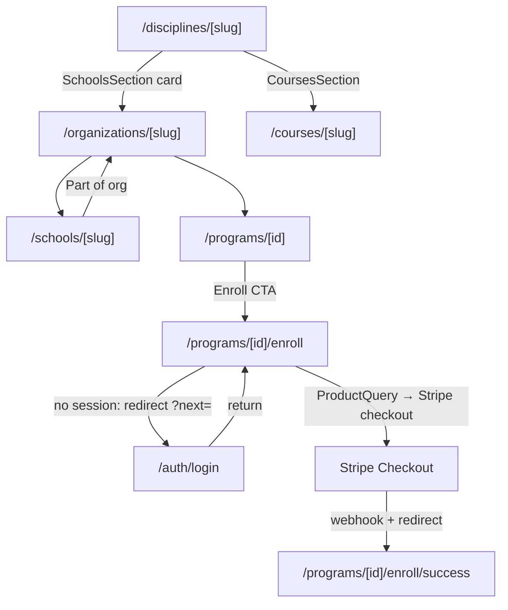
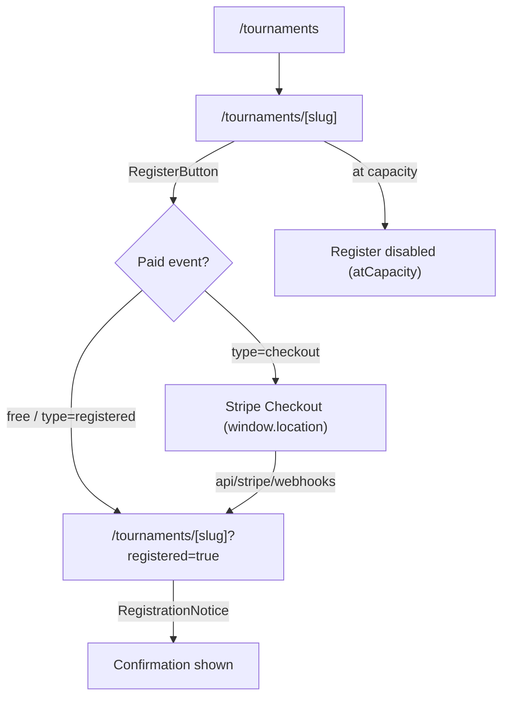

# Wiring Ledger — not-done, gaps, and handroll slips

## Summary

**This is the repo's canonical running P0/P1/P2 ledger.** Sessions *append* findings (stable IDs
`WL-P0-N` / `WL-P1-N` / `WL-P2-N`) and *resolve* rows here rather than duplicating a severity list into
every SESSION file — that pattern rots (see how `wiki/log.md` drifted). Per-session findings still live
in each SESSION file's `### Findings (severity ≥ medium)` block, which should backlink here. The closing
ritual's optional items include updating this ledger when a session surfaces or clears wiring debt.

A living ledger of incomplete wiring, storage gaps, and raw handrolled components that slipped the
FS-0001 primitive-composition rule across the Baseline Martial Arts public surfaces. Created at
SESSION_0304 from a Desi audit of `apps/web/app/(web)` + `apps/web/components/web`. **Headline:
zero P0s** — the public surfaces are genuinely well-wired (discipline → school → program → enroll and
tournament register flows all resolve through real routes / Stripe checkout). This is a consistency
ledger, not a stub farm. Items marked ✅ were resolved during SESSION_0304; the rest are tracked
follow-ups, not silent nulls.

## Key Ideas

- The codebase is honest: every public CTA audited resolves to a real route or server action.
- The remaining debt is **structural/cosmetic** (FS-0001 handroll slips, one "coming soon" stub),
  not broken wiring.
- `localStorage`/`sessionStorage` usage is SSR-safe and read/write-paired — no orphan persistence.

## P0 — broken / dead public wiring

**None found.** Traced CTAs all resolve:

- Program enroll: `app/(web)/programs/[id]/page.tsx:184` → `enroll/page.tsx` → `ProductQuery` checkout
  (auth-gated redirect at `enroll/page.tsx:50`).
- Tournament register: `components/web/tournaments/register-button.tsx:66` → `createRegistrationCheckout`
  → Stripe URL.
- Discipline/school cross-links resolve to real slugs (`disciplines/[slug]/page.tsx:181,285`,
  `schools/[slug]/page.tsx:138,354`).

## P1 — should-fix

| ID | File:line | Category | Finding | Status |
| --- | --- | --- | --- | --- |
| WL-P1-1 | `app/(web)/certificates/verify/[code]/page.tsx:31` | Handroll (FS-0001) | Public cert-verify result card was a raw `
`, not `Card`. A public trust surface diverging from every branded card. | ✅ Fixed — swapped to `~/components/common/card::Card` |
| WL-P1-2 | `app/(web)/programs/[id]/schedules/[scheduleId]/page.tsx:121` | Handroll (empty state) | Empty session list used a raw `
` instead of `EmptyList`. | ✅ Fixed — swapped to `~/components/common/empty-list::EmptyList` |
| WL-P1-3 | `components/admin/tournaments/registration-actions.tsx`; `app/admin/{leads,tools,tags,categories,users}/_components/*-actions.tsx` | Dead handler (Base UI semantics) | `DropdownMenuItem onSelect={…}` without `onClick` — Base UI `Menu.Item` activates on `onClick` and has no `onSelect` (it resolves to the `
` text-selection event). D-016 migration gap (scanned imports, not Menu.Item semantics). Tournament Approve/Waitlist, lead Nurture/Lost, tool/tag/category Duplicate, user Ban/Unban/Revoke likely silently no-op. | ✅ Fixed — SESSION_0334 swept all 11 instances across 6 files (`user-actions.tsx` was beyond the original list) to `onClick`-only + added a `bun test` regression guard (`components/common/dropdown-menu.guard.test.ts`) anchored to `DropdownMenuItem`. Drift D-016 closed. |
| WL-P1-4 | `apps/web/components/web/lineage/lineage-search-bar.tsx`; `apps/web/lib/lineage/rank-progression.ts` | Test coverage (privacy) | No dedicated test that the public lineage search can't surface non-PUBLIC members, nor that rank-progression on a public node leaks no PII. Implied by the payload allowlist (`queries.visibility.test.ts`) but unasserted for these SESSION_0331/0332 surfaces. | ✅ Fixed — SESSION_0334 added `lib/lineage/search.privacy.test.ts` (real materializer → extracted `lib/lineage/search.ts` matcher; PRIVATE/RESTRICTED unsearchable) and `lib/lineage/rank-progression.privacy.test.ts` (adversarial-PII allowlist proof — caught + hardened a whole-`discipline`-object passthrough in `buildBeltProgressions`). |
| WL-P1-5 | `.github/workflows/` | CI enforcement gap | `bun test` (incl. the invariant guards) + `biome` ran on **no** automated gate — only `playwright.yml` (e2e) + Vercel's build typecheck existed, and there are no git hooks. So the SESSION_0333/0334 guards didn't actually gate, and SESSION_0334 called the dropdown guard "CI-verified" inaccurately. | ✅ Fixed — SESSION_0335 added `.github/workflows/ci.yml` (Biome `biome ci` + typecheck + unit tests against a Postgres service, least-privilege perms), hardened `playwright.yml` perms, and cleared 8 latent `biome ci` errors. Watch the first `unit` run for any DB-seed need. See [verification-and-testing](../../runbooks/dev-environment/verification-and-testing.md). |

## P2 — nice-to-have / follow-up (deferred, tracked here)

| ID | File:line | Category | Finding | Action |
| --- | --- | --- | --- | --- |
| WL-P2-1 | `components/web/lineage/lineage-profile-drawer.tsx:352-355` | Stub | "Manage verification (coming soon)" `disabled` dropdown item — correctly inert, but a visible unfinished promise on a public profile drawer. | Gate behind an admin flag so non-admins never see it, or track in a lineage roadmap so it doesn't ship as permanent "coming soon". |
| WL-P2-2 | `app/admin/tools/_components/tool-actions.tsx:44` | TODO (admin) | `// TODO: Think about how to handle unique website URLs or remove this feature` — handler is fully wired; design-debt comment, not dead code. No public risk. | Resolve or convert to a tracked backlog item. |
| WL-P2-3 | `app/(web)/programs/[id]/schedules/[scheduleId]/page.tsx:130`, `components/web/schedules/schedule-instructor-list.tsx:81`, `components/web/lineage/lineage-rank-history-tab.tsx:97` | Handroll (row) | Repeated `rounded-md border p-3` list-row blocks (3+ instances). These are *rows*, not cards — acceptable today. | Extract a `ListRow` atom only if a 4th instance appears (YAGNI until then). |
| WL-P2-4 | `app/(web)/disciplines/_components/black-belt-rail.tsx` | Schema follow-up | Belt-color now renders from `Rank.colorHex` (added SESSION_0304). Rows fall back to a muted token when `colorHex` is null — ranks without a seeded color show no belt color. | Seed `Rank.colorHex` for all system rank sets (data task, not schema). Surface as a note per LLM Wiki rule 8 — do not change schema from this ledger. |
| WL-P2-5 | `components/web/lineage/lineage-profile-drawer.tsx:177` | Dead wiring (incomplete refactor) | `DrawerBody` destructures + types `treeId?: string` but never reads it — biome `noUnusedFunctionParameters` warning. Almost certainly plumbing threaded in for the unfinished "Manage verification (coming soon)" feature in the **same file** (WL-P2-1). Not a bug; dead wiring for a planned feature. | When the verification feature lands, consume `treeId`; until then either keep it (and silence the warning with `_treeId`) or remove it with WL-P2-1. Do not delete plumbing for in-flight work without confirming the feature is abandoned. |

## localStorage / sessionStorage gaps

**Clean.** Only one storage consumer in public code: `components/web/feedback-widget.tsx`.

- `localStorage` via Mantine `useLocalStorage` (`:149`) — SSR-safe, dismiss state read (`:179`) + written.
- `sessionStorage` page-view counter (`:161-162`) has the SSR guard (`typeof sessionStorage === "undefined"`
  at `:157`); write (`:162`) is read back (`:161`/`:185`). No orphan read/write, no hydration risk.

No other `localStorage`/`sessionStorage` usage exists under `apps/web/app` or `apps/web/components`.

## Handrolled components (FS-0001)

Only two genuine slips on public surfaces — both fixed this session (WL-P1-1, WL-P1-2). For contrast,
`components/web/disciplines/_components/schools-section.tsx:52` correctly composes `Card`/`CardHeader`/
`Stack`/`Badge`/`Link`, and the (now-enhanced) `black-belt-rail` composes `Card`/`H4`/`EmptyList`/`Badge`.
The discipline-area components are the good template; cert-verify was the outlier.

## black-belt-rail verdict

**KEEP + ENHANCE — done this session.** It was a correct, well-built server component (filters
`status: ACTIVE`, `rank.sortOrder >= 10`, ordered desc, `take: 10`) but rendered as an undifferentiated
text list with a generic soft badge — the flattest, highest-delity-opportunity element on the discipline
page. SESSION_0304 enhancement (flagship motion surface):

- Belt-color indicator driven by `Rank.colorHex` data (no name-parsing — brand-safe), fallback to a
  muted token when null (see WL-P2-4).
- Member avatars (`Avatar` primitive, initials fallback) — `user.image` added to the query select.
- Top entry (`#1`) emphasized (heavier weight, soft badge vs outline for the rest).
- Restrained staggered fade-in-up reveal via `motion/react`, gated on `useReducedMotion` (reduced-motion
  renders the final static list — identical to the pre-0304 behavior).
- Heading unified to "Top Ranked" across populated + empty branches.

Deliberately NOT added: filtering, pagination, "view all" — that's the members directory's job. The
sibling `member-carousel-by-rank.tsx` stays the browse surface; the rail stays a glanceable honor strip.

## Wire-flows

Built only from routes verified under `app/(web)`.

### Flow 1 — Discipline → School → Program → Enroll → Checkout

### Flow 2 — Tournament → Register → Checkout/Confirm

## Relationships

- [Motion System](../../runbooks/design/motion-system.md) — black-belt-rail is the flagship motion surface here.
- [Baseline Design System Hub](../../runbooks/design/baseline-design-system.md) — primitive set the handroll slips should have used.
- [Custom Component Inventory](custom-component-inventory.md) — where enhanced components are re-documented at close.
- [SESSION_0304](../../sprints/SESSION_0304.md) — session that produced this ledger + the fixes.

## Sources

- Desi audit of `apps/web/app/(web)` + `apps/web/components/web` (SESSION_0304).

## Open Questions

- Should `Rank.colorHex` be seeded for all system rank sets so belt colors always render (WL-P2-4)?
- Should the lineage "coming soon" verification item (WL-P2-1) be admin-gated or roadmapped?
