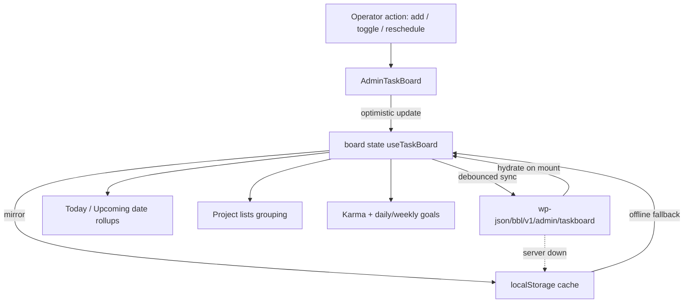
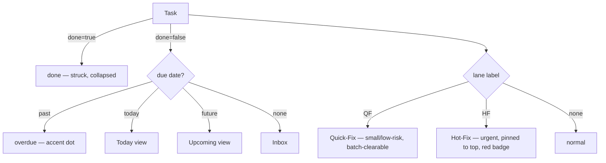

<!-- LIGHTWEIGHT spec. Value = the wireframes + wiring map + status taxonomy + JSON schema, not prose. -->

> **RETIRED (SESSION_0461, G-003).** This localStorage Todoist board was collapsed into the unified,
> DB-backed [Loop Board](../../../knowledge/wiki/files/loop-board.md) — one board, one engine. `/admin/task-board` now redirects to
> `/app/loop-board`; the `lib/task-board` engine + Todoist renderer are deleted; the operator's per-browser
> `bbl_admin_taskboard_v1` tasks migrate once into `KanbanCard` (source=`task`). Operator task management
> now happens on the loop-board via the kernel's quick-add/intake. Kept for history; do not build against it.

# AdminTaskBoard (BBL operator task board)

## Summary

A branded, Todoist-style task/project board for **Black Belt Legacy admins** — the operator's
single pane for "what needs doing": projects (lists) → tasks → due dates → status. It **absorbs**
the existing `AdminTaskForge.jsx` (multi-list checklist) and borrows the column option from
TuffBuffs `TaskBoard.jsx`. **One rule:** it renders in the BBL design system (accent `#E52421`,
dark/light inversion, the 1-2-3 step disc) — it must read as the same brand as the emails, the app,
and the docs hub. Persists to `localStorage` first, syncs to `wp-json/bbl/v1/admin/taskboard`.

Reference model (operator screenshots): projects like **Black Belt Legacy**, **Ronin Dojo Design**,
**Web/Graphic Design**, **Inbox**; tasks with due dates, labels, sub-counts; bottom nav
Inbox / Today / Upcoming / Browse; karma/goal gamification. Dark mode is the default skin (matches
the iOS/Todoist chrome) but light is a true inversion via `prefers-color-scheme`.

## Low-fi wireframe — board (desktop, dark default)

```text
┌───────────────────────────────────────────────────────────────────────────┐
│  ◐  BLACK BELT LEGACY · Task Board            [ + Add task ]   🔍 ⌘K        │  ← chrome bar (--chrome)
├───────────────┬───────────────────────────────────────────────────────────┤
│ PROJECTS      │  Today  ·  12                              [ Reschedule ]   │
│ ─────────     │  ───────────────────────────────────────────────────────  │
│ ▸ Inbox    9  │  Overdue  9                                                 │
│ ▸ Today   12  │  ◯  Look at WEKAF quiz                    ● Aug 18  HIGH    │  ← task row
│ ▸ Upcoming    │  ◯  Drala Center promo videos             ● Aug 23         │
│ ─────────     │  ◯  Invite Dirty Dozen guys              ● Jan 30  QF      │
│ # Black Belt  │  ◯  Feature: lineage improvement          ● Feb 18  HF      │
│   Legacy  190 │  ◯  Video edits                           ● Mar 17         │
│ # Ronin Dojo  │  ◯  Prep for big push                     ● Mar 18         │
│   Design   28 │                                                            │
│ # Web/Graphic │  ▸ done (3)  ………………………………………………………… collapsed             │
│   Design      │                                                            │
│ ─────────     │  KARMA 8086  ▓▓▓▓▓▓▓▓▓░  · Daily 0/5 · Weekly 0/30        │  ← gamify strip
│ + New project │                                                            │
└───────────────┴───────────────────────────────────────────────────────────┘
   sidebar (--surface)                main column (--bg)
```

## Low-fi wireframe — mobile (390px) + task detail

```text
  ┌─────────────────────┐      tap a row ▸     ┌─────────────────────┐
  │ ◐  Today        12  │                      │ ‹  Task             │
  │ ───────────────────  │                     │ ───────────────────  │
  │ Overdue          9  │                      │ Look at WEKAF quiz  │
  │ ◯ Look at WEKAF…  ● │                      │ ◯ mark complete     │
  │ ◯ Drala promo…    ● │                      │ Project: BBL        │
  │ ◯ Invite Dozen…  QF │                      │ Due:  ● Aug 18 2025 │
  │ ◯ Video edits     ● │                      │ Priority: HIGH      │
  │ ───────────────────  │                     │ Status: ACTIVE      │
  │ [ + ]               │                      │ Labels: #content    │
  │─────────────────────│                      │ ───────────────────  │
  │ Inbox Today Up Brwse│  ← bottom nav        │ Notes…              │
  └─────────────────────┘                      └─────────────────────┘
       quick-add FAB never covers the bottom nav (suppressOnPathPrefixes parity)
```

## Bottom nav + MAB (main action button)

Reuse the **shipping BBL pattern**, trimmed to Todoist's streamlined-line elegance. Source of truth:
`monorepo:src/brands/blackbeltlegacy/components/navigation/BottomNav.jsx` (5 tabs + a center
elevated FAB) and its `CreateOverlayMenu.jsx` bottom sheet. The board nav re-labels the tabs to the
Todoist set; the **MAB** is the center FAB, opening a quick-add sheet.

```text
  ┌───────────────────────────────────────────────┐
  │  Inbox     Today      ⊕      Upcoming   Browse │   ← 5 slots, center = MAB
  │   ◻         ◻       (MAB)       ◻         ◻     │
  └───────────────────────────────────────────────┘
        the MAB sits -24px above the bar (elevated disc), brand red, never covers a row CTA
```

Exact values lifted from `BottomNav.jsx` (keep them — don't reinvent):

| Element | Value | Token / class |
| --- | --- | --- |
| nav container | dark bar, top hairline, safe-area inset | `bg-neutral-900 border-t border-neutral-800` + `paddingBottom: env(safe-area-inset-bottom)` |
| nav padding | 8px / 8px | `px-2 py-2` |
| tab | icon 24px + 4px gap + label | `flex flex-col items-center gap-1 px-4 py-2 rounded-lg` |
| tab active | brand red | `text-red-400` (→ `--accent`); default `text-neutral-400` (→ `--muted`) |
| **MAB** (center) | ~52px disc, elevated −24px | `-mt-6 p-3 rounded-full`, icon `w-7 h-7` (28px) |
| MAB color | red gradient + red glow | `from-red-600 to-red-700 shadow-lg shadow-red-900/50` |
| MAB press | +5% | `hover:scale-105` |
| MAB opens | quick-add bottom sheet | `CreateOverlayMenu` — handle `w-12 h-1.5`, `rounded-t-3xl`, `space-y-3` |

> **Todoist-streamline note (Desi):** drop the gradient to a flat `--accent` fill for a cleaner
> single-tone disc; keep the elevation + glow. Labels `text-[10px] uppercase tracking-wider` (WEKAF
> nav value) read as the most "elegant line" of the three brand navs — adopt that label treatment.
> Touch target floor `min-h-[44px]` (TuffBuffs nav) on every slot.

## Spacing rhythm + ratio

One **4px base scale** (from `monorepo:src/components/DesignSystem/index.jsx`) governs every gap,
pad, and radius — the source of Todoist's calm rhythm. Don't introduce off-scale values.

```text
 scale (×4px):   1=4   2=8   3=12   4=16   5=20   6=24   8=32   10=40   12=48   16=64
 radius:         lg=8   xl=12   2xl=16   full=∞
 type:           xs=12  sm=14  base=16  lg=18  xl=20  2xl=24
```

Card/row rhythm — match `TodoistCard.jsx` + the phase-13 Todoist CSS exactly:

| Surface | Pad | Gap | Radius | Source |
| --- | --- | --- | --- | --- |
| project card | `p-4` (16) | `space-y-2` (8) between rows | `rounded-xl` (12) | TodoistCard.jsx |
| task row | `p-[10px]` | `gap-2/10` | `rounded-[14px]` | phase13 `.bbl-task-row` |
| task chip / pill | `8px 10px` | `gap-2` (8) | `rounded-full` (999) | phase13 `.bbl-task-chip` |
| checkbox ↔ title | — | `space-x-2` (8) | — | TodoistCard row |
| section header → list | `mb-2` (8) | — | — | TodoistCard header |
| card → footer | `mt-3` (12) | — | — | TodoistCard footer |

**Golden-ratio guideline (proportion, not a new token):** size the *vertical proportions* near φ≈1.618
— title line-height : meta line-height ≈ 16:12 (~1.33) for density, but the **card block : its
internal gutter** ≈ 16px pad : ~10px row ≈ 1.6, and **project card height : its header** trend φ.
Use it to *choose between* adjacent scale steps (e.g. 16 vs 24 padding), never to invent off-scale px.

## Data wiring flow (ASCII)

```text
 user action (add / toggle / reschedule)
        │
        ▼
 ┌──────────────┐   optimistic    ┌────────────────────┐
 │ AdminTaskBoard│ ──────────────▶ │ board state (React) │  { projects:[{ tasks:[] }], activeId, view }
 │   (BBL admin) │ ◀────────────── │  useTaskBoard()     │
 └──────┬───────┘    rollback      └─────────┬──────────┘
        │ persist                            │ read on mount
        ▼                                     ▼
 ┌──────────────┐  apiClient.post   ┌────────────────────┐
 │ localStorage │ ◀───────────────▶ │ wp-json/bbl/v1/     │  source of truth (server)
 │ (fast cache) │   debounced sync  │   admin/taskboard   │  localStorage = offline cache
 └──────────────┘                   └─────────┬──────────┘
                                               │
                          ┌────────────────────┼────────────────────┐
                          ▼                     ▼                    ▼
                    Today/Upcoming        Project lists        Karma/goals
                    (date rollups)        (grouping)           (gamify strip)
```

## Data wiring flow (mermaid)



## Logic / decision chart — task status + QF/HF lane



## Status taxonomy (the lean enum)

Two orthogonal axes — **lifecycle** (is this task/board-item live?) and **lane** (how urgent / what
kind of fix). Mirrors and extends `monorepo:src/brands/blackbeltlegacy/utils/statusUtils.js`
`STATUS_CONFIGS` (add a `task` group) rather than inventing a parallel system.

| Axis | Value | Meaning | Visual |
| --- | --- | --- | --- |
| lifecycle | `active` | live, actionable | normal row |
| lifecycle | `inactive` | parked / snoozed | muted, no dot |
| lifecycle | `deprecated` | kept for history, not actionable | strikethrough + muted |
| lifecycle | `broken` | blocked / needs intervention | accent outline, ⚠ |
| lane | `QF` (quick-fix) | small, low-risk, batchable | gray pill `QF` |
| lane | `HF` (hot-fix) | urgent, jump the queue | accent pill `HF`, pinned top |
| lane | _(none)_ | normal task | — |

> The **same `active / inactive / deprecated / broken` lifecycle** is reused by the component
> catalog (point: components are tasks too) so one status vocabulary covers both tasks and the
> design-system inventory.

## Lean JSON — task + project (the simpler shape)

Frontmatter stays for *docs*; **runtime data is plain JSON** (no YAML at runtime). One flat task,
one flat project. Optional fields omitted when empty (keeps payloads small — the Todoist rows only
need 4–5 fields).

```jsonc
// project
{ "id": "bbl",            // slug, stable
  "name": "Black Belt Legacy",
  "color": "accent",      // token name, never a hex — resolves via design system
  "order": 1 }

// task (omit empty fields)
{ "id": "t_1a2b",
  "project": "bbl",
  "title": "Look at WEKAF quiz",
  "due": "2025-08-18",    // ISO date or null
  "lane": "HF",           // "QF" | "HF" | null
  "status": "active",     // active | inactive | deprecated | broken
  "priority": "high",     // high | medium | low | null
  "labels": ["content"],  // optional
  "done": false,
  "createdAt": "2026-06-21T08:16:00Z",
  "completedAt": null }
```

## Lean JSON — component catalog entry (preview-ready)

Replaces the verbose `bblCatalogComponents.js` entry with the same fields + a `status` (reusing the
task lifecycle) + a `preview` hook so the board / showcase can render a live mini-preview. Keeps the
existing `{ id, name, category, description, module, props[], usage }` shape — just leaner and adds
two fields.

```jsonc
{ "id": "bbl-admin-task-board",
  "name": "AdminTaskBoard",
  "category": "admin",
  "status": "active",            // active | inactive | deprecated | broken — SAME enum as tasks
  "module": "components/admin/AdminTaskBoard",
  "props": ["projects", "view", "onChange"],
  "preview": { "mode": "live", "fixture": "fixtures/task-board.sample.json" },
  "usage": "<AdminTaskBoard view=\"today\" />" }
```

## Preview opportunities

- **Live preview in BBLComponentShowcase** — the catalog `preview.mode:"live"` + a JSON fixture
  renders the board with seed data (no server). Mirrors the existing showcase pattern.
- **Static preview = the design-system HTML** — `docs/component-design-system.html` already renders
  the dark/light inversion + step disc the board uses; link it from the showcase as the
  brand-truth reference.
- **Fixture-driven** — `fixtures/task-board.sample.json` doubles as the test seed and the preview
  data, so preview ≡ what tests assert.
- **Dark/light parity** — preview toggles `data-theme` to prove the board inverts cleanly (the
  toggle already shipped in the hub + design-system reference).

## Behavior expectations

| # | Behavior | Expectation |
| --- | --- | --- |
| 1 | Add task | optimistic insert at top of active project; sync debounced; rollback toast on failure |
| 2 | Toggle done | strikes + moves to collapsed `done`; `completedAt` stamped; karma +1 |
| 3 | Overdue | due < today and not done → Overdue group, accent dot |
| 4 | HF lane | pinned to top of its project + Today; accent `HF` pill |
| 5 | QF lane | gray `QF` pill; "Clear all QF" batch action |
| 6 | Reschedule | date picker; Today header shows count + Reschedule shortcut |
| 7 | Offline | localStorage serves immediately; server reconciles on reconnect |
| 8 | Mobile 390px | bottom nav (Inbox/Today/Upcoming/Browse); FAB never overlaps nav or CTAs |
| 9 | Dark/light | follows OS; forced via `data-theme`; accent lifts to `#FF4D49` on dark |
| 10 | Empty state | per-project EmptyState (reuse `src/components/ui/EmptyState.jsx`) |

## Where it lives (surface map)

| Surface | Source (monorepo) | Notes |
| --- | --- | --- |
| board component | `src/brands/blackbeltlegacy/components/admin/AdminTaskBoard.jsx` (new) | absorbs `AdminTaskForge.jsx` |
| state hook | `src/brands/blackbeltlegacy/hooks/useTaskBoard.js` (new) | optimistic + sync |
| status config | `src/brands/blackbeltlegacy/utils/statusUtils.js` | add `task` group to `STATUS_CONFIGS` |
| status pill | `src/brands/blackbeltlegacy/components/shared/StatusBadge.jsx` | reuse |
| catalog entry | `src/brands/blackbeltlegacy/components/admin/catalog/bblCatalogComponents.js` | register w/ `preview` |
| persistence | `wp-json/bbl/v1/admin/taskboard` (PHP) | mirrors taskforge endpoint |
| primitives | `src/components/ui/{Badge,Modal,SearchInput,EmptyState,Skeleton}.jsx` | reuse, don't rebuild |
| bottom nav + MAB | `src/brands/blackbeltlegacy/components/navigation/{BottomNav,CreateOverlayMenu}.jsx` | reuse; re-label tabs |
| spacing scale | `src/components/DesignSystem/index.jsx` | 4px base; card rhythm from `TodoistCard.jsx` |
| brand truth | `baseline:docs/component-design-system.html` | tokens + dark/light |

## Security / redaction gates

- Admin-only surface — gate behind BBL admin capability (`src/auth/capabilities.js`); never exposed
  on public/passport surfaces.
- Task data is operator-internal; no public DTO. Endpoint requires admin nonce/JWT (same as other
  `wp-json/bbl/v1/admin/*`).

## Migration note (AdminTaskForge → AdminTaskBoard)

`AdminTaskForge.jsx` state `{ lists:[{id,name,tasks}], activeListId }` maps 1:1 → `{ projects, activeId }`.
Each Forge task `{ id,title,description,priority,done,createdAt,completedAt }` gains `project`, `due`,
`lane`, `status`. One-time localStorage migration on first mount; keep Forge as a thin re-export for
one release, then mark it `deprecated` in the catalog.

## PWCC port spec + cloud handoff

Streamlined for the [PWCC pipeline](../../../knowledge/wiki/component-porting/plawywright-component-conversion-method/PWCC-ASCII-flow-component-port-pipeline.md)
plus the cloud-sweep handoff (mirrors `codex-cloud-bbl-waves-2-4.md`). The cloud lightweight coding
agent owns the build; this is its brief.

```text
 DISCOVERY ✓        →  OBSERVED PRODUCT TRUTH ✓   →  PORT SPEC (this doc) →  REPO MEMORY CHECK ✓
 5 operator         AdminTaskForge + TaskBoard +     wireframes + JSON +     existing files mapped
 screenshots +      TodoistCard + BottomNav +        status taxonomy +       (no rebuild from
 monorepo sweep     DesignSystem scale (cited)       wiring                  scratch needed)
        └──────────────────────────────┬───────────────────────────────────────────┘
                                        v
                          IMPLEMENT SMALLEST SLICE  →  PLAYWRIGHT PROOF  →  PROOF GATE
                          (board + today view +        desktop + 390px +     green → catalog + PR
                           localStorage, no server)    dark/light toggle
```

### File transfer work (monorepo)

| Action | Path | Note |
| --- | --- | --- |
| **create** | `src/brands/blackbeltlegacy/components/admin/AdminTaskBoard.jsx` | board shell; absorbs Forge |
| **create** | `src/brands/blackbeltlegacy/hooks/useTaskBoard.js` | state + optimistic sync |
| **create** | `src/brands/blackbeltlegacy/components/admin/taskboard/fixtures/task-board.sample.json` | preview + test seed |
| **edit** | `src/brands/blackbeltlegacy/utils/statusUtils.js` | add `task` group to `STATUS_CONFIGS` |
| **edit** | `src/brands/blackbeltlegacy/components/admin/catalog/bblCatalogComponents.js` | register entry w/ `preview` |
| **reuse** | `components/navigation/{BottomNav,CreateOverlayMenu}.jsx`, `components/shared/StatusBadge.jsx`, `components/ui/{Badge,Modal,SearchInput,EmptyState,Skeleton}.jsx` | do not rebuild |
| **deprecate** | `src/brands/blackbeltlegacy/components/admin/AdminTaskForge.jsx` | thin re-export 1 release → `status: deprecated` |
| **create (PHP)** | `wordpress/blackbeltlegacy-api.php` → `wp-json/bbl/v1/admin/taskboard` | GET/PUT; admin nonce |

### Needs

- BBL admin capability gate (`src/auth/capabilities.js`) — no public exposure.
- One REST endpoint (GET list, PUT upsert) mirroring the taskforge endpoint shape.
- Design tokens already shipped (`baseline:docs/component-design-system.html`, dark/light) — consume,
  don't redefine. Use token names (`accent`), never hex.
- No Prisma / migration work (this is WP-side persistence) — respects the monorepo hard-stops.

### TODOs (cloud agent checklist)

```text
[ ] 1. Scaffold AdminTaskBoard.jsx + useTaskBoard.js from the lean JSON shapes above
[ ] 2. Extend STATUS_CONFIGS with task lifecycle (active/inactive/deprecated/broken) + QF/HF lanes
[ ] 3. Wire BottomNav (re-label tabs) + center MAB → CreateOverlayMenu quick-add sheet
[ ] 4. Today / Upcoming / Inbox date rollups + per-project grouping; collapsed done
[ ] 5. localStorage-first, debounced PUT to wp-json/bbl/v1/admin/taskboard; rollback toast
[ ] 6. Register catalog entry with preview.mode:"live" + fixtures/task-board.sample.json
[ ] 7. Migrate AdminTaskForge state on first mount; leave Forge as deprecated re-export
[ ] 8. Vitest: status rollups, overdue logic, HF pin, migration mapping (fixture-driven)
[ ] 9. Playwright proof: desktop + 390px mobile + dark/light toggle; FAB never covers nav/CTAs
[ ] 10. Proof gate green → update monorepo CLAUDE.md health + open draft PR
```

### Cloud prompt (paste-ready)

```text
Work in ronin-dojo-monorepo (BBL brand). Build AdminTaskBoard per
baseline:docs/product/black-belt-legacy/page-specs/bbl-admin-task-board.md (this spec).

Read first: the spec's wireframes, lean JSON, status taxonomy, bottom-nav/MAB + spacing rhythm,
and the File transfer work table. Reuse the cited components — do not rebuild primitives.

Smallest slice first: board shell + Today view + localStorage (no server), then layer sync,
catalog entry, and the Forge migration. Tokens come from the BBL design system (accent #E52421,
dark/light); use token names, never hex.

Hard stops: no Prisma/migrations; admin-gated only (no public surface); keep AdminTaskForge as a
deprecated re-export for one release.

Proof gate: Vitest (status rollups, overdue, HF pin, migration) + Playwright (desktop, 390px,
dark/light). Green → register catalog entry, open a draft PR, update CLAUDE.md health table.
```

## Provenance

Spec authored SESSION_0428 (PWCC: Petey plan / Cody build target / Desi brand pass) per Brian's
"function like Todoist" request + 5 operator screenshots. Grounds on existing `AdminTaskForge.jsx`
(Session 488) and TuffBuffs `TaskBoard.jsx` (Session 606). Implementation handed to the cloud
lightweight coding agent in the monorepo; this baseline doc is the catalog entry + flow.
