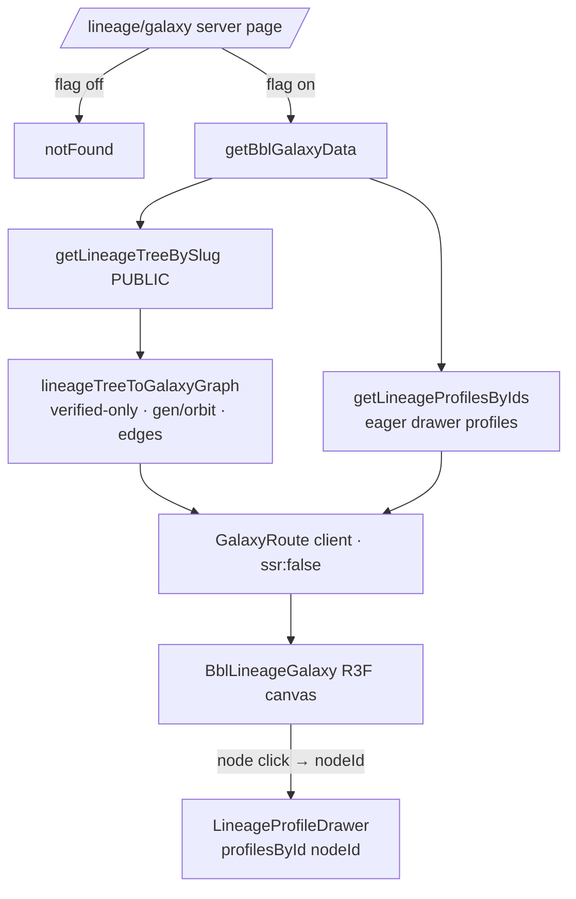
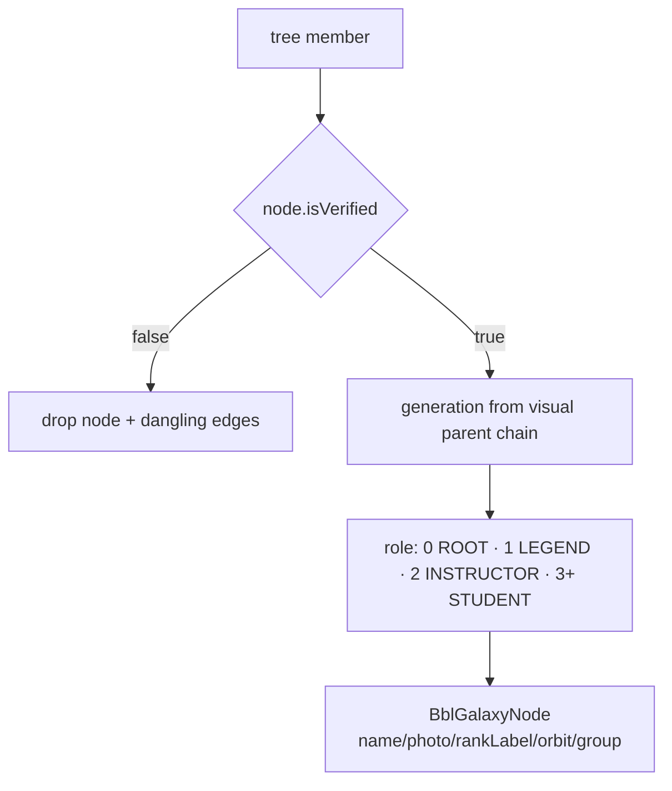

# BBL Galaxy data flow (public lineage → cinematic viewer)

## Summary

How the flag-gated BBL Galaxy (PR #133) gets data: a server route projects a **published public**
lineage tree into a verified-only galaxy graph and eager-loads drawer profiles, then a browser-only
(R3F/three.js, `ssr:false`) viewer renders it. No private data — it consumes the public lineage
payload and a node click opens the real lineage profile drawer. Mock data is the no-DB dev fallback only.

## Data wiring flow (ASCII)

```text
/lineage/galaxy (server page)
  |  galaxyConfig.enabled (NEXT_PUBLIC_GALAXY_ENABLED)  --off--> notFound()
  v
getBblGalaxyData()
  |  findPublishedLineageTreeSlugs() -> first BBL published tree
  |  getLineageTreeBySlug({ brand, slug })  (PUBLIC-scoped)
  |  lineageTreeToGalaxyGraph(result)   (PURE: verified-only; gen/orbit; primary-lineage edges)
  |  getLineageProfilesByIds(nodeIds)   (eager drawer profiles, public-redacted)
  v
GalaxyRoute ('use client', dynamic ssr:false)  -> BblLineageGalaxyDemo
  |   <BblLineageGalaxy graph={...}>            (R3F canvas; node click -> nodeId)
  |   <LineageProfileDrawer profile={profilesById[nodeId]}>   (real drawer; mock = no-data fallback)
  v
Browser (three.js / drei / gsap) — lazy chunk, loads only on this route
```

## Data wiring flow (mermaid)



## Logic / decision chart (node → DTO → render)



## Where it lives (field / surface map)

| Galaxy field | Source | Notes |
| --- | --- | --- |
| `displayName` / `photoUrl` | member `node.passport` (→ account fallback) | same chain as the public Passport DTO |
| `rankLabel` | `selectedRankAward ?? rankAwardsEarned[0]` → `rank.name · discipline` | — |
| `role` / `generation` | visual parent chain depth | deterministic layout |
| `orbitIndex/Total` | `visualSortOrder` within generation band | — |
| `groupId/Label` | `LineageVisualGroup` (public labels only) | `showPublicLabel` honored |
| `verifiedStatus` | filtered to `node.isVerified === true` | verified-only galaxy (spec security rule) |

## Security / redaction gates

- **Flag-gated:** route 404s unless `NEXT_PUBLIC_GALAXY_ENABLED=1` — half-built feature never ships to prod.
- **Verified-only:** unverified nodes (and dangling edges) are dropped in the pure projection.
- **Public payload only:** consumes `getLineageTreeBySlug` (PUBLIC scope) + `getLineageProfilesByIds`
  (public-redacted); no private fields. Belt colors via `Rank.colorHex`.
- **Client-only:** three.js never hits SSR (`dynamic … { ssr: false }`), lazy-loaded per route.

## Provenance

PR #133 (slice 1 prototype + slice 2 public DTO/drawer + verified-only). Spec:
`docs/product/black-belt-legacy/BBL-Galaxy-spec.md` (lands with PR #133). Should converge on the
[public Passport DTO](../../../knowledge/wiki/files/public-passport-dto.md) for its identity fields (epic
[post-launch-clean-repo-001](../../../epics/post-launch-clean-repo-001.md)).
