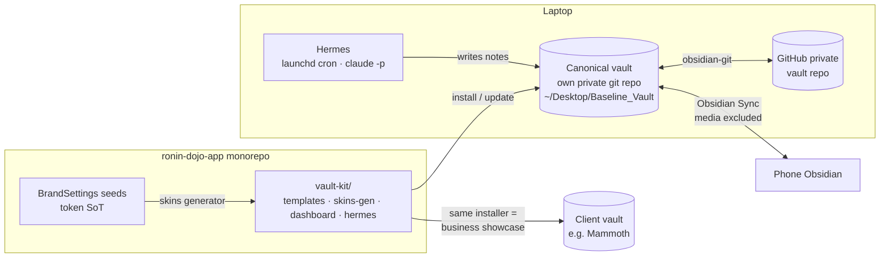
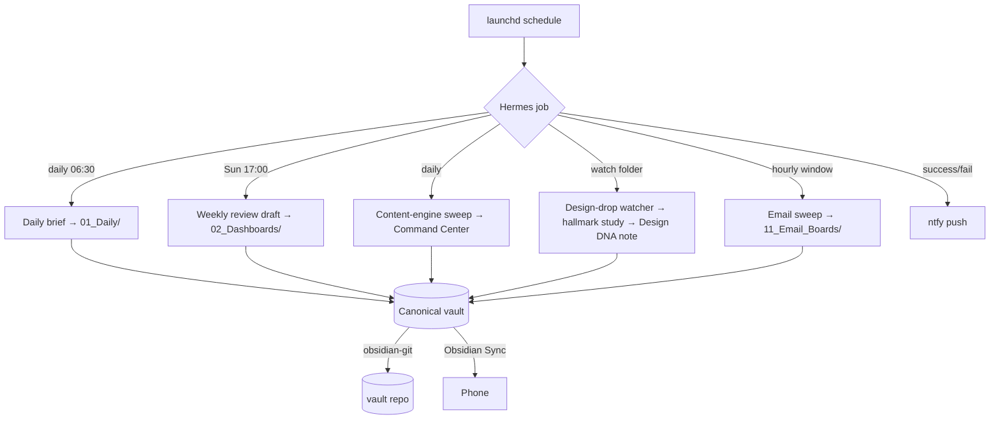
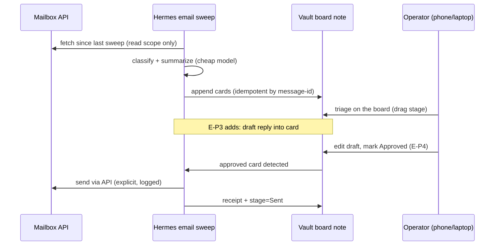

# Obsidian Dashboard Epic

**One line:** turn the operator's Obsidian into the company's design/ops workbench — ONE canonical
vault, a repo-shipped **vault-kit** (brand skins + templates + dashboard), a local cron agent
(**Hermes**) that feeds it, and a phased **Email Boards** program across the 5 brands — on both
phone and laptop.

Grilled and locked at SESSION_0564 (operator, 3 rounds). This doc is the build blueprint; it is
written for cheap-model handoff: every task has a brief, a done-means, and its gotchas inline.

## 1. North star

The vault is the **heartbeat of the brand** — four jobs on one surface:

1. **Design-system template skins** — per-brand Obsidian themes generated from the same tokens the
   platform uses (tokens-as-contract extends to the vault).
2. **Quick design mockups** — a capture→study→mockup loop (hallmark skill `study` verb feeds
   design-DNA notes).
3. **Business showcase** — "here is how we run OUR business on this" is the demo for how RDD
   automates a client's daily workflow; the vault-kit installer IS the product demo (Mammoth first).
4. **Dashboard + agentic automation** — Command Center rebuilt on Bases/Dataview/Kanban, fed by
   Hermes (local cron): daily brief, weekly review, content-engine sweep, design-drop watcher,
   email sweep.

## 2. Current state (verified SESSION_0564)

| Asset | Where | Size | Verdict |
| --- | --- | --- | --- |
| **Baseline_Vault** | `~/Desktop/Baseline_Vault` (registered, open) | 1.7 GB / 4,221 md | Becomes the CANONICAL vault. Core = `RONIN_DOJO-Baseline/` (3.2 MB / 94 notes, numbered 00–99 system, Command Center, Templater templates, `.base` files). Bulk = WEKAF/WordPress media packs → archive out of the synced core. Plugins: obsidian-git, kanban, templater, copilot, importer; core `sync: true`, `publish: true`. |
| **RoninDojoDesign** | iCloud Obsidian | 356 MB / 16 md + assets | Design/branding vault (BBL, MAD, RDD-Custom Sites, JETTY standards, canvases). FOLD its brand/design assets into the canonical vault. Rich plugin set worth harvesting (style-settings, dataview, quickadd, metadata-menu, advanced-canvas). |
| **RoninDojoObsidian** | iCloud Obsidian | 13 GB / 13,473 files | Mostly a stale `ronin-dojo-monorepo` copy inside a vault. ARCHIVE off iCloud (reclaims 13 GB); nothing folds in except any unique scraps found during sweep. |
| **`ronin_obsidian_starter_vault/`** | repo root (git-tracked) | small | The ChatGPT starter seed the live core evolved from. Becomes raw material for `vault-kit/` templates; the tracked copy retires when vault-kit lands (do not maintain two template sources). |
| **`obsidian-vault` skill** | `.claude/skills/obsidian-vault/` (+ `.agents` mirror) | — | Points at a dead WSL path (`/mnt/d/...`). REPLACE with a Baseline_Vault-aware skill (task B5). |
| Operator design notes | `Baseline_Vault/Obsidian Integration and Automation.txt` | — | 3-layer model (Obsidian = workbench → publish → transactional services), note-type taxonomy, plugin ladder. Treated as design input throughout. |

## 3. Decisions locked (grill record)

| # | Fork | Decision |
| --- | --- | --- |
| D1 | Source vault | `~/Desktop/Baseline_Vault`; RoninDojoDesign + RoninDojoObsidian are the "other two" |
| D2 | Vault↔repo model | **Two-repo + vault-kit**: vault = its own lean private git repo; monorepo ships `vault-kit/` (templates, skins, dashboard, Hermes) installable into ANY vault |
| D3 | Consolidation | ONE canonical vault; Design vault folds in; RoninDojoObsidian archived off iCloud |
| D4 | Phone+laptop sync | **Layered git + Obsidian Sync**: git on the Desktop vault for history/agents; official Sync carries core to phone (media excluded via selective sync); never iCloud+git together |
| D5 | Dashboard surface | **Phased**: Obsidian-native v1 (Bases/Dataview/Kanban Command Center) → `apps/web` dashboard as a slower follow-up phase |
| D6 | Skins token source | **DB seed tokens → generated snippets**: vault-kit generator reads each brand's `BrandSettings` seed (brand color SoT is the DB) and emits per-brand CSS snippets + Style Settings presets |
| D7 | Hermes v1 jobs | ALL of: daily brief, weekly review draft, content-engine sweep, design-drop watcher, **email sweep** |
| D8 | Email scope | **Plan all three phases now** (sweep+categorize, reply drafts, full approval/send flow) in spec-grade detail; build hands off to Codex CLI / cheap-model worktree subagents; v1 build = sweep+categorize |
| D9 | Email goals shape | Program row (5 brands) + pilot row. **Amended post-grill (operator, 0564): pilot = BBL first** (Brian's own mailbox — no external OAuth blocker); Mammoth = first follower. Michael Flores video meeting **2026-07-18** = showcase the Obsidian/Hermes setup + collect Mammoth OAuth, plus possible **Google Calendar** integration and **Todoist** API keys (todoist-sync-plugin already in the Design-vault plugin harvest, OD-A3) |
| D10 | Wayfinder | Vendor + conform (skill + its 4 sibling deps; tracker ops → `gh`; epic-scale usage only) |
| D11 | Hallmark | Vendor as-is, scoped to greenfield/mockups/skins — ui-kit token contract stays law on product surfaces |
| D12 | Send safety | Hermes/email automation NEVER auto-sends. Sweep/categorize/draft freely; every send is an explicit human approval. Standing invariant across all phases. |

## 4. Target architecture



Key properties: notes stay private (vault repo ≠ monorepo); the kit is the product; `.git` lives
only on the laptop (Obsidian Sync ignores it, so git and Sync never fight); Hermes writes plain
markdown, so every surface (phone, dashboard, web later) sees it with zero coupling.

## 5. Workstreams and tasks

Task IDs are stable (`OD-A1` …). Each is sized for one focused session or one Codex/subagent lane.
Statuses live in the goals ledger + board, not here.

### Workstream A — Vault consolidation + sync (operator-assisted; touches personal data)

- **OD-A1 — Split the canonical core.** Inside Baseline_Vault: keep `RONIN_DOJO-Baseline/` +
  curated top-level notes as the synced core; move WEKAF/WordPress/zip media packs to
  `_archive/` (git-ignored, Sync-excluded). Done: synced core < 100 MB.
- **OD-A2 — Vault → private git repo.** `git init` in Baseline_Vault, `.gitignore` (`_archive/`,
  `.obsidian/workspace*.json`, `.DS_Store`), private GitHub remote, obsidian-git configured
  (already installed). Done: first commit pushed; obsidian-git auto-backup on.
- **OD-A3 — Fold in RoninDojoDesign.** Move brand/design assets (BBL, MAD, RDD-Custom Sites,
  JETTY docs, canvases) into a `10_Design/` section of the core; harvest its plugin list
  (style-settings, dataview, quickadd, metadata-menu, advanced-canvas) into the canonical
  `.obsidian`. Done: Design vault is empty-or-archived; no wikilink breakage (grep pass).
- **OD-A4 — Archive RoninDojoObsidian.** Unique-scrap sweep, then move the 13 GB out of
  iCloud to local/external archive. Done: iCloud reclaims ~13 GB; vault list shows ONE vault.
- **OD-A5 — Obsidian Sync wiring.** Confirm the subscription, connect the canonical vault to a
  remote vault, selective-sync excludes `_archive/`, connect phone. Done: edit on phone appears
  on laptop and vice versa; media stays laptop-only. Gotcha: vault must stay on Desktop (NOT
  iCloud) — D4.

### Workstream B — vault-kit (in-repo package; the productizable layer)

Location: `vault-kit/` at monorepo root (NOT inside `apps/web`; it is brand-agnostic platform
tooling per ADR 0034 — kernel + modules).

- **OD-B1 — Package skeleton + installer.** `vault-kit/{templates,skins,dashboard,hermes}/` + a
  `bun vault-kit install <vault-path>` script (idempotent, copy-with-manifest so updates don't
  clobber user edits). Done: installer runs against a scratch vault; manifest tracks provenance.
- **OD-B2 — Skins generator.** Reads per-brand `BrandSettings` seed tokens → emits
  `skins/<brand>.css` (Obsidian snippet) + a Style Settings preset per brand (BBL · Baseline ·
  Mammoth · Tuff Buffs · WEKAF). Done: switching snippets re-skins the whole vault incl.
  dashboard; tokens byte-match the seed values (no hand-forked colors — D6).
- **OD-B3 — Template library.** Port + upgrade the 90_Templates set (Templater-ready) and the
  `.base` files; add design-domain templates (Design DNA note, Mockup brief, Client showcase
  walkthrough). Done: templates render via Templater in the canonical vault.
- **OD-B4 — Command Center v2 (dashboard v1).** Rebuild `02_Dashboards/Command Center.md` on
  Bases + Dataview + Kanban + Tasks: today panel (from Hermes daily brief), tasks-by-note-type,
  content-engine queue, email-board summary, design-drop inbox. Must degrade gracefully on
  phone (Bases/Dataview both run on mobile). Done: screenshot parity laptop/phone.
- **OD-B5 — Replace the `obsidian-vault` skill.** New SKILL.md pointing at the canonical vault
  path, the note-type taxonomy, wikilink conventions, and vault-kit commands; delete the dead
  WSL-path skill in both `.claude/skills` and `.agents/skills` mirrors. Done: skill loads and
  its example commands run.

### Workstream C — Dashboard phase 2 (apps/web; slower follow-up, per D5)

- **OD-C1 — Read-model:** server-side reader of the vault git repo (clone/pull on the server or
  read via GitHub API) exposing notes/frontmatter as a typed read-model. No DB migration.
- **OD-C2 — `/app/vault-dashboard` route:** loop-board-style projection of the Command Center
  (reuse `BoardCard`/AdminCollection patterns — the one-surface law applies).
- **OD-C3 — Showcase mode:** a shareable, read-only demo view for client pitches.
  Gate: none of C starts until B4 has been lived-in for at least a couple of weeks.

### Workstream D — Hermes (local cron agent)

Runner mechanics: **launchd** plists (proven pattern: the ntfy notification stack) invoking
**`claude -p` headless** with a per-job prompt + the vault path; output = markdown notes written
into the vault (git-committed by obsidian-git; Synced to phone). ntfy push on job completion or
failure. Cloud alternative (Managed Agents scheduled deployments) is explicitly NOT v1 — operator
pinned local; revisit only if the laptop-must-be-awake constraint bites.



- **OD-D1 — Hermes runner core.** `vault-kit/hermes/`: job registry, per-job prompt files,
  launchd plist generator, ntfy reporting, lockfile so overlapping runs skip. Done: `hermes run
  daily-brief` works manually; launchd fires it on schedule.
- **OD-D2 — Daily brief job.** Inputs: Tasks-plugin queries over the vault, `ledger-backlog.ts` +
  board-backlog output from the monorepo, yesterday's daily note. Output: today's `01_Daily`
  note from the template. (Cheap model — see §6.)
- **OD-D3 — Weekly review job.** Synthesizes the week's dailies + content-engine activity +
  closed SESSION docs into the Weekly Review template. (Mid model.)
- **OD-D4 — Content-engine sweep.** Frontmatter scan for `status: ready_to_publish`, stale
  drafts, orphan tasks → Command Center panel note. (Cheap model.)
- **OD-D5 — Design-drop watcher.** Watches `00_Inbox/design-drops/`; new screenshot/URL note →
  hallmark `study` → Design DNA note filed under `10_Design/`. (Mid model, vision.)
- **OD-D6 — Email sweep job.** See Workstream E — E-P1 is the Hermes job.

### Workstream E — Email Boards program (5 brands; spec now, build hands off)

**Product shape:** per-brand "email board" — a kanban-style surface (vault-native first:
`11_Email_Boards/<brand>.md` kanban notes; later projected into the web dashboard) where swept
emails land as cards: `Inbox → Needs reply → Drafted → Approved → Sent / Archived`.

**Pilot = BBL** (Brian's own mailbox — no external OAuth dependency; doubles as the live demo for
the Michael Flores meeting 2026-07-18). **First follower = Mammoth** (Michael's OAuth collected at
that meeting). Candidate adjacent integrations from the same meeting: Google Calendar (daily-brief
calendar panel, OD-D2) and Todoist (existing todoist-sync-plugin lever) — or the custom stack only.

**Phases (each independently shippable; all planned now per D8):**

| Phase | Scope | Send risk |
| --- | --- | --- |
| E-P1 | **Sweep + categorize** (read-only): fetch recent messages per brand mailbox, classify (client / lead / finance / admin / noise), summarize each into a card note with link-back | none |
| E-P2 | **Board surface**: kanban notes per brand + Command Center rollup; card frontmatter = the contract (`brand, from, subject, category, urgency, thread_ref, stage`) | none |
| E-P3 | **Reply drafts**: for `Needs reply` cards, Hermes writes a draft INTO the card (never into the mail client's outbox); operator edits in Obsidian | none |
| E-P4 | **Approval → send**: explicit per-message human approval flips a card to `Approved`; a send executor delivers via the mailbox API and records the receipt on the card. Auto-send does not exist (D12) | gated |

**Integration spec (E-P1):** BBL pilot via Gmail API on Brian's mailbox; Mammoth via the
provider Michael confirms. OAuth tokens stored locally (keychain/env file, NEVER in the vault or
repo — vault is synced+git). Idempotency: message-id ledger file so re-sweeps don't duplicate
cards. Rate: hourly during work hours.



**Execution recipe (operator-specified):** Fable plans (this doc + per-phase briefs) →
implementation via **Codex CLI worktree lanes** (the proven `codex-exec-authenticates-from-sandbox`
recipe) and/or **cheap-model (Sonnet/Haiku) caveman subagent fan-out under simple Petey
orchestration** — one lane per brand once the Mammoth pilot proves the shape. Briefs must be
gotcha-encoded (this section + §6 are the source).

## 6. Model Option (research-recommend)

Which model runs each Hermes job class. Pricing snapshot 2026-07-17 (per MTok in/out):
Haiku 4.5 $1/$5 · Sonnet 5 $3/$15 (intro $2/$10 to 2026-08-31) · Opus 4.8 $5/$25 ·
Fable 5 $10/$50.

| Job class | Model | Why |
| --- | --- | --- |
| Daily brief, content-engine sweep | `claude-haiku-4-5` | Structured template-fill over small inputs; runs daily — cost floor matters |
| Email categorization (E-P1) | `claude-haiku-4-5`, upgrade to Sonnet if misclassification observed | High volume, enum output, cheap retries |
| Reply drafts (E-P3) | `claude-sonnet-5` | Client-facing prose quality; still cheap at draft volumes |
| Weekly synthesis | `claude-sonnet-5` | Cross-document synthesis; weekly cadence tolerates cost |
| Design study (hallmark, vision) | `claude-sonnet-5` | Vision + design-DNA extraction; Opus only if quality gaps appear |
| Epic planning / grills | Fable 5 / Opus 4.8 (interactive sessions, not cron) | This session's tier; never on a cron |

**The billing fork (decide at OD-D1):** Hermes via `claude -p --model <id>` rides the operator's
Claude Code subscription auth (no per-token metering, but subject to plan usage limits and needs
the CLI logged in) vs. direct Anthropic API keys (metered per table above, isolated from
interactive usage). Recommendation: **start on `claude -p`** (zero new billing surface; the
volumes above are tiny), move jobs to API keys only if cron usage ever crowds interactive work.
Estimated cron volume at v1 (5 jobs, generous): well under 1M tokens/month total — sub-$5/month
even fully on API Haiku/Sonnet.

Deeper research-recommend doc (per-job token measurements after 2 weeks of live runs, plus the
subscription-vs-API decision record) = task **OD-D1b**, filed with G-015.

## 7. Skills plan (this repo's skill set)

| Skill | Action | How |
| --- | --- | --- |
| **hallmark** (Nutlope/hallmark, MIT, ~12k★) | Vendor as-is | Copy `skills/hallmark/` → `.claude/skills/hallmark/` (keep LICENSE attribution). Scope note in the skill preamble: greenfield mockups, vault skins exploration, showcase pages ONLY — ui-kit tokens stay law on product surfaces (D11). Its `study` verb powers OD-D5. |
| **wayfinder** (mattpocock/skills, MIT) | Vendor + conform | `npx skills add mattpocock/skills --skill=wayfinder` + its 4 sibling deps (`research`, `prototype`, `grilling`, `domain-modeling`). Conform pass: tracker ops → `gh` (repo already runs GitHub-issue loops); add usage rule to the SKILL.md — multi-session epics only; grill-me stays the session-scale default. Known friction (Discussion #484: HITL-heavy, token-hungry) → treat as an epic-mapping tool, not an autopilot (D10). |
| **obsidian-vault** | Replace | OD-B5 above (dead WSL path today). |

Skill installs are epic tasks (first build session), not SESSION_0564 work.

## 8. Sequencing

```text
Phase 1 (next 1–2 sessions):  OD-A1..A5 (consolidation+sync)  +  skills vendor (hallmark, wayfinder)
Phase 2:                      OD-B1..B5 (vault-kit + skins + Command Center v2 + skill replace)
Phase 3:                      OD-D1..D5 (Hermes core + 4 non-email jobs)  +  OD-D1b Model Option doc
Phase 4:                      E-P1/E-P2 BBL pilot (Hermes email sweep + boards)  → Mammoth  → Codex/subagent fan-out to 5 brands
Phase 5:                      E-P3 drafts → E-P4 approval/send  ·  OD-C1..C3 web dashboard
```

Workstream A is operator-assisted (personal data moves); B onward are agent-executable lanes.
A and the skills vendor are disjoint → can run same session.

## 9. Scope guards + risks

- **Never** commit vault content into the monorepo; never put mail OAuth tokens in the vault or
  any repo; media archive stays out of git AND out of Sync.
- Vault-kit installs must be idempotent + manifest-tracked — a kit update must never clobber the
  operator's edited notes.
- Skins derive from seed tokens only (no hand-forked palettes); hallmark themes never leak into
  `apps/web` product surfaces.
- E-P4 send flow ships nothing until the approval UX is grilled separately (its own pre-build
  grill, per D12).
- Risk: Obsidian Sync subscription state unverified (settings check is OD-A5 step 1; fallback =
  obsidian-git on both ends). Risk: Bases is still maturing — Dataview remains the fallback
  query layer for the Command Center. Risk: laptop-asleep = missed cron (launchd fires on wake;
  acceptable for v1; the cloud alternative is recorded in §5-D).
- ADR candidate: the two-repo vault-kit model + D12 send invariant should be ratified as an ADR
  in the first build session (this doc is the draft record).
