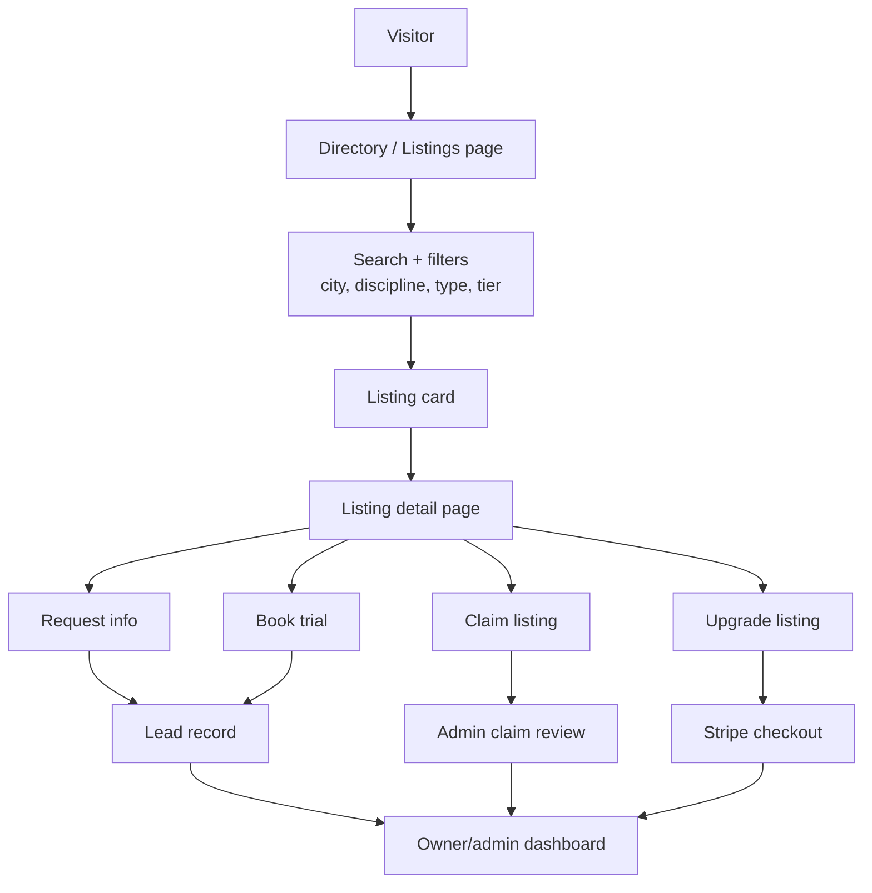
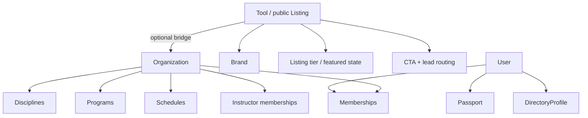
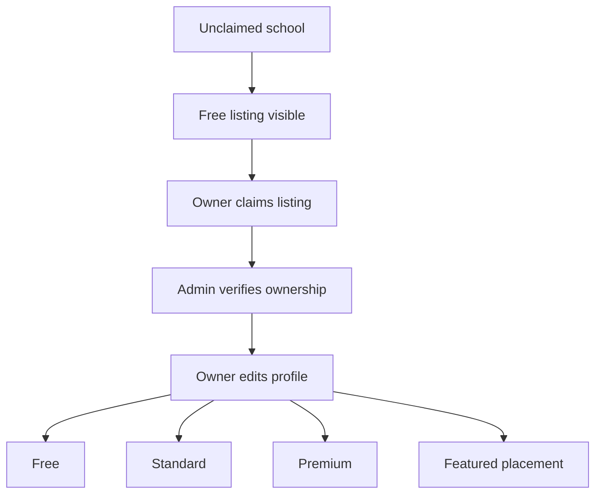
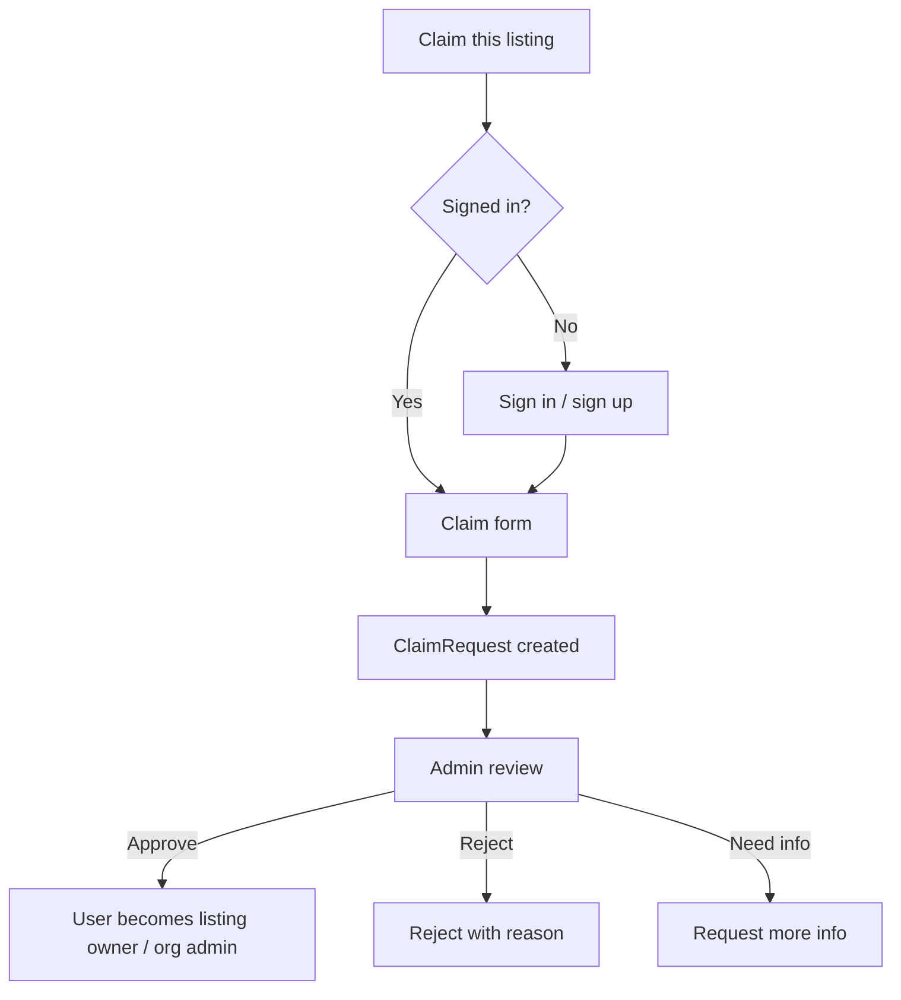
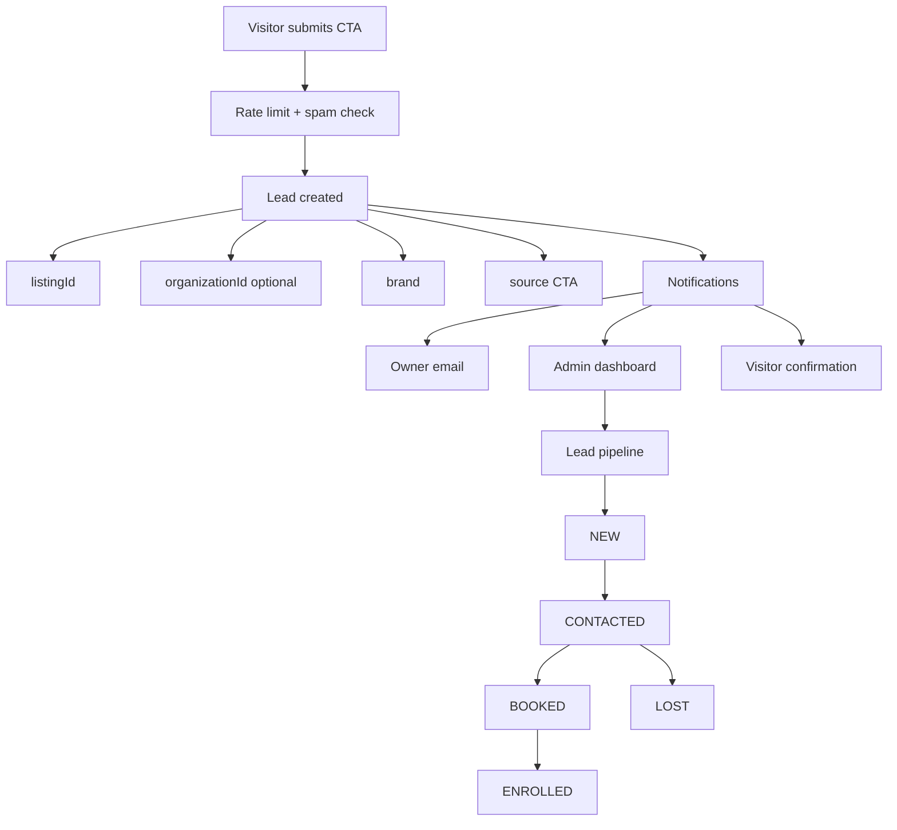
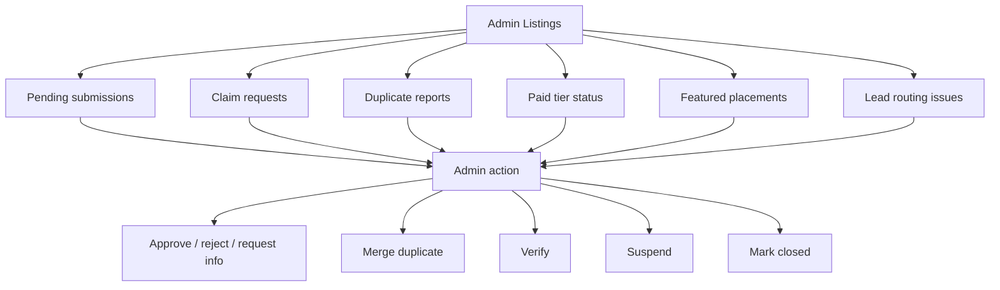
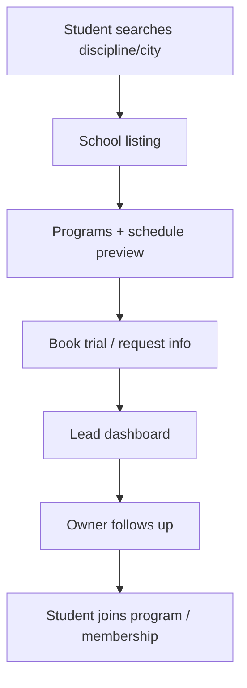
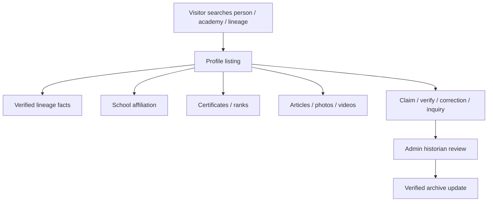
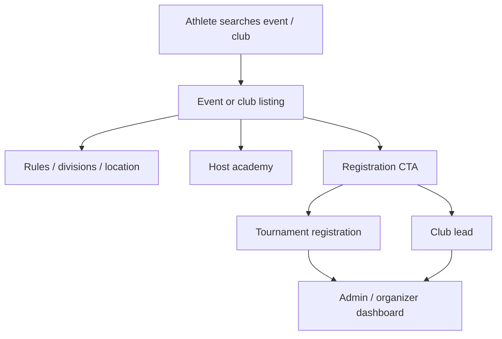
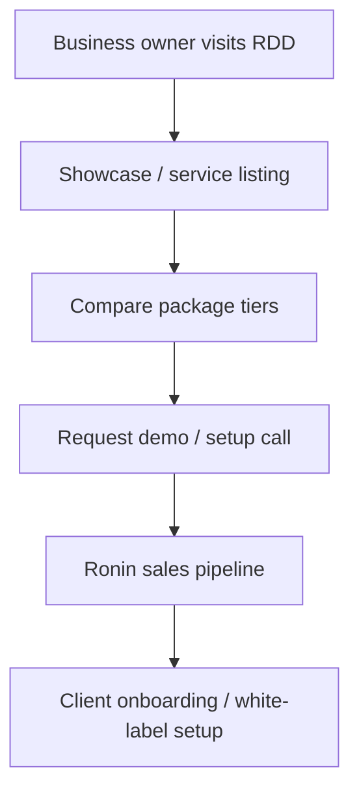

# Baseline Listings Runbook

## Purpose

Define the **Baseline-first listing system** that repurposes the Dirstarter `Tool` substrate as a martial-arts directory listing engine without prematurely rebuilding the data model.

This runbook exists so that:

- Baseline Martial Arts can prove the school-listing workflow first.
- Black Belt Legacy can inherit the pattern later for academies, instructors, lineage, events, and legacy products.
- WEKAF can inherit the pattern for academies, tournaments, officials, vendors, and sponsors.
- Ronin Dojo Design can inherit the pattern for client showcases, services, and white-label packages.
- Future agents do not confuse `Tool`, `Organization`, `DirectoryProfile`, and future `DirectoryListing` concepts.

---

## Source truth

The current repo decision is **Option B**:

```text
Internal substrate: Tool
Public language: Listing / Directory Listing / School Listing
Do not rename Prisma model yet.
Do not create a second directory stack yet.
Do not rename routes yet.
```

Why:

- Dirstarter already provides submission, admin review, scheduling, Stripe tier language, ads, and paid listing mechanics.
- The repo already has Ronin-native `Organization`, `Program`, `DirectoryProfile`, `Membership`, and `Discipline` models.
- Building a separate directory before the relationship between these models is locked would create duplicate workflows.

### SESSION_0165 integration note

This runbook was pulled from GitHub commit `a2f5f87a79ea15a89d063234bbc150864581ff8c` and integrated as a planning input, not as runtime implementation.

Use it with `docs/architecture/dirstarter-baseline-index.md` and `docs/architecture/dirstarter-upstream-sync-2026-05-14.md` before any Tool-to-Listing code change. Upstream Dirstarter `7e724b6` adds `ToolTier`, `Rejected`, `Deleted`, bookmarks, and tier priority; Ronin must port those deliberately instead of renaming or merging the whole Tool stack.

### SESSION_0207 implementation note

L4 landed the first runtime slice of this runbook on top of Ronin's existing `Tool` substrate:

- Public cards/detail pages now say Listing where L4 touches the Tool surface, show Free/Standard/Premium tier badges, show Featured/Verified status, and expose a Save bookmark affordance.
- `/admin/tools` remains the route and `Tool` remains the Prisma model, but the admin page is now the listing-admin gold standard: tier filter/column, tier transition panel, and `TIER_TRANSITION` audit rows.
- `Tool.tier` is now the admin source of truth for listing tier. `isFeatured` stays only as compatibility projection for Premium and old call sites.

Confirmed product direction: courses, techniques, programs, disciplines, school listings, org/team listings, and member listings should converge toward this listing/tool parity later. Do not expand the L4 implementation retroactively; stage that as a separate parity lane after the uplift lanes that already exist.

---

## Core doctrine

```text
Tool = internal Dirstarter listing substrate.
Listing = public monetized directory object.
Organization = real school / academy / business operations truth.
DirectoryProfile = person/member/instructor visibility and privacy.
Program = training offer / course / membership path.
Ad = paid placement calendar and sponsor inventory.
```

### What this means

A school listing should not become the school itself.

```text
Bad:
Tool pretends to be the whole school.

Good:
Tool/Listing markets the school.
Organization stores operational truth.
Memberships, Programs, Schedules, Leads, and Courses hang off Organization.
```

---

## 1. High-level listing system flow

```text
Visitor
  |
  v
Directory / Listings page
  |
  +--> Search / filter by city, discipline, rank, program, type
  |
  v
Listing card
  |
  v
Listing detail page
  |
  +--> Public school profile
  +--> CTA: Request info / Book trial / Claim listing / Upgrade listing
  |
  v
Lead / Claim / Checkout / Enrollment path
  |
  v
Admin review + owner dashboard
```



---

## 2. Data relationship map

### MVP relationship

```text
Tool / Listing
  |
  +--> optional organizationId
  +--> brand
  +--> tier / featured state
  +--> marketing copy
  +--> public images
  +--> CTA configuration
  +--> claim status
  +--> lead routing
```

### Organization truth

```text
Organization
  |
  +--> disciplines
  +--> programs
  +--> memberships
  +--> schedules
  +--> instructors
  +--> courses
  +--> tournaments
```

### Person truth

```text
User
  |
  +--> Passport
  +--> DirectoryProfile
  +--> Memberships
          |
          +--> role: STUDENT / INSTRUCTOR / OWNER / ADMIN
```



---

## 3. Baseline-first listing contract

A Baseline school listing should answer seven questions:

1. **What is this school?**
2. **Where is it?**
3. **What disciplines/programs does it offer?**
4. **Who teaches there?**
5. **How can a student take action?**
6. **Who owns or claims this listing?**
7. **What paid tier controls visibility and lead tools?**

### Required MVP fields

```text
Listing identity
  - brand
  - listingType
  - name
  - slug
  - shortDescription
  - description
  - status
  - tier

School profile
  - organizationId optional
  - logoUrl
  - heroImageUrl
  - addressLine1
  - addressLine2
  - city
  - region
  - postalCode
  - country
  - latitude optional
  - longitude optional

Contact / CTA
  - websiteUrl
  - phone
  - publicEmail
  - instagramUrl
  - youtubeUrl
  - primaryCtaLabel
  - primaryCtaUrl or leadFormMode
  - leadRecipientEmail

Martial arts metadata
  - disciplineIds
  - programIds optional
  - classTypes: kids, adults, women, private, competition, beginner
  - trialAvailable boolean
  - onlineTraining boolean
  - verified boolean
  - claimed boolean
```

### Future fields

```text
Commercial
  - tierStartedAt
  - tierExpiresAt
  - stripeSubscriptionId
  - featuredUntil
  - sponsoredPlacementIds

Trust / moderation
  - claimStatus
  - verificationStatus
  - duplicateOfId
  - reportCount
  - lastVerifiedAt
  - closedAt
  - movedToListingId

Analytics
  - viewCount
  - ctaClickCount
  - leadCount
  - searchAppearanceCount
```

---

## 4. Listing types

Use a type layer even if the internal model remains `Tool`.

| Listing type | Baseline | BBL | WEKAF | RDD |
| --- | --- | --- | --- | --- |
| `SCHOOL` | dojo/gym/academy | lineage academy | member academy | client school |
| `INSTRUCTOR` | coach profile | lineage holder / legend | coach/official | consultant |
| `PROGRAM` | course/path/trial | seminar/certification | rules clinic | service package |
| `EVENT` | seminar/tournament | promotion/legacy event | tournament | workshop |
| `VENDOR` | gear/partner | rings/certificates/archive partner | equipment/sponsor | software/partner |
| `RESOURCE` | article/tool/resource | historical archive | rulebook/resource | case study/template |

### Guardrail

Do not make `SCHOOL` the only shape. Baseline starts with schools, but BBL will need academies, instructors, lineage profiles, and legacy products.

---

## 5. Listing tiers

### Baseline MVP tiers

| Tier | Intended use | Features |
| --- | --- | --- |
| Free | basic discoverability | name, city, disciplines, website, claim button |
| Standard | real school profile | logo, images, description, contact CTA, trial CTA |
| Premium | lead engine | featured boosts, lead form, program links, analytics |
| Featured | sponsored placement | homepage/category boost, priority sorting, ad surface |

### Tier flow

```text
Unclaimed school
  |
  +--> Free listing visible
  |
  v
Owner claims listing
  |
  v
Admin verifies ownership
  |
  v
Owner edits profile
  |
  +--> stays Free
  +--> upgrades to Standard
  +--> upgrades to Premium
  +--> buys Featured placement
```



---

## 6. Claim flow

```text
Visitor clicks Claim this listing
  |
  v
Auth check
  |
  +--> not signed in: sign up / sign in
  +--> signed in: continue
  |
  v
Claim form
  |
  +--> role at school
  +--> contact email
  +--> phone
  +--> proof note
  +--> website/domain proof optional
  |
  v
ClaimRequest created
  |
  v
Admin review
  |
  +--> approve: user becomes listing owner / org admin
  +--> reject: reason logged
  +--> request more info
```



### Approval rule

A claim should never silently grant broad admin access. It should grant the narrowest useful permission first:

```text
Preferred MVP:
claim approval -> listing owner
optional manual promotion -> organization admin
```

---

## 7. Lead flow

```text
Visitor submits Request Info / Book Trial
  |
  v
Rate limit + spam check
  |
  v
Lead created
  |
  +--> listingId
  +--> organizationId optional
  +--> brand
  +--> source CTA
  +--> visitor contact
  +--> message
  |
  v
Notifications
  |
  +--> listing owner email
  +--> admin dashboard
  +--> optional user confirmation email
  |
  v
Owner follows up
  |
  v
Lead status: NEW -> CONTACTED -> BOOKED -> ENROLLED / LOST
```



---

## 8. Public page wireframes

### Listings index

```text
+----------------------------------------------------------+
| Baseline Martial Arts Directory                          |
| Find schools, instructors, and training programs.         |
+----------------------------------------------------------+
| Search: [ boxing, bjj, eskrima...            ] [Search]  |
| Filters: City [____] Discipline [v] Type [v] Tier [v]    |
+----------------------------------------------------------+
| [Featured School Card] [Featured School Card]             |
+----------------------------------------------------------+
| Results                                                  |
| +-------------------+  +-------------------+              |
| | Logo              |  | Logo              |              |
| | Boulder Dojo      |  | Baseline BJJ      |              |
| | BJJ / Muay Thai   |  | BJJ / Kids        |              |
| | Boulder, CO       |  | Denver, CO        |              |
| | [View] [Trial]    |  | [View] [Claim]    |              |
| +-------------------+  +-------------------+              |
+----------------------------------------------------------+
| Bottom sponsored placement                               |
+----------------------------------------------------------+
```

### Listing detail page

```text
+----------------------------------------------------------+
| HERO IMAGE                                               |
| School Name                         [Verified] [Premium] |
| Boulder, CO | BJJ | Muay Thai | Eskrima                  |
| [Request Info] [Book Trial] [Claim Listing]              |
+----------------------------------------------------------+
| About                                                    |
| Long school description, mission, training style.         |
+----------------------------+-----------------------------+
| Programs                   | Contact                     |
| - Beginner Foundations     | website                     |
| - BJJ Level 1              | phone                       |
| - Eskrima Level 1          | email                       |
+----------------------------+-----------------------------+
| Instructors                                              |
| [Instructor Card] [Instructor Card]                       |
+----------------------------------------------------------+
| Schedule Preview                                         |
| Mon 6pm Boxing | Tue 7pm BJJ | Thu 6pm Eskrima           |
+----------------------------------------------------------+
| Related schools / sponsored placement                    |
+----------------------------------------------------------+
```

### Owner dashboard

```text
+----------------------------------------------------------+
| My Listing: Boulder Dojo                    Tier: Premium|
+----------------------------------------------------------+
| Profile completeness: 82%                                |
| [Edit Profile] [Manage Photos] [Upgrade]                 |
+----------------------------------------------------------+
| Leads                                                    |
| New: 3 | Contacted: 5 | Booked: 2 | Enrolled: 1          |
+----------------------------------------------------------+
| Analytics                                                |
| Views: 1,240 | CTA clicks: 93 | Leads: 14                |
+----------------------------------------------------------+
| Verification                                             |
| Status: Verified | Last checked: 2026-05-14              |
+----------------------------------------------------------+
```

---

## 9. Admin workflow

```text
Admin Listings
  |
  +--> Pending submissions
  +--> Claim requests
  +--> Duplicate reports
  +--> Paid tier status
  +--> Featured placements
  +--> Lead routing issues
  |
  v
Admin action
  |
  +--> approve / reject / request info
  +--> merge duplicate
  +--> verify listing
  +--> suspend listing
  +--> mark closed
```



---

# Brand spec sheets

## A. Baseline Martial Arts spec sheet

### Brand role

Baseline proves the practical school listing engine.

### Primary listing types

| Priority | Type | Notes |
| --- | --- | --- |
| 1 | School | CU Boulder / local schools / partner gyms |
| 2 | Program | Foundations, Eskrima L1, BJJ L1, private lessons |
| 3 | Instructor | coach profiles connected to DirectoryProfile |
| 4 | Event | seminars, intro workshops, in-house tournaments |
| 5 | Vendor | gear, affiliate partners |

### Primary CTAs

- Request info
- Book trial class
- Join program
- Claim listing
- Upgrade listing

### Baseline listing flow

```text
Student searches discipline/city
  |
  v
Finds school listing
  |
  v
Reads programs + schedule preview
  |
  v
Books trial or requests info
  |
  v
Lead enters school dashboard
  |
  v
Owner follows up
  |
  v
Student joins program / membership
```



### Baseline MVP acceptance

- `/listings` or relabeled `/tools` page shows school language, not tool language.
- At least one Baseline school listing can point to an Organization.
- A visitor can submit a lead.
- Admin can see lead source.
- Claim flow can be staged even if approval is manual.
- Free / Standard / Premium copy is visible and Stripe-aligned.

---

## B. Black Belt Legacy spec sheet

### Brand role

BBL turns the listing engine into a lineage and legacy archive.

### Primary listing types

| Priority | Type | Notes |
| --- | --- | --- |
| 1 | Instructor | legends, coral belts, black belts, lineage holders |
| 2 | School | academies connected to instructors/lineage |
| 3 | Lineage profile | historical chain / association / family tree |
| 4 | Event | promotions, seminars, legacy gatherings |
| 5 | Vendor/Product | rings, certificates, archive products |

### Primary CTAs

- View lineage
- Claim profile
- Request verification
- Submit correction
- Join legacy archive
- Buy / inquire about legacy product

### BBL listing flow

```text
Visitor searches person / academy / lineage
  |
  v
Profile listing
  |
  +--> verified lineage facts
  +--> school affiliation
  +--> certificates / ranks
  +--> articles / photos / videos
  |
  v
CTA: claim / verify / correction / product inquiry
  |
  v
Admin historian review
  |
  v
Verified archive update
```



### BBL special rules

- Never let a public claim overwrite historical truth automatically.
- Claims become review requests, not immediate edits.
- Support disputed, unverified, verified, memorial, and historical statuses later.
- Keep source notes and audit history.

### BBL future data needs

```text
LineageProfile
  - personName
  - rank
  - promotionDate
  - promotedBy
  - lineageChain
  - sourceNotes
  - verificationStatus
  - relatedAcademyIds
  - relatedArticleIds
  - relatedCertificateIds
```

---

## C. WEKAF spec sheet

### Brand role

WEKAF uses listings for events, academies, officials, vendors, and sponsors.

### Primary listing types

| Priority | Type | Notes |
| --- | --- | --- |
| 1 | Event | tournaments, qualifiers, seminars |
| 2 | School | member clubs / academies |
| 3 | Instructor / Official | coaches, judges, referees |
| 4 | Vendor | equipment suppliers |
| 5 | Sponsor | tournament sponsors |

### Primary CTAs

- Register for event
- Find club
- Apply as official
- Sponsor event
- Claim academy
- Vendor inquiry

### WEKAF flow

```text
Athlete searches event / club
  |
  v
Event or club listing
  |
  +--> rules / divisions / location
  +--> host academy
  +--> registration CTA
  |
  v
Tournament registration or club lead
  |
  v
Admin / organizer dashboard
```



### WEKAF special rules

- Events need date/time/location accuracy.
- Sponsor placement needs date-bounded inventory.
- Officials need verification before public authority badges.
- Vendor listings may need event-specific sponsorship packages.

---

## D. Ronin Dojo Design spec sheet

### Brand role

RDD uses listings as white-label showcase and services catalog.

### Primary listing types

| Priority | Type | Notes |
| --- | --- | --- |
| 1 | Client showcase | schools / orgs using the platform |
| 2 | Service package | website, directory, tournament, content engine |
| 3 | Case study | before/after, launch proof, metrics |
| 4 | Template | reusable website/app package |
| 5 | Partner/vendor | integrations and service partners |

### Primary CTAs

- Request demo
- Book consultation
- View case study
- Start setup
- Ask about white-label package

### RDD flow

```text
Business owner visits RDD
  |
  v
Views showcase / service listing
  |
  v
Compares package tiers
  |
  v
Requests demo or setup call
  |
  v
Lead enters Ronin sales pipeline
  |
  v
Client onboarding / white-label setup
```



### RDD special rules

- RDD listings should sell services, not martial arts classes.
- Case studies should connect to proof: launch date, domain, brand, features, before/after state.
- RDD can dogfood the listing engine as a services marketplace.

---

# Implementation sequence

## Phase 0 — Copy/relabel pass

Goal: no public user sees "Tool" when the product intent is directory listing.

Scope:

```text
Admin UI strings
Public UI strings
Submission copy
Claim copy
Stripe product copy
Metadata copy
```

Do not rename:

```text
Prisma model Tool
server/admin/tools paths
server/web/tools paths
/tool routes unless explicitly planned
```

## Phase 1 — Baseline school listing MVP

Goal: make school listings useful before BBL complexity.

Deliverables:

1. School listing fields and copy.
2. Optional Organization bridge.
3. Disciplines and city/region filters.
4. Lead form.
5. Manual claim workflow.
6. Tier copy: Free / Standard / Premium.
7. Admin review screen.

## Phase 2 — Paid listing proof

Goal: prove monetization without rebuilding model.

Deliverables:

1. Stripe Checkout for Standard/Premium listing.
2. Webhook updates listing tier/featured state.
3. Owner dashboard shows tier and leads.
4. Admin sees payment/tier status.
5. Expired subscription downgrades listing gracefully.

## Phase 3 — SEO and location pages

Goal: make discovery scale.

Deliverables:

1. `/schools` landing page.
2. `/schools/[city]` or `/schools/[region]/[city]` route.
3. `/disciplines/[discipline]/schools` route.
4. sitemap coverage.
5. structured data for LocalBusiness / SportsActivityLocation where appropriate.

## Phase 4 — BBL generalization

Goal: expand from school listings to legacy listings.

Deliverables:

1. Listing type UI switcher.
2. Instructor / lineage profile templates.
3. Verification and correction request workflow.
4. Source notes and audit trail.
5. Historical status labels.

---

# Acceptance checklist

## Baseline launch checklist

- [ ] Public copy says Listings / Schools, not Tools.
- [ ] Admin copy says Listings where user-facing.
- [ ] One Baseline school listing can be viewed publicly.
- [ ] School listing can optionally point to Organization.
- [ ] Listing filters work for city and discipline.
- [ ] Listing detail page has Request Info CTA.
- [ ] Lead is persisted with brand + listing source.
- [ ] Claim CTA exists and creates a reviewable request or manual process.
- [ ] Free / Standard / Premium tiers are visible.
- [ ] Premium / featured state changes sorting or placement.
- [ ] Admin can approve/reject/suspend a listing.
- [ ] No code path grants organization admin rights from a claim without review.

## BBL readiness checklist

- [ ] Listing type is not hardcoded to school only.
- [ ] Instructor/person profile shape is defined.
- [ ] Verification status can represent unverified and disputed claims.
- [ ] Claims do not auto-edit verified lineage facts.
- [ ] Source notes / proof fields are planned.
- [ ] Academy and instructor relationships can both be represented.

---

# Open decisions

## OD-001 — Route naming

Should public routes become `/listings`, `/schools`, or stay `/tools` behind relabeled UI?

Recommendation:

```text
Baseline public: /schools or /listings
Internal/admin for now: /admin/tools may remain until structural rename.
```

## OD-002 — Generic listing bridge

Should `Tool` get optional foreign keys like `organizationId`, `programId`, `userId`, `eventId`, or should a new join table bridge listing targets?

Recommendation:

```text
Use a flexible bridge table when moving beyond Baseline:
ListingTarget(listingId, targetType, targetId)
```

MVP Baseline can start with only `organizationId` if faster.

## OD-003 — Claim model

Do we create a formal `ListingClaim` model now or use admin/manual notes first?

Recommendation:

```text
Create ListingClaim before public launch.
Manual review is fine, but the request should be persisted.
```

## OD-004 — Tier storage

Do we keep `isFeatured` only, or add a listing tier enum?

Recommendation:

```text
For production paid listings, add tier.
isFeatured alone is too weak for Free / Standard / Premium behavior.
```

---

# Hostile review checklist

Before shipping a listing session, ask:

1. Did we create duplicate directory truth instead of reusing existing substrate?
2. Did a claim grant too much permission?
3. Can a Brand A admin edit a Brand B listing?
4. Can a paid listing show after Stripe subscription expiry?
5. Does lead routing expose private emails?
6. Does BBL lineage data become auto-editable by a claimant?
7. Does public copy still say Tool anywhere?
8. Does the listing page generate real business action, or only display data?
9. Does the search/filter path work without overloading the DB?
10. Is this still compatible with Baseline, BBL, WEKAF, and RDD?

---

# Petey close

Baseline proves the engine.

BBL inherits the engine and adds history, lineage, verification, and prestige.

Do not overbuild the lineage museum before the school listing can generate one clean lead.

**Planned Passion Produces Purpose.**
**OSSS.**
