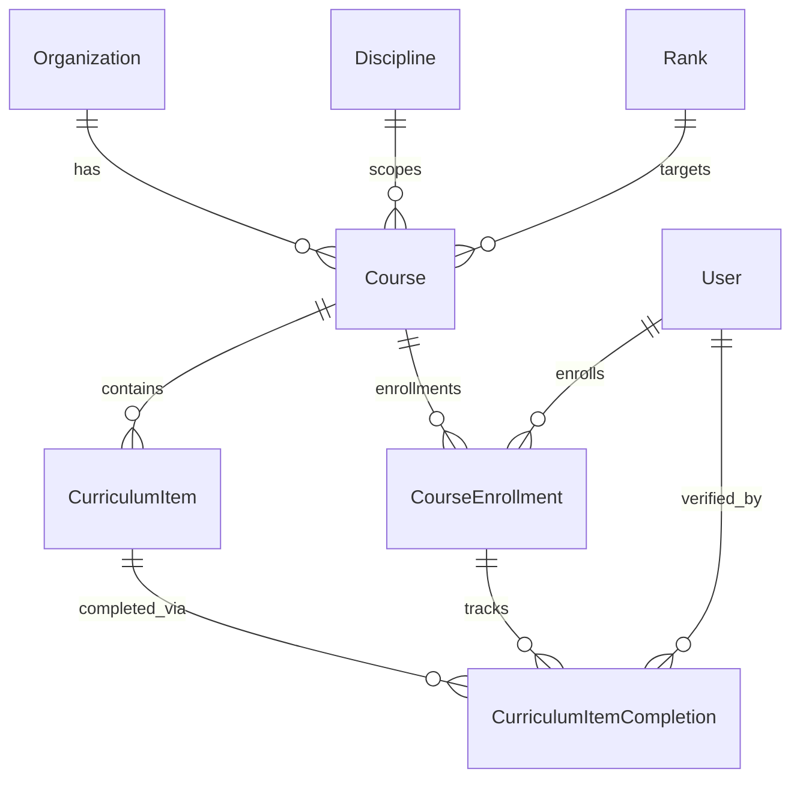
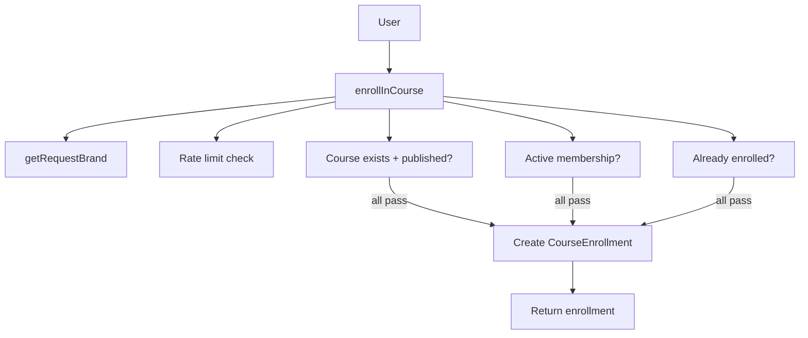
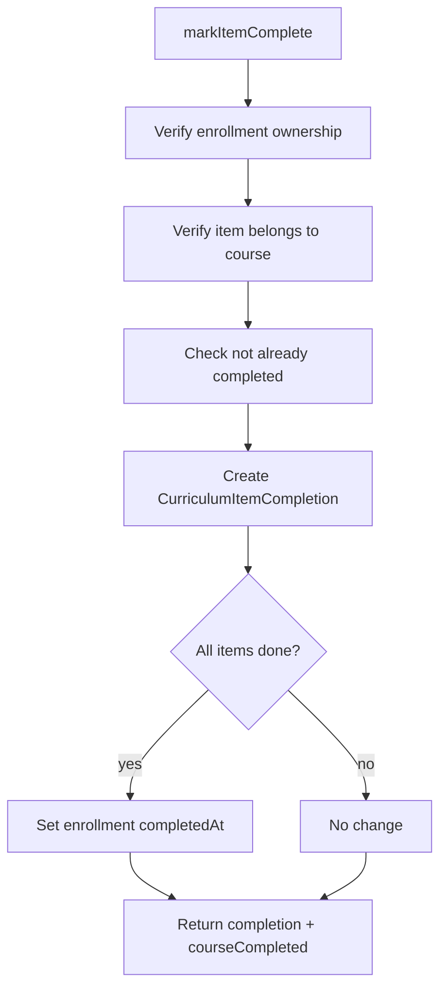

# Course + Curriculum Runbook

## Purpose

Operational SOP for the course and curriculum system: data model, seed data, server actions, admin queries, and the end-to-end enrollment→completion→certification flow.

For the high-level data flow diagram, see [sop-data-and-wiring-flows.md §12](sop-data-and-wiring-flows.md#12-program--course--enrollment-flow-session_0146). This runbook is the operational companion — how to set up, run, and extend the course system.

---

## 1. Data model

```text
Organization (brand-scoped)
  |
  v
Course (brand + org + discipline + optional rank)
  |
  +--> certificationType: SAFETY | BELT_RANK | COACH
  +--> isPublished / publishedAt
  |
  v
CurriculumItem (ordered items within a course)
  |
  +--> order, title, notes, mediaUrl
  +--> techniqueLinks (TechniqueCurriculumLink)
  |
  v
CourseEnrollment (user × course, unique)
  |
  +--> enrolledAt, completedAt (auto-set when all items done)
  |
  v
CurriculumItemCompletion (enrollment × item, unique)
  |
  +--> completedAt, notes, verifiedById
  +--> gamificationEvents
```



### Key constraints

| Constraint | SQL | Purpose |
| --- | --- | --- |
| Course slug uniqueness | `@@unique([brand, organizationId, slug])` | No duplicate slugs within a brand+org |
| Enrollment uniqueness | `@@unique([userId, courseId])` | One enrollment per user per course |
| Completion uniqueness | `@@unique([enrollmentId, curriculumItemId])` | One completion per item per enrollment |

### CertificationType enum

| Value | Meaning | Seed pattern |
| --- | --- | --- |
| `SAFETY` | Safety orientation course | 1 per discipline (12 total) |
| `BELT_RANK` | Fundamentals for a specific rank | 1 per rank per rank system (~194 total) |
| `COACH` | Coaches certification | 1 per discipline (12 total) |

---

## 2. Seed data setup

### What the seed creates

| Entity | Count | Notes |
| --- | --- | --- |
| Courses | ~218 | 12 Safety + ~194 Fundamentals + 12 Coaches |
| CurriculumItems | ~654 | 3 per course |
| CourseEnrollment | 1 | sensei → BJJ Safety School |
| CurriculumItemCompletion | 1 | sensei completed first item |

### Seed data per discipline

Each of the 12 disciplines gets:

1. **Safety School** (`SAFETY`) — 3 items: Etiquette & Rules, Injury Prevention, Emergency Procedures
2. **Fundamentals per rank** (`BELT_RANK`) — one course per rank in each rank system, 3 items each: Core Techniques, Concepts & Principles, Assessment Criteria
3. **Coaches Certification** (`COACH`) — 3 items: Teaching Methodology, Student Safety, Curriculum Delivery

Eskrima has 2 rank systems (PIMA Denver + PIMA Jersey) — fundamentals courses are generated per rank system with unique slugs.

### Running the seed

```bash
# Full reset (destructive — local dev only)
/Applications/Postgres.app/Contents/Versions/latest/bin/dropdb ronindojo_dev
/Applications/Postgres.app/Contents/Versions/latest/bin/createdb ronindojo_dev
cd apps/web
bunx prisma migrate dev        # applies all migrations + runs seed
```

```bash
# Seed only (after migrations are current)
cd apps/web
bunx prisma db seed
```

### Expected output

```text
...
Seeded 218 courses with 654 curriculum items
Seeded 1 CourseEnrollment + 1 CurriculumItemCompletion (sensei → BJJ Safety)
Seeding completed!
```

### Adding a new discipline's courses

If a new discipline is added to the seed:

1. Add the discipline to the `allDisciplines` array in `prisma/seed.ts`
2. Add a rank system for it (the loop auto-generates fundamentals courses per rank)
3. Re-run the seed — Safety, Fundamentals, and Coaches courses are generated automatically

---

## 3. Server actions — file map

All course enrollment server code lives in `server/web/course-enrollment/`:

```text
server/web/course-enrollment/
  ├── actions.ts     — 4 server actions (user-facing)
  ├── errors.ts      — error catalog (12 codes)
  ├── payloads.ts    — Prisma select payloads + TS types
  ├── queries.ts     — 3 admin read queries
  └── schemas.ts     — Zod input schemas
```

Distinct from `server/web/enrollment/` which handles **ProgramEnrollment** (waitlist, capacity, withdraw).

---

## 4. Enrollment flow

### End-to-end: user enrolls in a course

```text
User (authenticated)
  |
  v
enrollInCourse({ courseId })
  |
  +--> getRequestBrand() → brand
  +--> isRateLimited(userId, "enrollment_write")
  +--> assertCourseExists(courseId, brand) → must be published
  +--> assertUserHasActiveMembership(userId, brand, org)
  +--> check no existing enrollment (unique constraint)
  |
  v
CourseEnrollment row created
  |
  v
return { enrollment: { id, enrolledAt } }
```



### Unenroll

```text
unenrollFromCourse({ enrollmentId })
  |
  +--> verify enrollment belongs to user
  +--> delete enrollment (cascades completions)
  |
  v
return { success: true }
```

---

## 5. Completion flow

### Mark item complete

```text
markItemComplete({ enrollmentId, curriculumItemId, notes? })
  |
  +--> verify enrollment belongs to user
  +--> verify curriculum item belongs to enrolled course
  +--> check not already completed
  |
  v
CurriculumItemCompletion created
  |
  v
Auto-check: all items complete?
  +--> yes → set courseEnrollment.completedAt = now
  +--> no → no change
  |
  v
return { completion, courseCompleted: bool }
```



### Mark item incomplete

```text
markItemIncomplete({ completionId })
  |
  +--> verify completion belongs to user's enrollment
  |
  v
$transaction:
  1. delete CurriculumItemCompletion
  2. clear courseEnrollment.completedAt (if set)
  |
  v
return { success: true }
```

---

## 6. Admin queries

| Query | Input | Returns |
| --- | --- | --- |
| `getCourseEnrollments` | `{ brand, courseId }` | All enrollments for a course, with user + completion count |
| `getEnrollmentProgress` | `{ brand, enrollmentId }` | Single enrollment with all curriculum items + completions |
| `getCourseEnrollmentStats` | `{ brand, courseId }` | `{ totalEnrolled, totalCompleted }` |

All queries scope through `course.brand` — no cross-brand data leakage.

---

## 7. Entitlement gate

Course enrollment requires an **active membership** in the course's organization. This is checked via:

```text
Membership.findFirst({
  brand, organizationId, userId, status: "ACTIVE"
})
```

This is a simpler gate than the full entitlement key system (`checkEntitlement()`). The current design assumes:

- If you're an active member of the org, you can enroll in any published course
- Future: paid courses could use `checkEntitlement()` with a `course-access:{courseId}` key

### How this connects to the payment flow

See [sop-data-and-wiring-flows.md §13](sop-data-and-wiring-flows.md#13-payment--stripe-checkout-flow-session_0146) for the Stripe checkout → enrollment creation path. Currently:

1. User purchases membership via Stripe → `checkout.session.completed` webhook → Membership created
2. User browses published courses → enrollment gate checks active membership
3. User enrolls → CourseEnrollment created

### How this connects to invites

See [invites.md](invites.md) for the invite→claim→membership flow. After an invited user claims their invite and gets an active Membership, they can immediately enroll in courses.

---

## 8. Certification readiness (downstream)

When a `BELT_RANK` course is completed (all items done → `completedAt` set):

```text
CourseEnrollment.completedAt != null
  |
  v
Course.certificationType == BELT_RANK
Course.rankId → target rank
  |
  v
(Future) Trigger certification readiness check
  +--> instructor review
  +--> RankAward creation
  +--> Certification issuance
```

See [sop-data-and-wiring-flows.md §15](sop-data-and-wiring-flows.md#15-certification-issuance-flow-session_0146) for the certification issuance flow.

This connection is **not yet wired** — it's a future SESSION task. Currently, completing a course sets `completedAt` but does not auto-create a RankAward or Certification.

---

## 9. Rate limiting

All 4 actions use the `enrollment_write` rate limiter:

```text
20 mutations per minute per actor
```

Same limiter shared with ProgramEnrollment actions. Fail-open if Redis is unavailable (per `isRateLimited` implementation).

---

## 10. Troubleshooting

### Seed fails with unique constraint violation

```text
Unique constraint failed on the fields: (`brand`, `"organizationId"`, `slug`)
```

**Cause:** Running seed on a database that already has course data. The seed is not idempotent for courses.

**Fix:** Full reset:

```bash
/Applications/Postgres.app/Contents/Versions/latest/bin/dropdb ronindojo_dev
/Applications/Postgres.app/Contents/Versions/latest/bin/createdb ronindojo_dev
cd apps/web && bunx prisma migrate dev
```

### Enrollment fails: "User must have an active membership"

The user doesn't have an `ACTIVE` Membership for the course's organization. Check:

```sql
SELECT id, status, "organizationId" FROM "Membership"
WHERE "userId" = '<user-id>' AND brand = 'BASELINE_MARTIAL_ARTS';
```

### Course not found despite existing in DB

The action checks `isPublished = true`. Unpublished courses are invisible to enrollment actions.

---

## Cross-references

| Doc | What it covers |
| --- | --- |
| [sop-data-and-wiring-flows.md §12](sop-data-and-wiring-flows.md#12-program--course--enrollment-flow-session_0146) | High-level Program→Course→Enrollment data flow |
| [sop-data-and-wiring-flows.md §13](sop-data-and-wiring-flows.md#13-payment--stripe-checkout-flow-session_0146) | Stripe checkout→enrollment creation |
| [sop-data-and-wiring-flows.md §15](sop-data-and-wiring-flows.md#15-certification-issuance-flow-session_0146) | Certification issuance flow |
| [sop-e2e-user-lifecycle.md §4](sop-e2e-user-lifecycle.md) | Course/curriculum lifecycle in user journey |
| [stripe-setup-runbook.md](stripe-setup-runbook.md) | Stripe keys, webhooks, payment pipeline |
| [invites.md](invites.md) | Invite→claim→membership→enrollment path |

## Rollback

Courses and enrollments are soft-deletable via admin UI (future). For seed data, use the full DB reset procedure above. Deleting a Course cascades to CurriculumItems, CourseEnrollments, and CurriculumItemCompletions.

## Last verified

2026-05-13 — SESSION_0156. Seed runs cleanly (218 courses, 654 items). All 4 actions + 3 queries type-check. `tsc --noEmit` zero errors.
