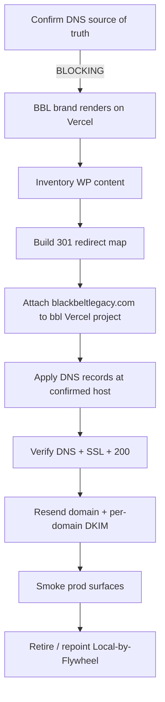

# Black Belt Legacy Production Runbook

## Purpose

Take `blackbeltlegacy.com` live as the **BBL brand on the existing Vercel multi-brand app** (`data-brand="BBL"`, already serving on `bbl.local:3000`), cutting over from the current WordPress site hosted on Flywheel (Local-by-Flywheel `blackbeltlegacy.local` → getflywheel.com).

> **Architecture decision (SESSION_0284):** BBL is a brand inside `ronin-dojo-app`, not a separate codebase and not a Dirstarter clone deployed to Flywheel. Flywheel is WordPress-only; a Next.js app cannot push-button deploy there. So the cutover is **DNS repoint from Flywheel/WordPress → Vercel**, plus content migration and redirects. WordPress is retired or kept solely as a content source. Aligns with ADR 0006 (all brands on one Vercel deployment).

This runbook documents only the **BBL-specific deltas**. The generic domain-attach + DNS mechanics live in [vercel-domain-setup-runbook](vercel-domain-setup-runbook.md) — follow it, do not re-derive it here.

---

## Reused runbooks (do these; this doc only adds BBL specifics)

| Concern | Authoritative doc | Notes |
| --- | --- | --- |
| Attach domain + DNS records | [vercel-domain-setup-runbook](vercel-domain-setup-runbook.md) | Bluehost→Vercel; brand-rollout line already says `blackbeltlegacy.com → attach to bbl Vercel project`. |
| Vercel build/deploy config | [vercel-deploy](vercel-deploy.md) | pnpm monorepo, root `apps/web`, lockfile gate. |
| General deploy procedure | [deployment](deployment.md) | release steps. |
| Transactional email | [resend-setup-runbook](../integrations/resend-setup-runbook.md) | per-domain DKIM (BBL needs its own key). |
| White-label surfaces | [white-label-site-runbook](white-label-site-runbook.md) | confirm BBL name/theme resolve before go-live. |

Governing ADRs: [ADR 0006](../../architecture/decisions/0006-multi-domain-hosting.md) (one Vercel deployment, all brands), [ADR 0015](../../architecture/decisions/0015-domain-hosting-infrastructure.md) (Bluehost stays DNS registrar, record-based — no Vercel nameserver delegation).

---

## ⚠️ OPEN — resolve before any DNS change

**`blackbeltlegacy.com` DNS source of truth is unconfirmed.** ADR 0015 assumes Bluehost is the registrar/DNS host for all brand domains, but BBL has been running on **Flywheel/WordPress**, which may mean the zone is currently managed at Flywheel (or another registrar), not Bluehost.

Confirm first:

```bash
# Who is authoritative for the zone right now?
dig +short blackbeltlegacy.com NS
# Where does the apex currently point (Flywheel IP vs Vercel edge)?
dig +short blackbeltlegacy.com A
whois blackbeltlegacy.com | grep -iE "registrar|name server"
```

- If NS = `ns1/ns2.bluehost.com` → proceed exactly per vercel-domain-setup-runbook.
- If NS points at Flywheel / another host → decide: move the zone to Bluehost (to match ADR 0015), or edit records at the current host. **Record this decision + an ADR note before touching DNS.** Do not change DNS until this is resolved.

No DNS changes were made in SESSION_0284 — this is documentation only.

---

## Cutover sequence (WordPress → Vercel)

```text
0. Confirm DNS source of truth (above) — BLOCKING
1. Confirm BBL brand renders correctly on Vercel preview/prod
   - data-brand=BBL, name/theme/metadata = Black Belt Legacy (white-label runbook)
   - BBL production deploy is green (vercel-deploy: lockfile committed)
   - `/disciplines/bjj` renders the Rigan Machado BJJ Lineage section for the BBL brand
   - `/lineage/rigan-machado-bjj-lineage` returns the BBL-scoped published tree
2. Inventory WordPress content to migrate
   - landing-page content, articles (incl. Rigan Red-Belt / Rorion Gracie), media
   - decide fate: migrate into content engine vs keep WP as content source vs archive
3. Build 301 redirect map: old WP URLs → new Vercel routes
   - capture top WP permalinks; map to /, /blog/<slug>, /lineage/..., etc.
4. Attach domain in Vercel (bbl project) — vercel-domain-setup-runbook steps 1-2
5. Apply DNS records at the confirmed host — vercel-domain-setup-runbook step 4
6. Verify DNS + SSL + 200 serve — vercel-domain-setup-runbook steps 5-7
7. Resend: add blackbeltlegacy.com domain + its own DKIM, verify — resend-setup-runbook
8. Smoke prod: home, `/disciplines/bjj`, `/lineage/rigan-machado-bjj-lineage`, a migrated article, an auth/magic-link email
9. Retire or repoint Local-by-Flywheel (stop the push-button WP deploy path)
```



---

## Content migration notes

- **Landing content + articles** come from `ronin-dojo-monorepo` (the current WordPress source). The content-engine port is a separate planned session (see white-label/roadmap); this runbook only flags that go-live should not orphan existing WP article URLs — hence the 301 map in step 3.
- **Media** (logos, images) should land in S3 via the asset pipeline (separate session) before being referenced by the live BBL brand, so go-live doesn't depend on WordPress media URLs.

## Redirect map (fill during cutover)

| Old WordPress URL | New Vercel route | Status |
| --- | --- | --- |
| `https://blackbeltlegacy.com/` | `/` (data-brand=BBL) | pending |
| `https://blackbeltlegacy.com/<article>` | `/blog/<slug>` | pending |
| _add rows as the WP permalink inventory is captured_ | | |

---

## Rollback

If prod serve regresses after cutover:

1. The fastest rollback is DNS: repoint the apex `A` / `www` `CNAME` back to the prior Flywheel target (keep the old values recorded before step 5).
2. Vercel-side: redeploy the last-known-good production deployment from the `bbl` project Deployments tab.
3. Email: Resend verification is additive — leaving the BBL Resend domain in place during a DNS rollback is harmless.

Keep the pre-cutover `dig` output saved so rollback values are known.

---

## Cross-references

- [Vercel Domain Setup Runbook](vercel-domain-setup-runbook.md) — generic Bluehost→Vercel domain attach (the mechanics).
- [Vercel Deploy Runbook](vercel-deploy.md) — pnpm monorepo build config + lockfile gate.
- [Deployment Runbook](deployment.md) — general release procedure.
- [White-Label Site Runbook](white-label-site-runbook.md) — confirm BBL brand surfaces resolve before go-live.
- [Resend Setup Runbook](../integrations/resend-setup-runbook.md) — per-domain DKIM for blackbeltlegacy.com.
- [ADR 0006 — Multi-domain hosting](../../architecture/decisions/0006-multi-domain-hosting.md)
- [ADR 0015 — Domain Hosting Infrastructure](../../architecture/decisions/0015-domain-hosting-infrastructure.md)

**Honor the Lineage. Build the Future.**
**OSSS.**
