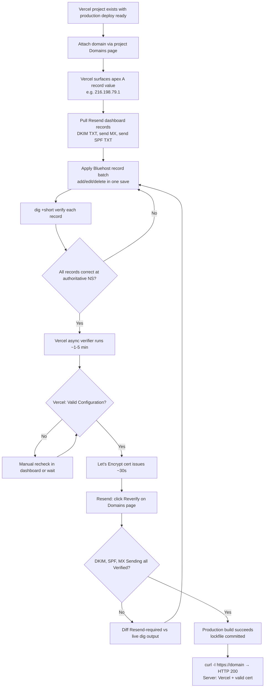

# Vercel Domain Setup Runbook (Bluehost + Cloudflare DNS)

Step-by-step operator guide for attaching a new custom domain to a Vercel project. The original
(and still primary) path keeps Bluehost as the DNS registrar/host (per ADR 0015): Vercel
attachment, Bluehost record edits, Resend transactional-email record alignment (parallel records
share the same zone), verification, and the production-build-readiness gate that's easy to miss.

Codifies the SESSION_0159 procedure for `baselinemartialarts.com` so the remaining three brand domains (`ronindojodesign.com`, `wekafusa.com`, `blackbeltlegacy.com`) reach a verified `https://` serve state without rediscovering the same pitfalls.

A second path — **Cloudflare-managed zones** (added SESSION_0633, driving case `mammothmb.com` in
the client's own Cloudflare account) — is covered in
["Cloudflare DNS (third-party zone) → Vercel"](#cloudflare-dns-third-party-zone--vercel) below.
Steps 1–2 (attach in Vercel) and the Production Build Readiness gate apply to both paths; only the
record-editing and verification mechanics differ.

## Prerequisites

- Vercel CLI ≥ 53.x installed locally and authenticated (`vercel whoami` returns a username; if it doesn't, run `vercel login` in your own terminal — the device-login flow needs a browser).
- Bluehost account with DNS zone-editor access for the target domain.
- Resend account with the target domain added in **Domains** (only required if the domain sends transactional email).
- A Vercel project to attach the domain to (e.g., `ronin-dojo-baseline`).
- `dig` available locally.
- Repo has a committed lockfile (`bun.lock` for this monorepo) — without one, Vercel falls back to npm install and the production build will silently fail in ~7s with `next: command not found`. See SESSION_0159 for the regression history.

## Architecture Context

```
┌─────────────────────────────────────────────────────────────────────┐
│        DOMAIN AUTHORITY CHAIN (record-based path, ADR 0015)         │
├─────────────────────────────────────────────────────────────────────┤
│                                                                     │
│  .com TLD nameservers                                               │
│       │ NS records → ns1.bluehost.com / ns2.bluehost.com           │
│       ▼                                                             │
│  Bluehost authoritative DNS (the editable zone)                     │
│       │ A     @    → 216.198.79.1     (Vercel edge anycast)        │
│       │ CNAME www  → cname.vercel-dns.com                          │
│       │ MX    @    → inbound-smtp.us-east-1.amazonaws.com (Resend) │
│       │ MX    send → feedback-smtp.us-east-1.amazonses.com         │
│       │ TXT   send → v=spf1 include:amazonses.com ~all             │
│       │ TXT   resend._domainkey → p=MIGfMA0G…IDAQAB (dedicated)    │
│       │ TXT   _dmarc → v=DMARC1; p=none;                           │
│       ▼                                                             │
│  Vercel edge / Resend SES infrastructure (serves traffic + email)   │
│                                                                     │
└─────────────────────────────────────────────────────────────────────┘
```

We explicitly **do not** delegate DNS to Vercel (`ns*.vercel-dns.com`) per ADR 0015. The Vercel dashboard will keep suggesting delegation in an "Intended Nameservers" column — that's a UI default, not a recommendation. Ignore it.

## Current Vercel Truth

Live Dirstarter deployment docs checked on 2026-05-14 describe a Vercel/Next.js deployment with production environment variables. The Ronin production app currently uses the `apps/web` Vercel app root:

| Setting | Current value |
| --- | --- |
| Root Directory | `apps/web` |
| Framework Preset | `Next.js` |
| Output Directory | Next.js default |
| Install Command | `cd ../.. && bun install --frozen-lockfile` |
| Build Command | `cd ../.. && bun run --filter @ronin-dojo/web db:generate && bun run --filter @ronin-dojo/web build` |
| Active app-root config | `apps/web/vercel.json` |

Treat any repo-root `vercel.json` guidance as historical/root fallback only. Use it only when the active source for a project proves Vercel is building from the repo root.

## End-to-End Flow



## Canonical Live DNS State (the target)

After all edits propagate, `dig` should match this exactly. Use it as the verification checklist.

```
┌──────────┬───────────────────────┬─────────────────────────────────────────────────────┐
│ Type     │ Host (relative to @)  │ Expected value                                      │
├──────────┼───────────────────────┼─────────────────────────────────────────────────────┤
│ NS       │ @                     │ ns1.bluehost.com / ns2.bluehost.com  (registrar)    │
│ A        │ @                     │ 216.198.79.1                         (Vercel edge)  │
│ CNAME    │ www                   │ cname.vercel-dns.com                 (Vercel www)   │
│ MX 10    │ @                     │ inbound-smtp.us-east-1.amazonaws.com (Resend in)    │
│ MX 10    │ send                  │ feedback-smtp.us-east-1.amazonses.com (Resend out)  │
│ TXT      │ send                  │ v=spf1 include:amazonses.com ~all    (SPF)          │
│ TXT      │ resend._domainkey     │ p=MIGfMA0G… (dedicated DKIM, per-domain)            │
│ TXT      │ _dmarc                │ v=DMARC1; p=none;                    (DMARC base)   │
└──────────┴───────────────────────┴─────────────────────────────────────────────────────┘

Records that MUST be absent:
  - CNAME at resend._domainkey  (blocks the DKIM TXT via CNAME-sibling rule)
  - CNAME at the legacy em host (stale leftover from older Resend setup)
  - Any A   at www              (replaced by the CNAME above)
  - Any A   at @ pointing at Bluehost shared IP (e.g. 66.81.203.198)
```

## Step-by-Step

### 1. Confirm the Vercel project has a production deployment

```
Vercel Dashboard → <team> → <project> → Deployments

Look for a row badged "Production" (not just "Preview").
If every row is "Preview" or every recent row says "Error", STOP HERE
and fix the build first (see "Production Build Readiness" below).
```

A custom domain cannot serve a project that has no successful production deployment — you'll get `HTTP/1.1 404 DEPLOYMENT_NOT_FOUND` even when DNS is perfect.

### 2. Attach the domain to the Vercel project

Use the **project** Domains page (not the team Domains list — they're different URLs):

```
https://vercel.com/<team-slug>/<project-slug>/settings/domains

Click "Add Domain" → enter the apex (e.g. baselinemartialarts.com)
Vercel will display the A record value to set, typically:

  A   @   216.198.79.1     TTL: Auto (or 300)

Repeat: "Add Domain" → www.<domain>. Vercel will offer to set up a
redirect — typical choice is "Redirect to apex". The www record
becomes:

  CNAME   www   cname.vercel-dns.com
```

⚠️ The Vercel CLI's `vercel domains inspect <domain>` will say `[recommended] A 76.76.21.21` regardless of what the dashboard actually surfaces. That's a hardcoded CLI message, not a per-domain check. **Trust the dashboard value** — it's the per-domain authoritative recommendation. Both `216.198.79.1` and `76.76.21.21` are valid Vercel anycast IPs.

### 3. Pull Resend dashboard records (if domain sends email)

```
https://resend.com/domains → <domain> → Records tab

Note the EXACT values for each row marked "Failed" or "Pending":

  ┌──────────┬───────────────────────┬───────────────────────────────────┐
  │ Type     │ Name                  │ Content (click row to expand)     │
  ├──────────┼───────────────────────┼───────────────────────────────────┤
  │ TXT      │ resend._domainkey     │ p=MIGfMA0GCSqG…IDAQAB             │
  │ MX       │ send                  │ feedback-smtp.<region>.amazonses  │
  │ TXT      │ send                  │ v=spf1 include:amazonses.com ~all │
  │ MX 10    │ @                     │ inbound-smtp.<region>.amazonaws   │
  └──────────┴───────────────────────┴───────────────────────────────────┘
```

⚠️ The Resend dashboard truncates long values with `[...]` in the list view. Click each row to expand or open the Configuration tab to copy the full string. The DKIM `p=` value is ~216 chars — copy it once, paste it carefully.

Legacy ownership-token TXT rows and legacy return-path CNAME rows are not part of the verified Baseline setup. If a runbook or spec doc tells you to add them without matching the current Resend dashboard for the domain, that instruction is stale (SESSION_0159_FINDING_01). The dashboard is the source of truth.

### 4. Apply Bluehost DNS edits in one batch

Open the Bluehost DNS zone editor for the domain. Apply the full list below in one save when possible — partial states will fail intermediate verification and add round-trips.

```
Bluehost → Domains → <domain> → DNS

Apply in roughly this order:

  EDIT     A      @                  → 216.198.79.1               TTL Auto
  DELETE   A      www                  (was Bluehost shared IP)
  ADD      CNAME  www                → cname.vercel-dns.com       TTL Auto
  DELETE   CNAME  resend._domainkey    (if present — blocks DKIM TXT)
  REPLACE  TXT    resend._domainkey  → p=MIGfMA0G…IDAQAB          TTL Auto
  ADD      MX     send                → feedback-smtp.us-east-1.amazonses.com   priority 10
  ADD      TXT    send                → v=spf1 include:amazonses.com ~all       TTL Auto
  DELETE   TXT    @  any stale Resend ownership-token row
  DELETE   CNAME  em                   (legacy return-path row, if present)
  KEEP     MX     @ → inbound-smtp.us-east-1.amazonaws.com priority 10
  KEEP     NS     @ → ns1.bluehost.com / ns2.bluehost.com (registrar-level)
```

### Bluehost UI gotchas

- **TXT length:** the DKIM `p=` value is ~216 chars. Bluehost accepts up to 255 in one field. If the UI splits longer values, that's fine — DNS resolvers concatenate adjacent strings.
- **Trailing dots:** Bluehost adds them automatically on CNAMEs. Paste without and verify the saved form.
- **Editing vs deleting:** prefer Edit-in-place over Delete-then-Add when changing a record's value. Some Bluehost UIs let you do this directly from the row's `…` menu.
- **Duplicate rows:** Bluehost won't auto-deduplicate. If you accidentally add two `MX send` rows, both stay live. Use the row search (browser Cmd-F) to find duplicates after a multi-edit save.

### 5. Verify each record at authoritative + cache layers

Run from a terminal (not the Vercel CLI; we want the underlying DNS truth):

```bash
echo "=== APEX ==="
dig +short <domain> A                              # expect: 216.198.79.1
dig +short <domain> NS                             # expect: ns1/ns2.bluehost.com
dig +short <domain> MX                             # expect: 10 inbound-smtp.us-east-1.amazonaws.com

echo "=== WWW ==="
dig +short www.<domain> CNAME                      # expect: cname.vercel-dns.com.

echo "=== SEND (Resend out) ==="
dig +short send.<domain> MX                        # expect: 10 feedback-smtp.us-east-1.amazonses.com.
dig +short send.<domain> TXT                       # expect: "v=spf1 include:amazonses.com ~all"

echo "=== DKIM ==="
dig +short resend._domainkey.<domain> CNAME        # expect: (empty — must NOT have a CNAME)
dig +short resend._domainkey.<domain> TXT          # expect: full p=MIGfMA0G…IDAQAB

echo "=== AUTHORITATIVE (bypass recursive caches) ==="
dig @ns1.bluehost.com <domain> A +short            # should match the dashboard value
dig @1.1.1.1 resend._domainkey.<domain> CNAME      # second opinion via Cloudflare
```

If your local resolver still shows the old CNAME at `resend._domainkey` but Cloudflare and `@ns1.bluehost.com` agree it's gone, the deletion **is** committed at source — recursive resolvers (notably Google `8.8.8.8`) cache DKIM TXT for the full TTL. Resend's verifier queries authoritative servers and will see the clean state regardless.

### 6. Trigger and watch Vercel verification

Vercel's verifier runs asynchronously after attachment. To watch it:

```bash
vercel domains inspect <domain>     # CLI; persistent "not configured" warning is hardcoded text
```

The authoritative status is in the **project Domains page** (`/settings/domains`), not the CLI:

- **Valid Configuration** (green) → DNS resolves correctly + cert issued. Target state.
- **Invalid Configuration** / **Pending** → Vercel can't verify. Common cause is the A record not yet visible at Vercel's verifier (propagation lag, typically <15 min) or the domain attached to the wrong project.

Click the row's refresh button to force an immediate recheck if you don't want to wait.

### 7. Confirm SSL cert + production serve

```bash
# HTTP first (no cert dependency) — checks Vercel routing
curl -sI http://<domain> | head -10
# Expected: HTTP/1.1 200 OK with Server: Vercel

# HTTPS — checks cert issuance + production deploy
curl -sI https://<domain> | head -10
# Expected: HTTP/2 200 (or 308 for apex→www redirect) with Server: Vercel
```

If HTTP returns `404 DEPLOYMENT_NOT_FOUND`, the domain is routed correctly but the project has no successful production deployment. Jump to "Production Build Readiness" below.

If HTTPS errors with `SSL_ERROR_SYSCALL` or connection-reset, the cert hasn't issued yet. Vercel issues Let's Encrypt certs only after a successful production deploy + verified domain. Wait or fix the build.

### 8. Refresh Resend dashboard verification

```
https://resend.com/domains → <domain> → click "Verify" / "Reverify"
```

DKIM, MX Sending, and SPF Sending rows should flip from Failed to Verified within ~60 seconds since Resend queries authoritative servers directly. The MX inbound row (`@` → `inbound-smtp...`) should already be Verified from earlier setup.

## Production Build Readiness

A correctly attached domain serves nothing if the project's production build is broken. The SESSION_0159 regression: every `main` deploy had been failing for ~18 hours because the committed lockfile was missing, so Vercel auto-detected npm and `next: command not found` killed the build. (At the time the lockfile was `pnpm-lock.yaml`; the toolchain has since converged on Bun — the gate is now `bun.lock`.)

For this Bun monorepo on Vercel:

```bash
# Locally
bun install                           # generates bun.lock + node_modules
git add bun.lock
git commit -m "chore: commit bun.lock for reproducible Vercel builds"
git push origin main                  # triggers Vercel auto-deploy
```

Verify Vercel picked up Bun by checking the next build log:

```
✅ Good:  Bun install resolves + installs the workspace — a real multi-second/minute install
❌ Bad:   "Installing dependencies..." → "up to date in 538ms"  (npm fallback, broken)
```

If Bun still isn't used despite the lockfile, first confirm the project is using Root Directory `apps/web` and the active `apps/web/vercel.json`. For the current production app, the expected settings are listed in "Current Vercel Truth" above.

A repo-root `vercel.json` is historical/root fallback only. Use this shape only when the project source proves Vercel is building from the repo root:

```json
{
  "installCommand": "bun install --frozen-lockfile",
  "buildCommand": "bun run --filter @ronin-dojo/web db:generate && bun run --filter @ronin-dojo/web build"
}
```

Vercel auto-detects Bun from the committed `bun.lock`, and the explicit `installCommand` in `vercel.json` pins it regardless — no Corepack step is needed (that was the pnpm-era requirement).

## Troubleshooting

```
┌────────────────────────────────────┬─────────────────────────────────────────────────┐
│ Symptom                            │ Most likely cause + fix                         │
├────────────────────────────────────┼─────────────────────────────────────────────────┤
│ 404 DEPLOYMENT_NOT_FOUND on apex   │ Domain attached at TEAM level, not PROJECT.     │
│ (Server: Vercel)                   │ Add via /<team>/<project>/settings/domains.     │
│                                    │ OR: project has no successful prod build yet.   │
├────────────────────────────────────┼─────────────────────────────────────────────────┤
│ Resend "Missing DKIM record"       │ CNAME at resend._domainkey is still present     │
│ despite TXT being correct          │ and shadowing the TXT (CNAME-sibling rule).     │
│                                    │ DELETE the CNAME; the TXT becomes resolvable.   │
├────────────────────────────────────┼─────────────────────────────────────────────────┤
│ dig shows stale CNAME after delete │ Recursive resolver cache (e.g. Google 8.8.8.8). │
│                                    │ Query @ns1.bluehost.com or @1.1.1.1 instead.    │
│                                    │ Resend's verifier hits authoritative directly.  │
├────────────────────────────────────┼─────────────────────────────────────────────────┤
│ Vercel CLI says "set A 76.76.21.21"│ Hardcoded message — not per-domain advice.      │
│ but dashboard says 216.198.79.1    │ Use the dashboard value. Both work in practice. │
├────────────────────────────────────┼─────────────────────────────────────────────────┤
│ Build fails in ~7s with            │ bun.lock missing → Vercel uses npm              │
│ "next: command not found"          │ install → 0 deps installed. Commit the          │
│                                    │ lockfile. See "Production Build Readiness".     │
├────────────────────────────────────┼─────────────────────────────────────────────────┤
│ HTTPS connection-reset             │ Cert not issued yet. Cert issuance is gated on  │
│ (SSL_ERROR_SYSCALL)                │ verified domain + successful prod build. Fix    │
│                                    │ whichever is missing; wait ~30s after both.     │
├────────────────────────────────────┼─────────────────────────────────────────────────┤
│ Vercel shows "Intended Nameservers"│ Informational only — Vercel's alternative-path  │
│ ns*.vercel-dns.com mismatch ✘      │ delegation suggestion. ADR 0015 forbids it for  │
│                                    │ this repo. Ignore the mismatch indicator.       │
└────────────────────────────────────┴─────────────────────────────────────────────────┘
```

## Brand Rollout

Repeat steps 1–8 for each remaining brand domain as it goes live:

- `ronindojodesign.com` → attach to `ronin-dojo-design` Vercel project
- `wekafusa.com` → attach to `wekafusa` Vercel project
- `blackbeltlegacy.com` → attach to `bbl` Vercel project

Each brand needs its own Resend domain entry and its own dedicated DKIM key — DKIM keys are per-domain by design. Step 3 has to be re-run against each brand's Resend Records page; the SPF and DMARC TXT values are identical across brands but live in each brand's own zone.

## Cloudflare DNS (third-party zone) → Vercel

Added SESSION_0633. How to point a domain whose DNS lives in a **Cloudflare** zone at a Vercel
project. Driving case: `mammothmb.com` — registered and zoned in the client Michael's Cloudflare
account (a **third-party account**). All vendor facts below were verified against current primary
docs on **2026-07-23**; the per-domain values shown in the Vercel dashboard always win over
anything printed here.

### C0. Third-party-account boundary (read first)

The Cloudflare zone belongs to the client, not to us. Operating model:

- **This repo only ever produces a record table** (the before/after pattern in C2). Someone with
  zone access — the client, or a member they've invited — applies it in their own dashboard.
- **Never request the client's Cloudflare credentials**, API tokens, or a zone export. If ongoing
  access is genuinely needed, the correct mechanism is the client inviting a member from their own
  account (Manage Account → Members) with DNS-scoped permissions — their action, their audit trail.
- Never paste verification tokens, DKIM keys, or zone exports into this repo. The record table
  carries placeholders plus where-to-copy-from pointers, never live secret values.

### C1. Prerequisites

- The Vercel project exists and has a successful **production** deployment (same gate as Step 1
  above — perfect DNS over no prod deploy still serves `404 DEPLOYMENT_NOT_FOUND`).
- Someone with access to the Cloudflare zone is on-call to apply the record table and, if needed,
  flip proxy status (C3).
- The domain is attached (or about to be) on the **project** Domains page — that page mints the
  per-domain record values the table needs.
- Optional locally: `dig` or `nslookup` for DNS checks. This repo's sandbox shell has **no
  `curl`** — HTTP checks run via `bun -e "fetch(...)"` (C5).

### C2. The record table pattern

Vercel's dashboard now surfaces **per-project record values** — "you'll find the precise `CNAME`
or `A` record values tailored to your project and plan" in Project Settings → Domains
([vercel.com/docs/domains/troubleshooting](https://vercel.com/docs/domains/troubleshooting),
retrieved 2026-07-23). Current general values, confirmed 2026-07-23:

- **Apex A record: `216.198.79.1`** — the value the dashboard currently surfaces (and what
  SESSION_0159 observed live). The older `76.76.21.21` anycast IP still works but is the legacy
  value ([community.vercel.com/t/dns-change-required/23343](https://community.vercel.com/t/dns-change-required/23343),
  retrieved 2026-07-23). Always copy the dashboard's per-domain value.
- **Subdomain CNAME: a per-project target** like `<hash>.vercel-dns-017.com` — "Each project has a
  unique CNAME record e.g. `d1d4fc829fe7bc7c.vercel-dns-017.com`"
  ([vercel.com/docs/domains/working-with-domains/add-a-domain](https://vercel.com/docs/domains/working-with-domains/add-a-domain),
  retrieved 2026-07-23). Legacy `cname.vercel-dns.com` still works. Copy the value exactly,
  **including the trailing dot** (troubleshooting doc, "Absolute CNAME records").
- **No AAAA record** — "IPv6 is not supported on Vercel"
  ([vercel.com/docs/domains/working-with-dns](https://vercel.com/docs/domains/working-with-dns),
  retrieved 2026-07-23). Don't add one; delete is not required if none exists.

The deliverable is a table in this shape (`mammothmb.com` example — placeholders, copy real values
from the Vercel project Domains page):

| # | Host | Type | Before (incumbent) | After (target) | Proxy status | Action |
| --- | --- | --- | --- | --- | --- | --- |
| 1 | `@` (`mammothmb.com`) | A | *(record what the zone serves today, before editing)* | `216.198.79.1` *(confirm in dashboard)* | **DNS only** (grey) | Edit / Add |
| 2 | `www` | CNAME | *(record incumbent)* | `<project-hash>.vercel-dns-0xx.com.` *(copy exact from dashboard)* | **DNS only** (grey) | Edit / Add |
| — | everything else (MX, TXT, other CNAMEs) | — | *(as-is)* | *(unchanged)* | *(unchanged)* | **Do not touch** (C6) |

Fill the "Before" column from the zone's DNS page *before* proposing edits — it doubles as the
rollback state (C7).

**Apex handling:** use the plain **A record**. Cloudflare can technically host a CNAME at the apex
via CNAME flattening (it resolves the chain and returns the final IP instead of the CNAME —
[developers.cloudflare.com/dns/cname-flattening/](https://developers.cloudflare.com/dns/cname-flattening/),
retrieved 2026-07-23), but Vercel's instruction for apex domains is an A record (RFC 1034: no other
data may coexist with a CNAME at a node — troubleshooting doc, "Working with Apex domain"), and
flattening adds a failure mode (dangling target → empty NODATA answer). Plain A keeps the client's
zone boring.

### C3. Proxy status — DNS only (grey) vs Proxied (orange) — verified 2026-07-23

**Claim checked:** "Cloudflare records for a Vercel domain must be DNS-only (grey) or Vercel cert
issuance stalls." **Verdict: directionally right as the operating rule, but overstated as an
absolute.** What the vendors actually say:

- Vercel's position on the orange cloud is **"we do not recommend this approach"** / "proceed with
  caution" — not-recommended, not impossible
  ([vercel.com/kb/guide/cloudflare-with-vercel](https://vercel.com/kb/guide/cloudflare-with-vercel)
  and [vercel.com/kb/guide/can-i-use-a-proxy-on-top-of-my-vercel-deployment](https://vercel.com/kb/guide/can-i-use-a-proxy-on-top-of-my-vercel-deployment),
  both retrieved 2026-07-23).
- The stall mechanism is real and specific: Vercel issues Let's Encrypt certs via the **HTTP-01
  challenge** — a plain-HTTP request to `http://<domain>/.well-known/acme-challenge/*`, plus
  platform traffic to `/.well-known/vercel/*`, with the Host header forwarded intact. A proxy that
  redirects HTTP→HTTPS, caches, or blocks those paths can "prevent our Let's Encrypt SSL
  certificates from being provisioned" (proxy KB above, retrieved 2026-07-23). Cloudflare's common
  defaults (Always Use HTTPS; Flexible SSL) do exactly that — so an out-of-the-box orange cloud
  **does** stall issuance in practice, and a wrong SSL mode adds 526 (Invalid SSL) / 524 (timeout)
  errors on live traffic.
- A proxied setup *can* be made to work: SSL/TLS encryption mode **Full (strict)** — "Cloudflare
  strongly recommends using Full or Full (strict) modes"
  ([developers.cloudflare.com/ssl/origin-configuration/ssl-modes/](https://developers.cloudflare.com/ssl/origin-configuration/ssl-modes/),
  retrieved 2026-07-23); **never Flexible** (HTTP to an HTTPS-forcing origin = redirect loop) —
  plus rules exempting `/.well-known/*` from HTTPS-redirect and caching. Even then, Vercel staff's
  current answer to "Invalid Configuration with the proxy enabled" is still *switch the record to
  DNS-only*
  ([community.vercel.com/t/how-to-fix-vercel-invalid-configuration-error-with-cloudflare-proxy-enabled/37446](https://community.vercel.com/t/how-to-fix-vercel-invalid-configuration-error-with-cloudflare-proxy-enabled/37446),
  April 2026, retrieved 2026-07-23), and double-proxying costs two cache layers, extra latency,
  and degraded Vercel Firewall / bot-protection signal.

**Runbook rule:** ship both rows **DNS only (grey)**. If the host is already proxied in the
client's zone, the flip procedure:

1. Cloudflare dashboard → the zone → **DNS → Records** → the row's orange-cloud toggle → **DNS
   only** → Save. Per-record and instant at the Cloudflare edge; downstream resolvers catch up
   within the record TTL (Cloudflare defaults are low — minutes).
2. **Name the trade for the client** — grey-clouding that hostname removes Cloudflare's
   **caching/CDN**, **WAF + DDoS mitigation**, **analytics**, and **origin-IP masking** ("DNS
   queries for these will resolve to the record's actual origin IP address" —
   [developers.cloudflare.com/dns/proxy-status/](https://developers.cloudflare.com/dns/proxy-status/),
   retrieved 2026-07-23) for that hostname only. The rest of the zone is untouched.
3. Then say why the trade is cheap here: the "origin" being exposed is Vercel's shared anycast
   edge, not a private server, and Vercel supplies its own CDN, DDoS mitigation, and firewall on
   that edge. In effect only Cloudflare-side analytics for the hostname go dark.

If the client has a hard requirement for the orange cloud (their WAF/analytics standard), don't
fight it in their zone: record the requirement, and run the Full-(strict) + `/.well-known/*`
exemption configuration above with eyes open — or, on Vercel Enterprise, a Cloudflare Origin CA
certificate uploaded to Vercel (cloudflare-with-vercel KB above).

### C4. Staging order

1. **Attach in Vercel first** (project → Settings → Domains → Add Domain: the apex, accept the
   `www` prompt, choose the redirect direction). Attaching is what mints the per-domain record
   values *and* starts the async verifier — records applied before attach verify against nothing.
2. Produce the C2 table from the dashboard values and hand it to the zone-holder.
3. Apply the **`www` row first** if a soft launch is wanted — `www` and apex verify
   **independently**, so `www` can go green while the apex still points at the incumbent site (or
   vice versa). Otherwise apply both rows in one save.
4. Watch verification (C5); the refresh button on the domain row forces an immediate recheck.

### C5. Verification

- Authoritative status = the **project Domains page**: **Valid Configuration** (green) = DNS
  verified + cert issued. Same CLI caveat as the Bluehost flow: `vercel domains inspect <domain>`
  prints a hardcoded `[recommended] A 76.76.21.21` line regardless of the dashboard's per-domain
  value — trust the dashboard.
- **Timing:** plain A/CNAME record changes "typically propagate quicker" than nameserver changes
  (which can take 24–48 h) — with Cloudflare's low default TTLs expect minutes
  ([vercel.com/docs/domains/troubleshooting](https://vercel.com/docs/domains/troubleshooting),
  retrieved 2026-07-23). Cert issuance follows verification automatically (HTTP-01, handled by
  Vercel); observed green→cert in past sessions is ~30 s–5 min. If issuance hangs: check the zone
  for **CAA records** (if any exist, one must allow `letsencrypt.org`) and stale
  `_acme-challenge` TXT rows — both covered in the same troubleshooting doc.
- Checks runnable from this repo's sandbox (**no `curl`** in the sandbox shell — use
  `bun -e "fetch(...)"`; `dig`/`nslookup` only if available):

```bash
# DNS (only if dig is available)
dig +short mammothmb.com A          # expect the dashboard A value, e.g. 216.198.79.1
dig +short www.mammothmb.com CNAME  # expect <hash>.vercel-dns-0xx.com.
# NOTE: while a row is PROXIED these return Cloudflare anycast IPs (and no CNAME) —
# the grey-cloud flip is directly visible in this output.

# HTTP/HTTPS (sandbox-safe, no curl)
bun -e "fetch('https://mammothmb.com',{redirect:'manual'}).then(r=>console.log(r.status,r.headers.get('server')))"
# expect: 200 (or 307/308 for a www/apex redirect) + server: Vercel
bun -e "fetch('http://mammothmb.com',{redirect:'manual'}).then(r=>console.log(r.status,r.headers.get('server')))"
```

`server: cloudflare` in the response = the host is still proxied; `Vercel` = traffic terminates at
Vercel's edge.

### C6. Do-not-touch list for client zones

A greenfield Vercel attach only ever adds/edits the two rows in C2. Everything else in a client
zone is live infrastructure. For the Mammoth zones specifically (**both Mammoth domains run Google
Workspace mail**):

| Leave alone | What it is | Why one wrong edit hurts |
| --- | --- | --- |
| `MX` rows (`smtp.google.com` / `aspmx.l.google.com` shapes) | Google Workspace inbound mail | Mail delivery breaks silently |
| `TXT @ "v=spf1 …"` (Google + HubSpot includes) | SPF mail auth | Mail spam-folders/rejects silently |
| `*._domainkey` TXT/CNAME rows (Google + HubSpot DKIM) | DKIM signing keys | Mail auth breaks silently |
| `_dmarc` TXT | DMARC policy + reporting | Enforcement/reporting stops silently |
| `hub.` CNAME | HubSpot-hosted hub surface | Live marketing surface 404s |
| `google-site-verification` / other site-verification TXTs | Ownership proofs (Search Console etc.) | Console access + dependent services drop |

The theme: **mail-auth records fail silently.** Nothing errors at edit time — mail just starts
landing in spam or bouncing days later, long after anyone remembers the DNS edit. When in doubt:
add rows, never delete, and never "clean up" a client zone as a side quest.

### C7. Rollback

The attach is purely additive, so rollback is symmetric:

1. **Cloudflare:** delete the added apex A and `www` CNAME rows — or re-point them to the "Before"
   column captured in the C2 table. Restore the original proxy status if it was flipped.
2. **Vercel:** remove the domain from the project Domains page (optional — a domain left attached
   with no matching records just sits at Invalid Configuration; removing it stops the
   verification noise).
3. Nothing else to undo: the incumbent zone rows were never touched (C6), so mail, HubSpot, and
   site verifications ran unaffected throughout — including during any failed attempt.

## Cross-References

- [SESSION_0159](../../sprints/_archive/SESSION_0159.md) — execution session this runbook is derived from.
- [Resend Setup Runbook](../integrations/resend-setup-runbook.md) — Resend account + API key + env var wiring; copy exact DNS records from the per-domain Resend dashboard/API.
- [ADR 0006 — Multi-domain hosting on one Vercel deployment](../../architecture/decisions/0006-multi-domain-hosting.md) — why all four brands share one Vercel deployment.
- [ADR 0015 — Domain Hosting Infrastructure](../../architecture/decisions/0015-domain-hosting-infrastructure.md) — why Bluehost stays as DNS registrar (record-based path, not delegation).
- [DNS Verification Spec](../../architecture/infrastructure/dns-verification-spec.md) — current shared DNS record reference.
- [Graphify Repo Memory Runbook](../dev-environment/graphify-repo-memory.md) — cross-domain discovery pattern used during SESSION_0159.
