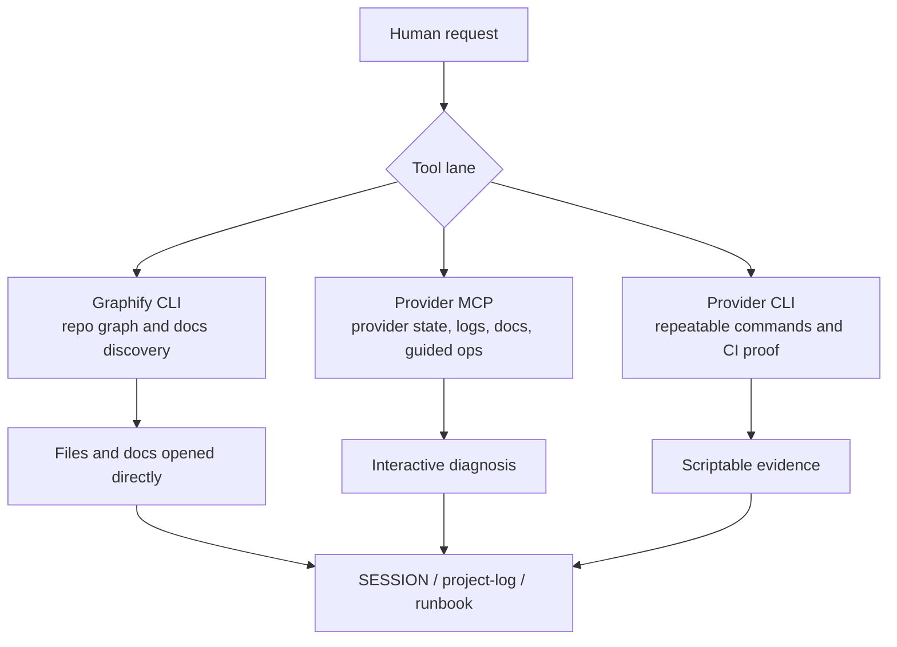
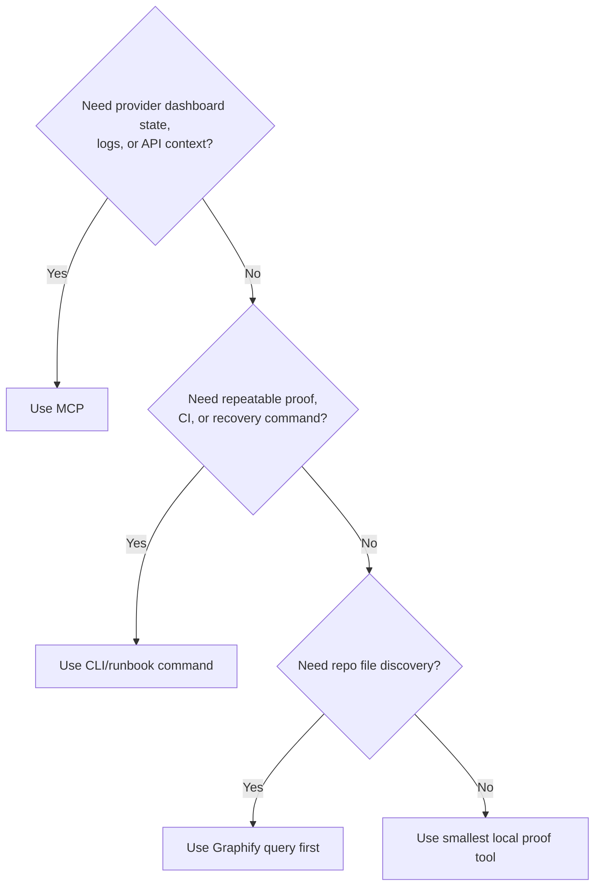
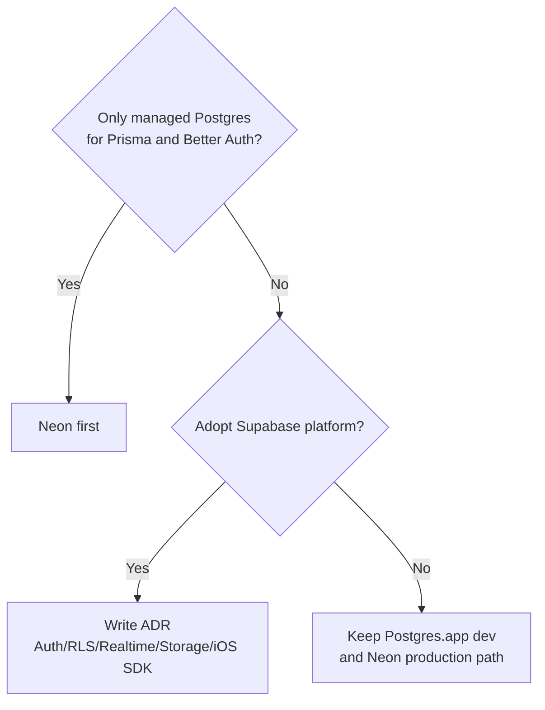

# MCP Usage Runbook

## Purpose

Define how Ronin Dojo should use provider MCPs without replacing the CLI workflows that belong in repeatable runbooks and CI.

This runbook covers:

- when to use MCP versus CLI
- which MCPs are useful now
- how browser QA is split between Playwright MCP and Chrome DevTools MCP
- how to decide between Neon MCP and Supabase MCP
- safety gates for cloud, payment, and database tools
- the first install/use order for the next production smoke and provider-debug sessions

## Operating stance

```text
MCP is for inspection, guided ops, provider state, dashboards, logs, and interactive debugging.
CLI is for repeatable commands, scripts, CI, migrations, and runbook proof.
```

Do not convert stable CLI steps into agent-only MCP steps. If a command needs to be repeated by a human, CI job, or future agent without context, keep it in CLI form.

## Installed MCPs (status)

What is actually wired on this machine (as of SESSION_0360, 2026-06-10):

| MCP | Status | How | Notes |
| --- | --- | --- | --- |
| Playwright | ✅ connected | `npx -y @playwright/mcp@latest` (stdio) | browser QA. |
| Stripe | ⚠️ added — needs OAuth | `claude mcp add --transport http stripe https://mcp.stripe.com --scope user` (user config `~/.claude.json`) | hosted server, **OAuth (no API key stored)**. Run `/mcp` to authenticate before first use. Test mode first; live = explicit confirmation. |
| Vercel / Neon / Supabase / Chrome DevTools | ⬜ not installed | — | add per the order below when the relevant session needs them. |

Companion CLIs in place: **Stripe CLI 1.42.11** (test-mode authed, account "Tuff Buffs"), Vercel CLI, GitHub
CLI, Graphify. The **Claude CLI** (`~/.local/bin/claude`) is the MCP *host* — there is no "Claude MCP" server.
For the exact install/verify commands run this session, see
[session-ops-cookbook](session-ops-cookbook.md).

## Source truth checked

Checked 2026-05-14.

| Provider | Source |
| --- | --- |
| Vercel MCP | <https://vercel.com/docs/agent-resources/vercel-mcp> |
| Playwright MCP | <https://playwright.dev/docs/getting-started-mcp> |
| Chrome DevTools MCP | <https://github.com/ChromeDevTools/chrome-devtools-mcp> |
| Neon MCP | <https://neon.com/docs/ai/neon-mcp-server> |
| Supabase MCP | <https://supabase.com/docs/guides/ai-tools/mcp> |
| Stripe MCP | <https://docs.stripe.com/mcp> |

## Recommended stack

| Area | MCP decision | Keep CLI for |
| --- | --- | --- |
| Vercel | Add Vercel MCP before the next production smoke/debug session. Use it for deployment inspection, logs, project state, and env visibility. | Scripted deploys, repeatable env commands, CI, and runbook proof. |
| Browser QA | Use Playwright MCP for repeatable smoke flow interaction. Add Chrome DevTools MCP for console, network, trace, memory, Lighthouse, and performance debugging. | Versioned Playwright test files and CLI smoke commands. |
| Stripe | Use Stripe MCP in test mode first for docs/API inspection and product/price/payment work. Prefer OAuth where available; otherwise restricted keys. | Webhook forwarding, fixtures, scripted setup, and CI-safe checks. |
| Database | Decide Neon versus Supabase before installing both. Current Ronin lean: Neon first. | Prisma migrations, migration review, schema diff proof, backups, and scripted DB checks. |
| Graphify | Keep Graphify CLI as the repo-memory default. MCPs complement provider state; Graphify remains local source navigation. | All repo graph updates and query history. |

## Ronin database call

For this repo today, Neon is the cleaner default because Ronin already uses Prisma, Better Auth, Vercel, Resend, Stripe, and S3-style storage. Neon is "just Postgres" plus project, branch, query, and migration tooling, which fits the current architecture with less drift.

Supabase can handle the Postgres database for a future iOS app. It becomes more attractive if Ronin intentionally adopts Supabase Auth, Row Level Security, Realtime, Storage, Edge Functions, and direct mobile SDK usage. That would be a platform decision, not a drop-in database host change.

Default iOS posture:

```text
iOS app -> Ronin API/backend -> Postgres
```

Only choose this posture after an ADR:

```text
iOS app -> Supabase SDK/Auth/RLS -> Supabase Postgres
```

## High-level MCP data flow

```text
Human request
  |
  v
Agent chooses tool lane
  |
  +--> Graphify CLI -> local repo graph -> files/docs to open
  |
  +--> Provider MCP -> provider state/logs/API/docs -> guided diagnosis
  |
  +--> Provider CLI -> repeatable command output -> runbook/CI proof
  |
  v
Evidence captured in SESSION/project-log/runbook
```



## Decision tree: MCP or CLI

```text
Need provider dashboard state, logs, or API context?
  |
  +-- yes --> Use MCP, then record the result in SESSION/project-log.
  |
  +-- no --> Need repeatable proof, CI, or scriptable recovery?
        |
        +-- yes --> Use CLI/runbook command.
        |
        +-- no --> Need repo file discovery?
              |
              +-- yes --> Use Graphify query first, then open exact files.
              |
              +-- no --> Use the smallest local tool that proves the answer.
```



## Vercel MCP flow

Use Vercel MCP for inspection before and during production smoke/debug sessions.

```text
Smoke/debug request
  |
  v
Vercel MCP
  |
  +--> project settings
  +--> deployments
  +--> deployment logs
  +--> env visibility by environment
  |
  v
CLI proof when action becomes repeatable
  |
  v
SESSION evidence + runbook update if a new gotcha is found
```

Rules:

- Confirm the official endpoint before install: `https://mcp.vercel.com`.
- Treat Vercel MCP access as equivalent to the signed-in Vercel user.
- Use human confirmation for changes.
- Keep `vercel-domain-setup-runbook.md` as the operator flow for DNS/domain setup.
- Keep CLI for scripted deployments and env workflows.

## Browser QA flow

Use both browser MCPs, but do not make them interchangeable.

```text
Need to prove a user flow?
  |
  v
Playwright MCP or Playwright CLI
  |
  +--> navigate
  +--> click/type/select
  +--> accessibility snapshot proof
  +--> screenshots when needed
  |
  v
Need to debug why it failed?
  |
  v
Chrome DevTools MCP
  |
  +--> console messages
  +--> network requests
  +--> performance trace
  +--> Lighthouse / memory / snapshots
```

Decision:

| Need | Preferred tool |
| --- | --- |
| Repeatable smoke checklist | Playwright CLI or Playwright MCP |
| One-off local route interaction | Playwright MCP |
| Console/network failure diagnosis | Chrome DevTools MCP |
| Performance trace or memory snapshot | Chrome DevTools MCP |
| CI artifact | Playwright CLI |

Safety note: Playwright MCP can expose powerful browser automation and, when unsafe script execution is enabled, RCE-equivalent behavior. Enable only for trusted clients and trusted targets.

## Stripe MCP flow

```text
Stripe task
  |
  v
Is this live money or customer-impacting?
  |
  +-- yes --> Stop. Require explicit user confirmation and restricted/OAuth permissions.
  |
  +-- no --> Use test mode Stripe MCP for docs/API/account inspection.
              |
              v
          For webhook proof, switch to Stripe CLI and app logs.
```

Use Stripe MCP for:

- docs and API lookup
- test-mode product and price inspection
- payment object inspection
- guided account-resource discovery

Keep CLI for:

- local webhook forwarding
- repeatable webhook tests
- scripted product/price fixtures
- CI-safe verification

Rules:

- Test mode first.
- Prefer OAuth MCP auth where available.
- If OAuth is unavailable, use a restricted key, not a broad live secret.
- Never paste secrets into docs, SESSION files, or project-log entries.

## Database MCP decision tree

```text
Do we want only managed Postgres for Prisma/Better Auth?
  |
  +-- yes --> Neon first.
  |
  +-- no --> Do we want Supabase platform features?
        |
        +-- yes --> Supabase ADR before adoption.
        |
        +-- no --> Keep local Postgres.app + future Neon production path.
```



### Neon MCP use

Use Neon MCP only after Ronin commits to Neon for staging or production Postgres.

Good fit:

- project and branch inspection
- dev/staging branch management
- query tuning and schema comparison
- migration planning assistance

Guardrails:

- Development and testing only.
- Never connect MCP agents to production databases.
- Use anonymized data.
- Human-review every requested action.
- Keep Prisma migrations as the source of durable schema change.

### Supabase MCP use

Use Supabase MCP only if Ronin chooses Supabase as more than a Postgres host.

Good fit:

- project-scoped development tooling
- read-only database inspection
- Supabase logs/advisors/types/docs
- Edge Function and Storage exploration if those become adopted platform features
- future iOS direct-client architecture if an ADR approves Supabase Auth/RLS

Guardrails:

- Scope to a project when possible.
- Use `read_only=true` when touching real data.
- Do not give MCP access to customers or end users.
- Do not point agent MCP access at production data.

## Safety gates

| Gate | Rule |
| --- | --- |
| Human confirmation | Required for every MCP that can mutate Vercel, Stripe, Neon, Supabase, or browser state tied to real accounts. |
| Production data | DB MCPs are dev/staging or read-only only. Production DB mutation through MCP is forbidden. |
| Secrets | No secrets in repo docs, SESSION files, project log, prompts, screenshots, or MCP transcripts. |
| Least privilege | Prefer OAuth with scoped access. If keys are needed, use restricted keys and rotate after risky use. |
| CI | MCP is not CI. Any release-critical proof needs CLI/test artifacts that can be repeated. |
| Prompt injection | Treat provider logs, tickets, content rows, and user-generated DB records as untrusted instructions. |

## Install and use order

1. Add Vercel MCP before the next production smoke/debug session.
2. Use Playwright MCP for local smoke interaction if available; keep Playwright CLI as the durable proof path.
3. Add Chrome DevTools MCP when browser failures require console, network, trace, Lighthouse, or memory evidence.
4. **Stripe MCP — INSTALLED (SESSION_0360):** hosted `https://mcp.stripe.com`, OAuth, user scope. Run `/mcp` to authenticate, then use for test-mode product/pricing/payment inspection. Pairs with the Stripe CLI `dahlia` verification recipe in [session-ops-cookbook](session-ops-cookbook.md).
5. Choose Neon versus Supabase before adding a database MCP.
6. If Neon is chosen, use Neon MCP against dev/staging branches only.
7. If Supabase is chosen, write an ADR that covers Auth, RLS, Realtime, Storage, Edge Functions, and iOS SDK posture before enabling broad MCP access.

## Acceptance checklist

- [ ] Provider endpoint is official and documented.
- [ ] Access scope is least-privilege or OAuth-scoped.
- [ ] Human confirmation is enabled for mutating tools.
- [ ] Real data is read-only, anonymized, or not connected.
- [ ] CLI equivalent exists for any repeatable release proof.
- [ ] Session evidence names whether proof came from MCP, CLI, browser, or provider dashboard.
- [ ] Any discovered provider gotcha is written back to the relevant runbook.

## Open decisions

- Whether Ronin production Postgres is definitively Neon.
- Whether the future iOS app should remain API-first or adopt a Supabase direct-client architecture.
- Whether Chrome DevTools MCP should be project-local or user-global on this machine.
- Whether Vercel MCP should be installed globally or scoped to the Ronin project.
