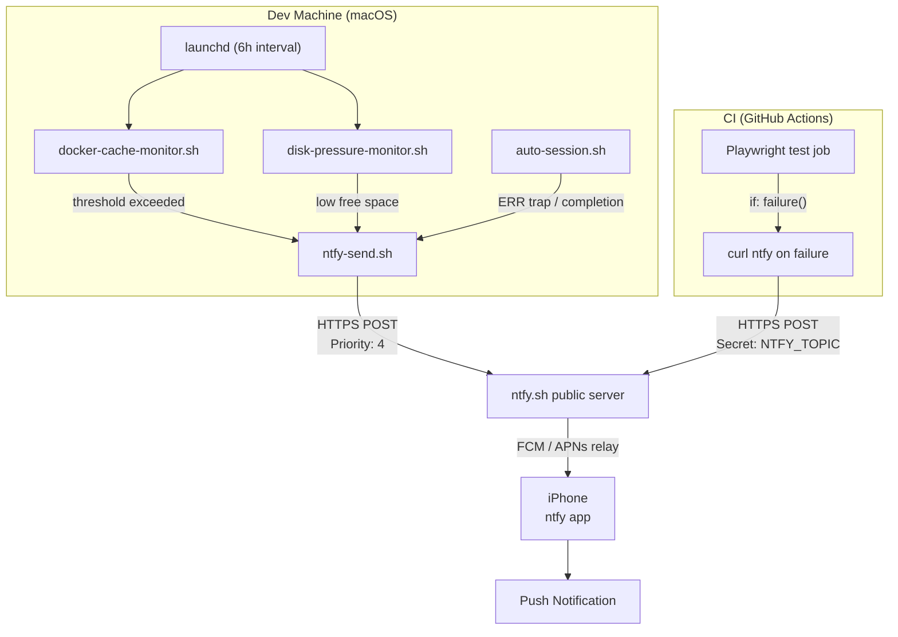

# Push Notifications Runbook: ntfy / Pushover / Telegram

## Summary

This runbook covers three transport options for dev-machine and CI alerts.
The **current wiring in this repo** uses ntfy.sh (SESSION_0334). The comparison
table and setup steps for Pushover and Telegram are included for future reference
and migration decisions.

---

## Comparison Table

| Dimension               | ntfy.sh (public)                           | Pushover                                    | Telegram Bot                                 |
|-------------------------|--------------------------------------------|---------------------------------------------|----------------------------------------------|
| **Reliability / iOS**   | Good via APNs (public server uses Firebase relay; self-host needs `upstream-base-url`) | Excellent — dedicated iOS/Android push infra | Good — Telegram's own push; requires the app installed |
| **Cost**                | Free (public); $1-5/mo self-hosted VPS     | One-time $5 per platform (iOS or Android)   | Free                                         |
| **Privacy**             | Topic name = shared secret; any subscriber with the name gets messages. Self-host for real privacy. | Messages go through Pushover's servers      | Messages go through Telegram servers         |
| **Message richness**    | Title, priority, tags (emoji), click URL   | Title, URL, priority, device targeting      | Full Markdown/HTML, inline buttons, files    |
| **Setup effort**        | Low — one env var, curl                    | Low — register app, grab 2 tokens, one API call | Medium — create bot via @BotFather, get chat ID |
| **Auth model**          | Topic name (shared secret)                 | App token + user key (2 secrets)            | Bot token + chat ID (2 secrets)              |
| **Self-host option**    | Yes (Go binary, easy Docker deploy)        | No                                          | No (API is Telegram-hosted)                  |

**Current choice:** ntfy.sh public server. Reason: zero cost, minimal setup,
curl-only, good iOS push when client is configured to allow notifications.

---

## Setup: ntfy.sh

### Step 1 — Pick a topic name

Choose a random, hard-to-guess string. Anyone who knows the name can subscribe on
the public server. Treat it like a password.

```
ronin-brian-a3f7c2e9b1d4
```

### Step 2 — Configure the dev machine

```bash
# Create the config dir if needed
mkdir -p ~/.config

# Copy the example and edit
cp /Users/brianscott/dev/ronin-dojo-app/scripts/notify/ronin-alerts.env.example \
   ~/.config/ronin-alerts.env

# Edit: replace NTFY_TOPIC=ronin-REPLACE-ME-<random> with your topic
nano ~/.config/ronin-alerts.env

# Lock down permissions — only you should read this
chmod 600 ~/.config/ronin-alerts.env
```

### Step 3 — Subscribe on iPhone

1. Install the **ntfy** app from the App Store.
2. Open ntfy → tap **+** → enter your topic name.
3. Open iOS Settings → Notifications → ntfy → enable **Allow Notifications** +
   **Alerts**, **Badges**, and **Sounds**.
4. In the ntfy app settings, enable **Background Fetch** (for reliable delivery).

### Step 4 — Test

```bash
/Users/brianscott/dev/ronin-dojo-app/scripts/notify/ntfy-send.sh \
  --title "Test" --tags tada "Hello from dev machine"
```

### Step 5 — Set CI secret

```bash
gh secret set NTFY_TOPIC
# Paste the same topic name at the prompt
```

### Notes on public ntfy.sh and iOS reliability

- Public ntfy.sh uses Firebase Cloud Messaging (FCM) as the Android/iOS relay.
  If you are not getting pushes on iOS, the root cause is almost always that
  iOS notification permission is off for the ntfy app (check Settings → Notifications).
- Messages are sent with `Priority: 4` (high) in this repo, which triggers
  iOS to bypass Focus/Do Not Disturb.
- For private delivery with no guessable topic, self-host ntfy and set:
  `upstream-base-url: https://ntfy.sh` in `server.yml` so iOS APNs relay still works.

---

## Setup: Pushover

### API / auth model

- **App token** — created per-application at pushover.net/apps/build
- **User key** — found on the Pushover dashboard after account creation

### Step-by-step

1. Create an account at pushover.net.
2. Create an application (free) → copy the **App token**.
3. Note your **User key** from the dashboard.
4. Add to `~/.config/ronin-alerts.env`:

   ```
   PUSHOVER_APP_TOKEN=<app-token>
   PUSHOVER_USER_KEY=<user-key>
   ```

5. Send a test:

   ```bash
   curl -s \
     --form-string "token=${PUSHOVER_APP_TOKEN}" \
     --form-string "user=${PUSHOVER_USER_KEY}" \
     --form-string "title=Test" \
     --form-string "message=Hello from dev machine" \
     https://api.pushover.net/1/messages.json
   ```

6. One-time $5 fee to unlock the iOS or Android client (perpetual license).

---

## Setup: Telegram Bot

### API / auth model

- **Bot token** — from @BotFather
- **Chat ID** — your personal chat or a group; found via the getUpdates API

### Step-by-step

1. Open Telegram → search @BotFather → `/newbot` → follow prompts → copy the **bot token**.
2. Send any message to your new bot (this seeds the chat).
3. Get your chat ID:
   ```bash
   curl -s "https://api.telegram.org/bot<token>/getUpdates" | jq '.result[-1].message.chat.id'
   ```
4. Add to `~/.config/ronin-alerts.env`:
   ```
   TELEGRAM_BOT_TOKEN=<bot-token>
   TELEGRAM_CHAT_ID=<chat-id>
   ```
5. Send a test:
   ```bash
   curl -s \
     -d "chat_id=${TELEGRAM_CHAT_ID}" \
     -d "text=Hello from dev machine" \
     "https://api.telegram.org/bot${TELEGRAM_BOT_TOKEN}/sendMessage"
   ```

---

## Key-Safety Best Practices

| Secret                    | Where to store it                              | Never do this             |
|---------------------------|------------------------------------------------|---------------------------|
| `NTFY_TOPIC`              | `~/.config/ronin-alerts.env` (chmod 600)       | Commit to git             |
| `PUSHOVER_APP_TOKEN`      | `~/.config/ronin-alerts.env`                   | Hardcode in scripts       |
| `PUSHOVER_USER_KEY`       | `~/.config/ronin-alerts.env`                   | Log to stdout             |
| `TELEGRAM_BOT_TOKEN`      | `~/.config/ronin-alerts.env`                   | Put in CI env plaintext   |
| CI version of any secret  | GitHub repo secret (`gh secret set <NAME>`)    | Commit in workflow YAML   |

**`~/.config/ronin-alerts.env` lives outside the repo root** (`$HOME/.config/`)
so it is not tracked by the repo's `.gitignore`. No gitignore entry needed. The
example placeholder `scripts/notify/ronin-alerts.env.example` IS committed — it
contains only placeholder values, no real secrets.

**Why public ntfy.sh topics are guessable:** ntfy.sh has no access control on
public topics — any client that subscribes to the same string can read all
messages. This means a short or dictionary-based topic name is discoverable by
anyone scanning the namespace. Use a random hex suffix (8+ chars) and rotate the
topic if you suspect exposure. For high-sensitivity alerting, self-host ntfy.

**Rotation:** To rotate a topic, update `~/.config/ronin-alerts.env` on the dev
machine and re-run `gh secret set NTFY_TOPIC` for CI. No code changes needed.

---

## Dataflows

### (a) ASCII diagram

```
Dev machine monitors (launchd, 6h interval)
  docker-cache-monitor.sh
  disk-pressure-monitor.sh
         |
         v
  scripts/notify/ntfy-send.sh
         |
         v (HTTPS POST, Priority:4)
  https://ntfy.sh/<NTFY_TOPIC>
         |
         v (Firebase → APNs relay)
  iPhone ntfy app push notification


CI (GitHub Actions — playwright.yml)
  test job (chromium/firefox/webkit)
         |
     if: failure()
         |
         v (curl HTTPS, Priority:4)
  https://ntfy.sh/<NTFY_TOPIC>   ← secret injected, never committed
         |
         v (Firebase → APNs relay)
  iPhone ntfy app push notification


scripts/auto-session.sh (N autonomous sessions)
  ERR trap (any failure)   → ntfy "Auto-session FAILED"
  completion success       → ntfy "Auto-session run complete"
         |
         v
  scripts/notify/ntfy-send.sh → ntfy.sh → iPhone
```

### (b) Mermaid flowchart



### (c) Low-fi wireframe sketch of iPhone notification

```
┌─────────────────────────────────────────────┐
│  ntfy                              now  [x]  │
│ ┌─────────────────────────────────────────┐ │
│ │  Docker cache 42.3GB > 30GB         🐳  │ │
│ │  Docker build cache is 42.3GB,          │ │
│ │  exceeding the 30GB threshold.          │ │
│ │  Run: docker system prune --filter...   │ │
│ └─────────────────────────────────────────┘ │
│                                             │
│  ntfy                             5m ago    │
│ ┌─────────────────────────────────────────┐ │
│ │  CI failed: Playwright (webkit)     ❌  │ │
│ │  Playwright webkit failed on main.      │ │
│ │  Check: github.com/…/actions/runs/…     │ │
│ └─────────────────────────────────────────┘ │
└─────────────────────────────────────────────┘
```

---

## Current Wiring in This Repo (SESSION_0334)

### Scripts (committed, no secrets)

| File | Purpose |
|------|---------|
| `scripts/notify/ntfy-send.sh` | Shared sender; reads topic from `~/.config/ronin-alerts.env` |
| `scripts/notify/ronin-alerts.env.example` | Example config file with placeholder values |
| `scripts/monitor/docker-cache-monitor.sh` | Checks Docker build cache size (threshold via `$DOCKER_CACHE_THRESHOLD_GB`) |
| `scripts/monitor/disk-pressure-monitor.sh` | Checks free disk on `/` (threshold via `$DISK_FREE_MIN_GB`) |

### launchd agents (installed on dev machine, not in repo)

| Plist | Schedule |
|-------|---------|
| `~/Library/LaunchAgents/com.ronin.docker-cache-monitor.plist` | Every 6h + at load |
| `~/Library/LaunchAgents/com.ronin.disk-pressure-monitor.plist` | Every 6h + at load |

Logs: `~/Library/Logs/ronin-alerts/`

### CI (`.github/workflows/playwright.yml`)

A `Notify on failure (ntfy)` step is appended to each matrix job. Requires:

```bash
gh secret set NTFY_TOPIC
# Enter your topic name at the prompt
```

### auto-session.sh

An ERR trap and a completion notification are added (SESSION_0334). Both are
no-ops if `NTFY_TOPIC` is not configured.

### Operator onboarding checklist

1. `cp scripts/notify/ronin-alerts.env.example ~/.config/ronin-alerts.env`
2. Edit `~/.config/ronin-alerts.env` — set your real topic name
3. `chmod 600 ~/.config/ronin-alerts.env`
4. Load launchd agents (run from interactive shell):
   ```bash
   uid=$(id -u)
   launchctl bootstrap "gui/${uid}" ~/Library/LaunchAgents/com.ronin.docker-cache-monitor.plist
   launchctl bootstrap "gui/${uid}" ~/Library/LaunchAgents/com.ronin.disk-pressure-monitor.plist
   ```
5. Subscribe on iPhone: ntfy app → + → enter topic name
6. iOS Settings → Notifications → ntfy → enable alerts + background fetch
7. `gh secret set NTFY_TOPIC` for CI push alerts
8. Test: `scripts/notify/ntfy-send.sh --title "Test" --tags tada "Wired up!"`

**Planned Passion Produces Purpose.**
**OSSS.**
