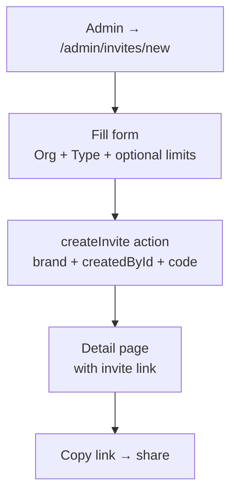
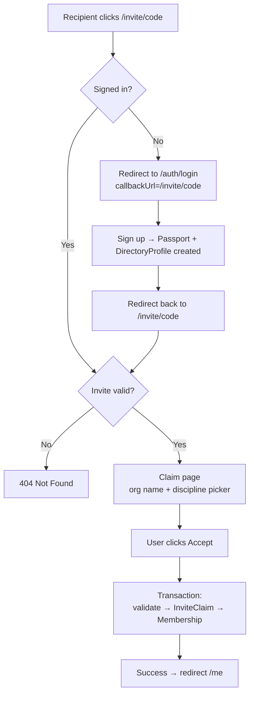

# Invites — Data Flow and User Journey

## Purpose

Document the invite → claim → membership creation flow end-to-end. This is the primary org onboarding path — how an organization admin brings new members into the platform.

---

## 1. Data model

```text
Invite
  ├── id (cuid)
  ├── brand (Brand enum)
  ├── type (InviteType: ORGANIZATION | PROGRAM | TOURNAMENT | EVENT)
  ├── code (unique, auto-generated cuid)
  ├── status (InviteStatus: PENDING | ACCEPTED | EXPIRED | REVOKED)
  ├── maxUses (Int?)
  ├── currentUses (Int, default 0)
  ├── expiresAt (DateTime?)
  ├── meta (Json?)
  ├── organizationId → Organization
  ├── createdById → User
  └── claims[] → InviteClaim[]

InviteClaim
  ├── id (cuid)
  ├── claimedAt (DateTime, default now)
  ├── inviteId → Invite
  ├── userId → User
  └── @@unique([inviteId, userId])  ← one claim per user per invite
```

```mermaid
erDiagram
    Invite ||--o{ InviteClaim : "has claims"
    Invite }o--|| Organization : "belongs to"
    Invite }o--|| User : "created by"
    InviteClaim }o--|| User : "claimed by"
    InviteClaim ..|| Membership : "creates"
```

---

## 2. Admin create flow

```text
Admin navigates to /admin/invites/new
  │
  v
Selects Organization (ComboboxSelector)
  │
  v
Selects InviteType (ORGANIZATION | PROGRAM | TOURNAMENT | EVENT)
  │
  v
Optional: sets maxUses, expiresAt
  │
  v
Submits form
  │
  v
Server: createInvite action
  ├── brand = ctx.brand (from host)
  ├── createdById = ctx.user.id (admin session)
  ├── code = auto-generated (cuid default)
  └── status = PENDING
  │
  v
Invite created → admin sees detail page
  │
  v
Admin copies invite link: /invite/{code}
  │
  v
Shares link (email, message, QR code, etc.)
```



---

## 3. Public claim flow (happy path)

```text
Recipient clicks /invite/{code}
  │
  v
Server: check auth session
  │
  ├── NOT signed in ──────────────────────┐
  │                                       v
  │                              Redirect to /auth/login
  │                              ?callbackUrl=/invite/{code}
  │                                       │
  │                                       v
  │                              Sign up / sign in
  │                              (Passport + DirectoryProfile
  │                               auto-created by Better-Auth hook)
  │                                       │
  │                                       v
  │                              Redirect back to /invite/{code}
  │                                       │
  ├── IS signed in ◄──────────────────────┘
  │
  v
Server: findValidInviteByCode(code)
  ├── invite exists?
  ├── status === PENDING?
  ├── not expired?
  ├── not at maxUses?
  │
  ├── FAIL → 404 not found
  │
  v PASS
Render claim page:
  ├── "You're invited to join {orgName}!"
  ├── Discipline picker (ComboboxSelector)
  │   └── if org has 1 discipline → auto-selected
  └── "Accept Invite & Join" button
  │
  v
User clicks Accept
  │
  v
Server: claimInvite action (transaction)
  ├── Re-validate invite (TOCTOU protection)
  ├── Check: user hasn't already claimed this invite
  ├── Check: user doesn't already have membership (org+discipline)
  ├── Create InviteClaim record
  ├── Increment invite.currentUses
  └── Create Membership (status: ACTIVE, joinedAt: now)
  │
  v
Success toast → redirect to /me
  │
  v
User now has:
  ├── Passport (existed or just created)
  ├── DirectoryProfile (existed or just created)
  └── Membership (org × discipline, ACTIVE)
```



---

## 4. Admin management flow

```text
Admin navigates to /admin/invites
  │
  v
Data table with filters:
  ├── Code (text search)
  ├── Status (faceted: PENDING | ACCEPTED | EXPIRED | REVOKED)
  ├── Type (faceted: ORGANIZATION | PROGRAM | TOURNAMENT | EVENT)
  └── Date range
  │
  v
Row actions:
  ├── Copy invite link
  ├── View details (→ /admin/invites/{id})
  ├── Revoke (sets status = REVOKED)
  └── Delete
  │
  v
Detail page (/admin/invites/{id}):
  ├── Invite metadata (code, org, type, uses, expiry)
  └── Claims list (who claimed, when)
```

---

## 5. Validation rules

| Check | Where | Error |
| --- | --- | --- |
| Invite exists | `findValidInviteByCode` | 404 |
| Status is PENDING | `findValidInviteByCode` | 404 |
| Not expired (`expiresAt > now`) | `findValidInviteByCode` | 404 |
| Not at max uses (`currentUses < maxUses`) | `findValidInviteByCode` | 404 |
| User not already claimed (@@unique) | `claimInvite` transaction | "Already claimed" |
| User not already member (org+discipline) | `claimInvite` transaction | "Already a member" |

---

## 6. Edge cases

```text
Invite expired while user is on claim page
  └── Transaction re-validates → error toast

Invite maxUses reached between page load and claim
  └── Transaction re-validates → error toast

User signs up via invite link, then visits another invite
  └── Works — Passport already exists, new Membership created

Same user tries to claim same invite twice
  └── @@unique([inviteId, userId]) prevents duplicate → error

Org has no disciplines linked
  └── Empty discipline picker → user cannot claim
  └── Admin should link disciplines to org first

Admin revokes invite while someone has claim page open
  └── Transaction checks status !== PENDING → error toast
```

---

## 7. Passport integration

```text
Invite claim does NOT create a Passport.
Passport creation happens at sign-up (Better-Auth afterResponse hook).

Flow:
  Sign up → User + Passport + DirectoryProfile (automatic, free)
  Claim invite → Membership (layered on top of existing Passport)

The invite flow assumes Passport exists by the time claimInvite runs,
because the auth gate forces sign-up before reaching the claim page.
```

---

## 8. File map

| File | Purpose |
| --- | --- |
| `server/admin/invites/schema.ts` | Zod schema + nuqs table params |
| `server/admin/invites/actions.ts` | Admin actions: create, revoke, delete |
| `server/admin/invites/queries.ts` | Admin queries: findInvites, findInviteById, findInviteByCode |
| `server/invites/queries.ts` | Public query: findValidInviteByCode |
| `server/invites/actions.ts` | Public action: claimInvite (auth required) |
| `app/admin/invites/page.tsx` | Admin list page |
| `app/admin/invites/new/page.tsx` | Admin create page |
| `app/admin/invites/[id]/page.tsx` | Admin detail page (with claims) |
| `app/(web)/invite/[code]/page.tsx` | Public claim page (server) |
| `app/(web)/invite/[code]/claim-form.tsx` | Public claim form (client) |

---

## Cross-references

- [SOP Data Flows §14 — Invite → Claim → Membership activation](../sops/sop-data-and-wiring-flows.md#14-invite--claim--membership-activation-flow-session_0146)
- [SOP E2E Lifecycle §8b — Invite lifecycle](../sops/sop-e2e-user-lifecycle.md#8b-invite-lifecycle-session_0146)
- [SOP Data Flows §5 — Identity shell flow](../sops/sop-data-and-wiring-flows.md#5-identity-shell-flow)

---

**Planned Passion Produces Purpose.**
**OSSS.**
