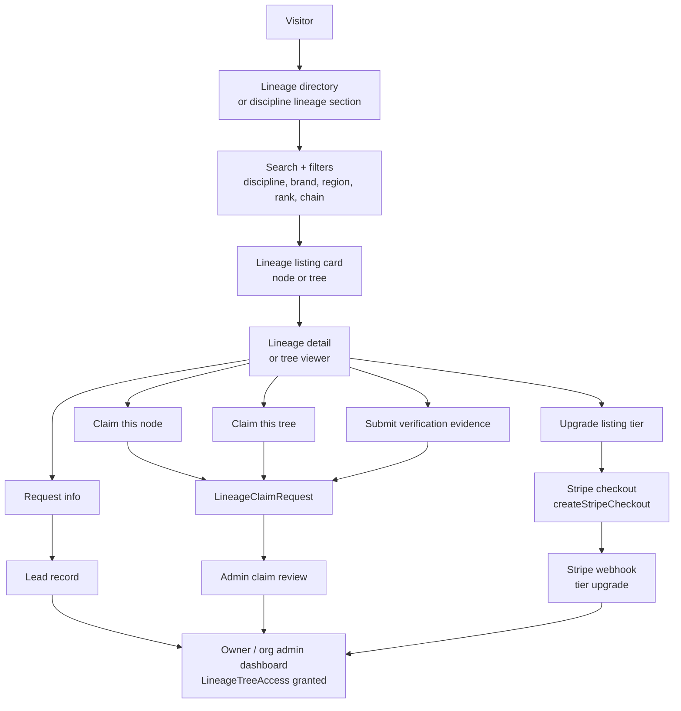
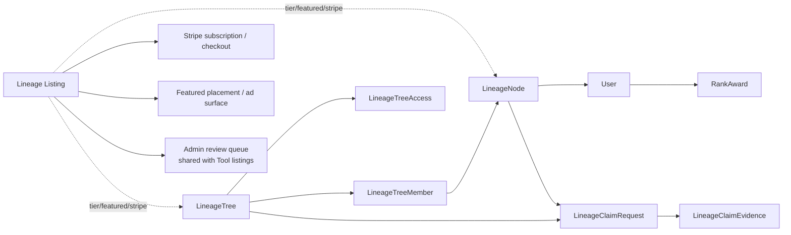
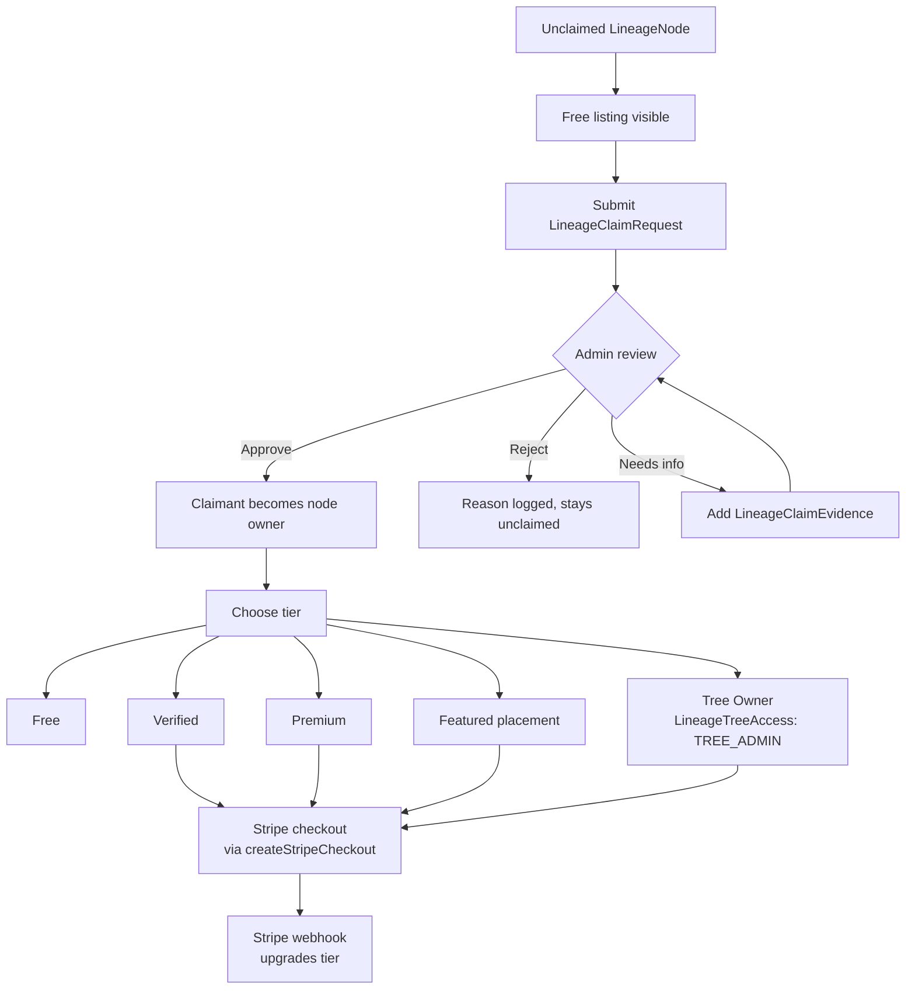
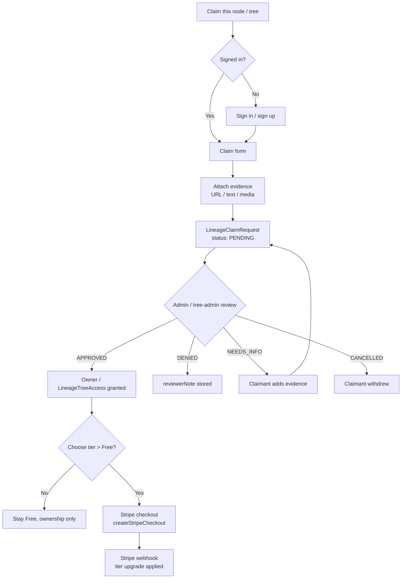
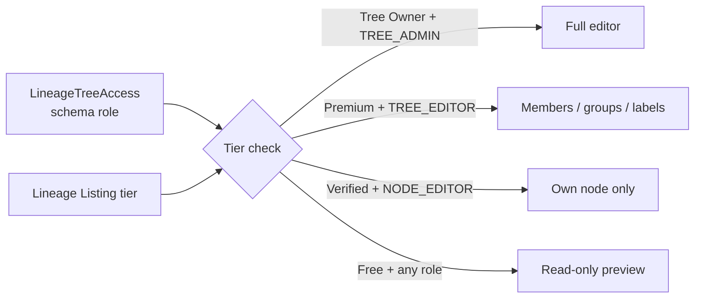
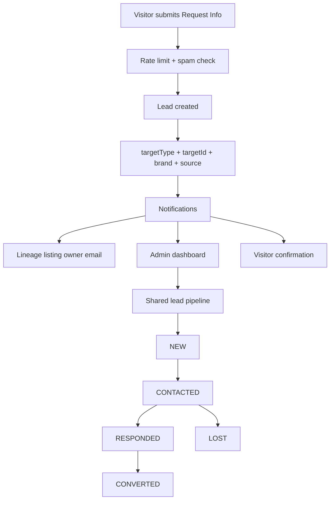
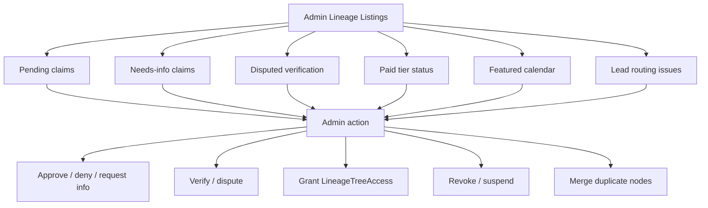
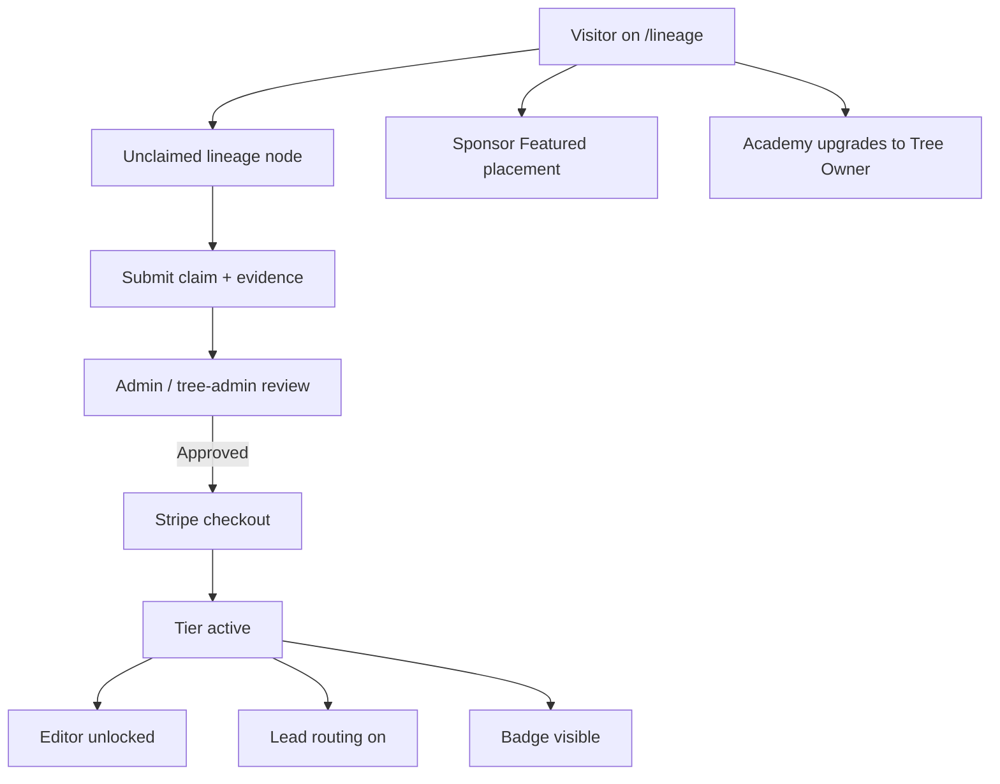

# Lineage Listing Runbook

## Purpose

Define the **lineage listing system** that reuses the Dirstarter `Tool` submission + Stripe checkout + claim + tier business model — applied to `LineageNode` / `LineageTree` instead of being recreated as a parallel monetization stack.

This runbook exists so that:

- Black Belt Legacy can sell lineage-tree visibility, verification, and ownership without inventing a second directory.
- Baseline Martial Arts, WEKAF, and Ronin Dojo Design can inherit the exact same lineage listing flow without bespoke per-brand monetization code.
- The lineage tree v1 schema (landed in `SESSION_0178`) becomes a revenue surface alongside courses, programs, and school listings — not in place of them.
- Future agents do not confuse `Tool` / `Listing` / `LineageNode` / `LineageTree` / `LineageClaimRequest` substrates.

> This runbook is strategy + flow + monetization. SESSION_0344 shipped the first local paid lineage
> membership proof on top of `PricingPlan`/`EntitlementGrant`/`UserEntitlement`; broader listing placement
> and admin review behavior still lands in later sessions on top of the existing listing and
> `LineageClaimRequest` surfaces.

---

## Source truth

The decision is **reuse, not rebuild**:

```text
Internal substrate (genealogy):  LineageNode + LineageRelationship + LineageTree
                                 + LineageTreeMember + LineageVisualGroup
                                 + LineageClaimRequest + LineageClaimEvidence
                                 + LineageTreeAccess
Internal substrate (monetization): PricingPlan + EntitlementGrant + UserEntitlement
                                   + Stripe Checkout Sessions
                                   + Stripe webhook
                                   + Tool / Listing tier mechanics where public placement is needed
                                   + admin review queue
Public language:                  Lineage Listing / Lineage Tree Listing /
                                  Verified Lineage / Featured Lineage
Do not rename LineageNode.        Do not rename Tool.
Do not duplicate Stripe paths.    Do not build a second admin review queue.
```

Why:

- Dirstarter already provides submission UX, claim UX, admin review UX, Stripe Checkout Sessions, webhook tier upgrades, and ad/featured placement plumbing.
- The lineage v1 schema (SESSION_0178) already provides `LineageClaimRequest` + `LineageClaimEvidence` + `LineageTreeAccess` first-class. Those are the natural peers of Tool's claim/admin/access surface.
- Brian explicitly retains `Tool` as a "what the site is built on" portfolio surface; we are not deleting or renaming it.

### SESSION_0344 first paid slice

The first implemented lineage membership proof keeps `/lineage/join` as the BBL entry page. The intake/claim
form remains separate from paid access, and a paid lineage membership section on that same page starts a
DB-derived Checkout Session for active `PricingPlan` rows marked with:

```json
{ "surface": "lineage_membership" }
```

Webhook fulfillment grants or revokes `UserEntitlement` through `EntitlementGrant`. It does not create
`ProgramEnrollment` and does not mutate `Membership.status` (see ADR 0019).

### SESSION_0348 public profile consumption

The public directory/profile read sites now consume an entitlement-derived render policy instead of reading
payment state, Stripe IDs, or `Membership.status` directly. The policy axis is the profile owner/listing
tier:

- free owner/listing: canonical `/directory/[slug]` stays reachable but renders only a preview
  (avatar/initials, name, and rank summary);
- premium/elite owner/listing: `/directory/[slug]` publishes full profile detail fields allowed by
  DirectoryProfile privacy flags;
- owner/admin preview can render the full profile without changing what anonymous visitors receive;
- `/members` and `/members/[slug]` are compatibility redirects to `/directory` so there is only one
  public people/profile surface.

This keeps ADR 0011/0019 intact: active `UserEntitlement` rows decide paid feature access, and membership
lifecycle rows are not repurposed into commerce.

### SESSION_0349 trust badges and legend tier alignment

Public trust badges are presentation over existing lineage and claim fields, not a new schema/status system:

- `LineageNode.verificationStatus` drives `Disputed`, `Verified`, and default pending/unverified states;
- legacy `LineageNode.isVerified` remains a compatibility fallback for `Verified`;
- `User.isPlaceholder` drives the launch `Imported` badge when no stronger status exists;
- `LineageClaimRequest.status` drives `Claimed` and `Claim pending` labels without selecting public claim evidence,
  claimant notes, reviewer notes, or reviewer identity;
- `LineageTreeMember.isClaimable` / tree claimability can drive the secondary `Claimable` badge where the surface has
  that context.

`RankAward` still has no verification/dispute enum. Rank-specific disputed promotion facts remain `BBL-RANK-004` and
need a later schema decision.

Tier code now recognizes `free`, `premium`, `elite`, and `legend`; `basic` is retired from the product tier ladder.
`legend` is the all-features, free-for-life cohort tier. SESSION_0349 added limited policy/helper support only; broad
checkout, webhook, and seed-data migration is a follow-up.

### SESSION_0350 faceted `/directory` browse slice

`/directory` became the single faceted public discovery surface across three result groups, reusing each entity's
existing privacy-aware read model rather than building a new search substrate:

- A result-type **segmented control** (`?type=` → `people` (default) / `organizations` / `trees`) switches the active
  facet; the shared `FiltersProvider`/`Filters` (nuqs) search box and the reused `Pagination` are unchanged primitives.
- A presentation-only `DirectoryFacetResult` adapter (`lib/directory/facet-result.ts`) + shared `FacetResultCard`
  normalize each row to title / href / subtitle / trust badges / tags. **No schema or enum was added** — the discriminator
  is a TS union (`"person" | "organization" | "lineageTree"`).
- Dispatch (`server/web/directory/facets.ts`): people → `getDirectoryProfiles` (trust + tier gating, now with a working
  `q` filter), organizations/schools → `searchOrganizations`, trees → `searchPublishedLineageTrees`.
- **Card link routing:** schools/dojos/clubs → `/schools/[slug]`; LEAGUE/federations/affiliations → `/organizations/[slug]`.
  `/organizations` is intentionally retained (affiliations / governing bodies like WEKAF), not redirected.
- **Trust signals:** people reuse the SESSION_0349 badges. Lineage-tree cards expose only `isClaimable → Claimable`
  (the published-tree summary deliberately excludes node/member verification, so a true Verified/Disputed *tree* badge
  needs aggregated member verification — deferred).
- **Cleanup:** the orphaned `components/web/members/*` browse UI (dead behind the `/members → /directory` redirect) was
  deleted, along with the dead `directory-list.tsx` + FS-0001 `directory-filters.tsx`. The paginated
  `searchDirectoryProfiles` is retained as the seed for the people-pagination convergence follow-up.
- **Deferred (next increment):** cross-facet discipline/rank/school/location filter dropdowns (standardize the
  `discipline` param on slug), people-list pagination (converge onto the `search*` family), and org-logo avatars.

### Pairing with `baseline-listings-runbook.md`

The baseline listings runbook covers school / instructor / program / event / vendor / resource listings via the `Tool` substrate. This runbook is the lineage peer: same monetization spine, different substrate for the *data*, same substrate for the *paid surface*.

---

## Core doctrine

```text
Tool         = internal Dirstarter monetization substrate (proven flows).
Listing      = public monetized directory object (any type).
LineageNode  = a person in a lineage graph (genealogy truth).
LineageTree  = a curated, scoped tree of nodes for a brand/org/discipline.
LineageRelationship = edge between nodes (instructor/student, promoted-by, etc.).
LineageClaim = a user's request to take ownership of a node or tree (genealogy peer of Tool claim).
Lineage Listing = the public monetized surface for a LineageNode or LineageTree,
                  carrying tier/featured/verified flags and paid CTAs.
```

### What this means

A lineage listing should not become the lineage itself.

```text
Bad:
LineageNode/Tree pretends to be the paid listing.
Tool gets cloned to hold lineage data.
Stripe paths get duplicated under /lineage/checkout.

Good:
LineageNode/Tree stores genealogy truth.
Lineage Listing markets and monetizes that truth.
Stripe + admin review come from the same paths the school listings already use.
Tool stays exactly where it is: showcase, portfolio, and substrate.
```

### Where the monetization columns live

The first paid access slice uses `PricingPlan` metadata plus entitlement grants. Broader lineage listing
placement still has two implementation options; pick at the SESSION that ships public paid placement:

| Option | Shape | Pros | Cons |
| --- | --- | --- | --- |
| A. Native | Add `tier`, `tierExpiresAt`, `featuredUntil`, `verifiedAt`, `stripeSubscriptionId`, `claimStatus` to `LineageNode` and `LineageTree` directly. | One source of truth per node/tree. Cheaper join cost. Matches existing `LineageClaimRequest` peer pattern. | Adds Stripe coupling into the lineage model. |
| B. Bridge | Add an optional `LineageListing` row (or reuse `Tool` with `listingType: LINEAGE_NODE \| LINEAGE_TREE`) that links to the lineage row by id. | Keeps lineage schema pure. Reuses Tool tier/ads infra unchanged. | Extra join. Bridge desync risk. |

Petey decision deferred for paid placement. The SESSION that lands public placement records the schema choice
and adds an ADR if the choice is non-obvious.

---

## 1. High-level lineage listing flow

```text
Visitor
  |
  v
Lineage directory / discipline page lineage section
  |
  +--> Search / filter by discipline, brand, region, rank, lineage chain
  |
  v
Lineage listing card (node OR tree)
  |
  v
Lineage detail / tree viewer
  |
  +--> Public chain visible (per visibility scope)
  +--> CTA: Request info / Claim this node / Claim this tree / Verify / Upgrade
  |
  v
Lead / Claim / Stripe checkout / Editor access path
  |
  v
Admin review + tier upgrade + LineageTreeAccess grant
```



---

## 2. Data relationship map

### Genealogy truth (SESSION_0178 schema)

```text
LineageTree
  |
  +--> brand
  +--> scopeType (BRAND / ORGANIZATION / DISCIPLINE / STYLE / PERSON / CUSTOM)
  +--> visibility
  +--> isPublished
  +--> members [LineageTreeMember]
  +--> visualGroups [LineageVisualGroup]
  +--> accessGrants [LineageTreeAccess]
  +--> claimRequests [LineageClaimRequest]

LineageNode
  |
  +--> user (1:1)
  +--> visibility / verificationStatus
  +--> relationshipsFrom / relationshipsTo [LineageRelationship]
  +--> rankAwards (via user.rankAwards)
  +--> claimRequests [LineageClaimRequest]
```

### Monetization truth (Tool / Listing infra)

```text
Tool / Listing
  |
  +--> tier (Free / Standard / Premium / Featured)
  +--> isFeatured / featuredUntil
  +--> Stripe subscription / checkout session
  +--> admin review status
  +--> submitter contact / claim status
  +--> ad / sponsored placement plumbing
```

### Lineage Listing bridge (option A or B)

```text
Lineage Listing
  |
  +--> targetType (LINEAGE_NODE | LINEAGE_TREE)
  +--> targetId (LineageNode.id | LineageTree.id)
  +--> tier
  +--> tierStartedAt / tierExpiresAt
  +--> verifiedAt / verifiedBy
  +--> featuredUntil
  +--> stripeSubscriptionId
  +--> claimRequestId (optional link to active claim)
  +--> leadRoutingEmail (where lead notifications go)
```



---

## 3. Lineage listing contract

A lineage listing must answer eight questions (the seven for school listings + one lineage-specific):

1. **What is this lineage entity?** (node = person; tree = curated chain)
2. **Whose lineage is it / who is the canonical person?**
3. **What discipline(s) / style(s) / brand does it represent?**
4. **What rank or promotion facts back it up?** (RankAward + PROMOTED_BY)
5. **Who can claim or edit it?** (LineageTreeAccess + claim state)
6. **What proof of identity / lineage / promotion exists?** (LineageClaimEvidence)
7. **What paid tier controls visibility, badges, and editor surface?**
8. **What CTAs are available to a visitor?** (request info / claim / verify / upgrade)

### Required MVP fields (Lineage Listing object)

```text
Listing identity
  - brand
  - listingType  (LINEAGE_NODE | LINEAGE_TREE)
  - targetId     (LineageNode.id or LineageTree.id)
  - slug         (mirrors LineageNode.slug or LineageTree.slug)
  - shortDescription
  - tier
  - status

Lineage display
  - displayName        (mirrors User.passport.displayName or Tree.name)
  - heroImageUrl       (optional, premium feature)
  - rankSummary        (latest RankAward in primary discipline)
  - promoterChain      (3-up display from LineageRelationship walk)

Trust
  - claimed            (boolean — tied to LineageClaimRequest APPROVED)
  - verifiedAt
  - verifiedBy
  - verificationStatus (mirrors LineageVerificationStatus from schema)

Commercial
  - tierStartedAt
  - tierExpiresAt
  - stripeSubscriptionId
  - featuredUntil

CTA
  - primaryCtaLabel
  - leadRecipientEmail (where "request info" routes)
  - canClaim           (derived from claimed + tier policy)
```

### Future fields

```text
Trust / moderation
  - duplicateOfId
  - reportCount
  - disputedBy         (when verificationStatus == DISPUTED)
  - lastVerifiedAt
  - movedToListingId

Analytics
  - viewCount
  - drawerOpenCount
  - claimAttemptCount
  - searchAppearanceCount
```

---

## 4. Lineage listing types

| Listing type | What it represents | Primary owner | Example use |
| --- | --- | --- | --- |
| `LINEAGE_NODE` | A single person in a lineage chain | The person (claimed) OR the academy that owns their tree | A black belt with a verified promoter chain |
| `LINEAGE_TREE` | A curated, scoped tree | Org owner OR brand admin OR a lineage holder | "Gracie Barra Boulder lineage", "BBL Hall of Fame 1995" |
| `LINEAGE_BRANCH` | A sub-tree under a tree (a branch root + descendants) | Branch editor with `BRANCH_EDITOR` access | A specific instructor's student tree inside a larger lineage tree |
| `LINEAGE_EVENT` (future) | A promotion / seminar event that materializes multiple PROMOTED_BY rows | Event organizer | "Dirty Dozen 1995 promotion ceremony" |

### Guardrail

Do not make `LINEAGE_NODE` the only paid surface. `LINEAGE_TREE` ownership is the highest-value tier for BBL because it sells *curation*, not just personal identity.

---

## 5. Lineage listing tiers

### MVP tiers (mirrors baseline listings)

| Tier | Intended use | Features |
| --- | --- | --- |
| Free | basic public visibility | Name, avatar/initials fallback, latest rank, public chain (depth 1), claim/upgrade button; no full public profile fields |
| Verified | trust badge + claimable identity | "Verified" badge, claimed-by-user, profile drawer Info tab editable |
| Premium | full lineage page/profile | Hero image, full chain depth, multi-discipline rank history, lead form, full `/directory/[slug]` public profile, drawer "Rank History" + "Lineage" tabs editable |
| Featured | sponsored lineage placement | Pinned on `/lineage/<discipline>` index, homepage rotation, brand-page hero rotation |
| Tree Owner | own + edit a full LineageTree | `TREE_ADMIN` access, member add/move, visual group rename, public-label toggles, claim approval rights for that tree |

### Tier flow

```text
Unclaimed lineage node
  |
  +--> Free listing visible (PUBLIC visibility scope)
  |
  v
Person submits LineageClaimRequest
  |
  v
Admin reviews evidence
  |
  +--> approve -> node becomes claimed -> tier policy unlocks
  +--> reject  -> reason logged, status stays unclaimed
  +--> needs_info -> claimant adds more LineageClaimEvidence
  |
  v
Claimant chooses tier
  |
  +--> stays Free
  +--> Verified  (one-time or low recurring)
  +--> Premium   (recurring subscription)
  +--> Featured  (placement purchase, time-bounded)
  +--> Tree Owner (recurring + Stripe-managed seat for a LineageTree)
```



---

## 6. Claim flow (reuses LineageClaimRequest)

```text
Visitor clicks Claim this node / Claim this tree
  |
  v
Auth check
  |
  +--> not signed in: sign up / sign in (returns to claim form)
  +--> signed in: continue
  |
  v
Claim form
  |
  +--> relationship to node (self / student of / family of / archivist)
  +--> claimantNote (free-text)
  +--> evidence items
        +--> URL evidence    (LineageClaimEvidence.url)
        +--> Text evidence   (LineageClaimEvidence.text)
        +--> Media evidence  (LineageClaimEvidence.mediaId via existing Media upload)
  |
  v
LineageClaimRequest created (status = PENDING)
  |
  v
Admin / Tree admin review
  |
  +--> APPROVED -> claimant becomes node owner OR tree gains the access grant
  +--> DENIED   -> reviewerNote stored
  +--> NEEDS_INFO -> claimant returns to add evidence
  +--> CANCELLED -> claimant withdrew
  |
  v
If approved AND tier > Free
  |
  v
Stripe checkout (reuses createStripeCheckout)
  |
  v
Stripe webhook → tier flag set on Lineage Listing
```



### Approval rule

A claim should never silently grant editor rights across an entire tree.

```text
Preferred MVP:
LINEAGE_NODE claim approval  -> node ownership only
LINEAGE_TREE claim approval  -> LineageTreeAccess role: TREE_EDITOR
                                (TREE_ADMIN requires explicit grant by brand admin)
LINEAGE_BRANCH claim approval -> BRANCH_EDITOR on the claimed branch root
```

Cross-reference: `docs/architecture/lineage/lineage-rank-promotion-sync-rules.md` defines promoter-change rules, which apply *after* a claim is approved.

---

## 7. Editor flow (tier-gated)

The `LineageTreeAccess` model from SESSION_0178 enforces edit permissions. The lineage listing tier on top of that gates *what an editor can change*:

```text
TREE_ADMIN + tier=Tree Owner  -> all edits: members, groups, ACL, public-label toggles
TREE_ADMIN + tier=Free        -> read-only editor (preview mode)
TREE_EDITOR + tier=Premium    -> add/remove members, rename groups, set primary visual parent
TREE_EDITOR + tier=Verified   -> edit own node only
BRANCH_EDITOR + tier=Premium  -> edit inside assigned branch; cannot move branch root
NODE_EDITOR + tier=Verified   -> edit assigned node only
```



---

## 8. Lead flow (reuses Tool lead routing)

```text
Visitor submits Request Info on a lineage listing
  |
  v
Rate limit + spam check (reuses Tool lead protections)
  |
  v
Lead created
  |
  +--> listingId (Lineage Listing id)
  +--> targetType (LINEAGE_NODE | LINEAGE_TREE)
  +--> targetId
  +--> brand
  +--> source CTA
  +--> visitor contact + message
  |
  v
Notifications
  |
  +--> leadRecipientEmail (per Lineage Listing)
  +--> admin dashboard (shared lead pipeline)
  +--> optional visitor confirmation email
  |
  v
Owner follows up
  |
  v
Lead status: NEW -> CONTACTED -> RESPONDED -> CONVERTED / LOST
```



---

## 9. Public page wireframes

### Lineage index page (`/lineage` or `/lineage/<discipline>`)

```text
+----------------------------------------------------------+
| Black Belt Legacy — Lineage Directory                    |
| Explore verified lineages, claim your chain, sponsor a    |
| family tree.                                              |
+----------------------------------------------------------+
| Search: [name, academy, lineage holder...    ] [Search]   |
| Filters: Discipline [v] Region [v] Rank [v] Tier [v]      |
+----------------------------------------------------------+
| Featured lineages                                        |
| [Featured Tree Card]  [Featured Tree Card]                |
+----------------------------------------------------------+
| Verified lineage holders                                 |
| +-------------------+  +-------------------+              |
| | Avatar            |  | Avatar            |              |
| | Brian Scott       |  | (placeholder)     |              |
| | BJJ Black Belt    |  | BJJ Black Belt    |              |
| | Promoted by ...   |  | Promoted by ...   |              |
| | [Verified]        |  | [Unclaimed]       |              |
| | [View] [Connect]  |  | [View] [Claim]    |              |
| +-------------------+  +-------------------+              |
+----------------------------------------------------------+
| Bottom sponsored placement                               |
+----------------------------------------------------------+
```

### Lineage node detail / drawer

```text
+----------------------------------------------------------+
| HERO IMAGE (Premium tier) or solid color                 |
| Display Name                       [Verified] [Premium]  |
| BJJ Black Belt | Boulder, CO                             |
| [Request Info] [Claim this Node] [Upgrade]               |
+----------------------------------------------------------+
| Tabs:  Profile  |  Lineage  |  Rank History               |
+----------------------------------------------------------+
| Profile                                                  |
| Bio (Premium expands).                                    |
| Promoted by: Instructor X (PROMOTED_BY, 2018)             |
| Promoted by: Instructor Y (PROMOTED_BY, 2012)             |
+----------------------------+-----------------------------+
| Lineage chain (depth 3)    | Rank History                |
| Y -> X -> THIS              | 2018 Black Belt - BJJ       |
| THIS -> Student A           | 2012 Brown Belt - BJJ       |
| THIS -> Student B           | ...                         |
+----------------------------+-----------------------------+
| Related lineages / sponsored placement                   |
+----------------------------------------------------------+
```

### Lineage tree viewer (`/lineage/<treeSlug>`)

```text
+----------------------------------------------------------+
| Tree Name                          [Verified] [Featured] |
| Discipline: BJJ | Brand: BBL                             |
| Owner: Gracie Barra Boulder                              |
| [Claim Tree Ownership] [Upgrade Tier] [Request Info]     |
+----------------------------------------------------------+
| Tree canvas / org-chart                                  |
|                                                          |
|     [Root: Founder]                                      |
|        /          \                                      |
|   [Student A]   [Student B]                              |
|     /   \         /                                      |
|   ... etc ...                                            |
|                                                          |
| (visual groups: "Promoted 2018", "Unknown date", ...)    |
+----------------------------------------------------------+
| Sidebar: tree info, visual group toggles, sponsor card   |
+----------------------------------------------------------+
```

### Claim form

```text
+----------------------------------------------------------+
| Claim: Brian Scott (LineageNode)                         |
+----------------------------------------------------------+
| Relationship to this node:                               |
|   ( ) This is me                                         |
|   ( ) I'm a student / family member                      |
|   ( ) I'm an archivist with permission                   |
|                                                          |
| Note to reviewer:                                        |
| [______________________________________________________] |
|                                                          |
| Evidence (optional, raises approval odds):               |
|   [+ Add URL ]       [+ Add text ]      [+ Upload file]  |
|                                                          |
| After approval you'll be asked to choose a tier.         |
| Free claims grant ownership only; Verified+ unlocks      |
| editing, lead routing, and the trust badge.              |
|                                                          |
| [Submit Claim]                                           |
+----------------------------------------------------------+
```

### Owner / tree-admin dashboard

```text
+----------------------------------------------------------+
| My Lineage: Brian Scott             Tier: Verified       |
+----------------------------------------------------------+
| Profile completeness: 64%                                |
| [Edit Profile] [Add Evidence] [Upgrade to Premium]       |
+----------------------------------------------------------+
| Claim status: APPROVED (2026-05-12)                      |
+----------------------------------------------------------+
| Leads on my lineage                                      |
| New: 1 | Contacted: 2 | Responded: 1 | Converted: 0      |
+----------------------------------------------------------+
| Analytics (Premium+)                                     |
| Views: 312 | Drawer opens: 47 | Claim attempts: 0        |
+----------------------------------------------------------+
| Verification                                             |
| Status: VERIFIED | Last reviewed: 2026-05-12             |
+----------------------------------------------------------+
```

---

## 10. Admin workflow

```text
Admin Lineage Listings
  |
  +--> Pending claim requests          (LineageClaimRequest.PENDING)
  +--> Needs-info claims               (LineageClaimRequest.NEEDS_INFO)
  +--> Disputed verification           (LineageVerificationStatus.DISPUTED)
  +--> Paid tier status / churn risk
  +--> Featured placement calendar
  +--> Lead routing issues             (bounced lineage listing email)
  |
  v
Admin action
  |
  +--> approve / deny / request info        (LineageClaimRequest review)
  +--> verify lineage                       (set verificationStatus = VERIFIED)
  +--> dispute lineage                      (set verificationStatus = DISPUTED)
  +--> grant LineageTreeAccess              (after paid Tree Owner upgrade)
  +--> revoke access / suspend listing
  +--> merge duplicate LineageNodes         (existing schema operation)
```



---

# Brand spec sheets

## A. Black Belt Legacy (BBL) spec sheet

### Brand role

BBL is the lead brand for lineage monetization. It sells curation + verification of historical chains as the primary product.

### Primary lineage listing types

| Priority | Type | Notes |
| --- | --- | --- |
| 1 | `LINEAGE_TREE` | Hall-of-Fame trees, association lineage trees, family/style trees |
| 2 | `LINEAGE_NODE` | Black belts, coral belts, legends, historical figures |
| 3 | `LINEAGE_BRANCH` | An academy's student tree inside a larger style tree |
| 4 | `LINEAGE_EVENT` (future) | Promotion ceremonies that mint multiple PROMOTED_BY rows |

### Primary CTAs

- Claim this lineage / node / tree
- Submit verification evidence
- Sponsor this lineage (Featured placement)
- Become Tree Owner
- Request lineage record correction

### BBL monetization flow

```text
Visitor lands on /lineage or a discipline page lineage section
  |
  v
Finds an unclaimed lineage node
  |
  v
Submits LineageClaimRequest with evidence
  |
  v
Admin / tree-admin reviews
  |
  v
Approved -> Stripe checkout for Verified or Premium tier
  |
  v
Tier active -> drawer editor unlocked, lead routing on, badge visible
  |
  v
Optional: visitor sponsors a Featured placement on /lineage index
  |
  v
Optional: academy owner upgrades to Tree Owner for a curated tree
```



### BBL acceptance criteria for v1

- `/lineage` directory page exists with lineage listing cards.
- A visitor can submit a claim against an unclaimed `LineageNode`.
- An admin can approve / deny / request info from the admin queue.
- Approved claim + Stripe checkout flips a tier flag on the Lineage Listing.
- A verified node shows the Verified badge publicly.
- Featured placement renders on `/lineage` index for active subscriptions.

---

## B. Baseline Martial Arts spec sheet

### Brand role

Baseline does not lead with lineage, but uses the lineage listing surface as a *trust signal* on school listings.

### Primary lineage listing types

| Priority | Type | Notes |
| --- | --- | --- |
| 1 | `LINEAGE_NODE` (instructor profile) | Coach verification linked to a school listing |
| 2 | `LINEAGE_BRANCH` | A school's instructor lineage chain |
| 3 | `LINEAGE_TREE` (rare) | Only for academies with curated historical chains |

### Primary CTAs

- Verify instructor lineage (paired with school listing claim)
- Claim instructor node
- View instructor's chain

### Baseline integration rule

Baseline does **not** open a standalone `/lineage` directory. The lineage section appears as a *tab or accordion* on the school listing detail page, and the lineage-listing tier on the instructor is **bundled** with the school listing's Premium tier (no separate purchase).

---

## C. WEKAF spec sheet

### Brand role

WEKAF uses lineage listings for officials, coaches, and country-level archives.

### Primary lineage listing types

| Priority | Type | Notes |
| --- | --- | --- |
| 1 | `LINEAGE_NODE` (official / coach) | Verified credentials chain |
| 2 | `LINEAGE_TREE` | Country team lineage / federation chain |
| 3 | `LINEAGE_BRANCH` | A federation's regional officials |

### Primary CTAs

- Verify official credentials
- Claim coach lineage
- Sponsor federation archive

### WEKAF rule

Verification status for WEKAF officials must require a federation-issued evidence URL or PDF; URL-only evidence is insufficient for officials at the international tier (federation policy, not a code change).

---

## D. Ronin Dojo Design (RDD) spec sheet

### Brand role

RDD uses lineage listings as a client showcase: "we built this for them" — never as a paid surface for end users.

### Primary lineage listing types

| Priority | Type | Notes |
| --- | --- | --- |
| 1 | `LINEAGE_TREE` (case study) | A client's lineage tree as a portfolio piece |
| 2 | `LINEAGE_NODE` (showcase) | Client owner profile with chain |

### Primary CTAs

- View case study
- Inquire about a similar build

### RDD rule

No Stripe checkout on RDD lineage listings. Tier is set to `Featured` manually by RDD admins for showcase purposes; lead routing goes to the RDD sales inbox.

---

## 11. Monetization plan / strategy

### Pricing posture

This runbook does not lock numbers. Recommended starting bands (Petey decision deferred to the SESSION that ships Stripe products for lineage):

| Tier | Cadence | Recommended starting band | Notes |
| --- | --- | --- | --- |
| Free | — | $0 | Always free; protects open lineage data. |
| Verified (node) | one-time or low recurring | $9 one-time **or** $3/mo | Lowest friction tier; the trust badge is the value. |
| Premium (node) | recurring | $9–$19/mo | Full lineage page, lead form, editor unlocked. |
| Featured (placement) | time-bounded | $19–$49/mo per placement | Pinned slot on `/lineage` index. |
| Tree Owner | recurring | $49–$99/mo per tree | TREE_ADMIN access + claim approval rights. |
| Federation seat (WEKAF) | annual | custom | Annual contract; not self-serve Stripe. |

### Stripe product layout

Reuse the existing `setup-ronin-stripe-products.ts` script pattern. Add a `LineageListing` product family parallel to the existing Tool/Listing product family. Tier change must remain a single Stripe webhook → tier flag, never two parallel webhook paths.

```text
Stripe products
  |
  +--> Tool / Listing tier family   (existing, unchanged)
  +--> Lineage Listing tier family  (new)
        +--> Verified (node)
        +--> Premium (node)
        +--> Featured (placement)
        +--> Tree Owner (tree)
```

### Bundle strategy

| Bundle | Includes | Brand priority |
| --- | --- | --- |
| BBL Pro | Premium node + Tree Owner for one tree | BBL |
| Baseline School Pro | School Premium + Verified for the lead instructor's lineage node | Baseline |
| WEKAF Federation | Tree Owner for federation tree + N Verified seats for officials | WEKAF |

Bundles are **single Stripe subscriptions**, not multi-product carts. A bundle webhook sets multiple tier flags atomically.

### What lineage listings do NOT replace

- They do not replace course / program / class enrollment Stripe flows.
- They do not replace school listing tiers (`baseline-listings-runbook.md`).
- They do not delete or alter the `Tool` substrate; Tool stays as portfolio + Dirstarter showcase.
- They do not bypass `LineageTreeAccess` permission checks — paid tier *gates* what an editor can do, never grants access without an ACL row.

### What lineage listings DO replace

- Any future urge to build a separate "lineage payments" stack. Use this one.
- Any future urge to create a parallel `LineageClaim` workflow outside `LineageClaimRequest`. Use the schema model already in place.

---

## 12. Implementation sequencing (out of scope, recorded for clarity)

This runbook is strategy. The implementation order recommended for future sessions:

1. **Materializer hardening + ACL helper** — SESSION_0180 (already planned, see SESSION_0179 `Next session`). Prerequisite: nothing here ships without the visibility scope helper.
2. **LineageListing schema (option A or B)** — single dedicated session with ADR.
3. **`/lineage` directory page** — public viewer reading from `getLineageTreeBySlug` + new listing tier flags.
4. **Claim Stripe checkout** — wire `createStripeCheckout` to `LineageClaimRequest` approval path; add tier-upgrade webhook handler branch.
5. **Editor tier-gating** — extend the SESSION_0176 ACL helper with a tier predicate.
6. **Featured placement surface** — reuse `Ad` plumbing for `/lineage` index sponsored slots.
7. **BBL launch** — first paying brand; copy + flows polished against BBL spec sheet above.

Each step gets its own Petey plan + Cody pre-flight + Doug/Giddy review per WORKFLOW 5.0.

---

## Cross-references

- [Baseline Listings Runbook](baseline-listings-runbook.md) — peer runbook for school/instructor/program listings.
- [Lineage Rank Promotion Sync Rules](../../architecture/lineage/lineage-rank-promotion-sync-rules.md) — promoter-change rules that apply after a claim is approved.
- [Lineage v1 Acceptance Test Plan](../../architecture/lineage/lineage-v1-acceptance-test-plan.md) — unit/UI/QA matrix the listing tier work must satisfy.
- [ADR 0016 — Lineage Promotion Source of Truth](../../architecture/decisions/0016-lineage-promotion-source-of-truth.md) — RankAward is canonical; PROMOTED_BY is mirror.
- [Directory Monetization Roadmap](../../knowledge/wiki/content-engine/directory-monetization-roadmap.md) — overall directory monetization plan; lineage is one revenue surface inside it.
- [SOP — Data and Wiring Flows](../sops/sop-data-and-wiring-flows.md) — canonical flow diagram conventions.
- [SOP — E2E User Lifecycle](../sops/sop-e2e-user-lifecycle.md) — where claim + tier flows sit in the user lifecycle.

**Planned Passion Produces Purpose.**
**OSSS.**
