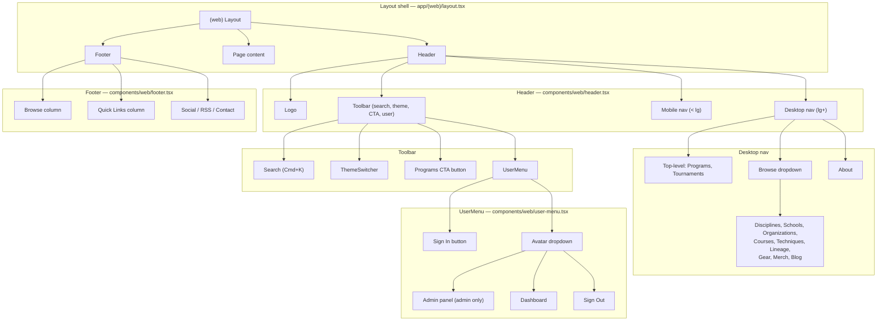
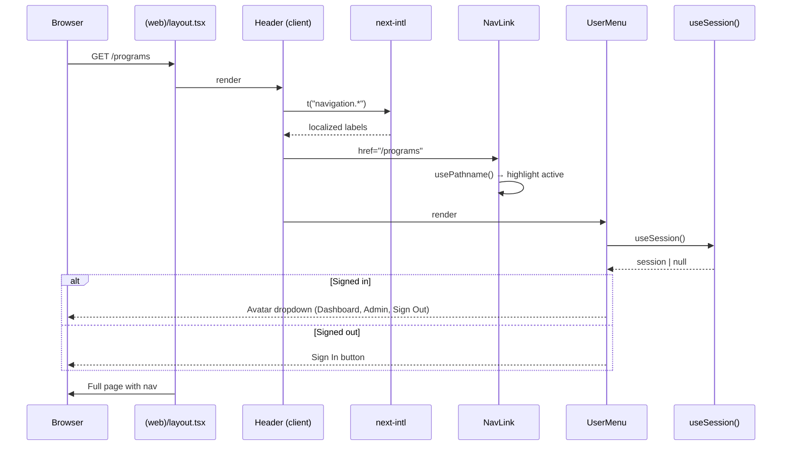
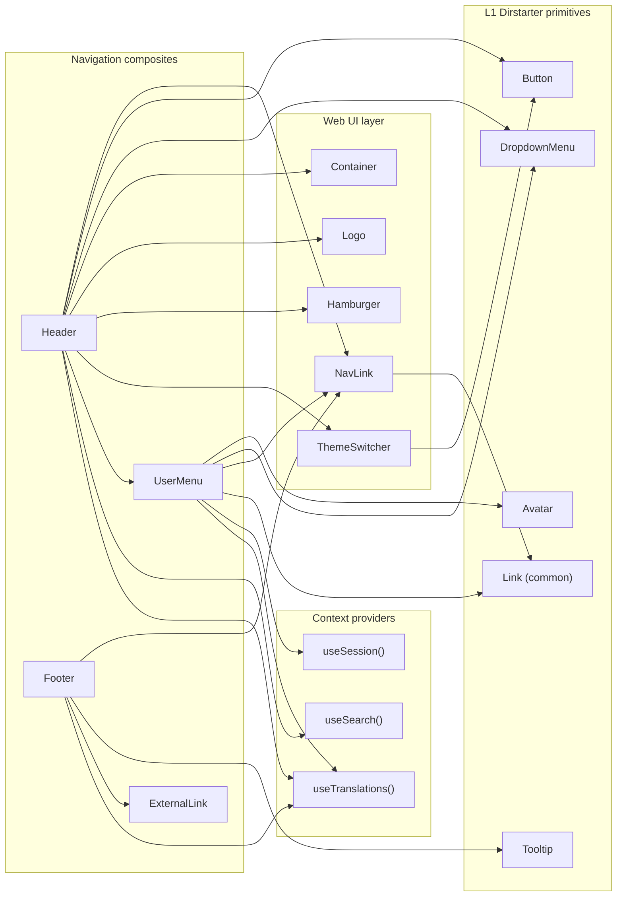

# Navigation, Sidebar & Menu Runbook

## Purpose

Document the full navigation architecture: **header**, **footer**, **mobile nav**, **user menu**, **Browse dropdown**, and **admin sidebar**. This runbook ensures every new route gets wired into all navigation surfaces and i18n keys stay in sync.

---

## Architecture overview



---

## File inventory

| File | Role | Client/Server |
| --- | --- | --- |
| `apps/web/components/web/header.tsx` | Primary header: desktop nav, Browse dropdown, mobile hamburger nav, search, theme, CTA, user menu | Client (`"use client"`) |
| `apps/web/components/web/footer.tsx` | Footer: Browse links, Quick Links, social icons, theme toggle | Client |
| `apps/web/components/web/user-menu.tsx` | Avatar dropdown: admin panel, dashboard, sign out | Client |
| `apps/web/components/web/ui/nav-link.tsx` | Reusable nav link with active-state highlight via `usePathname` | Client |
| `apps/web/components/web/ui/logo.tsx` | Brand logo | — |
| `apps/web/components/web/ui/hamburger.tsx` | Animated hamburger icon | — |
| `apps/web/components/web/theme-switcher.tsx` | Light/dark mode toggle | Client |
| `apps/web/messages/en/navigation.json` | i18n keys for all nav labels | — |
| `apps/web/app/(web)/layout.tsx` | Web layout shell that mounts Header + Footer | Server |
| `apps/web/app/admin/` | Admin layout (separate sidebar, not covered here) | — |

---

## Data wiring flow



---

## Route ↔ Navigation matrix

Every public route must appear in **all four** navigation surfaces. Use this checklist when adding a new route.

| Route | Desktop top-level | Browse dropdown | Mobile nav | Footer Browse | i18n key |
| --- | --- | --- | --- | --- | --- |
| `/programs` | ✅ | — | ✅ | ✅ | `navigation.programs` |
| `/tournaments` | ✅ | — | ✅ | ✅ | `navigation.tournaments` |
| `/disciplines` | — | ✅ | ✅ | ✅ | `navigation.disciplines` |
| `/schools` | — | ✅ | ✅ | ✅ | `navigation.schools` |
| `/organizations` | — | ✅ | ✅ | ✅ | `navigation.organizations` |
| `/courses` | — | ✅ | ✅ | ✅ | `navigation.courses` |
| `/techniques` | — | ✅ | ✅ | ✅ | `navigation.techniques` |
| `/lineage` | — | ✅ | ✅ | ✅ | `navigation.lineage` |
| `/gear` | — | ✅ | ✅ | ✅ | `navigation.gear` |
| `/merch` | — | ✅ | ✅ | ✅ | `navigation.merch` |
| `/blog` | — | ✅ | ✅ | — (Quick Links) | `navigation.blog` |
| `/about` | ✅ | — | ✅ | — (Quick Links) | `navigation.about` |
| `/dashboard` | — | — | — | — | via UserMenu |
| `/admin` | — | — | — | — | via UserMenu (admin only) |
| `/directory` | — | ❌ not yet | ❌ | ❌ | `navigation.directory` (exists) |
| `/members` | — | ❌ not yet | ❌ | ❌ | `navigation.members` (exists) |

### Not-yet-wired routes (future session)

- `/directory` — public directory search. Wire once listing search UI is ready.
- `/members` — public member profiles. Wire once member profiles have public parity chrome.
- `/certificates` — no page yet.
- `/submit` — submission flow, linked from listing detail pages, not global nav.

---

## How to add a new route to navigation

### Checklist

1. **i18n key** — Add to `apps/web/messages/en/navigation.json`
2. **Header desktop** — If top-level: add `<NavLink>` in the `<nav>` in `header.tsx`. If Browse: add `<DropdownMenuItem>` with icon.
3. **Header mobile** — Add `<NavLink>` in the mobile `<nav>` grid.
4. **Footer** — Add `<NavLink>` in the Browse column (or Quick Links if non-content).
5. **Icon** — Pick from `lucide-react`. Import in `header.tsx`.
6. **Update this runbook** — Add row to the matrix above.

### Example: adding `/events`

```tsx
// 1. messages/en/navigation.json
{ "events": "Events", ... }

// 2. header.tsx — Browse dropdown
<DropdownMenuItem render={<NavLink href="/events" prefix={<CalendarIcon />} />}>
  {t("navigation.events")}
</DropdownMenuItem>

// 3. header.tsx — mobile nav
<NavLink href="/events">{t("navigation.events")}</NavLink>

// 4. footer.tsx — Browse column
<NavLink href="/events">{t("navigation.events")}</NavLink>
```

---

## Component dependency graph



---

## Brand-scoping notes

Navigation is currently **brand-agnostic** — the same links render for all brands. Future work may include:

- Per-brand nav items (e.g., BBL shows Lineage prominently; WEKAF shows Tournaments).
- Per-brand CTA button text/destination.
- Brand-specific footer social links.

These would be driven by a brand config object keyed on `Brand` enum, not conditional rendering in the header.

---

## Mobile nav behavior

- Triggered by `<Hamburger>` button (visible `< lg` breakpoint).
- Full-viewport overlay with `backdrop-blur-lg` and `bg-background/90`.
- 2-column grid layout for link items.
- Auto-closes on route change (`useEffect` on `pathname`).
- Auto-closes on `Escape` key (`useHotkeys`).
- Transitions via `opacity` (no height animation).

---

## Admin sidebar (out of scope)

The admin area (`/admin/*`) has its own layout and sidebar navigation defined in `apps/web/app/admin/`. It is not part of the public web navigation system. A separate runbook should be created when admin nav needs documentation.

---

## UX review notes (SESSION_0242)

Identified for next-session Desi UX pass:

- Browse dropdown has 9 items — consider grouping (Training / Community / Shop).
- Programs CTA button in toolbar duplicates the top-level Programs nav link.
- Footer Browse column now has 10 links — may benefit from 2-column layout.
- `/directory` and `/members` need wiring once public parity is complete.
- Mobile nav is a flat 2-column grid with 12 links — consider categorized sections.
