# SOP — Data Flows and Wiring Flows

## Purpose
Document the major system flows in low-fi ASCII so:
- humans can reason about the repo quickly
- future agents do not rebuild the same mental model from scratch
- product, auth, content, and brand wiring stay separate

---

## 1. High-level platform flow

```text
                    +----------------------+
                    |   User / Browser     |
                    +----------+-----------+
                               |
                               v
                    +----------------------+
                    |  Next.js app/web     |
                    |  route + middleware  |
                    +----------+-----------+
                               |
                  host -> brand | context
                               v
                    +----------------------+
                    | Better-Auth session  |
                    | + activeBrandId      |
                    +----------+-----------+
                               |
                               v
                    +----------------------+
                    | authz.ts checks      |
                    | brand + role + scope |
                    +----------+-----------+
                               |
                               v
                    +----------------------+
                    | Prisma client        |
                    | Postgres             |
                    +----------------------+
```

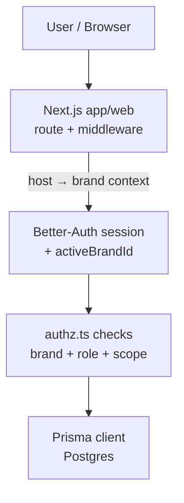

---

## 2. Host/brand resolution flow

```text
request.host
   |
   v
+-------------------+
| middleware.ts     |
| resolve host      |
+-------------------+
   |
   +--> host brand = BASELINE_MARTIAL_ARTS
   +--> host brand = BBL
   +--> host brand = WEKAF
   +--> host brand = RONIN_DOJO_DESIGN
   |
   v
theme / marketing chrome / copy defaults
   |
   v
auth session may still carry activeBrandId
```

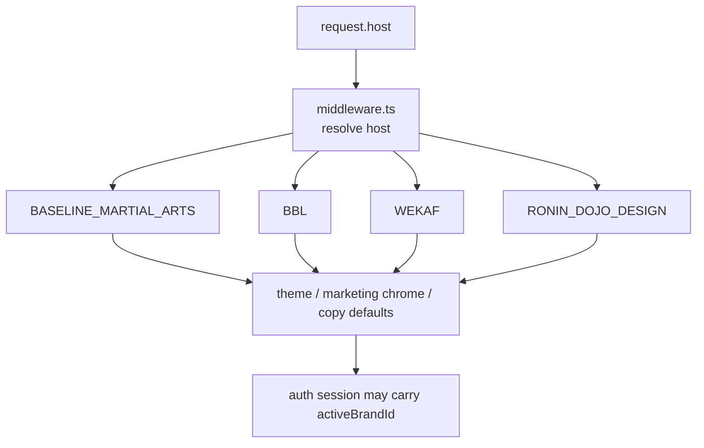

### Key rule
Host brand and active app brand may align, but they are not always the same thing.

---

## 3. Auth + brand context flow (web)

```text
Visitor
  |
  v
Sign in / Sign up
  |
  v
Better-Auth creates session cookie
  |
  v
Server reads session
  |
  +--> host-derived brand context
  |
  +--> session.user.activeBrandId
  |
  v
authz.ts
  |
  +--> isAdmin?
  +--> isInSameBrand?
  +--> membership / role checks
  |
  v
Prisma query
  |
  v
Postgres rowset
```

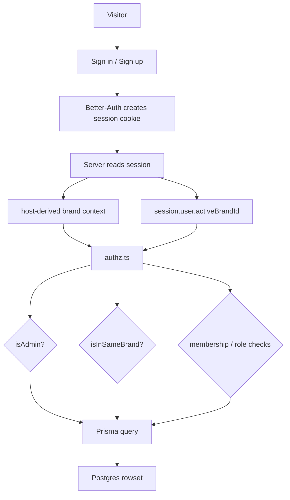

---

## 4. Mobile auth decision flow (current unresolved branch)

```text
                +--------------------+
                | apps/mobile (Expo) |
                +----------+---------+
                           |
                           v
              Which mobile auth path is final?
                           |
        +------------------+------------------+
        |                                     |
        v                                     v
+----------------------+         +----------------------------+
| Better-Auth mobile   |         | JWT bridge fallback        |
| SDK path             |         | short-lived mobile token   |
+----------------------+         +----------------------------+
        |                                     |
        v                                     v
shared session contract             explicit token lifecycle
        |                                     |
        +------------------+------------------+
                           |
                           v
                    app/api/v1 calls
```

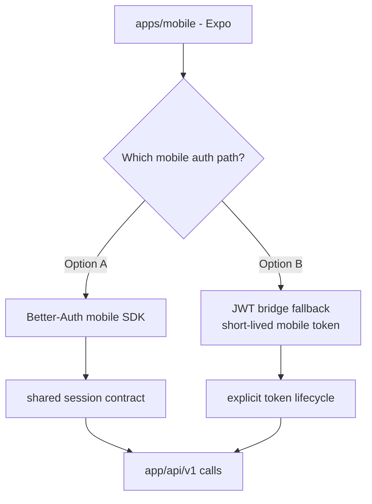

---

## 5. Identity shell flow

```text
User
 |
 +--> Passport (global identity)
 |
 +--> DirectoryProfile (privacy + visibility)
 |
 +--> Membership(s)
       |
       +--> Organization
       +--> Discipline
       +--> Rank
       +--> Role assignments
       +--> Status
```

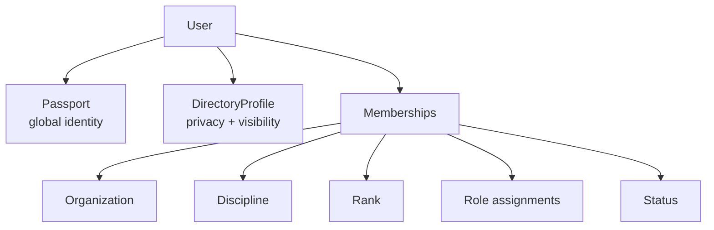

---

## 6. Tournament flow

```text
Tournament
  |
  +--> TournamentDiscipline
          |
          +--> Division
                 |
                 +--> Registration
                         |
                         +--> RegistrationEntry
                                |
                                +--> snapshotRankName
                                +--> snapshotOrgName
                                +--> representingMembership
```

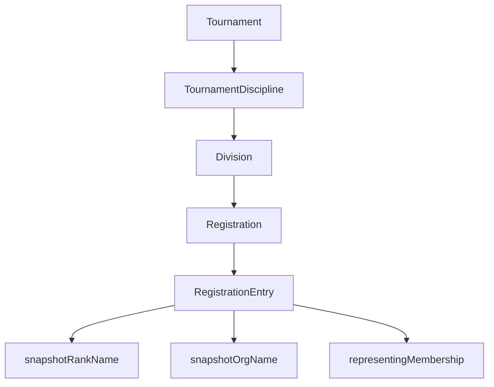

### Why snapshot matters
Registration history must not be rewritten by later promotions or organization changes.

---

## 7. Content truth flow (current + emerging)

## Current public long-form content
```text
Authoring in repo
   |
   v
apps/web/content/blog/*.mdx
   |
   v
Next.js render
   |
   v
public blog/article output
```

## Emerging structured editorial flow
```text
Capture / draft / knowledge
   |
   +--> wiki docs
   +--> sessions
   +--> future atom intake
   |
   v
ContentAtom / ContentTask / content variants
   |
   v
render / publish / campaign outputs
```

### Key rule
Do not confuse:
- wiki knowledge pages
- current live MDX blog content
- future reusable content-atom operational flow

These are related, not identical.

---

## 8. Documentation / session flow

```text
Bow in
  |
  v
read latest SESSION_NNNN
  |
  v
read program-plan + wiki index
  |
  v
do one task
  |
  v
update docs / files / session file
  |
  v
bow out
  |
  v
next SESSION picks up from there
```

---

## 9. Wiki maintenance flow

```text
new page or changed page
   |
   v
JETTY 3.0 frontmatter check
   |
   v
update health / updated / last_agent
   |
   v
fix backlinks / pairs_with
   |
   v
update wiki index if needed
```

---

## 10. Suggested content-engine operational flow for this repo

```text
Capture idea
  |
  v
Intake queue
  |
  v
Atomize truth
  |
  v
Draft variant(s)
  |
  v
Media tasks / review
  |
  v
Publish target selected
  |
  +--> MDX blog
  +--> social/video variant
  +--> in-app content entity
  |
  v
Publication log / next iteration
```

---

## 11. Local dev auth + storage flow (SESSION_0131)

See full runbook: [`docs/runbooks/local-dev-auth-storage.md`](./local-dev-auth-storage.md)

```text
GET /api/auth/dev-login
  |
  v
Guard: isDev && DEV_LOGIN_USER_ID?
  |
  v
auth.api.signInMagicLink({ email })
  |  creates Verification row
  v
Read Verification.identifier from DB
  |
  v
auth.api.magicLinkVerify({ token })
  |  BA throws APIError(302) with signed cookies
  v
Catch error → extract Set-Cookie headers
  |
  v
307 redirect to /me (cookies forwarded)
  |
  v
getServerSession() reads signed cookie → user
  |
  v
/me checks Passport + DirectoryProfile exist → 200
```

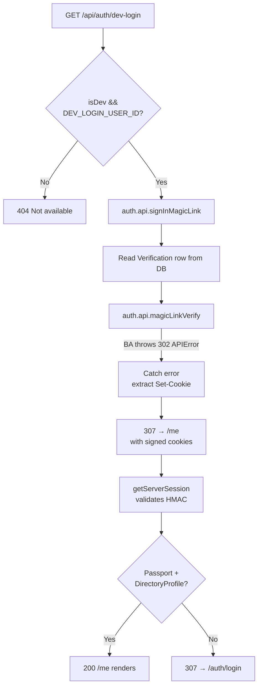

### Storage wiring (MinIO local → S3 prod)

```text
Upload request
  |
  v
lib/media.ts → uploadToS3Storage(file, key)
  |
  v
services/s3.ts → S3Client({
  endpoint: S3_ENDPOINT,         ← "http://localhost:9000" (local)
  forcePathStyle: true,          ← required for MinIO
  credentials: { accessKeyId, secretAccessKey }
})
  |
  v
MinIO :9000 (local) | S3/R2 (staging/prod)
  |
  v
Public URL: S3_PUBLIC_URL/key.ext
```

## 12. Program → Course → Enrollment flow (SESSION_0146)

```text
Program (brand + org + discipline)
  |
  +--> AgeGroup filter (many-to-many)
  +--> SkillLevel filter (many-to-many)
  |
  v
ProgramCourse (join: which courses belong)
  |
  v
Public: browse programs → check eligibility
  |
  v
CourseEnrollment
  |
  +--> linked to Membership
  +--> linked to PricingPlan (payment tier)
  |
  v
CurriculumItemCompletion
  |
  v
Rank / certification readiness
```

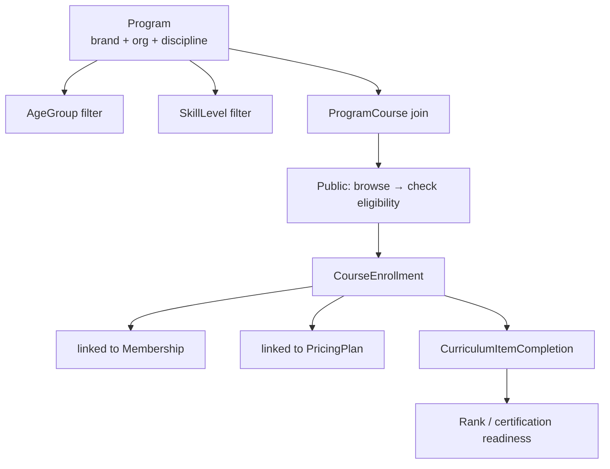

---

## 13. Payment / Stripe checkout flow (SESSION_0146)

### Dirstarter baseline vs our extension

Dirstarter uses Stripe for directory-listing tiers (Free/Standard/Premium one-time + subscription). We extend this for martial arts use cases:

| Use case | Stripe model | PricingModel enum |
| --- | --- | --- |
| Monthly membership | Recurring subscription | MONTHLY |
| Annual membership | Recurring subscription | ANNUAL |
| Drop-in class | One-time payment | DROP_IN |
| Punch card (buy 4 get 5th free) | One-time payment + session tracking | PUNCH_CARD |
| Private lesson | One-time payment | PRIVATE_LESSON |
| Tournament registration | One-time payment | PER_TEST / CUSTOM |
| Free trial | No charge | FREE_TRIAL |
| Intro pack | One-time payment | INTRO_PACK |

### Payment wiring flow

```text
User selects program / membership tier
  |
  v
PricingPlan lookup (amountCents, stripeProductId, stripePriceId)
  |
  v
Stripe Checkout Session created
  |
  +--> success_url: /enrollment/confirm?session_id={id}
  +--> cancel_url: /programs/{slug}
  |
  v
Stripe webhook: checkout.session.completed
  |
  v
Server handler:
  +--> Create/activate Membership (if membership purchase)
  +--> Create CourseEnrollment (if course purchase)
  +--> Create/update UserBrandSubscription (if site subscription)
  +--> Record payment in PaymentLog (future model)
  |
  v
Confirmation email via Resend
```

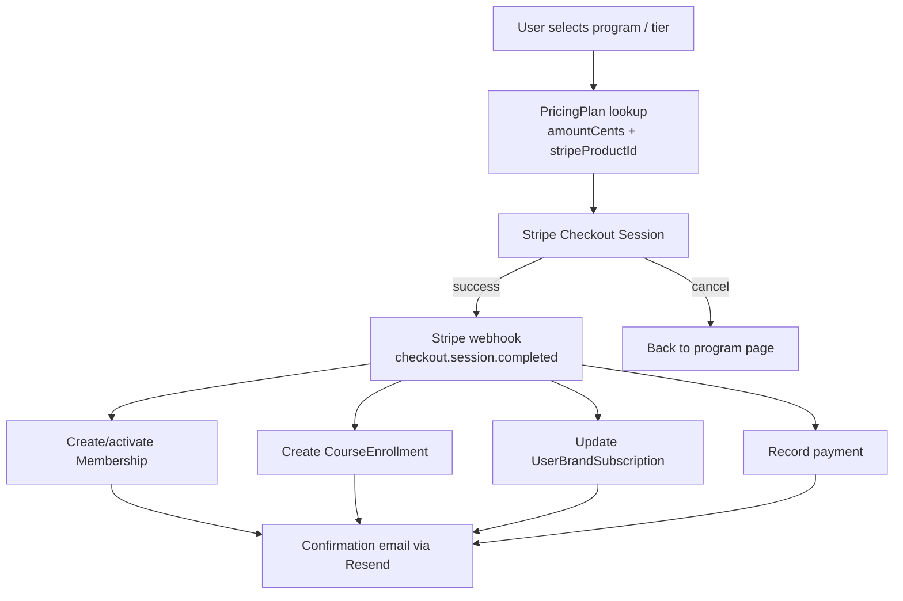

### Subscription cancellation flow

```text
Stripe webhook: customer.subscription.deleted
  |
  v
Lookup Membership by stripeSubscriptionId
  |
  v
transitionMembershipStatus(ACTIVE → EXPIRED)
  |
  v
Entitlements revoked
  |
  v
Notification email
```

---

## 14. Invite → Claim → Membership activation flow (SESSION_0146)

```text
Admin creates Invite
  |
  +--> organizationId
  +--> role (optional)
  +--> email (optional — named invite vs open link)
  +--> expiresAt
  +--> maxUses
  |
  v
Invite link generated: /invite/{token}
  |
  v
Recipient visits link
  |
  v
Auth check: signed in?
  |
  +--> No: redirect to sign up, then return
  +--> Yes: continue
  |
  v
InviteClaim created
  |
  +--> checks: not expired, not over maxUses, not already claimed by this user
  |
  v
Membership created (status: INVITED → PENDING or ACTIVE depending on org setting)
  |
  v
MembershipRoleAssignment created (if role specified)
  |
  v
Redirect to /organizations/{slug}/welcome
```

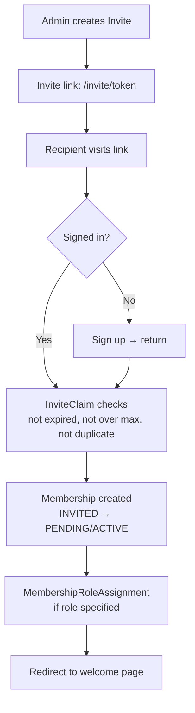

---

## 15. Certification issuance flow (SESSION_0146)

```text
CertificateTemplate (per brand/discipline)
  |
  +--> certificateType (RANK_PROMOTION, COURSE_COMPLETION, SEMINAR, etc.)
  +--> deliveryMethod (DIGITAL, PHYSICAL, BOTH)
  |
  v
Trigger event:
  +--> Rank award granted
  +--> Course completed
  +--> Seminar attended
  |
  v
Certification record created
  |
  +--> userId
  +--> templateId
  +--> issuedAt
  +--> expiresAt (optional)
  +--> status (ACTIVE, EXPIRED, REVOKED)
  |
  v
Digital certificate rendered / physical cert queued
```

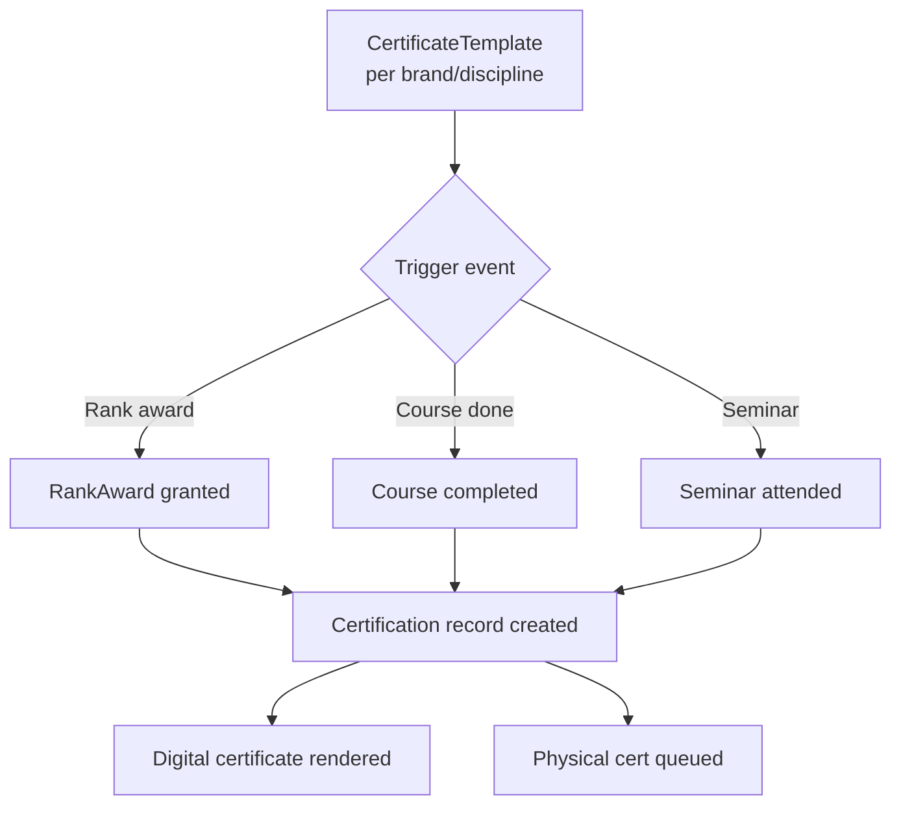

---

## 16. Punch card / drop-in session tracking flow (SESSION_0146)

```text
User purchases PricingPlan (PUNCH_CARD)
  |
  +--> punchCardSize: 5
  +--> bonusSessions: 1
  |
  v
Entitlement created: "5 sessions of Program X"
  |
  v
User attends class
  |
  v
Attendance record (future model: ClassAttendance)
  |
  +--> decrements remaining sessions on Entitlement
  |
  v
Sessions remaining = 0?
  |
  +--> Yes: entitlement exhausted, prompt repurchase
  +--> No: continue tracking
```

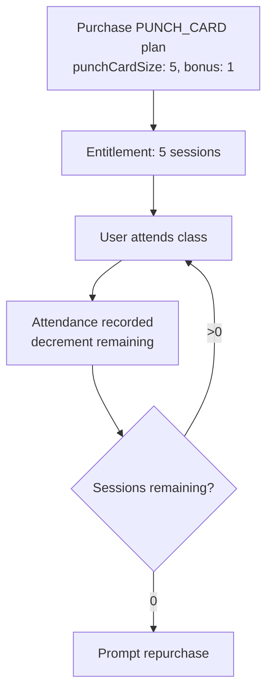

### Open design question

ClassAttendance model does not exist yet. This is needed before punch card tracking can be implemented. Likely shape:

```prisma
model ClassAttendance {
  id            String   @id @default(cuid())
  userId        String
  courseId       String
  membershipId  String?
  entitlementId String?
  attendedAt    DateTime @default(now())
  // ...relations
}
```

---

## 17. Dirstarter → Ronin Dojo monetization alignment map (SESSION_0146)

### What Dirstarter provides (L1 baseline)

Dirstarter's monetization is built around a **directory listing model**:

| Dirstarter concept | Model | Revenue type |
| --- | --- | --- |
| **Tool** (listing) | `Tool` model with status workflow (Draft→Pending→Scheduled→Published) | The core "thing" being listed |
| **Free listing** | No Stripe charge, queue-based processing | Freemium funnel |
| **Standard listing** | One-time Stripe payment, do-follow link, 24h processing | One-time revenue |
| **Premium listing** | Recurring Stripe subscription, featured placement, do-follow | MRR |
| **Advertising** | `Ad` model with 6 placement types (Banner, Tools, ToolPage, BlogPost, Bottom, All) | CPM/CPC or flat-rate |
| **Affiliate links** | `affiliateUrl` on Tool + link shortener tracking | Commission |
| **Tool claiming** | One-time token, OTP verification | Engagement |
| **Content/blog mentions** | `<ToolEntry>` MDX component embeds listings in posts | Cross-sell |
| **Submission workflow** | User submits → admin reviews → schedule → publish + email | Content pipeline |

### How we map this to martial arts SaaS (L2 extension)

| Dirstarter L1 concept | Our L2 equivalent | Revenue model |
| --- | --- | --- |
| **Tool listing** | **Organization listing** (school/dojo/gym in directory) | Free listing + premium placement |
| **Tool submission** | **Organization registration** (claim your school) | Free + paid tiers |
| **Premium listing** | **Featured school placement** in directory | Recurring subscription |
| **Advertising** | **Ad placements** on directory, tournament, blog pages | Flat-rate or CPM |
| **Affiliate links** | **Equipment/gear affiliate links** per discipline | Commission |
| **Tool claiming** | **School claiming** (verify you own this org) | Engagement |
| **Content/blog mentions** | **School/technique/discipline mentions** in blog posts | Cross-sell |
| *(no equivalent)* | **Membership dues** (monthly/annual program enrollment) | Recurring — **primary revenue** |
| *(no equivalent)* | **Tournament registration fees** | Per-event |
| *(no equivalent)* | **Drop-in / punch card / private lesson** | Transactional |
| *(no equivalent)* | **Certification fees** (belt testing, seminar) | Per-event |
| *(no equivalent)* | **Merch store** (gi, equipment, branded gear) | E-commerce |

### Listing types mapped to our models

| Listing type | Our model | Admin CRUD exists? | Public page? |
| --- | --- | --- | --- |
| School / Org listing | `Organization` | ✅ | ✅ (directory) |
| Discipline listing | `Discipline` | ✅ (admin) | ❌ (no public browse page yet) |
| Course listing | `Course` | ✅ (admin) | ❌ (no public browse page yet) |
| Program listing | `Program` | ✅ (admin) | ❌ (no public browse page yet) |
| Technique listing | *(future: TechniqueAtom)* | ❌ | ❌ |
| Tournament listing | `Tournament` | ✅ (admin + public) | ✅ |
| Instructor listing | `DirectoryProfile` + `Membership` (role=INSTRUCTOR) | ✅ (directory) | ✅ |

### Revenue projection architecture

```text
Revenue streams
  |
  +--> RECURRING (predictable MRR)
  |    +--> Membership dues (MONTHLY/ANNUAL via PricingPlan)
  |    +--> Premium org listing (featured placement subscription)
  |    +--> Site subscription (UserBrandSubscription: FREE/PREMIUM/PRO)
  |
  +--> TRANSACTIONAL (per-event)
  |    +--> Tournament registration fees
  |    +--> Drop-in class fees
  |    +--> Punch card purchases
  |    +--> Private lesson fees
  |    +--> Certification/testing fees
  |
  +--> ADVERTISING (placement-based)
  |    +--> Banner ads (top of page)
  |    +--> Directory ads (blended with org/school cards)
  |    +--> Tournament page ads
  |    +--> Blog post ads
  |    +--> Bottom-of-page ads
  |
  +--> AFFILIATE (commission-based)
  |    +--> Equipment/gear links per discipline
  |    +--> Training resource links
  |
  +--> E-COMMERCE (future)
       +--> Merch store (gi, gear, branded items)
```

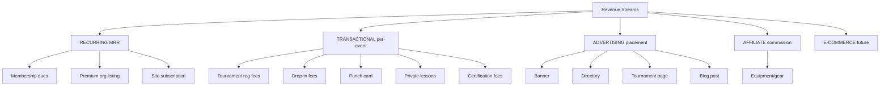

### Discipline involvement in monetization

Disciplines are central to pricing and listing:

```text
Discipline
  |
  +--> Programs (filtered by discipline)
  |    +--> PricingPlans per program
  |    +--> AgeGroup + SkillLevel eligibility
  |
  +--> Tournaments (TournamentDiscipline)
  |    +--> Divisions (per discipline)
  |    +--> Registration fees per division
  |
  +--> Certifications (per discipline)
  |    +--> Testing fees
  |    +--> Rank system progression
  |
  +--> Directory (discipline filter)
  |    +--> Members searchable by discipline
  |    +--> Orgs searchable by discipline
  |
  +--> Affiliate links (discipline-specific gear)
```

### Stripe wiring plan (not yet implemented)

| Use case | Stripe product type | Webhook events needed |
| --- | --- | --- |
| Membership (monthly/annual) | Recurring subscription | `checkout.session.completed`, `customer.subscription.deleted`, `invoice.payment_failed` |
| Premium org listing | Recurring subscription | Same as above |
| Tournament registration | One-time payment | `checkout.session.completed` |
| Drop-in / punch card | One-time payment | `checkout.session.completed` |
| Private lesson | One-time payment | `checkout.session.completed` |
| Certification fee | One-time payment | `checkout.session.completed` |
| Advertising | One-time or recurring | `checkout.session.completed` |
| Site subscription (PRO tier) | Recurring subscription | `checkout.session.completed`, `customer.subscription.deleted` |

### Dirstarter components we reuse vs extend

| Dirstarter L1 component/pattern | Reuse or extend | Notes |
| --- | --- | --- |
| `Ad` model + 6 AdType placements | **Reuse** — add brand column | Same ad placement logic works |
| `Tool` status workflow (Draft→Pending→Scheduled→Published) | **Study** — adapt for org listing submissions | Same state machine pattern for school claims |
| Stripe webhook handler (`app/api/stripe/webhooks/route.ts`) | **Extend** — add our product types | Base webhook structure is L1 |
| Submission email flow (notify admin + submitter) | **Reuse** — adapt templates | Same pattern, different content |
| `config/ads.ts`, `config/submissions.ts`, `config/claims.ts` | **Extend** — add our config values | Same config pattern |
| Admin data tables + status filters | **Reuse** | Already using these throughout |
| `<ToolEntry>` blog embed | **Adapt** — `<SchoolEntry>`, `<TechniqueEntry>` | Same MDX component pattern |

---

## 18. What not to do

- do not let host brand logic replace active brand logic
- do not let public blog output pretend to be the whole content system
- do not let wiki notes become runtime state by accident
- do not let session files turn into essays
- do not let old WP/PODS data flow assumptions overwrite current Next/Prisma/Postgres truth

---

## Petey close

A clean system has clean flows.

If a flow feels muddy, the truth boundary is probably muddy too.

**Planned Passion Produces Purpose.**
**OSSS.**
