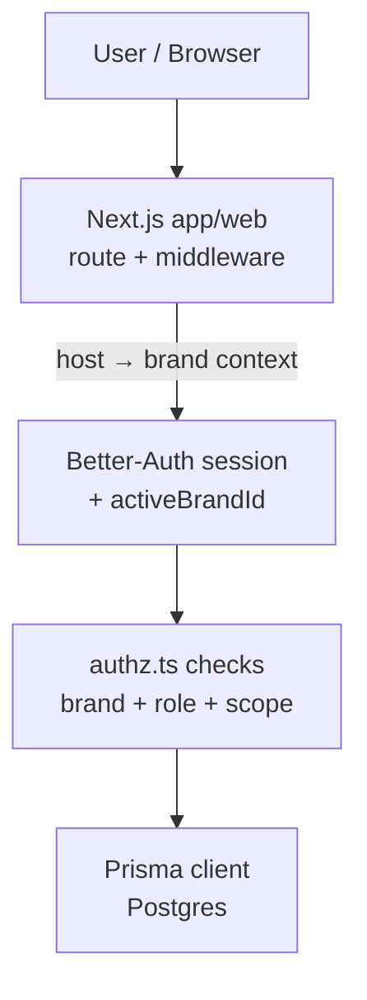
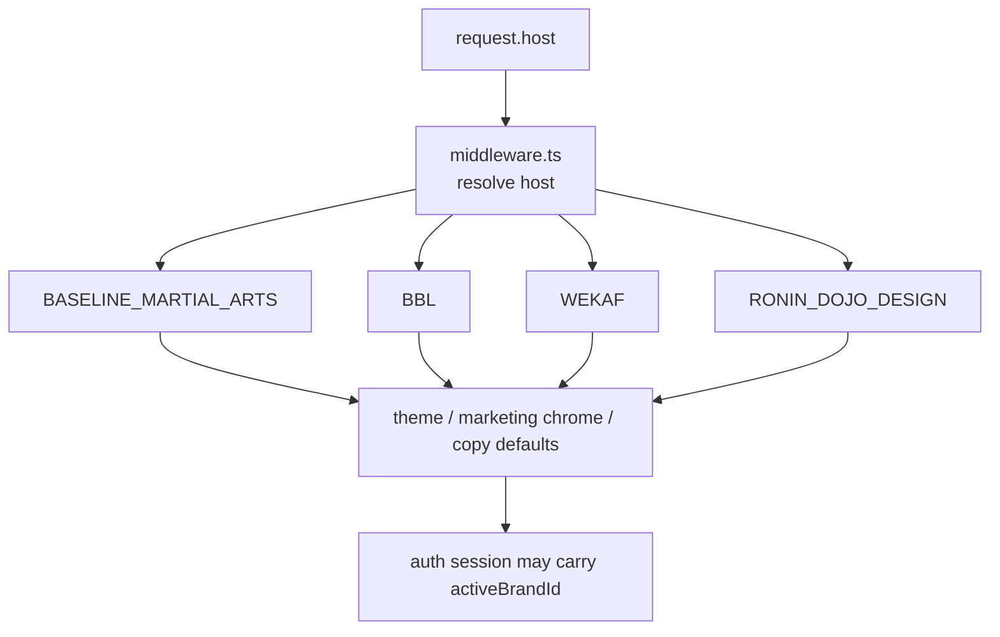
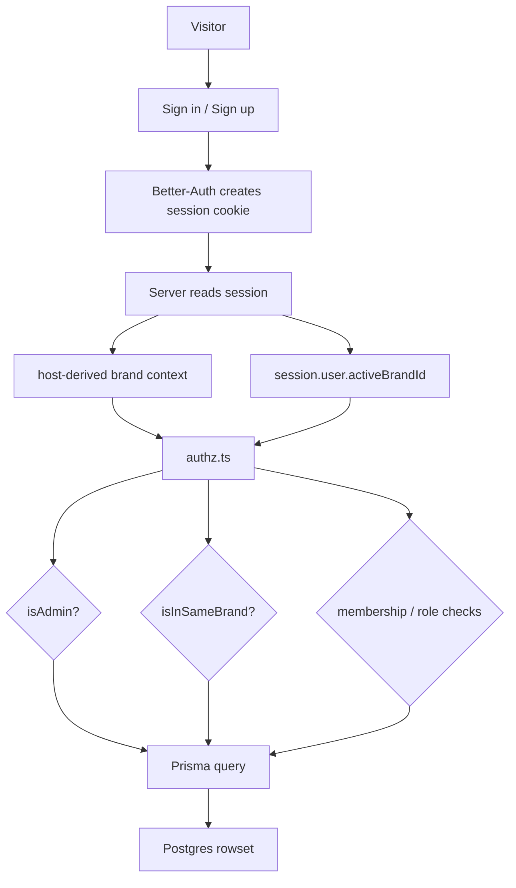
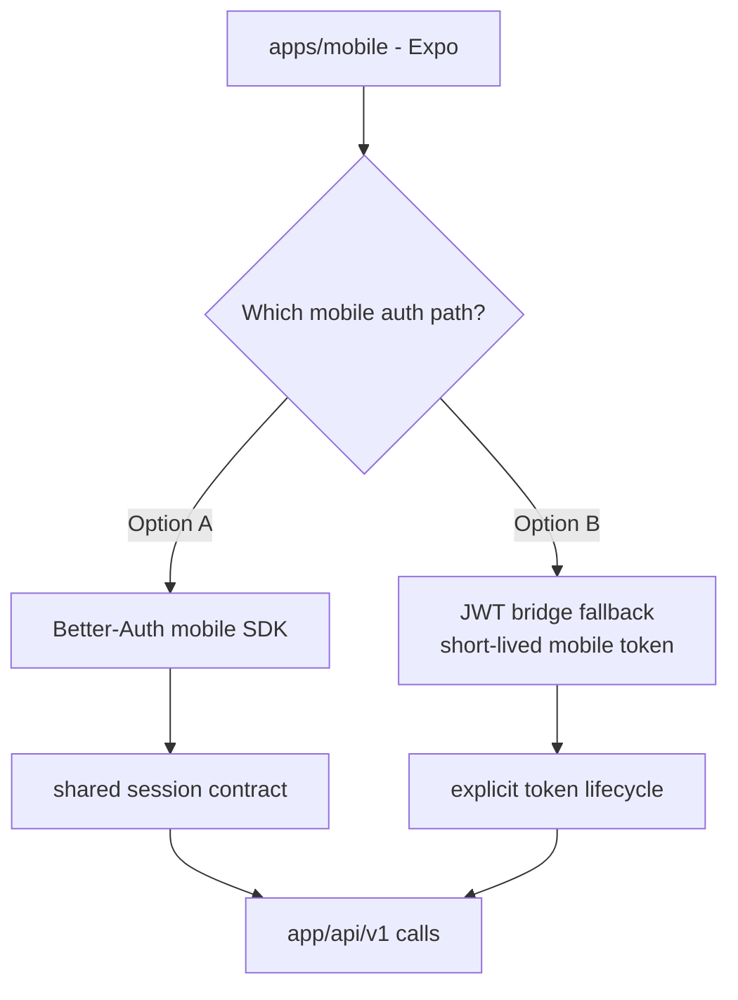
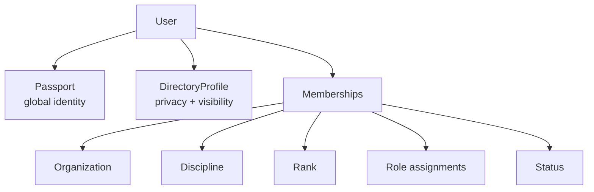
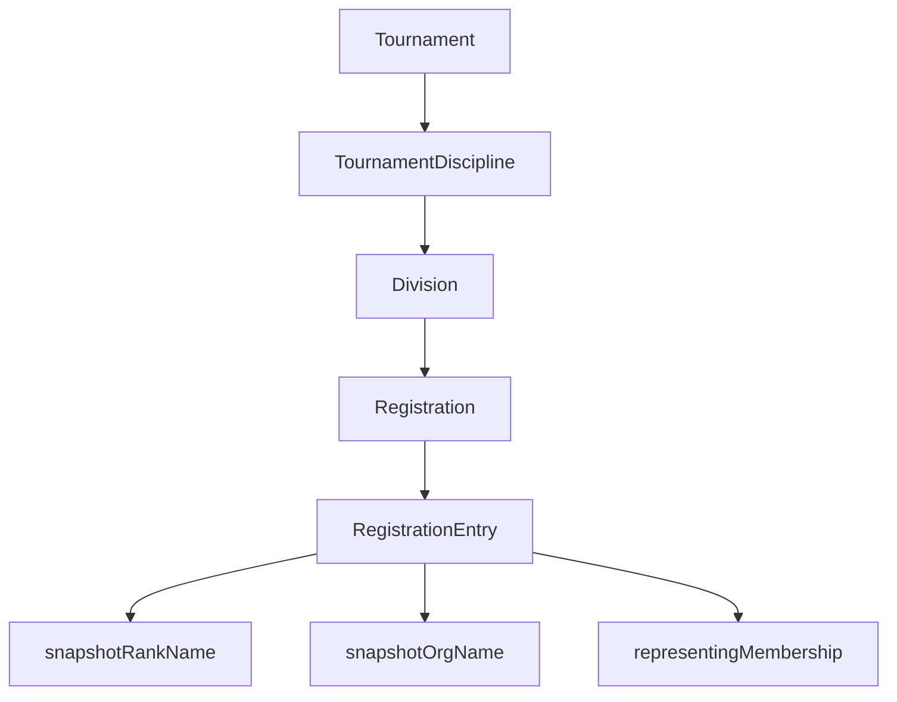
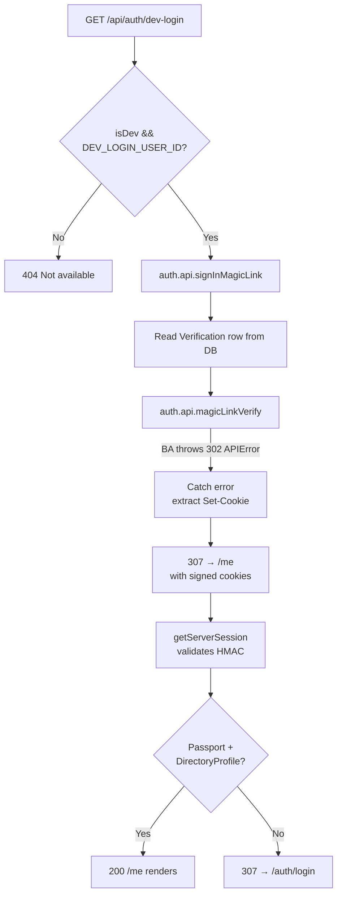

# SOP — Data Flows and Wiring Flows

## Purpose
Document the major system flows in low-fi ASCII so:
- humans can reason about the repo quickly
- future agents do not rebuild the same mental model from scratch
- product, auth, content, and brand wiring stay separate

---

## 1. High-level platform flow

```text
                    +----------------------+
                    |   User / Browser     |
                    +----------+-----------+
                               |
                               v
                    +----------------------+
                    |  Next.js app/web     |
                    |  route + middleware  |
                    +----------+-----------+
                               |
                  host -> brand | context
                               v
                    +----------------------+
                    | Better-Auth session  |
                    | + activeBrandId      |
                    +----------+-----------+
                               |
                               v
                    +----------------------+
                    | authz.ts checks      |
                    | brand + role + scope |
                    +----------+-----------+
                               |
                               v
                    +----------------------+
                    | Prisma client        |
                    | Postgres             |
                    +----------------------+
```



---

## 2. Host/brand resolution flow

```text
request.host
   |
   v
+-------------------+
| middleware.ts     |
| resolve host      |
+-------------------+
   |
   +--> host brand = BASELINE_MARTIAL_ARTS
   +--> host brand = BBL
   +--> host brand = WEKAF
   +--> host brand = RONIN_DOJO_DESIGN
   |
   v
theme / marketing chrome / copy defaults
   |
   v
auth session may still carry activeBrandId
```



### Key rule
Host brand and active app brand may align, but they are not always the same thing.

---

## 3. Auth + brand context flow (web)

```text
Visitor
  |
  v
Sign in / Sign up
  |
  v
Better-Auth creates session cookie
  |
  v
Server reads session
  |
  +--> host-derived brand context
  |
  +--> session.user.activeBrandId
  |
  v
authz.ts
  |
  +--> isAdmin?
  +--> isInSameBrand?
  +--> membership / role checks
  |
  v
Prisma query
  |
  v
Postgres rowset
```



---

## 4. Mobile auth decision flow (current unresolved branch)

```text
                +--------------------+
                | apps/mobile (Expo) |
                +----------+---------+
                           |
                           v
              Which mobile auth path is final?
                           |
        +------------------+------------------+
        |                                     |
        v                                     v
+----------------------+         +----------------------------+
| Better-Auth mobile   |         | JWT bridge fallback        |
| SDK path             |         | short-lived mobile token   |
+----------------------+         +----------------------------+
        |                                     |
        v                                     v
shared session contract             explicit token lifecycle
        |                                     |
        +------------------+------------------+
                           |
                           v
                    app/api/v1 calls
```



---

## 5. Identity shell flow

```text
User
 |
 +--> Passport (global identity)
 |
 +--> DirectoryProfile (privacy + visibility)
 |
 +--> Membership(s)
       |
       +--> Organization
       +--> Discipline
       +--> Rank
       +--> Role assignments
       +--> Status
```



---

## 6. Tournament flow

```text
Tournament
  |
  +--> TournamentDiscipline
          |
          +--> Division
                 |
                 +--> Registration
                         |
                         +--> RegistrationEntry
                                |
                                +--> snapshotRankName
                                +--> snapshotOrgName
                                +--> representingMembership
```



### Why snapshot matters
Registration history must not be rewritten by later promotions or organization changes.

---

## 7. Content truth flow (current + emerging)

## Current public long-form content
```text
Authoring in repo
   |
   v
apps/web/content/blog/*.mdx
   |
   v
Next.js render
   |
   v
public blog/article output
```

## Emerging structured editorial flow
```text
Capture / draft / knowledge
   |
   +--> wiki docs
   +--> sessions
   +--> future atom intake
   |
   v
ContentAtom / ContentTask / content variants
   |
   v
render / publish / campaign outputs
```

### Key rule
Do not confuse:
- wiki knowledge pages
- current live MDX blog content
- future reusable content-atom operational flow

These are related, not identical.

---

## 8. Documentation / session flow

```text
Bow in
  |
  v
read latest SESSION_NNNN
  |
  v
read program-plan + wiki index
  |
  v
do one task
  |
  v
update docs / files / session file
  |
  v
bow out
  |
  v
next SESSION picks up from there
```

---

## 9. Wiki maintenance flow

```text
new page or changed page
   |
   v
JETTY 3.0 frontmatter check
   |
   v
update health / updated / last_agent
   |
   v
fix backlinks / pairs_with
   |
   v
update wiki index if needed
```

---

## 10. Suggested content-engine operational flow for this repo

```text
Capture idea
  |
  v
Intake queue
  |
  v
Atomize truth
  |
  v
Draft variant(s)
  |
  v
Media tasks / review
  |
  v
Publish target selected
  |
  +--> MDX blog
  +--> social/video variant
  +--> in-app content entity
  |
  v
Publication log / next iteration
```

---

## 11. Local dev auth + storage flow (SESSION_0131)

See full runbook: [`docs/runbooks/local-dev-auth-storage.md`](./local-dev-auth-storage.md)

```text
GET /api/auth/dev-login
  |
  v
Guard: isDev && DEV_LOGIN_USER_ID?
  |
  v
auth.api.signInMagicLink({ email })
  |  creates Verification row
  v
Read Verification.identifier from DB
  |
  v
auth.api.magicLinkVerify({ token })
  |  BA throws APIError(302) with signed cookies
  v
Catch error → extract Set-Cookie headers
  |
  v
307 redirect to /me (cookies forwarded)
  |
  v
getServerSession() reads signed cookie → user
  |
  v
/me checks Passport + DirectoryProfile exist → 200
```



### Storage wiring (MinIO local → S3 prod)

```text
Upload request
  |
  v
lib/media.ts → uploadToS3Storage(file, key)
  |
  v
services/s3.ts → S3Client({
  endpoint: S3_ENDPOINT,         ← "http://localhost:9000" (local)
  forcePathStyle: true,          ← required for MinIO
  credentials: { accessKeyId, secretAccessKey }
})
  |
  v
MinIO :9000 (local) | S3/R2 (staging/prod)
  |
  v
Public URL: S3_PUBLIC_URL/key.ext
```

## 12. What not to do

- do not let host brand logic replace active brand logic
- do not let public blog output pretend to be the whole content system
- do not let wiki notes become runtime state by accident
- do not let session files turn into essays
- do not let old WP/PODS data flow assumptions overwrite current Next/Prisma/Postgres truth

---

## Petey close

A clean system has clean flows.

If a flow feels muddy, the truth boundary is probably muddy too.

**Planned Passion Produces Purpose.**
**OSSS.**
