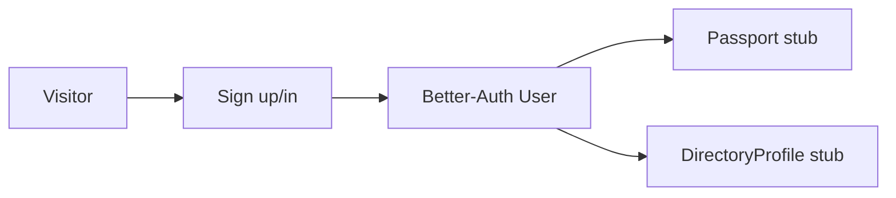
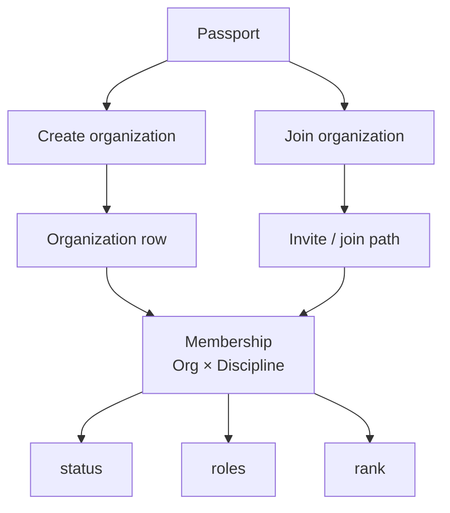
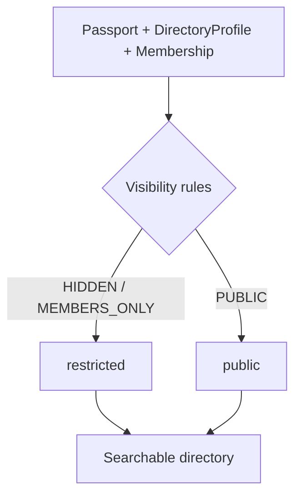
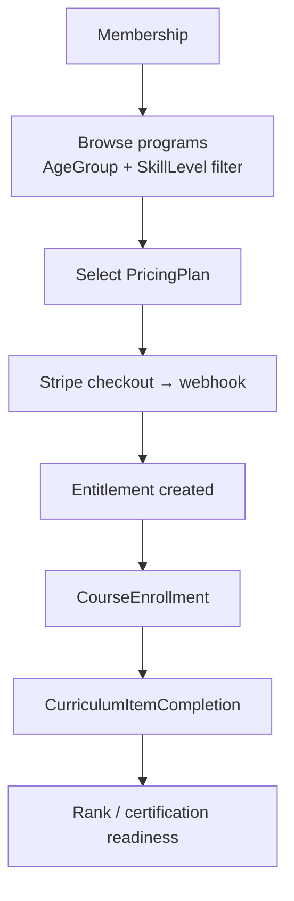
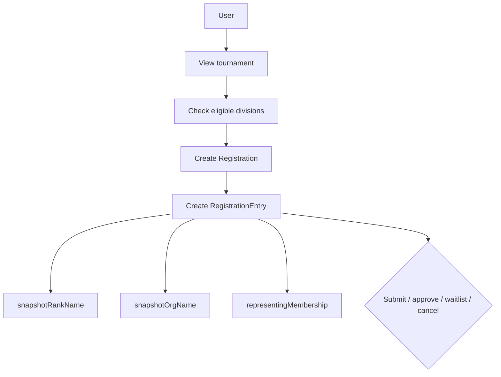
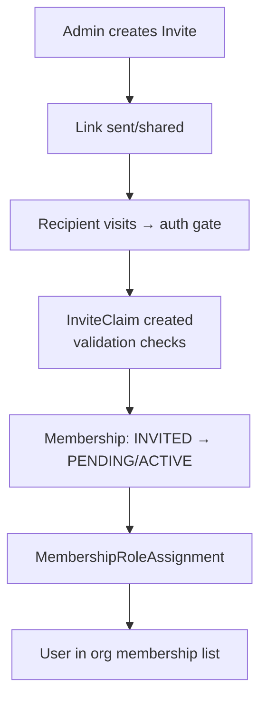
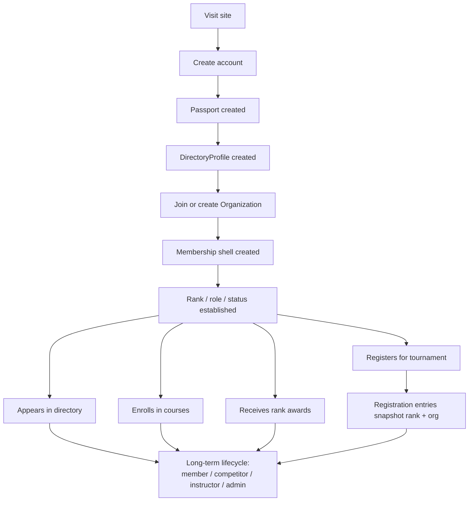
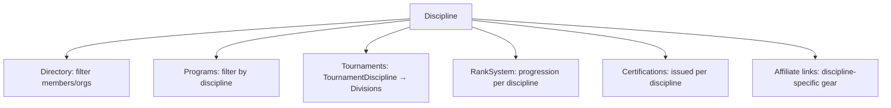

# SOP — End-to-End User Lifecycle

## Purpose
Show the intended lifecycle from first visit through active membership, training, competition, and publication/state touchpoints.

This is low-fi by design.

---

# 1. Visitor -> account -> identity

```text
+---------+      +-------------+      +------------------+
| Visitor | ---> | Sign up/in  | ---> | Better-Auth User |
+---------+      +-------------+      +------------------+
                                            |
                                            v
                                  +----------------------+
                                  | Passport stub        |
                                  | DirectoryProfile stub|
                                  +----------------------+
```



## Outcome
The user now exists as:
- account
- Passport
- DirectoryProfile

---

# 2. Identity -> organization shell

```text
Passport
  |
  +-------------------------------+
  |                               |
  v                               v
Create organization         Join organization
  |                               |
  v                               v
Organization row            Invite / join path
  |                               |
  +---------------+---------------+
                  |
                  v
        Membership (Org x Discipline)
                  |
                  +--> status
                  +--> roles
                  +--> rank
```



## Outcome
The same person now has a contextual shell inside one organization and one discipline.

---

# 3. Directory lifecycle

```text
Passport + DirectoryProfile + Membership
                 |
                 v
         Directory visibility rules
                 |
      +----------+----------+
      |                     |
      v                     v
 hidden / members-only     public
      |                     |
      +----------+----------+
                 |
                 v
          searchable directory
```



### Visibility knobs
- show email?
- show phone?
- show orgs?
- show ranks?

---

# 4. Course / curriculum lifecycle (updated SESSION_0146)

```text
Membership
   |
   v
Browse programs (filtered by AgeGroup + SkillLevel eligibility)
   |
   v
Select PricingPlan (monthly / drop-in / punch card / private lesson)
   |
   v
Payment (Stripe checkout → webhook → entitlement created)
   |
   v
CourseEnrollment
   |
   v
CurriculumItemCompletion
   |
   v
Rank / certification readiness
```



## Outcome
The user can progress in a structured training path.

---

# 5. Rank lifecycle

```text
Course / instructor / org process
               |
               v
         Rank award decision
               |
               v
           RankAward
               |
               v
Membership rank updates
               |
               v
Directory / tournament eligibility can change
```

### Important rule
Historic tournament entries must not be rewritten by later rank changes.

---

# 6. Tournament lifecycle

```text
User
 |
 v
View tournament
 |
 v
Check eligible divisions
 |
 v
Create Registration
 |
 v
Create RegistrationEntry
 |
 +--> snapshotRankName
 +--> snapshotOrgName
 +--> representingMembership
 |
 v
Submit / approve / waitlist / cancel
```



---

# 7. Staff / admin lifecycle

```text
User
 |
 v
Membership roles / admin authority
 |
 +--> org admin
 +--> coach
 +--> judge
 +--> owner
 |
 v
TournamentStaffAssignment / admin pages
```

---

# 8. Subscription / certification lifecycle (extended platform lane)

```text
User
 |
 +--> UserBrandSubscription (site-level FREE/PREMIUM/PRO)
 |
 +--> Certification (issued on rank award, course completion, seminar)
 |      |
 |      +--> status: ACTIVE / EXPIRED / REVOKED
 |      +--> expiresAt (optional)
 |
 v
access / entitlement / proof / expiry states
```

---

# 8b. Invite lifecycle (SESSION_0146)

```text
Admin creates Invite
  |
  +--> org + role + email (optional) + expiry + maxUses
  |
  v
Invite link sent / shared
  |
  v
Recipient visits link → auth gate
  |
  v
InviteClaim created (validates: not expired, not over max, not duplicate)
  |
  v
Membership created (INVITED → PENDING or ACTIVE)
  |
  v
MembershipRoleAssignment (if role specified)
  |
  v
User appears in org membership list
```



---

# 8c. Payment lifecycle (SESSION_0146)

```text
User selects program / membership / tournament
  |
  v
PricingPlan lookup (amountCents, Stripe IDs)
  |
  v
Stripe Checkout Session
  |
  +--> success: webhook → create Membership/Enrollment/Entitlement
  +--> cancel: return to selection
  |
  v
Ongoing: subscription renewals / punch card tracking / expiry
  |
  v
Cancellation: webhook → transition to EXPIRED
```

### Lifecycle variants by pricing model

| PricingModel | Payment type | Ongoing tracking |
| --- | --- | --- |
| MONTHLY / ANNUAL | Recurring subscription | Stripe manages renewals; webhook on cancel |
| DROP_IN | One-time per class | No ongoing tracking |
| PUNCH_CARD | One-time prepay | Session count tracked via Entitlement |
| PRIVATE_LESSON | One-time per lesson | No ongoing tracking |
| FREE_TRIAL | No charge | Expiry date on Entitlement |

---

# 8d. Punch card / drop-in lifecycle (SESSION_0146)

```text
User purchases punch card (e.g., buy 4 get 5th free)
  |
  v
Entitlement: 5 sessions of Program X
  |
  v
Attend class → ClassAttendance record → decrement
  |
  v
Sessions exhausted → prompt repurchase
```

This differs from monthly members who have unlimited access during their subscription period.

---

# 9. Cross-brand lifecycle

```text
One user
  |
  +--> host brand = BASELINE
  +--> activeBrandId = BASELINE
  |
  +--> may later have other brand memberships
  |
  v
same account, different app context
```

### Key rule
One human can move across brands without needing a separate backend identity.

---

# 10. Content lifecycle touchpoints around a user

```text
User journey
   |
   +--> directory profile
   +--> training history
   +--> tournament participation
   +--> possible content/story features
   |
   v
future content atom references:
- member spotlight
- tournament recap
- curriculum lesson
- lineage story
```

---

# 11. E2E happy-path ASCII journey

```text
Visit site
  |
  v
Create account
  |
  v
Passport created
  |
  v
DirectoryProfile created
  |
  v
Join or create Organization
  |
  v
Membership shell created
  |
  v
Rank / role / status established
  |
  +--> appears in directory (depending on visibility)
  |
  +--> enrolls in courses
  |
  +--> receives rank awards
  |
  +--> registers for tournament
  |
  +--> registration entries snapshot rank + org
  |
  v
long-term member / competitor / instructor / admin lifecycle
```



---

# 12. Failure / edge states to remember

- account exists but Passport stub incomplete
- Passport complete but no Membership yet
- multiple memberships across organizations/disciplines
- host brand ≠ activeBrandId
- rank changed after tournament registration
- directory hidden but membership active
- subscription expired but account still valid
- mobile auth path differs from web until final decision is locked
- punch card exhausted but membership still active
- invite expired or max uses reached
- certification expired but rank still valid
- discipline removed from program after enrollment exists

---

# 13. Listing types and their lifecycles (SESSION_0146)

Different entity types have different listing/submission/approval flows:

```text
Organization listing (school/dojo/gym)
  |
  +--> self-register or admin-create
  +--> claim flow (verify ownership — maps to Dirstarter Tool claiming)
  +--> Free / Premium placement tiers
  +--> appears in directory (filtered by discipline, location)

Course listing
  |
  +--> admin-created under a Program
  +--> public browse (filtered by discipline, AgeGroup, SkillLevel)
  +--> enrollment = paid or free (via PricingPlan)

Program listing
  |
  +--> admin-created under an Organization
  +--> links to Disciplines, AgeGroups, SkillLevels, Courses
  +--> public browse page (not yet built)

Tournament listing
  |
  +--> admin-created
  +--> public view + registration
  +--> divisions filtered by Discipline
  +--> registration fees via PricingPlan

Discipline listing (reference data)
  |
  +--> system-seeded + admin-extensible
  +--> used as filter on directory, programs, tournaments
  +--> no "submission" flow — admin-only
```

### Discipline as a cross-cutting filter



---

## Petey close

The user lifecycle should feel like one spine, not six disconnected features.

If the journey breaks, the shell model is probably leaking.

**Planned Passion Produces Purpose.**
**OSSS.**
