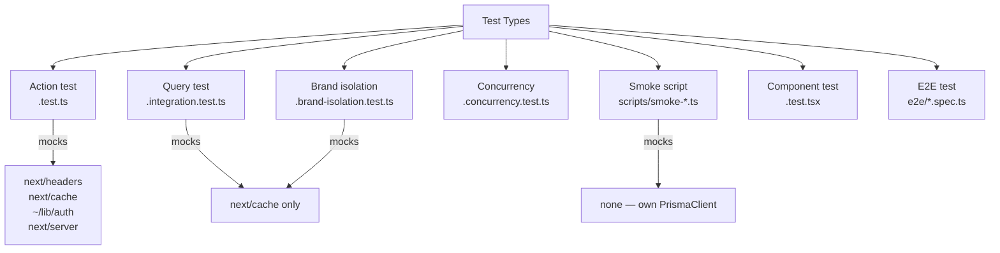
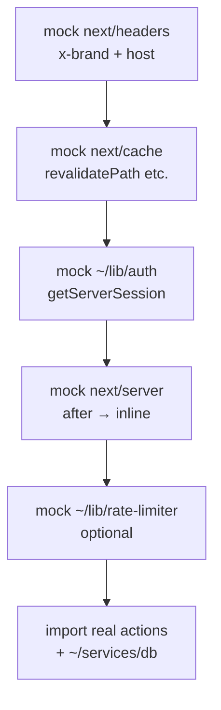
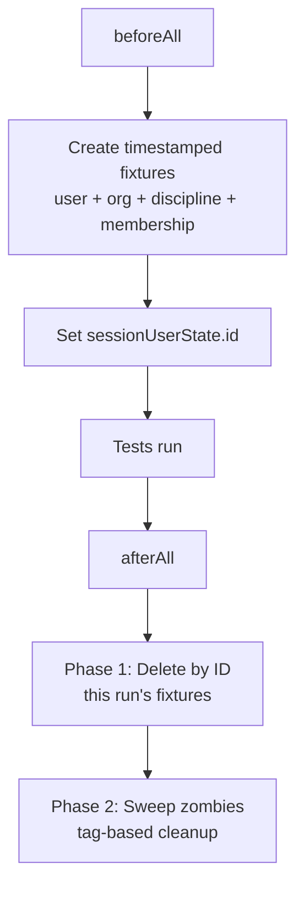
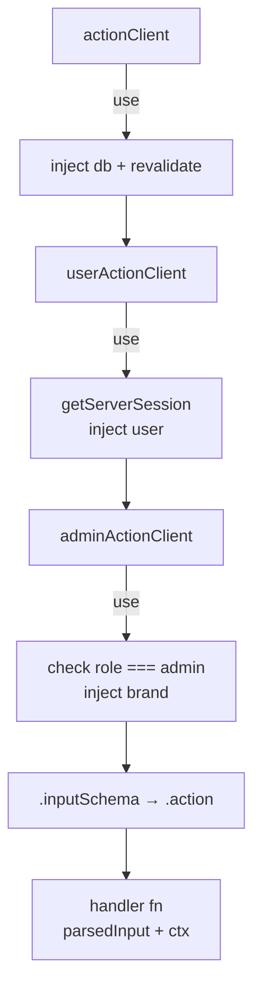
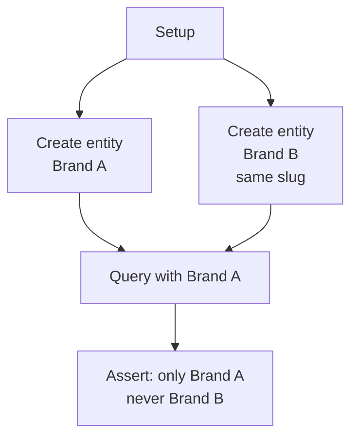
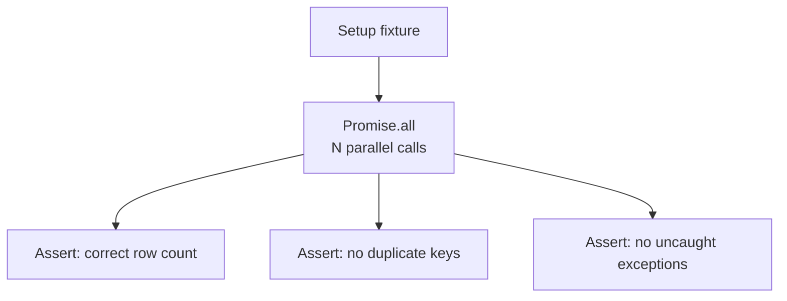

# SOP — Test Writing Patterns

## Purpose

Document the repeatable test patterns in this repo so:
- agents and humans write tests that match existing conventions
- mock surfaces stay minimal and consistent
- fixture setup/teardown patterns are copy-paste reliable
- new test files don't reinvent the wheel

---

## 1. Test taxonomy

```text
Test type
  |
  +--> Action test (.test.ts)
  |    +--> Drives server actions via safe-action client
  |    +--> Mocks: next/headers, next/cache, ~/lib/auth, next/server
  |    +--> Real: DB, Prisma, brand context, action middleware
  |    +--> Example: lead/actions.test.ts, schedule/actions.test.ts
  |
  +--> Query test (.test.ts / .integration.test.ts)
  |    +--> Calls query functions directly
  |    +--> Mocks: next/cache (cacheLife, cacheTag)
  |    +--> Real: DB, Prisma
  |    +--> Example: disciplines/queries.integration.test.ts
  |
  +--> Brand isolation test (.brand-isolation.test.ts)
  |    +--> Proves cross-brand data never leaks
  |    +--> Two brands, same slug pattern, assert no cross-read
  |    +--> Example: tournaments/queries.brand-isolation.test.ts
  |
  +--> Concurrency test (.concurrency.test.ts)
  |    +--> Fires parallel calls, asserts no duplicates
  |    +--> Uses unique constraint + catch/converge pattern
  |    +--> Example: materialize.concurrency.test.ts, register.concurrency.test.ts
  |
  +--> Smoke script (scripts/smoke-*.ts)
  |    +--> Pure Prisma — no action client, no mocks
  |    +--> Direct DB operations mirroring the action path
  |    +--> Own PrismaClient instance (not ~/services/db)
  |    +--> Example: smoke-attendance.ts, smoke-schedule.ts
  |
  +--> Component test (.test.tsx)
  |    +--> React component render tests
  |    +--> Example: registration-notice.test.tsx
  |
  +--> E2E test (e2e/*.spec.ts)
       +--> Playwright browser tests
       +--> Example: e2e/smoke.spec.ts, e2e/tournaments/register.spec.ts
```



---

## 2. Test runtime and runner

- **Runtime:** Bun (`bun:test`)
- **Run command:** `cd apps/web && bun test <path>`
- **No `@types/bun`** — use `// @ts-expect-error` on bun:test imports
- **Real Postgres** — all tests hit `ronindojo_dev`, not mocks or SQLite

---

## 3. Mock surface — the standard seams

Every action test mocks the same four modules. Mocks MUST be installed **before** importing action modules.

```text
mock registration order
  |
  v
1. mock.module("next/headers")     ← brand context + host
  |
  v
2. mock.module("next/cache")       ← revalidatePath, revalidateTag, cacheLife, cacheTag
  |
  v
3. mock.module("~/lib/auth")       ← getServerSession → fake session
  |
  v
4. mock.module("next/server")      ← after() runs inline (optional — only if action uses after())
  |
  v
5. mock.module("~/lib/rate-limiter") ← isRateLimited toggle (optional — only if action uses it)
  |
  v
import { myAction } from "~/server/..." ← REAL import, after all mocks
```



### 3a. next/headers mock (brand context)

```typescript
const requestBrand = "BASELINE_MARTIAL_ARTS"

mock.module("next/headers", () => ({
  headers: async () => ({
    get: (key: string) => {
      const k = key.toLowerCase()
      if (k === "x-brand") return requestBrand
      if (k === "host") return "baseline.local"
      return null
    },
  }),
}))
```

### 3b. next/cache mock (revalidation no-ops)

```typescript
mock.module("next/cache", () => ({
  revalidatePath: () => {},
  updateTag: () => {},
  revalidateTag: () => {},
  cacheLife: () => {},
  cacheTag: () => {},
}))
```

### 3c. ~/lib/auth mock (session)

Use a **mutable state object** so each test can change the user without re-mocking:

```typescript
const sessionUserState = { id: "", role: null as string | null }

mock.module("~/lib/auth", () => ({
  getServerSession: async () => ({
    user: {
      id: sessionUserState.id,
      role: sessionUserState.role,
      lastActiveBrandId: null,
    },
    session: { id: "test-session" },
  }),
  auth: {},
}))
```

For **admin action tests**, set `role: "admin"`:
```typescript
sessionUserState.role = "admin"
```

### 3d. next/server mock (after() inline execution)

Only needed when the action under test uses `after()` from `next/server`:

```typescript
mock.module("next/server", () => ({
  after: (fn: () => void | Promise<void>) => {
    void Promise.resolve().then(() => fn())
  },
}))
```

This runs the `after()` callback inline so tests can observe side effects (audit logs, revalidation).

### 3e. ~/lib/rate-limiter mock (optional)

```typescript
const rateLimitState = { limited: false }

mock.module("~/lib/rate-limiter", () => ({
  isRateLimited: async () => rateLimitState.limited,
}))
```

---

## 4. Fixture strategy — setup/teardown isolation

```text
beforeAll
  |
  v
Create timestamped fixtures
  +--> User(s) with tag("owner"), tag("student")
  +--> Organization with tag("org")
  +--> Discipline with tag("disc")
  +--> Membership(s)
  +--> Domain-specific fixtures (programs, roles, etc.)
  |
  v
Set sessionUserState.id = owner.id
  |
  v
(tests run)
  |
  v
afterAll
  |
  v
Two-phase cleanup
  +--> Phase 1: Delete this run's fixtures by ID (fast, no false positives)
  +--> Phase 2: Sweep zombie rows from crashed prior runs (tag-based)
```



### Tagging convention

```typescript
const TS = Date.now()
const TAG_PREFIX = "session-0150-"
const tag = (name: string) => `${TAG_PREFIX}${TS}-${name}`
```

All fixture names/emails/slugs use `tag()` so they are unique across parallel runs and identifiable for cleanup.

### Cascade-aware teardown order

Delete in reverse dependency order:

```text
1. AuditLog (no FK cascade from User)
2. MembershipRoleAssignment
3. Membership
4. OrganizationDiscipline
5. Program (if created)
6. Organization
7. User
8. Discipline
9. Role (if created — check isSystem)
```

---

## 5. Action test pattern (admin actions)

### Wiring flow

```text
adminActionClient middleware chain
  |
  v
actionClient.use → injects db + revalidate
  |
  v
userActionClient.use → checks getServerSession → injects user
  |
  v
adminActionClient.use → checks user.role === "admin" → injects brand
  |
  v
.inputSchema(schema).action(handler)
```



### What the test proves

| Gate | Proof |
| --- | --- |
| Auth required | Mock returns valid session → action succeeds |
| Admin role required | `sessionUserState.role = "admin"` |
| Brand scoping | Mock returns `x-brand` → action uses `ctx.brand` |
| Input validation | Zod schema validates `parsedInput` |
| DB write | Assert row exists in Postgres after action call |
| Audit trail | Assert `AuditLog` row created with correct `entityType` + `action` |
| Revalidation | No-op mock — not asserted, just not crashing |

### Test skeleton

```typescript
// @ts-expect-error — bun:test
import { afterAll, beforeAll, describe, expect, it, mock } from "bun:test"

// --- mocks (before imports) ---
const sessionUserState = { id: "", role: "admin" as string | null }
const requestBrand = "BASELINE_MARTIAL_ARTS"

mock.module("next/headers", () => ({ /* ... */ }))
mock.module("next/cache", () => ({ /* ... */ }))
mock.module("~/lib/auth", () => ({ /* ... role: sessionUserState.role ... */ }))
mock.module("next/server", () => ({
  after: (fn: () => void | Promise<void>) => { void Promise.resolve().then(() => fn()) },
}))

// --- real imports ---
import { db } from "~/services/db"
import { myAdminAction } from "~/server/admin/foo/actions"

// --- fixtures ---
const TS = Date.now()
const tag = (name: string) => `admin-test-${TS}-${name}`
let fx: { userId: string; /* ... */ }

beforeAll(async () => {
  const user = await db.user.create({ data: { name: tag("admin"), email: `${tag("admin")}@test.local` } })
  // ... create org, discipline, membership, etc.
  sessionUserState.id = user.id
  fx = { userId: user.id /* ... */ }
})

afterAll(async () => {
  // Two-phase cleanup
  if (fx) {
    await db.auditLog.deleteMany({ where: { userId: fx.userId } })
    // ... cascade-aware deletes
  }
})

describe("myAdminAction", () => {
  it("happy path", async () => {
    const result = await myAdminAction({ /* input */ })
    expect(result?.data).toBeDefined()
    // assert DB state
  })

  it("invalid input throws", async () => {
    const result = await myAdminAction({ /* bad input */ })
    expect(result?.serverError).toBeDefined()
  })
})
```

---

## 5b. Wrapped action invocation pattern (SESSION_0187)

Helper-level tests (§5) prove the business logic inside an action's exported helper. They do not prove the `next-safe-action` middleware chain — auth gate, role gate, brand injection, error normalization, revalidation. For that, invoke the wrapped export directly through `~/lib/test/safe-action-env`.

### When to use which

| Goal | Test type | Example |
| --- | --- | --- |
| Prove transaction/SQL semantics, edge cases, branching, fixture coverage | Helper-level (§5) | `claim-review-actions.test.ts` calls `applyLineageClaimReview` |
| Prove auth/admin gate, brand, schema validation, serverError shape | Wrapped action (this section) | `claim-review-actions.safe-action.test.ts` calls `reviewLineageClaim` |
| Both | Pair them — one file each, disjoint cases | SESSION_0187 ships the wrapped pair alongside SESSION_0186 helper tests |

Do not duplicate helper-level coverage in the wrapped-action file. Keep it to the gates the wrapper enforces: typically 2–3 cases (unauthenticated, unauthorized, happy path).

### Harness

`apps/web/lib/test/safe-action-env.ts` installs the standard mock seams once via `installSafeActionMocks({ brand })`. Tests mutate auth state per case with `setTestSession({ id, role })`.

### Skeleton

```typescript
// @ts-expect-error — bun:test
import { afterAll, beforeAll, describe, expect, it } from "bun:test"
import { installSafeActionMocks, setTestSession } from "~/lib/test/safe-action-env"

installSafeActionMocks({ brand: "BASELINE_MARTIAL_ARTS" })

import { db } from "~/services/db"
import { reviewLineageClaim } from "~/server/admin/lineage/claim-review-actions"

// ...fixtures...

describe("reviewLineageClaim (wrapped)", () => {
  it("returns serverError when unauthenticated", async () => {
    setTestSession(null)
    const result = await reviewLineageClaim({ claimId, decision: "APPROVED" })
    expect(result?.serverError).toBe("User not authenticated")
  })

  it("returns serverError when user lacks admin role", async () => {
    setTestSession({ id: claimantId, role: "user" })
    const result = await reviewLineageClaim({ claimId, decision: "APPROVED" })
    expect(result?.serverError).toBe("User not authorized")
  })

  it("approves with admin role and brand injection", async () => {
    setTestSession({ id: adminId, role: "admin" })
    const result = await reviewLineageClaim({ claimId, decision: "APPROVED", reviewerNote: "ok" })
    expect(result?.serverError).toBeUndefined()
    expect(result?.data?.status).toBe("APPROVED")
  })
})
```

### Rules

- `next-safe-action` returns `{ data, serverError, validationErrors }` — it never throws to the caller. Assert on `result?.serverError`, never `expect(...).toThrow`.
- Error strings come from `~/lib/safe-actions.ts`: `"User not authenticated"` (line 65), `"User not authorized"` (line 76). If those change, the tests change too.
- Use cuid-shaped ids for any schema field declared `z.string().cuid()`. Either let Prisma's `@default(cuid())` fill the id, or use `createId()` from `@paralleldrive/cuid2`. Do not pass `tag(...)` prefix strings.
- Naming: `<feature>-actions.safe-action.test.ts` next to the helper-level `<feature>-actions.test.ts`. Both files can run together; use distinct fixture prefixes (e.g., `session-NNNN-<TS>-`) so the suites don't collide.

---

## 6. Query test pattern

Simpler — no action client, just mock `next/cache` and call the query directly.

```typescript
// @ts-expect-error — bun:test
import { afterAll, beforeAll, describe, expect, it, mock } from "bun:test"

mock.module("next/cache", () => ({
  cacheLife: () => {},
  cacheTag: () => {},
  revalidateTag: () => {},
}))

import { db } from "~/services/db"
import { findFoo } from "~/server/admin/foo/queries"

// fixtures + cleanup same pattern as above

describe("findFoo", () => {
  it("returns expected shape", async () => {
    const result = await findFoo(someId)
    expect(result).not.toBeNull()
    expect(result?.name).toBe(expected)
  })
})
```

---

## 7. Brand isolation test pattern

```text
Setup
  +--> Create entity with Brand A
  +--> Create entity with Brand B (same slug/name pattern)
  |
  v
Query with Brand A filter
  |
  v
Assert: only Brand A entity returned, never Brand B
```



---

## 8. Concurrency test pattern

```text
Setup shared fixture
  |
  v
Fire N parallel calls (Promise.all)
  |
  v
Assert:
  +--> Total row count matches single-call expected count (no duplicates)
  +--> No duplicate unique key rows
  +--> No exceptions surface to callers
```



---

## 9. Smoke script pattern

Smoke scripts are standalone — they create their own `PrismaClient`, don't use mocks, and clean up after themselves.

```text
Own PrismaClient (not ~/services/db)
  |
  v
Create fixtures with timestamp tags
  |
  v
Run the scenario (direct DB ops mirroring action logic)
  |
  v
Assert expected state
  |
  v
Cleanup all fixtures
  |
  v
Exit 0 (success) or throw (failure)
```

Run: `cd apps/web && bun scripts/smoke-foo.ts`

---

## 10. Audit trail test pattern

When an action writes to `AuditLog`, verify the row:

```typescript
it("creates audit log on transition", async () => {
  await myAction({ id: entityId, toStatus: "ACTIVE" })

  // Allow after() callback to settle
  await new Promise(r => setTimeout(r, 50))

  const log = await db.auditLog.findFirst({
    where: {
      entityType: "Membership",
      entityId: entityId,
      action: "STATUS_TRANSITION",
    },
    orderBy: { createdAt: "desc" },
  })

  expect(log).not.toBeNull()
  expect(log?.before).toEqual({ status: "PENDING" })
  expect(log?.after).toEqual({ status: "ACTIVE" })
  expect(log?.userId).toBe(fx.userId)
  expect(log?.brand).toBe(requestBrand)
})
```

---

## 11. File naming conventions

| Pattern | Convention | Example |
| --- | --- | --- |
| Action test | `server/<domain>/actions.test.ts` | `server/web/lead/actions.test.ts` |
| Query test | `server/<domain>/queries.test.ts` | `server/admin/posts/queries.test.ts` |
| Integration | `*.integration.test.ts` | `weigh-in.integration.test.ts` |
| Brand isolation | `*.brand-isolation.test.ts` | `queries.brand-isolation.test.ts` |
| Concurrency | `*.concurrency.test.ts` | `materialize.concurrency.test.ts` |
| Smoke test | `*.smoke.test.ts` | `results.smoke.test.ts` |
| Smoke script | `scripts/smoke-*.ts` | `scripts/smoke-attendance.ts` |
| Component | `*.test.tsx` | `registration-notice.test.tsx` |
| E2E | `e2e/**/*.spec.ts` | `e2e/tournaments/register.spec.ts` |

---

## 12. Existing test inventory

### Action tests (bun:test, real DB, mocked seams)
- `server/web/lead/actions.test.ts` — lead lifecycle + enrollment + family + waiver gates
- `server/web/schedule/actions.test.ts` — schedule CRUD + audit log proof
- `server/web/attendance/actions.test.ts` — attendance/check-in gates
- `server/web/billing/actions.test.ts` — billing action gates
- `server/web/billing/checkout-actions.test.ts` — Stripe checkout actions
- `app/api/stripe/webhooks/route.test.ts` — Stripe webhook handler
- `app/api/auth/dev-login/route.test.ts` — dev login route

### Query / integration tests
- `server/web/disciplines/queries.integration.test.ts` — discipline query integration
- `server/web/entitlements/queries.integration.test.ts` — entitlement query integration
- `server/admin/tournaments/weigh-in.integration.test.ts` — weigh-in lifecycle
- `server/admin/posts/queries.test.ts` — post queries
- `server/admin/programs/queries.test.ts` — program queries
- `server/admin/billing/monitoring/queries.test.ts` — billing monitoring
- `server/admin/storage/monitoring/queries.test.ts` — storage monitoring
- `server/web/techniques/queries.test.ts` — technique queries

### Specialized tests
- `server/web/tournaments/queries.brand-isolation.test.ts` — cross-brand isolation proof
- `server/web/schedule/materialize.concurrency.test.ts` — schedule materialization concurrency
- `server/web/tournaments/register.concurrency.test.ts` — registration concurrency
- `server/web/tournaments/results.smoke.test.ts` — tournament results smoke
- `server/web/billing/drift-audit.test.ts` — billing drift audit
- `server/admin/tournaments/bracket-seeding.test.ts` — bracket seeding
- `server/admin/tournaments/upsert-division.test.ts` — division upsert
- `server/web/schedule/session-generator.test.ts` — session generation logic
- `components/web/tournaments/registration-notice.test.tsx` — component render
- `lib/public-media-url.test.ts` — utility function

### Smoke scripts (standalone, own PrismaClient)
- `scripts/smoke-attendance.ts`
- `scripts/smoke-entitlements.ts`
- `scripts/smoke-lead-lifecycle.ts`
- `scripts/smoke-org.ts`
- `scripts/smoke-passport.ts`
- `scripts/smoke-program.ts`
- `scripts/smoke-schedule.ts`
- `scripts/smoke-school-ops-extended.ts`

### E2E (Playwright)
- `e2e/smoke.spec.ts`
- `e2e/admin/bracket.spec.ts`
- `e2e/admin/scoring.spec.ts`
- `e2e/admin/tournament-list.spec.ts`
- `e2e/tournaments/list.spec.ts`
- `e2e/tournaments/register.spec.ts`
- `e2e/tournaments/results.spec.ts`

---

## 13. What not to do

- Do not mock Prisma or the database — use real Postgres
- Do not import action modules before installing mocks
- Do not use `@types/bun` — use `// @ts-expect-error` instead
- Do not hardcode fixture IDs — use `tag()` with timestamps
- Do not skip cleanup — zombie rows break future runs
- Do not assert on revalidation calls — they're no-ops; just don't crash
- Do not use SQLite or PGlite for tests — always real Postgres

---

## Petey close

A good test proves one thing clearly.
If you can't name what the test proves, it proves nothing.

**Planned Passion Produces Purpose.**
**OSSS.**
