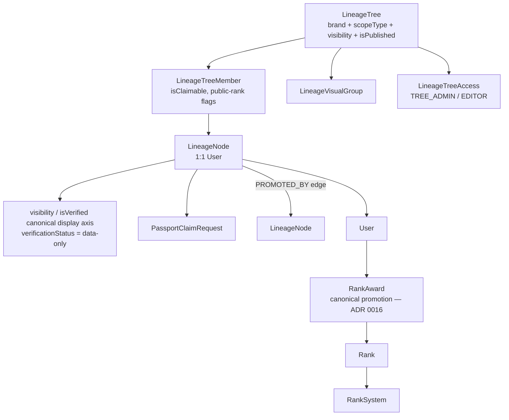
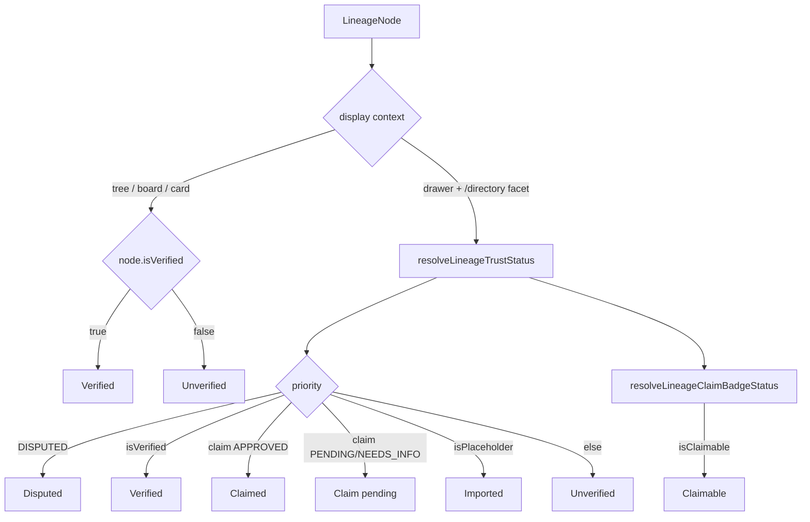
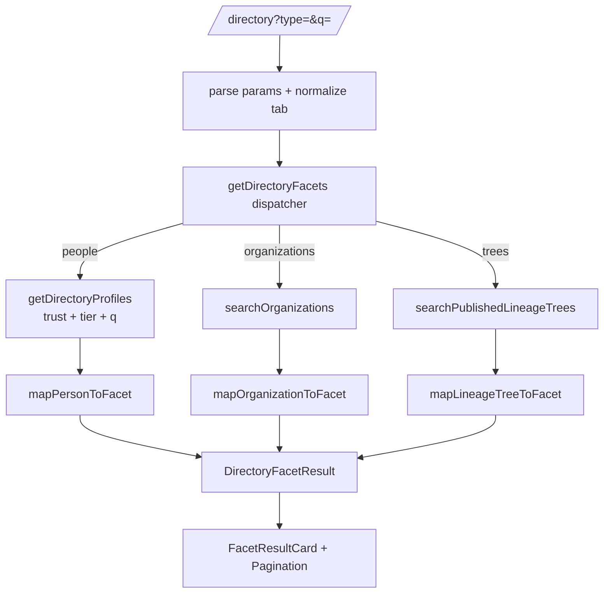
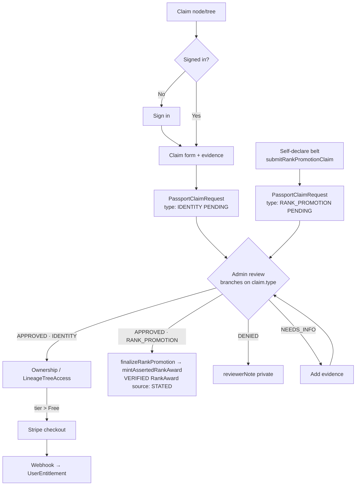

# Lineage Data Flows and Wiring Flows

## Purpose

The lineage peer of [`sop-data-and-wiring-flows.md`](sop-data-and-wiring-flows.md). Document the **lineage +
directory** flows in low-fi ASCII so:

- humans can reason about who-promoted-whom, trust, claims, and discovery without re-reading the schema;
- future agents do not rebuild the genealogy/trust/facet mental model from scratch;
- the **genealogy truth** substrate, the **trust presentation** layer, and the **paid listing** layer stay separate.

> Strategy + monetization for lineage listings lives in
> [`lineage-listing-runbook.md`](../domain-features/lineage-listing-runbook.md). This SOP is the *flow map*: data
> shapes, derivation order, and privacy boundaries.

---

## 1. Lineage genealogy substrate (truth)

```text
LineageTree (brand + scopeType + visibility + isPublished + isClaimable)
  |
  +--> LineageTreeMember (per-tree placement; isClaimable, showRankPublic, showPromotionDatePublic)
  |       |
  |       +--> LineageNode (1:1 User) -------------------+
  |                |                                     |
  |                +--> visibility                       |
  |                +--> isVerified (canonical/only display verification axis — ADR 0035 §5)  |
  |                +--> verificationStatus (per-RankAward enum — DATA only, never displayed)  |
  |                +--> claimRequests [PassportClaimRequest]  (ADR 0036 P5 — person claims unified; LineageClaimRequest retired)
  |                                                       |
  +--> LineageVisualGroup (PROMOTION_DATE / RANK / ...)   |
  +--> LineageTreeAccess (TREE_ADMIN / TREE_EDITOR / ...) |
                                                          v
LineageRelationship (edge: PROMOTED_BY / INSTRUCTOR_STUDENT / ...)
        from LineageNode  --->  to LineageNode
        optional rankAwardId (mirrors the promotion)

User --> RankAward (canonical promotion fact; ADR 0016) --> Rank --> RankSystem
         ^ sources: admin/import  OR  RANK_PROMOTION claim -> approve -> VERIFIED award (B1, ADR 0035 Am.1)
```



### Key rule

`RankAward` is the canonical promotion fact; the `PROMOTED_BY` relationship is a mirror (ADR 0016). Never invert that.

---

## 2. Public visibility + publish resolution

```text
LineageTree                          LineageNode
  visibility: PUBLIC|UNLISTED|          visibility: PUBLIC|UNLISTED|RESTRICTED|PRIVATE
              RESTRICTED|PRIVATE
  isPublished: true ----------+
                              |
                              v
        searchPublishedLineageTrees / public tree viewer
                              |
        where: brand, isPublished=true, visibility in PUBLIC_VISIBILITY_SCOPE
                              |
                              v
        member count counts ONLY PUBLIC-node members
        member NAMES are intentionally excluded from the tree summary
```

### Key rule

Two different visibility enums on purpose: `DirectoryVisibility {HIDDEN, MEMBERS_ONLY, PUBLIC}` (people) is
member-gating; `LineageVisibility {PUBLIC, UNLISTED, RESTRICTED, PRIVATE}` (lineage) is web-style scope. They are not
interchangeable — see drift `D-020`.

---

## 3. Trust + claim status derivation (binary on canvas; multi-state on drawer/directory — ADR 0035 §5, updated SESSION_0474)

Trust badges are **presentation over existing fields** — no trust schema.

**Two display contexts, two models:**

- **Tree / board / cards (the public canvas):** the verification axis is **binary** — `node.isVerified` →
  `Verified` / `Unverified`. The multi-state ladder and the `Claimable` badge were **removed from the canvas**
  (SESSION_0474). `RankAward.verificationStatus` is **vestigial — never displayed** (ADR 0035 §5).
- **Drawer + `/directory` facet only:** the multi-state resolver (`lib/lineage/trust-status.ts`) and the
  `Claimable` badge survive **here** (richer surfaces with room for `Disputed` / `Claimed` / `Claim pending`).

```text
CANVAS (tree / board / card) display axis — binary
--------------------------------------------------
LineageNode.isVerified == true   -> [Verified]
LineageNode.isVerified == false  -> [Unverified]
(no Claimable badge on the canvas; verificationStatus not read)

Belt shown = highest AWARDED rank by Rank.sortOrder
  -> memberTopRank / resolveLineageMemberView  (one resolver, every surface; ADR 0035)

DRAWER + /directory facet ONLY — multi-state resolver survives here
------------------------------------------------------------------
Inputs (already-public fields only)            Priority resolve            Badge
LineageNode.verificationStatus == DISPUTED  -> disputed                 -> [Disputed]
isVerified                                  -> verified                 -> [Verified]
latest claim status == APPROVED             -> claimed                  -> [Claimed]
claim status == PENDING | NEEDS_INFO        -> claim-pending            -> [Claim pending]
User.isPlaceholder == true                  -> imported                 -> [Imported]
(otherwise)                                 -> unverified               -> [Unverified]
Secondary: LineageTreeMember.isClaimable / tree.isClaimable -> claimable -> [Claimable]
```



### Key rule

The public **canvas** verification axis is the single binary `node.isVerified` (ADR 0035 §5); `RankAward.verificationStatus`
is vestigial and never displayed, and the `Claimable` badge is gone from tree/board/cards (drawer + `/directory` only).
Belt = highest **awarded** rank by `Rank.sortOrder` via `memberTopRank` / `resolveLineageMemberView` (one resolver, every
surface). The drawer/directory resolver receives status flags only. Claim **evidence**, claimant notes, reviewer notes, and
reviewer identity are never selected into public payloads.

---

## 4. Faceted `/directory` dispatch (SESSION_0350)

`/directory` is the single public discovery surface. A result-type segmented control picks the facet; each facet keeps
its own privacy-aware query; a presentation-only adapter normalizes the card.

```text
GET /directory?type=people|organizations|trees&q=...
  |
  v
directoryFilterParamsCache.parse  ->  normalizeDirectoryFacetTab(type)  (default people)
  |
  v
getDirectoryFacets({ brand, tab, params, viewer })   (server/web/directory/facets.ts)
  |
  +-- people        -> getDirectoryProfiles  (trust + tier gating + working q)   -> mapPersonToFacet
  +-- organizations -> searchOrganizations   (brand-scoped, q + type + slug)     -> mapOrganizationToFacet
  +-- trees         -> searchPublishedLineageTrees (published + visibility scope) -> mapLineageTreeToFacet
  |
  v
DirectoryFacetResult[]  (id, type, title, href, subtitle, imageUrl/initials, trustStatus, claimStatus, tags, badges)
  |
  v
FacetResultCard (shared)  +  Pagination (orgs/trees)  +  segmented control
  |
  +-- person href        -> /directory/[slug]
  +-- org/school href     -> route BY TYPE: DOJO/SCHOOL/CLUB -> /schools/[slug]; LEAGUE/federation -> /organizations/[slug]
  +-- lineage tree href   -> /lineage/[treeSlug]
```



### Key rule

`DirectoryFacetResult` adds **no schema/enum** — the discriminator is a TS union. The adapter normalizes only card
header fields; it never widens a private field. `/organizations` is retained for affiliations / governing bodies
(e.g. WEKAF), not redirected into `/schools`.

---

## 5. Claim → review → tier (unified PassportClaimRequest for person claims; ProfileClaimRequest for orgs — ADR 0036 P5)

`PassportClaimRequest` carries a `type PassportClaimType {IDENTITY, RANK_PROMOTION}` (migration
`20260701010000_add_passport_claim_type`). **IDENTITY** = the existing account→Passport claim (ADR 0036).
**RANK_PROMOTION** = a belt promotion on an already-owned Passport (ADR 0035 Amendment 1) — approve mints only a
VERIFIED award, no identity attach / comp.

```text
Visitor clicks Claim (node or tree)          Member self-declares a belt (belt journey)
  |                                             |
  v                                             v
Auth check -> sign in if needed              submitRankPromotionClaim (oRPC promotion.submit)
  |                                             |  server/web/claims/submit-rank-promotion-claim.ts
  v                                             v
PassportClaimRequest{type: IDENTITY}         PassportClaimRequest{type: RANK_PROMOTION,
  created (status PENDING) + evidence           claimedRankId, evidence} (status PENDING)
  (both lineage-node + directory-person          (setPassportRank now FILES this claim; it no
   doors write this ONE record, keyed on          longer mints an UNVERIFIED award on self-report)
   passportId. Org claims stay in                |
   ProfileClaimRequest.)                          |
  |                                               |
  +---------------------+-------------------------+
                        v
        Admin / tree-admin review (applyPassportClaimReview branches on claim.type)
          +--> APPROVED (IDENTITY)       -> node ownership OR LineageTreeAccess grant
          +--> APPROVED (RANK_PROMOTION) -> finalizeRankPromotion -> mintAssertedRankAward
          |        (server/admin/lineage/claim-finalize.ts) -> VERIFIED RankAward
          |        {source: STATED, verificationStatus: VERIFIED} — award only, no attach/comp
          +--> DENIED    -> reviewerNote stored (private)
          +--> NEEDS_INFO-> claimant adds evidence -> back to review
          +--> CANCELLED -> claimant withdrew
          |
          v (IDENTITY approved AND tier > Free)
        Stripe checkout (createStripeCheckout) -> webhook -> UserEntitlement tier flag
```



### Key rule

A claim never silently grants tree-wide editor rights. Node claim → node ownership; tree claim → `TREE_EDITOR`
(`TREE_ADMIN` requires explicit brand-admin grant). See lineage-listing-runbook §6.

### Dogfood / operational note (SESSION_0444)

The magic-link claim loop is **proven end-to-end on real prod** (Chayce rehearsal: `--send` → claimed → torn
down; the SESSION_0440 callbackURL fix held, no 403). Dogfood via `setup-test-claimant.ts`.

> **⚠ Teardown gotcha:** `setup-test-claimant.ts --reset` clears a `LineagePendingClaim` binding's `consumedAt`
> but **KEEPS the row**, so it re-fires on next sign-in (a stale `cullet-eric` binding auto-claimed Eric Cullet
> instead of Chayce). **Full teardown must DELETE the `LineagePendingClaim` rows for the dogfood email**, not
> just `--reset`.

---

## 6. Tier / entitlement gating (ADR 0011 / 0019)

```text
Active UserEntitlement keys (paid OR comped — same signal)
  |
  +--> LINEAGE_PREMIUM / LINEAGE_ELITE / LINEAGE_LEGEND
  |
  v
lineage tier policy  ->  free | premium | elite | legend  render policy
  |
  +--> free owner/listing : /directory/[slug] preview only (avatar/name/rank summary)
  +--> premium+           : full profile fields allowed by DirectoryProfile privacy flags
  +--> owner/admin        : full preview without changing anonymous output
```

### Key rule

`Membership.status` is community/admin state and is **not** repurposed for commerce (ADR 0019). Paid feature access is
decided by active `UserEntitlement` rows, never by reading Stripe state or membership lifecycle directly. `basic` is
retired; `legend` is the all-features free-for-life cohort (limited code support so far — broad checkout/webhook/seed is
a follow-up).

---

## 7. Privacy boundaries (never cross these)

```text
Public payloads MAY select:        Public payloads MUST NOT select:
  verificationStatus / isVerified    LineageClaimEvidence (URL/text/media)
  isPlaceholder                      claimant notes
  claim STATUS (enum only)           reviewer notes / reviewer identity
  isClaimable / isPublished          private LineageNode (RESTRICTED/PRIVATE) member names
  discipline / org public names      hidden DirectoryProfile fields (per showX flags)
```

---

## 8. What not to do

- do not rename `LineageNode` / `Tool`; do not duplicate the Stripe path under `/lineage/checkout`.
- do not invert RankAward ↔ PROMOTED_BY (RankAward is canonical, ADR 0016).
- do not add a `DirectoryProfile` trust field — derive trust from the related lineage/claim substrate.
- do not aggregate member verification into a "tree Verified" badge without an explicit design (today trees only expose
  `isClaimable`).
- do not restore `/members` as a public list; do not redirect `/organizations` (affiliations are a distinct purpose).
- do not select claim evidence or reviewer notes into any public payload.

---

## Petey close

Genealogy is the truth, trust is a derived view, and the listing is the storefront. Keep those three boundaries clean
and the lineage system stays honest.

**Planned Passion Produces Purpose.**
**OSSS.**
