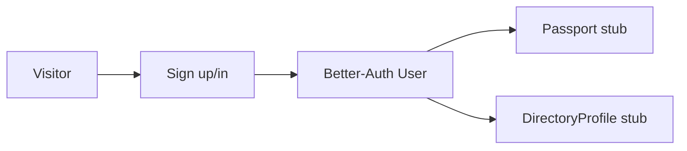
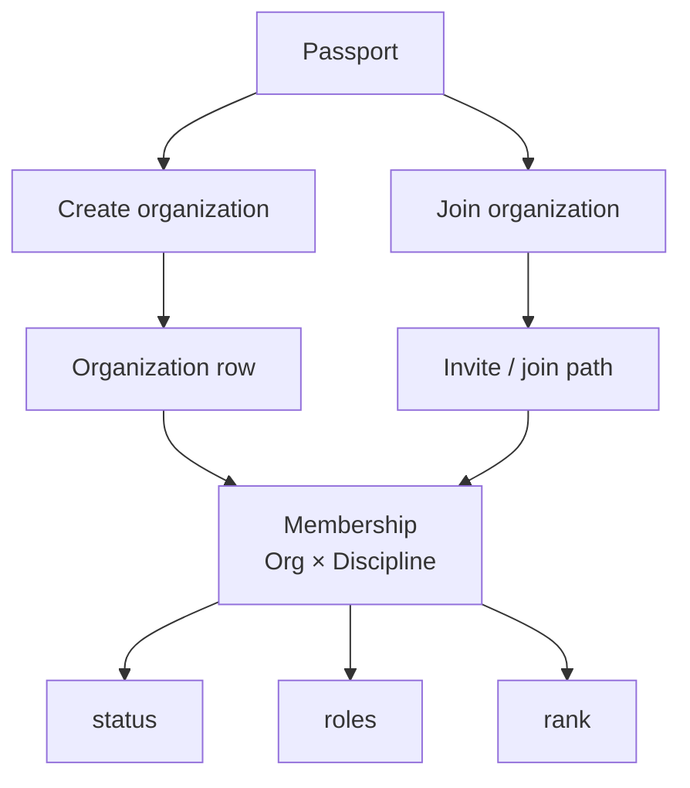
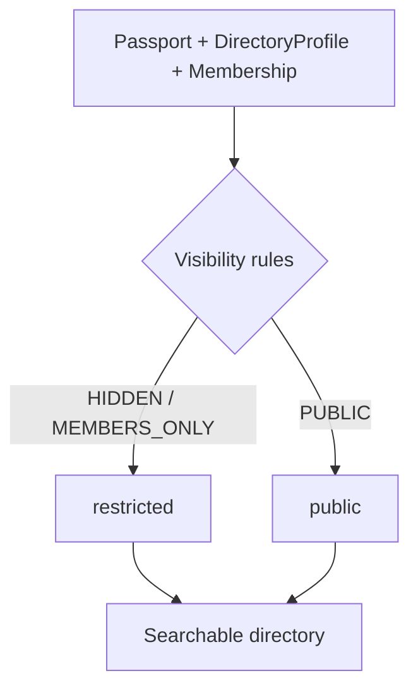
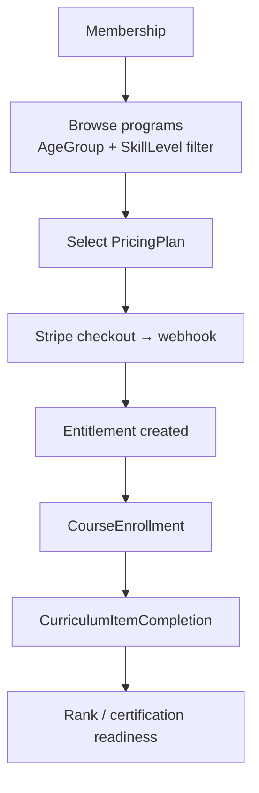
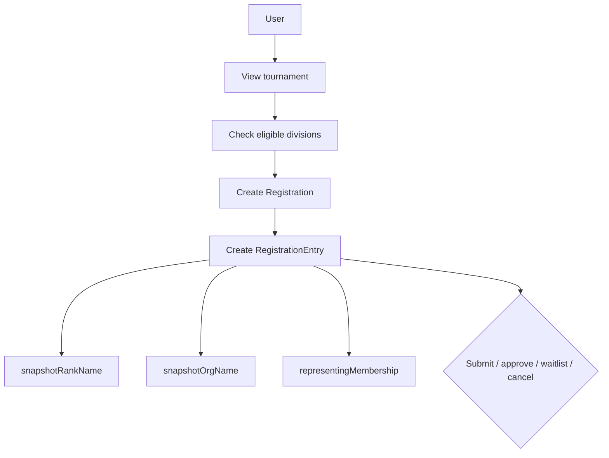
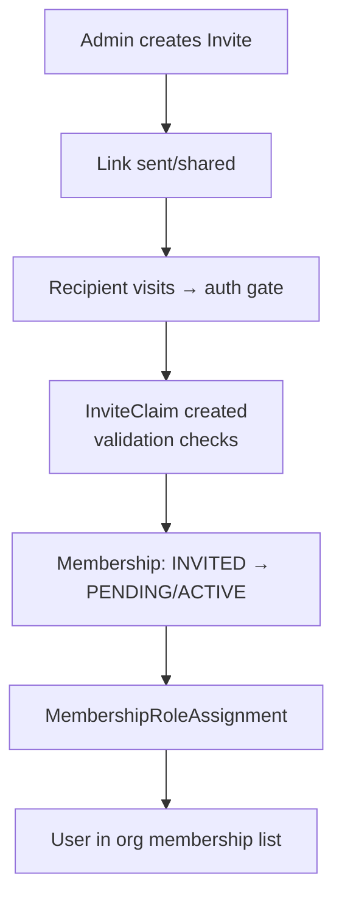
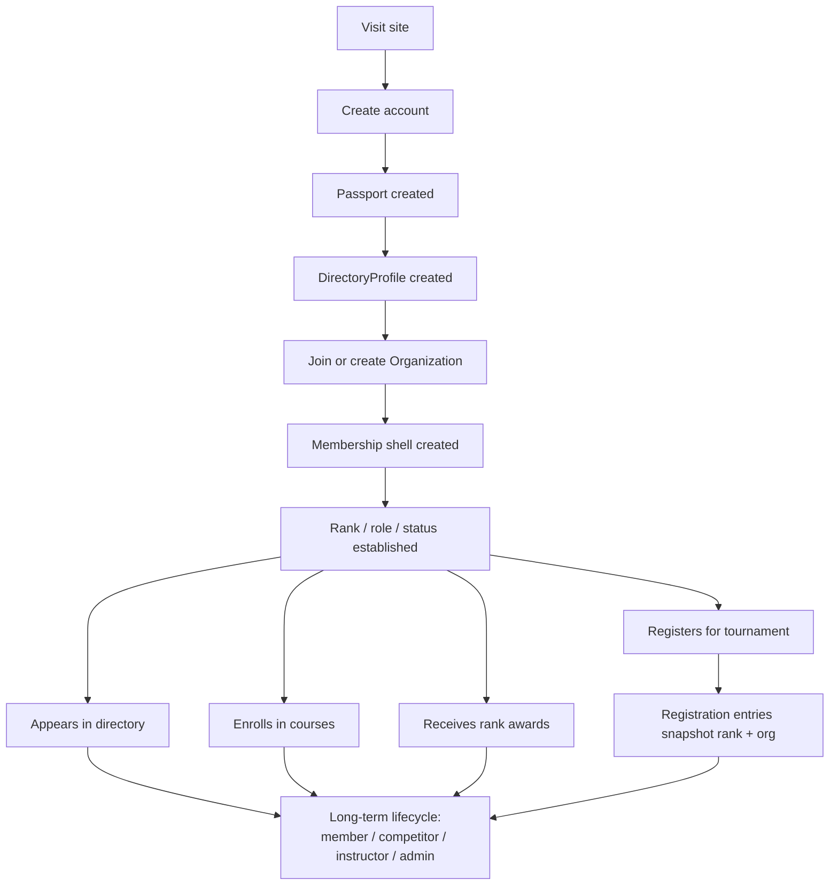
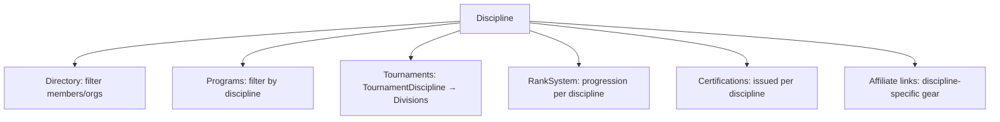

# SOP — End-to-End User Lifecycle

> **⚠ Substrate-change notice (SESSION_0359).** This documents the **current** (pre-SoT-Spec) substrate. The
> target is [`BBL-SOT-Spec.md`](../../product/black-belt-legacy/BBL-SOT-Spec.md): Phases 1–3 replace the
> action/permission layer (oRPC + `can()` + BBL resource-scoped grants), the routes (`/admin`+`/dashboard` →
> `/app`), and root identity on **Passport** (nullable `userId`) — so the §1 "Visitor → account → Passport stub"
> flow inverts to **Passport-first, account-on-claim**. Accurate for today's code — but **check the SoT-Spec
> before building new work** here; this is rewritten as its phase lands.

## Purpose

Show the intended lifecycle from first visit through active membership, training, competition, and publication/state touchpoints.

This is low-fi by design.

---

# 1. Visitor -> account -> identity

```text
+---------+      +-------------+      +------------------+
| Visitor | ---> | Sign up/in  | ---> | Better-Auth User |
+---------+      +-------------+      +------------------+
                                            |
                                            v
                                  +----------------------+
                                  | Passport stub        |
                                  | DirectoryProfile stub|
                                  +----------------------+
```



## Outcome

The user now exists as:

- account
- Passport
- DirectoryProfile

---

# 2. Identity -> organization shell

> **🔒 Security gates (hardened SESSION_0294–0300):**
>
> - Org settings mutations (theme, general-info, members, invites) require `assertOrgAdminAccess(userId, organizationId)` — owner by `ownerId` OR `ORG_ADMIN` role **OR platform admin (`User.role === "admin"`)** — platform admins manage all orgs, incl. WP-imported `ownerId`-null orgs (SESSION_0448).
> - Membership status transitions enforce: cross-org guard, `VALID_TRANSITIONS` state machine, optimistic version locking.
> - Role assignment/removal: org-admin gated, system-role validated, cross-org guarded.
> - Reject (PENDING → delete): hard-deletes the row to avoid `@@unique` collision on re-request. Audit entry written before delete.
> - Dashboard `updateOrganization` consolidated onto same `assertOrgAdminAccess` (D-017, SESSION_0300).
> - **Behaviorally proven:** `server/web/organization/org-management.safe-action.test.ts` (SESSION_0301) — 18 test cases proving unauth rejection, cross-org rejection, and happy paths for all 6 org management actions.

```text
Passport
  |
  +-------------------------------+
  |                               |
  v                               v
Create organization         Join organization
  |                               |
  v                               v
Organization row            Invite / join path
  |                               |
  +---------------+---------------+
                  |
                  v
        Membership (Org x Discipline)
                  |
                  +--> status
                  +--> roles
                  +--> rank
```



## Outcome

The same person now has a contextual shell inside one organization and one discipline.

---

# 3. Directory lifecycle

```text
Passport + DirectoryProfile + Membership
                 |
                 v
         Directory visibility rules
                 |
      +----------+----------+
      |                     |
      v                     v
 hidden / members-only     public
      |                     |
      +----------+----------+
                 |
                 v
          searchable directory
```



## Visibility knobs

- show email?
- show phone?
- show orgs?
- show ranks?

---

# 4. Course / curriculum lifecycle (updated SESSION_0146)

```text
Membership
   |
   v
Browse programs (filtered by AgeGroup + SkillLevel eligibility)
   |
   v
Select PricingPlan (monthly / drop-in / punch card / private lesson / lineage membership)
   |
   v
Payment (Stripe checkout → webhook → entitlement created)
   |
   v
CourseEnrollment
   |
   v
CurriculumItemCompletion
   |
   v
Rank / certification readiness
```



## Outcome

The user can progress in a structured training path.

Stripe does not create or transition `Membership.status`. Per
[`ADR 0019`](../../architecture/decisions/0019-membership-lifecycle-ownership.md),
Membership remains community/admin state; paid access is represented by `UserEntitlement`.

---

# 5. Rank lifecycle

> **⚠ Belt-verification update (SESSION_0486–0490, ADR 0035 Amendment 1).** A **self-declared** belt is
> **no longer written as a `RankAward`.** It files a **PENDING `PassportClaimRequest` of `type: RANK_PROMOTION`**;
> only instructor/admin approval mints a **VERIFIED** `RankAward` (via the existing `mintAssertedRankAward`).
> **The onboarding/belt path never creates an `UNVERIFIED` `RankAward` anymore** — this closed the launch-safety
> hole where a self-declared belt used to surface as the member's rank. `node.isVerified` stays the ONE
> per-member trust flag (ADR 0035 §5 reaffirmed; `RankAward.verificationStatus` is NOT a display axis).

```text
Instructor / org award decision      Member self-declares belt (onboarding wizard)
               |                                     |
               v                                     v
           RankAward (VERIFIED)      PENDING PassportClaimRequest (RANK_PROMOTION)
               |                                     |
               |                     instructor (claim.review) / admin (claims.manage)
               |                     approves in /app/claims → finalizeRankPromotion
               |                                     |
               |                     mintAssertedRankAward → VERIFIED RankAward
               |                     (flips node.isVerified if still unverified —
               |                      first promotion also verifies the person)
               +-----------------+-------------------+
                                 |
                                 v
                       Membership rank updates
                                 |
                                 v
              Directory / tournament eligibility can change
```

## Self-declared belt → verification on-ramp (SESSION_0486–0490)

`setPassportRank` (`server/web/onboarding/actions.ts`) — the profile-enhancement wizard's "declare your
belt" step — files a pending `RANK_PROMOTION` claim via `submitRankPromotionClaim` instead of upserting an
`UNVERIFIED` award. The wizard tells the member "pending verification by your instructor."

Submit guards:

- **Own Passport only** (derived from `userId`).
- Belt must be **above the member's verified ceiling** (`pickTopAwardInDiscipline`).
- **One open promotion at a time.**
- Optional (soft-gate) certificate / instructor-photo evidence.

Approval (`finalizeRankPromotion`) mints the VERIFIED `RankAward` and flips `node.isVerified` if it was
still unverified — first promotion also verifies the person (the SESSION_0474 on-ramp). See
[`petey-plan-0477-belt-journey-crm-epic.md`](../../petey-plan-0477-belt-journey-crm-epic.md) and
[`ADR 0035`](../../architecture/decisions/0035-lineage-rank-display-from-awarded-truth.md) (Amendment 1).

## Important rule

Historic tournament entries must not be rewritten by later rank changes.

---

# 6. Tournament lifecycle

```text
User
 |
 v
View tournament
 |
 v
Check eligible divisions
 |
 v
Create Registration
 |
 v
Create RegistrationEntry
 |
 +--> snapshotRankName
 +--> snapshotOrgName
 +--> representingMembership
 |
 v
Submit / approve / waitlist / cancel
```



---

# 7. Staff / admin lifecycle

```text
User
 |
 v
Membership roles / admin authority
 |
 +--> org admin
 +--> coach
 +--> judge
 +--> owner
 |
 v
TournamentStaffAssignment / admin pages
```

> **Role taxonomy (SESSION_0448).** `User.role` is the Prisma `enum UserRole { user, admin, tournament_director }`. `admin` is the platform super-admin role gating `assertOrgAdminAccess` (and `adminActionClient`) across all orgs.

---

# 8. Subscription / certification lifecycle (extended platform lane)

```text
User
 |
 +--> UserBrandSubscription (site-level FREE/PREMIUM/PRO)
 |
 +--> Certification (issued on rank award, course completion, seminar)
 |      |
 |      +--> status: ACTIVE / EXPIRED / REVOKED
 |      +--> expiresAt (optional)
 |
 v
access / entitlement / proof / expiry states
```

---

# 8b. Invite lifecycle (SESSION_0146)

```text
Admin creates Invite
  |
  +--> org + role + email (optional) + expiry + maxUses
  |
  v
Invite link sent / shared
  |
  v
Recipient visits link → auth gate
  |
  v
InviteClaim created (validates: not expired, not over max, not duplicate)
  |
  v
Membership created (INVITED → PENDING or ACTIVE)
  |
  v
MembershipRoleAssignment (if role specified)
  |
  v
User appears in org membership list
```



---

# 8c. Payment lifecycle (SESSION_0146)

```text
User selects program / lineage membership tier / tournament
  |
  v
PricingPlan lookup (amountCents, Stripe IDs)
  |
  v
Stripe Checkout Session
  |
  +--> success: webhook → grant UserEntitlement
  +--> program-scoped success: webhook → create ProgramEnrollment
  +--> cancel: return to selection
  |
  v
Ongoing: subscription renewals / punch card tracking / expiry
  |
  v
Cancellation: webhook → revoke/sunset subscription-sourced UserEntitlement
```

## Lifecycle variants by pricing model

| PricingModel | Payment type | Ongoing tracking |
| --- | --- | --- |
| MONTHLY / ANNUAL | Recurring subscription | Stripe manages renewals; webhook on cancel |
| DROP_IN | One-time per class | No ongoing tracking |
| PUNCH_CARD | One-time prepay | Session count tracked via Entitlement |
| PRIVATE_LESSON | One-time per lesson | No ongoing tracking |
| FREE_TRIAL | No charge | Expiry date on Entitlement |

Membership status is not owned by Stripe. `Membership.status` is community/admin state; subscription
and purchase access live in `UserEntitlement` and read helpers.

---

# 8d. Punch card / drop-in lifecycle (SESSION_0146)

```text
User purchases punch card (e.g., buy 4 get 5th free)
  |
  v
Entitlement: 5 sessions of Program X
  |
  v
Attend class → ClassAttendance record → decrement
  |
  v
Sessions exhausted → prompt repurchase
```

This differs from monthly members who have unlimited access during their subscription period.

---

# 9. Cross-brand lifecycle

```text
One user
  |
  +--> host brand = BASELINE
  +--> activeBrandId = BASELINE
  |
  +--> may later have other brand memberships
  |
  v
same account, different app context
```

## Key rule

One human can move across brands without needing a separate backend identity.

---

# 10. Content lifecycle touchpoints around a user

```text
User journey
   |
   +--> directory profile
   +--> training history
   +--> tournament participation
   +--> possible content/story features
   |
   v
future content atom references:
- member spotlight
- tournament recap
- curriculum lesson
- lineage story
```

---

# 11. E2E happy-path ASCII journey

```text
Visit site
  |
  v
Create account
  |
  v
Passport created
  |
  v
DirectoryProfile created
  |
  v
Join or create Organization
  |
  v
Membership shell created
  |
  v
Rank / role / status established
  |
  +--> appears in directory (depending on visibility)
  |
  +--> enrolls in courses
  |
  +--> receives rank awards
  |
  +--> registers for tournament
  |
  +--> registration entries snapshot rank + org
  |
  v
long-term member / competitor / instructor / admin lifecycle
```



---

# 12. Failure / edge states to remember

- account exists but Passport stub incomplete
- Passport complete but no Membership yet
- multiple memberships across organizations/disciplines
- host brand ≠ activeBrandId
- rank changed after tournament registration
- directory hidden but membership active
- subscription expired but account still valid
- mobile auth path differs from web until final decision is locked
- punch card exhausted but membership still active
- invite expired or max uses reached
- certification expired but rank still valid
- discipline removed from program after enrollment exists

---

# 13. Listing types and their lifecycles (SESSION_0146)

Different entity types have different listing/submission/approval flows:

```text
Organization listing (school/dojo/gym)
  |
  +--> self-register or admin-create
  +--> claim flow (verify ownership — maps to Dirstarter Tool claiming)
  +--> Free / Premium placement tiers
  +--> appears in directory (filtered by discipline, location)

Course listing
  |
  +--> admin-created under a Program
  +--> public browse (filtered by discipline, AgeGroup, SkillLevel)
  +--> enrollment = paid or free (via PricingPlan)

Program listing
  |
  +--> admin-created under an Organization
  +--> links to Disciplines, AgeGroups, SkillLevels, Courses
  +--> public browse page (not yet built)

Tournament listing
  |
  +--> admin-created
  +--> public view + registration
  +--> divisions filtered by Discipline
  +--> registration fees via PricingPlan

Discipline listing (reference data)
  |
  +--> system-seeded + admin-extensible
  +--> used as filter on directory, programs, tournaments
  +--> no "submission" flow — admin-only
```

## Discipline as a cross-cutting filter



---

# 14. Privacy / DSR lifecycle

Added SESSION_0260 — closes MB-015 (transactional email) SOP gap §14.

```text
Authenticated user
  |
  v
/privacy/request  (auth-gated)
  |
  v
DsrForm: type (EXPORT | DELETE | RECTIFY) + reason
  |
  v
submitDataSubjectRequest action
  +--> create DataSubjectRequest row (status: PENDING)
  +--> after(): notifyUserOfDsrSubmission email
  +--> redirect /privacy/request/submitted
  |
  v
Admin: /admin/privacy/requests
  +--> list filterable by status
  +--> drill in to /admin/privacy/requests/[id]
  |
  v
transitionDataSubjectRequestStatus action
  +--> enforced state machine:
       PENDING       -> IN_PROGRESS | REJECTED
       IN_PROGRESS   -> FULFILLED   | REJECTED
       FULFILLED     -> (terminal)
       REJECTED      -> (terminal)
  +--> after(): notifyUserOfDsrStatusUpdate email (prev -> new + notes)
  |
  v
Fulfillment
  +--> manual external process (export/delete/rectify backend)
  +--> AuditLog row written
  +--> no automated fulfillment yet — manual boundary, tracked separately
```

**Schema reference:**

- `DataSubjectRequest`: `id, userId, type, status, reason, submittedAt, fulfilledAt, fulfilledBy, notes`
- `DataSubjectRequestType`: `EXPORT | DELETE | RECTIFY`
- `DataSubjectRequestStatus`: `PENDING | IN_PROGRESS | FULFILLED | REJECTED`

**Code surfaces:**

- Submit form: `apps/web/app/(web)/privacy/request/page.tsx`
- Submit action: `apps/web/app/(web)/privacy/request/_actions.ts::submitDataSubjectRequest`
- Admin triage: `apps/web/app/admin/privacy/requests/page.tsx` + `[id]/page.tsx`
- Admin transition: `apps/web/server/admin/privacy/actions.ts::transitionDataSubjectRequestStatus`

---

# 15. Lineage lifecycle

Added SESSION_0260. Mirrors §13 (programs/tournaments) for the lineage domain.

```text
User creates LineageNode
  |
  +--> LineageNode row created (tied to passport)
  +--> Lineage tree auto-initialized if first node for the discipline
  |
  v
Privacy settings (per node)
  +--> visibility: PUBLIC | UNLISTED | RESTRICTED | PRIVATE
  +--> RESTRICTED scope = org/tree members; PRIVATE = owner-only
  |
  v
Visibility scope on read
  +--> Unauthenticated viewer:           PUBLIC
  +--> Authenticated, not owner:         PUBLIC + UNLISTED
  +--> Authenticated, org/tree member:   PUBLIC + UNLISTED + RESTRICTED
  +--> Owner:                            ALL
  |
  v
Display surfaces
  +--> lineage-tree-board.tsx        (graph)
  +--> lineage-node-card.tsx         (card cell)
  +--> lineage-profile-drawer.tsx    (detail panel)
  +--> lineage-search.tsx            (directory)
  +--> lineage-listing.tsx           (paginated list)
  +--> discipline-page embedded section
  |
  v
Caching strategy (SESSION_0175)
  +--> Public reads: "use cache" + cacheTag + cacheLife
  +--> Auth-scoped reads: React cache() for request-scoped viewer awareness
```

**Schema reference:**

- `Lineage` model — primary tree container
- `LineageNode` — `userId, visibility, relationships`
- `LineageVisibility`: `PUBLIC | UNLISTED | RESTRICTED | PRIVATE`
- `LineageRelationType`: `INSTRUCTOR_STUDENT | PROMOTED_BY | TOURNAMENT_PARTNER | AFFILIATION | …`
- `LineageVerificationStatus`: `PENDING | VERIFIED | DISPUTED`

**Code surfaces:**

- Queries: `apps/web/server/web/lineage/queries.ts` (`getLineageRootForUser`, `resolveLineageVisibilityScope`)
- Display: `apps/web/components/web/lineage/*`

---

# 16. Transactional email touchpoints

Added SESSION_0260 — canonical map of lifecycle event → template → trigger location.
Maintained as MB-015 closes (`docs/knowledge/wiki/manual-boundary-registry.md`).

Every helper below routes through `apps/web/lib/notifications.ts`, which gates on
`shouldSkipForRateLimit()` (SESSION_0258) for duplicate suppression. Webhook + admin
side-effect emails fire inside `after()` blocks with try/catch so a Resend failure can
never unwind a write or cause an upstream retry.

| # | Lifecycle event | Template | Helper | Trigger location | Recipient |
| --- | --- | --- | --- | --- | --- |
| 1 | DSR submission | `dsr-submission-confirmation.tsx` | `notifyUserOfDsrSubmission` | `app/(web)/privacy/request/_actions.ts::submitDataSubjectRequest` (after) | User |
| 2 | DSR status update | `dsr-status-update.tsx` | `notifyUserOfDsrStatusUpdate` | `server/admin/privacy/actions.ts::transitionDataSubjectRequestStatus` (after) | User |
| 3 | Tool submission | `submission.tsx` | `notifySubmitterOfToolSubmitted` | `server/web/actions/submit.ts` | User |
| 4 | Tool scheduled | `submission-scheduled.tsx` | `notifySubmitterOfToolScheduled` | `app/api/cron/publish-tools/route.ts` + `server/admin/tools/actions.ts::upsertTool` (after) | User |
| 5 | Tool published | `submission-published.tsx` | `notifySubmitterOfToolPublished` | `app/api/cron/publish-tools/route.ts` + `server/admin/tools/actions.ts::upsertTool` (after) | User |
| 6 | Tool premium (submitter) | `submission-premium.tsx` | `notifySubmitterOfPremiumTool` | `server/admin/tools/actions.ts::upsertTool` (after, tier change) | User |
| 7 | Tool premium (admin notice) | `admin-submission-premium.tsx` | `notifyAdminOfPremiumTool` | `server/admin/tools/actions.ts::upsertTool` (after, tier change) | Admin |
| 8 | Merch order confirmation | `merch-order-confirmation.tsx` | `notifyCustomerOfMerchOrder` | `app/api/stripe/webhooks/route.ts::fulfillMerchOrder` (after) | User |
| 9 | Merch shipment | `merch-shipment-notification.tsx` | `notifyCustomerOfShipment` | `app/api/printful/webhooks/route.ts::package_shipped` | User |
| 10 | Printful failure (admin notice) | `merch-shipment-notification.tsx` (reused) | `notifyAdminOfPrintfulFailure` | `app/api/printful/webhooks/route.ts::order_failed / package_returned` | Admin |
| 11 | Membership status change | `membership-status-change.tsx` | `notifyMemberOfMembershipStatusChange` | `server/admin/memberships/actions.ts::transitionMembershipStatus` + `server/web/organization/actions.ts::updateMembershipStatus` (after) | Member |
| 12 | Membership welcome (fresh join) | `membership-welcome.tsx` | `notifyMemberOfMembershipWelcome` | `server/invites/actions.ts::claimInvite` + `server/web/organization/actions.ts::joinByInviteCode/joinOrganization` (after) | Member |
| 13 | Invite | `invite-notification.tsx` | `notifyUserOfInvite` | `server/admin/invites/actions.ts::createInvite` (after) | User |
| 14 | Tournament registration confirmation | `tournament-registration-confirmation.tsx` | `notifyUserOfTournamentRegistration` | `app/api/stripe/webhooks/route.ts::fulfillTournamentRegistration` (after) + `server/admin/tournaments/actions.ts::createWalkInRegistration` (SESSION_0260, after) | User / guest walk-in |

**Boundaries:**

- All helpers fail-open in dev (no Redis → rate-limit treated as not-limited).
- Stripe webhook ack is independent of email success; Resend failures are logged but never trigger Stripe retries (which could double-write the underlying row).
- Admin walk-in tournament registration (#14, SESSION_0260) accepts guest `{email,name}` and auto-stubs a User row inside the transaction; the email reaches the registrant whether they were promoted from a real account or stubbed in.

---

## Petey close

The user lifecycle should feel like one spine, not six disconnected features.

If the journey breaks, the shell model is probably leaking.

**Planned Passion Produces Purpose.**
**OSSS.**
