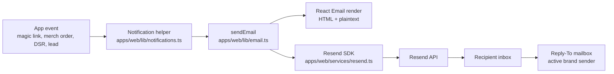
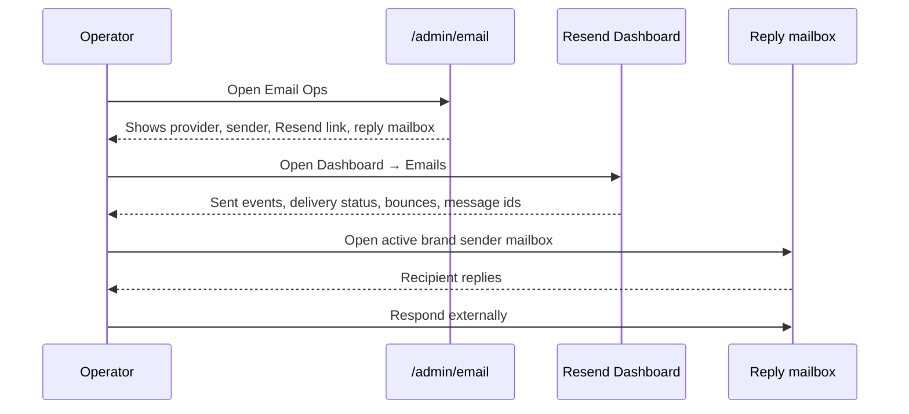

# SOP — Email Operations Runbook

## Summary

Ronin Dojo sends transactional email through Resend. Today the app can **send** transactional email, preview React Email templates locally, and show an admin-facing email operations page at `/admin/email`. It does **not** yet store inbound email replies as app data, so reading delivery events and responding to replies still spans Resend plus the operator mailbox.

## Key Ideas

- The send boundary is `apps/web/lib/email.ts`, which prepares React Email content, resolves brand-aware `from` senders, defaults `replyTo` to that sender, renders plaintext, and calls Resend.
- The Resend client is `apps/web/services/resend.ts` and depends on `RESEND_API_KEY`.
- Email templates live in `apps/web/emails/` and can be previewed with `pnpm --filter @ronin-dojo/web email`.
- Better-Auth magic-link emails resolve their brand from the auth request host and use that same origin in the login URL.
- Delivered email activity is read in **Resend Dashboard → Emails**.
- Replies are read/responded to from the external mailbox for the active brand sender because inbound webhooks/thread storage are not implemented yet.
- `/admin/email` is an operator dashboard surface that explains the current read/reply paths without pretending the app is a full inbox.
- Baseline and Black Belt Legacy use separate senders: `welcome@baselinemartialarts.com` and `welcome@blackbeltlegacy.com`. BBL requires `blackbeltlegacy.com` domain verification in Resend before production sends.

## Current operator answer

```text
Q: Where do emails display?
A: Sent/delivery events display in Resend Dashboard → Emails.
   React Email templates display locally in the React Email preview server.
   App records that caused email may display in their own admin areas
   (Leads, Reports, Tools, DSR/admin flows), but there is no stored mailbox thread.

Q: Where can I read and respond to them?
A: Read delivery status in Resend. Read recipient replies in the external mailbox
   configured as the active brand sender / replyTo. Respond from that mailbox today.
   Use /admin/email as the in-app ops page and /admin/leads follow-ups for CRM notes.
```

## Admin dashboard surface

```text
/admin
  └─ Email Ops (/admin/email)
       ├─ Provider card: Resend + sender configured/missing
       ├─ Brand sender setup: Baseline + Black Belt Legacy sender rows
       ├─ Read delivered emails: Resend Dashboard → Emails
       ├─ Respond to replies: active brand sender mailbox
       └─ Where email lives today table
```

`/admin/email` is intentionally an operations page, not a mailbox. A true inbox requires inbound delivery events or parsed inbound messages to be persisted in the app.

## Data flow — outbound transactional email



## Data flow — reading delivery status today



## Future in-app inbox data flow

```mermaid
flowchart TD
  A[Inbound reply or Resend webhook] --> B[Webhook route]
  B --> C[EmailMessage / EmailThread storage]
  C --> D[Admin Inbox queries]
  D --> E[/admin/inbox or lead detail]
  E --> F[Reply action]
  F --> G[sendEmail with thread Reply-To/In-Reply-To]
```

## ASCII wireframe — future inbox

```text
┌──────────────────────────────────────────────────────────────┐
│ Admin / Inbox                                                │
├────────────────┬─────────────────────────────────────────────┤
│ Threads        │ Message                                     │
│ ┌────────────┐ │ From: student@example.com                   │
│ │ Lead reply │ │ Subject: Question about intro class         │
│ │ DSR status │ │                                             │
│ │ Merch help │ │ [message body]                              │
│ └────────────┘ │                                             │
│                │ Reply                                       │
│                │ ┌─────────────────────────────────────────┐ │
│                │ │ Type response...                        │ │
│                │ └─────────────────────────────────────────┘ │
│                │ [Send reply] [Add internal note]            │
└────────────────┴─────────────────────────────────────────────┘
```

## Operating procedure

### 1. Confirm send configuration

- Check `/admin/email` for sender configured/missing.
- Confirm `RESEND_API_KEY` and `RESEND_SENDER_EMAIL` are populated in the environment.
- For domain/DNS work, use `docs/runbooks/resend-setup-runbook.md`.

### 2. Preview templates locally

```bash
pnpm --filter @ronin-dojo/web email
```

Use this to inspect template rendering. It does not prove production delivery.

### 3. Send or trigger the relevant lifecycle event

Examples:

- Magic link auth email.
- Merch order confirmation through the Stripe/webhook flow.
- DSR submission/status lifecycle email.
- Black Belt Legacy Join the Legacy intake at `/lineage/join`.
- Lead/submission notification where applicable.

### 4. Read delivery evidence

- Open Resend Dashboard → Emails.
- Confirm message status is delivered or inspect bounce/complaint details.
- Record Resend message id when closing a production proof.

### 5. Read and respond to replies

- Open the active brand sender mailbox / the configured reply-to mailbox.
- Respond from that mailbox.
- If the reply is CRM-relevant, add a note/follow-up on the matching lead/admin record.

## Relationships

- [Email Delivery Spec](../../architecture/infrastructure/email-delivery-spec.md)
- [Resend Setup Runbook](../integrations/resend-setup-runbook.md)
- [SOP — E2E User Lifecycle](sop-e2e-user-lifecycle.md)
- [Manual Boundary Registry](../../knowledge/wiki/manual-boundary-registry.md)

## Sources

- `apps/web/lib/email.ts`
- `apps/web/services/resend.ts`
- `apps/web/lib/notifications.ts`
- `apps/web/emails/`
- `apps/web/package.json`
- `apps/web/app/admin/email/page.tsx`
- `docs/architecture/infrastructure/email-delivery-spec.md`
- `docs/runbooks/resend-setup-runbook.md`
- `docs/knowledge/wiki/manual-boundary-registry.md`

## Open Questions

- Should the first in-app inbox attach to `/admin/leads/[id]` as CRM correspondence, or should it be a global `/admin/inbox` for all support/report/DSR/merch replies?
- Should inbound replies be captured through Resend inbound/webhooks, mailbox API polling, or a support-desk integration?
- What retention policy should apply to stored inbound emails if they contain personal data?
