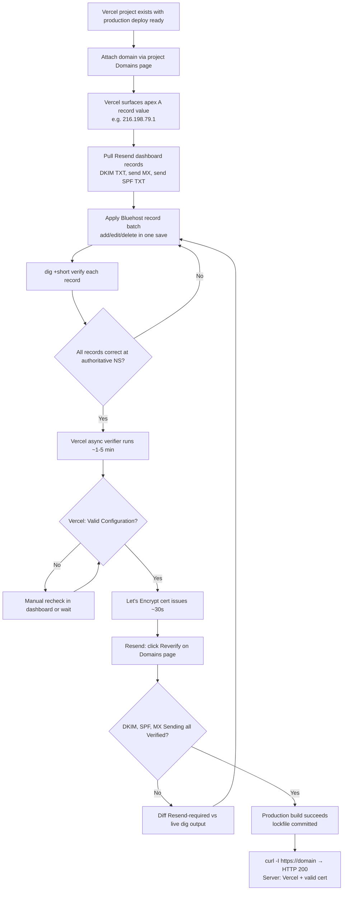

# Vercel Domain Setup Runbook (Bluehost DNS)

Step-by-step operator guide for attaching a new custom domain to a Vercel project while keeping Bluehost as the DNS registrar/host (per ADR 0015). Covers the Vercel attachment, Bluehost record edits, Resend transactional-email record alignment (parallel records share the same zone), verification, and the production-build-readiness gate that's easy to miss.

Codifies the SESSION_0159 procedure for `baselinemartialarts.com` so the remaining three brand domains (`ronindojodesign.com`, `wekafusa.com`, `blackbeltlegacy.com`) reach a verified `https://` serve state without rediscovering the same pitfalls.

## Prerequisites

- Vercel CLI ≥ 53.x installed locally and authenticated (`vercel whoami` returns a username; if it doesn't, run `vercel login` in your own terminal — the device-login flow needs a browser).
- Bluehost account with DNS zone-editor access for the target domain.
- Resend account with the target domain added in **Domains** (only required if the domain sends transactional email).
- A Vercel project to attach the domain to (e.g., `ronin-dojo-baseline`).
- `dig` available locally.
- Repo has a committed lockfile (`pnpm-lock.yaml` for this monorepo) — without one, Vercel falls back to npm install and the production build will silently fail in ~7s with `next: command not found`. See SESSION_0159 for the regression history.

## Architecture Context

```
┌─────────────────────────────────────────────────────────────────────┐
│        DOMAIN AUTHORITY CHAIN (record-based path, ADR 0015)         │
├─────────────────────────────────────────────────────────────────────┤
│                                                                     │
│  .com TLD nameservers                                               │
│       │ NS records → ns1.bluehost.com / ns2.bluehost.com           │
│       ▼                                                             │
│  Bluehost authoritative DNS (the editable zone)                     │
│       │ A     @    → 216.198.79.1     (Vercel edge anycast)        │
│       │ CNAME www  → cname.vercel-dns.com                          │
│       │ MX    @    → inbound-smtp.us-east-1.amazonaws.com (Resend) │
│       │ MX    send → feedback-smtp.us-east-1.amazonses.com         │
│       │ TXT   send → v=spf1 include:amazonses.com ~all             │
│       │ TXT   resend._domainkey → p=MIGfMA0G…IDAQAB (dedicated)    │
│       │ TXT   _dmarc → v=DMARC1; p=none;                           │
│       ▼                                                             │
│  Vercel edge / Resend SES infrastructure (serves traffic + email)   │
│                                                                     │
└─────────────────────────────────────────────────────────────────────┘
```

We explicitly **do not** delegate DNS to Vercel (`ns*.vercel-dns.com`) per ADR 0015. The Vercel dashboard will keep suggesting delegation in an "Intended Nameservers" column — that's a UI default, not a recommendation. Ignore it.

## Current Vercel Truth

Live Dirstarter deployment docs checked on 2026-05-14 describe a Vercel/Next.js deployment with production environment variables. The Ronin production app currently uses the `apps/web` Vercel app root:

| Setting | Current value |
| --- | --- |
| Root Directory | `apps/web` |
| Framework Preset | `Next.js` |
| Output Directory | Next.js default |
| Install Command | `cd ../.. && corepack enable && corepack pnpm@9.0.0 install --frozen-lockfile` |
| Build Command | `cd ../.. && pnpm --filter dirstarter build` |
| Active app-root config | `apps/web/vercel.json` |

Treat any repo-root `vercel.json` guidance as historical/root fallback only. Use it only when the active source for a project proves Vercel is building from the repo root.

## End-to-End Flow



## Canonical Live DNS State (the target)

After all edits propagate, `dig` should match this exactly. Use it as the verification checklist.

```
┌──────────┬───────────────────────┬─────────────────────────────────────────────────────┐
│ Type     │ Host (relative to @)  │ Expected value                                      │
├──────────┼───────────────────────┼─────────────────────────────────────────────────────┤
│ NS       │ @                     │ ns1.bluehost.com / ns2.bluehost.com  (registrar)    │
│ A        │ @                     │ 216.198.79.1                         (Vercel edge)  │
│ CNAME    │ www                   │ cname.vercel-dns.com                 (Vercel www)   │
│ MX 10    │ @                     │ inbound-smtp.us-east-1.amazonaws.com (Resend in)    │
│ MX 10    │ send                  │ feedback-smtp.us-east-1.amazonses.com (Resend out)  │
│ TXT      │ send                  │ v=spf1 include:amazonses.com ~all    (SPF)          │
│ TXT      │ resend._domainkey     │ p=MIGfMA0G… (dedicated DKIM, per-domain)            │
│ TXT      │ _dmarc                │ v=DMARC1; p=none;                    (DMARC base)   │
└──────────┴───────────────────────┴─────────────────────────────────────────────────────┘

Records that MUST be absent:
  - CNAME at resend._domainkey  (blocks the DKIM TXT via CNAME-sibling rule)
  - CNAME at the legacy em host (stale leftover from older Resend setup)
  - Any A   at www              (replaced by the CNAME above)
  - Any A   at @ pointing at Bluehost shared IP (e.g. 66.81.203.198)
```

## Step-by-Step

### 1. Confirm the Vercel project has a production deployment

```
Vercel Dashboard → <team> → <project> → Deployments

Look for a row badged "Production" (not just "Preview").
If every row is "Preview" or every recent row says "Error", STOP HERE
and fix the build first (see "Production Build Readiness" below).
```

A custom domain cannot serve a project that has no successful production deployment — you'll get `HTTP/1.1 404 DEPLOYMENT_NOT_FOUND` even when DNS is perfect.

### 2. Attach the domain to the Vercel project

Use the **project** Domains page (not the team Domains list — they're different URLs):

```
https://vercel.com/<team-slug>/<project-slug>/settings/domains

Click "Add Domain" → enter the apex (e.g. baselinemartialarts.com)
Vercel will display the A record value to set, typically:

  A   @   216.198.79.1     TTL: Auto (or 300)

Repeat: "Add Domain" → www.<domain>. Vercel will offer to set up a
redirect — typical choice is "Redirect to apex". The www record
becomes:

  CNAME   www   cname.vercel-dns.com
```

⚠️ The Vercel CLI's `vercel domains inspect <domain>` will say `[recommended] A 76.76.21.21` regardless of what the dashboard actually surfaces. That's a hardcoded CLI message, not a per-domain check. **Trust the dashboard value** — it's the per-domain authoritative recommendation. Both `216.198.79.1` and `76.76.21.21` are valid Vercel anycast IPs.

### 3. Pull Resend dashboard records (if domain sends email)

```
https://resend.com/domains → <domain> → Records tab

Note the EXACT values for each row marked "Failed" or "Pending":

  ┌──────────┬───────────────────────┬───────────────────────────────────┐
  │ Type     │ Name                  │ Content (click row to expand)     │
  ├──────────┼───────────────────────┼───────────────────────────────────┤
  │ TXT      │ resend._domainkey     │ p=MIGfMA0GCSqG…IDAQAB             │
  │ MX       │ send                  │ feedback-smtp.<region>.amazonses  │
  │ TXT      │ send                  │ v=spf1 include:amazonses.com ~all │
  │ MX 10    │ @                     │ inbound-smtp.<region>.amazonaws   │
  └──────────┴───────────────────────┴───────────────────────────────────┘
```

⚠️ The Resend dashboard truncates long values with `[...]` in the list view. Click each row to expand or open the Configuration tab to copy the full string. The DKIM `p=` value is ~216 chars — copy it once, paste it carefully.

Legacy ownership-token TXT rows and legacy return-path CNAME rows are not part of the verified Baseline setup. If a runbook or spec doc tells you to add them without matching the current Resend dashboard for the domain, that instruction is stale (SESSION_0159_FINDING_01). The dashboard is the source of truth.

### 4. Apply Bluehost DNS edits in one batch

Open the Bluehost DNS zone editor for the domain. Apply the full list below in one save when possible — partial states will fail intermediate verification and add round-trips.

```
Bluehost → Domains → <domain> → DNS

Apply in roughly this order:

  EDIT     A      @                  → 216.198.79.1               TTL Auto
  DELETE   A      www                  (was Bluehost shared IP)
  ADD      CNAME  www                → cname.vercel-dns.com       TTL Auto
  DELETE   CNAME  resend._domainkey    (if present — blocks DKIM TXT)
  REPLACE  TXT    resend._domainkey  → p=MIGfMA0G…IDAQAB          TTL Auto
  ADD      MX     send                → feedback-smtp.us-east-1.amazonses.com   priority 10
  ADD      TXT    send                → v=spf1 include:amazonses.com ~all       TTL Auto
  DELETE   TXT    @  any stale Resend ownership-token row
  DELETE   CNAME  em                   (legacy return-path row, if present)
  KEEP     MX     @ → inbound-smtp.us-east-1.amazonaws.com priority 10
  KEEP     NS     @ → ns1.bluehost.com / ns2.bluehost.com (registrar-level)
```

### Bluehost UI gotchas

- **TXT length:** the DKIM `p=` value is ~216 chars. Bluehost accepts up to 255 in one field. If the UI splits longer values, that's fine — DNS resolvers concatenate adjacent strings.
- **Trailing dots:** Bluehost adds them automatically on CNAMEs. Paste without and verify the saved form.
- **Editing vs deleting:** prefer Edit-in-place over Delete-then-Add when changing a record's value. Some Bluehost UIs let you do this directly from the row's `…` menu.
- **Duplicate rows:** Bluehost won't auto-deduplicate. If you accidentally add two `MX send` rows, both stay live. Use the row search (browser Cmd-F) to find duplicates after a multi-edit save.

### 5. Verify each record at authoritative + cache layers

Run from a terminal (not the Vercel CLI; we want the underlying DNS truth):

```bash
echo "=== APEX ==="
dig +short <domain> A                              # expect: 216.198.79.1
dig +short <domain> NS                             # expect: ns1/ns2.bluehost.com
dig +short <domain> MX                             # expect: 10 inbound-smtp.us-east-1.amazonaws.com

echo "=== WWW ==="
dig +short www.<domain> CNAME                      # expect: cname.vercel-dns.com.

echo "=== SEND (Resend out) ==="
dig +short send.<domain> MX                        # expect: 10 feedback-smtp.us-east-1.amazonses.com.
dig +short send.<domain> TXT                       # expect: "v=spf1 include:amazonses.com ~all"

echo "=== DKIM ==="
dig +short resend._domainkey.<domain> CNAME        # expect: (empty — must NOT have a CNAME)
dig +short resend._domainkey.<domain> TXT          # expect: full p=MIGfMA0G…IDAQAB

echo "=== AUTHORITATIVE (bypass recursive caches) ==="
dig @ns1.bluehost.com <domain> A +short            # should match the dashboard value
dig @1.1.1.1 resend._domainkey.<domain> CNAME      # second opinion via Cloudflare
```

If your local resolver still shows the old CNAME at `resend._domainkey` but Cloudflare and `@ns1.bluehost.com` agree it's gone, the deletion **is** committed at source — recursive resolvers (notably Google `8.8.8.8`) cache DKIM TXT for the full TTL. Resend's verifier queries authoritative servers and will see the clean state regardless.

### 6. Trigger and watch Vercel verification

Vercel's verifier runs asynchronously after attachment. To watch it:

```bash
vercel domains inspect <domain>     # CLI; persistent "not configured" warning is hardcoded text
```

The authoritative status is in the **project Domains page** (`/settings/domains`), not the CLI:

- **Valid Configuration** (green) → DNS resolves correctly + cert issued. Target state.
- **Invalid Configuration** / **Pending** → Vercel can't verify. Common cause is the A record not yet visible at Vercel's verifier (propagation lag, typically <15 min) or the domain attached to the wrong project.

Click the row's refresh button to force an immediate recheck if you don't want to wait.

### 7. Confirm SSL cert + production serve

```bash
# HTTP first (no cert dependency) — checks Vercel routing
curl -sI http://<domain> | head -10
# Expected: HTTP/1.1 200 OK with Server: Vercel

# HTTPS — checks cert issuance + production deploy
curl -sI https://<domain> | head -10
# Expected: HTTP/2 200 (or 308 for apex→www redirect) with Server: Vercel
```

If HTTP returns `404 DEPLOYMENT_NOT_FOUND`, the domain is routed correctly but the project has no successful production deployment. Jump to "Production Build Readiness" below.

If HTTPS errors with `SSL_ERROR_SYSCALL` or connection-reset, the cert hasn't issued yet. Vercel issues Let's Encrypt certs only after a successful production deploy + verified domain. Wait or fix the build.

### 8. Refresh Resend dashboard verification

```
https://resend.com/domains → <domain> → click "Verify" / "Reverify"
```

DKIM, MX Sending, and SPF Sending rows should flip from Failed to Verified within ~60 seconds since Resend queries authoritative servers directly. The MX inbound row (`@` → `inbound-smtp...`) should already be Verified from earlier setup.

## Production Build Readiness

A correctly attached domain serves nothing if the project's production build is broken. The SESSION_0159 regression: every `main` deploy had been failing for ~18 hours because `pnpm-lock.yaml` was not in the repo, so Vercel auto-detected npm and `next: command not found` killed the build.

For a pnpm monorepo on Vercel:

```bash
# Locally
pnpm install                          # generates pnpm-lock.yaml + node_modules
git add pnpm-lock.yaml
git commit -m "chore: commit pnpm-lock.yaml for reproducible Vercel builds"
git push origin main                  # triggers Vercel auto-deploy
```

Verify Vercel picked up pnpm by checking the next build log:

```
✅ Good:  "Installing dependencies..." → "Lockfile is up to date" → multi-minute install
❌ Bad:   "Installing dependencies..." → "up to date in 538ms"  (npm fallback, broken)
```

If pnpm still isn't used despite the lockfile, first confirm the project is using Root Directory `apps/web` and the active `apps/web/vercel.json`. For the current production app, the expected settings are listed in "Current Vercel Truth" above.

A repo-root `vercel.json` is historical/root fallback only. Use this shape only when the project source proves Vercel is building from the repo root:

```json
{
  "installCommand": "corepack enable && pnpm install --frozen-lockfile",
  "buildCommand": "pnpm -r build"
}
```

The `packageManager: "pnpm@9.0.0"` field in `package.json` is not enough on its own — Vercel doesn't enable Corepack by default.

## Troubleshooting

```
┌────────────────────────────────────┬─────────────────────────────────────────────────┐
│ Symptom                            │ Most likely cause + fix                         │
├────────────────────────────────────┼─────────────────────────────────────────────────┤
│ 404 DEPLOYMENT_NOT_FOUND on apex   │ Domain attached at TEAM level, not PROJECT.     │
│ (Server: Vercel)                   │ Add via /<team>/<project>/settings/domains.     │
│                                    │ OR: project has no successful prod build yet.   │
├────────────────────────────────────┼─────────────────────────────────────────────────┤
│ Resend "Missing DKIM record"       │ CNAME at resend._domainkey is still present     │
│ despite TXT being correct          │ and shadowing the TXT (CNAME-sibling rule).     │
│                                    │ DELETE the CNAME; the TXT becomes resolvable.   │
├────────────────────────────────────┼─────────────────────────────────────────────────┤
│ dig shows stale CNAME after delete │ Recursive resolver cache (e.g. Google 8.8.8.8). │
│                                    │ Query @ns1.bluehost.com or @1.1.1.1 instead.    │
│                                    │ Resend's verifier hits authoritative directly.  │
├────────────────────────────────────┼─────────────────────────────────────────────────┤
│ Vercel CLI says "set A 76.76.21.21"│ Hardcoded message — not per-domain advice.      │
│ but dashboard says 216.198.79.1    │ Use the dashboard value. Both work in practice. │
├────────────────────────────────────┼─────────────────────────────────────────────────┤
│ Build fails in ~7s with            │ pnpm-lock.yaml missing → Vercel uses npm        │
│ "next: command not found"          │ install → 0 deps installed. Commit the          │
│                                    │ lockfile. See "Production Build Readiness".     │
├────────────────────────────────────┼─────────────────────────────────────────────────┤
│ HTTPS connection-reset             │ Cert not issued yet. Cert issuance is gated on  │
│ (SSL_ERROR_SYSCALL)                │ verified domain + successful prod build. Fix    │
│                                    │ whichever is missing; wait ~30s after both.     │
├────────────────────────────────────┼─────────────────────────────────────────────────┤
│ Vercel shows "Intended Nameservers"│ Informational only — Vercel's alternative-path  │
│ ns*.vercel-dns.com mismatch ✘      │ delegation suggestion. ADR 0015 forbids it for  │
│                                    │ this repo. Ignore the mismatch indicator.       │
└────────────────────────────────────┴─────────────────────────────────────────────────┘
```

## Brand Rollout

Repeat steps 1–8 for each remaining brand domain as it goes live:

- `ronindojodesign.com` → attach to `ronin-dojo-design` Vercel project
- `wekafusa.com` → attach to `wekafusa` Vercel project
- `blackbeltlegacy.com` → attach to `bbl` Vercel project

Each brand needs its own Resend domain entry and its own dedicated DKIM key — DKIM keys are per-domain by design. Step 3 has to be re-run against each brand's Resend Records page; the SPF and DMARC TXT values are identical across brands but live in each brand's own zone.

## Cross-References

- [SESSION_0159](../sprints/SESSION_0159.md) — execution session this runbook is derived from.
- [Resend Setup Runbook](resend-setup-runbook.md) — Resend account + API key + env var wiring; copy exact DNS records from the per-domain Resend dashboard/API.
- [ADR 0006 — Multi-domain hosting on one Vercel deployment](../architecture/decisions/0006-multi-domain-hosting.md) — why all four brands share one Vercel deployment.
- [ADR 0015 — Domain Hosting Infrastructure](../architecture/decisions/0015-domain-hosting-infrastructure.md) — why Bluehost stays as DNS registrar (record-based path, not delegation).
- [DNS Verification Spec](../architecture/infrastructure/dns-verification-spec.md) — current shared DNS record reference.
- [Graphify Repo Memory Runbook](graphify-repo-memory.md) — cross-domain discovery pattern used during SESSION_0159.
