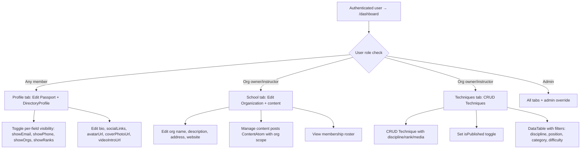

## SESSION 0066 — Petey Plan: Tool→Listing Pattern Repurposing

### Date

2026-05-04

### Operator

Brian Scott + Copilot (Petey)

### Status

in-progress

### Goal

Architect the repurposing of Dirstarter's `Tool` / `[slug]` / `dashboard/listing` pattern into three Ronin Dojo domain listing types: **Technique Listing**, **Public User Profile**, and **School/Org Page**. Produce ADR 0013, full wiki doc with data flow diagrams, lo-fi wireframes, and mermaid charts. Assign Cody execution tasks for future sessions.

### Context read

- ✅ SESSION_0065 — closed-quick. Homepage overhaul complete.
- ✅ Git: `main`, clean working tree.
- ✅ `opening.md` — bow-in ritual followed.
- ✅ `dirstarter-component-inventory.md` — consulted.
- ✅ `dirstarter-docs-inventory.md` — consulted.
- ✅ Dirstarter upstream `[slug]/page.tsx`, `dashboard/listing.tsx`, `dashboard/table.tsx`, `components/web/tools/`, `server/web/tools/` — reviewed.
- ✅ Schema models reviewed: `Technique`, `DirectoryProfile`, `Passport`, `Organization`, `Membership`, `RankAward`, `TechniqueProgress`.

### Dirstarter alignment table

| Field | Answer |
| --- | --- |
| Dirstarter baseline touched | `app/(web)/[slug]/page.tsx`, `app/(web)/dashboard/`, `components/web/tools/`, `components/web/listings/`, `server/web/tools/` |
| Extension or replacement | **Extension** — the L1 Tool/Listing pattern (slug routing, card components, dashboard listing, query/filter system, DataTable) is repurposed for three new domain entity types. The pattern itself is preserved; the data source changes. |
| Why justified | Dirstarter's Tool concept is a generic "directory listing" pattern. Martial arts platforms need the same pattern for Techniques, Profiles, and Schools — each with domain-specific fields and privacy controls. |
| Risk if bypassed | Building listing pages from scratch ignores battle-tested L1 patterns for slug routing, SEO metadata, structured data, search/filter, and dashboard management. |

---

## Petey's Plan — Dirstarter Tool Pattern → Ronin Dojo Listings

### 1. Pattern Analysis: What Dirstarter's "Tool" Actually Is

The Dirstarter `Tool` model + its UI layer form a **generic directory listing pattern**:

```
┌─────────────────────────────────────────────────────────────┐
│  DIRSTARTER TOOL PATTERN (L1)                               │
│                                                             │
│  Data:     Tool model (name, slug, description, status,     │
│            content, faviconUrl, screenshotUrl, categories,   │
│            tags, owner)                                      │
│                                                             │
│  Routes:   /[slug]           → public detail page            │
│            /dashboard        → owner's listing management    │
│            /submit            → submit new listing           │
│            /categories/[slug] → filtered listing             │
│            /tags/[slug]       → filtered listing             │
│                                                             │
│  Server:   server/web/tools/queries.ts  → findTool, etc.    │
│            server/admin/tools/queries.ts → admin CRUD        │
│                                                             │
│  UI:       tool-card, tool-list, tool-listing, tool-query,   │
│            tool-search, tool-filters, tool-actions,          │
│            tool-button, tool-hover-card, tool-entry           │
│                                                             │
│  Dashboard: listing.tsx (DashboardToolListing)               │
│            table.tsx (DashboardTable)                         │
└─────────────────────────────────────────────────────────────┘
```

### 2. Three Ronin Dojo Listing Types

We repurpose this pattern into three domain-specific listing types. Each maps to existing schema models.

```
┌─────────────────────────────────────────────────────────────┐
│  RONIN DOJO LISTING TYPES                                   │
│                                                             │
│  ┌──────────────┐  ┌──────────────┐  ┌──────────────┐      │
│  │  TECHNIQUE   │  │   PROFILE    │  │    SCHOOL    │      │
│  │  LISTING     │  │   LISTING    │  │   LISTING    │      │
│  ├──────────────┤  ├──────────────┤  ├──────────────┤      │
│  │ Technique    │  │ Passport     │  │ Organization │      │
│  │ Discipline   │  │ DirectoryPr. │  │ Membership[] │      │
│  │ Rank range   │  │ RankAward[]  │  │ Discipline[] │      │
│  │ Media[]      │  │ Membership[] │  │ Program[]    │      │
│  │ TechProgress │  │ TechProgress │  │ Technique[]  │      │
│  │ CurrLinks[]  │  │ Org[]        │  │ ContentAtom[]│      │
│  └──────────────┘  └──────────────┘  └──────────────┘      │
│                                                             │
│  Routes:           Routes:           Routes:                │
│  /techniques       /members          /schools               │
│  /techniques/[s]   /members/[s]      /schools/[s]           │
│  /dashboard/techs  /dashboard/prof   /dashboard/school      │
└─────────────────────────────────────────────────────────────┘
```

### 3. Data Flow — Public Listing

```mermaid
graph TD
    A[Visitor hits /techniques/armbar] --> B[Route: app/(web)/techniques/[slug]/page.tsx]
    B --> C[Server query: findTechnique slug=armbar]
    C --> D{Is published?}
    D -->|No| E[404 Not Found]
    D -->|Yes| F[Render TechniqueDetail]
    F --> G[L1 Components: Intro + Card + Badge + Stack]
    F --> H[Domain: discipline badge, rank range, media gallery]
    F --> I[Related techniques via TechniquePrerequisite]
    F --> J[StructuredData for SEO]

    K[Visitor hits /members/johndoe] --> L[Route: app/(web)/members/[slug]/page.tsx]
    L --> M[Server query: findPublicProfile slug=johndoe]
    M --> N{visibility = PUBLIC?}
    N -->|No| O[404 or Members-Only gate]
    N -->|Yes| P[Render ProfileDetail]
    P --> Q[Passport fields filtered by show* flags]
    P --> R[RankAwards, Orgs filtered by showRanks/showOrgs]
    P --> S[TechniqueProgress if user opts in]

    T[Visitor hits /schools/baseline-ma] --> U[Route: app/(web)/schools/[slug]/page.tsx]
    U --> V[Server query: findOrganization slug=baseline-ma]
    V --> W[Render SchoolDetail]
    W --> X[Org info + disciplines + programs + schedule]
    W --> Y[Content posts by org owner/instructors]
    W --> Z[Membership CTA - Join button]
```

### 4. Data Flow — Dashboard Management



### 5. Privacy & Visibility Model

```
┌─────────────────────────────────────────────────────────────┐
│  PRIVACY CONTROLS                                           │
│                                                             │
│  DirectoryProfile.visibility (master switch):               │
│    HIDDEN       → not in /members, not in search            │
│    MEMBERS_ONLY → visible to authenticated members only     │
│    PUBLIC       → visible to everyone                       │
│                                                             │
│  Per-field toggles (only apply when visibility != HIDDEN):  │
│    showEmail    → email on profile page                     │
│    showPhone    → phone on profile page                     │
│    showOrgs     → organization memberships                  │
│    showRanks    → rank awards                               │
│                                                             │
│  Technique.isPublished:                                     │
│    false → draft, only visible to org owner/instructors     │
│    true  → visible on /techniques + school page             │
│                                                             │
│  Organization: always public (directory listing).           │
│    Content posts follow ContentAtom.status workflow.        │
│    Membership roster: visible to members only (future).     │
└─────────────────────────────────────────────────────────────┘
```

### 6. Lo-Fi Wireframes

#### 6a. Technique Detail Page (`/techniques/[slug]`)

```
┌──────────────────────────────────────────────────┐
│ ← Back to Techniques                   [Share]   │
├──────────────────────────────────────────────────┤
│                                                  │
│  ┌────────────────────────────────────────────┐  │
│  │  [Badge: BJJ]  [Badge: Blue–Purple Belt]   │  │
│  │                                            │  │
│  │  Armbar from Guard                         │  │
│  │  (H1 via IntroTitle)                       │  │
│  │                                            │  │
│  │  A fundamental submission from closed      │  │
│  │  guard. Control the arm, hip escape,       │  │
│  │  finish with hips elevated.                │  │
│  │  (IntroDescription)                        │  │
│  └────────────────────────────────────────────┘  │
│                                                  │
│  ┌─────────────┐  ┌─────────────┐               │
│  │ 📹 Video    │  │ 📷 Photo    │               │
│  │  Demo       │  │  Sequence   │               │
│  └─────────────┘  └─────────────┘               │
│                                                  │
│  Details                                         │
│  ├─ Position: Guard (bottom)                     │
│  ├─ Category: Submission                         │
│  ├─ Difficulty: Intermediate                     │
│  ├─ Gi / No-Gi: Both                            │
│  ├─ Requires Partner: Yes                        │
│  └─ Movement: Pull / Hip Escape                  │
│                                                  │
│  Teaching Cues                                   │
│  • Control the wrist                             │
│  • Pinch knees, hip escape                       │
│  • Lift hips for finish                          │
│                                                  │
│  Prerequisites                                   │
│  ┌──────────┐  ┌──────────────┐                  │
│  │ Closed   │  │ Hip Escape   │                  │
│  │ Guard    │→ │ from Guard   │→ [This]          │
│  └──────────┘  └──────────────┘                  │
│                                                  │
│  School: Baseline Martial Arts                   │
│  ──────────────────────────                      │
│  [View School →]                                 │
│                                                  │
└──────────────────────────────────────────────────┘
```

#### 6b. Public User Profile (`/members/[slug]`)

```
┌──────────────────────────────────────────────────┐
│ ← Member Directory                               │
├──────────────────────────────────────────────────┤
│                                                  │
│  ┌──────────────────────────────────────────┐    │
│  │  [Avatar]                                │    │
│  │                                          │    │
│  │  John Doe                                │    │
│  │  📍 Austin, TX                           │    │
│  │  "Training is my therapy."               │    │
│  │                                          │    │
│  │  [Badge: BJJ Purple]  [Badge: Muay Thai] │    │
│  └──────────────────────────────────────────┘    │
│                                                  │
│  Schools                              (if shown) │
│  ┌──────────────┐  ┌──────────────┐              │
│  │ Baseline MA  │  │ ATX Muay     │              │
│  │ Member since │  │ Thai         │              │
│  │ 2024         │  │ Active       │              │
│  └──────────────┘  └──────────────┘              │
│                                                  │
│  Ranks                                (if shown) │
│  ├─ BJJ Purple Belt (awarded 2025-11)            │
│  ├─ Muay Thai Prajioud Level 3 (2025-08)         │
│  └─ Judo Green Belt (2024-06)                    │
│                                                  │
│  Technique Progress                   (if shown) │
│  ├─ 47 techniques logged                         │
│  ├─ 12 verified by instructor                    │
│  └─ [View Technique Log →]                       │
│                                                  │
│  Contact                              (if shown) │
│  ├─ ✉ john@example.com                           │
│  └─ 📞 (512) 555-1234                            │
│                                                  │
└──────────────────────────────────────────────────┘
```

#### 6c. School Page (`/schools/[slug]`)

```
┌──────────────────────────────────────────────────┐
│ ← Schools Directory                              │
├──────────────────────────────────────────────────┤
│                                                  │
│  ┌──────────────────────────────────────────┐    │
│  │  Baseline Martial Arts                   │    │
│  │  DOJO · Austin, TX                       │    │
│  │                                          │    │
│  │  [Badge: BJJ] [Badge: Muay Thai]         │    │
│  │  [Badge: Judo]                           │    │
│  │                                          │    │
│  │  [Join This School]  [Visit Website →]   │    │
│  └──────────────────────────────────────────┘    │
│                                                  │
│  Programs                                        │
│  ┌──────────┐ ┌──────────┐ ┌──────────┐         │
│  │ Adult    │ │ Kids     │ │ Comp     │         │
│  │ BJJ     │ │ Program  │ │ Team     │         │
│  │ Mon/Wed │ │ Tue/Thu  │ │ Fri/Sat  │         │
│  └──────────┘ └──────────┘ └──────────┘         │
│                                                  │
│  Technique Library (12 published)                │
│  ┌──────────┐ ┌──────────┐ ┌──────────┐         │
│  │ Armbar   │ │ Triangle │ │ O-Goshi  │         │
│  │ from Gd  │ │ Choke    │ │          │         │
│  │ ●●○○     │ │ ●●●○     │ │ ●○○○     │         │
│  └──────────┘ └──────────┘ └──────────┘         │
│  [View All Techniques →]                         │
│                                                  │
│  Posts & Updates                                 │
│  ├─ "Tournament Prep Camp — June 2026"           │
│  ├─ "New Kids Program Starting May 15"           │
│  └─ [View All Posts →]                           │
│                                                  │
│  Instructors                                     │
│  ├─ Sensei Brian Scott (Owner) [Profile →]       │
│  └─ Coach Maria Lopez (Instructor) [Profile →]   │
│                                                  │
│  ┌─────────────────────────────────────┐         │
│  │  📍 123 Main St, Austin TX 78701   │         │
│  │  🌐 baselinemartialarts.com        │         │
│  └─────────────────────────────────────┘         │
│                                                  │
└──────────────────────────────────────────────────┘
```

#### 6d. Dashboard — My Profile Tab

```
┌──────────────────────────────────────────────────┐
│  Dashboard                                       │
│  ┌────┐ ┌────────┐ ┌───────┐ ┌──────────┐       │
│  │Prof│ │School  │ │Techn. │ │Content   │       │
│  │ile │ │        │ │       │ │          │       │
│  └────┘ └────────┘ └───────┘ └──────────┘       │
├──────────────────────────────────────────────────┤
│                                                  │
│  Profile Visibility: [PUBLIC ▾]                  │
│                                                  │
│  ┌─ Passport ─────────────────────────────┐      │
│  │ Display Name: [John Doe        ]       │      │
│  │ Bio:          [Training is my...]      │      │
│  │ Avatar:       [Upload]                 │      │
│  │ Social Links: [IG] [YT]               │      │
│  └────────────────────────────────────────┘      │
│                                                  │
│  ┌─ Directory Fields ─────────────────────┐      │
│  │ Location:   [Austin] [TX] [US]         │      │
│  │ Cover Photo: [Upload]                  │      │
│  │ Video Intro: [URL]                     │      │
│  │                                        │      │
│  │ Show on public profile:                │      │
│  │   ☑ Email  ☑ Phone  ☑ Orgs  ☑ Ranks   │      │
│  └────────────────────────────────────────┘      │
│                                                  │
│  [Save Changes]                                  │
│                                                  │
└──────────────────────────────────────────────────┘
```

### 7. Dirstarter Pattern → Ronin Dojo Mapping

| Dirstarter Pattern | Technique Listing | Profile Listing | School Listing |
|---|---|---|---|
| `Tool` model | `Technique` model | `Passport` + `DirectoryProfile` | `Organization` |
| `Tool.slug` | `Technique.slug` (unique per brand+org) | `User.id` or display name slug | `Organization.slug` |
| `Tool.status` (Draft/Published) | `Technique.isPublished` | `DirectoryProfile.visibility` | Always public (org exists = listed) |
| `Tool.categories` | `Technique.discipline` + `.category` | N/A (filter by discipline/rank) | `OrganizationDiscipline[]` |
| `Tool.tags` | `Technique.position`, `movementPattern`, `rangeBand` | N/A | `Organization.type` |
| `Tool.owner` | `Technique.organization.owner` | `User` (self) | `Organization.owner` |
| `[slug]/page.tsx` | `/techniques/[slug]/page.tsx` | `/members/[slug]/page.tsx` | `/schools/[slug]/page.tsx` |
| `dashboard/listing.tsx` | `/dashboard/techniques/` | `/dashboard/profile/` | `/dashboard/school/` |
| `tool-card.tsx` | `technique-card.tsx` | `member-card.tsx` | `school-card.tsx` |
| `tool-query.tsx` | `technique-query.tsx` | `member-query.tsx` | `school-query.tsx` |
| `tool-filters.tsx` | Discipline, position, difficulty, belt range | Location, discipline, rank | Type, discipline, location |
| `findTool()` | `findTechnique()` | `findPublicProfile()` | `findOrganization()` |
| `findTools()` | `findTechniques()` | `findPublicProfiles()` | `findOrganizations()` |

### 8. Authorization Matrix

| Action | Self | Org Owner | Instructor | Admin |
|---|---|---|---|---|
| Edit own Passport | ✅ | — | — | ✅ |
| Edit own DirectoryProfile | ✅ | — | — | ✅ |
| Edit Organization details | — | ✅ | — | ✅ |
| CRUD Techniques (own org) | — | ✅ | ✅ | ✅ |
| Publish Technique | — | ✅ | ✅ | ✅ |
| Create/edit content posts (own org) | — | ✅ | ✅ | ✅ |
| View membership roster | — | ✅ | ✅ | ✅ |
| Edit other user's profile | — | — | — | ✅ |

### 9. Task Decomposition (Cody assignments)

| Task ID | Description | Session | Effort |
|---|---|---|---|
| SESSION_0066_TASK_01 | Create ADR 0013 — Tool→Listing repurposing | 0066 | 10 min |
| SESSION_0066_TASK_02 | Create wiki doc `listing-pattern-repurposing.md` | 0066 | 20 min |
| SESSION_0067_TASK_01 | Server queries: `findTechnique`, `findTechniques`, `findPublicProfile`, `findPublicProfiles`, `findOrganization`, `findOrganizations` | 0067 | 30 min |
| SESSION_0067_TASK_02 | Route: `/techniques` listing page + `/techniques/[slug]` detail page | 0067 | 30 min |
| SESSION_0067_TASK_03 | Route: `/members` directory + `/members/[slug]` profile page | 0067 | 30 min |
| SESSION_0067_TASK_04 | Route: `/schools` directory + `/schools/[slug]` school page | 0067 | 30 min |
| SESSION_0068_TASK_01 | Dashboard: Profile tab (edit Passport + DirectoryProfile) | 0068 | 30 min |
| SESSION_0068_TASK_02 | Dashboard: School tab (edit Organization, manage content) | 0068 | 30 min |
| SESSION_0068_TASK_03 | Dashboard: Techniques tab (CRUD with DataTable) | 0068 | 30 min |
| SESSION_0069_TASK_01 | Card components: `technique-card`, `member-card`, `school-card` | 0069 | 20 min |
| SESSION_0069_TASK_02 | Filter components: technique-filters, member-filters, school-filters | 0069 | 20 min |
| SESSION_0069_TASK_03 | i18n keys for all listing pages | 0069 | 15 min |

### 10. L1 Components to Use (Pre-flight Checklist)

From `dirstarter-component-inventory.md`:

- **Listing pages:** `Intro`/`IntroTitle`/`IntroDescription`, `Card`/`CardHeader`/`CardDescription`, `Grid`, `Stack`, `Badge`, `Avatar`, `Pagination`, `Search`
- **Detail pages:** `Intro`, `Card`, `Badge`, `Stack`, `H3`/`H4`, `Prose`, `Nav` (breadcrumbs), `Section`, `StructuredData`, `Button`
- **Dashboard tabs:** `Form`/`FormField`/`FormItem`/`FormLabel`/`FormControl`/`FormMessage`, `Input`, `TextArea`, `Select`, `Switch` (privacy toggles), `DataTable`/`DataTableHeader`/`DataTableToolbar`, `Tabs` (or nav-based tabs)
- **Dialogs:** `Dialog`, `DeleteDialog`
- ⛔ NO raw `<h1>`, `<input>`, `<select>`, `<form>`, `<table>`, `<div className="grid">`

---

## Task log

- `SESSION_0066_TASK_01` — Create ADR 0013 — ✅ done
- `SESSION_0066_TASK_02` — Create wiki doc — ✅ done

## What landed

- ✅ **Petey plan complete** — Full architectural plan for repurposing Dirstarter's Tool/Listing pattern into Technique, Profile, and School listing types.
- ✅ **ADR 0013** — `docs/architecture/decisions/0013-tool-listing-repurposing.md` — documents the decision to extend (not replace) the L1 listing pattern.
- ✅ **Wiki doc** — `docs/knowledge/wiki/concepts/listing-pattern-repurposing.md` — full data flow, mermaid charts, ASCII wireframes, authorization matrix, privacy model.
- ✅ **Task decomposition** — 12 Cody tasks across sessions 0067–0069 covering server queries, routes, dashboard tabs, card components, filters, and i18n.

## Files touched

| File | Note |
|------|------|
| `docs/sprints/SESSION_0066.md` | This file — Petey plan + session tracking |
| `docs/architecture/decisions/0013-tool-listing-repurposing.md` | New ADR — Tool→Listing pattern repurposing |
| `docs/knowledge/wiki/concepts/listing-pattern-repurposing.md` | New wiki doc — full architecture, data flow, wireframes |
| `docs/knowledge/wiki/index.md` | Updated — backlinks for new wiki doc |

## Decisions resolved

- **Pattern approach:** Extend Dirstarter's Tool/Listing L1 pattern (slug routing, card layout, DataTable dashboard, query/filter system) rather than building from scratch. Tool model stays in schema as reference until prod cleanup (per existing TODO comment).
- **Three listing types:** Technique, Profile, School — each maps to existing schema models with no schema changes needed.
- **Privacy model:** DirectoryProfile.visibility as master switch, per-field `show*` flags filter data at the server query layer (not the component layer). Techniques use `isPublished`. Organizations are always public.
- **Dashboard structure:** Tab-based dashboard with Profile, School, Techniques tabs. Role-gated: all users get Profile; org owners/instructors get School + Techniques.
- **Slug strategy:** Techniques use `brand+org+slug` unique constraint (already in schema). Profiles use user ID or generated slug. Organizations use `slug` (need to add unique constraint per brand — noted as task).

## Open decisions / blockers

- ~~**Profile slug:**~~ ✅ RESOLVED — Add `slug` to `DirectoryProfile`. Operator approved.
- **Organization.slug uniqueness:** Currently not unique per brand. Need `@@unique([brand, slug])` — small migration. Noted for SESSION_0067.
- ~~**Content posts on school page:**~~ ✅ RESOLVED — Add `organizationId` to `ContentAtom`. Operator approved.
- ~~**Dashboard tab nav:**~~ ✅ RESOLVED — **Client-side tabs** (not URL-based). Operator chose for mobile/app feel. Use L1 `Tabs` component or equivalent client-side tab switcher within `/dashboard` page.

## Review log

- `SESSION_0066_REVIEW_01` — Petey plan, ADR 0013, and wiki doc all written. No code changes — planning session only. All artifacts use JETTY 3.0 frontmatter.

## ADR / ubiquitous-language check

- **ADR created:** 0013 — Tool→Listing Pattern Repurposing. No new Dirstarter baseline layers touched (this is an extension pattern, not a modification).
- **No new domain terms.** "Technique", "Profile", "School" are existing ubiquitous language. "Listing" is the Dirstarter term being preserved.

## Reflections

This is a keystone architectural decision. Dirstarter's Tool pattern is the single most reusable L1 artifact in the template — it's essentially a generic directory listing framework with SEO, filtering, dashboard management, and structured data baked in. By mapping our three domain entities onto the same structural pattern, we get:

1. **Consistency** — all three listing types share the same UX patterns (slug routing, card grids, detail pages, dashboard CRUD).
2. **L1 compliance** — we're extending the pattern, not fighting it. Every component maps to an existing L1 component.
3. **Minimal schema work** — the models already exist from S1. We only need 2–3 small migrations (add slug to DirectoryProfile, unique constraint on Org.slug, possibly org scope for ContentAtom).
4. **Clear execution path** — 12 tasks across 3 sessions is achievable and parallelizable.

The privacy model is the most nuanced part. Dirstarter's Tool has a simple Draft/Published lifecycle. Our DirectoryProfile has a three-tier visibility enum plus per-field flags. This means the server query layer must enforce privacy — the component layer just renders what it receives. This is the correct pattern: never trust the client to filter sensitive data.

## Full close evidence

| Step | Proof |
| --- | --- |
| JETTY/frontmatter sweep | SESSION_0066.md, ADR 0013, listing-pattern-repurposing.md — all have JETTY 3.0 frontmatter with correct dates, pairs_with, backlinks |
| Backlinks/index sweep | wiki/index.md updated with new concept doc. ADR 0013 cross-references SESSION_0066 and wiki doc. |
| Wiki lint | No code changes — planning session. Wiki docs are new files with complete frontmatter. |
| Kaizen reflection | Reflections section present: yes |
| Hostile close review | Not applicable — planning session, no code changes |
| Review & Recommend | Next session goal written: yes (SESSION_0067) |
| Memory sweep | New architectural pattern documented. No operator memory update needed — the ADR and wiki doc are the durable artifacts. |
| Next session unblock check | **Unblocked.** All 3 open decisions resolved by operator (profile slug: yes, ContentAtom org scope: yes, dashboard tabs: client-side). SESSION_0067 can proceed directly to execution. |
| Git hygiene | Docs-only session. Files ready to commit. |

## Next session

### SESSION_0067 — Cody: Server Queries + Public Listing Routes

- **Goal:** Implement server queries and public-facing route pages for Techniques, Members, and Schools listings.
- **Agent:** Cody (execute from Petey plan in SESSION_0066)
- **Inputs:** SESSION_0066 (this file), ADR 0013, `listing-pattern-repurposing.md`, Dirstarter `server/web/tools/` as L1 reference, schema.prisma
- **First task:** SESSION_0067_TASK_01 — schema migrations (add slug to DirectoryProfile, @@unique on Org, organizationId on ContentAtom), then server queries.
- **Prerequisite:** All open decisions resolved. Ready to execute.

### Status

in-progress → **closed-full**
